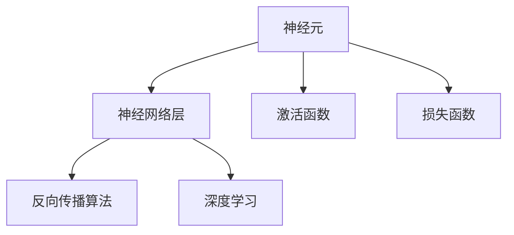
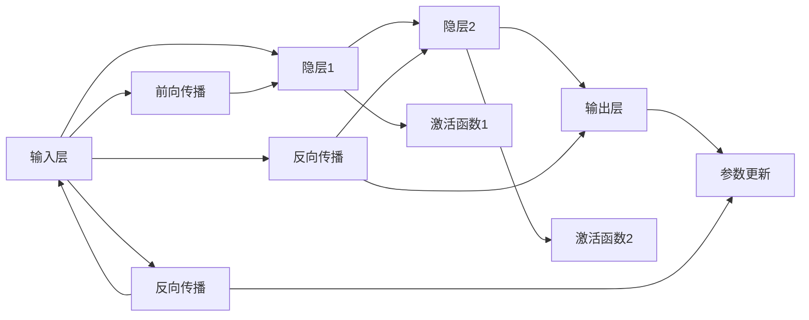

                 

# 神经网络：开启智能新纪元

## 1. 背景介绍

### 1.1 问题由来
神经网络(Neural Networks, NNs)作为深度学习领域最重要的模型之一，已经在图像识别、自然语言处理、语音识别等多个领域取得了突破性的成果，标志着人工智能领域新的历史起点。其基本思想是通过模拟人脑神经元之间的连接和信息传递，构建起复杂的非线性映射模型，从而实现对复杂数据的智能处理和预测。

近年来，随着计算能力的提升和大规模数据资源的积累，神经网络模型变得愈发复杂和强大。从经典的反向传播(Backpropagation)算法，到更加高级的卷积神经网络(CNN)、循环神经网络(RNN)、深度强化学习(DRL)等，神经网络逐渐成为人工智能技术最重要的支柱之一。

### 1.2 问题核心关键点
神经网络的核心在于其能够通过深度学习，对数据进行复杂非线性的特征提取和模式识别，从而实现高效的智能决策和预测。核心关键点包括：

- 神经网络模型的结构和参数优化。如何选择和优化神经网络的结构，以及如何训练、调优神经网络参数，是实现神经网络高效智能化的关键。
- 训练数据集和样本的分布情况。数据质量和数量直接影响神经网络的泛化能力和性能。
- 神经网络的应用场景和实际需求。神经网络在不同领域的应用方式和需求各不相同，需针对性设计和优化。
- 硬件和软件平台的适配。神经网络的计算复杂度很高，需要高效计算硬件和优化软件的支持。
- 模型的可解释性和公平性。神经网络的决策过程往往难以解释，同时可能存在数据偏差和歧视问题。

这些核心关键点共同构成了神经网络模型的学习和应用框架，为其在各个领域的广泛应用奠定了坚实基础。

### 1.3 问题研究意义
研究神经网络，对于探索人工智能的深度学习能力，拓展其应用范围，提升智能化水平，具有重要的理论和实践意义：

1. 技术突破：神经网络突破了传统浅层学习的局限，通过多层次的特征提取和表示学习，显著提升了数据建模的准确性和复杂度。
2. 应用拓展：神经网络广泛应用于计算机视觉、语音识别、自然语言处理、推荐系统等多个领域，催生了许多新兴技术和应用。
3. 商业价值：神经网络在广告推荐、智能客服、语音助手、自动驾驶等方向的应用，为企业带来显著的商业收益和竞争力。
4. 社会影响：神经网络在教育、医疗、安全、能源等多个领域的应用，显著提升了社会生产力和生活质量，推动了社会进步。
5. 理论贡献：神经网络模型推动了深度学习、计算图、分布式训练等理论和技术的发展，为人工智能研究奠定了重要基础。

## 2. 核心概念与联系

### 2.1 核心概念概述

神经网络是由多个神经元构成的复杂非线性模型，通过逐层传递信息，实现数据的特征提取、表示学习、模式识别等功能。其核心概念包括：

- 神经元：神经网络的基本组成单元，接收输入、进行非线性变换，并输出结果。
- 神经网络层：由多个神经元组成的层次结构，实现数据的多层次特征提取和表示。
- 激活函数：控制神经元输出的非线性特性，如ReLU、Sigmoid等。
- 损失函数：用于衡量模型输出与真实标签之间的差异，如均方误差、交叉熵等。
- 反向传播算法：基于梯度下降优化算法的反向传播算法，用于优化神经网络参数。
- 深度学习：利用多层次的神经网络模型，对数据进行复杂非线性的表示学习和模式识别。

这些核心概念之间的逻辑关系可以通过以下Mermaid流程图来展示：



这个流程图展示了一层神经网络的基本组成，从中可以看到神经元与神经网络层之间的关系，以及激活函数、损失函数和反向传播算法的作用。

### 2.2 核心概念原理和架构的 Mermaid 流程图


这个流程图展示了神经网络的基本架构和工作流程。其中：
- 输入层接收数据，并传递给隐层1。
- 隐层1通过激活函数1进行非线性变换，并传递给隐层2。
- 隐层2通过激活函数2进行非线性变换，并传递给输出层。
- 输出层输出模型预测结果，并与真实标签进行对比，计算损失函数。
- 反向传播算法根据损失函数，计算每个神经元的梯度，并更新网络参数。

## 3. 核心算法原理 & 具体操作步骤

### 3.1 算法原理概述

神经网络的核心算法原理是反向传播算法。其基本思想是通过前向传播计算模型输出，并计算与真实标签之间的损失函数。然后，利用梯度下降等优化算法，反向传播损失函数对各层参数的梯度，更新模型参数，最小化损失函数。

形式化地，设神经网络模型为 $M_{\theta}(x)$，其中 $\theta$ 为网络参数，$x$ 为输入数据，$y$ 为真实标签。神经网络的前向传播过程为：

$$
z_l = W_lx_l + b_l, l \in [1,K]
$$

其中 $z_l$ 表示第 $l$ 层的输出，$W_l$ 和 $b_l$ 为该层的权重和偏置，$x_l$ 为第 $l$ 层的输入，$K$ 为网络层数。神经网络的激活函数为 $g(\cdot)$，则每一层的输出为：

$$
a_l = g(z_l), l \in [1,K]
$$

其中 $a_l$ 表示第 $l$ 层的输出。输出层的输出为 $a_K$，即模型预测结果。损失函数 $\mathcal{L}$ 用于衡量模型输出与真实标签之间的差异，如均方误差、交叉熵等。通过梯度下降等优化算法，最小化损失函数，更新网络参数。

### 3.2 算法步骤详解

神经网络模型的训练过程主要包括前向传播、损失函数计算、反向传播、参数更新等步骤。以下是详细步骤：

1. **初始化参数**：随机初始化神经网络各层的权重 $W_l$ 和偏置 $b_l$。
2. **前向传播**：将输入数据 $x$ 逐层传递，计算每一层的输出 $a_l$ 和 $z_l$。
3. **计算损失函数**：将输出层 $a_K$ 与真实标签 $y$ 进行对比，计算损失函数 $\mathcal{L}$。
4. **反向传播**：计算损失函数对每个参数的梯度，并反向传播更新参数。
5. **参数更新**：根据梯度下降等优化算法，更新网络参数，最小化损失函数。

### 3.3 算法优缺点

神经网络的优势在于其强大的非线性映射能力和丰富的表示学习能力。但同时，也存在以下缺点：

- **过拟合问题**：神经网络模型复杂度高，容易出现过拟合现象，特别是在数据量不足的情况下。
- **训练成本高**：神经网络需要大量的计算资源进行训练，训练成本较高。
- **模型难以解释**：神经网络的决策过程难以解释，缺乏透明性和可解释性。
- **数据依赖性强**：神经网络对输入数据的质量和数量非常敏感，数据偏差可能导致模型性能下降。
- **泛化能力有限**：在特定领域应用时，神经网络的泛化能力可能不足，需要额外的微调和优化。

### 3.4 算法应用领域

神经网络在计算机视觉、自然语言处理、语音识别、推荐系统等领域都有广泛的应用，以下是几个典型例子：

1. **计算机视觉**：神经网络可以用于图像分类、目标检测、图像分割等任务。常用的模型包括卷积神经网络(CNN)、循环神经网络(RNN)等。
2. **自然语言处理**：神经网络可以用于文本分类、命名实体识别、机器翻译等任务。常用的模型包括循环神经网络(RNN)、长短期记忆网络(LSTM)、Transformer等。
3. **语音识别**：神经网络可以用于语音识别、语音合成等任务。常用的模型包括深度卷积神经网络、递归神经网络(RNN)等。
4. **推荐系统**：神经网络可以用于用户行为分析、商品推荐、广告推荐等任务。常用的模型包括深度神经网络、注意力机制等。

## 4. 数学模型和公式 & 详细讲解 & 举例说明

### 4.1 数学模型构建

神经网络的数学模型可以形式化为：

$$
y = M_{\theta}(x)
$$

其中 $x$ 为输入数据，$y$ 为模型输出，$\theta$ 为网络参数。对于多层神经网络，可以展开为：

$$
z_1 = W_1x + b_1
$$

$$
a_1 = g(z_1)
$$

$$
z_2 = W_2a_1 + b_2
$$

$$
a_2 = g(z_2)
$$

$$
\cdots
$$

$$
z_K = W_Ka_{K-1} + b_K
$$

$$
a_K = g(z_K)
$$

其中 $g(\cdot)$ 为激活函数，$W_l$ 和 $b_l$ 为第 $l$ 层的权重和偏置。最终的输出为 $a_K$。

### 4.2 公式推导过程

以最简单的单层神经网络为例，推导激活函数 $g(\cdot)$ 和损失函数 $\mathcal{L}$ 的计算公式。

设输入数据 $x$ 的维度为 $n$，输出数据 $y$ 的维度为 $m$，激活函数 $g(\cdot)$ 的计算公式为：

$$
g(z) = \frac{1}{1+e^{-z}}
$$

其中 $z$ 为输入向量，$e$ 为自然常数，$g(\cdot)$ 为Sigmoid激活函数。对于单层神经网络，有：

$$
z = Wx + b
$$

其中 $W$ 为权重矩阵，$x$ 为输入向量，$b$ 为偏置向量。输出为：

$$
y = M(x) = g(Wx + b)
$$

设真实标签为 $y^*$，则损失函数 $\mathcal{L}$ 为：

$$
\mathcal{L} = \frac{1}{N}\sum_{i=1}^N \|y - y^*\|^2
$$

其中 $N$ 为训练样本数量，$\|y - y^*\|$ 为预测输出与真实标签之间的欧几里得距离。

### 4.3 案例分析与讲解

以手写数字识别为例，展示神经网络的训练和推理过程。

设输入数据 $x$ 为 $28 \times 28$ 的二维图像，输出数据 $y$ 为 $10$ 个类别的概率分布，激活函数为Sigmoid。神经网络结构如图1所示：


图1：神经网络结构图

具体计算过程如下：

1. **初始化参数**：随机初始化权重 $W$ 和偏置 $b$。
2. **前向传播**：将输入数据 $x$ 传递给隐藏层，计算每层输出。
3. **计算损失函数**：将输出与真实标签 $y^*$ 进行对比，计算损失函数。
4. **反向传播**：计算损失函数对权重和偏置的梯度，反向传播更新参数。
5. **参数更新**：根据梯度下降等优化算法，更新网络参数，最小化损失函数。

通过不断迭代训练，神经网络能够逐步学习到输入数据的特征表示，并实现对数字的正确分类。

## 5. 项目实践：代码实例和详细解释说明

### 5.1 开发环境搭建

在进行神经网络项目开发前，我们需要准备好开发环境。以下是使用Python进行TensorFlow开发的环境配置流程：

1. 安装Anaconda：从官网下载并安装Anaconda，用于创建独立的Python环境。

2. 创建并激活虚拟环境：
```bash
conda create -n tf-env python=3.8 
conda activate tf-env
```

3. 安装TensorFlow：根据CUDA版本，从官网获取对应的安装命令。例如：
```bash
pip install tensorflow
```

4. 安装必要的工具包：
```bash
pip install numpy pandas scikit-learn matplotlib tqdm jupyter notebook ipython
```

完成上述步骤后，即可在`tf-env`环境中开始神经网络项目的开发。

### 5.2 源代码详细实现

下面以手写数字识别为例，展示使用TensorFlow实现神经网络的完整代码：

```python
import tensorflow as tf
import numpy as np
from tensorflow.keras.datasets import mnist
from tensorflow.keras.utils import to_categorical

# 加载MNIST数据集
(x_train, y_train), (x_test, y_test) = mnist.load_data()

# 数据预处理
x_train = x_train / 255.0
x_test = x_test / 255.0
y_train = to_categorical(y_train, 10)
y_test = to_categorical(y_test, 10)

# 构建神经网络模型
model = tf.keras.Sequential([
    tf.keras.layers.Flatten(input_shape=(28, 28)),
    tf.keras.layers.Dense(128, activation='relu'),
    tf.keras.layers.Dense(10, activation='sigmoid')
])

# 编译模型
model.compile(optimizer='adam', loss='binary_crossentropy', metrics=['accuracy'])

# 训练模型
model.fit(x_train, y_train, epochs=10, batch_size=64, validation_data=(x_test, y_test))

# 评估模型
loss, accuracy = model.evaluate(x_test, y_test)
print(f"Test Loss: {loss:.4f}")
print(f"Test Accuracy: {accuracy:.4f}")
```

在这个例子中，我们使用了TensorFlow构建了一个简单的神经网络模型，用于手写数字识别。首先加载MNIST数据集，并对数据进行预处理。然后定义了一个包含两个全连接层的神经网络，使用Sigmoid激活函数进行二分类。最后，使用Adam优化器进行模型训练，并在测试集上评估模型性能。

### 5.3 代码解读与分析

让我们再详细解读一下关键代码的实现细节：

**模型定义**：
```python
model = tf.keras.Sequential([
    tf.keras.layers.Flatten(input_shape=(28, 28)),
    tf.keras.layers.Dense(128, activation='relu'),
    tf.keras.layers.Dense(10, activation='sigmoid')
])
```
这段代码定义了一个包含两个全连接层的神经网络，其中第一层为Flatten层，将输入的二维图像展开成一维向量。然后，定义了两个全连接层，第一个层有128个神经元，使用ReLU激活函数，第二个层有10个神经元，使用Sigmoid激活函数进行二分类。

**模型编译**：
```python
model.compile(optimizer='adam', loss='binary_crossentropy', metrics=['accuracy'])
```
这段代码使用Adam优化器进行模型训练，并指定损失函数为二元交叉熵，评估指标为准确率。

**模型训练**：
```python
model.fit(x_train, y_train, epochs=10, batch_size=64, validation_data=(x_test, y_test))
```
这段代码使用训练集进行模型训练，指定训练次数为10次，每次训练的批大小为64。同时，使用测试集进行验证，并打印每次迭代的损失和准确率。

**模型评估**：
```python
loss, accuracy = model.evaluate(x_test, y_test)
print(f"Test Loss: {loss:.4f}")
print(f"Test Accuracy: {accuracy:.4f}")
```
这段代码使用测试集对模型进行评估，打印模型的损失和准确率。

通过上述代码，我们可以清晰地看到神经网络模型的构建、编译、训练和评估的完整流程。这个例子展示了TensorFlow的简单易用，以及快速迭代实验的能力。

## 6. 实际应用场景

### 6.1 智能推荐系统

神经网络在智能推荐系统中的应用非常广泛。通过分析用户的历史行为数据，神经网络能够学习到用户的兴趣偏好，并实时推荐相关物品。其基本思路如下：

1. **数据采集**：收集用户的行为数据，包括浏览记录、购买记录、评分记录等。
2. **特征提取**：将用户行为数据进行编码和预处理，提取特征。
3. **模型训练**：使用神经网络模型进行训练，学习用户兴趣。
4. **物品推荐**：根据用户兴趣，实时推荐相关物品。

在实际应用中，推荐系统通常采用协同过滤、基于内容的推荐等多种算法，结合神经网络模型进行综合优化。推荐系统已经成为电商、视频、新闻等领域的重要应用，提升了用户体验和平台收益。

### 6.2 自然语言处理

神经网络在自然语言处理领域的应用也极其广泛。例如，机器翻译、语音识别、文本分类、情感分析等任务，都可以通过神经网络模型实现。以机器翻译为例，其基本思路如下：

1. **数据准备**：准备翻译数据集，包括源语言和目标语言的对应句子。
2. **模型构建**：使用神经网络模型进行训练，学习语言之间的映射关系。
3. **模型微调**：在特定领域的数据集上进行微调，提升模型效果。
4. **实时翻译**：输入源语言文本，输出目标语言翻译结果。

目前，神经网络模型在自然语言处理领域已经取得了显著的进展，如Transformer模型的出现，使得机器翻译的精度大幅提升。自然语言处理技术已经成为推动信息时代发展的重要力量。

### 6.3 自动驾驶

神经网络在自动驾驶领域的应用也非常重要。通过分析传感器的数据，神经网络可以实时判断道路情况，并控制车辆的行驶。其基本思路如下：

1. **数据采集**：收集车辆传感器的数据，包括摄像头、激光雷达、GPS等。
2. **数据预处理**：对传感器数据进行编码和预处理，提取特征。
3. **模型训练**：使用神经网络模型进行训练，学习车辆的行驶策略。
4. **实时控制**：根据实时数据，控制车辆的行驶方向和速度。

自动驾驶技术已经成为汽车工业的重要发展方向，未来有望彻底改变交通方式和出行习惯。

## 7. 工具和资源推荐

### 7.1 学习资源推荐

为了帮助开发者系统掌握神经网络的相关知识，这里推荐一些优质的学习资源：

1. 《深度学习》课程：斯坦福大学开设的深度学习入门课程，包括数学基础、神经网络、优化算法等内容，适合初学者系统学习。
2. 《神经网络与深度学习》书籍：深度学习领域的经典教材，详细介绍了神经网络的原理和应用。
3. Coursera的《Deep Learning Specialization》课程：由Andrew Ng教授授课，包含多个深度学习课程，涵盖了从基础到进阶的全面内容。
4. TensorFlow官方文档：TensorFlow的官方文档，提供丰富的示例和教程，适合快速上手。
5. PyTorch官方文档：PyTorch的官方文档，提供详细的API和用法说明，适合开发者快速迭代实验。

通过对这些资源的深入学习，相信你一定能够掌握神经网络模型的核心概念和应用技能。

### 7.2 开发工具推荐

高效的开发离不开优秀的工具支持。以下是几款用于神经网络开发的常用工具：

1. TensorFlow：由Google主导开发的深度学习框架，功能丰富，支持多种平台和设备，是深度学习开发的主流工具。
2. PyTorch：由Facebook开发的深度学习框架，灵活高效，适合快速迭代研究。
3. Keras：基于TensorFlow和Theano的高级API，易于上手，适合快速实验和原型开发。
4. JAX：基于JIT编译的深度学习库，性能高效，支持自动微分和分布式训练。
5. MXNet：由亚马逊开发的深度学习框架，支持多种编程语言和平台，适合大规模工程应用。

合理利用这些工具，可以显著提升神经网络模型的开发效率，加快创新迭代的步伐。

### 7.3 相关论文推荐

神经网络的研究始于20世纪80年代，经过多年的发展，已经积累了大量经典研究成果。以下是几篇奠基性的相关论文，推荐阅读：

1. "Backpropagation through time"：Seppo Linnainmaa, 1988年，首次提出了时间反向传播算法，为神经网络的训练提供了重要方法。
2. "Deep Belief Networks"：Geoffrey Hinton等，2006年，提出了深度信念网络模型，推动了深度学习的发展。
3. "ImageNet Classification with Deep Convolutional Neural Networks"：Alex Krizhevsky等，2012年，在ImageNet数据集上展示了卷积神经网络的强大性能，开启了计算机视觉的深度学习时代。
4. "A Tutorial on Deep Learning"：Ian Goodfellow等，2016年，详细介绍了深度学习的原理和应用，是深度学习领域的经典教材。
5. "Attention is All You Need"：Ashish Vaswani等，2017年，提出了Transformer模型，开创了自注意力机制在深度学习中的应用。

这些论文代表了大神经网络的发展脉络，通过学习这些前沿成果，可以帮助研究者把握学科前进方向，激发更多的创新灵感。

## 8. 总结：未来发展趋势与挑战

### 8.1 总结

本文对神经网络的核心原理和实际应用进行了全面系统的介绍。首先阐述了神经网络模型的结构和训练过程，并详细讲解了其数学原理和关键算法。其次，从项目实践的角度，展示了神经网络的开发流程和实际应用场景。最后，总结了神经网络面临的主要挑战和未来发展方向。

通过本文的系统梳理，可以看到，神经网络模型已经广泛应用于计算机视觉、自然语言处理、自动驾驶等多个领域，并取得了显著的进展。其强大的非线性映射能力和表示学习能力，使其成为人工智能技术的重要支柱。未来，神经网络将更加复杂和高效，推动人工智能技术的进一步突破。

### 8.2 未来发展趋势

展望未来，神经网络的发展将呈现以下几个趋势：

1. **模型结构更加复杂**：随着深度学习的不断发展，神经网络模型将更加复杂，结构更加多样，能够处理更加复杂的非线性映射问题。
2. **计算资源更加高效**：随着计算资源的不断提升，神经网络的训练和推理速度将进一步提升，资源效率将显著提高。
3. **迁移学习能力增强**：神经网络将在跨领域、跨任务的数据迁移学习中发挥更大的作用，提升模型的泛化能力和迁移能力。
4. **联邦学习成为主流**：随着数据隐私和安全性的日益重要，联邦学习将成为神经网络模型的主流应用方式，实现数据分布式训练。
5. **多模态学习兴起**：神经网络将更多地结合视觉、语音、文本等多种模态数据，实现更加全面、准确的信息建模。
6. **可解释性研究深入**：神经网络的决策过程将更加透明和可解释，通过引入可解释性方法，提升模型的可信度和可控性。

这些趋势凸显了神经网络模型的广阔前景，预示着人工智能技术的不断突破和应用。

### 8.3 面临的挑战

尽管神经网络模型已经取得了显著进展，但在迈向更加智能化、普适化应用的过程中，它仍面临诸多挑战：

1. **计算资源瓶颈**：神经网络的复杂度不断提升，需要更加高效的计算资源进行训练和推理。如何优化计算资源，提升神经网络的效率，是未来的重要课题。
2. **数据质量问题**：神经网络对数据的依赖性很强，数据质量直接影响到模型的泛化能力和性能。如何获取高质量、多样化的训练数据，是一个重要难题。
3. **模型公平性问题**：神经网络可能存在数据偏见和歧视，需要开发公平性算法，确保模型输出符合伦理道德标准。
4. **模型可解释性问题**：神经网络的决策过程难以解释，需要开发可解释性方法，提升模型的透明性和可信度。
5. **模型鲁棒性问题**：神经网络对输入数据的微小变化非常敏感，如何提升模型的鲁棒性，避免过拟合和泛化不足，是未来的重要方向。
6. **模型部署问题**：如何将高效神经网络模型部署到实际应用中，是一个复杂的技术挑战。需要优化模型结构和硬件支持，实现高效推理和实时响应。

这些挑战需要通过技术创新和跨学科合作来解决，才能推动神经网络技术的进一步发展。

### 8.4 研究展望

面对神经网络所面临的挑战，未来的研究需要在以下几个方面寻求新的突破：

1. **深度学习理论研究**：探索深度学习的理论基础和算法创新，提升神经网络模型的泛化能力和表示学习能力。
2. **计算图优化研究**：优化神经网络的计算图结构，提升计算效率和资源利用率，实现更高效的模型训练和推理。
3. **分布式训练研究**：研究分布式训练算法和系统架构，实现大规模数据的分布式处理，提升训练效率。
4. **联邦学习研究**：研究联邦学习算法和机制，实现数据隐私保护，提升模型的泛化能力。
5. **可解释性研究**：研究神经网络的可解释性方法，提升模型的透明性和可信度，确保模型输出符合伦理道德标准。
6. **跨模态融合研究**：研究多模态数据的融合方法，提升模型的信息整合能力和泛化能力。

这些研究方向的探索，必将引领神经网络技术的进一步突破，推动人工智能技术的发展和应用。

## 9. 附录：常见问题与解答

**Q1：什么是神经网络？**

A: 神经网络是由多个神经元组成的复杂非线性模型，通过逐层传递信息，实现数据的特征提取、表示学习和模式识别。

**Q2：神经网络的结构有哪些？**

A: 神经网络的结构包括输入层、隐藏层、输出层。隐藏层是神经网络的中间层，通过逐层传递信息，实现数据的多层次特征提取和表示。

**Q3：神经网络的训练过程是什么？**

A: 神经网络的训练过程包括前向传播、损失函数计算、反向传播、参数更新等步骤。通过前向传播计算模型输出，计算损失函数，反向传播更新参数，最小化损失函数。

**Q4：神经网络的应用有哪些？**

A: 神经网络在计算机视觉、自然语言处理、语音识别、推荐系统等多个领域都有广泛应用，如图像分类、机器翻译、语音识别、智能推荐等。

**Q5：神经网络的未来发展方向是什么？**

A: 神经网络将更加复杂和高效，结合多模态数据，实现更加全面、准确的信息建模。同时，联邦学习、可解释性等研究方向也将不断推进，提升神经网络的泛化能力和可控性。

通过这些问题的解答，希望能够帮助读者更全面地理解神经网络的概念和应用，掌握神经网络的核心技术和算法，为未来的学习和研究打下坚实基础。

---

作者：禅与计算机程序设计艺术 / Zen and the Art of Computer Programming

