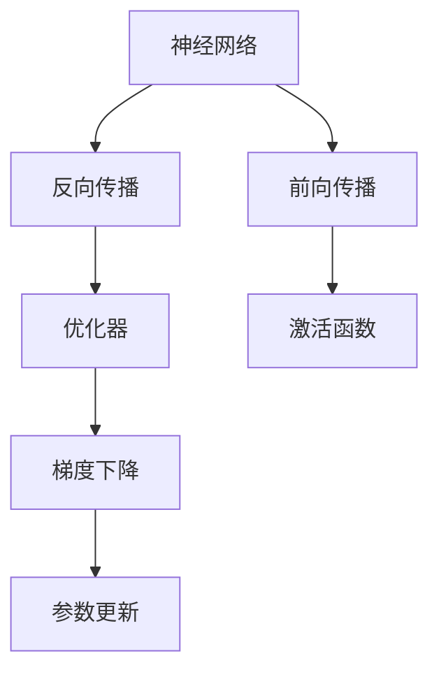

                 

# 神经网络：探索未知的领域

> 关键词：神经网络,深度学习,反向传播,激活函数,优化器,卷积神经网络,循环神经网络,卷积神经网络,深度神经网络,卷积神经网络

## 1. 背景介绍

### 1.1 问题由来

近年来，深度学习技术取得了飞速发展，其中以神经网络为代表的技术，在图像识别、语音识别、自然语言处理等领域取得了显著成果。神经网络不仅能够自动学习复杂特征，还具有极强的泛化能力，因此在各个领域得到了广泛应用。然而，尽管神经网络取得了许多突破，但由于其复杂性和多样性，仍存在很多未知领域值得探索。

### 1.2 问题核心关键点

神经网络的核心在于其通过一系列的线性变换和激活函数来逼近复杂非线性函数，从而实现对数据的自动特征提取和分类。其核心组成部分包括：

- 神经元（Neuron）：神经网络的基本组成单元，通常包括线性变换和激活函数两部分。
- 层（Layer）：神经网络中多个神经元组成的集合，按照特定的顺序排列，每个层负责提取不同层次的特征。
- 激活函数（Activation Function）：用于将神经元的输出进行非线性映射，常用如ReLU、Sigmoid等。
- 优化器（Optimizer）：用于更新神经网络参数的算法，如梯度下降（Gradient Descent）、Adam等。

神经网络的核心算法包括前向传播和反向传播。前向传播将输入数据输入网络，通过一系列线性变换和激活函数计算出输出结果；反向传播则通过输出误差，计算各层参数的梯度，并利用优化器更新参数，使得网络逐渐逼近真实数据分布。

### 1.3 问题研究意义

神经网络在各个领域的应用，对于提高自动化水平、降低成本、提升效率具有重要意义。

- 在图像识别领域，神经网络可以自动学习图像特征，实现高精度的图像分类、目标检测等任务。
- 在语音识别领域，神经网络可以实现高效的语音转文本、语音情感识别等功能。
- 在自然语言处理领域，神经网络可以处理复杂的语言结构和语义信息，实现机器翻译、文本生成、问答等任务。

未来，神经网络的应用将进一步拓展，从传统领域向更多新兴领域渗透，如医疗诊断、金融预测、社交网络分析等，推动人工智能技术向更广泛的应用场景发展。

## 2. 核心概念与联系

### 2.1 核心概念概述

为更好地理解神经网络的基本原理和结构，本节将介绍几个核心概念及其联系：

- 神经网络（Neural Network）：由多个神经元构成的层次结构，可以自动学习输入数据的特征，并通过多层变换逼近复杂函数。
- 反向传播（Backpropagation）：通过输出误差计算各层参数梯度，并利用优化器更新参数的算法。
- 激活函数（Activation Function）：用于对神经元输出进行非线性映射的函数，如ReLU、Sigmoid等。
- 优化器（Optimizer）：用于更新神经网络参数的算法，如梯度下降（Gradient Descent）、Adam等。

这些核心概念之间的逻辑关系可以通过以下Mermaid流程图来展示：



这个流程图展示了几大核心概念之间的逻辑关系：

1. 神经网络通过前向传播计算输出结果。
2. 反向传播通过计算输出误差，更新各层参数。
3. 优化器用于更新参数，以最小化损失函数。
4. 激活函数用于对神经元输出进行非线性映射。

这些概念共同构成了神经网络的整体结构和工作流程，使得神经网络能够自动学习复杂数据特征，实现高效的数据处理和分类。

## 3. 核心算法原理 & 具体操作步骤
### 3.1 算法原理概述

神经网络的核心算法包括前向传播和反向传播。

前向传播（Forward Propagation）是指将输入数据输入神经网络，通过一系列线性变换和激活函数计算输出结果。其数学表达式为：

$$
y = f(Wx + b)
$$

其中，$x$ 为输入向量，$W$ 为权重矩阵，$b$ 为偏置向量，$f$ 为激活函数。

反向传播（Backpropagation）是指通过计算输出误差，更新神经网络各层参数的算法。其核心思想是利用链式法则，将输出误差逐层反向传播，计算各层参数的梯度，并利用优化器更新参数。其数学表达式为：

$$
\frac{\partial L}{\partial w_i} = \frac{\partial L}{\partial z_i} \cdot \frac{\partial z_i}{\partial w_i}
$$

其中，$L$ 为损失函数，$z_i$ 为第$i$层神经元的输出。

### 3.2 算法步骤详解

神经网络的训练过程可以分为以下几个关键步骤：

**Step 1: 准备数据集**
- 收集和标注训练数据集 $D=\{(x_i,y_i)\}_{i=1}^N$，其中 $x_i$ 为输入，$y_i$ 为输出。
- 将数据集划分为训练集、验证集和测试集。

**Step 2: 初始化模型参数**
- 随机初始化神经网络各层参数 $W_i$ 和偏置 $b_i$。

**Step 3: 前向传播和计算损失**
- 将训练集数据前向传播输入神经网络，计算输出结果 $y_i$。
- 计算损失函数 $L(y_i,y_i^*)$，其中 $y_i^*$ 为真实输出。

**Step 4: 反向传播和计算梯度**
- 利用链式法则计算各层参数的梯度 $\frac{\partial L}{\partial w_i}$。
- 将梯度反向传播到各层，更新参数。

**Step 5: 更新模型参数**
- 利用优化器更新模型参数，以最小化损失函数。
- 记录验证集上的性能指标，如准确率、召回率等。

**Step 6: 测试模型性能**
- 在测试集上评估模型性能，对比微调前后的精度提升。

### 3.3 算法优缺点

神经网络算法具有以下优点：
1. 自动学习特征：通过多层非线性变换，可以自动学习数据特征，无需手动提取。
2. 泛化能力强：多层网络可以逼近复杂函数，具有较强的泛化能力。
3. 可扩展性强：通过增加层数和神经元数量，可以扩展网络复杂度。
4. 适应性强：可以应用于图像、语音、自然语言等多个领域。

同时，该算法也存在以下缺点：
1. 数据依赖性强：需要大量标注数据进行训练，对数据质量要求高。
2. 计算量大：网络参数多，训练和推理时间较长。
3. 模型复杂度高：网络结构复杂，调试和优化难度大。
4. 局部最优：容易陷入局部最优解，需要多次训练和调参。

尽管存在这些缺点，但神经网络算法凭借其强大的特征提取能力和泛化能力，仍然成为了当前深度学习的主流范式。未来，相关研究的重点在于如何进一步降低数据依赖性，提高模型可解释性和泛化性。

### 3.4 算法应用领域

神经网络算法在各个领域得到了广泛应用，以下是几个典型应用场景：

- 图像识别：如图像分类、目标检测等，通过卷积神经网络（CNN）进行特征提取和分类。
- 语音识别：如语音转文本、语音情感识别等，通过卷积神经网络或循环神经网络（RNN）进行特征提取和分类。
- 自然语言处理：如机器翻译、文本生成等，通过递归神经网络（RNN）或Transformer等模型进行特征提取和分类。
- 推荐系统：如个性化推荐、广告投放等，通过协同过滤和神经网络结合的方式进行特征提取和分类。
- 金融预测：如股票价格预测、信用风险评估等，通过神经网络进行特征提取和分类。

这些应用场景展示了神经网络算法在各个领域的强大适用性，未来随着算法和硬件的不断进步，神经网络算法将进一步拓展到更多新兴领域，为人工智能技术的发展提供新的动力。

## 4. 数学模型和公式 & 详细讲解 & 举例说明

### 4.1 数学模型构建

在神经网络中，通常采用多层感知机（Multilayer Perceptron, MLP）进行建模。MLP模型由多个全连接层（Fully Connected Layer）组成，每个层由多个神经元构成。数学表达式如下：

$$
y_i = f(W_ix_i + b_i)
$$

其中，$x_i$ 为输入向量，$W_i$ 为权重矩阵，$b_i$ 为偏置向量，$f$ 为激活函数。

神经网络的损失函数一般采用交叉熵损失函数（Cross-Entropy Loss），其数学表达式为：

$$
L(y_i,y_i^*) = -\frac{1}{N}\sum_{i=1}^N(y_i^*\log y_i + (1-y_i^*)\log(1-y_i))
$$

其中，$y_i$ 为模型输出，$y_i^*$ 为真实输出。

### 4.2 公式推导过程

以下我们将以一个简单的二分类任务为例，推导神经网络的训练过程。

假设输入数据 $x$，真实输出 $y^*$，模型输出 $y$。

前向传播计算输出：

$$
y = f(Wx + b)
$$

计算损失函数：

$$
L(y,y^*) = -\frac{1}{N}\sum_{i=1}^N(y_i^*\log y_i + (1-y_i^*)\log(1-y_i))
$$

利用链式法则计算参数梯度：

$$
\frac{\partial L}{\partial w_i} = \frac{\partial L}{\partial z_i} \cdot \frac{\partial z_i}{\partial w_i}
$$

其中，$z_i=f(W_ix_i + b_i)$，$\frac{\partial z_i}{\partial w_i}=x$。

利用反向传播算法更新参数：

$$
w_i = w_i - \eta \frac{\partial L}{\partial w_i}
$$

其中，$\eta$ 为学习率。

### 4.3 案例分析与讲解

**案例分析：手写数字识别**

假设我们需要训练一个手写数字识别模型，数据集为MNIST，其中每个样本为28x28的灰度图像，需要进行0-9的数字分类。

- 数据准备：将MNIST数据集划分为训练集、验证集和测试集，并对其进行归一化处理。
- 模型设计：使用一个包含两个隐藏层的全连接神经网络，每个隐藏层包含500个神经元。
- 激活函数：使用ReLU作为激活函数。
- 优化器：使用Adam优化器，学习率为0.001。
- 损失函数：使用交叉熵损失函数。

通过前向传播和反向传播训练模型，不断更新权重和偏置，直到模型在验证集上的准确率达到90%以上。

## 5. 项目实践：代码实例和详细解释说明
### 5.1 开发环境搭建

在进行神经网络实践前，我们需要准备好开发环境。以下是使用Python进行TensorFlow开发的环境配置流程：

1. 安装Anaconda：从官网下载并安装Anaconda，用于创建独立的Python环境。

2. 创建并激活虚拟环境：
```bash
conda create -n tf-env python=3.8 
conda activate tf-env
```

3. 安装TensorFlow：根据CUDA版本，从官网获取对应的安装命令。例如：
```bash
conda install tensorflow
```

4. 安装各类工具包：
```bash
pip install numpy pandas scikit-learn matplotlib tqdm jupyter notebook ipython
```

完成上述步骤后，即可在`tf-env`环境中开始神经网络实践。

### 5.2 源代码详细实现

这里我们以手写数字识别为例，给出使用TensorFlow进行神经网络训练的代码实现。

首先，定义神经网络模型：

```python
import tensorflow as tf

class NeuralNetwork(tf.keras.Model):
    def __init__(self, units):
        super(NeuralNetwork, self).__init__()
        self.flatten = tf.keras.layers.Flatten()
        self.dense1 = tf.keras.layers.Dense(units, activation='relu')
        self.dense2 = tf.keras.layers.Dense(10, activation='softmax')

    def call(self, x):
        x = self.flatten(x)
        x = self.dense1(x)
        x = self.dense2(x)
        return x
```

然后，定义优化器和损失函数：

```python
model = NeuralNetwork(units=500)
optimizer = tf.keras.optimizers.Adam(learning_rate=0.001)
loss_fn = tf.keras.losses.SparseCategoricalCrossentropy()
```

接着，定义训练和评估函数：

```python
def train_step(x, y):
    with tf.GradientTape() as tape:
        y_pred = model(x)
        loss_value = loss_fn(y, y_pred)
    gradients = tape.gradient(loss_value, model.trainable_variables)
    optimizer.apply_gradients(zip(gradients, model.trainable_variables))
    return loss_value

def evaluate(model, test_images, test_labels):
    correct_predictions = 0
    total_predictions = 0
    for x, y in test_images:
        y_pred = model(x)
        predicted_label = tf.argmax(y_pred, axis=1)
        total_predictions += 1
        correct_predictions += (predicted_label == y).count()
    accuracy = correct_predictions / total_predictions
    return accuracy
```

最后，启动训练流程并在测试集上评估：

```python
batch_size = 32
epochs = 20
train_dataset = tf.data.Dataset.from_tensor_slices((train_images, train_labels)).batch(batch_size)
test_dataset = tf.data.Dataset.from_tensor_slices((test_images, test_labels)).batch(batch_size)

for epoch in range(epochs):
    for batch_images, batch_labels in train_dataset:
        loss_value = train_step(batch_images, batch_labels)
        if (epoch+1) % 10 == 0:
            print(f'Epoch {epoch+1}, Loss: {loss_value:.4f}')
    accuracy = evaluate(model, test_images, test_labels)
    print(f'Epoch {epoch+1}, Test Accuracy: {accuracy:.4f}')
```

以上就是使用TensorFlow进行手写数字识别神经网络训练的完整代码实现。可以看到，得益于TensorFlow的高层次抽象，我们可以用相对简洁的代码实现复杂的神经网络模型和训练流程。

### 5.3 代码解读与分析

让我们再详细解读一下关键代码的实现细节：

**NeuralNetwork类**：
- `__init__`方法：初始化网络结构，包括输入层、两个隐藏层和输出层，激活函数为ReLU和softmax。
- `call`方法：定义网络的前向传播过程，通过多个全连接层进行特征提取和分类。

**优化器和损失函数**：
- `optimizer`：定义优化器，使用Adam算法，学习率为0.001。
- `loss_fn`：定义损失函数，使用交叉熵损失函数。

**训练和评估函数**：
- `train_step`：定义单步训练过程，计算损失和梯度，并更新模型参数。
- `evaluate`：定义模型在测试集上的评估函数，统计准确率。

**训练流程**：
- 设置批量大小和训练轮数，循环迭代
- 每个epoch内，在训练集上训练，输出损失
- 在测试集上评估，输出测试准确率

可以看到，TensorFlow的高级API使得神经网络模型的搭建和训练变得非常简便，开发者可以更加专注于算法和模型设计的细节，而不必过多关注底层实现。

## 6. 实际应用场景
### 6.1 智能推荐系统

智能推荐系统是神经网络算法的重要应用场景之一。通过神经网络算法，可以从用户的浏览记录、评分、行为数据中学习用户兴趣，生成个性化推荐内容，提升用户体验。

在实际应用中，可以使用多层神经网络对用户行为数据进行建模，预测用户对不同物品的评分和兴趣，从而实现个性化推荐。此外，还可以引入协同过滤等方法，进一步提升推荐精度。

### 6.2 医疗诊断系统

神经网络算法在医疗领域也有着广泛的应用，可以用于疾病诊断、病理分析、影像识别等任务。通过学习大量医学数据，神经网络能够自动识别疾病特征，辅助医生进行诊断和治疗。

在实际应用中，可以使用卷积神经网络（CNN）对医学影像进行特征提取和分类，识别病变区域和异常形态，从而提高诊断效率和准确率。此外，还可以引入深度学习模型进行疾病预测和风险评估，为医学研究和临床实践提供支持。

### 6.3 金融预测系统

神经网络算法在金融领域也有着重要应用，可以用于股票价格预测、信用风险评估、市场分析等任务。通过学习大量金融数据，神经网络能够自动识别市场趋势和风险因素，辅助金融决策和风险控制。

在实际应用中，可以使用循环神经网络（RNN）对股票价格进行预测，利用LSTM等模型处理时间序列数据，提高预测精度。此外，还可以引入深度学习模型进行信用评分和风险评估，为金融机构提供决策支持。

### 6.4 未来应用展望

随着神经网络算法的不断发展，未来的应用将更加广泛，涵盖更多新兴领域，如智能制造、智慧城市、社会治理等。

- 在智能制造领域，神经网络可以用于设备故障预测、工艺优化、质量检测等任务，推动制造业智能化转型。
- 在智慧城市领域，神经网络可以用于交通流量预测、智能调度、环境监测等任务，提升城市管理水平。
- 在社会治理领域，神经网络可以用于舆情分析、犯罪预测、公共安全等任务，保障社会稳定和公共安全。

未来，神经网络算法将在更多领域发挥重要作用，推动人工智能技术向更广泛的应用场景发展。

## 7. 工具和资源推荐
### 7.1 学习资源推荐

为了帮助开发者系统掌握神经网络理论基础和实践技巧，这里推荐一些优质的学习资源：

1. 《深度学习》系列课程：由斯坦福大学Andrew Ng教授主讲，系统讲解了深度学习的基础理论和经典模型，适合初学者入门。
2. 《神经网络与深度学习》书籍：由Michael Nielsen所著，全面介绍了神经网络和深度学习的数学原理和实践方法，适合进阶学习。
3. TensorFlow官方文档：提供了丰富的学习资料和样例代码，适合深入学习和实践。
4. PyTorch官方文档：提供了详细的API文档和样例代码，适合学习和实践。
5. Kaggle平台：提供了大量数据集和比赛，可以练习和验证神经网络模型性能。

通过对这些资源的学习实践，相信你一定能够快速掌握神经网络算法的精髓，并用于解决实际的深度学习问题。

### 7.2 开发工具推荐

高效的开发离不开优秀的工具支持。以下是几款用于神经网络开发和训练的常用工具：

1. TensorFlow：由Google主导开发的深度学习框架，支持多种模型和算法，适合大规模工程应用。
2. PyTorch：由Facebook开发的深度学习框架，支持动态计算图，适合研究和实验。
3. Keras：基于TensorFlow和Theano的高级API，支持多种模型和算法，适合快速开发和实验。
4. MXNet：由Apache维护的深度学习框架，支持多种模型和算法，适合大规模工程应用。
5. JAX：基于JIT编译和自动微分技术的深度学习框架，支持动态计算图和静态计算图，适合研究和实验。

合理利用这些工具，可以显著提升神经网络模型的开发效率，加快创新迭代的步伐。

### 7.3 相关论文推荐

神经网络算法的发展离不开学界的持续研究。以下是几篇奠基性的相关论文，推荐阅读：

1. The Deep Learning Book：深度学习领域的经典教材，全面介绍了深度学习的基础理论和算法，适合深度学习从业者。
2. ImageNet Classification with Deep Convolutional Neural Networks：Hinton等人提出的经典论文，介绍了卷积神经网络在图像分类中的应用，奠定了深度学习在计算机视觉领域的发展基础。
3. Learning Phrases, Words, and Sentences from Plain Text：Goodfellow等人提出的经典论文，介绍了递归神经网络在自然语言处理中的应用，推动了深度学习在NLP领域的发展。
4. Deep Architectures for Sentiment Analysis：Zou等人提出的经典论文，介绍了基于卷积神经网络和LSTM的情感分析模型，提升了深度学习在情感分析领域的效果。
5. Attention is All You Need：Vaswani等人提出的经典论文，介绍了Transformer模型在自然语言处理中的应用，推动了深度学习在NLP领域的发展。

这些论文代表了大规模神经网络算法的发展脉络。通过学习这些前沿成果，可以帮助研究者把握学科前进方向，激发更多的创新灵感。

## 8. 总结：未来发展趋势与挑战
### 8.1 总结

本文对神经网络算法的核心原理和操作步骤进行了全面系统的介绍。首先阐述了神经网络算法的研究背景和意义，明确了其在图像识别、语音识别、自然语言处理等领域的重要应用。其次，从原理到实践，详细讲解了神经网络模型的构建和训练过程，给出了神经网络训练的完整代码实例。同时，本文还广泛探讨了神经网络算法在智能推荐、医疗诊断、金融预测等多个行业领域的应用前景，展示了神经网络算法的强大适用性。最后，本文精选了神经网络算法的各类学习资源，力求为读者提供全方位的技术指引。

通过本文的系统梳理，可以看到，神经网络算法在各个领域的应用，对于提高自动化水平、降低成本、提升效率具有重要意义。未来，神经网络算法将在更多领域得到应用，为人工智能技术的发展提供新的动力。

### 8.2 未来发展趋势

展望未来，神经网络算法将呈现以下几个发展趋势：

1. 模型规模持续增大。随着算力成本的下降和数据规模的扩张，神经网络模型的参数量还将持续增长。超大规模神经网络蕴含的丰富特征提取能力，有望支撑更加复杂多变的下游任务。

2. 算法多样性增加。未来的神经网络算法将不再局限于传统的全连接网络，将涌现更多类型的神经网络，如卷积神经网络（CNN）、循环神经网络（RNN）、Transformer等。这些算法在图像、语音、自然语言等多个领域中表现出强大的性能。

3. 模型可解释性增强。未来的神经网络算法将更加注重可解释性，通过引入可视化、蒸馏等技术，使得模型的决策过程更加透明，便于理解和调试。

4. 多模态学习普及。未来的神经网络算法将更加注重多模态数据的融合，通过视觉、语音、文本等不同模态数据的协同建模，提升对复杂任务的处理能力。

5. 分布式训练优化。未来的神经网络算法将更加注重分布式训练的优化，通过GPU集群、TPU等硬件加速，提升模型的训练速度和效率。

6. 自监督学习崛起。未来的神经网络算法将更加注重自监督学习的应用，通过大规模无标签数据进行预训练，提升模型的泛化能力和特征提取能力。

以上趋势凸显了神经网络算法的广阔前景。这些方向的探索发展，必将进一步提升神经网络算法的性能和应用范围，为人工智能技术的发展提供新的动力。

### 8.3 面临的挑战

尽管神经网络算法已经取得了显著成果，但在迈向更加智能化、普适化应用的过程中，仍面临诸多挑战：

1. 数据依赖性强。神经网络算法需要大量标注数据进行训练，对于数据量不足的领域，训练效果可能不佳。如何降低对标注数据的依赖，提升模型泛化能力，仍然是一个重要的研究方向。

2. 模型复杂度高。神经网络算法的模型结构复杂，调试和优化难度大。如何简化模型结构，提升模型的可解释性和可调性，仍然是一个重要的研究方向。

3. 资源消耗大。神经网络算法在训练和推理过程中需要大量的计算资源和存储空间，如何降低资源消耗，提升模型的实时性和可靠性，仍然是一个重要的研究方向。

4. 模型鲁棒性不足。神经网络算法在面对噪声数据和异常样本时，容易产生过拟合和泛化能力不足的问题。如何提升模型的鲁棒性和泛化能力，仍然是一个重要的研究方向。

5. 模型安全性问题。神经网络算法在应用过程中可能产生误导性输出，甚至被恶意利用，如何保障模型的安全性和可靠性，仍然是一个重要的研究方向。

6. 模型伦理道德问题。神经网络算法在应用过程中可能产生偏见和不公平现象，如何保障模型的伦理道德，仍然是一个重要的研究方向。

正视这些挑战，积极应对并寻求突破，将使得神经网络算法在更多领域中得到广泛应用，推动人工智能技术向更高的层次发展。

### 8.4 研究展望

未来的神经网络算法研究将聚焦于以下几个方向：

1. 降低数据依赖性。探索无监督学习、半监督学习等方法，利用大规模无标签数据进行预训练，降低对标注数据的依赖。

2. 提升模型可解释性。引入可视化、蒸馏等技术，提升模型的可解释性和可调试性，使得模型的决策过程更加透明。

3. 优化分布式训练。利用GPU集群、TPU等硬件加速，优化分布式训练过程，提升模型的训练速度和效率。

4. 探索多模态学习。通过视觉、语音、文本等不同模态数据的协同建模，提升对复杂任务的处理能力。

5. 提升模型鲁棒性。引入正则化、对抗训练等技术，提升模型的鲁棒性和泛化能力。

6. 保障模型安全性和伦理道德。引入公平性、透明性等技术，保障模型的安全性和伦理道德，避免偏见和不公平现象。

这些研究方向将引领神经网络算法迈向更高的台阶，为构建安全、可靠、可解释、可控的智能系统铺平道路。面向未来，神经网络算法的研究还需要与其他人工智能技术进行更深入的融合，如知识表示、因果推理、强化学习等，多路径协同发力，共同推动神经网络算法的进步。

## 9. 附录：常见问题与解答

**Q1：神经网络算法的核心原理是什么？**

A: 神经网络算法的核心原理是通过多层非线性变换，自动学习数据的特征表示，从而实现对数据的分类和预测。

**Q2：神经网络算法有哪些优点和缺点？**

A: 神经网络算法的优点包括：自动学习特征、泛化能力强、适应性强等。缺点包括：数据依赖性强、计算量大、模型复杂高等。

**Q3：神经网络算法在实际应用中需要注意哪些问题？**

A: 神经网络算法在实际应用中需要注意数据准备、模型结构设计、训练参数设置、模型评估等问题。

**Q4：如何降低神经网络算法的计算成本？**

A: 可以通过模型压缩、分布式训练、硬件加速等方法降低神经网络算法的计算成本。

**Q5：神经网络算法在哪些领域得到了应用？**

A: 神经网络算法在图像识别、语音识别、自然语言处理、智能推荐、医疗诊断等领域得到了广泛应用。

通过本文的系统梳理，可以看到，神经网络算法在各个领域的应用，对于提高自动化水平、降低成本、提升效率具有重要意义。未来，神经网络算法将在更多领域得到应用，为人工智能技术的发展提供新的动力。

