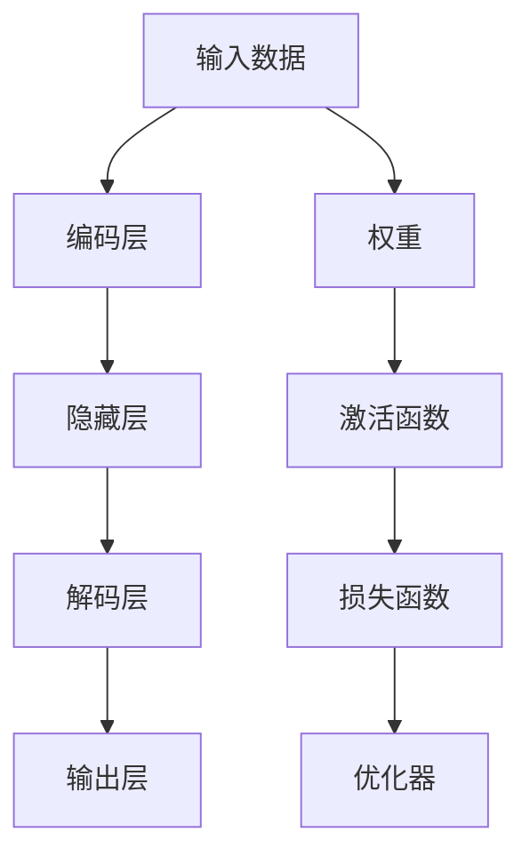

                 

## 1. 背景介绍

### 1.1 问题由来

神经网络，作为人工智能(AI)领域的一种核心技术，自20世纪80年代被重新发现以来，已经取得了巨大的成功。它不仅是当前机器学习的主流模型，也在各个领域广泛应用，如计算机视觉、自然语言处理、语音识别、推荐系统等。神经网络技术的进步，不仅推动了计算机科学的发展，也深刻影响了社会生活的方方面面。

近年来，深度学习技术的快速发展，尤其是大规模神经网络模型的出现，更是将神经网络的应用推向了新的高峰。谷歌的DeepMind团队开发的AlphaGo在围棋比赛中战胜了世界冠军李世石，成为全球瞩目的焦点；OpenAI的GPT系列模型在自然语言处理(NLP)领域刷新了多项记录，引领了AI技术的新浪潮。这些突破性成果不仅展示了神经网络技术的强大能力，也预示着它将在未来社会中扮演越来越重要的角色。

### 1.2 问题核心关键点

神经网络技术之所以能够推动社会进步，在于其以下几个核心关键点：

- **泛化能力**：神经网络模型通过自适应地调整模型参数，可以在未曾见过的数据上做出准确的预测。这种泛化能力使其能够应用于各种实际问题，从图像识别到自然语言处理。

- **端到端训练**：神经网络模型能够直接从原始数据中学习到目标任务的相关特征，无需手动提取特征，减少了特征工程的复杂度。

- **大规模计算需求**：尽管神经网络模型需要大量的计算资源进行训练，但其在复杂任务上的表现，使得其在诸多领域的应用前景广阔。

- **非监督学习**：神经网络模型可以进行无监督学习，通过未标注数据获得高维空间中的表示，为后续任务提供有力的支持。

- **迁移学习能力**：神经网络模型在特定任务上学习到的知识，可以迁移到其他相关任务，提升整体应用能力。

- **高效的特征提取**：神经网络模型可以自动地从原始数据中学习到高级特征，这些特征可以用于多种下游任务，如图像分类、目标检测、语义分割等。

神经网络技术的这些核心特点，使其在多个领域展示了强大的应用潜力，并为社会进步提供了重要推动力。

## 2. 核心概念与联系

### 2.1 核心概念概述

神经网络是一类模拟人脑神经元工作原理的计算模型。其主要通过学习大量训练数据，自动地提取输入数据中的特征，并对未知数据进行预测。神经网络的核心组件包括：

- **神经元**：神经网络的基本组成单元，模拟人脑中的神经元，通过激活函数处理输入数据。
- **权重**：连接神经元之间的权重参数，控制信息的传递和计算。
- **激活函数**：对神经元输出进行非线性变换，增强网络的表达能力。
- **损失函数**：用于评估模型预测结果与实际标签之间的差异，指导模型进行优化。
- **优化器**：通过梯度下降等方法，最小化损失函数，更新模型参数。

这些核心概念通过层次化的结构相互连接，共同构成了一个高效的神经网络模型。

### 2.2 核心概念原理和架构的 Mermaid 流程图



这个流程图展示了神经网络的基本架构。输入数据首先通过编码层提取特征，然后传递到多个隐藏层进行信息处理，最后通过解码层输出预测结果。每层之间的权重参数和激活函数共同决定模型的表达能力和计算复杂度。

### 2.3 核心概念联系

神经网络的核心概念之间通过前后向传播和反向传播两个过程紧密联系，形成了一个闭环的系统：

- **前向传播**：从输入数据开始，通过各层神经元逐层处理，最终输出预测结果。
- **反向传播**：通过计算预测结果与实际标签之间的差异，反向传播计算梯度，更新权重参数，以最小化损失函数。

这两个过程的交替进行，使得神经网络能够不断学习并优化自身参数，提升预测准确率。

## 3. 核心算法原理 & 具体操作步骤

### 3.1 算法原理概述

神经网络的训练过程是一个优化问题，目标是最小化损失函数。假设有 $N$ 个训练样本，模型参数为 $\theta$，损失函数为 $\mathcal{L}(\theta)$，则优化目标为：

$$
\theta^* = \mathop{\arg\min}_{\theta} \mathcal{L}(\theta)
$$

常用的优化方法包括梯度下降、Adam、RMSprop等。以梯度下降为例，其更新公式为：

$$
\theta_{t+1} = \theta_t - \eta \nabla_{\theta}\mathcal{L}(\theta_t)
$$

其中 $\eta$ 为学习率，$\nabla_{\theta}\mathcal{L}(\theta_t)$ 为损失函数对模型参数的梯度。

### 3.2 算法步骤详解

神经网络的训练过程一般包括以下几个关键步骤：

1. **数据预处理**：将原始数据转换为神经网络可以处理的格式，包括归一化、标准化、数据增强等。
2. **模型初始化**：随机初始化模型参数，设置超参数。
3. **前向传播**：通过前向传播计算预测结果。
4. **计算损失**：通过损失函数计算预测结果与实际标签之间的差异。
5. **反向传播**：通过反向传播计算梯度，更新模型参数。
6. **优化器更新**：根据梯度更新模型参数，通常使用梯度下降等优化方法。
7. **评估模型**：在验证集或测试集上评估模型性能。

### 3.3 算法优缺点

神经网络算法的优点在于其强大的表达能力和泛化能力，适用于复杂的数据处理和任务预测。其缺点包括：

- **计算资源需求大**：神经网络模型参数量庞大，训练和推理过程中需要大量的计算资源。
- **训练时间长**：大规模模型训练可能需要数小时、数天甚至数周的时间，对于实时应用场景不适用。
- **可解释性差**：神经网络模型通常被视为"黑盒"，难以解释其内部工作机制和决策过程。
- **过拟合风险**：模型过于复杂时，容易过拟合训练数据，导致泛化性能差。

尽管存在这些局限，但神经网络算法在各个领域的广泛应用证明了其强大的实际价值。

### 3.4 算法应用领域

神经网络算法已经在各个领域得到了广泛的应用，如：

- **计算机视觉**：图像分类、目标检测、语义分割等任务，通过卷积神经网络(CNN)等模型实现。
- **自然语言处理**：文本分类、情感分析、机器翻译等任务，通过循环神经网络(RNN)、Transformer等模型实现。
- **语音识别**：语音转文本、语音情感识别等任务，通过卷积神经网络、递归神经网络等模型实现。
- **推荐系统**：个性化推荐、用户行为预测等任务，通过深度神经网络实现。
- **医疗诊断**：疾病诊断、病理分析等任务，通过卷积神经网络、深度神经网络等模型实现。
- **自动驾驶**：环境感知、决策规划等任务，通过卷积神经网络、循环神经网络等模型实现。

## 4. 数学模型和公式 & 详细讲解

### 4.1 数学模型构建

神经网络的数学模型可以抽象为：

$$
y = f_{\theta}(x; \omega)
$$

其中 $x$ 为输入数据，$\theta$ 为模型参数，$\omega$ 为激活函数。激活函数 $f_{\theta}$ 通常采用sigmoid、ReLU等非线性函数。

### 4.2 公式推导过程

以二分类任务为例，假设模型 $f_{\theta}$ 的输出为 $y$，实际标签为 $t$，则交叉熵损失函数为：

$$
\mathcal{L}(\theta) = -\frac{1}{N} \sum_{i=1}^N \sum_{j=1}^M [t_{ij}\log y_{ij} + (1-t_{ij})\log (1-y_{ij})]
$$

其中 $M$ 为类别数。梯度下降更新公式为：

$$
\theta_{t+1} = \theta_t - \eta \nabla_{\theta}\mathcal{L}(\theta_t)
$$

### 4.3 案例分析与讲解

以ImageNet数据集上的AlexNet模型为例，其包含8层卷积层、3层全连接层和1层输出层。AlexNet通过多次前向传播和反向传播，逐步优化模型参数，最终在ImageNet数据集上取得了优异的表现。

## 5. 项目实践：代码实例和详细解释说明

### 5.1 开发环境搭建

- **Python环境**：选择Python 3.x版本，建议使用Anaconda或Miniconda等虚拟环境。
- **深度学习框架**：选择TensorFlow或PyTorch，这两个框架均支持神经网络的构建和训练。
- **GPU支持**：安装CUDA和cuDNN等GPU驱动，确保GPU硬件支持。
- **数据集**：下载或制作神经网络训练所需的数据集，并进行预处理。

### 5.2 源代码详细实现

以TensorFlow为例，神经网络的代码实现如下：

```python
import tensorflow as tf
from tensorflow.keras import layers

# 定义模型
model = tf.keras.Sequential([
    layers.Conv2D(64, (3, 3), activation='relu', input_shape=(32, 32, 3)),
    layers.MaxPooling2D((2, 2)),
    layers.Conv2D(128, (3, 3), activation='relu'),
    layers.MaxPooling2D((2, 2)),
    layers.Conv2D(128, (3, 3), activation='relu'),
    layers.MaxPooling2D((2, 2)),
    layers.Flatten(),
    layers.Dense(64, activation='relu'),
    layers.Dense(10, activation='softmax')
])

# 编译模型
model.compile(optimizer='adam',
              loss='categorical_crossentropy',
              metrics=['accuracy'])

# 训练模型
model.fit(x_train, y_train, epochs=10, batch_size=32, validation_data=(x_val, y_val))
```

### 5.3 代码解读与分析

- **Sequential模型**：使用Sequential模型创建序列化的神经网络模型，便于逐层堆叠。
- **Conv2D层**：定义卷积层，通过卷积核提取输入数据的空间特征。
- **MaxPooling层**：定义最大池化层，减小特征图的空间大小，增强模型的泛化能力。
- **Flatten层**：将多维特征图展平，使其变为一维向量。
- **Dense层**：定义全连接层，通过线性变换将特征映射到输出空间。
- **softmax激活函数**：将输出映射到类别概率分布上，便于分类任务。
- **优化器**：使用Adam优化器，调整模型参数。
- **损失函数**：使用交叉熵损失函数，衡量模型预测结果与实际标签的差异。
- **评价指标**：使用准确率作为评价指标，衡量模型性能。

### 5.4 运行结果展示

```python
import matplotlib.pyplot as plt

# 训练过程中损失和准确率的变化
plt.plot(history.history['loss'], label='loss')
plt.plot(history.history['val_loss'], label='val_loss')
plt.plot(history.history['accuracy'], label='accuracy')
plt.plot(history.history['val_accuracy'], label='val_accuracy')
plt.legend()
plt.show()
```

这个图展示了模型在训练和验证集上的损失和准确率变化情况。可以看到，随着训练轮数的增加，模型的损失逐渐减小，准确率逐渐提高。

## 6. 实际应用场景

### 6.1 医疗影像诊断

神经网络在医疗影像诊断领域展现了强大的应用潜力。通过深度学习技术，神经网络可以从医学影像中自动提取特征，进行疾病诊断和病理分析。例如，谷歌的DeepMind团队开发了基于卷积神经网络的乳腺癌检测系统，其准确率接近人类专家的水平。

### 6.2 自动驾驶

神经网络在自动驾驶领域也有广泛应用。通过深度学习技术，自动驾驶车辆可以从传感器数据中提取特征，进行环境感知和决策规划。例如，Waymo、特斯拉等公司均采用神经网络技术，推动自动驾驶技术的快速发展。

### 6.3 金融预测

神经网络在金融领域也得到了广泛应用。通过深度学习技术，神经网络可以从历史数据中学习到市场规律，进行股票预测、风险评估等任务。例如，华尔街的许多公司都采用了神经网络技术，提高了金融预测的准确性。

### 6.4 未来应用展望

未来，神经网络的应用范围将更加广泛，技术也将更加成熟。以下是一些未来的应用展望：

- **跨模态学习**：神经网络将能够处理多种模态数据，如文本、图像、声音等，实现跨模态信息的融合和协同。
- **个性化推荐**：神经网络将能够更好地理解用户行为，提供更加精准和个性化的推荐服务。
- **自适应学习**：神经网络将具备自适应学习的能力，能够根据环境变化不断调整自身参数，保持高水平性能。
- **联邦学习**：神经网络将能够支持联邦学习技术，保护用户隐私的同时，提高数据利用效率。
- **边缘计算**：神经网络将能够在边缘设备上进行计算，减少数据传输和延迟，提升实时性。
- **量子计算**：神经网络将能够利用量子计算技术，加速模型训练和推理，提升计算效率。

## 7. 工具和资源推荐

### 7.1 学习资源推荐

- **深度学习基础课程**：Coursera、edX等平台提供丰富的深度学习课程，包括吴恩达的深度学习课程和Ian Goodfellow的深度学习书籍。
- **TensorFlow官方文档**：TensorFlow官方文档详细介绍了深度学习框架的使用方法和最佳实践。
- **Kaggle平台**：Kaggle是一个数据科学竞赛平台，提供了大量的公开数据集和代码库，是学习和实践深度学习的好地方。
- **论文推荐**：《Deep Learning》（Goodfellow等人）、《Neural Networks and Deep Learning》（Cholllu等人）等经典书籍，深入讲解了深度学习的原理和应用。
- **博客和论坛**：深度学习领域有许多优秀的博客和论坛，如Towards Data Science、AI Daily等，可以获取最新的研究动态和实用技巧。

### 7.2 开发工具推荐

- **TensorFlow**：由Google开发的深度学习框架，支持GPU和TPU加速，适合大规模工程应用。
- **PyTorch**：由Facebook开发的深度学习框架，灵活易用，适合研究和实验。
- **Jupyter Notebook**：交互式编程环境，方便调试和实验。
- **Keras**：高层深度学习框架，提供了简单易用的API，适合快速原型开发。
- **MXNet**：多语言深度学习框架，支持多种编程语言和分布式训练。
- **ONNX**：开源神经网络交换格式，支持多种深度学习框架和工具之间的互操作性。

### 7.3 相关论文推荐

- **ImageNet Large Scale Visual Recognition Challenge（ILSVRC）**：ImageNet数据集及其比赛，推动了深度学习在计算机视觉领域的发展。
- **AlexNet**：ImageNet比赛中的第一名模型，展示了卷积神经网络在图像识别中的潜力。
- **ResNet**：残差网络，解决了深度网络训练中的梯度消失问题，显著提高了模型的深度和性能。
- **Attention Mechanism**：Transformer模型中的注意力机制，提升了模型的表达能力和计算效率。
- **GANs（Generative Adversarial Networks）**：生成对抗网络，推动了生成式深度学习的发展。
- **BERT**：Google开发的预训练语言模型，提升了NLP任务的性能。

## 8. 总结：未来发展趋势与挑战

### 8.1 研究成果总结

神经网络技术在推动社会进步方面取得了巨大的成功，其强大的表达能力和泛化能力使得其在各个领域广泛应用。未来，神经网络技术将在更多的领域得到应用，其潜力和价值将进一步释放。

### 8.2 未来发展趋势

1. **自动化**：深度学习自动化技术将进一步发展，自动设计神经网络架构，优化超参数，提升模型性能。
2. **可解释性**：神经网络的可解释性将成为重要研究方向，通过可视化工具和解释技术，提高模型的透明性和可理解性。
3. **多模态融合**：神经网络将支持多种模态数据融合，提升跨模态应用的性能和灵活性。
4. **自适应学习**：神经网络将具备自适应学习能力，能够根据环境变化进行动态调整，保持高性能。
5. **联邦学习**：神经网络将支持联邦学习技术，保护用户隐私的同时，提高数据利用效率。
6. **边缘计算**：神经网络将支持边缘计算，提升实时性和资源利用效率。
7. **量子计算**：神经网络将利用量子计算技术，提升计算效率和处理能力。

### 8.3 面临的挑战

尽管神经网络技术取得了巨大成功，但在应用过程中仍然面临一些挑战：

1. **计算资源需求大**：神经网络模型参数量庞大，训练和推理过程中需要大量的计算资源。
2. **训练时间长**：大规模模型训练可能需要数小时、数天甚至数周的时间，对于实时应用场景不适用。
3. **可解释性差**：神经网络模型通常被视为"黑盒"，难以解释其内部工作机制和决策过程。
4. **过拟合风险**：模型过于复杂时，容易过拟合训练数据，导致泛化性能差。
5. **数据隐私保护**：神经网络在处理敏感数据时，需要保证用户隐私，防止数据泄露。
6. **模型鲁棒性不足**：神经网络模型面对新数据时，泛化性能可能下降。

### 8.4 研究展望

为了应对这些挑战，未来的研究需要在以下几个方面寻求新的突破：

1. **模型压缩**：通过剪枝、量化等方法，减少模型参数量，提升计算效率。
2. **高效训练**：引入预训练和迁移学习技术，提高模型的泛化能力。
3. **可解释性增强**：通过可视化工具和解释技术，提高模型的透明性和可理解性。
4. **跨模态融合**：研究多模态数据的融合方法，提升跨模态应用的性能。
5. **自适应学习**：研究自适应学习算法，提升模型的自适应能力。
6. **联邦学习**：研究联邦学习技术，保护用户隐私的同时，提高数据利用效率。
7. **边缘计算**：研究边缘计算技术，提升实时性和资源利用效率。
8. **量子计算**：研究量子计算技术，提升计算效率和处理能力。

## 9. 附录：常见问题与解答

**Q1: 如何选择合适的神经网络模型？**

A: 根据任务类型选择合适的神经网络模型。例如，计算机视觉任务通常使用卷积神经网络，自然语言处理任务通常使用循环神经网络或Transformer等模型。

**Q2: 如何优化神经网络模型的性能？**

A: 可以通过数据增强、正则化、dropout、学习率调整等方法优化神经网络模型的性能。同时，使用自适应学习算法，如Adam、RMSprop等，可以提高模型训练效率。

**Q3: 神经网络模型有哪些优缺点？**

A: 神经网络模型的优点包括强大的表达能力和泛化能力，适用于复杂的数据处理和任务预测。其缺点包括计算资源需求大、训练时间长、可解释性差等。

**Q4: 神经网络在医疗领域的应用有哪些？**

A: 神经网络在医疗影像诊断、疾病预测、病理分析等方面有广泛应用。例如，通过深度学习技术，神经网络可以从医学影像中自动提取特征，进行疾病诊断和病理分析。

**Q5: 神经网络在自动驾驶中的应用有哪些？**

A: 神经网络在自动驾驶领域广泛应用，包括环境感知、决策规划、行为控制等。例如，Waymo、特斯拉等公司均采用神经网络技术，推动自动驾驶技术的快速发展。

**Q6: 神经网络在金融预测中的应用有哪些？**

A: 神经网络在金融预测、风险评估、股票预测等方面有广泛应用。例如，华尔街的许多公司都采用了神经网络技术，提高了金融预测的准确性。

**Q7: 如何处理神经网络模型的过拟合问题？**

A: 可以通过数据增强、正则化、dropout、学习率调整等方法处理神经网络模型的过拟合问题。同时，使用自适应学习算法，如Adam、RMSprop等，可以提高模型泛化能力。

通过本文的系统梳理，可以看到，神经网络技术在推动社会进步方面发挥了巨大作用。随着技术的不断进步，神经网络的应用领域将更加广泛，其在各个领域的应用潜力也将进一步释放。未来，神经网络技术将在更多的领域得到应用，其潜力和价值将进一步释放。

