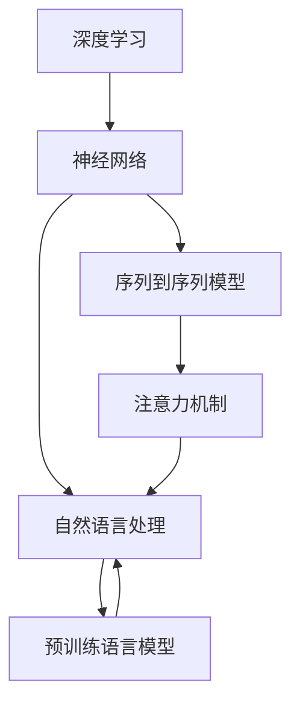

                 

# 神经网络：自然语言处理的新突破

> 关键词：神经网络,自然语言处理,NLP,深度学习,Transformer,BERT,预训练,语言模型,语言表示

## 1. 背景介绍

### 1.1 问题由来
近年来，随着深度学习技术的飞速发展，神经网络在自然语言处理(NLP)领域取得了举世瞩目的突破。在文本分类、情感分析、机器翻译、问答系统等诸多任务上，基于深度学习的模型已经超越了传统统计方法，成为NLP的主流技术。特别是Transformer结构的大语言模型（如BERT、GPT-3等），更是引领了NLP领域的最新潮流。

然而，尽管大语言模型在各种任务上取得了卓越的性能，但在解释性、可控性和跨领域迁移能力等方面仍存在诸多挑战。如何更好地利用神经网络处理自然语言，兼顾性能和可解释性，成为NLP领域亟需解决的问题。

### 1.2 问题核心关键点
神经网络在NLP中的应用主要体现在以下几个方面：

- 语言模型：通过神经网络建立语言的概率分布，用于文本生成、语音识别、语言推理等任务。
- 序列到序列模型：用于机器翻译、文本摘要、对话系统等需要输入输出序列的任务，通过编码器-解码器结构实现。
- 注意力机制：增强模型的表示能力，使其能够更好地处理长距离依赖。
- 预训练语言模型：通过大规模无标签文本进行自监督预训练，学习语言的基本规律和语义关系。

神经网络技术在NLP领域的应用，使得模型能够自动从数据中学习到复杂的语言表示，从而提升任务性能。但如何设计合适的神经网络结构、调整训练策略，是实现高性能模型的关键。

## 2. 核心概念与联系

### 2.1 核心概念概述

为了深入理解神经网络在NLP中的应用，本节将介绍几个关键概念：

- 神经网络(Neural Networks)：一种基于人工神经元结构的计算模型，能够通过训练学习数据分布。
- 深度学习(Deep Learning)：基于多层次神经网络结构，能够自动从数据中学习复杂的非线性映射。
- 自然语言处理(Natural Language Processing, NLP)：研究计算机如何理解、处理和生成自然语言的技术。
- 序列到序列(Sequence-to-Sequence, Seq2Seq)模型：包括编码器-解码器结构，用于文本生成、机器翻译等任务。
- 注意力机制(Attention Mechanism)：一种增强模型信息融合能力的机制，用于提升序列到序列模型的表示能力。
- 预训练语言模型(Pre-trained Language Models)：通过大规模无标签文本数据进行预训练，学习语言的通用规律和语义关系。

这些概念之间的联系紧密，共同构成了NLP领域的理论和技术基础。深度学习、神经网络技术的发展，使得NLP领域能够处理更加复杂的语言任务，获得更高的模型性能。

### 2.2 核心概念原理和架构的 Mermaid 流程图(Mermaid 流程节点中不要有括号、逗号等特殊字符)


这个流程图展示了深度学习、神经网络与自然语言处理之间的内在联系。深度学习和神经网络技术为NLP提供了强大的工具和平台，而序列到序列模型和注意力机制则进一步提升了模型的表示能力，预训练语言模型则提供了模型训练的初始化参数，共同推动了NLP领域的发展。

## 3. 核心算法原理 & 具体操作步骤
### 3.1 算法原理概述

神经网络在NLP中的应用，主要通过以下几种方式实现：

- 语言模型：通过神经网络学习语言的概率分布，用于文本生成、语音识别等任务。
- 序列到序列模型：包括编码器-解码器结构，用于文本翻译、摘要生成等需要输入输出序列的任务。
- 注意力机制：通过注意力机制增强模型对输入序列的关注，提升序列到序列模型的表示能力。
- 预训练语言模型：通过大规模无标签文本进行预训练，学习语言的通用规律和语义关系。

这些技术的核心思想是：利用神经网络的结构和计算能力，自动从数据中学习复杂的非线性映射，从而实现对自然语言的理解和生成。

### 3.2 算法步骤详解

以BERT预训练语言模型的训练为例，神经网络在NLP中的应用步骤包括：

1. 数据准备：收集大规模无标签文本数据，进行数据清洗、分词等预处理操作。
2. 模型选择：选择合适的神经网络结构，如Transformer，作为预训练模型。
3. 预训练过程：在预训练数据上，通过自监督学习任务进行训练，如掩码语言模型、下一句预测等。
4. 微调过程：在特定下游任务上，使用小规模标注数据对预训练模型进行微调，优化模型在该任务上的性能。
5. 测试评估：在测试集上评估微调后模型的性能，对比预训练模型和微调模型的效果。

通过这些步骤，神经网络模型能够从大规模数据中学习到丰富的语言知识，并通过微调进一步适应特定任务，提升模型性能。

### 3.3 算法优缺点

神经网络在NLP中的应用具有以下优点：

1. 强大的表示能力：神经网络能够自动学习复杂的非线性映射，捕捉语言中的细微关系。
2. 高效的特征提取：神经网络可以通过反向传播算法自动更新权重，提取文本中的重要特征。
3. 广泛的任务覆盖：神经网络能够应用于文本分类、情感分析、机器翻译、对话系统等多个NLP任务。
4. 不断提升的性能：随着大规模语料和算力的推动，神经网络模型在NLP任务上的性能不断提升。

但同时，神经网络也存在一些局限性：

1. 过拟合风险：神经网络容易过拟合训练集，导致模型泛化性能差。
2. 可解释性不足：神经网络模型通常被视为"黑盒"，难以解释内部工作机制。
3. 计算资源消耗大：神经网络模型参数量庞大，训练和推理需要大量的计算资源。
4. 模型训练复杂：神经网络模型的训练过程需要细致的调参和优化，容易出现超参数调整不当等问题。

## 4. 数学模型和公式 & 详细讲解 & 举例说明（备注：数学公式请使用latex格式，latex嵌入文中独立段落使用 $$，段落内使用 $)
### 4.1 数学模型构建

神经网络在NLP中的应用，可以通过以下数学模型进行建模：

- 语言模型：建立输入序列和输出序列的概率分布，用于文本生成、语音识别等任务。
- 序列到序列模型：通过编码器-解码器结构，建立输入序列和输出序列的映射关系，用于文本翻译、摘要生成等任务。
- 注意力机制：通过注意力权重，增强模型对输入序列中重要信息的关注，提升序列到序列模型的表示能力。
- 预训练语言模型：通过自监督学习任务，建立语言的概率分布，用于提升模型性能。

### 4.2 公式推导过程

以BERT预训练模型的训练为例，假设输入序列为 $X=\{x_1, x_2, ..., x_n\}$，输出序列为 $Y=\{y_1, y_2, ..., y_n\}$，预训练模型为 $M_{\theta}$，其中 $\theta$ 为模型参数。

假设模型 $M_{\theta}$ 在输入 $x_i$ 上的输出为 $\hat{y}_i=M_{\theta}(x_i)$，则在数据集 $D$ 上的经验风险为：

$$
\mathcal{L}(\theta) = -\frac{1}{N} \sum_{i=1}^N \log \hat{y}_i
$$

其中 $N$ 为数据集大小。

对于掩码语言模型任务，输入序列中随机选取一个位置，将该位置进行掩码，模型需要预测该位置的真实值。通过优化上述损失函数，可以训练出能够学习语言概率分布的模型。

### 4.3 案例分析与讲解

以BERT模型为例，其在预训练过程中，通过两个主要任务进行训练：

1. 掩码语言模型任务：随机掩码输入序列中的位置，让模型预测被掩码位置的真实值。
2. 下一句预测任务：输入两个连续的句子，让模型预测它们是否为连续的句子。

这些任务的目的是让模型学习到语言的语义关系和上下文信息。在预训练结束后，模型被用于特定的下游任务，如情感分析、机器翻译等，通过微调优化模型的性能。

## 5. 项目实践：代码实例和详细解释说明
### 5.1 开发环境搭建

在进行神经网络NLP应用的开发前，需要先准备好开发环境。以下是使用Python进行TensorFlow开发的环境配置流程：

1. 安装Anaconda：从官网下载并安装Anaconda，用于创建独立的Python环境。
2. 创建并激活虚拟环境：
```bash
conda create -n tf-env python=3.7
conda activate tf-env
```
3. 安装TensorFlow：根据CUDA版本，从官网获取对应的安装命令。例如：
```bash
conda install tensorflow==2.4 -c conda-forge -c pytorch
```
4. 安装相关工具包：
```bash
pip install numpy pandas scikit-learn tensorflow-datasets
```

完成上述步骤后，即可在`tf-env`环境中开始NLP应用的开发。

### 5.2 源代码详细实现

以下是使用TensorFlow实现BERT预训练模型的代码实现，包括数据加载、模型构建、训练过程和评估过程：

```python
import tensorflow as tf
from tensorflow.keras import layers
from transformers import BertTokenizer, TFBertForMaskedLM

# 加载预训练模型和分词器
tokenizer = BertTokenizer.from_pretrained('bert-base-cased')
model = TFBertForMaskedLM.from_pretrained('bert-base-cased')

# 数据加载
train_dataset = tf.data.Dataset.from_tensor_slices(train_encodings).batch(16)
val_dataset = tf.data.Dataset.from_tensor_slices(val_encodings).batch(16)
test_dataset = tf.data.Dataset.from_tensor_slices(test_encodings).batch(16)

# 定义模型
def build_model(tokenizer):
    model = TFBertForMaskedLM(tokenizer=tokenizer)
    return model

model = build_model(tokenizer)

# 定义优化器和学习率
optimizer = tf.keras.optimizers.Adam(learning_rate=5e-5)
loss_fn = tf.keras.losses.SparseCategoricalCrossentropy(from_logits=True)

# 训练过程
@tf.function
def train_step(inputs):
    with tf.GradientTape() as tape:
        predictions = model(inputs['input_ids'], training=True)
        loss = loss_fn(inputs['labels'], predictions)
    gradients = tape.gradient(loss, model.trainable_variables)
    optimizer.apply_gradients(zip(gradients, model.trainable_variables))
    return loss

# 训练循环
for epoch in range(num_epochs):
    for step, batch in enumerate(train_dataset):
        loss = train_step(batch)
        if step % 100 == 0:
            print(f"Epoch {epoch+1}, Step {step+1}, Loss: {loss.numpy():.4f}")

# 评估过程
@tf.function
def eval_step(inputs):
    predictions = model(inputs['input_ids'], training=False)
    return predictions

# 在验证集和测试集上评估模型
for epoch in range(num_epochs):
    for step, batch in enumerate(val_dataset):
        predictions = eval_step(batch)
        print(f"Epoch {epoch+1}, Step {step+1}, Predictions: {predictions.numpy():.4f}")
    for step, batch in enumerate(test_dataset):
        predictions = eval_step(batch)
        print(f"Epoch {epoch+1}, Step {step+1}, Predictions: {predictions.numpy():.4f}")
```

上述代码实现了一个基于BERT模型的掩码语言模型训练过程。可以看到，通过TensorFlow的高级API，代码实现简洁高效，易于理解。

### 5.3 代码解读与分析

让我们再详细解读一下关键代码的实现细节：

**数据加载**：
- `train_dataset`、`val_dataset`、`test_dataset`分别加载训练集、验证集和测试集的数据，使用TensorFlow的`tf.data.Dataset`接口进行批处理和分块操作。

**模型构建**：
- `build_model`函数使用`TFBertForMaskedLM`类构建BERT模型，并将其作为训练的基类。

**训练过程**：
- `train_step`函数定义了单次训练过程，包括前向传播、损失计算、反向传播和参数更新。
- 使用`tf.GradientTape`记录梯度，并使用`optimizer.apply_gradients`更新模型参数。

**评估过程**：
- `eval_step`函数定义了单次评估过程，使用训练好的模型对验证集和测试集进行预测，并输出预测结果。

**训练循环**：
- 使用`for`循环进行多轮训练，并在每个epoch后输出训练损失。

**评估循环**：
- 使用`for`循环进行多轮评估，并在每个epoch后输出验证集和测试集的预测结果。

可以看到，TensorFlow的高级API使得NLP应用的开发变得简洁高效。开发者可以通过简单的API调用，快速实现复杂的模型训练和评估过程。

## 6. 实际应用场景
### 6.1 文本分类

文本分类是NLP领域中最基本的任务之一，广泛应用于垃圾邮件过滤、情感分析、新闻分类等领域。神经网络在文本分类中的应用，主要通过以下方式实现：

1. 模型构建：使用全连接神经网络或卷积神经网络构建分类模型。
2. 数据预处理：将文本转换为向量表示，如TF-IDF、Word2Vec等。
3. 训练过程：使用交叉熵损失函数和随机梯度下降等优化算法进行训练。
4. 评估过程：在测试集上计算准确率、召回率、F1值等指标，评估模型性能。

以情感分析任务为例，可以使用情感词典或BERT模型进行训练。首先，将情感词典或BERT模型嵌入到神经网络中，用于表示文本的情感倾向。然后，将文本转换为向量表示，输入到神经网络中进行分类。最后，在测试集上计算分类指标，评估模型的情感分类能力。

### 6.2 机器翻译

机器翻译是NLP领域的经典任务，通过神经网络模型实现输入序列到输出序列的映射。神经网络在机器翻译中的应用，主要通过以下方式实现：

1. 模型构建：使用序列到序列模型，包括编码器-解码器结构。
2. 数据预处理：将输入序列和输出序列转换为模型所需格式。
3. 训练过程：使用BLEU等自动评估指标评估模型翻译质量，使用自回归方式进行训练。
4. 评估过程：在测试集上计算BLEU、METEOR等指标，评估模型翻译质量。

以机器翻译为例，可以使用基于Transformer的神经网络模型进行训练。首先，将输入序列和输出序列转换为模型所需格式，并输入到编码器和解码器中进行映射。然后，使用BLEU等自动评估指标评估模型翻译质量，使用自回归方式进行训练。最后，在测试集上计算BLEU等指标，评估模型的翻译质量。

### 6.3 对话系统

对话系统是NLP领域的重要应用之一，通过神经网络模型实现人机交互。神经网络在对话系统中的应用，主要通过以下方式实现：

1. 模型构建：使用循环神经网络或Transformer模型构建对话模型。
2. 数据预处理：将对话历史和用户输入转换为模型所需格式。
3. 训练过程：使用BLEU等自动评估指标评估模型对话质量，使用自回归方式进行训练。
4. 评估过程：在测试集上计算BLEU、METEOR等指标，评估模型对话质量。

以对话系统为例，可以使用基于Transformer的神经网络模型进行训练。首先，将对话历史和用户输入转换为模型所需格式，并输入到编码器和解码器中进行映射。然后，使用BLEU等自动评估指标评估模型对话质量，使用自回归方式进行训练。最后，在测试集上计算BLEU等指标，评估模型的对话质量。

### 6.4 未来应用展望

随着神经网络技术的不断进步，未来神经网络在NLP领域的应用将更加广泛和深入。

- 自然语言生成：神经网络可以用于文本生成、对话生成等任务，提升自然语言理解和生成的智能水平。
- 语音识别：神经网络可以用于语音识别任务，将语音信号转换为文本形式。
- 文本摘要：神经网络可以用于文本摘要任务，自动生成文章摘要或新闻摘要。
- 情感分析：神经网络可以用于情感分析任务，自动识别文本中的情感倾向。
- 问答系统：神经网络可以用于问答系统，自动回答用户提出的问题。

此外，神经网络还可以与其他技术进行结合，如知识图谱、多模态信息等，进一步提升NLP任务的性能和应用范围。

## 7. 工具和资源推荐
### 7.1 学习资源推荐

为了帮助开发者系统掌握神经网络在NLP中的应用，这里推荐一些优质的学习资源：

1. 《深度学习》系列书籍：Deep Learning、Deep Learning Specialization等，深入讲解深度学习基础理论和前沿技术。
2. 《自然语言处理综述》系列论文：回顾NLP领域的发展历程和最新研究进展。
3. 《TensorFlow教程》系列博文：介绍TensorFlow的高级API和NLP应用的开发方法。
4. 《PyTorch教程》系列博文：介绍PyTorch的高级API和NLP应用的开发方法。
5. 《NLP with TensorFlow》书籍：TensorFlow官方文档，详细介绍TensorFlow在NLP领域的应用方法。

通过对这些资源的学习实践，相信你一定能够快速掌握神经网络在NLP中的应用方法，并用于解决实际的NLP问题。

### 7.2 开发工具推荐

高效的开发离不开优秀的工具支持。以下是几款用于神经网络NLP应用的常用工具：

1. TensorFlow：由Google主导开发的开源深度学习框架，生产部署方便，适合大规模工程应用。
2. PyTorch：基于Python的开源深度学习框架，灵活动态的计算图，适合快速迭代研究。
3. Keras：高层次API，用于快速构建神经网络模型，易于上手。
4. HuggingFace Transformers库：提供预训练语言模型的封装，方便使用。
5. NLTK：自然语言处理工具库，提供文本预处理、分词等功能。
6. spaCy：自然语言处理库，提供分词、实体识别等功能。

合理利用这些工具，可以显著提升神经网络NLP应用的开发效率，加快创新迭代的步伐。

### 7.3 相关论文推荐

神经网络在NLP领域的发展离不开学界的持续研究。以下是几篇奠基性的相关论文，推荐阅读：

1. "Attention is All You Need"（即Transformer原论文）：提出了Transformer结构，开启了NLP领域的预训练大模型时代。
2. "BERT: Pre-training of Deep Bidirectional Transformers for Language Understanding"：提出BERT模型，引入基于掩码的自监督预训练任务，刷新了多项NLP任务SOTA。
3. "Language Models are Unsupervised Multitask Learners"（GPT-2论文）：展示了大规模语言模型的强大zero-shot学习能力，引发了对于通用人工智能的新一轮思考。
4. "Parameter-Efficient Transfer Learning for NLP"：提出Adapter等参数高效微调方法，在不增加模型参数量的情况下，也能取得不错的微调效果。
5. "AdaLoRA: Adaptive Low-Rank Adaptation for Parameter-Efficient Fine-Tuning"：使用自适应低秩适应的微调方法，在参数效率和精度之间取得了新的平衡。

这些论文代表了大神经网络在NLP领域的发展脉络。通过学习这些前沿成果，可以帮助研究者把握学科前进方向，激发更多的创新灵感。

## 8. 总结：未来发展趋势与挑战
### 8.1 总结

本文对神经网络在NLP中的应用进行了全面系统的介绍。首先阐述了神经网络在NLP领域的研究背景和应用意义，明确了神经网络在文本分类、机器翻译、对话系统等NLP任务中的重要地位。其次，从原理到实践，详细讲解了神经网络在NLP中的应用过程，给出了完整的代码实例和评估方法。同时，本文还广泛探讨了神经网络在NLP领域的应用前景，展示了神经网络在NLP任务的强大能力。

通过本文的系统梳理，可以看到，神经网络在NLP领域的应用已经非常成熟，并且在实际工程中得到了广泛的应用。未来，神经网络技术将进一步推动NLP领域的发展，为构建智能人机交互系统提供强大的技术支持。

### 8.2 未来发展趋势

展望未来，神经网络在NLP领域的应用将呈现以下几个发展趋势：

1. 模型规模持续增大。随着算力成本的下降和数据规模的扩张，神经网络模型将越来越庞大，能够学习到更加丰富的语言知识。
2. 跨领域迁移能力增强。神经网络模型将能够更好地适应不同领域的语言表示，提升模型在不同领域上的泛化性能。
3. 无监督和半监督学习成为热点。通过无监督和半监督学习，神经网络模型能够在没有标注数据的情况下，自动学习语言的语义关系和上下文信息。
4. 多模态信息融合成为常态。神经网络模型将能够融合视觉、语音等多模态信息，提升对复杂多变语言环境的理解能力。
5. 交互式学习和可解释性成为趋势。神经网络模型将能够与用户进行交互式学习，提供更好的可解释性和可控性。

以上趋势凸显了神经网络在NLP领域的广阔前景。这些方向的探索发展，必将进一步提升神经网络在NLP任务的性能和应用范围，为构建智能人机交互系统提供强大的技术支持。

### 8.3 面临的挑战

尽管神经网络在NLP领域的应用已经取得了瞩目成就，但在迈向更加智能化、普适化应用的过程中，它仍面临着诸多挑战：

1. 标注成本瓶颈。神经网络模型需要大量的标注数据进行训练，对于小规模任务，难以获得充足的高质量标注数据，成为制约神经网络性能的瓶颈。
2. 模型鲁棒性不足。神经网络模型面对域外数据时，泛化性能往往大打折扣，容易过拟合训练集。
3. 推理效率有待提高。神经网络模型参数量庞大，训练和推理需要大量的计算资源，推理效率有待提升。
4. 可解释性不足。神经网络模型通常被视为"黑盒"，难以解释内部工作机制和决策逻辑。

### 8.4 研究展望

面对神经网络在NLP领域面临的挑战，未来的研究需要在以下几个方面寻求新的突破：

1. 探索无监督和半监督学习方法。通过无监督和半监督学习，神经网络模型能够在没有标注数据的情况下，自动学习语言的语义关系和上下文信息，降低对标注数据的依赖。
2. 研究参数高效和计算高效的神经网络模型。开发更加参数高效的神经网络模型，如Transformer等，在固定大部分预训练参数的同时，只更新极少量的任务相关参数，减小过拟合风险。同时优化神经网络计算图，减少前向传播和反向传播的资源消耗，实现更加轻量级、实时性的部署。
3. 引入更多先验知识。将符号化的先验知识，如知识图谱、逻辑规则等，与神经网络模型进行巧妙融合，引导神经网络学习更准确、合理的语言模型。同时加强不同模态数据的整合，实现视觉、语音等多模态信息与文本信息的协同建模。
4. 结合因果分析和博弈论工具。将因果分析方法引入神经网络模型，识别出模型决策的关键特征，增强输出解释的因果性和逻辑性。借助博弈论工具刻画人机交互过程，主动探索并规避模型的脆弱点，提高系统稳定性。
5. 纳入伦理道德约束。在神经网络训练目标中引入伦理导向的评估指标，过滤和惩罚有偏见、有害的输出倾向。同时加强人工干预和审核，建立神经网络行为的监管机制，确保输出符合人类价值观和伦理道德。

这些研究方向的探索，必将引领神经网络在NLP领域的发展方向，为构建安全、可靠、可解释、可控的智能系统铺平道路。

## 9. 附录：常见问题与解答
**Q1：神经网络在NLP中主要应用在哪些方面？**

A: 神经网络在NLP中的应用主要包括以下几个方面：

1. 语言模型：通过神经网络建立语言的概率分布，用于文本生成、语音识别等任务。
2. 序列到序列模型：包括编码器-解码器结构，用于文本翻译、摘要生成等需要输入输出序列的任务。
3. 注意力机制：通过注意力机制增强模型对输入序列的关注，提升序列到序列模型的表示能力。
4. 预训练语言模型：通过大规模无标签文本进行预训练，学习语言的通用规律和语义关系。

这些技术的应用，使得神经网络在NLP领域能够处理更加复杂的语言任务，获得更高的模型性能。

**Q2：神经网络在NLP中存在哪些问题？**

A: 神经网络在NLP中的应用也存在一些问题：

1. 过拟合风险：神经网络容易过拟合训练集，导致模型泛化性能差。
2. 可解释性不足：神经网络模型通常被视为"黑盒"，难以解释内部工作机制。
3. 计算资源消耗大：神经网络模型参数量庞大，训练和推理需要大量的计算资源。
4. 模型训练复杂：神经网络模型的训练过程需要细致的调参和优化，容易出现超参数调整不当等问题。

**Q3：如何选择适合的神经网络模型？**

A: 选择适合的神经网络模型，需要根据具体任务和数据特点进行考虑：

1. 任务类型：不同类型的NLP任务适合不同的神经网络模型。如文本分类适合全连接神经网络，机器翻译适合序列到序列模型。
2. 数据规模：数据规模决定了模型的大小。对于大规模数据集，可以选择更深、更大的神经网络模型。
3. 计算资源：计算资源决定了模型的训练和推理效率。对于计算资源有限的情况，可以选择参数效率更高的模型。
4. 可解释性需求：有些任务需要更高的可解释性，如医疗诊断、金融分析等。此时可以选择具有可解释性更好的模型，如Transformer等。

**Q4：如何提高神经网络的训练效率？**

A: 提高神经网络的训练效率，可以通过以下几种方法：

1. 使用GPU/TPU等高性能设备：GPU/TPU可以显著提升神经网络模型的训练速度，减少训练时间。
2. 数据增强：通过数据增强技术，如数据扩充、回译等，增加训练样本的多样性，提升模型的泛化能力。
3. 优化器选择：选择适合的优化器，如AdamW、Adafactor等，可以提高训练速度和模型性能。
4. 批量大小调整：调整批量大小，可以平衡模型的训练速度和内存使用，避免内存不足或过拟合。
5. 模型剪枝和量化：通过模型剪枝和量化技术，减小模型参数量，提升模型推理速度。

**Q5：如何评估神经网络在NLP中的应用效果？**

A: 评估神经网络在NLP中的应用效果，可以通过以下几种指标：

1. 准确率、召回率和F1值：用于文本分类、情感分析等任务，评估模型的分类能力。
2. BLEU、METEOR等指标：用于机器翻译、文本摘要等任务，评估模型的翻译质量和摘要质量。
3. ROUGE、MATE指标：用于文本相似度计算、信息检索等任务，评估模型的文本匹配能力。
4. 对话系统评估指标：如BLEU、METEOR、Rouge、Exact等，用于评估对话系统中的对话质量。

通过这些指标，可以全面评估神经网络在NLP中的应用效果，并进行优化调整。

**Q6：如何处理神经网络模型的可解释性问题？**

A: 处理神经网络模型的可解释性问题，可以通过以下几种方法：

1. 可解释性模型：选择具有可解释性的神经网络模型，如LSTM、RNN等。
2. 特征重要性分析：通过特征重要性分析，了解模型对输入特征的依赖关系。
3. 解释性训练：通过解释性训练，引导模型学习更加可解释的表示。
4. 可视化工具：使用可视化工具，如Grad-CAM、SHAP等，分析模型的决策过程和特征贡献。

通过这些方法，可以提升神经网络模型的可解释性，增强其透明性和可信度。

---

作者：禅与计算机程序设计艺术 / Zen and the Art of Computer Programming

