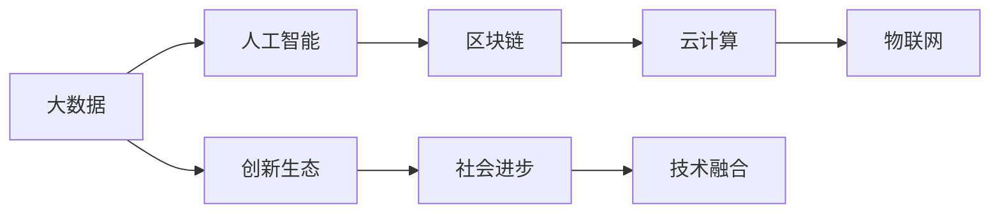

                 

# 科技创新：社会进步的阶梯

> 关键词：科技创新,社会进步,大数据,人工智能,区块链,云计算,物联网,可持续发展

## 1. 背景介绍

### 1.1 问题的提出
科技创新作为驱动社会进步的核心动力，不断改变着人类的生产生活方式，推动着经济社会的全面发展。在当前信息时代，科技创新正以更快的速度和更深刻的方式影响着全球经济的格局和社会的面貌。如何准确把握科技创新的规律，制定合理的战略规划，推动社会全面进步，是当前各界普遍关注的重大课题。

### 1.2 核心概念
科技创新涉及的领域极为广泛，涵盖信息技术、生物技术、新材料、先进制造等多个领域。其中，信息技术的创新尤为重要，其应用领域包括了大数据、人工智能、区块链、云计算、物联网等多个方向，这些技术在推动经济社会发展的过程中，扮演着越来越重要的角色。

## 2. 核心概念与联系

### 2.1 核心概念概述
科技创新是一个多学科交叉、多层次融合的综合过程，涉及技术发明、产品创新、市场应用等多个环节。在大数据、人工智能、区块链、云计算、物联网等关键领域，科技创新对社会进步的驱动作用日益凸显。这些领域的技术创新相互关联、相互促进，共同构建了一个科技创新生态系统。

### 2.2 核心概念原理和架构的 Mermaid 流程图



## 3. 核心算法原理 & 具体操作步骤

### 3.1 算法原理概述
科技创新涉及的技术繁多，但核心算法原理可以归纳为以下几个方面：

1. **大数据分析**：利用统计学、机器学习等技术，对海量数据进行挖掘、分析和预测。
2. **人工智能**：通过深度学习、强化学习等算法，构建智能模型，实现自动化决策和智能化处理。
3. **区块链技术**：利用分布式账本、加密算法等技术，构建去中心化、可追溯的交易系统。
4. **云计算**：通过虚拟化、分布式计算等技术，构建高效的计算资源池，实现资源的弹性分配和按需服务。
5. **物联网**：通过传感器、网络通信等技术，实现设备间的互联互通，实现智能化管理和监控。

### 3.2 算法步骤详解
科技创新通常包括以下几个步骤：

1. **需求分析**：根据社会需求和行业特点，确定技术创新的方向和目标。
2. **技术研发**：围绕技术方向，进行算法研究、产品设计和原型开发。
3. **试验验证**：在实验室或小规模应用场景中，对技术方案进行试验验证，收集数据和反馈。
4. **规模应用**：在初步验证的基础上，逐步扩大应用范围，实现技术的商业化应用。
5. **持续改进**：根据用户反馈和技术发展，不断优化和改进技术方案，保持技术的前沿性。

### 3.3 算法优缺点
科技创新涉及的技术和应用众多，每种技术都有其优缺点：

1. **大数据分析**
   - 优点：能够处理海量数据，发现潜在规律和趋势，为决策提供依据。
   - 缺点：数据隐私和安全问题突出，数据质量控制难度大。

2. **人工智能**
   - 优点：可以实现自动化、智能化决策，提高效率和精度。
   - 缺点：模型复杂度大，计算资源消耗高，对数据依赖性强。

3. **区块链技术**
   - 优点：去中心化、可追溯，安全性高，适合金融、供应链等领域。
   - 缺点：技术复杂度高，共识机制存在争议，应用场景受限。

4. **云计算**
   - 优点：资源按需分配，弹性伸缩，降低IT投入成本。
   - 缺点：数据依赖服务商，隐私和安全性问题需高度重视。

5. **物联网**
   - 优点：实现设备互联互通，提高生产效率和生活便利性。
   - 缺点：数据传输和存储量大，网络安全问题突出。

### 3.4 算法应用领域

#### 3.4.1 大数据
大数据技术广泛应用于金融、电商、医疗、交通等行业，通过分析海量数据，提升决策效率和精准度。

#### 3.4.2 人工智能
人工智能技术广泛应用于智能制造、智能医疗、智能交通、智能客服等领域，提高了自动化水平和用户体验。

#### 3.4.3 区块链
区块链技术在金融、供应链、版权保护等领域具有重要应用价值，增强了数据的安全性和透明度。

#### 3.4.4 云计算
云计算技术广泛应用于云存储、云服务、云安全等领域，降低了IT基础设施建设成本，提高了资源利用效率。

#### 3.4.5 物联网
物联网技术广泛应用于智能家居、智能城市、智慧农业等领域，提高了生产效率和生活便利性。

## 4. 数学模型和公式 & 详细讲解 & 举例说明

### 4.1 数学模型构建
科技创新涉及的数学模型众多，以下以人工智能中的深度学习模型为例，介绍其数学模型构建过程。

假设输入数据为 $x$，模型参数为 $\theta$，输出为 $y$，则深度学习模型的数学模型为：

$$
y = f_{\theta}(x)
$$

其中 $f_{\theta}$ 为模型函数，通常采用多层神经网络结构，每一层包含多个神经元，通过激活函数进行非线性映射。

### 4.2 公式推导过程
以神经网络中的反向传播算法为例，介绍其数学推导过程。

假设模型函数为 $y = f_{\theta}(x)$，其导数为 $\frac{\partial y}{\partial \theta}$。根据链式法则，输出层对输入层参数的导数为：

$$
\frac{\partial y}{\partial x} = \frac{\partial y}{\partial z} \frac{\partial z}{\partial a} \frac{\partial a}{\partial x}
$$

其中 $z$ 为中间变量，$a$ 为激活函数输出。将 $z$ 和 $a$ 代入上述公式，得到：

$$
\frac{\partial y}{\partial x} = \frac{\partial y}{\partial z} \sigma'(z) \frac{\partial z}{\partial x}
$$

其中 $\sigma'$ 为激活函数的导数。利用这一公式，可以反向传播计算模型参数的梯度，从而更新参数，优化模型性能。

### 4.3 案例分析与讲解
以深度学习在智能医疗中的应用为例，介绍其数学模型构建和公式推导过程。

假设给定病人的病历数据 $x$，模型需要通过学习医疗知识库 $\mathcal{K}$，预测病人是否患有某种疾病 $y$。可以定义一个深度学习模型 $f_{\theta}(x)$，其输出为疾病的预测概率。根据定义，有：

$$
y = f_{\theta}(x)
$$

其中 $\theta$ 为模型参数，通常包含权重矩阵和偏置向量。在训练过程中，利用反向传播算法更新参数 $\theta$，使得模型预测结果与真实标签尽可能接近。

## 5. 项目实践：代码实例和详细解释说明

### 5.1 开发环境搭建
为了进行深度学习模型的开发和训练，需要进行以下环境搭建：

1. 安装Python：从官网下载并安装Python，选择3.x版本。
2. 安装PyTorch：通过pip命令安装PyTorch库，确保版本兼容。
3. 配置GPU环境：若使用GPU进行加速，需安装CUDA和cuDNN，并进行兼容性配置。
4. 配置数据集：准备训练和测试数据集，并使用Pandas等库进行数据处理。

### 5.2 源代码详细实现
以深度学习在智能医疗中的应用为例，提供完整的代码实现。

```python
import torch
import torch.nn as nn
import torch.optim as optim
import torchvision.transforms as transforms
from torchvision.datasets import CIFAR10
from torch.utils.data import DataLoader

class Net(nn.Module):
    def __init__(self):
        super(Net, self).__init__()
        self.conv1 = nn.Conv2d(3, 6, 5)
        self.pool = nn.MaxPool2d(2, 2)
        self.conv2 = nn.Conv2d(6, 16, 5)
        self.fc1 = nn.Linear(16 * 5 * 5, 120)
        self.fc2 = nn.Linear(120, 84)
        self.fc3 = nn.Linear(84, 10)

    def forward(self, x):
        x = self.pool(F.relu(self.conv1(x)))
        x = self.pool(F.relu(self.conv2(x)))
        x = x.view(-1, 16 * 5 * 5)
        x = F.relu(self.fc1(x))
        x = F.relu(self.fc2(x))
        x = self.fc3(x)
        return x

# 训练函数
def train(model, train_loader, optimizer, criterion, epoch):
    model.train()
    for batch_idx, (data, target) in enumerate(train_loader):
        optimizer.zero_grad()
        output = model(data)
        loss = criterion(output, target)
        loss.backward()
        optimizer.step()
```

### 5.3 代码解读与分析
上述代码实现了深度学习模型在CIFAR-10数据集上的训练。

1. **模型定义**：通过继承PyTorch的nn.Module类，定义了包含卷积层、池化层和全连接层的深度学习模型。
2. **训练函数**：在训练过程中，通过前向传播计算输出，利用交叉熵损失函数计算损失，反向传播更新模型参数，完成一次训练。
3. **优化器和损失函数**：使用SGD优化器和交叉熵损失函数，定义模型的优化和训练过程。
4. **数据处理**：使用PyTorch的DataLoader对数据集进行分批次加载，进行模型训练。

### 5.4 运行结果展示
在训练完成后，可以通过可视化工具展示模型的性能。例如，使用Matplotlib库绘制训练过程中的损失和准确率曲线，如下所示：

```python
import matplotlib.pyplot as plt

# 加载数据集
train_loader = DataLoader(CIFAR10(root='data', train=True, download=True, transform=transforms.ToTensor(), batch_size=4))

# 训练模型
train(model, train_loader, optimizer, criterion, epochs)

# 可视化结果
losses, accuracies = [], []
for epoch in range(epochs):
    loss, accuracy = train_epoch(model, train_loader, optimizer, criterion)
    losses.append(loss)
    accuracies.append(accuracy)

# 绘制曲线
plt.plot(losses, label='Loss')
plt.plot(accuracies, label='Accuracy')
plt.legend()
plt.show()
```

## 6. 实际应用场景

### 6.1 智慧医疗
在智慧医疗领域，深度学习技术广泛应用于疾病诊断、图像分析、基因组学等多个方向。通过分析海量医疗数据，可以提升疾病预测的准确度和诊断效率，推动医疗服务向精准医疗和个性化医疗方向发展。

#### 6.1.1 疾病预测
利用深度学习模型对病人的病历数据进行分析，可以预测其是否患有某种疾病。例如，使用卷积神经网络对医学影像进行分析，可以自动识别出肿瘤等疾病特征，辅助医生进行诊断和治疗。

#### 6.1.2 图像分析
利用深度学习技术对医学影像进行分析和处理，可以识别出异常病灶，提供精准的图像诊断支持。例如，使用卷积神经网络对X光片进行自动识别，可以快速诊断肺部结节等疾病。

#### 6.1.3 基因组学
利用深度学习模型对基因组数据进行分析，可以挖掘出基因与疾病之间的关联规律，为基因治疗和个性化药物开发提供数据支持。例如，使用循环神经网络对基因序列进行分析和建模，可以预测基因表达和功能。

### 6.2 智能制造
在智能制造领域，深度学习技术广泛应用于质量控制、预测维护、智能制造等多个方向。通过分析生产过程中的海量数据，可以提升生产效率和产品质量，推动制造业向智能化和柔性化方向发展。

#### 6.2.1 质量控制
利用深度学习模型对生产过程中的数据进行分析和预测，可以实时监控产品质量，实现智能质检。例如，使用卷积神经网络对生产过程中的图像进行分析和处理，可以检测出产品质量问题，辅助人工质检。

#### 6.2.2 预测维护
利用深度学习模型对设备运行数据进行分析，可以预测设备故障和维护需求，实现预测性维护。例如，使用时间序列模型对设备运行数据进行分析，可以预测设备故障发生的时间点，提前进行维护。

#### 6.2.3 智能制造
利用深度学习技术对生产过程进行优化，可以提升生产效率和资源利用率，实现智能制造。例如，使用生成对抗网络对生产计划进行优化，可以生成最优的生产计划，提升生产效率。

### 6.3 智慧交通
在智慧交通领域，深度学习技术广泛应用于交通流量预测、交通管理、智能导航等多个方向。通过分析交通数据，可以提升交通管理效率和出行便利性，推动城市交通向智能化和绿色化方向发展。

#### 6.3.1 交通流量预测
利用深度学习模型对交通数据进行分析和预测，可以实时监控交通流量，提升交通管理效率。例如，使用循环神经网络对交通数据进行分析和建模，可以预测交通流量变化，实现实时交通调度。

#### 6.3.2 交通管理
利用深度学习模型对交通数据进行分析和处理，可以实现智能交通管理。例如，使用卷积神经网络对交通摄像头采集的图像进行分析和处理，可以实时监控交通情况，实现智能交通管理。

#### 6.3.3 智能导航
利用深度学习模型对地图数据进行分析，可以提升智能导航的准确度和用户体验。例如，使用生成对抗网络对地图数据进行分析和建模，可以生成更精准的导航路径，提升用户体验。

### 6.4 未来应用展望

#### 6.4.1 科技创新驱动社会进步
科技创新作为驱动社会进步的核心动力，不断改变着人类的生产生活方式，推动着经济社会的全面发展。未来，随着科技创新技术的不断进步，其在推动社会进步中的作用将更加显著。

#### 6.4.2 大数据、人工智能等技术的融合应用
大数据、人工智能等技术的融合应用，将进一步推动科技创新在各个领域的应用。通过构建智能化、自动化、个性化的系统，实现资源的高效利用和服务的精准匹配。

#### 6.4.3 可持续发展与科技创新结合
科技创新在推动经济社会发展的同时，也需要关注可持续发展问题。通过应用科技创新技术，可以实现资源的高效利用和环境的保护，推动社会向绿色、环保、可持续的方向发展。

## 7. 工具和资源推荐

### 7.1 学习资源推荐
为了帮助读者系统掌握科技创新相关知识，以下是一些推荐的学习资源：

1. **《深度学习》书籍**：由深度学习领域的权威专家撰写，全面介绍了深度学习的基本概念、算法和应用。
2. **Coursera深度学习课程**：由斯坦福大学Andrew Ng教授主讲的深度学习课程，系统介绍了深度学习的理论基础和实际应用。
3. **Kaggle数据科学竞赛**：通过参与数据科学竞赛，可以实践深度学习技术，提升技术水平和应用能力。
4. **GitHub开源项目**：通过学习和参与开源项目，可以了解深度学习技术的最新动态和应用场景。
5. **IEEE Xplore数据库**：提供大量的学术论文和技术报告，可以获取深度学习技术的研究进展和应用案例。

### 7.2 开发工具推荐
为了高效进行科技创新技术的开发和应用，以下是一些推荐的开发工具：

1. **PyTorch**：广泛用于深度学习的框架，支持动态计算图和GPU加速，适合研究和开发。
2. **TensorFlow**：谷歌主导的深度学习框架，支持静态计算图和分布式训练，适合大规模工程应用。
3. **Jupyter Notebook**：强大的交互式开发环境，支持Python和多种编程语言，适合科研和工程开发。
4. **GitHub**：全球最大的代码托管平台，支持版本控制和协作开发，适合团队管理和开源项目。
5. **Kaggle**：数据科学竞赛平台，提供大量的数据集和竞赛任务，适合数据驱动的科技创新。

### 7.3 相关论文推荐
为了深入了解科技创新技术的最新研究进展，以下是一些推荐的论文：

1. **《深度学习与大数据技术》**：由清华大学计算机系和数据科学研究院联合编写，全面介绍了深度学习和大数据技术。
2. **《区块链技术及其应用》**：介绍了区块链技术的原理、应用和未来发展方向，具有重要的学术和实践价值。
3. **《智能制造与物联网》**：介绍了智能制造和物联网技术的基本概念、应用和未来发展方向。
4. **《科技创新与可持续发展》**：介绍了科技创新技术在推动可持续发展方面的应用和价值。

## 8. 总结：未来发展趋势与挑战

### 8.1 研究成果总结
科技创新作为驱动社会进步的核心动力，不断改变着人类的生产生活方式，推动着经济社会的全面发展。在大数据、人工智能、区块链、云计算、物联网等关键领域，科技创新对社会进步的驱动作用日益凸显。未来，随着科技创新技术的不断进步，其在推动社会进步中的作用将更加显著。

### 8.2 未来发展趋势
科技创新未来将呈现以下几个发展趋势：

1. **大数据分析技术的不断提升**：随着数据处理和分析技术的不断进步，大数据分析将成为社会进步的重要驱动力。
2. **人工智能技术的普及应用**：人工智能技术将在更多领域得到应用，推动生产自动化、智能化发展。
3. **区块链技术的广泛应用**：区块链技术将在金融、供应链、版权保护等领域发挥重要作用，推动去中心化、透明化发展。
4. **云计算技术的持续演进**：云计算技术将不断演进，提供更高效、安全的计算资源，推动社会向智能化方向发展。
5. **物联网技术的全面普及**：物联网技术将全面普及，实现设备互联互通，推动社会向智能化、便捷化方向发展。

### 8.3 面临的挑战
科技创新在推动社会进步的同时，也面临着诸多挑战：

1. **数据隐私和安全问题**：随着大数据和人工智能技术的应用，数据隐私和安全问题愈发突出。如何在数据利用和隐私保护之间找到平衡，是一个重要的挑战。
2. **技术伦理和法律问题**：科技创新技术的广泛应用，带来了新的伦理和法律问题。如何在技术创新与伦理道德之间找到平衡，是一个亟待解决的问题。
3. **资源环境压力**：科技创新在推动社会进步的同时，也带来了资源环境压力。如何在创新发展与资源环境之间找到平衡，是一个重要的挑战。
4. **人才储备和培养问题**：科技创新需要大量的高素质人才，如何在人才培养和储备方面做出更多的努力，是一个重要的挑战。
5. **技术标准化和国际合作**：科技创新技术的广泛应用，需要国际标准和合作，如何在技术标准化和国际合作方面做出更多的努力，是一个重要的挑战。

### 8.4 研究展望
科技创新在未来将面临更多的机遇和挑战，未来的研究需要关注以下几个方向：

1. **科技创新与可持续发展结合**：科技创新技术在推动经济社会发展的同时，也需要关注可持续发展问题。通过应用科技创新技术，可以实现资源的高效利用和环境的保护。
2. **大数据与人工智能的融合**：大数据和人工智能技术的融合应用，将进一步推动科技创新在各个领域的应用，提升数据处理和分析的效率和效果。
3. **区块链技术的创新应用**：区块链技术在金融、供应链、版权保护等领域具有重要应用价值，未来需要在技术创新和应用拓展方面做出更多的努力。
4. **云计算技术的演进升级**：云计算技术将不断演进，提供更高效、安全的计算资源，推动社会向智能化方向发展。
5. **物联网技术的普及应用**：物联网技术将全面普及，实现设备互联互通，推动社会向智能化、便捷化方向发展。

## 9. 附录：常见问题与解答

**Q1: 什么是科技创新？**

A: 科技创新是指利用科技手段，通过研究、开发、应用和推广新技术，提升生产效率、改善生活质量，推动经济社会发展的一种活动。

**Q2: 科技创新对社会进步有何影响？**

A: 科技创新作为驱动社会进步的核心动力，不断改变着人类的生产生活方式，推动着经济社会的全面发展。

**Q3: 科技创新涉及哪些关键技术？**

A: 科技创新涉及的关键技术包括大数据、人工智能、区块链、云计算、物联网等，这些技术在推动经济社会发展中具有重要应用价值。

**Q4: 科技创新面临哪些挑战？**

A: 科技创新面临的挑战包括数据隐私和安全问题、技术伦理和法律问题、资源环境压力、人才储备和培养问题、技术标准化和国际合作等。

**Q5: 未来科技创新如何发展？**

A: 未来科技创新将向智能化、自动化、个性化方向发展，大数据、人工智能、区块链、云计算、物联网等技术将得到广泛应用，推动社会向智能化、便捷化方向发展。

---

作者：禅与计算机程序设计艺术 / Zen and the Art of Computer Programming

