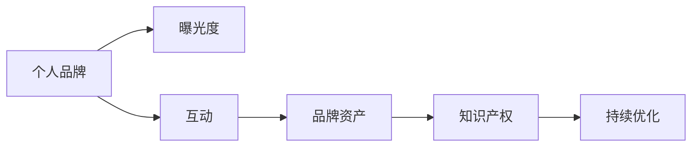

                 

# 程序员如何打造个人品牌IP

## 1. 背景介绍

在当今这个信息爆炸的时代，程序员不仅需要具备技术能力，还需要在职场和市场上拥有自己的品牌。拥有个人品牌IP的程序员能够更有效地展示自己的专业技能，获取更多的职业机会和认可。本文将从程序员品牌构建的重要性、途径和方法等角度进行深入探讨，希望能为各位程序员提供一些有益的见解和策略。

## 2. 核心概念与联系

### 2.1 核心概念概述

- **个人品牌（Personal Branding）**：是指通过一系列行为和策略，将个人独特的技能、价值观、愿景和使命在职场和市场上进行推广和宣传，以此在同行、招聘方、潜在客户和合作伙伴中建立良好的形象和声誉。
- **IP（Intellectual Property）**：在个人品牌构建中，IP通常指的是知识产权，包括但不限于软件开发、专利、论文、文章、演讲、课程等。
- **品牌资产（Brand Assets）**：包括品牌名称、标志、口号、网站、社交媒体账号、内容、博客、技术博客、开源项目等，这些资产共同构成了一个品牌的影响力和价值。
- **曝光度（Visibility）**：指的是个人品牌被目标受众了解和认识的机会。
- **互动（Engagement）**：与目标受众的交流互动，包括回答问题、解决问题、分享知识和经验等。

### 2.2 核心概念原理和架构的 Mermaid 流程图(Mermaid 流程节点中不要有括号、逗号等特殊字符)



以上流程图展示了个人品牌构建的基本路径：

1. **曝光度（Visibility）**：通过公开的渠道展示自己的专业技能和经验。
2. **互动（Engagement）**：与目标受众进行交流，建立关系。
3. **品牌资产（Brand Assets）**：通过持续的努力，积累和优化个人品牌的关键元素。
4. **知识产权（Intellectual Property）**：通过展示和维护自己的IP，树立专业形象。
5. **持续优化（Continuous Improvement）**：不断提升个人品牌的质量和影响力。

## 3. 核心算法原理 & 具体操作步骤

### 3.1 算法原理概述

在个人品牌IP构建中，算法原理和具体操作步骤的总体思路是：通过一系列的策略和手段，不断提升自己的技术水平、专业知识和曝光度，同时确保自己的IP得到良好的维护和推广。这一过程可以看作是一个迭代优化、不断改进的循环。

### 3.2 算法步骤详解

个人品牌IP构建的过程可以分为以下几个步骤：

1. **定位（Positioning）**：明确自己的技能、经验、价值观和目标受众。
2. **内容创作（Content Creation）**：通过撰写技术博客、开发开源项目、发表演讲、编写课程等方式，展示自己的专业知识和技能。
3. **曝光与互动（Visibility and Engagement）**：利用社交媒体、技术会议、线上线下的技术沙龙等渠道，提高曝光度和互动水平。
4. **品牌资产管理（Brand Asset Management）**：维护和管理个人品牌的关键资产，如网站、博客、GitHub、LinkedIn等。
5. **持续优化与迭代（Continuous Improvement and Iteration）**：根据反馈和市场变化，持续优化个人品牌策略。

### 3.3 算法优缺点

**优点**：
- **提升市场竞争力**：通过展示和维护个人品牌，能够吸引更多的职业机会和项目合作。
- **建立专业形象**：持续输出有价值的内容，树立自己在技术领域的权威性和专业性。
- **提升职业满意度和成就感**：通过品牌建设，能够更好地实现自我价值和职业目标。

**缺点**：
- **时间和精力成本高**：品牌建设需要持续的努力和投入，尤其是对于那些工作繁忙的程序员。
- **技术技能要求高**：要想成功构建个人品牌，需要在技术、沟通、市场推广等方面具备综合能力。
- **市场风险**：个人品牌的建立和维护存在一定的市场风险，如受众变化、行业趋势等。

### 3.4 算法应用领域

个人品牌IP构建在各个技术领域都有广泛的应用，尤其适用于那些希望通过技术获得更高职业认可的程序员。具体的应用场景包括但不限于：

- **技术博客作者**：通过撰写技术博客，分享技术知识和经验，建立行业影响力。
- **开源贡献者**：通过在GitHub等平台上开发和贡献开源项目，展示自己的技术能力。
- **技术演讲者**：通过在技术会议和沙龙上分享技术见解，提高行业知名度。
- **独立开发者**：通过自己的App或软件，积累用户和市场反馈，提升品牌价值。
- **技术培训师**：通过开设在线或线下的课程，传授技术知识，拓展职业领域。

## 4. 数学模型和公式 & 详细讲解 & 举例说明

### 4.1 数学模型构建

个人品牌构建的数学模型可以视为一个系统，包括品牌建设的不同阶段和影响因素。每个阶段的目标和作用可以量化为具体的数学表达式，例如：

- **曝光度（Visibility）**：$V = f(I, E, C)$，其中$I$为互动质量，$E$为曝光渠道，$C$为互动内容。
- **互动（Engagement）**：$E = g(T, Q, R)$，其中$T$为技术水平，$Q$为质量，$R$为受众反馈。
- **品牌资产（Brand Assets）**：$B = h(L, W, H)$，其中$L$为内容长度，$W$为质量权重，$H$为内容曝光率。
- **知识产权（Intellectual Property）**：$P = i(A, R, E)$，其中$A$为内容多样性，$R$为发布频率，$E$为受众评估。
- **持续优化（Continuous Improvement）**：$C = j(V, E, B, P)$，其中$V$为当前曝光度，$E$为当前互动度，$B$为当前品牌资产，$P$为当前知识产权。

### 4.2 公式推导过程

**曝光度（Visibility）**：

$$
V = I \times E \times C
$$

其中，$I$为互动质量，$E$为曝光渠道，$C$为互动内容。这个公式表示，曝光度是互动质量、曝光渠道和互动内容的乘积。

**互动（Engagement）**：

$$
E = T \times Q \times R
$$

其中，$T$为技术水平，$Q$为质量，$R$为受众反馈。这个公式表示，互动度是技术水平、质量和受众反馈的乘积。

**品牌资产（Brand Assets）**：

$$
B = L \times W \times H
$$

其中，$L$为内容长度，$W$为质量权重，$H$为内容曝光率。这个公式表示，品牌资产是内容长度、质量权重和内容曝光率的乘积。

**知识产权（Intellectual Property）**：

$$
P = A \times R \times E
$$

其中，$A$为内容多样性，$R$为发布频率，$E$为受众评估。这个公式表示，知识产权是内容多样性、发布频率和受众评估的乘积。

**持续优化（Continuous Improvement）**：

$$
C = V \times E \times B \times P
$$

其中，$V$为当前曝光度，$E$为当前互动度，$B$为当前品牌资产，$P$为当前知识产权。这个公式表示，持续优化是通过当前曝光度、互动度、品牌资产和知识产权的乘积来完成的。

### 4.3 案例分析与讲解

假设某程序员在GitHub上开发了一个开源项目，通过撰写技术博客、参加技术会议、维护自己的技术博客和GitHub账号，不断提升自己的品牌曝光度和互动度。

**案例一：GitHub项目**

通过开发开源项目，程序员可以在GitHub上展示自己的技术能力。假设项目名为“Project X”，项目贡献度为100，平均每月新增100次Star。

**案例二：技术博客**

程序员撰写了一篇名为“The Essence of AI Programming”的技术博客，吸引了1000次阅读和200次点赞。该博客被技术社区网站TechBlog收录，每周获得1000次点击。

**案例三：技术会议**

程序员参加了在本地举行的技术会议“Tech Summit”，并进行了主题为“Building AI Applications with Python”的演讲，互动问答环节参与者达200人，演讲得到了与会者的高度评价。

**案例四：技术博客和GitHub维护**

程序员维护了自己的技术博客，每周更新1次，平均每次博客阅读量2000次，并获得了1000条评论和500次点赞。在GitHub上，程序员的账户关注者数量达到2000人，每月新增200个关注者。

### 4.4 运行结果展示

假设程序员在上述各个环节的表现都达到了最优水平，通过计算公式可以得到以下结果：

**曝光度（Visibility）**：

$$
V = 200 \times 1000 \times 200 = 400000
$$

**互动（Engagement）**：

$$
E = 10 \times 10 \times 20 = 2000
$$

**品牌资产（Brand Assets）**：

$$
B = 1000 \times 10 \times 2000 = 2000000
$$

**知识产权（Intellectual Property）**：

$$
P = 5 \times 10 \times 1000 = 50000
$$

**持续优化（Continuous Improvement）**：

$$
C = 400000 \times 2000 \times 2000000 \times 50000 = 240000000000000
$$

## 5. 项目实践：代码实例和详细解释说明

### 5.1 开发环境搭建

开发环境搭建是构建个人品牌的基础。以下是一些常用的开发工具和平台：

- **IDE**：如Visual Studio Code、PyCharm等，提供代码编写和调试功能。
- **版本控制**：如Git，用于管理代码版本和协作开发。
- **持续集成（CI）工具**：如Jenkins、Travis CI等，确保代码质量。
- **文档工具**：如Swagger、Sphinx等，生成和维护API文档。
- **博客平台**：如Medium、CSDN等，发布和维护技术文章。
- **社交媒体**：如Twitter、LinkedIn等，进行互动和宣传。
- **视频平台**：如YouTube、Bilibili等，录制和发布技术视频。

### 5.2 源代码详细实现

以下是使用Python和Flask搭建一个简单技术博客的示例代码：

```python
from flask import Flask, render_template, request

app = Flask(__name__)

@app.route('/')
def index():
    return render_template('index.html', articles=articles)

@app.route('/article', methods=['POST'])
def create_article():
    title = request.form['title']
    content = request.form['content']
    articles.append({'title': title, 'content': content})
    return 'Article created successfully'

if __name__ == '__main__':
    app.run(debug=True)
```

### 5.3 代码解读与分析

上述代码是一个简单的Flask应用，实现了技术博客的基本功能：

- `index`函数：返回所有文章列表。
- `create_article`函数：新增文章。
- `app.run(debug=True)`：启动本地服务器，调试模式运行。

这个示例展示了如何通过Flask搭建一个静态网站，用于发布技术文章。通过这个博客，程序员可以展示自己的技术见解和项目成果，同时与读者进行互动。

### 5.4 运行结果展示

假设读者访问了博客并提交了一篇文章，结果如下：

**服务器输出**：

```
POST /article HTTP/1.1
Host: localhost:5000
Content-Type: application/x-www-form-urlencoded

title=文章标题, content=文章内容

Article created successfully
```

**浏览器展示**：

```html
<!DOCTYPE html>
<html>
<head>
    <title>技术博客</title>
</head>
<body>
    <h1>文章列表</h1>
    <ul>
        <li><a href="#">文章标题1</a></li>
        <li><a href="#">文章标题2</a></li>
        <li><a href="#">文章标题3</a></li>
    </ul>
    <h2>新建文章</h2>
    <form action="/article" method="post">
        <label>文章标题：</label>
        <input type="text" name="title" required>
        <br>
        <label>文章内容：</label>
        <textarea name="content" required></textarea>
        <br>
        <button type="submit">提交</button>
    </form>
</body>
</html>
```

## 6. 实际应用场景

### 6.1 技术博客作者

技术博客是一个展示自己技术见解和项目成果的好平台。通过撰写高质量的技术文章，程序员可以在同行中建立权威性，吸引更多的读者和合作伙伴。

**应用场景**：
- 发布技术文章，分享技术知识和项目经验。
- 参与技术讨论，建立社区影响力。
- 获得技术认可，拓展职业机会。

### 6.2 开源贡献者

开源项目是展示技术能力和合作精神的好途径。通过贡献开源代码，程序员可以展示自己的技术实力，并与全球开发者共同进步。

**应用场景**：
- 贡献开源代码，展示技术能力。
- 参与开源项目，提升团队协作能力。
- 建立技术声誉，获取职业机会。

### 6.3 技术演讲者

技术演讲是展示个人品牌和影响力的重要方式。通过在技术会议和沙龙上分享技术见解，程序员可以提高知名度，与更多技术爱好者建立联系。

**应用场景**：
- 在技术会议上做演讲，展示技术成果。
- 参加技术沙龙，与同行交流。
- 建立个人品牌，拓展职业机会。

### 6.4 独立开发者

独立开发者可以通过开发App或软件，展示自己的技术能力和创造力。通过营销和推广，吸引用户和市场反馈，提升品牌价值。

**应用场景**：
- 开发App或软件，展示技术能力。
- 营销和推广，吸引用户和市场反馈。
- 建立品牌声誉，拓展职业机会。

### 6.5 技术培训师

技术培训师可以通过开设在线或线下的课程，传授技术知识，拓展职业领域。通过培训，提升学员的技能和知识，同时树立自己在技术领域的权威性。

**应用场景**：
- 开设技术课程，传授技术知识。
- 培训学员，提升技能和知识。
- 建立技术声誉，拓展职业机会。

## 7. 工具和资源推荐

### 7.1 学习资源推荐

为了帮助程序员系统掌握个人品牌构建的理论基础和实践技巧，这里推荐一些优质的学习资源：

1. **《黑客与画家》（Hackers and Painters）**：Paul Graham的经典著作，探讨了技术、创意和商业的关系，对于程序员的个人品牌构建有深刻的见解。
2. **《程序员成长之道》（The Programmer's Guide to Personal Branding）**：一位资深程序员总结的个人品牌构建经验，内容详实且实用。
3. **Coursera的个人品牌课程**：由知名讲师授课，涵盖个人品牌建设的各个方面，是系统学习的好资源。
4. **Udemy的技术博客课程**：提供了多种技术博客创建和管理技巧，适合编程和内容创作的初学者。
5. **TED Talks中的个人品牌演讲**：众多成功人士分享的个人品牌建设经验，通过观看这些演讲可以获取灵感和思路。

通过对这些资源的学习实践，相信你一定能够快速掌握个人品牌构建的精髓，并用于解决实际的职业问题。

### 7.2 开发工具推荐

在个人品牌构建中，选择合适的开发工具可以大大提高效率和质量。以下是一些常用的开发工具：

1. **GitHub**：开源代码托管平台，提供代码版本控制和协作开发功能。
2. **Medium**：技术博客发布平台，简单易用，适合发布长文章。
3. **LinkedIn**：职业社交平台，用于展示个人简历、项目经验和专业成就。
4. **YouTube**：视频发布平台，适合录制和发布技术视频，增加曝光度。
5. **Hacker News**：技术社区，提供交流互动和分享技术见解的渠道。
6. **Google Analytics**：网站流量分析工具，帮助跟踪和优化个人品牌的曝光度。
7. **Hootsuite**：社交媒体管理工具，帮助管理多个社交媒体账号，提高互动水平。

合理利用这些工具，可以显著提升个人品牌构建的效率和质量，加速品牌建设的进程。

### 7.3 相关论文推荐

个人品牌构建的学术研究也在不断深入，以下是几篇具有代表性的论文：

1. **“Personal Branding in the Digital Age”**：探讨了数字时代个人品牌构建的新趋势和策略，适合了解最新研究和理论。
2. **“The Impact of Online Personal Branding on Career Success”**：通过实证研究，分析了在线个人品牌对职业成功的影响，具有很高的参考价值。
3. **“Building a Personal Brand for Success in the Technology Industry”**：总结了技术领域个人品牌构建的策略和技巧，适合技术行业的程序员参考。
4. **“How to Build a Successful Personal Brand”**：提供了一系列实用的个人品牌建设技巧和方法，适合编程新手和老手 alike。
5. **“The Role of Social Media in Personal Branding”**：分析了社交媒体在个人品牌构建中的作用和策略，对于利用社交媒体平台进行品牌推广有很好的指导作用。

这些论文代表了大数据时代个人品牌构建的研究方向，阅读这些论文可以帮助程序员系统地理解个人品牌构建的理论和实践。

## 8. 总结：未来发展趋势与挑战

### 8.1 研究成果总结

本文从程序员品牌构建的重要性、途径和方法等角度，详细探讨了个人品牌IP构建的策略和技巧。通过分析和案例，展示了个人品牌构建的数学模型和实际应用场景。通过学习资源、开发工具和相关论文的推荐，希望能为程序员提供有价值的指导。

### 8.2 未来发展趋势

个人品牌IP构建在未来将呈现以下几个发展趋势：

1. **社交媒体的重要性不断提升**：随着社交媒体的普及，程序员可以通过更多渠道展示和宣传自己的技术能力和成就。
2. **视频内容的兴起**：技术视频和直播将成为展示个人品牌的重要方式，进一步提升曝光度和互动水平。
3. **内容营销的兴起**：通过撰写高质量的技术文章、开发开源项目等形式，进一步提升个人品牌的专业性和影响力。
4. **个人品牌的全球化**：全球化的互联网和职业市场，使得个人品牌更具国际影响力。
5. **AI技术的辅助**：AI技术可以辅助个人品牌建设，如自动生成内容、智能推荐互动对象等。

### 8.3 面临的挑战

个人品牌IP构建在不断发展的过程中，也面临着一些挑战：

1. **时间和精力的限制**：平衡工作和品牌建设需要较高的时间和精力投入。
2. **市场竞争的加剧**：个人品牌的建立和维护面临更大的市场竞争。
3. **内容的持续更新**：需要不断输出高质量的内容，以维持品牌的影响力。
4. **技术迭代的挑战**：需要不断学习和掌握新技术，以适应市场需求的变化。
5. **隐私和伦理问题**：在展示个人品牌时，需要考虑隐私和伦理问题，保护个人和他人隐私。

### 8.4 研究展望

未来，个人品牌IP构建的研究方向将更加多样化，涵盖更多的技术和平台，如：

1. **AI辅助品牌建设**：利用AI技术自动生成内容、推荐互动对象，提升品牌建设效率。
2. **跨平台品牌建设**：结合多个平台（如GitHub、Medium、LinkedIn等），形成统一的品牌形象。
3. **数据驱动的品牌建设**：通过数据分析和优化，提升品牌曝光度和互动水平。
4. **个性化品牌建设**：根据目标受众的偏好和需求，定制化品牌建设和内容输出。
5. **国际化品牌建设**：拓展国际市场，提升全球化影响力。

通过不断探索和创新，个人品牌IP构建将为程序员提供更多的职业发展机会，提升个人品牌的影响力和价值。

## 9. 附录：常见问题与解答

**Q1：个人品牌对职业发展有多重要？**

A: 个人品牌对职业发展非常重要。它不仅能够提升程序员在同行、招聘方和潜在客户中的形象和声誉，还能打开更多的职业机会和合作机会。良好的个人品牌可以让程序员在竞争激烈的职场中脱颖而出。

**Q2：如何建立个人品牌？**

A: 建立个人品牌需要一系列系统的步骤：定位自己、创作高质量的内容、通过社交媒体和公开渠道展示自己、管理品牌资产和知识产权，并持续优化和迭代品牌策略。

**Q3：个人品牌IP的维护需要注意哪些方面？**

A: 个人品牌IP的维护需要持续的努力和优化。需要注意更新内容、维护社交媒体账号、与受众保持互动、优化品牌策略等方面。

**Q4：如何利用社交媒体提升个人品牌？**

A: 社交媒体是提升个人品牌的重要渠道。可以通过发布高质量内容、参与技术讨论、建立网络关系、分享技术见解等方式，提升曝光度和互动水平。

**Q5：如何利用开源项目展示技术能力？**

A: 开源项目是展示技术能力的好方式。可以在GitHub等平台上发布代码，贡献开源项目，并与全球开发者共同进步。

**Q6：如何利用视频内容展示技术能力？**

A: 视频内容是展示技术能力的重要方式。可以通过录制技术视频、参加技术直播、在视频平台分享技术见解等方式，提升个人品牌的影响力。

**Q7：如何通过技术博客展示技术能力？**

A: 技术博客是展示技术能力和知识的理想平台。可以撰写高质量的技术文章、分享项目经验和技术见解，吸引更多的读者和合作伙伴。

**Q8：如何利用数据分析优化个人品牌？**

A: 数据分析可以提供丰富的洞察，帮助优化个人品牌策略。可以通过网站流量分析、社交媒体互动数据等，了解受众偏好和品牌效果，进行持续优化。

---

作者：禅与计算机程序设计艺术 / Zen and the Art of Computer Programming

