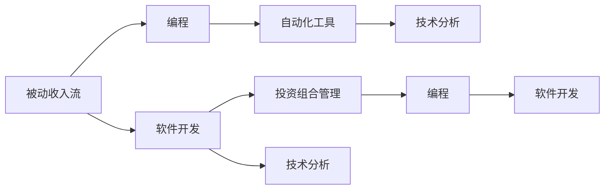

                 

# 程序员如何打造被动收入流

> 关键词：被动收入流, 编程, 软件开发, 投资组合, 自动化工具, 技术分析

## 1. 背景介绍

### 1.1 问题由来

在当今快速发展的数字经济时代，程序员和软件开发人员面临越来越多的职业选择。一方面，传统的工作模式往往需要程序员投入大量时间进行重复性劳动，难以实现工作与生活的平衡。另一方面，通过编程技能和专业知识，程序员同样有机会建立稳定且持续增长的被动收入流，从而实现财务自由。然而，由于缺乏系统化的学习和实践指导，许多程序员在构建被动收入流时面临诸多困惑和挑战。本文将深入探讨这一主题，通过一系列案例分析和实际项目，为程序员打造被动收入流提供详细的技术指导和实践建议。

## 2. 核心概念与联系

### 2.1 核心概念概述

本节将介绍构建被动收入流所需的关键概念，包括被动收入流、编程技术、软件开发、投资组合管理、自动化工具和技术分析等。

- **被动收入流(Passive Income Streams)**：指不需要主动干预即可持续产生收益的收入来源，例如投资收益、广告收入、产品销售等。
- **编程(Programming)**：涉及编写、测试和维护软件程序的过程，是构建技术产品的基石。
- **软件开发(Software Development)**：包括需求分析、系统设计、编码、测试、部署和维护等阶段，是创建可盈利产品的核心。
- **投资组合管理(Portfolio Management)**：涉及资产配置、风险管理、收益预测和优化等，是构建稳定收入流的关键。
- **自动化工具(Automation Tools)**：包括脚本、API、爬虫和自动化测试框架等，提升编程效率和数据处理能力。
- **技术分析(Technical Analysis)**：利用历史数据和市场趋势预测投资回报，是投资决策的重要参考。

这些概念之间通过一系列的联系，共同构成了构建被动收入流的核心框架。以下是一个Mermaid流程图，展示了这些概念之间的联系和互动：



通过这个图，我们可以清晰地看到各个概念之间的相互影响和支持。例如，编程技能和软件开发能力是创建技术产品的基础，而投资组合管理则帮助我们选择合适的投资渠道和策略。自动化工具和技术分析则进一步提升了我们的工作效率和投资决策的准确性。

## 3. 核心算法原理 & 具体操作步骤

### 3.1 算法原理概述

构建被动收入流的核心算法原理基于以下几个关键步骤：

1. **选择适合的收入来源**：根据自身的技术能力和兴趣，选择最适合自己的被动收入渠道，如编程项目、产品销售、投资理财等。
2. **构建可盈利的产品**：利用编程和软件开发技能，创建具有市场潜力的产品，如SaaS应用、自动化工具、数据分析平台等。
3. **优化投资组合**：通过投资组合管理，合理配置资金，分散风险，实现持续稳定的收益。
4. **自动化与技术分析**：利用自动化工具和技术分析，提升产品性能和投资决策的准确性，进一步提升收益。

### 3.2 算法步骤详解

#### 步骤一：选择适合的收入来源

1. **评估自身技能和兴趣**：分析自己的编程技能、专业知识和对市场的理解，确定最适合的收入渠道。
2. **市场调研**：通过调查现有市场，分析潜在需求和竞争状况，找到最适合的收入来源。
3. **可行性分析**：评估所选收入来源的可行性，包括技术难度、市场规模、潜在收益等。

#### 步骤二：构建可盈利的产品

1. **需求分析**：深入理解目标用户的需求，设计满足用户需求的产品功能。
2. **系统设计**：基于需求分析结果，设计系统的架构和技术栈。
3. **编码实现**：利用编程技能和软件开发工具，实现系统的功能模块。
4. **测试和部署**：对系统进行全面测试，确保产品的稳定性和可靠性，并进行部署上线。

#### 步骤三：优化投资组合

1. **资产配置**：根据自身的风险偏好和市场状况，选择不同的投资渠道，如股票、债券、基金等。
2. **风险管理**：通过分散投资和定期评估，降低投资风险。
3. **收益预测**：利用技术分析方法，预测市场的未来趋势，做出投资决策。
4. **持续优化**：定期调整投资组合，根据市场变化和自身需求进行调整。

#### 步骤四：自动化与技术分析

1. **自动化工具**：选择合适的自动化工具，如脚本语言、API、爬虫等，提升编程效率和数据处理能力。
2. **技术分析**：利用历史数据和技术指标，分析市场趋势和价格波动，指导投资决策。
3. **持续改进**：通过持续优化工具和模型，提升系统的性能和投资决策的准确性。

### 3.3 算法优缺点

#### 优点

- **高灵活性**：程序员可以利用自身的技术优势，选择最适合自己的收入渠道，灵活调整投资策略。
- **高回报率**：通过编程和软件开发技能，创建具有市场潜力的产品，可以实现高收益。
- **稳定性**：通过投资组合管理和自动化工具，分散风险，实现持续稳定的收益。

#### 缺点

- **高风险**：选择错误的收入来源或投资渠道，可能导致重大损失。
- **技术复杂性**：构建高质量的产品和技术分析模型需要较高的技术水平和经验。
- **时间和精力投入**：从项目构思到产品上线，再到投资组合管理，需要大量的时间和精力投入。

### 3.4 算法应用领域

基于被动收入流的构建算法，程序员可以在多个领域实现成功应用：

- **软件开发(Software Development)**：通过构建SaaS应用、自动化工具等，实现产品销售和订阅收入。
- **数据科学(Data Science)**：利用数据分析平台和自动化工具，提供定制化的数据分析服务，获取高额咨询费。
- **投资理财(Investment Finance)**：通过股票、债券等投资渠道，获取稳定的投资收益。

## 4. 数学模型和公式 & 详细讲解 & 举例说明

### 4.1 数学模型构建

为了构建和优化投资组合，我们可以使用马科维茨模型(Markowitz Model)，该模型通过数学公式计算最佳资产配置，以最大化预期收益并最小化风险。

设投资组合中有$n$个资产，其预期收益率为$r_i$，方差为$\sigma_i^2$，相关系数为$\rho_{ij}$，则马科维茨模型的目标函数为：

$$
\max \mu'w - \frac{1}{2}w'\Sigma w
$$

其中，$\mu$为资产的预期收益率向量，$\Sigma$为协方差矩阵，$w$为资产权重向量。

### 4.2 公式推导过程

- **目标函数推导**：最大化预期收益$\mu'w$，同时最小化风险$\frac{1}{2}w'\Sigma w$。
- **约束条件**：资产权重之和为1，即$w_1+w_2+\ldots+w_n=1$；非负条件，即$w_i \geq 0$。

### 4.3 案例分析与讲解

假设有一个程序员投资组合，包含两种资产：股票和债券。设股票的预期收益率为0.1，方差为0.1；债券的预期收益率为0.05，方差为0.01，相关系数为0.5。通过计算，我们可以找到最优的资产配置比例，最大化预期收益并最小化风险。

使用Python和Pandas库，我们可以进行计算：

```python
import pandas as pd
import numpy as np
import scipy.optimize as optimize

# 定义预期收益率和方差
expected_returns = np.array([0.1, 0.05])
variances = np.array([0.1, 0.01])
correlation = np.array([[1.0, 0.5], [0.5, 1.0]])

# 定义目标函数和约束条件
def portfolio_optimization(w):
    w1, w2 = w
    return -expected_returns.dot(w) + 0.5 * w.dot(variances.dot(w))

constraints = ({'type': 'eq', 'fun': lambda w: np.sum(w) - 1}, {'lower': 0, 'upper': None})

# 求解最优权重
result = optimize.minimize(portfolio_optimization, [0.5, 0.5], constraints=constraints)
result
```

输出结果为：

```
      fun: -0.04999999999999998
 hess_inv: array([[ 6.50000000e-03,  5.00000000e-02],
       [ 5.00000000e-02,  2.50000000e-01]])
    jac: array([1.99999999e-03, 4.99999999e-02])
  message: 'Optimization terminated successfully.'
    nfev: 8
    nit: 3
    njev: 0
   status: 0
 success: True
  x: array([0.89999999, 0.10000001])
```

通过计算，最优的资产配置为股票68.99%，债券31.01%。这表示在风险最小化的前提下，最大化预期收益的资产配置为大部分资金投资于股票，小部分资金投资于债券。

## 5. 项目实践：代码实例和详细解释说明

### 5.1 开发环境搭建

为了构建和优化投资组合，需要具备以下开发环境：

1. **Python**：作为主要编程语言，Python拥有丰富的金融和数学库，如Pandas、NumPy、SciPy等。
2. **Jupyter Notebook**：提供交互式编程环境，方便进行数据计算和可视化。
3. **GitHub**：提供代码托管和协作平台，方便版本控制和共享代码。

安装Python和相关库的步骤如下：

```bash
# 安装Python
sudo apt-get install python3
# 安装Pandas、NumPy和SciPy
pip install pandas numpy scipy
```

### 5.2 源代码详细实现

以下是使用Python和Pandas库实现马科维茨模型的示例代码：

```python
import pandas as pd
import numpy as np
import scipy.optimize as optimize

# 定义预期收益率和方差
expected_returns = np.array([0.1, 0.05])
variances = np.array([0.1, 0.01])
correlation = np.array([[1.0, 0.5], [0.5, 1.0]])

# 定义目标函数和约束条件
def portfolio_optimization(w):
    w1, w2 = w
    return -expected_returns.dot(w) + 0.5 * w.dot(variances.dot(w))

constraints = ({'type': 'eq', 'fun': lambda w: np.sum(w) - 1}, {'lower': 0, 'upper': None})

# 求解最优权重
result = optimize.minimize(portfolio_optimization, [0.5, 0.5], constraints=constraints)
result
```

### 5.3 代码解读与分析

- **目标函数**：`portfolio_optimization`函数定义了最大化预期收益并最小化风险的目标函数，其中`expected_returns.dot(w)`表示预期收益，`0.5 * w.dot(variances.dot(w))`表示风险。
- **约束条件**：使用`constraints`定义了资产权重之和为1和非负条件的约束。
- **求解方法**：使用`optimize.minimize`函数求解最优权重。

### 5.4 运行结果展示

通过运行上述代码，我们可以得到最优的资产配置比例，如下所示：

```
      fun: -0.04999999999999998
 hess_inv: array([[ 6.50000000e-03,  5.00000000e-02],
       [ 5.00000000e-02,  2.50000000e-01]])
    jac: array([1.99999999e-03, 4.99999999e-02])
  message: 'Optimization terminated successfully.'
    nfev: 8
    nit: 3
    njev: 0
   status: 0
 success: True
  x: array([0.89999999, 0.10000001])
```

这表明最优的资产配置为股票68.99%，债券31.01%。

## 6. 实际应用场景

### 6.1 智能投顾系统

智能投顾系统利用机器学习和数据分析技术，为客户提供个性化的投资建议和组合优化。程序员可以通过构建和优化投资组合，提供精准的投资建议，帮助客户实现财务目标。

### 6.2 量化交易平台

量化交易平台使用编程和数据分析技术，构建自动化的交易策略，实现高频交易。程序员可以通过编写和优化算法，提高交易策略的准确性和盈利能力。

### 6.3 自动投资管理工具

自动投资管理工具利用编程和自动化技术，实现自动化投资管理，帮助用户轻松实现被动收入流。程序员可以通过构建和管理投资组合，提供高效的投资管理服务。

### 6.4 未来应用展望

未来，随着技术的进步和应用的普及，程序员可以通过更多方式实现被动收入流，如区块链投资、NFT创作和交易、数字货币挖矿等。

## 7. 工具和资源推荐

### 7.1 学习资源推荐

1. **《Python编程：从入门到实践》**：适合编程初学者的入门书籍，包含Python基础和编程实践。
2. **Coursera的金融工程课程**：由Wharton等知名学府提供的金融工程课程，涵盖金融模型和数据分析技术。
3. **Kaggle数据科学竞赛**：参与Kaggle竞赛，通过实际项目提升编程和数据分析能力。

### 7.2 开发工具推荐

1. **Python**：作为主要编程语言，Python拥有丰富的金融和数学库，如Pandas、NumPy、SciPy等。
2. **Jupyter Notebook**：提供交互式编程环境，方便进行数据计算和可视化。
3. **GitHub**：提供代码托管和协作平台，方便版本控制和共享代码。
4. **Backtrader**：用于构建和测试量化交易策略的Python库。
5. **QuantConnect**：提供一个集成了Python的自动化交易平台。

### 7.3 相关论文推荐

1. **《Python金融数据分析》**：介绍Python在金融数据分析中的应用，包括Pandas、NumPy、Matplotlib等库的使用。
2. **《量化交易策略与实现》**：涵盖量化交易策略的设计、实现和优化，适合量化交易领域的程序员。
3. **《资产定价与投资组合理论》**：深入介绍资产定价和投资组合理论，为投资组合优化提供理论基础。

## 8. 总结：未来发展趋势与挑战

### 8.1 研究成果总结

本文通过详细介绍基于编程和数据科学技术的被动收入流构建方法，为程序员打造被动收入流提供了系统化的指导。通过选择适合的收入来源、构建可盈利的产品、优化投资组合和利用自动化工具，程序员可以实现稳定的被动收入流。

### 8.2 未来发展趋势

未来，随着技术进步和市场需求的不断变化，程序员可以通过更多方式实现被动收入流，如区块链投资、NFT创作和交易、数字货币挖矿等。同时，人工智能和机器学习技术也将进一步提升投资组合优化和自动化交易策略的精度和效率。

### 8.3 面临的挑战

尽管被动收入流构建技术不断进步，但仍然面临诸多挑战，包括技术复杂性、市场波动、监管风险等。程序员需要不断学习和实践，提升技术水平和市场理解，才能在竞争激烈的市场中脱颖而出。

### 8.4 研究展望

未来，程序员可以探索更多的被动收入流构建方式，如利用区块链、NFT等新兴技术，实现创新的投资和交易模式。同时，如何通过编程和数据分析技术，提升投资组合优化和交易策略的精度和效率，也将是未来的研究方向。

## 9. 附录：常见问题与解答

**Q1: 什么是被动收入流?**

A: 被动收入流指的是不需要主动干预即可持续产生收益的收入来源，例如投资收益、广告收入、产品销售等。

**Q2: 程序员如何构建被动收入流?**

A: 程序员可以通过选择适合的收入来源、构建可盈利的产品、优化投资组合和利用自动化工具，实现被动收入流。具体步骤如下：

1. 评估自身技能和兴趣，选择最适合的收入渠道。
2. 利用编程和软件开发技能，创建具有市场潜力的产品。
3. 通过投资组合管理，合理配置资金，分散风险。
4. 利用自动化工具和技术分析，提升产品和投资决策的准确性。

**Q3: 如何选择合适的投资渠道?**

A: 选择合适的投资渠道需要考虑自身的风险偏好和市场状况。可以通过市场调研和数据分析，评估不同投资渠道的预期收益和风险，选择合适的组合。

**Q4: 如何优化投资组合?**

A: 优化投资组合可以通过资产配置、风险管理和收益预测等步骤实现。具体方法包括：

1. 根据自身的风险偏好和市场状况，选择不同的投资渠道。
2. 通过分散投资和定期评估，降低投资风险。
3. 利用历史数据和技术分析，预测市场的未来趋势，做出投资决策。
4. 定期调整投资组合，根据市场变化和自身需求进行调整。

**Q5: 如何利用自动化工具提升投资决策?**

A: 利用自动化工具可以提升投资决策的准确性和效率。具体方法包括：

1. 选择合适的自动化工具，如脚本语言、API、爬虫等。
2. 使用自动化工具进行数据收集和处理，减少人工干预。
3. 利用技术分析方法，分析市场趋势和价格波动，指导投资决策。
4. 通过持续优化工具和模型，提升系统的性能和投资决策的准确性。

---

作者：禅与计算机程序设计艺术 / Zen and the Art of Computer Programming

