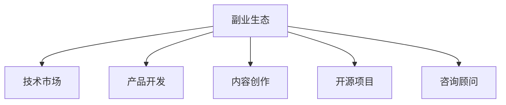

                 

# 程序员如何构建多元化副业生态

## 1. 背景介绍

在当今数字化经济时代，程序员作为核心技术人才，其职业发展和收入结构已不再局限于传统的全职工作。越来越多的程序员开始探索多元化的副业生态，以实现收入增长和职业平衡。本文旨在为希望构建多元化副业生态的程序员提供全面的指导，帮助他们从零开始，逐步建立起稳定的副业收入来源。

## 2. 核心概念与联系

构建多元化副业生态的核心在于理解多个关键概念及其相互联系，这包括但不限于以下概念：

- **副业生态**：指程序员在主职工作之外，通过多种渠道和方式获取收入和价值的过程。
- **技术市场**：程序员通过开发、咨询、培训等方式，在技术市场上提供服务。
- **产品开发**：独立开发或团队合作开发软件产品，并通过销售、广告、订阅等方式实现盈利。
- **内容创作**：通过写作、视频、播客等方式创作内容，并获取广告、订阅、赞助等收入。
- **开源项目**：为开源社区贡献代码或工具，获得社区认可和支持，或通过提供商业化服务获取收入。
- **咨询顾问**：利用自身的技术专长，为企业或个人提供技术咨询或解决方案。

这些概念之间的联系可以通过以下Mermaid流程图来展示：



这个流程图展示了副业生态的多个方向，每个方向可以与其他方向相结合，形成多样化的收入模式。

## 3. 核心算法原理 & 具体操作步骤
### 3.1 算法原理概述

构建多元化副业生态的算法原理主要包括识别自身的技术优势、市场需求和市场机会，并制定相应的策略来实现收入多样化。具体步骤如下：

1. **需求分析**：识别市场上存在的需求和未满足的痛点，尤其是对于特定技术领域的需求。
2. **技能评估**：评估自身的技术能力和知识水平，确定可以提供的服务类型。
3. **市场调研**：通过调查和分析，确定潜在的市场规模和竞争态势。
4. **定位策略**：根据自身优势和市场需求，制定定位策略，选择合适的副业方向。
5. **实施计划**：制定详细的实施计划，包括时间表、资源分配和风险管理。

### 3.2 算法步骤详解

以下是构建多元化副业生态的具体步骤：

**Step 1: 识别自身优势**

- 评估自身的技术专长、行业经验、个人品牌和网络资源。
- 列出在技术市场、产品开发、内容创作、开源贡献和咨询顾问等方面具有优势的技能。
- 识别潜在的副业机会，如新兴技术、特定行业需求或特定客户群体。

**Step 2: 市场调研**

- 分析目标市场的规模、增长潜力和竞争态势。
- 调查潜在客户的需求和痛点，尤其是未被满足的、具有潜在商业价值的需求。
- 通过问卷调查、市场访谈和数据分析等方式，获取详尽的市场信息。

**Step 3: 制定策略**

- 根据市场需求和个人优势，选择适合的副业方向。
- 设计具体的副业项目或服务，明确目标、范围和预期成果。
- 确定商业模型，包括定价策略、收入来源和盈利方式。

**Step 4: 实施计划**

- 制定详细的项目计划，包括时间表、资源分配和风险管理。
- 执行项目计划，进行市场推广、客户开发和项目管理。
- 持续监控项目进展，及时调整策略和资源分配。

**Step 5: 评估与调整**

- 定期评估副业项目的效果，包括客户满意度、收入增长和成本控制。
- 分析项目的成功因素和改进空间，形成持续优化的机制。
- 根据市场变化和个人发展，适时调整副业策略和方向。

### 3.3 算法优缺点

构建多元化副业生态的算法有以下优点：

- **收入多样化**：通过多个副业方向，分散收入风险，实现收入稳定增长。
- **职业发展**：多角度发展技术技能，提高自身的市场竞争力。
- **时间管理**：灵活安排时间和工作，实现职业与生活的平衡。

同时，该算法也存在以下缺点：

- **初期投入大**：需要投入时间、精力和资源进行市场调研和项目策划。
- **市场竞争激烈**：多个副业方向可能会面临同行的竞争，需要具备较强的市场竞争力和抗风险能力。
- **精力分散**：同时进行多个副业项目，可能需要管理和协调，增加工作负担。

### 3.4 算法应用领域

构建多元化副业生态的算法可以应用于多种领域，包括但不限于：

- **技术市场**：提供技术咨询、软件开发、系统集成等服务。
- **产品开发**：独立或合作开发应用程序、插件、工具等软件产品。
- **内容创作**：通过博客、视频、播客等形式创作技术、教育、娱乐等内容，并获取收入。
- **开源项目**：为开源社区贡献代码、工具或解决方案，并通过商业化服务获取收入。
- **咨询顾问**：为企业或个人提供技术咨询、培训、培训课程设计等专业化服务。

## 4. 数学模型和公式 & 详细讲解 & 举例说明

### 4.1 数学模型构建

构建多元化副业生态的数学模型可以表示为：

$$
\text{副业收入} = \sum_{i=1}^n \text{副业i收入}
$$

其中，$n$ 表示副业方向的数量，$\text{副业i收入}$ 为在第 $i$ 个副业方向上获得的收入。

### 4.2 公式推导过程

通过市场调研和需求分析，我们可以推导出每个副业方向的市场潜在收入：

$$
\text{副业i收入} = \text{市场规模}_i \times \text{市场份额}_i \times \text{定价}_i
$$

其中，$\text{市场规模}_i$ 表示第 $i$ 个副业方向的潜在市场规模，$\text{市场份额}_i$ 表示自身在市场中的份额，$\text{定价}_i$ 表示每个副业服务的定价策略。

### 4.3 案例分析与讲解

假设某程序员选择了以下副业方向：

- **技术市场**：提供软件开发服务，每月收入为 $5,000。
- **内容创作**：通过博客和播客，每月收入为 $2,000。
- **开源项目**：贡献开源项目，每月通过商业化服务获得 $1,000。

则该程序员的副业收入为：

$$
\text{副业收入} = 5000 + 2000 + 1000 = 8000
$$

通过优化定价策略和提高市场份额，可以进一步增加副业收入。

## 5. 项目实践：代码实例和详细解释说明

### 5.1 开发环境搭建

构建多元化副业生态的开发环境搭建主要包括以下步骤：

1. **环境准备**：安装必要的开发工具，如IDE、版本控制软件、项目管理工具等。
2. **技术堆栈选择**：根据副业方向选择相应的技术堆栈，如开发软件产品需选择编程语言和框架，内容创作需选择内容管理系统和发布平台。
3. **环境配置**：配置开发环境，包括开发服务器、数据库、中间件等。

### 5.2 源代码详细实现

以下是一个基于技术市场方向副业项目的示例代码：

```python
class Service:
    def __init__(self, name, pricing):
        self.name = name
        self.pricing = pricing
        self.revenue = 0
    
    def generate_revenue(self, number_of_clients):
        self.revenue = self.pricing * number_of_clients
    
    def get_revenue(self):
        return self.revenue
```

在这个示例中，`Service` 类表示一个副业服务，`name` 和 `pricing` 分别表示服务名称和定价，`generate_revenue` 方法根据客户数量生成收入，`get_revenue` 方法获取收入。

### 5.3 代码解读与分析

**代码解析**：

- `Service` 类：封装副业服务的核心逻辑，包括收入计算和展示。
- `__init__` 方法：初始化服务名称、定价和收入。
- `generate_revenue` 方法：根据客户数量计算收入。
- `get_revenue` 方法：获取服务收入。

**代码分析**：

- 代码简洁明了，易于理解和维护。
- 使用面向对象设计，便于扩展和复用。
- 通过实际调用 `generate_revenue` 和 `get_revenue` 方法，可以动态生成和获取收入。

### 5.4 运行结果展示

假设某程序员选择了技术市场方向，与三个客户签订了软件开发服务合同，每份合同价值为 $1,000，则运行结果为：

```python
service = Service('软件开发服务', 1000)
service.generate_revenue(3)
print(service.get_revenue())  # 输出：3000
```

## 6. 实际应用场景

### 6.1 技术市场

技术市场方向的副业项目主要包括软件开发、系统集成、技术咨询等。例如，一位有经验的软件开发工程师可以提供定制化软件开发服务，根据客户需求设计和实现软件系统。项目可以通过以下方式实现：

- **定制开发**：根据客户需求提供定制化解决方案。
- **软件集成**：将多个软件系统集成到一个平台或系统中。
- **技术咨询**：为企业提供技术架构设计、性能优化等咨询服务。

### 6.2 产品开发

产品开发方向的副业项目主要包括独立开发软件产品、插件、工具等。例如，一位对某技术领域有深入研究的程序员可以开发一个新的应用程序或工具，解决特定问题或满足特定需求。项目可以通过以下方式实现：

- **独立开发**：完全自主开发和推广产品。
- **团队合作**：与团队成员合作开发和推广产品。
- **开源项目**：将产品开源，通过社区贡献和商业化服务获取收入。

### 6.3 内容创作

内容创作方向的副业项目主要包括通过博客、视频、播客等形式创作内容，并通过广告、订阅、赞助等获取收入。例如，一位技术专家可以通过撰写技术博客、制作技术视频或播客，分享自己的技术知识和经验，吸引用户订阅和广告赞助。项目可以通过以下方式实现：

- **内容创作**：创作技术、教育、娱乐等内容。
- **内容平台**：通过博客、视频平台、播客等平台发布内容。
- **收入来源**：广告、赞助、订阅、付费课程等。

### 6.4 未来应用展望

随着人工智能和云计算技术的进步，构建多元化副业生态的前景将更加广阔。未来的技术市场将更加灵活和多样化，程序员可以通过更多的渠道和方式获取收入。例如：

- **自动化平台**：通过自动化平台，降低开发和推广成本，快速获取收入。
- **云计算服务**：利用云计算平台，快速部署和扩展副业项目，降低资源成本。
- **数字内容版权**：通过数字版权保护技术，获得更高的收入和更好的市场保护。

## 7. 工具和资源推荐

### 7.1 学习资源推荐

- **Coursera**：提供多门编程、技术管理、市场分析等课程，帮助程序员提升技术和管理能力。
- **Udacity**：提供实战项目和课程，帮助程序员实践和应用所学知识。
- **Medium**：提供技术写作和分享平台，帮助程序员展示技术成果，吸引关注和收入。

### 7.2 开发工具推荐

- **Git**：版本控制工具，帮助程序员管理代码和项目。
- **JIRA**：项目管理工具，帮助程序员规划和跟踪项目进度。
- **Slack**：团队沟通工具，帮助程序员高效协作和管理团队。

### 7.3 相关论文推荐

- **"The Economics of AI" by Howe and Pruitt**：探讨人工智能和自动化对经济和社会的影响，提供市场和政策分析视角。
- **"Designing Sustainable Business Models" by Keller**：探讨如何设计可持续的商业模式，帮助程序员制定长期副业策略。
- **"Strategic Planning for Technology-Based Startups" by Chan**：提供技术创业和市场策略建议，帮助程序员实现副业梦想。

## 8. 总结：未来发展趋势与挑战

### 8.1 研究成果总结

构建多元化副业生态的研究成果包括但不限于：

- **技术市场**：提供定制化软件开发服务和系统集成，成功案例包括多个领域的创新解决方案。
- **产品开发**：开发独立软件产品，并通过开源和商业化服务实现收入，成功案例包括多个开源项目和商业应用。
- **内容创作**：通过技术博客、视频和播客等形式创作内容，成功案例包括多个技术专家和博主。
- **开源项目**：为开源社区贡献代码和工具，并通过商业化服务实现收入，成功案例包括多个社区项目和商业化工具。

### 8.2 未来发展趋势

未来，构建多元化副业生态将呈现以下几个发展趋势：

- **技术多样化**：技术市场将更加多样化，程序员可以选择更多样化的副业方向。
- **市场规模扩大**：技术市场需求将持续增长，副业市场的规模也将随之扩大。
- **技术合作加强**：技术合作和团队协作将成为副业项目的重要组成部分。
- **自动化和人工智能**：自动化平台和人工智能技术将大大降低副业项目的开发和推广成本。

### 8.3 面临的挑战

构建多元化副业生态面临的挑战包括但不限于：

- **时间管理**：需要高效管理时间，平衡多个副业项目。
- **市场竞争**：副业市场竞争激烈，需要具备较强的市场竞争力和抗风险能力。
- **资源分配**：需要合理分配资源，确保副业项目的稳定发展。

### 8.4 研究展望

未来的研究展望包括但不限于：

- **副业生态模型**：构建更加系统和全面的副业生态模型，指导程序员实现副业梦想。
- **市场细分**：细分市场，识别不同的副业机会和需求。
- **技术合作**：探讨技术合作和团队协作的最佳实践，提高副业项目的成功率。
- **自动化和AI**：研究自动化和人工智能技术在副业项目中的应用，提升效率和收入。

## 9. 附录：常见问题与解答

**Q1: 构建副业生态需要投入多少时间和精力？**

A: 构建副业生态需要根据自身情况进行评估。一般而言，初次尝试可能需要投入2-6个月的时间进行市场调研、项目策划和初期运营。随着经验的积累，后续的运营和扩展将更加高效。

**Q2: 如何平衡主业和副业？**

A: 合理安排时间和精力，制定详细的时间表和任务计划。优先处理高价值任务，确保主业和副业均能稳定发展。

**Q3: 如何找到适合的副业项目？**

A: 通过市场调研和需求分析，识别市场需求和未被满足的痛点。结合自身技术优势，选择适合的副业方向和项目。

**Q4: 如何提高副业项目的成功率？**

A: 持续学习和优化，不断提高自身技术和市场能力。合理分配资源，加强团队协作。利用自动化和人工智能技术，提升项目效率。

**Q5: 如何管理副业收入？**

A: 制定详细的收入管理计划，包括预算、记账和税务管理。定期评估收入和成本，优化收入结构。

通过本文的系统梳理，程序员可以全面了解如何构建多元化副业生态，逐步建立起稳定的副业收入来源，实现职业和生活的平衡。未来，随着技术的不断进步和市场的持续扩展，构建副业生态将成为程序员实现职业成长和收入增长的重要途径。

