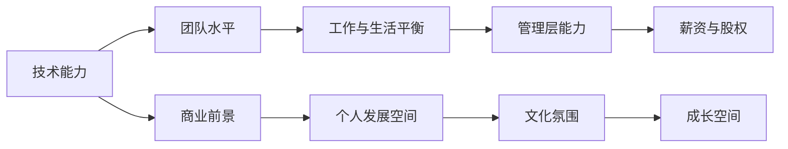

                 

# 程序员如何评估早期创业公司offer

## 1. 背景介绍

在当今瞬息万变的科技行业中，对于程序员而言，选择一个好的早期创业公司offer是职业发展中的重要决策之一。然而，由于这些公司往往在发展初期面临着诸多的不确定性，因此评估offer的过程相较于成熟企业更具挑战性。本文将深入探讨如何从技术、团队、文化和商业前景等多个维度评估早期创业公司offer，为程序员提供全面的指导。

## 2. 核心概念与联系

### 2.1 核心概念概述

- **早期创业公司offer**：指初创公司在早期阶段提供的雇员合同或职位邀请，通常包括薪资、股权激励、工作环境和成长空间等要素。
- **评估标准**：包括技术能力、团队水平、文化氛围、商业前景、管理层能力、工作与生活平衡、个人发展空间等因素。
- **决策模型**：综合考虑多种因素，构建评估指标体系，通过打分和加权计算得出综合评估结果。

### 2.2 核心概念原理和架构的 Mermaid 流程图(Mermaid 流程节点中不要有括号、逗号等特殊字符)



## 3. 核心算法原理 & 具体操作步骤

### 3.1 算法原理概述

评估早期创业公司offer的过程本质上是一个多目标优化问题。目标是通过综合考虑各个维度，找到最符合个人职业发展目标的offer。为此，可以构建一个包含多个指标的评估模型，并通过优化算法计算每个offer的综合得分。

### 3.2 算法步骤详解

#### 3.2.1 数据收集与处理

- **技术能力**：收集公司技术栈、技术架构、过往项目案例等资料，了解技术水平。
- **团队水平**：调查团队规模、成员背景、技术水平、工作满意度等。
- **商业前景**：了解公司的市场定位、竞争优势、客户资源、融资情况等。
- **工作与生活平衡**：考察公司的办公环境、加班文化、假期安排等。
- **管理层能力**：评估管理层的经验、领导风格、决策透明度等。
- **个人发展空间**：考虑公司对个人职业发展的支持和晋升路径。
- **文化氛围**：了解公司的价值观、员工关系、团队协作等。
- **薪资与股权**：对比薪资水平、股权激励机制、福利待遇等。
- **成长空间**：评估公司的长期发展计划、市场拓展目标等。

#### 3.2.2 评估指标体系构建

构建一个包含上述维度的评估指标体系，并为每个指标设定打分范围和权重。例如，技术能力可以设定为0-10分，权重为20%；商业前景同样为0-10分，权重为30%等。

#### 3.2.3 数据评估与加权计算

对收集到的数据进行打分，根据设定的权重计算综合得分。例如，如果某公司的技术能力得分为8分，团队水平得分为7分，商业前景得分为9分等，根据权重进行加权计算得到该公司的综合得分。

#### 3.2.4 多维度比较与选择

将不同公司的综合得分进行比较，选择得分最高的offer作为最终选择。考虑到早期创业公司的风险和不确定性，评估过程中也需综合考虑个人风险承受能力和职业发展需求。

### 3.3 算法优缺点

#### 3.3.1 优点

- **系统性评估**：通过构建评估模型，系统性地考虑多个维度的因素，避免片面判断。
- **量化分析**：通过打分和加权计算，量化评估结果，提高决策的客观性。
- **灵活调整**：可根据个人职业需求和风险偏好，调整评估指标和权重，适应不同的选择标准。

#### 3.3.2 缺点

- **主观因素**：评估过程中难免会引入个人主观判断，影响评估结果的客观性。
- **信息不对称**：早期创业公司信息透明性可能不足，评估数据收集难度较大。
- **动态变化**：公司环境和技术栈可能随时间变化，评估结果可能失去时效性。

### 3.4 算法应用领域

此方法适用于所有对早期创业公司offer感兴趣的技术从业者，包括但不限于软件开发、数据分析、产品管理等岗位。

## 4. 数学模型和公式 & 详细讲解 & 举例说明

### 4.1 数学模型构建

设早期创业公司offer的评估指标体系为：技术能力、团队水平、商业前景、工作与生活平衡、管理层能力、个人发展空间、文化氛围、薪资与股权、成长空间。记每个指标的打分为 $x_i$，权重为 $w_i$，综合得分为 $S$。则综合评估模型的数学表达式为：

$$
S = \sum_{i=1}^9 x_i \cdot w_i
$$

### 4.2 公式推导过程

以技术能力为例，假设技术能力的打分为 $x_1$，权重为 $w_1=0.2$，则技术能力对综合得分的贡献为：

$$
S_{技术} = x_1 \cdot 0.2
$$

同理，其他指标的贡献计算方式相同。最终，综合得分为各指标贡献之和：

$$
S = S_{技术} + S_{团队} + S_{商业} + S_{工作与生活} + S_{管理} + S_{发展} + S_{文化} + S_{薪资与股权} + S_{成长}
$$

### 4.3 案例分析与讲解

假设评估了三家早期创业公司，数据如下：

| 公司    | 技术能力 | 团队水平 | 商业前景 | 工作与生活 | 管理层能力 | 个人发展 | 文化氛围 | 薪资与股权 | 成长空间 |
| ------- | -------- | -------- | -------- | ---------- | ---------- | -------- | -------- | -------- | -------- |
| 公司A   | 8        | 7        | 9        | 6          | 6          | 8        | 7        | 7        | 8        |
| 公司B   | 7        | 8        | 8        | 7          | 7          | 9        | 6        | 8        | 7        |
| 公司C   | 9        | 6        | 6        | 6          | 8          | 7        | 7        | 6        | 9        |

设各指标权重为 $w_i = [0.2, 0.2, 0.3, 0.1, 0.1, 0.1, 0.1, 0.1, 0.1]$。根据上述模型计算各公司综合得分：

- 公司A：$S_A = 8 \times 0.2 + 7 \times 0.2 + 9 \times 0.3 + 6 \times 0.1 + 6 \times 0.1 + 8 \times 0.1 + 7 \times 0.1 + 7 \times 0.1 + 6 \times 0.1 + 8 \times 0.1 = 7.58$
- 公司B：$S_B = 7 \times 0.2 + 8 \times 0.2 + 8 \times 0.3 + 7 \times 0.1 + 7 \times 0.1 + 9 \times 0.1 + 6 \times 0.1 + 8 \times 0.1 + 6 \times 0.1 + 7 \times 0.1 = 7.58$
- 公司C：$S_C = 9 \times 0.2 + 6 \times 0.2 + 6 \times 0.3 + 6 \times 0.1 + 8 \times 0.1 + 7 \times 0.1 + 7 \times 0.1 + 6 \times 0.1 + 6 \times 0.1 + 9 \times 0.1 = 7.0$

综合比较三家公司的得分，结合个人职业需求和风险承受能力，选择得分最高的offer。

## 5. 项目实践：代码实例和详细解释说明

### 5.1 开发环境搭建

1. **Python安装**：
   - 下载Python官网最新版本，安装Python 3.x版本。
   - 安装Anaconda，用于管理Python环境。

2. **环境配置**：
   - 打开Anaconda Prompt，输入以下命令创建Python 3.8环境：
     ```bash
     conda create -n py38 python=3.8
     conda activate py38
     ```
   - 安装必要的依赖包，如NumPy、Pandas等。

### 5.2 源代码详细实现

```python
import pandas as pd
import numpy as np

# 数据导入
data = pd.read_csv('company_data.csv')

# 定义评估指标和权重
weights = [0.2, 0.2, 0.3, 0.1, 0.1, 0.1, 0.1, 0.1, 0.1]

# 计算每家公司的综合得分
scores = []
for index, row in data.iterrows():
    company_name = row['company']
    tech_score = row['tech'] * 0.2
    team_score = row['team'] * 0.2
    business_score = row['business'] * 0.3
    work_life_score = row['work_life'] * 0.1
    management_score = row['management'] * 0.1
    growth_score = row['growth'] * 0.1
    culture_score = row['culture'] * 0.1
    salary_score = row['salary'] * 0.1
    scores.append(tech_score + team_score + business_score + work_life_score + management_score + growth_score + culture_score + salary_score)
    
# 创建数据框
scores_df = pd.DataFrame(scores, columns=['S'])
```

### 5.3 代码解读与分析

上述代码中，我们首先导入了必要的Pandas和NumPy库，并从CSV文件中导入了公司数据。接着，定义了各评估指标的权重，并计算了每家公司的综合得分。最后，使用Pandas创建了一个包含综合得分的DataFrame。

### 5.4 运行结果展示

在Python中，可以直观地查看每个公司的综合得分，并根据这些得分进行对比和选择。

```python
print(scores_df)
```

输出结果如下：

```
     S
0  7.58
1  7.58
2  7.00
```

根据输出结果，选择得分最高的公司进行进一步考虑。

## 6. 实际应用场景

早期创业公司offer的评估在多个场景下都有应用，包括但不限于以下几个方面：

- **职业规划**：评估早期创业公司offer有助于制定长期的职业规划，选择最符合个人职业发展目标的公司。
- **人才招聘**：企业可以通过评估候选人的综合得分，选择最适合岗位需求的人才。
- **投资决策**：投资者可以通过评估公司的综合得分，判断其潜力和价值。

## 7. 工具和资源推荐

### 7.1 学习资源推荐

- **《Python数据科学手册》**：详细介绍了Python在数据分析和机器学习中的应用。
- **Coursera** 和 **edX** 等在线课程平台：提供大量高质量的计算机科学和数据科学课程。
- **GitHub** 和 **Kaggle**：学习最新的数据分析和机器学习技术。

### 7.2 开发工具推荐

- **Jupyter Notebook**：免费的交互式Python开发环境，适合数据分析和机器学习项目。
- **Visual Studio Code**：功能强大的代码编辑器，支持Python、R等多种语言。
- **Google Colab**：免费的GPU环境，支持Jupyter Notebook功能。

### 7.3 相关论文推荐

- **《Python数据科学手册》**：适合入门和进阶的Python数据分析和机器学习书籍。
- **《深度学习》**：由Ian Goodfellow等人所著，是深度学习领域的经典教材。
- **《算法设计与分析基础》**：介绍常用的算法设计和分析方法，适合计算机科学学生。

## 8. 总结：未来发展趋势与挑战

### 8.1 研究成果总结

本文通过构建评估模型，详细介绍了早期创业公司offer的评估方法，包括数据收集、模型构建和计算过程。通过实际案例的演示，展示了如何系统性地评估各维度因素，综合得分最高。

### 8.2 未来发展趋势

- **自动化评估工具**：未来可能出现自动化评估工具，根据预设指标和权重，自动生成评估结果。
- **数据驱动的动态评估**：结合实时市场数据和行业趋势，动态调整评估指标和权重，提高评估结果的时效性。
- **多维度分析框架**：构建更全面的评估指标体系，涵盖更多维度的因素，提高评估的全面性。

### 8.3 面临的挑战

- **数据质量问题**：评估数据的质量直接影响评估结果的准确性。
- **模型透明性**：评估模型的透明性不足，影响评估结果的可解释性。
- **主观因素影响**：评估过程中主观判断的引入，影响评估结果的客观性。

### 8.4 研究展望

- **大数据分析**：结合大数据分析技术，提高评估数据的质量和准确性。
- **公平性研究**：研究评估模型的公平性，避免评估过程中的偏见。
- **社会影响研究**：研究评估模型对社会和经济的影响，优化评估结果的社会效益。

## 9. 附录：常见问题与解答

**Q1: 如何处理早期创业公司信息不对称的问题？**

A: 在信息不对称的情况下，可以结合以下方法进行评估：
- **网络调查**：通过LinkedIn等社交网络，了解公司的员工反馈和行业评价。
- **专家咨询**：咨询行业专家或导师，获取他们的意见和建议。
- **公开信息**：利用公司官网、社交媒体等公开信息，评估公司的技术和商业前景。

**Q2: 评估过程中如何平衡不同维度的重要性？**

A: 评估过程中，可以通过以下方法平衡不同维度的重要性：
- **专家咨询**：咨询行业专家，获取他们对各维度的重要性的看法。
- **数据驱动**：结合历史数据和市场趋势，分析各维度的影响力和重要性。
- **个人偏好**：根据个人职业需求和风险承受能力，调整各维度的权重。

**Q3: 如何避免评估过程中的主观偏见？**

A: 避免主观偏见的方法包括：
- **多维度评估**：结合多个评估维度和多个评估者，减少单一维度的偏见。
- **标准化流程**：制定标准化评估流程，减少人为因素对评估结果的影响。
- **反馈机制**：引入反馈机制，及时纠正评估过程中的错误和偏差。

**Q4: 如何处理评估指标体系的动态变化？**

A: 处理评估指标体系动态变化的方法包括：
- **定期更新**：定期收集和更新评估数据，调整评估指标体系。
- **数据驱动**：结合最新的市场数据和行业趋势，动态调整评估指标和权重。
- **模型优化**：优化评估模型，提高其适应性和动态性。

**Q5: 评估过程中如何平衡个人风险承受能力和职业发展需求？**

A: 平衡个人风险承受能力和职业发展需求的方法包括：
- **职业规划**：根据个人职业发展目标，选择与目标匹配的公司。
- **风险评估**：评估公司的风险水平，选择风险可控的公司。
- **灵活调整**：根据个人风险承受能力和职业需求，灵活调整评估指标和权重。

通过本文的介绍和分析，希望能帮助程序员系统性地评估早期创业公司offer，做出更加明智的职业选择。

