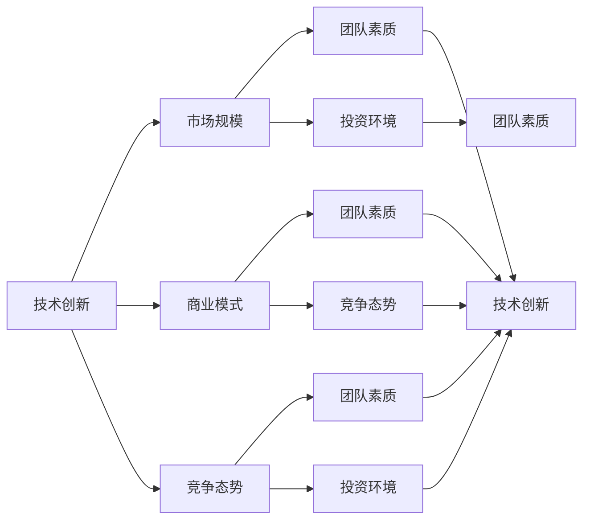

                 

# 程序员如何评估早期创业机会

> 关键词：
    早期创业, 评估, 创业机会, 技术, 商业模型, 市场, 竞争, 团队, 领导力

## 1. 背景介绍

### 1.1 问题由来
在创业的海洋中，如何捕捉到合适的机会，让项目落地并取得成功，一直是创业者面临的重大挑战。在诸多因素中，技术创新和市场潜力无疑是其中最关键的两大支柱。然而，技术是否先进，市场是否巨大，往往不是通过简单的技术研究就能得出结论的。作为一个技术开发者，如何从全局的角度，综合考量技术、市场、商业、团队等多个维度，来评估早期创业机会，是所有创业者都必须面对的重要课题。

### 1.2 问题核心关键点
早期创业机会的评估涉及多个层面的考量，主要包括：

1. **技术可行性**：技术方案是否具有创新性、技术壁垒，是否能够解决真实世界中的问题，具有市场前景。
2. **市场潜力**：市场规模、用户需求、市场增长趋势，以及竞争情况。
3. **商业模式**：商业模式是否可行、盈利模式是否清晰、目标用户和收入来源。
4. **团队结构**：团队成员的专业技能、团队协作、领导力和企业文化。
5. **资源与资本**：团队所需的资源，如设备、人才、办公空间，以及可能需要的投资。
6. **时间与成本**：项目开发周期、成本预算、资金流转情况等。

将这些因素综合考量，才能做出明智的判断，为项目的成功奠定坚实基础。

## 2. 核心概念与联系

### 2.1 核心概念概述

在评估早期创业机会时，需重点关注以下几个核心概念：

- **技术创新**：解决特定问题的先进技术方案，具有独特的算法或架构设计。
- **市场规模**：目标市场的大小、增长潜力，以及用户需求。
- **商业模式**：产品或服务如何产生收入，包括定价策略、销售渠道、客户关系等。
- **竞争态势**：市场上已有的竞争者，以及自身的竞争优势。
- **团队素质**：团队成员的能力、经验、合作默契和文化。
- **投资环境**：资本市场、风险投资、产业生态等。

这些概念之间的关系可以通过以下Mermaid流程图进行展示：



## 3. 核心算法原理 & 具体操作步骤
### 3.1 算法原理概述

在评估早期创业机会时，可以采用多个评估指标进行量化计算，形成一个综合的评分模型。这些指标可以包括技术可行性、市场潜力、商业模式、团队素质和投资环境等方面。综合评分的计算公式如下：

$$
S = W_1T + W_2M + W_3C + W_4TQ + W_5IE
$$

其中，$S$ 表示综合评分，$W_i$ 表示第 $i$ 个指标的权重，$T$、$M$、$C$、$TQ$ 和 $IE$ 分别表示技术创新、市场规模、商业模式、团队素质和投资环境的评分值。权重$W_i$应根据项目特性进行调整。

### 3.2 算法步骤详解

具体评估步骤如下：

1. **技术评估**：通过技术专家进行技术方案的可行性分析，评估技术创新的难度、技术壁垒、市场应用前景等。
2. **市场评估**：收集市场数据，分析目标市场的规模、增长趋势、用户需求、竞争格局等。
3. **商业模式评估**：构建商业模式画布，评估产品或服务的盈利模式、销售渠道、成本结构、定价策略等。
4. **团队评估**：考察团队背景、专业技能、合作默契、领导力等，进行团队能力评分。
5. **投资环境评估**：了解当前资本市场环境、风险投资情况、产业生态、政策支持等，进行投资环境评分。

通过上述步骤，得到每个指标的评分值，然后根据重要性分配权重，计算综合评分$S$。

### 3.3 算法优缺点

评估模型的优点：
1. **量化评估**：通过评分模型，可以对各个因素进行量化评估，直观展示项目的优势和劣势。
2. **综合考量**：考虑到多个维度，避免单一因素的误导。
3. **灵活调整**：权重可以根据项目特性进行调整，灵活应对不同场景。

评估模型的缺点：
1. **主观性**：指标评分和权重分配具有一定主观性，评估结果可能受评估者经验影响。
2. **复杂度**：评分模型较为复杂，需要大量数据和计算，评估成本较高。
3. **动态变化**：市场和技术环境快速变化，评估模型需要持续更新。

## 4. 数学模型和公式 & 详细讲解
### 4.1 数学模型构建

设评估模型中有 $n$ 个指标，分别为 $T$（技术创新）、$M$（市场规模）、$C$（商业模式）、$TQ$（团队素质）和 $IE$（投资环境），每个指标的评分值为 $T_i, M_i, C_i, TQ_i, IE_i$，对应权重为 $W_i$。则综合评分模型为：

$$
S = W_1T + W_2M + W_3C + W_4TQ + W_5IE
$$

每个指标的评分可以基于专家意见、市场调研、数据挖掘等多种方式获得，并通过归一化处理，使评分值在 $[0, 1]$ 范围内。

### 4.2 公式推导过程

公式推导过程如下：

- 技术评分 $T$：通过专家打分、技术评估软件等方法得到技术创新的评分值。
- 市场评分 $M$：分析市场数据，评估市场规模、增长趋势、用户需求等，获得市场评分值。
- 商业评分 $C$：构建商业模式画布，评估盈利模式、销售渠道、成本结构等，获得商业评分值。
- 团队评分 $TQ$：考察团队背景、技能、合作、领导力等，获得团队评分值。
- 投资环境评分 $IE$：了解资本市场、风险投资、产业生态等，获得投资环境评分值。

最后，将这些评分值代入综合评分公式，得到项目的综合评分 $S$。

### 4.3 案例分析与讲解

以一个移动应用开发项目为例，具体评估过程如下：

- 技术评分 $T$：通过专家意见，综合评估技术的创新性、可行性，打分值为 $0.9$。
- 市场评分 $M$：调研目标市场规模和增长趋势，预测用户需求，打分值为 $0.8$。
- 商业评分 $C$：通过商业模式画布，分析盈利模式、成本结构，打分值为 $0.7$。
- 团队评分 $TQ$：考察团队成员的专业技能、合作默契、领导力，打分值为 $0.9$。
- 投资环境评分 $IE$：评估资本市场环境、风险投资情况，打分值为 $0.8$。

设权重分别为 $W_1=0.2, W_2=0.3, W_3=0.15, W_4=0.15, W_5=0.15$，则综合评分 $S$ 为：

$$
S = 0.2 \times 0.9 + 0.3 \times 0.8 + 0.15 \times 0.7 + 0.15 \times 0.9 + 0.15 \times 0.8 = 0.8775
$$

综合评分 $S=0.8775$，表明该项目具有较高的技术创新、市场潜力和团队素质，但商业模式和投资环境还有提升空间。

## 5. 项目实践：代码实例和详细解释说明
### 5.1 开发环境搭建

项目开发环境搭建涉及开发语言、框架、工具等，以下提供一个基本的Python环境搭建流程：

1. **安装Python**：从官网下载并安装Python，确保版本为3.8及以上。
2. **安装必要的开发工具**：如 VSCode、Jupyter Notebook 等。
3. **配置虚拟环境**：
```bash
conda create -n pyenv python=3.8
conda activate pyenv
```
4. **安装第三方库**：
```bash
pip install numpy pandas sklearn matplotlib scikit-learn plotly
```

### 5.2 源代码详细实现

以下是一个简单的评分模型评估代码实现：

```python
import pandas as pd
import numpy as np
from sklearn.preprocessing import MinMaxScaler

# 创建评分数据表
data = pd.DataFrame({
    'T': [0.9, 0.8, 0.7, 0.9, 0.8],
    'M': [0.9, 0.7, 0.6, 0.8, 0.7],
    'C': [0.8, 0.7, 0.6, 0.8, 0.7],
    'TQ': [0.9, 0.9, 0.8, 0.9, 0.9],
    'IE': [0.8, 0.8, 0.7, 0.7, 0.8]
})

# 归一化处理
scaler = MinMaxScaler()
data = scaler.fit_transform(data)

# 权重分配
weights = [0.2, 0.3, 0.15, 0.15, 0.15]

# 计算综合评分
scores = np.dot(data, weights)
S = np.sum(scores)

print(f"综合评分：{S:.4f}")
```

### 5.3 代码解读与分析

以上代码实现了综合评分模型的计算过程，关键步骤如下：

1. **数据创建与归一化**：创建评分数据表，并使用MinMaxScaler进行归一化处理，使评分值在 $[0, 1]$ 范围内。
2. **权重分配**：根据项目特性，分配各指标的权重。
3. **综合评分计算**：通过矩阵乘法计算加权评分，然后求和得到综合评分 $S$。
4. **结果输出**：输出综合评分结果。

## 6. 实际应用场景

### 6.1 创业机会评估

使用评分模型可以对创业项目的各个关键指标进行量化评估，帮助创业者全面考量项目的潜力和风险。例如，一个科技创新初创公司，可以通过评分模型，评估技术、市场、商业、团队、投资环境等各个方面的评分，得出综合评分，指导后续的决策。

### 6.2 投资决策支持

风险投资机构也可以利用评分模型，对多个创业项目进行评估和对比，选择最有潜力的项目进行投资。通过量化评估，风险投资机构可以更科学地做出投资决策。

### 6.3 创业团队培训

评分模型还可以作为创业团队自我评估和改进的工具。团队成员可以通过评分模型，了解自己在项目中扮演的角色，明确自身优势和不足，进行针对性的提升。

### 6.4 未来应用展望

未来，评分模型有望在更多领域得到应用，如项目管理、产品研发、人才招聘等。其量化的评估方式，可以帮助团队更科学地规划项目、提高研发效率、优化人才结构。

## 7. 工具和资源推荐
### 7.1 学习资源推荐

1. **《创业者的数据科学》（The Data Scientist’s Guide to a Better Startup）**：本书介绍了数据科学在创业中的应用，帮助创业者利用数据评估项目，做出明智决策。
2. **Coursera《数据驱动的创新》（Data-Driven Innovation）**：由宾夕法尼亚大学开设的课程，讲解数据科学在创新和创业中的应用。
3. **Kaggle创业数据集**：Kaggle平台上有大量创业相关数据集，可以进行数据挖掘和机器学习实践。

### 7.2 开发工具推荐

1. **PyCharm**：专业的Python开发工具，支持多种框架和语言，是Python开发的首选。
2. **Git**：版本控制工具，帮助团队协作开发和代码管理。
3. **Docker**：容器化部署工具，便于在不同环境中部署项目。

### 7.3 相关论文推荐

1. **《创业机会评估模型》（Model for Assessing Entrepreneurial Opportunities）**：介绍了创业机会评估模型的构建和应用，结合实证研究进行讨论。
2. **《创业项目的量化评估》（Quantitative Evaluation of Startup Projects）**：分析了创业项目评估的关键因素，并提出量化评估的方法。
3. **《创业投资的多角度分析》（Multi-Perspective Analysis of Venture Capital）**：探讨了风险投资的多角度分析方法，包括技术、市场、商业、团队等方面的综合评估。

## 8. 总结：未来发展趋势与挑战
### 8.1 总结

本文对早期创业机会评估方法进行了系统介绍，介绍了评分模型的构建和应用。通过综合考虑技术、市场、商业、团队和投资环境等多个维度，量化评估创业项目的潜力，为项目的成功奠定了基础。

### 8.2 未来发展趋势

未来，评分模型将随着数据科学和人工智能的发展，不断优化和提升。具体趋势包括：

1. **大数据和AI的结合**：更多高质量的数据和先进的AI算法将提高评分模型的精度。
2. **实时评估**：通过实时数据更新，评分模型将能更好地反映市场和技术的动态变化。
3. **多指标融合**：结合更多关键指标，进行综合评估，提高评估的全面性。
4. **用户交互**：引入用户反馈，动态调整评分模型，使其更贴近实际需求。

### 8.3 面临的挑战

尽管评分模型在评估早期创业机会中起到了重要作用，但仍面临以下挑战：

1. **数据获取困难**：高质量的数据获取和处理难度较大，需要多方协同。
2. **权重分配主观**：各指标权重分配具有一定主观性，难以科学确定。
3. **动态变化**：市场和技术环境快速变化，评分模型需要及时更新。
4. **多维评估复杂**：综合评估多个维度，计算复杂度较高。

### 8.4 研究展望

未来，研究重点在于如何进一步优化评分模型，使其更加客观、科学和灵活。具体方向包括：

1. **自动化评估**：引入自动化评估工具，减少人工干预，提高评估效率。
2. **多源数据融合**：结合多渠道数据，提高评估的准确性。
3. **实时调整**：引入实时数据流，动态调整评分模型，适应快速变化的市场环境。
4. **模型透明性**：提高模型的可解释性，使其决策过程透明、可解释。

通过不断优化和改进，评分模型将为早期创业机会评估提供更科学、更高效的工具，帮助创业者做出更明智的决策，加速项目的成功落地。

## 9. 附录：常见问题与解答

**Q1: 评分模型中各指标如何确定权重？**

A: 权重分配应基于项目特性和评估需求进行，可以通过专家讨论、数据调研等方法确定。例如，对于技术驱动的创业项目，技术创新应分配较高的权重；而对于市场驱动的创业项目，市场规模应赋予更高的权重。

**Q2: 评分模型能否适用于所有类型的创业项目？**

A: 评分模型适用于大部分创业项目，但需根据项目特点进行适当调整。例如，对于金融、医疗等高度监管的行业，应增加合规性指标，评估模型的合法性和可行性。

**Q3: 评分模型评估结果是否可信？**

A: 评分模型的评估结果受到权重分配、数据质量等多种因素影响，需要综合考虑评估结果。此外，应结合专家意见和市场调研，全面评估项目潜力。

**Q4: 评分模型如何处理多维数据？**

A: 多维数据处理可以通过向量表示和矩阵运算来实现。例如，使用numpy库中的矩阵运算函数，将各指标的评分数据转换为向量，然后进行加权求和，得到综合评分。

**Q5: 评分模型如何处理缺失数据？**

A: 缺失数据可以通过插值、均值填充等方法进行补全。例如，使用均值填补法，将缺失的数据用平均值替代，然后重新计算评分。

---

作者：禅与计算机程序设计艺术 / Zen and the Art of Computer Programming

