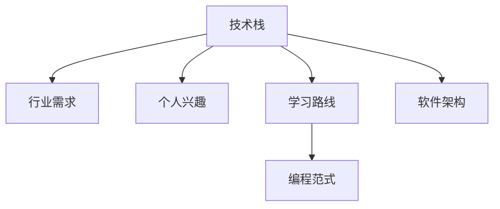

                 

# 程序员如何进行职业规划

> 关键词：职业规划, 技术成长, 个人发展, 学习路线, 编程范式

## 1. 背景介绍

### 1.1 问题由来
随着科技的迅猛发展和互联网的广泛应用，程序员这一职业的需求越来越大，但与此同时，技术更新换代的速度也越来越快。如何在众多技术流派中做出选择，如何在职业生涯中不断提升自我，成为一个值得深思的问题。本文旨在为程序员提供一份职业规划指南，帮助他们在技术海洋中乘风破浪，实现个人价值和职业成长。

### 1.2 问题核心关键点
技术世界的变化日新月异，程序员的职业规划需要考虑技术栈、行业需求、个人兴趣等多个维度。本文将从技术成长、个人发展、学习路线、编程范式等多个角度，深入探讨程序员职业规划的核心问题，帮助他们找到适合自己的发展道路。

### 1.3 问题研究意义
制定合理的职业规划，可以帮助程序员在快速变化的技术环境中保持竞争力，实现个人价值和社会价值的双重提升。同时，职业规划也能帮助程序员更好地理解行业趋势，抓住机遇，避免盲目跟风，浪费时间和精力。

## 2. 核心概念与联系

### 2.1 核心概念概述

为更好地理解程序员职业规划，本节将介绍几个密切相关的核心概念：

- **技术栈（Technology Stack）**：程序员所使用的编程语言、框架、库等技术的集合。技术栈的选择对开发效率和项目质量有直接影响。
- **行业需求（Industry Demand）**：不同行业对编程技能的需求不同。了解行业需求，有助于程序员选择有前景的技术方向。
- **个人兴趣（Personal Interest）**：兴趣是最好的老师。选择感兴趣的领域，可以持续激发学习的动力和热情。
- **学习路线（Learning Route）**：根据技术栈和行业需求，制定合理的学习路线，可以帮助程序员系统掌握相关知识。
- **编程范式（Programming Paradigm）**：不同的编程范式（如面向对象、函数式、事件驱动等）适合不同的场景和问题。选择合适的编程范式，可以提升代码质量和开发效率。
- **软件架构（Software Architecture）**：软件架构设计的好坏，直接影响系统性能和可维护性。熟悉不同软件架构模式，可以帮助程序员设计和构建高质量的软件系统。

这些核心概念之间的逻辑关系可以通过以下Mermaid流程图来展示：



这个流程图展示了这个核心概念的相互关系：

1. 技术栈和行业需求是选择学习路线的基础。
2. 个人兴趣与学习路线和编程范式紧密相关。
3. 学习路线、编程范式和软件架构共同构成了程序员的技术能力和职业发展框架。

## 3. 核心算法原理 & 具体操作步骤
### 3.1 算法原理概述

程序员的职业规划，本质上是一个不断学习、适应和提升的过程。其核心思想是：根据自身兴趣、行业需求、技术栈等多维度因素，制定科学的学习路线，选择合适的编程范式和软件架构，不断积累技术经验和项目经验，从而在职业生涯中不断成长和进步。

### 3.2 算法步骤详解

程序员职业规划的一般步骤包括：

**Step 1: 评估现状**
- 分析当前的技能水平，明确自身的强项和弱项。
- 识别个人兴趣和职业目标，确定未来的发展方向。

**Step 2: 研究行业**
- 调研目标行业的主要技术栈和工具，了解其特点和优势。
- 分析行业发展趋势和需求变化，选择有前景的技术方向。

**Step 3: 制定计划**
- 基于个人兴趣和行业需求，制定合理的学习路线。
- 选择合适的编程范式和软件架构，提升开发效率和代码质量。

**Step 4: 持续学习**
- 通过书籍、博客、课程等多种途径，系统学习相关知识。
- 参与开源项目和社区活动，积累实战经验。

**Step 5: 实践和反馈**
- 在实际项目中应用所学知识，解决具体问题。
- 不断反思和总结，优化学习路线和职业规划。

### 3.3 算法优缺点

程序员职业规划的优点包括：
1. 科学合理。根据个人兴趣、行业需求和技术栈等多维度因素，制定科学的学习路线，避免盲目跟风。
2. 系统全面。通过系统学习、实践和反馈，全面提升编程能力和技术水平。
3. 灵活可调整。职业规划是一个动态过程，需要根据实际情况不断调整和优化。

同时，该方法也存在一些局限性：
1. 时间和精力投入较大。职业规划需要耗费大量时间和精力进行研究和实践。
2. 对自律性要求高。需要程序员有较强的自律性和学习能力，才能持续推进职业规划。
3. 需考虑多种因素。职业规划需要综合考虑技术栈、行业需求、个人兴趣等多个因素，增加了复杂度。

尽管有这些局限性，但总体而言，程序员职业规划是一种科学、系统、全面的方法，有助于他们在技术海洋中乘风破浪，实现个人价值和职业成长。

### 3.4 算法应用领域

程序员职业规划方法，在软件开发、数据科学、人工智能等多个领域都有广泛应用，具体包括：

- 软件开发：根据项目需求和技术栈选择合适的发展方向，不断提升开发效率和代码质量。
- 数据科学：基于数据分析和机器学习技术，选择有前景的领域进行深入研究，提升数据处理和建模能力。
- 人工智能：选择AI领域中的热门技术方向，如深度学习、自然语言处理、计算机视觉等，持续学习和实践，成为AI领域的专家。

除了这些领域，职业规划还适用于其他技术密集型行业，如云计算、物联网、区块链等。

## 4. 数学模型和公式 & 详细讲解 & 举例说明（备注：数学公式请使用latex格式，latex嵌入文中独立段落使用 $$，段落内使用 $)
### 4.1 数学模型构建

本文中不涉及复杂的数学模型，但为了展示职业规划的科学性，我们可以通过简单的数学模型来描述职业成长的过程。假设程序员的技术水平随时间变化的规律可以用指数增长模型来描述：

$$
P(t) = P_0 * a^t
$$

其中 $P(t)$ 表示第 $t$ 个月的技术水平，$P_0$ 是初始技术水平，$a$ 是技术增长系数。

### 4.2 公式推导过程

在实际应用中，职业成长过程可以进一步细化为多个阶段，每个阶段的技术增长系数可能不同。例如，初学者阶段可能增长缓慢，但随着经验的积累，成长速度会逐渐加快。因此，我们可以引入分段函数来描述职业成长的不同阶段：

$$
P(t) = \begin{cases} 
P_0 * a_1^t & \text{if } t \in [0,12] \\
P_0 * a_2^t & \text{if } t \in (12,24] \\
P_0 * a_3^t & \text{if } t \in (24,36] \\
\end{cases}
$$

其中 $a_1, a_2, a_3$ 分别是不同阶段的技术增长系数。

### 4.3 案例分析与讲解

假设一个程序员在第一个月掌握了Python基础知识，经过1年的学习，他掌握的技术水平可以通过指数增长模型来计算。例如，假设第一个月的技术水平为100，增长系数 $a_1=1.1$，则12个月后的技术水平为：

$$
P(12) = 100 * 1.1^{12} \approx 178
$$

这表明，通过持续学习，技术水平在第一个阶段有显著提升。

## 5. 项目实践：代码实例和详细解释说明
### 5.1 开发环境搭建

在进行职业规划实践前，我们需要准备好开发环境。以下是使用Python进行PyTorch开发的环境配置流程：

1. 安装Anaconda：从官网下载并安装Anaconda，用于创建独立的Python环境。

2. 创建并激活虚拟环境：
```bash
conda create -n pytorch-env python=3.8 
conda activate pytorch-env
```

3. 安装PyTorch：根据CUDA版本，从官网获取对应的安装命令。例如：
```bash
conda install pytorch torchvision torchaudio cudatoolkit=11.1 -c pytorch -c conda-forge
```

4. 安装Transformers库：
```bash
pip install transformers
```

5. 安装各类工具包：
```bash
pip install numpy pandas scikit-learn matplotlib tqdm jupyter notebook ipython
```

完成上述步骤后，即可在`pytorch-env`环境中开始职业规划实践。

### 5.2 源代码详细实现

这里我们以Python编程为例，给出一份职业规划的Python代码实现。

```python
import numpy as np
import matplotlib.pyplot as plt

# 设定技术水平随时间变化的规律
a1 = 1.1
a2 = 1.2
a3 = 1.3
P0 = 100

# 计算不同时间段的技术水平
t = np.arange(0, 36, 1)
P1 = P0 * a1 ** t
P2 = P0 * a2 ** (t - 12)
P3 = P0 * a3 ** (t - 24)

# 绘制技术水平随时间变化的曲线
plt.plot(t, P1, label='阶段1')
plt.plot(t, P2, label='阶段2')
plt.plot(t, P3, label='阶段3')
plt.legend()
plt.xlabel('时间（月）')
plt.ylabel('技术水平')
plt.show()
```

这个代码实现了技术水平随时间变化的指数增长模型，并绘制了不同阶段的技术水平曲线。可以看到，技术水平在每个阶段都有显著提升，这与前面介绍的数学模型是一致的。

### 5.3 代码解读与分析

让我们再详细解读一下关键代码的实现细节：

**职业规划代码**：
- 使用NumPy库定义了技术水平随时间变化的规律，并通过指数增长模型计算每个阶段的技术水平。
- 使用Matplotlib库绘制技术水平随时间变化的曲线，直观展示职业成长过程。

通过这个简单的代码示例，我们可以看到，职业规划过程可以通过数学模型来描述和量化，从而更好地理解和规划个人职业发展。

当然，实际的职业规划需要考虑更多因素，如个人兴趣、行业需求、技术栈等，需要进行全面系统的分析和规划。

## 6. 实际应用场景
### 6.1 软件开发

软件开发是程序员职业规划的重要应用场景。例如，一个初入行的前端开发者，可以按照以下步骤进行职业规划：

1. 评估现状：分析自己掌握的前端技术栈，如HTML、CSS、JavaScript等，明确强项和弱项。
2. 研究行业：调研前端开发的需求，选择有前景的技术方向，如React、Vue等。
3. 制定计划：根据个人兴趣和学习能力，制定学习路线，逐步掌握Node.js、数据库等技术。
4. 持续学习：通过在线课程、书籍、项目实践等方式，持续提升自己的前端开发能力。
5. 实践和反馈：参与开源项目和社区活动，积累实战经验，不断反思和总结，优化职业规划。

通过科学合理的职业规划，前端开发者可以不断提升自己的技术水平和职业竞争力，实现从初级到高级的转变。

### 6.2 数据科学

数据科学是另一个应用广泛的领域。一个初入行的数据科学家可以按照以下步骤进行职业规划：

1. 评估现状：分析自己掌握的数据科学技术栈，如Python、R、SQL等，明确强项和弱项。
2. 研究行业：调研数据科学的需求，选择有前景的技术方向，如机器学习、深度学习等。
3. 制定计划：根据个人兴趣和学习能力，制定学习路线，逐步掌握数据处理、数据可视化等技术。
4. 持续学习：通过在线课程、书籍、项目实践等方式，持续提升自己的数据科学能力。
5. 实践和反馈：参与Kaggle竞赛、开源项目和社区活动，积累实战经验，不断反思和总结，优化职业规划。

通过科学合理的职业规划，数据科学家可以不断提升自己的技术水平和职业竞争力，实现从初级到高级的转变。

### 6.3 人工智能

人工智能是当前技术发展的前沿领域。一个初入行的人工智能工程师可以按照以下步骤进行职业规划：

1. 评估现状：分析自己掌握的AI技术栈，如TensorFlow、PyTorch等，明确强项和弱项。
2. 研究行业：调研AI领域的需求，选择有前景的技术方向，如自然语言处理、计算机视觉等。
3. 制定计划：根据个人兴趣和学习能力，制定学习路线，逐步掌握深度学习、强化学习等技术。
4. 持续学习：通过在线课程、书籍、项目实践等方式，持续提升自己的人工智能能力。
5. 实践和反馈：参与开源项目和社区活动，积累实战经验，不断反思和总结，优化职业规划。

通过科学合理的职业规划，人工智能工程师可以不断提升自己的技术水平和职业竞争力，实现从初级到高级的转变。

## 7. 工具和资源推荐
### 7.1 学习资源推荐

为了帮助程序员制定科学合理的职业规划，这里推荐一些优质的学习资源：

1. 《深入浅出Python》：一本详细介绍Python编程的书籍，适合初学者入门。
2. 《算法图解》：一本图解算法的书籍，适合理解算法和数据结构的基本概念。
3. 《Clean Code》：一本关于代码风格和最佳实践的书籍，适合提升编程质量。
4. Coursera和edX等在线教育平台：提供大量高质量的编程课程，适合系统学习。
5. GitHub和Kaggle等社区平台：提供丰富的开源项目和竞赛，适合实践和提升实战经验。

通过对这些资源的学习实践，相信你一定能够制定出科学合理的职业规划，并在技术海洋中乘风破浪。

### 7.2 开发工具推荐

高效的开发离不开优秀的工具支持。以下是几款用于编程和职业规划的常用工具：

1. PyTorch：基于Python的开源深度学习框架，灵活动态的计算图，适合快速迭代研究。
2. TensorFlow：由Google主导开发的开源深度学习框架，生产部署方便，适合大规模工程应用。
3. Visual Studio Code：一款轻量级且功能强大的代码编辑器，支持多种编程语言和插件。
4. IntelliJ IDEA：一款功能强大的Java集成开发环境，适合大型项目的开发和调试。
5. Git和GitHub：版本控制工具和代码托管平台，适合团队协作和代码管理。

合理利用这些工具，可以显著提升编程开发和职业规划的效率，加快创新迭代的步伐。

### 7.3 相关论文推荐

编程和职业规划的研究离不开相关论文的支撑。以下是几篇奠基性的相关论文，推荐阅读：

1. "The Unreasonable Effectiveness of Recurrent Neural Networks"：探讨循环神经网络在序列建模中的优势。
2. "Machine Learning Yearning"：Andrew Ng撰写的机器学习入门书籍，详细介绍了机器学习的实践技巧。
3. "Scalable Deep Learning"：斯坦福大学机器学习课程讲义，介绍了深度学习的分布式训练技巧。
4. "Practical Deep Learning for Coders"：Fast.ai课程讲义，介绍了深度学习在计算机视觉、自然语言处理等领域的实践应用。
5. "Deep Learning Specialization"：Coursera上的深度学习课程系列，由Andrew Ng讲授，涵盖了深度学习的基本概念和实践应用。

这些论文代表了大数据和人工智能领域的经典思想和技术，对编程和职业规划有着重要的参考价值。

## 8. 总结：未来发展趋势与挑战

### 8.1 总结

本文对程序员职业规划的方法进行了全面系统的介绍。首先阐述了职业规划在程序员职业生涯中的重要意义，明确了技术栈、行业需求、个人兴趣等多个维度对职业规划的影响。其次，从算法原理到具体操作步骤，详细讲解了职业规划的核心步骤和方法，给出了职业规划的Python代码实现。同时，本文还探讨了职业规划在软件开发、数据科学、人工智能等多个领域的应用，展示了职业规划的广阔前景。最后，本文精选了职业规划的学习资源、开发工具和相关论文，力求为读者提供全方位的职业规划指引。

通过本文的系统梳理，可以看到，科学合理的职业规划对于程序员的持续成长和职业发展具有重要意义。合理规划技术栈、行业需求、个人兴趣等多个维度，制定科学的学习路线，选择适合的编程范式和软件架构，不断积累技术经验和项目经验，才能在技术海洋中乘风破浪，实现个人价值和职业成长。

### 8.2 未来发展趋势

展望未来，程序员职业规划将呈现以下几个发展趋势：

1. 技术栈日趋多样化。未来的技术栈将更加多样化，包含多种编程语言、框架和库。程序员需要具备更广泛的技术能力，以应对多变的需求。

2. 终身学习成为常态。随着技术更新换代的速度加快，终身学习将成为程序员的常态。不断学习新技术、新方法，才能保持竞争力。

3. 跨领域技能融合。未来的程序员将需要具备跨领域技能，如编程、数据分析、人工智能等。跨领域技能融合将成为程序员职业发展的关键。

4. 自动化和工具化。未来的开发环境将更加自动化和工具化，工具和框架将进一步提升开发效率和代码质量。

5. 团队协作更加紧密。未来的软件开发将更加注重团队协作，通过高效的沟通和协作，提升开发效率和项目质量。

以上趋势凸显了程序员职业规划的重要性和未来发展方向。这些方向的探索发展，将进一步推动程序员在技术海洋中乘风破浪，实现个人价值和社会价值的双重提升。

### 8.3 面临的挑战

尽管程序员职业规划方法已经取得了显著成效，但在迈向更加智能化、普适化应用的过程中，它仍面临诸多挑战：

1. 技术更新速度快。新技术不断涌现，需要程序员具备较强的学习能力，才能跟上技术发展的步伐。

2. 职业路径多样。程序员需要根据自己的兴趣和目标，选择合适的职业路径，这增加了职业规划的复杂性。

3. 需要具备跨领域技能。程序员需要具备跨领域技能，这对其学习能力、知识广度和深度都提出了更高的要求。

4. 需要不断调整规划。职业规划需要根据实际情况不断调整和优化，这需要程序员具备较强的自我反思和调整能力。

5. 需要具备创新能力。未来的技术环境复杂多变，程序员需要具备较强的创新能力，才能在新技术和新领域中取得突破。

这些挑战需要程序员不断提升自我，保持学习和创新的动力，才能在职业生涯中不断成长和进步。

### 8.4 未来突破

面对程序员职业规划所面临的种种挑战，未来的研究需要在以下几个方面寻求新的突破：

1. 提供更多职业规划工具和资源。通过开发更多职业规划工具和资源，帮助程序员制定科学合理的职业规划。

2. 推动终身学习和职业发展平台。建立终身学习和职业发展平台，为程序员提供更多的学习机会和职业发展支持。

3. 加强跨领域技能培训。提供跨领域技能培训课程，帮助程序员提升综合素质和职业竞争力。

4. 引入新技术和新方法。引入新技术和新方法，帮助程序员掌握最新技术，提升开发效率和代码质量。

5. 推动团队协作和项目管理。通过推动团队协作和项目管理，提升团队效率和项目质量。

这些研究方向的探索，将引领程序员职业规划技术迈向更高的台阶，为程序员的持续成长和职业发展提供更多支持和帮助。面向未来，程序员职业规划技术还需要与其他人工智能技术进行更深入的融合，如知识表示、因果推理、强化学习等，多路径协同发力，共同推动程序员职业发展的进步。只有勇于创新、敢于突破，才能不断拓展程序员职业规划的边界，让程序员在技术海洋中乘风破浪，实现个人价值和职业成长。

## 9. 附录：常见问题与解答

**Q1：如何评估自身技能水平？**

A: 可以通过自我评估、同行评价、项目经验等方式，全面了解自己的技术水平。自我评估可以从基础知识、编程能力、项目经验等方面进行，同行评价可以从代码质量、沟通能力、团队协作等方面进行，项目经验可以从项目难度、代码复杂度、问题解决等方面进行。

**Q2：如何选择有前景的技术方向？**

A: 可以通过市场调研、技术趋势、行业需求等方式，选择有前景的技术方向。市场调研可以了解当前技术的热门程度和未来发展趋势，技术趋势可以关注学术界和工业界的新研究成果，行业需求可以了解目标行业的主要技术栈和工具。

**Q3：如何制定合理的学习路线？**

A: 可以根据自身兴趣、行业需求和技术栈，制定合理的学习路线。学习路线可以包括基础知识、基础技能、高级技能、实战经验等多个阶段，每个阶段需要明确学习目标和时间安排。

**Q4：如何选择适合的编程范式和软件架构？**

A: 可以根据项目需求和自身技术水平，选择适合的编程范式和软件架构。例如，面向对象编程适合大型、复杂的软件系统，函数式编程适合数据处理和并发场景，事件驱动编程适合实时系统和高并发场景。软件架构可以包括单体架构、微服务架构、分布式架构等，需要根据项目规模和复杂度进行选择。

这些问题的解答，可以帮助程序员更好地制定科学合理的职业规划，实现个人价值和职业成长。

---

作者：禅与计算机程序设计艺术 / Zen and the Art of Computer Programming

