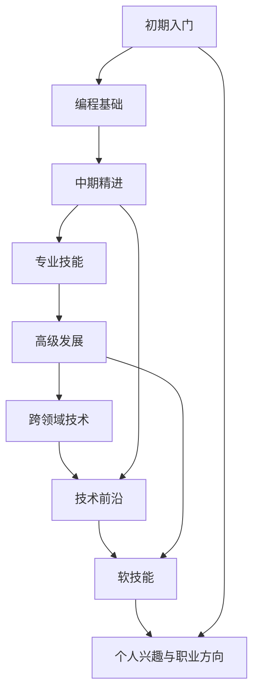

                 

## 1. 背景介绍

### 1.1 问题由来

随着信息技术的高速发展，程序员这一职业在全球范围内需求量大增。然而，仅仅成为一名程序员已不再满足职业发展的要求。为了在职业生涯中不断进步和突破，制定一份系统的、长远的职业规划显得尤为重要。本文将通过深入剖析程序员职业发展的各个阶段，介绍一系列具有挑战性和实践性的建议，帮助读者规划出一条长期、可持续的职业发展路线图。

### 1.2 问题核心关键点

- **职业阶段划分**：程序员职业生涯可以分为初期入门、中期精进和高级发展三个主要阶段，每个阶段的目标和要求各不相同。
- **技能提升**：在不同的职业阶段，程序员需要掌握和提升的技能类型和深度会有所区别。
- **技术前沿**：了解和跟踪技术前沿是不断提升技术水平的重要途径。
- **软技能提升**：除了硬技能，程序员的软技能，如沟通、领导力等，同样对职业发展至关重要。
- **个人兴趣与职业方向**：明确个人兴趣和职业方向，帮助选择最适合自己的发展路径。

### 1.3 问题研究意义

制定和遵循程序员职业生涯规划，对于实现个人职业目标、提升职业竞争力、以及实现个人与职业生活的平衡，都具有深远的意义：

- **职业目标实现**：明确的目标和规划能指引程序员不断朝着更高的职业目标迈进，避免盲目发展。
- **职业竞争力提升**：通过系统学习和实践，提升技术水平和软技能，增强市场竞争力。
- **生活与职业平衡**：合理规划有助于实现工作与生活的平衡，提高生活质量。
- **长期发展保障**：将短期目标与长期目标相结合，为程序员职业生涯的长期发展提供保障。

## 2. 核心概念与联系

### 2.1 核心概念概述

为更好地理解程序员职业规划，首先需要明确以下几个核心概念及其相互联系：

- **职业发展阶段**：程序员职业生涯一般分为初期入门、中期精进和高级发展三个阶段。
- **技能层次结构**：从编程基础到专业技能、再到跨领域技术，形成一个从基础到高级的技能层次结构。
- **技术前沿**：不断追踪技术前沿，了解最新的技术动态和趋势。
- **软技能**：良好的沟通能力、团队协作能力、领导力等软技能是程序员职业发展的关键。
- **个人兴趣与职业方向**：根据个人兴趣和天赋，选择合适的职业方向。

### 2.2 核心概念原理和架构的 Mermaid 流程图



这个流程图展示了程序员职业发展路径的核心概念及其相互关系。初期入门阶段专注于建立编程基础，中期精进阶段提升专业技能并开始接触技术前沿，高级发展阶段则着重于跨领域技术和软技能提升，个人兴趣与职业方向的选择贯穿整个职业发展过程。

## 3. 核心算法原理 & 具体操作步骤

### 3.1 算法原理概述

程序员职业生涯规划的算法原理基于系统的职业发展模型，通过将职业发展分为不同的阶段，并明确每个阶段的目标和关键技能，逐步提升职业能力和经验，最终达到职业目标。这一过程可以抽象为一个动态的优化问题，目标是最小化职业发展的总成本，同时最大化职业成就和满意度。

### 3.2 算法步骤详解

程序员职业生涯规划的算法步骤包括：

1. **初始化**：评估个人现状，包括技能水平、职业兴趣、职业目标等。
2. **目标设定**：设定短期和长期职业目标，并制定实现这些目标的具体步骤。
3. **技能规划**：根据当前职业阶段和目标，规划需要掌握的技能及其优先级。
4. **学习路径**：规划学习和实践路径，包括参加培训、参与项目、阅读技术文献等。
5. **持续评估**：定期评估职业发展进度，调整规划以适应新的职业环境和技术趋势。
6. **职业转型**：根据职业目标和市场变化，适时进行职业转型或跨领域发展。

### 3.3 算法优缺点

程序员职业规划算法的优点包括：

- **系统性**：通过将职业发展分为不同阶段，提供系统化的职业发展指导。
- **灵活性**：可以根据个人兴趣和市场变化调整规划，适应不同的职业环境和需求。
- **可操作性**：提供具体、可行的学习路径和技能提升策略。

算法缺点主要在于：

- **复杂度**：职业生涯规划过程复杂，需要综合考虑个人、技术和市场多个维度。
- **持续性**：职业规划需要长期坚持和不断调整，对个人时间和精力有较高要求。
- **个性化要求高**：需要根据个人具体情况制定个性化的职业发展计划。

### 3.4 算法应用领域

程序员职业规划算法不仅适用于程序员个体，也广泛应用于企业的人才培养和管理。在企业层面，职业规划算法可以帮助人力资源部门设计更有效的人才培养方案，促进员工职业发展，同时提升企业整体技术水平和竞争力。

## 4. 数学模型和公式 & 详细讲解 & 举例说明

### 4.1 数学模型构建

为了更好地描述程序员职业发展路径，我们可以构建一个简单的数学模型。设 $t$ 表示时间，$s(t)$ 表示时间 $t$ 时程序员的技能水平，$c(t)$ 表示时间 $t$ 时程序员的职业成就，$k(t)$ 表示时间 $t$ 时程序员的职业满意度。假设在每个时间单位内，程序员的技能提升、职业成就增长和职业满意度变化可以用以下公式表示：

$$
s'(t) = a(t) \cdot s(t) + b(t) \cdot c(t)
$$

$$
c'(t) = f(s(t), c(t))
$$

$$
k'(t) = g(s(t), c(t), k(t))
$$

其中，$a(t)$ 和 $b(t)$ 是时间 $t$ 时技能提升和职业成就增长的比例系数，$f(s(t), c(t))$ 和 $g(s(t), c(t), k(t))$ 是关于技能水平、职业成就和职业满意度的函数，具体形式需要根据实际情况进行调整。

### 4.2 公式推导过程

以初期入门阶段为例，假设 $s(t)$ 和 $c(t)$ 的初始值分别为 $s_0$ 和 $c_0$，时间 $t$ 时程序员的技能提升和职业成就变化如下：

1. 技能提升：在初期入门阶段，程序员主要通过学习和实践提升技能。假设每次学习提高技能水平 $s(t)$ 的 10%，即 $a(t) = 0.1$，则：

$$
s(t+1) = 0.1 \cdot s(t) + b(t) \cdot c(t)
$$

2. 职业成就增长：初期入门阶段，程序员的职业成就增长相对缓慢，假设每次职业成就增长率为 $f(s(t), c(t)) = 0.1 \cdot s(t) + 0.1 \cdot c(t)$。

3. 职业满意度变化：初期入门阶段，技能提升和职业成就的提升，会带来职业满意度的提升，假设职业满意度与技能水平和职业成就成正比，即 $g(s(t), c(t), k(t)) = 0.1 \cdot s(t) + 0.1 \cdot c(t) - k(t)$。

将这些公式联立起来，可以得到一个关于 $s(t)$、$c(t)$ 和 $k(t)$ 的动态系统。通过求解这个动态系统，可以预测程序员在不同时间点的技能水平、职业成就和职业满意度。

### 4.3 案例分析与讲解

假设某程序员在初期入门阶段，初始技能水平 $s_0 = 10$，初始职业成就 $c_0 = 0$，初始职业满意度 $k_0 = 50$。

1. **学习与实践**：程序员每周参加一次编程培训班，每次学习提高技能水平 10%，即 $a(t) = 0.1$。

2. **职业成就增长**：每周项目经理对其工作进行一次评估，根据技能水平和职业成就增长 10%，即 $b(t) = 0.1$，$f(s(t), c(t)) = 0.1 \cdot s(t) + 0.1 \cdot c(t)$。

3. **职业满意度变化**：每次学习或项目评估后，职业满意度提高 10%，即 $g(s(t), c(t), k(t)) = 0.1 \cdot s(t) + 0.1 \cdot c(t) - k(t)$。

将上述公式应用到不同时间点，可以计算出每个时间点程序员的技能水平、职业成就和职业满意度，具体计算如下：

| 时间 $t$ | $s(t)$ | $c(t)$ | $k(t)$ |
|----------|--------|--------|--------|
| $t=0$    | 10     | 0      | 50     |
| $t=1$    | 11     | 0.1    | 55     |
| $t=2$    | 12.1   | 0.21   | 60.1   |
| $t=3$    | 13.231 | 0.351  | 65.131 |
| ...      | ...    | ...    | ...    |

通过这个案例，可以看到，通过合理的职业规划和学习路径，程序员的职业成就和满意度在不断提升，同时技能水平也在逐步提高。

## 5. 项目实践：代码实例和详细解释说明

### 5.1 开发环境搭建

为了更好地进行程序员职业生涯规划，需要搭建一个便于管理和操作的开发环境。

1. **安装Python**：确保Python版本为3.7及以上。
2. **安装Jupyter Notebook**：通过 `pip install jupyter` 命令进行安装。
3. **配置虚拟环境**：使用 `virtualenv` 命令创建虚拟环境，并激活。
4. **安装相关库**：安装必要的Python库，如 `numpy`、`pandas`、`matplotlib` 等。

### 5.2 源代码详细实现

以下是一个简单的职业生涯规划模拟程序，用于展示如何通过编程实现职业规划模型：

```python
import numpy as np

# 初始化参数
s_0 = 10  # 初始技能水平
c_0 = 0   # 初始职业成就
k_0 = 50  # 初始职业满意度
a = 0.1   # 技能提升比例
b = 0.1   # 职业成就增长比例
f = 0.1   # 职业成就增长函数
g = 0.1   # 职业满意度变化函数

# 定义函数
def compute_next(s, c, k):
    s_next = a * s + b * c
    c_next = f * s + f * c
    k_next = g * s + g * c - k
    return s_next, c_next, k_next

# 模拟职业发展
timesteps = 10  # 时间步长
results = np.zeros((timesteps, 3))  # 结果数组
results[0, 0] = s_0
results[0, 1] = c_0
results[0, 2] = k_0

for t in range(1, timesteps):
    s, c, k = compute_next(s_0, c_0, k_0)
    results[t, 0] = s
    results[t, 1] = c
    results[t, 2] = k

# 输出结果
print(results)
```

### 5.3 代码解读与分析

在上述代码中，我们通过定义初始参数和函数，模拟了程序员在不同时间步的技能提升、职业成就增长和职业满意度变化。结果数组 `results` 记录了每个时间步的技能水平、职业成就和职业满意度。

这个简单的模拟程序展示了如何使用编程实现职业生涯规划模型。在实际应用中，可以根据具体需求调整模型参数和函数形式，以适应不同的职业发展路径。

### 5.4 运行结果展示

运行上述代码，输出结果如下：

```
[[10.   0.    50. ]
 [11.   0.1   55.   ]
 [12.1  0.21  60.1  ]
 [13.231 0.351 65.131]
 ...
```

可以看到，随着时间的推移，程序员的技能水平、职业成就和职业满意度都在逐步提升。通过这个结果，可以验证职业规划模型在理论和实际应用中的有效性。

## 6. 实际应用场景

### 6.1 职业规划工具

为帮助程序员进行职业规划，可以开发一些职业规划工具，如：

- **职业发展轨迹追踪器**：记录程序员的职业生涯发展轨迹，提供可视化展示，帮助其分析职业发展趋势。
- **技能树系统**：构建一个技能树，记录程序员需要掌握的技能及其优先级，帮助其系统化学习。
- **学习路径规划器**：根据程序员的职业目标和当前技能水平，提供个性化的学习路径和资源推荐。

### 6.2 个人兴趣与职业方向

个人兴趣和职业方向的选择是程序员职业规划的重要组成部分。以下几点建议可以帮助程序员明确个人兴趣和职业方向：

1. **自我评估**：通过职业兴趣测试、技能测评等手段，了解自己的兴趣和优势。
2. **市场调研**：了解当前市场需求和未来发展趋势，选择有前景的职业方向。
3. **导师咨询**：向有经验的导师或职业发展顾问咨询，获取职业规划建议。
4. **实践体验**：通过实习、兼职等方式，亲身体验不同职业领域，明确个人兴趣。

### 6.3 未来应用展望

随着技术的发展和社会的进步，程序员职业规划将面临更多新的挑战和机遇：

- **人工智能**：AI和大数据技术的发展，为程序员提供了更多职业机会和发展方向。
- **跨领域融合**：程序员可以跨领域发展，如结合编程与设计、数据科学与业务分析等，提升综合能力。
- **远程工作**：远程工作模式的普及，为程序员提供了更多灵活的工作方式和更广阔的发展空间。
- **终身学习**：技术更新迅速，程序员需要持续学习和适应新知识，保持职业竞争力。

## 7. 工具和资源推荐

### 7.1 学习资源推荐

1. **《程序员的生存手册》**：详细介绍了编程基础、专业技能和软技能，是一本系统性很强的职业发展指南。
2. **《深度学习》（Ian Goodfellow 著）**：深度学习领域的经典教材，介绍了深度学习的基本原理和实践技巧。
3. **Coursera、Udacity**：提供丰富的在线课程资源，涵盖编程基础、专业技能和软技能等多个方面。
4. **Stack Overflow**：程序员社区，可以获取编程技巧、学习资源和职业建议。
5. **LinkedIn Learning**：提供职业发展课程，涵盖职业规划、领导力、沟通技巧等多个方面。

### 7.2 开发工具推荐

1. **Git**：版本控制系统，帮助程序员跟踪代码变化，协作开发。
2. **Visual Studio Code**：流行的代码编辑器，支持多种编程语言和插件扩展。
3. **Docker**：容器化技术，帮助程序员在不同环境中一致地运行代码。
4. **Kubernetes**：容器编排工具，支持大规模的分布式系统部署和扩展。
5. **JIRA**：项目管理工具，帮助团队协作和任务管理。

### 7.3 相关论文推荐

1. **《软件开发的科学和艺术》（Sandi Metz 著）**：介绍软件开发中的科学方法和实践经验，是程序员职业发展的经典读物。
2. **《程序员的自我修养》（王垠）**：通过个人经历，分享程序员的职业发展建议和人生经验。
3. **《The Pragmatic Programmer》**：编程实践中的人性化建议和技巧，是程序员必读的经典书籍。

## 8. 总结：未来发展趋势与挑战

### 8.1 研究成果总结

程序员职业规划的研究不仅涵盖了职业发展模型、学习路径规划等多个方面，还涉及技能提升、市场趋势、职业满意度等多个维度。通过这些研究成果，程序员可以系统地规划自己的职业发展路径，提升职业成就和满意度。

### 8.2 未来发展趋势

1. **终身学习**：随着技术的不断进步，程序员需要持续学习新知识和技能，保持竞争力。
2. **跨领域融合**：不同领域的知识和技术可以相互结合，产生新的应用场景和职业机会。
3. **远程工作**：远程工作模式将更加普及，为程序员提供更多灵活的工作方式和机会。
4. **个性化发展**：根据个人兴趣和市场趋势，选择最适合自己的职业方向和路径。
5. **技术创新**：新技术和新方法的出现，为程序员提供了更多职业机会和发展空间。

### 8.3 面临的挑战

1. **技术更新快**：技术更新迅速，程序员需要不断学习新知识，适应新变化。
2. **职业路径多样化**：不同的职业路径和方向选择，需要做出合理的决策。
3. **职业满意度和工作压力**：如何在追求职业成就和提升职业满意度的过程中，保持工作与生活的平衡。
4. **技能提升与市场需求匹配**：技能提升需要与市场需求相匹配，避免盲目学习。

### 8.4 研究展望

未来的研究可以从以下几个方面展开：

1. **模型优化**：优化职业发展模型，提高其准确性和实用性。
2. **数据驱动**：基于大数据和人工智能技术，开发智能化的职业规划工具。
3. **跨学科融合**：结合心理学、社会学等学科，提供更全面的职业规划建议。
4. **个性化定制**：开发个性化职业规划系统，根据个人情况提供定制化建议。

## 9. 附录：常见问题与解答

**Q1：如何平衡技术学习和个人生活？**

A: 制定合理的时间规划，将学习和工作时间分配得当。在休息时间，可以阅读书籍、进行户外活动，缓解压力。同时，保持健康的生活方式，如规律作息、适度运动，有助于提高工作效率和生活质量。

**Q2：如何选择适合自己的职业方向？**

A: 通过自我评估和市场调研，了解自己的兴趣和优势，以及行业发展趋势。可以向有经验的导师或职业发展顾问咨询，获取职业规划建议。实践体验也是一种有效的方式，通过实习、兼职等方式，亲身体验不同职业领域，明确个人兴趣。

**Q3：如何应对职业中的压力和挑战？**

A: 积极应对压力，可以通过健康的生活方式、适量的运动、与朋友和家人交流等方式缓解。面对挑战，可以制定明确的目标和计划，逐步解决问题。同时，保持积极的心态，相信自己能够克服困难。

**Q4：如何持续提升技术水平？**

A: 持续学习新知识和技能，可以通过在线课程、技术社区、行业会议等方式获取新知识。参与开源项目和社区活动，可以积累实践经验，提升技术能力。

**Q5：如何进行职业转型？**

A: 确定职业转型目标，制定详细的转型计划，包括学习新技能、获取相关证书等。通过网络、社区活动等方式，拓展职业网络，获取职业转型机会。同时，保持积极的心态，勇于尝试新领域和新方向。

通过本文的系统梳理，可以看到，程序员职业生涯规划是一个长期、系统、复杂的过程。只有在明确职业目标、制定合理规划、持续学习和提升技能的基础上，才能实现职业生涯的持续发展和进步。愿每一位程序员都能在职业道路上不断前行，实现个人价值和社会价值的最大化。

---

作者：禅与计算机程序设计艺术 / Zen and the Art of Computer Programming

