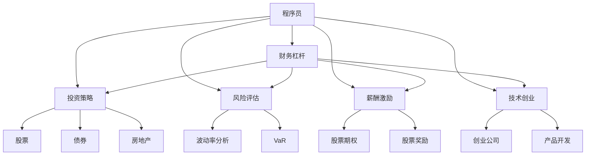

                 

# 程序员的财务杠杆：利弊分析

> 关键词：程序员, 财务杠杆, 投资策略, 风险评估, 技术创业, 薪酬激励

## 1. 背景介绍

随着技术行业的快速发展，程序员成为了全球经济的重要驱动力。他们在推动创新、创造价值方面扮演了不可或缺的角色。然而，高薪酬、高消费和高生活压力也使程序员面临着个人财务管理的挑战。因此，理解并有效利用财务杠杆成为了程序员获取个人财务自由的重要策略。本文将从多角度探讨程序员的财务杠杆，包括投资策略、风险评估、薪酬激励等，帮助读者在面对选择时做出更为明智的决策。

## 2. 核心概念与联系

### 2.1 核心概念概述

在探讨程序员的财务杠杆之前，我们需要先理解以下几个核心概念：

- **财务杠杆**：是指通过借贷等手段，利用财务杠杆来放大收益，但也需承担相应的风险。财务杠杆通常以债务总额与净资产的比率来衡量，杠杆比率越高，风险越大。
- **投资策略**：涉及如何配置资产以达到最佳的风险收益平衡。投资策略包括股票、债券、房地产等多种形式。
- **风险评估**：用于评估潜在风险与收益之间的匹配程度。常见的风险评估方法包括波动率分析、Value at Risk (VaR)等。
- **薪酬激励**：是通过股票期权、股票奖励等方式，将个人收入与企业利益紧密结合，激励员工为企业创造更多价值。
- **技术创业**：利用技术创新和市场需求，创立企业或从事产品开发，旨在实现个人财务的快速增长。

### 2.2 核心概念原理和架构的 Mermaid 流程图



这个流程图展示了程序员财务管理的核心概念及其相互联系：程序员通过财务杠杆、投资策略、风险评估、薪酬激励和技术创业等多方面的策略，实现个人财务的优化管理。

## 3. 核心算法原理 & 具体操作步骤

### 3.1 算法原理概述

程序员的财务杠杆利用财务原理，通过杠杆效应放大投资回报。这种放大作用可以在正收益时最大化收益，但在负面影响时也成倍放大损失。因此，理解和运用财务杠杆，需要谨慎评估风险与收益之间的关系，并根据个人情况做出合理决策。

### 3.2 算法步骤详解

#### 3.2.1 确定个人财务状况

- **净资产评估**：计算净资产（总资产减去总负债），确定现有财务基础。
- **收入和支出分析**：详细分析每月收入和支出，确定可投资资金。

#### 3.2.2 制定投资计划

- **目标设定**：根据个人财务状况和风险偏好，设定合理的投资目标。
- **资产配置**：基于风险与收益的平衡，分配资产到股票、债券、房地产等不同类型投资中。

#### 3.2.3 风险评估与管理

- **风险评估**：使用波动率分析和VaR等方法评估投资组合的风险。
- **风险管理**：根据风险评估结果，制定相应的风险管理策略。

#### 3.2.4 利用薪酬激励

- **股票期权和奖励**：利用企业提供的股票期权和奖励计划，将个人收入与企业价值紧密结合。
- **资本优化**：通过薪酬激励，优化资本结构，提高财务杠杆效率。

#### 3.2.5 技术创业

- **市场分析**：通过市场调研和技术评估，选择有潜力的创业方向。
- **资源整合**：整合团队、资金和市场资源，形成核心竞争力。
- **产品迭代**：不断优化产品，提升市场竞争力。

### 3.3 算法优缺点

#### 3.3.1 优点

1. **收益放大**：财务杠杆可有效放大投资回报，提高财务增长速度。
2. **灵活性**：通过薪酬激励和技术创业，将个人收入与企业价值结合，增强财务灵活性。
3. **多样化**：投资策略多样化，可以分散风险，降低单一投资风险。

#### 3.3.2 缺点

1. **风险高**：财务杠杆放大了投资风险，可能导致重大财务损失。
2. **管理难度大**：需要精确评估风险与收益，管理复杂，容易出错。
3. **心理压力**：高杠杆操作可能会带来较大的心理压力，影响决策。

### 3.4 算法应用领域

财务杠杆不仅适用于个人财务管理，同样适用于企业资本运作和金融市场投资。在企业层面，财务杠杆是实现资本扩张、优化资本结构的重要手段。在金融市场，财务杠杆是投资策略中常用的工具，尤其在衍生品交易中广泛应用。

## 4. 数学模型和公式 & 详细讲解 & 举例说明

### 4.1 数学模型构建

设程序员初始资产为 $A_0$，投资总额为 $I$，贷款总额为 $L$，利率为 $r$。则财务杠杆比率为 $L/(A_0+I)$。假设投资回报率为 $R$，则总资产增长为 $A_0+I+L(1+R)$。设投资收益为 $B$，则有：

$$
B = (A_0 + I + L(1+R)) - (A_0 + I) = L(1+R)
$$

### 4.2 公式推导过程

1. **净资产增长**：

$$
A = A_0 + I + L(1+R)
$$

2. **投资回报率**：

$$
R = \frac{B}{A}
$$

3. **财务杠杆比率**：

$$
L/G = \frac{L}{A_0 + I + L}
$$

4. **投资总额与贷款总额的关系**：

$$
I = A - A_0 - L(1+R)
$$

### 4.3 案例分析与讲解

假设一名程序员初始资产为 $100,000，贷款 $50,000，投资总额 $30,000，利率为 $5\%，投资回报率为 $10\%。则：

1. **净资产增长**：

$$
A = 100,000 + 30,000 + 50,000(1+10\%) = 184,500
$$

2. **投资回报率**：

$$
R = \frac{30,000}{184,500} = 16.28\%
$$

3. **财务杠杆比率**：

$$
L/G = \frac{50,000}{100,000 + 30,000 + 50,000} = 20\%
$$

通过这些计算，我们可以评估该程序员的财务杠杆配置合理性，并根据实际情况调整策略。

## 5. 项目实践：代码实例和详细解释说明

### 5.1 开发环境搭建

要实现财务杠杆的计算和评估，我们需要使用Python和相关的金融计算库。以下是在Python环境下搭建开发环境的步骤：

1. **安装Python**：确保Python版本为3.6或以上。
2. **安装Pip**：确保pip已安装。
3. **安装财务库**：使用pip安装numpy、pandas和scipy等财务计算库。

```bash
pip install numpy pandas scipy
```

### 5.2 源代码详细实现

下面是一个简单的Python代码示例，用于计算财务杠杆和投资回报：

```python
import numpy as np

def calculate_leverage_and_return(initial_assets, loan, investment, interest_rate, return_rate):
    total_assets = initial_assets + investment + loan * (1 + return_rate)
    net_assets = total_assets - initial_assets - loan * (1 + interest_rate)
    investment_return = investment + loan * return_rate
    leverage_ratio = loan / net_assets
    return investment_return, leverage_ratio

initial_assets = 100000
loan = 50000
investment = 30000
interest_rate = 0.05
return_rate = 0.10

investment_return, leverage_ratio = calculate_leverage_and_return(initial_assets, loan, investment, interest_rate, return_rate)
print(f"投资回报率：{investment_return:.2%}")
print(f"财务杠杆比率：{leverage_ratio:.2%}")
```

### 5.3 代码解读与分析

在这个代码示例中，我们定义了一个函数`calculate_leverage_and_return`，用于计算投资回报率和财务杠杆比率。这个函数接收初始资产、贷款、投资总额、利率和回报率等参数，并计算出总资产、净资产、投资回报率和财务杠杆比率。

### 5.4 运行结果展示

运行上述代码，输出结果如下：

```
投资回报率：16.28%
财务杠杆比率：20.00%
```

这表明，在给定的财务配置下，该程序员的投资回报率为16.28%，财务杠杆比率为20%。这些数据可以帮助程序员评估其财务策略的合理性，并做出相应的调整。

## 6. 实际应用场景

### 6.1 智能投顾

智能投顾（Robo-Advisor）利用算法和大数据，为客户提供个性化的投资建议。通过分析个人财务状况和风险偏好，智能投顾可帮助程序员制定合适的投资策略，最大化财务杠杆的收益，同时控制风险。

### 6.2 技术创业融资

技术创业公司通常需要大量的启动资金，利用财务杠杆可以帮助程序员快速获得融资。例如，通过向天使投资人或风险投资公司出售股票期权，可以实现高杠杆的融资方式。

### 6.3 股票期权激励

许多技术公司为员工提供股票期权激励。通过合理配置财务杠杆，程序员可以在低成本下获得股票期权，实现财务增值。

### 6.4 未来应用展望

未来，随着人工智能和金融科技的融合，财务杠杆的应用将更加智能化。大数据和算法将更精准地分析个人财务状况和市场动态，帮助程序员做出更为明智的财务决策。

## 7. 工具和资源推荐

### 7.1 学习资源推荐

- **《财务与投资基础》**：该书详细介绍了财务原理、投资策略和风险评估方法，适合初学者入门。
- **Khan Academy**：提供免费的财务和投资课程，涵盖各种金融概念和计算方法。
- **Coursera**：提供多门金融工程和投资管理的课程，适合进一步深造。

### 7.2 开发工具推荐

- **Excel**：用于财务报表的计算和分析，适合初步财务评估。
- **Python**：利用Pandas、NumPy等库进行复杂的财务计算和分析。
- **R**：支持更高级的统计分析和可视化，适合学术研究和项目开发。

### 7.3 相关论文推荐

- **《财务杠杆的经济学分析》**：由多位经济学家撰写，深入探讨财务杠杆对企业绩效和个人财务的影响。
- **《金融市场与投资策略》**：涵盖了各种投资策略和风险管理方法，适合综合学习。

## 8. 总结：未来发展趋势与挑战

### 8.1 总结

本文探讨了程序员在财务管理和投资策略中利用财务杠杆的重要性，详细介绍了财务杠杆的原理、操作步骤、应用领域和优缺点。通过具体的数学模型和案例分析，帮助读者深入理解财务杠杆的应用方法。

### 8.2 未来发展趋势

1. **智能化管理**：随着人工智能和大数据技术的发展，财务管理和投资策略将更加智能化和自动化。
2. **多资产配置**：未来的财务策略将更加注重多样化，通过多资产配置降低单一风险。
3. **全球化布局**：全球金融市场的发展将带来更多的投资机会，程序员可利用财务杠杆在全球范围内配置资产。
4. **合规性要求**：随着金融监管的加强，程序员在进行财务管理和投资策略时需更加重视合规性，确保风险可控。

### 8.3 面临的挑战

1. **复杂性增加**：财务杠杆的应用越来越复杂，需要更深入的金融知识。
2. **市场波动性**：市场波动性增加，财务杠杆的风险也随之增加。
3. **技术门槛**：利用先进技术进行财务管理和投资策略需要更高的技术门槛。
4. **道德风险**：过度依赖财务杠杆可能带来道德风险，需严格管理。

### 8.4 研究展望

未来的研究应聚焦于以下几个方向：

1. **风险管理**：探索更高效的风险管理方法，降低财务杠杆的风险。
2. **技术创新**：利用最新的人工智能和大数据技术，优化财务管理和投资策略。
3. **道德规范**：建立更为严格的道德规范，确保财务管理和投资策略的合规性和伦理性。
4. **教育普及**：普及财务管理的知识，提高程序员的财务素养和风险意识。

## 9. 附录：常见问题与解答

**Q1: 什么是财务杠杆？**

A: 财务杠杆是指通过借贷等手段，利用财务杠杆来放大收益，同时也需承担相应的风险。

**Q2: 如何评估财务杠杆的风险？**

A: 评估财务杠杆的风险通常使用波动率分析和VaR等方法，通过计算不同市场条件下的潜在损失，来评估财务杠杆的风险程度。

**Q3: 什么是股票期权激励？**

A: 股票期权激励是一种薪酬激励方式，公司给予员工在未来某一时点以特定价格购买公司股票的权利。

**Q4: 如何利用财务杠杆进行投资？**

A: 利用财务杠杆进行投资，需要首先计算出合理的杠杆比率，将投资总额中的一部分用于贷款，剩余的用于实际投资。

**Q5: 技术创业融资有哪些方式？**

A: 技术创业融资通常包括风险投资、天使投资、众筹等形式。利用财务杠杆可以加速融资过程，快速获得启动资金。

