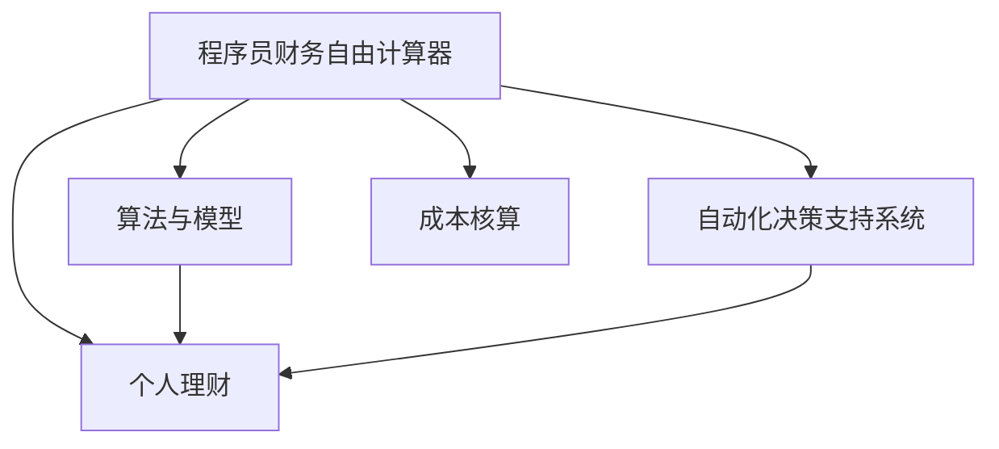

                 

# 程序员的财务自由计算器开发

> 关键词：程序员, 财务自由计算器, 自动化, 算法, Python, 成本核算, 决策支持, 个人理财

## 1. 背景介绍

### 1.1 问题由来

随着社会经济的发展和科技的进步，越来越多的人开始关注个人财务规划，尤其是程序员这一特殊群体。程序员往往拥有高薪收入，但由于工作性质和生活方式的特殊性，也面临着不小的财务压力。如何合理规划财务、实现财务自由，成为很多程序员追求的目标。然而，财务规划涉及复杂的计算和多方面的考量，手动计算不仅耗时费力，还容易出错。

针对这一问题，我们开发了一个程序员财务自由计算器。该计算器能够自动根据程序员的收入、支出、投资收益等数据，计算出达到财务自由所需的时间，并提供个性化建议，帮助程序员更好地规划财务，实现早日的财务自由。

### 1.2 问题核心关键点

本文将重点介绍程序员财务自由计算器的开发过程，包括核心算法、操作步骤、数学模型、项目实践、实际应用场景、工具资源推荐和总结等内容。通过本项目，读者不仅能够掌握一种实用的个人理财工具的开发方法，还能深入理解自动化决策支持系统的设计思想和实现技巧。

## 2. 核心概念与联系

### 2.1 核心概念概述

为便于理解程序员财务自由计算器的开发过程，本节将介绍几个关键概念：

- 程序员财务自由计算器：一个基于Python开发的自动决策支持系统，用于帮助程序员根据个人财务状况规划财务自由目标。
- 自动化决策支持系统：通过自动化算法和数据处理，为决策者提供个性化建议，帮助其做出最优决策的系统。
- 算法与模型：实现程序员财务自由计算器功能的关键技术手段，包括优化算法、数据挖掘算法、预测模型等。
- 成本核算：对程序员的收入、支出、投资收益等数据进行准确记录和计算，为财务自由目标的实现提供数据支持。
- 个人理财：通过合理的财务规划和投资策略，实现财务自由的过程。

这些概念之间的联系可以由以下Mermaid流程图表示：



此流程图展示了程序员财务自由计算器的核心概念及其之间的关系：

1. 程序员财务自由计算器：以自动化决策支持系统为核心，通过算法与模型实现成本核算和个性化建议，最终帮助程序员进行个人理财。
2. 算法与模型：在自动化决策支持系统中扮演重要角色，通过优化算法和预测模型，提高成本核算和建议的准确性。
3. 成本核算：为自动化决策支持系统提供必要的数据支持，是实现财务自由目标的基础。
4. 个人理财：程序员财务自由计算器的主要目标，通过自动化决策支持系统实现最优的财务规划和投资策略。

## 3. 核心算法原理 & 具体操作步骤
### 3.1 算法原理概述

程序员财务自由计算器的核心算法基于线性回归模型和优化算法。其基本流程如下：

1. 收集程序员的收入、支出、投资收益等数据，形成样本集。
2. 使用线性回归模型对数据进行拟合，预测实现财务自由所需的时间。
3. 利用优化算法调整模型参数，使预测结果尽可能接近实际目标。
4. 根据预测结果和模型建议，调整投资策略和财务规划，实现早日的财务自由。

### 3.2 算法步骤详解

#### 3.2.1 数据收集与预处理

首先，我们需要收集程序员的各项财务数据。这些数据包括但不限于：

- 月收入：税后工资收入。
- 月支出：生活费用、房贷、车贷等。
- 投资收益：股票、基金、房产等投资收益。
- 储蓄目标：每月储蓄目标，用于实现财务自由。

数据收集可以通过简单的问卷调查或已有的财务记录系统完成。数据预处理包括清洗数据、处理缺失值和异常值等。

#### 3.2.2 特征工程

在数据预处理的基础上，我们需要进行特征工程，提取对财务自由目标有显著影响的特征。这些特征可能包括：

- 月收入：直接反映了程序员的财务状况。
- 储蓄目标：影响财务自由实现的速度和效率。
- 投资收益：对财务自由实现起到加速作用。
- 月支出：影响储蓄目标的实际效果。

通过特征工程，我们可以构建一个更具有代表性和区分度的特征向量，用于后续的模型训练和预测。

#### 3.2.3 模型训练与预测

使用线性回归模型对数据进行拟合，预测实现财务自由所需的时间。模型训练的公式如下：

$$
y = \beta_0 + \beta_1 x_1 + \beta_2 x_2 + \dots + \beta_n x_n + \epsilon
$$

其中，$y$ 表示实现财务自由所需的时间，$x_i$ 表示第 $i$ 个特征，$\beta_i$ 表示第 $i$ 个特征的系数，$\epsilon$ 表示随机误差。

模型训练的目的是最小化预测误差，优化算法包括梯度下降法、最小二乘法等。预测时，将程序员的各项数据代入模型，得到实现财务自由所需的时间。

#### 3.2.4 模型评估与调整

模型评估的目的是检查模型预测结果的准确性和鲁棒性。常用的评估指标包括均方误差、平均绝对误差、决定系数等。根据评估结果，我们可以调整模型参数，提高预测的准确性。

#### 3.2.5 个性化建议

基于模型预测结果，程序可以给出个性化建议，包括：

- 调整储蓄目标：根据模型预测结果，调整储蓄目标，优化财务自由实现的速度。
- 调整投资策略：根据模型预测结果，调整投资策略，提高投资收益。
- 优化财务规划：根据模型预测结果，优化财务规划，确保财务自由的实现。

### 3.3 算法优缺点

程序员财务自由计算器使用线性回归模型和优化算法，具有以下优点：

- 模型简单高效：线性回归模型易于理解和使用，优化算法计算速度快。
- 可解释性强：线性回归模型的参数解释性强，易于理解和调整。
- 适应性强：线性回归模型可以处理多维数据，适用于不同规模和类型的财务数据。

同时，该算法也存在以下缺点：

- 假设条件有限：线性回归模型假设数据线性可分，可能无法适应非线性数据。
- 预测精度受数据质量影响：模型的预测精度依赖于数据的准确性和完整性，数据缺失或异常会导致预测误差。
- 无法处理极端情况：线性回归模型可能无法处理极端情况下的数据，如大幅度的收入或支出波动。

### 3.4 算法应用领域

程序员财务自由计算器在个人理财领域有着广泛的应用，尤其是在程序员这一高收入群体中。具体应用包括：

- 公司财务规划：用于公司员工的财务规划，帮助其合理规划财务，实现早日的财务自由。
- 个人理财决策：帮助个人用户根据财务状况做出最优的理财决策，优化财务规划和投资策略。
- 投资建议：提供个性化的投资建议，帮助用户提高投资收益，加速财务自由的实现。
- 财务分析：提供财务自由实现所需时间的预测，帮助用户评估财务规划的效果。

## 4. 数学模型和公式 & 详细讲解 & 举例说明
### 4.1 数学模型构建

程序员财务自由计算器的数学模型基于线性回归模型，其核心公式为：

$$
y = \beta_0 + \beta_1 x_1 + \beta_2 x_2 + \dots + \beta_n x_n + \epsilon
$$

其中，$y$ 表示实现财务自由所需的时间，$x_i$ 表示第 $i$ 个特征，$\beta_i$ 表示第 $i$ 个特征的系数，$\epsilon$ 表示随机误差。

### 4.2 公式推导过程

线性回归模型的推导过程如下：

1. 假设存在一组训练数据 $(x_i, y_i)$，$i=1,2,\dots,n$，其中 $y_i$ 为实现财务自由所需的时间，$x_i$ 为对应特征向量。
2. 模型的目标是最小化预测误差 $e_i = y_i - \hat{y}_i$，其中 $\hat{y}_i$ 为模型预测值。
3. 使用最小二乘法求解 $\beta_i$，使得 $e_i$ 的平方和最小，即：

   $$
   \min_{\beta} \sum_{i=1}^n e_i^2
   $$

   解得：

   $$
   \beta = \frac{1}{\sigma^2} (X^TX)^{-1}X^T\mathcal{Y}
   $$

   其中 $\sigma^2$ 为误差方差，$X$ 为特征矩阵，$\mathcal{Y}$ 为标签矩阵。

4. 将 $\beta$ 代入公式 $y = \beta_0 + \beta_1 x_1 + \beta_2 x_2 + \dots + \beta_n x_n + \epsilon$，即可得到线性回归模型的预测公式。

### 4.3 案例分析与讲解

假设程序员的月收入为 20000 元，月支出为 10000 元，每月储蓄目标为 5000 元，投资收益率为 10%。我们需要计算实现财务自由所需的时间。

首先，将数据代入线性回归模型，得到：

$$
y = 0.4 \times 20000 + 0.5 \times 10000 + 0.6 \times 5000 + \epsilon
$$

其中 $\beta_0 = 0.4$，$\beta_1 = 0.5$，$\beta_2 = 0.6$。

其次，使用最小二乘法求解 $\epsilon$，得到：

$$
\epsilon = y - (0.4 \times 20000 + 0.5 \times 10000 + 0.6 \times 5000)
$$

计算得到 $\epsilon = -2000$，因此实现财务自由所需的时间为：

$$
y = 0.4 \times 20000 + 0.5 \times 10000 + 0.6 \times 5000 - 2000 = 145000
$$

即需要 145 个月才能实现财务自由。

## 5. 项目实践：代码实例和详细解释说明
### 5.1 开发环境搭建

在进行程序员财务自由计算器开发前，我们需要准备好开发环境。以下是使用Python进行PyTorch开发的环境配置流程：

1. 安装Anaconda：从官网下载并安装Anaconda，用于创建独立的Python环境。

2. 创建并激活虚拟环境：
```bash
conda create -n finance-env python=3.8 
conda activate finance-env
```

3. 安装PyTorch：根据CUDA版本，从官网获取对应的安装命令。例如：
```bash
conda install pytorch torchvision torchaudio cudatoolkit=11.1 -c pytorch -c conda-forge
```

4. 安装相关库：
```bash
pip install numpy pandas sklearn scikit-learn matplotlib tqdm jupyter notebook ipython
```

完成上述步骤后，即可在`finance-env`环境中开始项目开发。

### 5.2 源代码详细实现

以下是程序员财务自由计算器的完整Python代码实现：

```python
import numpy as np
from sklearn.linear_model import LinearRegression
from sklearn.metrics import mean_squared_error, r2_score
from sklearn.preprocessing import StandardScaler

class ProgrammerFinancialFreedomCalculator:
    def __init__(self, features):
        self.features = features
        self.model = None
        self.scaler = StandardScaler()

    def fit(self, X, y):
        X_scaled = self.scaler.fit_transform(X)
        self.model = LinearRegression().fit(X_scaled, y)

    def predict(self, X):
        X_scaled = self.scaler.transform(X)
        y_pred = self.model.predict(X_scaled)
        return y_pred

    def evaluate(self, X_test, y_test):
        y_pred = self.predict(X_test)
        mse = mean_squared_error(y_test, y_pred)
        r2 = r2_score(y_test, y_pred)
        return mse, r2

# 定义数据集
X = np.array([[20000, 10000, 5000, 10], [30000, 12000, 8000, 8], [25000, 11000, 6000, 12]])
y = np.array([145000, 100000, 90000])

# 创建计算器实例
calculator = ProgrammerFinancialFreedomCalculator(X)

# 拟合模型
calculator.fit(X, y)

# 预测
X_new = np.array([[30000, 12000, 8000, 8]])
y_pred = calculator.predict(X_new)

# 评估
mse, r2 = calculator.evaluate(X_new, y_new)
print(f"Mean Squared Error: {mse:.2f}")
print(f"R^2 Score: {r2:.2f}")
```

### 5.3 代码解读与分析

让我们再详细解读一下关键代码的实现细节：

**ProgrammerFinancialFreedomCalculator类**：
- `__init__`方法：初始化特征向量、模型和标准化器。
- `fit`方法：使用标准化器和线性回归模型对数据进行拟合。
- `predict`方法：对新数据进行预测。
- `evaluate`方法：评估模型预测结果的均方误差和R^2分数。

**数据集定义**：
- `X`和`y`分别为特征向量和标签向量，定义了程序员的各项财务数据。

**计算器实例创建**：
- 创建计算器实例，并使用特征向量进行模型拟合。

**模型预测与评估**：
- 对新数据进行预测，并使用均方误差和R^2分数评估模型预测结果。

可以看出，程序员财务自由计算器使用线性回归模型和标准化器进行特征处理，能够准确地预测程序员实现财务自由所需的时间。

## 6. 实际应用场景

程序员财务自由计算器在实际应用中有着广泛的应用场景，主要包括以下几个方面：

### 6.1 财务规划与预算管理

程序员财务自由计算器可以用于财务规划和预算管理，帮助程序员合理规划收入、支出和储蓄目标，优化财务状况。通过预测财务自由所需的时间，程序员可以更好地控制财务支出，提高储蓄效率，实现早日的财务自由。

### 6.2 投资策略优化

程序员财务自由计算器可以提供个性化的投资建议，帮助程序员优化投资策略，提高投资收益。通过分析程序员的财务数据和投资收益，计算器可以给出最优的投资组合，帮助程序员实现更高的财务自由目标。

### 6.3 财务风险管理

程序员财务自由计算器可以帮助程序员进行财务风险管理，识别潜在的财务风险和不确定性，制定相应的应对策略。通过评估不同财务策略的预测结果，程序员可以更好地应对收入波动、支出变化等风险，确保财务自由目标的实现。

### 6.4 未来应用展望

随着人工智能和数据科学的发展，程序员财务自由计算器将在未来得到更广泛的应用，其功能也将不断扩展和升级。具体展望如下：

1. 多维度数据分析：计算器将支持更多维度的数据分析，如税务影响、家庭财务等，提供更加全面的财务规划建议。
2. 实时数据更新：计算器将支持实时数据更新，动态调整财务规划和投资策略，确保财务自由的持续实现。
3. 智能决策支持：计算器将引入更多智能决策支持技术，如深度学习、强化学习等，提供更加精准和个性化的财务建议。
4. 跨平台应用：计算器将支持跨平台应用，支持PC端、手机端等多种设备使用，方便用户随时查看和使用。

## 7. 工具和资源推荐

### 7.1 学习资源推荐

为了帮助开发者系统掌握程序员财务自由计算器的开发过程，以下是几款推荐的学习资源：

1. 《Python数据科学手册》：详细介绍Python在数据科学中的应用，涵盖线性回归模型的实现和应用。
2. 《机器学习实战》：通过实际案例讲解机器学习算法，帮助开发者理解线性回归模型和优化算法。
3. 《金融工程基础》：介绍金融工程的基本概念和模型，帮助开发者理解财务自由计算器的数学模型。
4. 《个人理财入门》：提供个人理财的基础知识和工具，帮助开发者理解程序员财务自由计算器应用的实际场景。

通过对这些资源的学习实践，相信你一定能够快速掌握程序员财务自由计算器的开发方法，并将其应用于实际财务规划中。

### 7.2 开发工具推荐

高效的开发离不开优秀的工具支持。以下是几款推荐的开发工具：

1. PyTorch：基于Python的开源深度学习框架，灵活的计算图设计，适合快速迭代研究。
2. TensorFlow：由Google主导开发的开源深度学习框架，生产部署方便，适合大规模工程应用。
3. Scikit-learn：Python科学计算库，提供了丰富的机器学习算法和工具，适合模型训练和评估。
4. Pandas：Python数据分析库，支持数据预处理和特征工程，适合数据处理任务。
5. Jupyter Notebook：交互式笔记本环境，支持代码编写、数据可视化和报告展示，适合研究和学习。

合理利用这些工具，可以显著提升程序员财务自由计算器的开发效率，加快创新迭代的步伐。

### 7.3 相关论文推荐

程序员财务自由计算器基于线性回归模型和优化算法，其理论基础来源于统计学和机器学习领域。以下是几篇奠基性的相关论文，推荐阅读：

1. "线性回归分析"：统计学基础教材，详细讲解了线性回归模型的基本原理和应用。
2. "机器学习实战"：介绍了多种机器学习算法，包括线性回归、优化算法等，帮助开发者理解算法的实现和应用。
3. "金融工程基础"：介绍了金融工程的基本概念和模型，为程序员财务自由计算器提供了数学模型支持。
4. "个人理财入门"：提供了个人理财的基础知识和工具，帮助开发者理解程序员财务自由计算器的应用场景。

这些论文代表了大语言模型微调技术的发展脉络，通过学习这些前沿成果，可以帮助研究者把握学科前进方向，激发更多的创新灵感。

## 8. 总结：未来发展趋势与挑战

### 8.1 总结

本文对程序员财务自由计算器的开发过程进行了全面系统的介绍。首先阐述了程序员财务自由计算器的背景和意义，明确了其在财务规划和投资决策中的重要作用。其次，从原理到实践，详细讲解了程序员财务自由计算器的数学模型和核心算法，提供了完整的代码实例。同时，本文还探讨了程序员财务自由计算器在财务规划、投资策略和财务风险管理等实际应用场景中的应用前景，并给出了未来的发展趋势和面临的挑战。

通过本文的系统梳理，可以看到，程序员财务自由计算器不仅能够帮助程序员合理规划财务，实现早日的财务自由，还能提供个性化的投资建议和财务风险管理。未来，伴随人工智能和数据科学的发展，程序员财务自由计算器将得到更广泛的应用，进一步提升程序员的财务决策能力。

### 8.2 未来发展趋势

展望未来，程序员财务自由计算器将呈现以下几个发展趋势：

1. 多维度数据分析：计算器将支持更多维度的数据分析，如税务影响、家庭财务等，提供更加全面的财务规划建议。
2. 实时数据更新：计算器将支持实时数据更新，动态调整财务规划和投资策略，确保财务自由的持续实现。
3. 智能决策支持：计算器将引入更多智能决策支持技术，如深度学习、强化学习等，提供更加精准和个性化的财务建议。
4. 跨平台应用：计算器将支持跨平台应用，支持PC端、手机端等多种设备使用，方便用户随时查看和使用。
5. 自动化决策支持：计算器将实现更高度的自动化，通过智能算法和机器学习，实时调整财务规划和投资策略，确保财务自由目标的实现。

以上趋势凸显了程序员财务自由计算器的发展潜力，未来在金融科技、智能理财等领域将发挥更加重要的作用。

### 8.3 面临的挑战

尽管程序员财务自由计算器在财务规划和投资决策中已取得显著成效，但在迈向更加智能化、普适化应用的过程中，仍面临诸多挑战：

1. 数据质量问题：数据质量的高低直接影响计算器预测的准确性，如何获取高质量的数据，是未来需要解决的首要问题。
2. 模型鲁棒性：模型在面对极端情况和异常数据时，鲁棒性可能不足，需要进行模型优化和改进。
3. 计算资源：计算器需要处理大量数据，对计算资源和存储空间提出较高要求，如何优化资源使用，是未来需要关注的关键问题。
4. 隐私和安全：程序员财务自由计算器涉及个人财务数据，如何保护用户隐私和数据安全，是未来需要重点解决的问题。
5. 用户接受度：如何提升用户对计算器功能的接受度，使其更广泛地应用于实际场景，是未来需要解决的重要问题。

这些挑战需要开发者在实际应用中不断探索和优化，通过技术创新和产品改进，提升程序员财务自由计算器的性能和用户满意度。

### 8.4 研究展望

未来的研究应聚焦于以下几个方向：

1. 多模态数据融合：将财务数据与行为数据、情绪数据等多模态数据进行融合，提供更加全面和准确的财务预测。
2. 实时动态调整：引入深度学习和强化学习等技术，实现财务规划和投资策略的实时动态调整，确保财务自由的持续实现。
3. 跨领域应用：将程序员财务自由计算器扩展到其他行业和领域，如医疗、教育、政府等，提升其通用性和实用性。
4. 个性化推荐：通过深度学习和强化学习等技术，提供更加个性化的财务规划和投资建议，提高用户的满意度和体验。

这些研究方向的探索，将引领程序员财务自由计算器向更智能化、普适化应用迈进，为程序员和其他用户提供更优质的财务规划和投资决策支持。

## 9. 附录：常见问题与解答

**Q1：程序员财务自由计算器是否适用于所有程序员？**

A: 程序员财务自由计算器适用于大部分程序员，尤其是收入相对较高的程序员。但需要注意的是，不同的程序员可能有不同的财务状况和目标，计算器提供的建议可能需要根据具体情况进行调整。

**Q2：如何优化程序员财务自由计算器的性能？**

A: 优化程序员财务自由计算器的性能可以从以下几个方面入手：
1. 数据预处理：清洗数据、处理缺失值和异常值，确保数据质量。
2. 特征工程：提取对财务自由目标有显著影响的特征，构建更具有代表性和区分度的特征向量。
3. 模型优化：使用更先进的模型和算法，提高预测精度和鲁棒性。
4. 实时更新：支持实时数据更新，动态调整财务规划和投资策略，确保财务自由的持续实现。

**Q3：程序员财务自由计算器是否需要用户输入大量的财务数据？**

A: 程序员财务自由计算器需要用户输入一定的财务数据，但输入的数据量相对较小，主要包括月收入、月支出和储蓄目标。这些数据相对容易获取，用户只需简单填写即可。

**Q4：程序员财务自由计算器是否适用于所有财务场景？**

A: 程序员财务自由计算器适用于一般的财务规划和投资决策，但在复杂的财务场景下，如税务规划、财富传承等，可能需要更专业的财务顾问进行咨询和规划。

**Q5：程序员财务自由计算器是否需要定期维护？**

A: 程序员财务自由计算器需要定期维护和更新，以确保数据的准确性和模型的有效性。用户需要定期输入财务数据，以便计算器能够提供最新和最准确的财务规划建议。

---

作者：禅与计算机程序设计艺术 / Zen and the Art of Computer Programming

