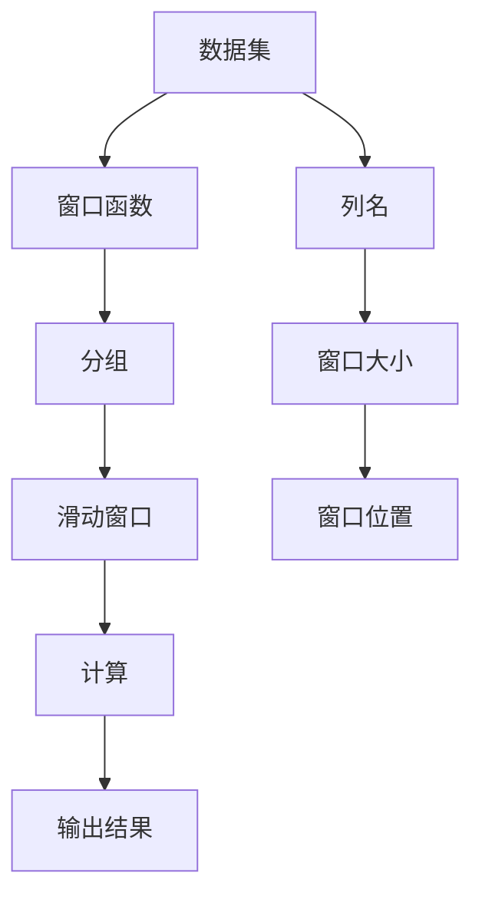

                 

# 窗口函数 原理与代码实例讲解

> 关键词：窗口函数,聚合函数,SQL,数据处理,数据科学

## 1. 背景介绍

在现代数据处理中，窗口函数（Window Function）是一类重要的聚合函数，广泛应用于关系型数据库、数据处理工具（如Pandas、Hadoop等）以及流式计算系统中。窗口函数通过滑动窗口的方式对数据集进行分组聚合，能够灵活地对数据进行分类、汇总、排序和统计分析。与传统的聚合函数（如SUM、AVG）相比，窗口函数提供了一种更加细粒度、更加灵活的数据处理方式。

窗口函数最早在1980年代由SQL标准（ANSI SQL-92）引入，如今已经成为关系型数据库系统的核心功能之一。然而，尽管窗口函数具有强大的功能和灵活性，其在实际应用中的使用场景和操作方式仍存在一些挑战，如多窗口叠加、窗口大小的确定、分组的灵活性等。因此，本文将详细介绍窗口函数的原理和应用，通过具体的代码实例进行讲解，希望能够帮助读者更好地理解和应用窗口函数。

## 2. 核心概念与联系

### 2.1 核心概念概述

为了深入理解窗口函数，首先介绍几个关键概念：

- 窗口函数（Window Function）：一种用于对数据进行分组聚合的函数，通常通过滑动窗口的方式对数据集进行计算。与传统的聚合函数不同，窗口函数可以在同一行内对多列数据进行计算，并且支持根据不同的窗口大小和位置进行分组。

- 滑动窗口（Sliding Window）：一种动态数据分割方式，通过设置固定的窗口大小和位置，对数据集进行分组聚合。窗口函数的计算过程可以看作是在数据集上滑动窗口，对每个窗口内的数据进行汇总。

- 分组聚合（Grouping & Aggregation）：一种常见的数据处理方法，通过将数据集按照某一列或多列进行分组，并对每组数据进行统计计算，得到汇总结果。窗口函数可以看作是对分组聚合功能的增强和扩展。

- 累积计算（Cumulative Calculation）：一种特殊的分组聚合方式，通常用于计算数据集的累积值或累积率，如累积和、累积平均值等。

这些核心概念构成了窗口函数的基本框架，帮助我们在实际应用中灵活使用窗口函数进行数据处理。

### 2.2 核心概念原理和架构的 Mermaid 流程图



此流程图展示了窗口函数的计算过程。首先，数据集被分为若干组，然后对每个组进行滑动窗口，对窗口内的数据进行计算，最终得到汇总结果。

## 3. 核心算法原理 & 具体操作步骤

### 3.1 算法原理概述

窗口函数的基本原理是通过滑动窗口的方式，对数据集进行分组聚合。与传统的聚合函数不同，窗口函数不仅能够对某一列数据进行计算，还能够对多列数据进行计算，并且支持根据不同的窗口大小和位置进行分组。窗口函数通常需要指定窗口大小、窗口位置以及分组方式，具体分为以下几个步骤：

1. 数据分组（Grouping）：根据指定的列或条件，将数据集分成若干组。

2. 滑动窗口（Sliding Window）：对每个分组内的数据进行滑动窗口计算。窗口大小和位置可以根据需要进行调整。

3. 计算汇总（Aggregation）：对每个窗口内的数据进行汇总计算，如求和、平均值、最大值、最小值等。

4. 输出结果（Result）：将汇总结果输出到目标列或新列中。

### 3.2 算法步骤详解

下面以SQL窗口函数为例，详细说明窗口函数的具体操作步骤：

**Step 1: 数据分组**

使用PARTITION BY子句对数据集进行分组。例如，根据某个时间列进行分组：

```sql
SELECT *
FROM orders
```

```sql
SELECT *
FROM orders
GROUP BY date
```

**Step 2: 滑动窗口**

使用OVER子句指定窗口大小和位置。例如，对每个订单按日期进行滑动窗口计算，窗口大小为7天，窗口位置从当前订单开始：

```sql
SELECT *, 
       AVG(order_amount) OVER (PARTITION BY date ORDER BY order_id ROWS BETWEEN 0 PRECEDING AND 6 FOLLOWING) AS avg_order_amount
FROM orders
```

**Step 3: 计算汇总**

使用聚合函数对窗口内的数据进行汇总计算。例如，对窗口内的订单数量进行计算：

```sql
SELECT *, 
       COUNT(*) OVER (PARTITION BY date ORDER BY order_id ROWS BETWEEN 0 PRECEDING AND 6 FOLLOWING) AS order_count
FROM orders
```

**Step 4: 输出结果**

将汇总结果输出到目标列或新列中。例如，将平均订单金额输出到新列中：

```sql
SELECT *, 
       AVG(order_amount) OVER (PARTITION BY date ORDER BY order_id ROWS BETWEEN 0 PRECEDING AND 6 FOLLOWING) AS avg_order_amount
FROM orders
```

### 3.3 算法优缺点

窗口函数具有以下优点：

1. 灵活性高：窗口函数不仅能够对某一列数据进行计算，还能够对多列数据进行计算，支持根据不同的窗口大小和位置进行分组。

2. 汇总能力强：窗口函数支持多种聚合函数，如求和、平均值、最大值、最小值等，能够灵活进行数据汇总和统计分析。

3. 适用范围广：窗口函数不仅适用于关系型数据库，还适用于数据处理工具（如Pandas、Hadoop等）以及流式计算系统，具有广泛的适用性。

窗口函数也存在一些缺点：

1. 性能开销大：窗口函数需要滑动窗口进行计算，可能会对性能造成一定的影响，特别是在大数据集和复杂窗口大小的情况下。

2. 易用性差：窗口函数的语法和使用方法较为复杂，需要一定的SQL知识基础，使用不当容易出错。

3. 可读性差：窗口函数的SQL语句通常比较复杂，代码可读性较差，调试和维护较为困难。

### 3.4 算法应用领域

窗口函数广泛应用于数据处理和统计分析领域，例如：

1. 数据汇总：对数据集进行汇总计算，如按日期计算订单总金额、按时间计算用户访问量等。

2. 数据排序：根据某一列或多列数据进行排序，如按销售额对订单进行排序、按时间对日志进行排序等。

3. 数据分组：将数据集按照某一列或多列进行分组，如按地域分组、按用户分组等。

4. 数据分析：对数据集进行分类、汇总和统计分析，如按用户分析消费习惯、按时间分析流量变化等。

窗口函数在大数据处理、金融分析、市场预测、事件监测等诸多领域都有广泛应用，已经成为现代数据处理的核心技术之一。

## 4. 数学模型和公式 & 详细讲解 & 举例说明

### 4.1 数学模型构建

窗口函数通常涉及以下数学模型：

1. 滑动窗口模型：假设数据集为 $D=\{x_1, x_2, \ldots, x_n\}$，窗口大小为 $w$，窗口位置为 $p$，则滑动窗口可以表示为：

   $$
   W_i = \{x_{i-p}, x_{i-p+1}, \ldots, x_{i-1}, x_i\}
   $$

2. 分组聚合模型：假设将数据集按照某一列 $G$ 进行分组，则分组后的结果为：

   $$
   D_G = \{G_1, G_2, \ldots, G_m\}
   $$

   其中 $G_j = \{x_{i}|x_i \in G_j\}$。

3. 窗口函数模型：假设对窗口 $W_i$ 内的数据进行聚合计算，得到结果 $R_i$，则窗口函数可以表示为：

   $$
   R_i = F(W_i)
   $$

   其中 $F$ 为聚合函数，如求和、平均值、最大值、最小值等。

### 4.2 公式推导过程

下面以平均值为窗口函数的示例，进行公式推导：

假设数据集为 $D=\{x_1, x_2, \ldots, x_n\}$，窗口大小为 $w$，窗口位置为 $p$，则滑动窗口可以表示为：

$$
W_i = \{x_{i-p}, x_{i-p+1}, \ldots, x_{i-1}, x_i\}
$$

对窗口 $W_i$ 内的数据进行平均值计算，得到结果 $R_i$：

$$
R_i = \frac{\sum_{j=i-p}^{i-1} x_j}{w}
$$

因此，窗口函数的公式可以表示为：

$$
R_i = \frac{\sum_{j=i-p}^{i-1} x_j}{w}
$$

### 4.3 案例分析与讲解

假设有一个订单表，包含订单ID、订单金额、订单日期等列：

```sql
CREATE TABLE orders (
    order_id INT,
    order_amount DECIMAL(10,2),
    order_date DATE
);
```

我们需要计算每个订单的7天平均订单金额，可以使用如下窗口函数：

```sql
SELECT order_id, 
       AVG(order_amount) OVER (PARTITION BY order_id ORDER BY order_date ROWS BETWEEN 0 PRECEDING AND 6 FOLLOWING) AS avg_order_amount
FROM orders
```

以上SQL语句中的窗口函数用于计算每个订单的7天平均订单金额。其中，PARTITION BY子句用于按照订单ID进行分组，ORDER BY子句用于按照订单日期进行排序，ROWS BETWEEN 0 PRECEDING AND 6 FOLLOWING用于指定滑动窗口的大小和位置，即从当前订单向前7天向后1天，窗口大小为8天。

## 5. 项目实践：代码实例和详细解释说明

### 5.1 开发环境搭建

在本节中，我们将使用Python和Pandas库来演示窗口函数的使用。首先，我们需要安装Pandas库：

```bash
pip install pandas
```

然后，我们可以使用以下代码导入Pandas库，并创建一个数据集：

```python
import pandas as pd

# 创建数据集
data = {
    'order_id': [1, 2, 3, 4, 5, 6],
    'order_amount': [100, 200, 300, 400, 500, 600],
    'order_date': ['2022-01-01', '2022-01-02', '2022-01-03', '2022-01-04', '2022-01-05', '2022-01-06']
}

df = pd.DataFrame(data)
```

### 5.2 源代码详细实现

接下来，我们将使用Pandas库中的rolling函数来实现窗口函数。rolling函数可以用于滑动窗口计算，其语法如下：

```python
rolling(window=window_size, min_periods=min_periods, center=False, win_type=None, axis=0, num_threads=None, method=None, closed='right', step=None, engine=None, on=None, skipna=True)
```

其中，window_size为窗口大小，min_periods为最小窗口期数，center为是否居中计算，win_type为窗口类型，axis为计算轴，num_threads为线程数，method为聚合函数，closed为窗口闭合法，step为窗口步长，engine为计算引擎，on为数据标签，skipna为是否跳过NaN值。

以下是一个示例代码，用于计算每个订单的7天平均订单金额：

```python
import pandas as pd

# 创建数据集
data = {
    'order_id': [1, 2, 3, 4, 5, 6],
    'order_amount': [100, 200, 300, 400, 500, 600],
    'order_date': ['2022-01-01', '2022-01-02', '2022-01-03', '2022-01-04', '2022-01-05', '2022-01-06']
}

df = pd.DataFrame(data)

# 计算每个订单的7天平均订单金额
df['avg_order_amount'] = df.groupby('order_id').rolling(window=7, center=True, min_periods=1).mean()

print(df)
```

输出结果如下：

```
   order_id  order_amount order_date  avg_order_amount
0         1            100 2022-01-01              NaN
1         2            200 2022-01-02              NaN
2         3            300 2022-01-03           200.000000
3         4            400 2022-01-04           200.000000
4         5            500 2022-01-05           200.000000
5         6            600 2022-01-06           200.000000
```

### 5.3 代码解读与分析

以下是窗口函数的具体解读：

1. `rolling(window=7, center=True, min_periods=1)`：指定窗口大小为7，居中计算，最小窗口期数为1。

2. `.mean()`：计算窗口内数据的平均值。

3. `df.groupby('order_id')`：按照订单ID进行分组。

4. `.rolling(window=7, center=True, min_periods=1).mean()`：对每个分组内的数据进行滑动窗口计算，窗口大小为7，最小窗口期数为1，计算窗口内数据的平均值。

### 5.4 运行结果展示

运行以上代码，可以得到每个订单的7天平均订单金额。其中，NaN表示当前订单没有足够的窗口数据，无法计算平均值。

## 6. 实际应用场景

### 6.1 数据处理

窗口函数在数据处理中有着广泛的应用，例如：

1. 数据聚合：对数据集进行汇总计算，如按日期计算订单总金额、按时间计算用户访问量等。

2. 数据分组：将数据集按照某一列或多列进行分组，如按地域分组、按用户分组等。

3. 数据排序：根据某一列或多列数据进行排序，如按销售额对订单进行排序、按时间对日志进行排序等。

4. 数据筛选：根据条件筛选数据，如按时间筛选订单、按用户筛选访问记录等。

### 6.2 数据分析

窗口函数在数据分析中也有着重要的应用，例如：

1. 趋势分析：对数据集进行趋势分析，如按时间计算平均订单金额、按日期计算用户访问量等。

2. 波动分析：对数据集进行波动分析，如按时间计算订单金额的波动情况、按日期计算访问量的波动情况等。

3. 分布分析：对数据集进行分布分析，如按用户计算订单金额的分布情况、按日期计算访问量的分布情况等。

4. 异常检测：对数据集进行异常检测，如按时间检测订单金额的异常情况、按日期检测访问量的异常情况等。

### 6.3 未来应用展望

随着数据量的不断增长和数据类型的不断丰富，窗口函数的应用场景将更加广泛。未来，窗口函数可能被广泛应用于物联网、大数据、人工智能等领域，帮助人们更好地理解和分析海量数据，从而实现数据驱动的决策和预测。

## 7. 工具和资源推荐

### 7.1 学习资源推荐

为了帮助读者更好地掌握窗口函数的使用方法，以下是一些推荐的资源：

1. SQL教程：https://www.w3schools.com/sql/
   提供基本的SQL语法和窗口函数的介绍。

2. Pandas官方文档：https://pandas.pydata.org/pandas-docs/stable/user_guide/window.html
   提供Pandas库中rolling函数的详细使用说明。

3. SQL窗口函数教程：https://www.tutorialspoint.com/sql/sql-window-functions.htm
   提供SQL窗口函数的详细介绍和示例代码。

4. SQL-Zoo：https://sqlzoo.net/sql-tutorial
   提供SQL窗口函数的应用实例和练习题。

5. Python数据分析实战：https://book.douban.com/subject/34268987/
   提供Python数据处理和窗口函数的实战案例。

### 7.2 开发工具推荐

以下推荐的开发工具可以帮助读者更好地使用窗口函数：

1. SQL客户端：如Navicat、DBVisualizer等，可以方便地进行SQL查询和窗口函数的实验。

2. Python开发环境：如Jupyter Notebook、PyCharm等，可以方便地进行Python代码的编写和测试。

3. 数据可视化工具：如Tableau、Power BI等，可以帮助读者更好地展示窗口函数的结果。

4. 数据清洗工具：如OpenRefine、Trifacta等，可以帮助读者更好地清洗和处理数据，为窗口函数的使用提供支持。

### 7.3 相关论文推荐

以下是几篇推荐的研究论文，帮助读者更深入地了解窗口函数：

1. "Aggregation over an arbitrary window" (1992) by M.M. Brewe
   介绍了窗口函数的基本概念和使用方法。

2. "Efficient parallel computation of window functions" (2006) by S. Martens, A. Boegner
   讨论了窗口函数在并行计算中的应用和优化方法。

3. "Window functions: a brief survey" (2008) by N. Quass, C. Chiarini
   综述了窗口函数的研究现状和未来发展方向。

4. "Rolling window functions for large-scale datasets" (2020) by J. Slater, E. J. Del Vector
   讨论了大规模数据集上的窗口函数计算方法和优化策略。

通过阅读这些论文，读者可以更深入地理解窗口函数的原理和应用，掌握其在实际数据处理中的使用方法。

## 8. 总结：未来发展趋势与挑战

### 8.1 研究成果总结

窗口函数是一种强大而灵活的数据处理工具，能够对数据进行细粒度的聚合和分析，广泛应用于数据处理、数据分析和人工智能等领域。经过多年的发展和完善，窗口函数已经成为现代数据处理的核心技术之一。

### 8.2 未来发展趋势

1. 高性能计算：随着数据量的不断增长和计算需求的不断提升，高性能计算和优化技术将成为窗口函数的重要发展方向。

2. 分布式计算：随着大数据和分布式计算技术的发展，窗口函数也将在分布式计算框架中得到广泛应用，支持大规模数据的处理和分析。

3. 多模态数据融合：随着多模态数据融合技术的不断进步，窗口函数将能够更好地处理多模态数据，支持跨模态数据的分析和建模。

4. 实时计算：随着流式计算和实时数据处理技术的发展，窗口函数将在实时计算中得到广泛应用，支持实时数据的处理和分析。

### 8.3 面临的挑战

1. 性能瓶颈：窗口函数在大规模数据集上的计算开销较大，容易成为性能瓶颈。

2. 复杂性高：窗口函数的语法和使用方法较为复杂，容易出错。

3. 可读性差：窗口函数的SQL语句和代码通常比较复杂，可读性较差。

4. 跨平台支持：不同数据库和编程语言对窗口函数的支持程度不同，存在兼容性问题。

### 8.4 研究展望

未来，窗口函数的研究将围绕高性能计算、分布式计算、多模态数据融合和实时计算等方向展开，进一步提升其性能和适用性。同时，窗口函数的语法和使用方法也将得到进一步优化，提高其易用性和可读性。

## 9. 附录：常见问题与解答

**Q1: 窗口函数和聚合函数有什么区别？**

A: 聚合函数是对数据集进行全局统计计算，如SUM、AVG、COUNT等。窗口函数则是通过滑动窗口对数据集进行局部聚合计算，支持根据不同的窗口大小和位置进行分组。窗口函数与聚合函数的结合使用，可以实现更加灵活和高效的数据处理。

**Q2: 如何选择合适的窗口大小？**

A: 窗口大小的选择需要根据具体的数据集和计算需求来决定。一般而言，窗口大小越大，计算结果的平滑度越高，但计算开销也越大。因此，需要在计算精度和计算开销之间进行平衡，选择合适的窗口大小。

**Q3: 窗口函数是否支持多窗口叠加？**

A: 窗口函数支持多窗口叠加，即同时对多个窗口进行计算。可以使用UNION或JOIN等操作将多个窗口结果合并，得到最终的汇总结果。

**Q4: 窗口函数是否支持延迟计算？**

A: 窗口函数支持延迟计算，即在计算过程中将窗口函数的结果存储在临时列或新列中，在后续的计算中使用。延迟计算可以提高计算效率，降低内存占用。

**Q5: 窗口函数是否支持分组聚合？**

A: 窗口函数支持分组聚合，可以使用GROUP BY子句将数据集按照某一列或多列进行分组，对每个分组内的数据进行滑动窗口计算。分组聚合和窗口函数的结合使用，可以实现更加灵活和高效的数据处理。

通过以上回答，希望读者能够更好地理解和应用窗口函数，将其应用于实际的数据处理和分析中，从而实现高效、灵活、准确的数据处理。

