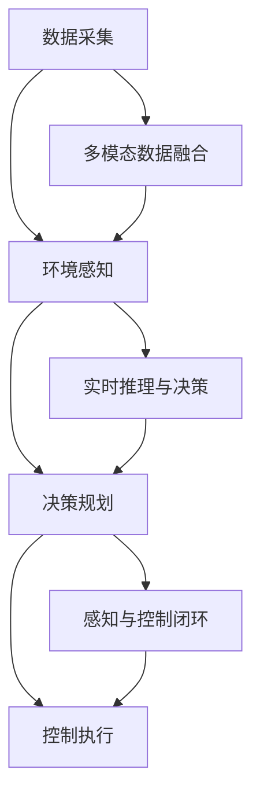

                 

## 1. 背景介绍

### 1.1 问题由来

自动驾驶作为新一代智能交通技术的代表，正逐步成为汽车行业的重要发展方向。其核心在于利用先进的传感器技术、环境感知、路径规划与控制等技术，实现车辆自主行驶。但当前自动驾驶技术在实际应用中仍面临诸多挑战，包括恶劣天气、复杂交通场景、传感器冗余等。这要求自动驾驶系统具有强大的全场景感知能力，能够适应各类复杂场景，确保行车安全。

### 1.2 问题核心关键点

1. **全场景感知需求**：自动驾驶系统需要实现对道路、交通、车辆、行人等各类场景元素的全面感知。涵盖天气、光照、道路标志、车道线、交通信号灯等元素的多维度融合。
2. **端到端框架设计**：构建从传感器数据采集、环境感知到路径规划、控制的端到端系统架构，确保各环节的协同工作。
3. **多模态数据融合**：将激光雷达、摄像头、毫米波雷达等不同传感器采集的多模态数据进行高效融合，提升环境感知准确度。
4. **实时性与可靠性**：在保证较高精度的情况下，实现毫秒级的实时处理能力，确保系统实时性和可靠性。
5. **可扩展性与可维护性**：系统设计应具备高可扩展性，支持动态添加新传感器和算法，便于后期维护与迭代优化。

## 2. 核心概念与联系

### 2.1 核心概念概述

为更好地理解端到端自动驾驶全场景感知框架，本节将介绍几个密切相关的核心概念：

- **端到端系统(E2E System)**：指从数据采集、环境感知、决策规划到控制执行的一体化系统，旨在提高系统整体性能和稳定性。
- **多模态感知(Multimodal Perception)**：指通过融合不同传感器（如摄像头、激光雷达、毫米波雷达等）的数据，提升环境感知的准确性和鲁棒性。
- **融合算法(Fusion Algorithm)**：通过特定算法将多源数据融合为统一的感知结果，以减少信息冗余，提升感知质量。
- **实时推理与决策(RT Inference & Decision)**：指在实时环境中，通过高效的推理引擎和决策算法，快速生成路径规划和控制指令，确保行车安全。
- **感知与控制闭环(Perception & Control Loop)**：指将感知结果与控制结果形成闭环，不断迭代优化，提升系统响应速度和精度。

这些核心概念之间的逻辑关系可以通过以下Mermaid流程图来展示：



这个流程图展示了一系列自动驾驶系统的工作流程：

1. 从传感器采集数据，通过多模态数据融合提升环境感知能力。
2. 将感知结果输入决策引擎，进行路径规划与控制。
3. 控制结果反馈到感知模块，形成闭环迭代，提升系统性能。

## 3. 核心算法原理 & 具体操作步骤
### 3.1 算法原理概述

端到端自动驾驶的全场景感知框架，核心在于实现多模态数据的融合和高效实时推理。其算法原理包括以下几个主要部分：

1. **多模态数据融合算法**：融合摄像头、激光雷达、毫米波雷达等多模态数据，提升环境感知精度和鲁棒性。
2. **实时推理算法**：基于高效的推理引擎，实时处理感知数据，生成路径规划和控制指令。
3. **感知与控制闭环算法**：将感知结果与控制结果形成闭环，不断迭代优化，确保系统动态适应环境变化。

### 3.2 算法步骤详解

基于上述算法原理，端到端自动驾驶全场景感知框架的设计和实现步骤可分解为以下几个主要环节：

**Step 1: 传感器数据采集与预处理**

1. **传感器选择**：根据应用场景需求，选择合适的传感器类型，如摄像头、激光雷达、毫米波雷达等。
2. **数据同步与同步器**：使用同步器确保各传感器数据的时间戳对齐，便于后续数据融合。
3. **数据预处理**：包括去噪、滤波、校正等步骤，提升数据质量。

**Step 2: 多模态数据融合**

1. **数据融合框架**：选择合适的融合算法，如卡尔曼滤波、加权融合、深度学习等。
2. **特征提取与融合**：对不同传感器数据进行特征提取，如点云、图像特征、速度信息等，进行融合。
3. **误差校正与优化**：利用误差校正算法，修正数据融合过程中的误差，提升融合精度。

**Step 3: 实时推理与决策**

1. **推理引擎设计**：选择适合的推理引擎，如TensorFlow、PyTorch等，构建高效的推理图。
2. **模型部署与优化**：将感知模型和决策模型部署在硬件加速器上，如GPU、TPU等，优化推理速度。
3. **实时推理与决策**：在实时环境中，基于感知结果和动态环境变化，进行路径规划与控制决策。

**Step 4: 感知与控制闭环**

1. **闭环反馈机制**：将控制结果反馈到感知模块，进行动态校正。
2. **迭代优化算法**：基于反馈结果，不断调整感知与决策模型，提升系统精度与鲁棒性。

### 3.3 算法优缺点

端到端自动驾驶全场景感知框架具有以下优点：

1. **高性能**：通过多模态数据融合和高效推理引擎，提升环境感知和实时推理能力。
2. **高可扩展性**：支持动态添加新传感器和算法，便于系统迭代优化。
3. **高可靠性**：通过闭环反馈和迭代优化，提高系统鲁棒性和稳定性。

同时，该框架也存在以下局限性：

1. **高计算资源需求**：多模态数据融合和实时推理需要较高的计算资源，对硬件要求较高。
2. **高实时性要求**：在保证精确度的前提下，需要极高的实时处理能力，对系统设计要求高。
3. **高调试难度**：多模态数据融合和复杂算法需要细致的调试和优化，难度较大。

### 3.4 算法应用领域

端到端自动驾驶全场景感知框架在多个领域具有广泛应用：

1. **自动驾驶车辆**：在智能汽车领域，提供从感知到决策的全流程解决方案，提升驾驶安全性。
2. **智能物流**：应用于智能仓库、配送车等场景，实现无人化、自动化物流。
3. **智能交通管理**：用于智慧城市交通管理，提高道路通行效率和安全性。
4. **自动驾驶辅助系统**：提供高级驾驶辅助功能，如自动泊车、车道保持等，提升驾驶体验。
5. **虚拟现实与增强现实**：应用于VR/AR领域，提升虚拟环境的沉浸感和交互性。

## 4. 数学模型和公式 & 详细讲解 & 举例说明

### 4.1 数学模型构建

端到端自动驾驶全场景感知框架的数学模型构建，主要包括以下几个部分：

1. **传感器数据模型**：描述不同传感器（如摄像头、激光雷达）的观测模型，包括位置、角度、分辨率等参数。
2. **多模态数据融合模型**：定义多模态数据融合的数学模型，包括权重分配、误差校正等算法。
3. **实时推理模型**：定义推理模型的数学框架，包括输入、输出、中间变量等。
4. **感知与控制闭环模型**：定义感知结果与控制结果的闭环反馈模型，包括动态更新算法。

### 4.2 公式推导过程

**传感器数据模型**

假设摄像头在时间$t$拍摄的图像为$I_t$，其位置和角度为$\mathbf{p}_c(t)$，分辨率为$r_c$，观测模型为：

$$
I_t = \mathbf{A}_c \mathbf{p}_c(t) + \mathbf{n}_t
$$

其中，$\mathbf{A}_c$为图像观测矩阵，$\mathbf{p}_c(t)$为摄像头位置和角度，$\mathbf{n}_t$为噪声。

**多模态数据融合模型**

假设摄像头和激光雷达同时观测目标物体，摄像头观测结果为$I_{ct}$，激光雷达点云为$L_t$，融合模型为：

$$
F(I_{ct}, L_t) = \alpha I_{ct} + (1-\alpha) L_t
$$

其中，$\alpha$为摄像头观测权重，$I_{ct}$为摄像头观测结果，$L_t$为激光雷达点云。

**实时推理模型**

假设输入为感知数据$S_t$，推理模型为$f_t(S_t)$，输出为路径规划和控制指令$U_t$，推理过程为：

$$
U_t = f_t(S_t)
$$

**感知与控制闭环模型**

假设感知结果为$P_t$，控制结果为$C_t$，闭环反馈模型为$F_{t+1}(P_t, C_t)$，闭环过程为：

$$
P_{t+1} = F_{t+1}(P_t, C_t)
$$

### 4.3 案例分析与讲解

以一个简单的自动驾驶场景为例，分析框架的设计与实现过程。

假设自动驾驶车辆配备摄像头、激光雷达、毫米波雷达等传感器，在道路上行驶。车辆在$t$时刻的摄像头观测图像为$I_{ct}$，激光雷达点云为$L_t$，毫米波雷达速度数据为$V_t$。

1. **数据采集与预处理**

使用同步器将摄像头、激光雷达、毫米波雷达的数据时间戳对齐，去除噪声，并进行校正。摄像头图像$I_{ct}$经过预处理后，输入环境感知模块。

2. **多模态数据融合**

将摄像头图像$I_{ct}$和激光雷达点云$L_t$进行融合，得到融合后的感知结果$S_t$。毫米波雷达速度数据$V_t$与$S_t$进行融合，得到最终感知结果$S_t$。

3. **实时推理与决策**

感知结果$S_t$输入决策模块，生成路径规划和控制指令$U_t$。决策模块基于实时环境变化，生成最优路径和控制策略。

4. **感知与控制闭环**

控制指令$U_t$反馈到感知模块，进行动态校正。感知结果$S_t$和控制指令$U_t$形成闭环，不断迭代优化，提升系统精度和鲁棒性。

## 5. 项目实践：代码实例和详细解释说明

### 5.1 开发环境搭建

进行端到端自动驾驶全场景感知框架的开发，需要搭建合适的开发环境：

1. **操作系统**：选择Ubuntu Linux或Windows Server等稳定操作系统，安装最新版本的Python和相关依赖库。
2. **深度学习框架**：安装TensorFlow或PyTorch等深度学习框架，配置GPU加速。
3. **数据集准备**：收集自动驾驶场景的传感器数据集，如KITTI、Waymo等公开数据集。
4. **环境感知模块**：安装摄像头、激光雷达、毫米波雷达等传感器，并搭建数据同步和预处理系统。

### 5.2 源代码详细实现

以下是一个简化的自动驾驶环境感知代码实现示例：

```python
import tensorflow as tf
import numpy as np

# 摄像头数据预处理
def preprocess_camera_data(data):
    # 去噪、滤波、校正等处理
    return processed_data

# 激光雷达数据预处理
def preprocess_lidar_data(data):
    # 去噪、滤波、校正等处理
    return processed_data

# 毫米波雷达数据预处理
def preprocess_radar_data(data):
    # 去噪、滤波、校正等处理
    return processed_data

# 多模态数据融合
def fuse_data(camera_data, lidar_data, radar_data):
    # 融合算法实现
    return fused_data

# 实时推理与决策
def inference(data):
    # 推理引擎实现
    return inference_result

# 感知与控制闭环
def perception_control_loop(data, control_result):
    # 闭环反馈机制
    return updated_data
```

### 5.3 代码解读与分析

- **摄像头数据预处理**：定义预处理函数，对摄像头观测数据进行去噪、滤波和校正。
- **激光雷达数据预处理**：定义预处理函数，对激光雷达点云数据进行去噪、滤波和校正。
- **毫米波雷达数据预处理**：定义预处理函数，对毫米波雷达速度数据进行去噪、滤波和校正。
- **多模态数据融合**：定义融合函数，将摄像头、激光雷达、毫米波雷达数据融合为统一的感知结果。
- **实时推理与决策**：定义推理函数，基于感知结果进行路径规划和控制决策。
- **感知与控制闭环**：定义闭环函数，将感知结果与控制结果进行动态校正，提升系统精度和鲁棒性。

## 6. 实际应用场景

### 6.1 智能交通管理

端到端自动驾驶全场景感知框架在智能交通管理领域有广泛应用。通过部署多模态传感器和深度学习算法，可以实现对交通流的实时监测和分析。具体应用包括：

1. **交通流量监测**：实时监测道路上的车流量、速度等信息，生成交通热图，为交通管理提供数据支持。
2. **交通事故预警**：通过多传感器融合，及时发现交通事故，进行预警和处理。
3. **智能红绿灯控制**：基于实时交通数据，动态调整红绿灯信号，提高通行效率。

### 6.2 自动驾驶车辆

在自动驾驶车辆中，端到端全场景感知框架提供从感知到决策的全流程解决方案，提升驾驶安全性。具体应用包括：

1. **环境感知**：通过多模态数据融合，实现对道路、交通、车辆、行人等元素的全面感知。
2. **路径规划**：基于实时感知数据，生成最优路径规划。
3. **车辆控制**：基于决策结果，生成控制指令，确保车辆安全行驶。

### 6.3 智能物流

端到端自动驾驶全场景感知框架在智能物流领域的应用，主要体现在智能仓储和智能配送车等方面。具体应用包括：

1. **智能仓储管理**：通过多传感器融合，实现对仓库内物品的实时监测和定位。
2. **智能配送车**：基于感知结果，实现无人化、自动化配送，提高物流效率。

## 7. 工具和资源推荐

### 7.1 学习资源推荐

- **自动驾驶相关课程**：选择Coursera、Udacity等平台的自动驾驶相关课程，系统学习自动驾驶基础知识和算法实现。
- **深度学习框架文档**：查阅TensorFlow、PyTorch等深度学习框架的官方文档，深入理解框架特点和使用方法。
- **开源项目与论文**：关注自动驾驶领域的开源项目，如OpenSDR、LidarSLAM等，阅读相关论文，获取最新研究成果。

### 7.2 开发工具推荐

- **深度学习框架**：选择TensorFlow、PyTorch等深度学习框架，进行算法实现。
- **数据处理工具**：使用Pandas、NumPy等数据处理工具，处理传感器数据和模型输入。
- **同步器与预处理工具**：使用ROS、VisionSLAM等工具，实现传感器数据的同步和预处理。

### 7.3 相关论文推荐

- **端到端自动驾驶**：查阅相关论文，如"End-to-End Training for Self-Driving Car with Deep Q-Network"，深入理解端到端自动驾驶系统设计。
- **多模态感知**：查阅相关论文，如"Multimodal Fusion Framework for Autonomous Driving"，了解多模态感知融合算法的实现。
- **实时推理与决策**：查阅相关论文，如"Real-Time Path Planning for Autonomous Vehicle using Reinforcement Learning"，学习实时推理与决策算法。

## 8. 总结：未来发展趋势与挑战

### 8.1 研究成果总结

端到端自动驾驶全场景感知框架的研究，取得了以下几方面的成果：

1. **多模态数据融合**：通过融合摄像头、激光雷达、毫米波雷达等多模态数据，提升了环境感知精度和鲁棒性。
2. **实时推理与决策**：基于高效推理引擎，实现了实时路径规划和控制。
3. **感知与控制闭环**：通过闭环反馈和迭代优化，提升了系统精度和鲁棒性。

### 8.2 未来发展趋势

展望未来，端到端自动驾驶全场景感知框架将呈现以下几个发展趋势：

1. **边缘计算与分布式处理**：为提升实时性，将部分计算任务从云端迁移到边缘设备，实现分布式处理。
2. **自适应多模态融合**：根据环境变化，动态调整多模态数据融合算法，提升感知能力。
3. **深度强化学习**：引入深度强化学习算法，优化路径规划和控制决策。
4. **知识图谱与语义理解**：引入知识图谱和语义理解技术，提升智能决策能力。
5. **自动化调参与模型优化**：开发自动化调参工具，优化模型性能。

### 8.3 面临的挑战

尽管端到端自动驾驶全场景感知框架取得了一定成果，但仍面临以下挑战：

1. **高计算资源需求**：多模态数据融合和实时推理需要较高的计算资源，对硬件要求较高。
2. **高实时性要求**：在保证精确度的前提下，需要极高的实时处理能力，对系统设计要求高。
3. **高调试难度**：多模态数据融合和复杂算法需要细致的调试和优化，难度较大。

### 8.4 研究展望

未来，在端到端自动驾驶全场景感知框架的研究中，需要解决以下问题：

1. **硬件加速与优化**：利用硬件加速器，提升计算效率，降低资源需求。
2. **实时性优化**：优化算法和推理引擎，提升实时处理能力。
3. **系统稳定性**：设计高可靠性系统架构，确保系统稳定运行。
4. **模型解释性**：提升模型的可解释性，便于系统调试和优化。
5. **跨领域应用**：将技术应用于更多领域，拓展应用场景。

## 9. 附录：常见问题与解答

**Q1：端到端自动驾驶全场景感知框架的设计难点是什么？**

A: 端到端自动驾驶全场景感知框架的设计难点主要在于以下几个方面：
1. **多模态数据融合**：不同传感器数据的融合需要设计合理的算法，消除冗余信息，提升感知质量。
2. **实时推理与决策**：实时推理算法需要在短时间内完成复杂计算，生成路径规划和控制指令。
3. **感知与控制闭环**：闭环反馈机制需要动态调整感知和决策模型，提升系统精度和鲁棒性。

**Q2：如何保证端到端自动驾驶全场景感知框架的实时性？**

A: 保证端到端自动驾驶全场景感知框架的实时性，主要从以下几个方面入手：
1. **硬件加速**：利用GPU、TPU等硬件加速器，提升计算效率。
2. **算法优化**：优化算法实现，减少计算复杂度。
3. **分布式处理**：采用分布式计算架构，提升并行处理能力。
4. **实时调度**：设计实时调度算法，动态调整计算资源分配。

**Q3：如何提升端到端自动驾驶全场景感知框架的鲁棒性？**

A: 提升端到端自动驾驶全场景感知框架的鲁棒性，主要从以下几个方面入手：
1. **数据增强**：通过数据增强技术，提升模型对噪声和干扰的鲁棒性。
2. **模型优化**：优化模型结构和训练过程，提升模型泛化能力。
3. **闭环反馈**：设计闭环反馈机制，动态调整感知和决策模型。
4. **异常检测**：引入异常检测算法，及时发现和处理异常情况。

**Q4：端到端自动驾驶全场景感知框架的实际应用有哪些？**

A: 端到端自动驾驶全场景感知框架的实际应用广泛，主要包括以下几个方面：
1. **智能交通管理**：用于交通流量监测、交通事故预警、智能红绿灯控制等。
2. **自动驾驶车辆**：应用于环境感知、路径规划、车辆控制等环节，提高驾驶安全性。
3. **智能物流**：用于智能仓储管理、智能配送车等，提高物流效率。

**Q5：未来端到端自动驾驶全场景感知框架有哪些发展趋势？**

A: 未来端到端自动驾驶全场景感知框架的发展趋势主要包括以下几个方面：
1. **边缘计算与分布式处理**：提升实时性，实现分布式处理。
2. **自适应多模态融合**：根据环境变化，动态调整数据融合算法。
3. **深度强化学习**：优化路径规划和控制决策。
4. **知识图谱与语义理解**：提升智能决策能力。
5. **自动化调参与模型优化**：提升模型性能和效率。

---

作者：禅与计算机程序设计艺术 / Zen and the Art of Computer Programming

