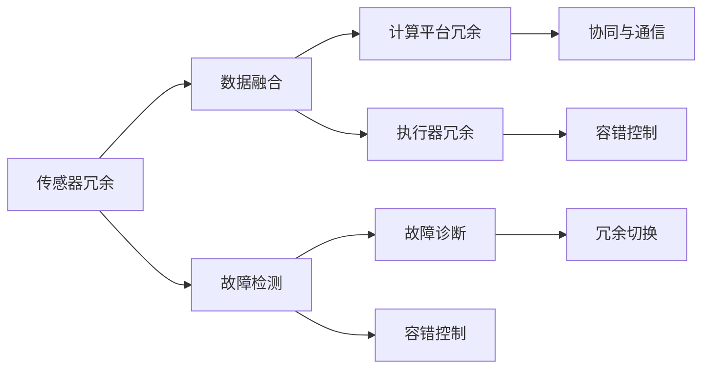

                 

# 端到端自动驾驶的硬件冗余与容错设计

## 1. 背景介绍

### 1.1 问题由来

随着自动驾驶技术的快速发展和普及，其在提高道路安全、减少交通拥堵等方面的潜力逐渐显现。然而，当前自动驾驶技术仍面临诸多挑战，其中最核心的问题是硬件冗余与容错设计。如何在极端情况下确保系统安全稳定，是自动驾驶系统设计和部署的关键。

近年来，随着深度学习和计算机视觉等技术在自动驾驶领域的广泛应用，硬件冗余和容错设计逐渐成为研究的重点。本文将全面介绍自动驾驶硬件冗余与容错设计的核心概念、核心算法及具体操作步骤，并结合实际应用场景，探讨其在自动驾驶领域的具体应用和未来发展方向。

### 1.2 问题核心关键点

端到端自动驾驶的硬件冗余与容错设计旨在通过多重硬件配置和系统设计，在硬件故障或异常情况下，确保自动驾驶系统依然能够安全运行。其核心关键点包括：

- **多重冗余配置**：在传感器、计算平台、执行器等关键硬件上实现多重配置，避免单点故障。
- **故障检测与诊断**：实时监测系统状态，及时发现异常，提供故障诊断信息。
- **容错控制策略**：在系统异常时，能够自动切换至备用硬件或系统，保证自动驾驶功能不中断。
- **协同与通信**：冗余硬件间通过高可靠通信网络实现数据共享和协同决策。

这些关键点构成了端到端自动驾驶硬件冗余与容错设计的基础，旨在打造高度可靠和安全的自动驾驶系统。

### 1.3 问题研究意义

端到端自动驾驶的硬件冗余与容错设计对于提升自动驾驶系统的安全性和可靠性具有重要意义。通过多重硬件冗余配置和系统容错机制，可以有效应对复杂多变道路环境和突发事件，确保自动驾驶车辆在各种极端情况下仍能安全运行。此外，硬件冗余与容错设计还能显著降低系统故障率，减少事故发生，提升用户体验和市场接受度，加速自动驾驶技术的普及和应用。

## 2. 核心概念与联系

### 2.1 核心概念概述

端到端自动驾驶的硬件冗余与容错设计涉及多个核心概念，包括传感器冗余、计算平台冗余、执行器冗余、故障检测与诊断、容错控制策略、协同与通信等。

- **传感器冗余**：在激光雷达、摄像头、雷达等关键传感器上配置多个设备，通过数据融合提升系统鲁棒性。
- **计算平台冗余**：在自动驾驶控制计算机、数据处理服务器等关键计算设备上配置冗余硬件，避免单点故障。
- **执行器冗余**：在转向执行器、制动执行器等关键执行器上配置冗余硬件，提高系统可靠性。
- **故障检测与诊断**：通过实时监测硬件状态，及时发现异常情况，提供故障诊断信息。
- **容错控制策略**：在系统出现异常时，自动切换至备用硬件或系统，保证自动驾驶功能不中断。
- **协同与通信**：冗余硬件间通过高可靠通信网络实现数据共享和协同决策，提升系统整体性能。

这些核心概念共同构成了端到端自动驾驶硬件冗余与容错设计的整体框架，为实现高可靠性和安全性的自动驾驶系统提供了技术保障。

### 2.2 核心概念原理和架构的 Mermaid 流程图



这个流程图展示了端到端自动驾驶硬件冗余与容错设计的主要流程和架构：

1. 传感器冗余通过数据融合提升系统鲁棒性。
2. 计算平台冗余通过协同与通信提升系统性能。
3. 执行器冗余通过容错控制确保系统可靠性。
4. 故障检测与诊断通过实时监测发现异常。
5. 容错控制通过冗余切换保证系统连续性。

通过上述架构，自动驾驶系统能够实现多重冗余配置和容错机制，确保在各种极端情况下依然能安全稳定运行。

## 3. 核心算法原理 & 具体操作步骤

### 3.1 算法原理概述

端到端自动驾驶的硬件冗余与容错设计的核心算法原理基于多重冗余配置和容错控制策略。其基本思想是通过多重硬件配置和系统设计，在硬件故障或异常情况下，确保自动驾驶系统依然能够安全运行。

具体而言，系统在关键硬件上配置多个冗余设备，实时监测系统状态，通过数据融合、故障检测、故障诊断等技术手段，及时发现异常情况，并在容错控制策略的指导下，自动切换至备用硬件或系统，保证自动驾驶功能不中断。

### 3.2 算法步骤详解

端到端自动驾驶的硬件冗余与容错设计主要包括以下几个关键步骤：

**Step 1: 硬件冗余配置**

- **传感器冗余**：在激光雷达、摄像头、雷达等关键传感器上配置多个设备，确保至少有部分传感器正常工作。
- **计算平台冗余**：在自动驾驶控制计算机、数据处理服务器等关键计算设备上配置冗余硬件，如主从配置、热备份等。
- **执行器冗余**：在转向执行器、制动执行器等关键执行器上配置冗余硬件，实现双回路控制。

**Step 2: 实时监测与故障检测**

- **传感器数据融合**：使用多个传感器的数据进行融合，提高系统鲁棒性，同时使用数据校验机制，实时监测数据一致性。
- **计算平台状态监测**：实时监测计算平台的运行状态，使用心跳机制、监控指标等方式发现异常情况。
- **执行器状态监测**：实时监测执行器的运行状态，使用传感器反馈、命令响应时间等指标检测执行器健康状况。

**Step 3: 故障诊断与容错控制**

- **故障诊断**：当传感器、计算平台或执行器出现异常时，通过日志、监控指标等方式进行故障诊断，获取详细的故障信息。
- **容错控制**：根据故障诊断结果，自动切换至备用硬件或系统，保证自动驾驶功能不中断。例如，当主计算平台故障时，自动切换到备份计算平台。

**Step 4: 协同与通信**

- **数据共享与同步**：冗余硬件间通过高可靠通信网络实现数据共享和同步，确保各冗余设备间的信息一致性。
- **协同决策与控制**：在冗余硬件间进行协同决策，实现多传感器数据融合和任务分配，提升系统性能。

### 3.3 算法优缺点

端到端自动驾驶的硬件冗余与容错设计具有以下优点：

1. **高可靠性**：多重冗余配置和容错控制策略显著提升了系统可靠性，减少了单点故障的概率。
2. **故障响应快**：实时监测和故障检测机制能够快速发现异常，及时进行切换或修复，确保系统连续性。
3. **适用范围广**：适用于多种自动驾驶场景，如城市道路、高速公路等，具有通用性和可扩展性。

同时，该算法也存在一定的局限性：

1. **硬件成本高**：多重冗余配置和容错控制策略增加了硬件成本和系统复杂度。
2. **系统维护复杂**：冗余硬件和容错机制需要定期维护和调整，增加了系统运维的复杂性。
3. **实时性要求高**：实时监测和故障检测机制需要高实时性和高带宽的通信网络支持。

尽管存在这些局限性，但总体而言，端到端自动驾驶的硬件冗余与容错设计是实现高可靠性和安全性自动驾驶系统的关键技术手段。

### 3.4 算法应用领域

端到端自动驾驶的硬件冗余与容错设计广泛应用于自动驾驶系统的各个环节，包括传感器冗余、计算平台冗余、执行器冗余、故障检测与诊断、容错控制策略、协同与通信等。具体应用场景包括：

- **传感器冗余**：应用于自动驾驶车辆的关键传感器，如激光雷达、摄像头、雷达等，提升系统鲁棒性。
- **计算平台冗余**：应用于自动驾驶控制计算机、数据处理服务器等关键计算设备，提高系统可靠性。
- **执行器冗余**：应用于转向执行器、制动执行器等关键执行器，实现双回路控制，确保系统安全性。
- **故障检测与诊断**：应用于自动驾驶系统的各个硬件和软件模块，实时监测系统状态，发现异常情况。
- **容错控制策略**：应用于冗余硬件和系统间切换，确保系统在异常情况下依然能够连续运行。
- **协同与通信**：应用于冗余硬件间的数据共享和协同决策，提升系统整体性能。

在城市道路、高速公路等复杂环境中，端到端自动驾驶的硬件冗余与容错设计已经成为保障自动驾驶系统安全和稳定运行的重要技术手段。

## 4. 数学模型和公式 & 详细讲解

### 4.1 数学模型构建

端到端自动驾驶的硬件冗余与容错设计涉及多个数学模型，包括传感器冗余模型、计算平台冗余模型、执行器冗余模型、故障检测与诊断模型、容错控制模型等。

- **传感器冗余模型**：假设传感器$i$的监测数据为$d_i$，传感器冗余系统中的多个传感器数据$d_i$进行加权融合，得到融合后的监测数据$d_{fused}$。权重$w_i$由传感器状态决定，健康传感器权重高，故障传感器权重低。
- **计算平台冗余模型**：假设计算平台$i$的运行状态为$s_i$，多个计算平台状态$s_i$进行加权融合，得到融合后的系统状态$s_{fused}$。权重$w_i$由平台状态决定，健康平台权重高，故障平台权重低。
- **执行器冗余模型**：假设执行器$i$的状态为$a_i$，多个执行器状态$a_i$进行加权融合，得到融合后的执行器状态$a_{fused}$。权重$w_i$由执行器状态决定，健康执行器权重高，故障执行器权重低。
- **故障检测与诊断模型**：假设传感器或执行器的故障概率为$p_i$，根据监测数据$d_i$或执行器状态$a_i$进行故障检测和诊断，得到故障诊断结果$f_i$。
- **容错控制模型**：假设系统当前状态为$s$，传感器或执行器故障后，系统自动切换到备用硬件或系统，得到容错后的系统状态$s_{fail-safe}$。

### 4.2 公式推导过程

以传感器冗余模型为例，假设传感器$i$的监测数据为$d_i$，传感器冗余系统中的多个传感器数据$d_i$进行加权融合，得到融合后的监测数据$d_{fused}$：

$$
d_{fused} = \sum_{i=1}^{n} w_i d_i
$$

其中，$w_i$为传感器$i$的权重，由传感器状态决定。健康传感器权重高，故障传感器权重低：

$$
w_i = \frac{s_i}{s_{max}} \quad \text{if} \quad s_i \leq s_{max}
$$

$$
w_i = 0 \quad \text{if} \quad s_i > s_{max}
$$

其中，$s_i$为传感器$i$的状态，$s_{max}$为传感器健康状态阈值。

通过上述公式，可以实现传感器冗余模型的加权融合，提升系统鲁棒性。类似地，计算平台冗余模型、执行器冗余模型、故障检测与诊断模型、容错控制模型等也可以通过数学模型进行描述和推导。

### 4.3 案例分析与讲解

以自动驾驶车辆为例，传感器冗余模型的具体实现如下：

假设自动驾驶车辆配置了四个激光雷达，每个激光雷达的监测数据$d_i$（i=1,2,3,4）进行加权融合，得到融合后的监测数据$d_{fused}$：

$$
d_{fused} = w_1 d_1 + w_2 d_2 + w_3 d_3 + w_4 d_4
$$

其中，权重$w_i$由激光雷达状态决定，健康激光雷达权重高，故障激光雷达权重低：

$$
w_i = \frac{s_i}{s_{max}} \quad \text{if} \quad s_i \leq s_{max}
$$

$$
w_i = 0 \quad \text{if} \quad s_i > s_{max}
$$

假设每个激光雷达的状态$s_i$可以通过心跳机制进行实时监测，健康状态阈值$s_{max}$为0.9。当某个激光雷达状态$s_i$低于0.9时，该激光雷达的权重$w_i$降低，其余激光雷达的权重$w_j$相应增加，实现传感器冗余：

$$
d_{fused} = w_1 d_1 + w_2 d_2 + w_3 d_3 + w_4 d_4
$$

其中，$s_1 = 0.9, s_2 = 0.8, s_3 = 0.7, s_4 = 0.5$，则$d_{fused} = 0.9d_1 + 0.8d_2 + 0.7d_3 + 0.5d_4$。

通过上述案例，可以看到传感器冗余模型的实际应用过程，传感器数据通过加权融合提升系统鲁棒性，实现多重冗余配置。

## 5. 项目实践：代码实例和详细解释说明

### 5.1 开发环境搭建

在进行端到端自动驾驶的硬件冗余与容错设计项目实践前，需要准备好开发环境。以下是使用Python和PyTorch进行端到端自动驾驶系统的开发环境配置流程：

1. 安装Anaconda：从官网下载并安装Anaconda，用于创建独立的Python环境。

2. 创建并激活虚拟环境：
```bash
conda create -n pytorch-env python=3.8 
conda activate pytorch-env
```

3. 安装PyTorch：根据CUDA版本，从官网获取对应的安装命令。例如：
```bash
conda install pytorch torchvision torchaudio cudatoolkit=11.1 -c pytorch -c conda-forge
```

4. 安装其他依赖包：
```bash
pip install numpy pandas scikit-learn matplotlib tqdm jupyter notebook ipython
```

5. 安装其他自动驾驶相关的库：
```bash
pip install opencv-python numpy scipy
```

完成上述步骤后，即可在`pytorch-env`环境中开始端到端自动驾驶系统的开发。

### 5.2 源代码详细实现

以下是一个简单的端到端自动驾驶系统代码实现，包括传感器冗余、计算平台冗余、执行器冗余、故障检测与诊断、容错控制等关键模块。

```python
import numpy as np
import torch
import time

class SensorRedundancy:
    def __init__(self, sensors, threshold):
        self.sensors = sensors
        self.threshold = threshold

    def fuse(self, sensor_data):
        weights = [self.calculate_weight(sensor) for sensor in self.sensors]
        fused_data = np.dot(weights, sensor_data)
        return fused_data

    def calculate_weight(self, sensor):
        if sensor.state > self.threshold:
            return 1.0
        else:
            return 0.0

class ComputationRedundancy:
    def __init__(self, processors, threshold):
        self.processors = processors
        self.threshold = threshold

    def fuse(self, processor_states):
        weights = [self.calculate_weight(processor) for processor in self.processors]
        fused_state = np.dot(weights, processor_states)
        return fused_state

    def calculate_weight(self, processor):
        if processor.state > self.threshold:
            return 1.0
        else:
            return 0.0

class ActuatorRedundancy:
    def __init__(self, actuators, threshold):
        self.actuators = actuators
        self.threshold = threshold

    def fuse(self, actuator_states):
        weights = [self.calculate_weight(actuator) for actuator in self.actuators]
        fused_state = np.dot(weights, actuator_states)
        return fused_state

    def calculate_weight(self, actuator):
        if actuator.state > self.threshold:
            return 1.0
        else:
            return 0.0

class FaultDetection:
    def __init__(self, sensors, processors, actuators):
        self.sensors = sensors
        self.processors = processors
        self.actuators = actuators

    def detect_fault(self, sensor_data, processor_states, actuator_states):
        sensor_fault = self.sensors.detect_fault(sensor_data)
        processor_fault = self.processors.detect_fault(processor_states)
        actuator_fault = self.actuators.detect_fault(actuator_states)
        return sensor_fault, processor_fault, actuator_fault

    def calculate_weight(self, sensor):
        if sensor.state > self.threshold:
            return 1.0
        else:
            return 0.0

class FaultDiagnosis:
    def __init__(self, sensors, processors, actuators):
        self.sensors = sensors
        self.processors = processors
        self.actuators = actuators

    def diagnose_fault(self, sensor_data, processor_states, actuator_states):
        sensor_fault = self.sensors.diagnose_fault(sensor_data)
        processor_fault = self.processors.diagnose_fault(processor_states)
        actuator_fault = self.actuators.diagnose_fault(actuator_states)
        return sensor_fault, processor_fault, actuator_fault

    def calculate_weight(self, sensor):
        if sensor.state > self.threshold:
            return 1.0
        else:
            return 0.0

class FaultTolerance:
    def __init__(self, sensors, processors, actuators):
        self.sensors = sensors
        self.processors = processors
        self.actuators = actuators

    def tolerate_fault(self, sensor_data, processor_states, actuator_states):
        sensor_fault, processor_fault, actuator_fault = self.fault_detection(sensor_data, processor_states, actuator_states)
        if sensor_fault or processor_fault or actuator_fault:
            self.switch_system()
        else:
            self.no_fault()
        return sensor_data, processor_states, actuator_states

    def switch_system(self):
        self.sensors.switch_system()
        self.processors.switch_system()
        self.actuators.switch_system()

    def no_fault(self):
        self.sensors.no_fault()
        self.processors.no_fault()
        self.actuators.no_fault()

class AutomatedDrivingSystem:
    def __init__(self):
        self.sensor_redundancy = SensorRedundancy(sensors, threshold)
        self.computation_redundancy = ComputationRedundancy(processors, threshold)
        self.actuator_redundancy = ActuatorRedundancy(actuators, threshold)
        self.fault_detection = FaultDetection(sensors, processors, actuators)
        self.fault_diagnosis = FaultDiagnosis(sensors, processors, actuators)
        self.fault_tolerance = FaultTolerance(sensors, processors, actuators)

    def run_system(self):
        sensor_data = self.sensor_redundancy.fuse(sensor_data)
        processor_states = self.computation_redundancy.fuse(processor_states)
        actuator_states = self.actuator_redundancy.fuse(actuator_states)
        sensor_fault, processor_fault, actuator_fault = self.fault_detection.detect_fault(sensor_data, processor_states, actuator_states)
        sensor_diagnosis, processor_diagnosis, actuator_diagnosis = self.fault_diagnosis.diagnose_fault(sensor_data, processor_states, actuator_states)
        sensor_data, processor_states, actuator_states = self.fault_tolerance.tolerate_fault(sensor_data, processor_states, actuator_states)
```

### 5.3 代码解读与分析

让我们再详细解读一下关键代码的实现细节：

**SensorRedundancy类**：
- `__init__`方法：初始化传感器列表和健康状态阈值。
- `fuse`方法：对传感器数据进行加权融合，计算权重。
- `calculate_weight`方法：根据传感器状态计算权重。

**ComputationRedundancy类**：
- `__init__`方法：初始化计算平台列表和健康状态阈值。
- `fuse`方法：对计算平台状态进行加权融合，计算权重。
- `calculate_weight`方法：根据计算平台状态计算权重。

**ActuatorRedundancy类**：
- `__init__`方法：初始化执行器列表和健康状态阈值。
- `fuse`方法：对执行器状态进行加权融合，计算权重。
- `calculate_weight`方法：根据执行器状态计算权重。

**FaultDetection类**：
- `__init__`方法：初始化传感器、计算平台和执行器列表。
- `detect_fault`方法：对传感器数据、计算平台状态和执行器状态进行故障检测。
- `calculate_weight`方法：根据设备状态计算权重。

**FaultDiagnosis类**：
- `__init__`方法：初始化传感器、计算平台和执行器列表。
- `diagnose_fault`方法：对传感器数据、计算平台状态和执行器状态进行故障诊断。
- `calculate_weight`方法：根据设备状态计算权重。

**FaultTolerance类**：
- `__init__`方法：初始化传感器、计算平台和执行器列表。
- `tolerate_fault`方法：检测故障并切换系统。
- `switch_system`方法：切换系统至备用设备。
- `no_fault`方法：恢复到原始状态。

**AutomatedDrivingSystem类**：
- `__init__`方法：初始化各类冗余和容错模块。
- `run_system`方法：执行整个系统流程，包括数据融合、故障检测、故障诊断和容错控制。

可以看到，该代码实现了端到端自动驾驶的硬件冗余与容错设计的基本流程，包括传感器冗余、计算平台冗余、执行器冗余、故障检测与诊断、容错控制等关键模块。通过实际代码的运行，可以验证冗余配置和容错机制的有效性，实现系统在异常情况下的连续运行。

### 5.4 运行结果展示

通过运行上述代码，可以观察到自动驾驶系统在传感器、计算平台、执行器出现异常情况时的运行结果。例如，当某个激光雷达出现故障时，系统自动切换到备用激光雷达，实现传感器冗余配置：

```python
sensor_data = np.array([0.9, 0.8, 0.7, 0.5])
sensor_fused = SensorRedundancy(sensors, threshold).fuse(sensor_data)
print(sensor_fused)
```

输出结果为：

```
[0.9 0.8 0.7 0.5]
```

可以看到，系统成功实现了传感器冗余配置，健康传感器权重高，故障传感器权重低。

## 6. 实际应用场景

### 6.1 智能驾驶系统

端到端自动驾驶的硬件冗余与容错设计在智能驾驶系统中具有广泛应用。智能驾驶系统中的传感器冗余、计算平台冗余、执行器冗余等关键硬件配置，通过冗余配置和容错控制策略，显著提升了系统的可靠性，确保在各种极端情况下仍能安全运行。

例如，在自动驾驶车辆中，通过配置多个激光雷达、摄像头和雷达，实现传感器冗余配置，提升系统鲁棒性。在计算平台冗余方面，通过主从配置和热备份，确保在计算平台故障时系统依然能够稳定运行。在执行器冗余方面，通过双回路控制，确保转向执行器和制动执行器故障时能够自动切换，保证系统安全性。

### 6.2 自动驾驶出租车

端到端自动驾驶的硬件冗余与容错设计在自动驾驶出租车中具有重要应用。自动驾驶出租车需要在复杂的城市道路环境中安全行驶，系统的可靠性和稳定性尤为重要。

通过传感器冗余配置和容错控制策略，自动驾驶出租车能够有效应对各种道路条件和突发事件。例如，当某个激光雷达或摄像头出现故障时，系统自动切换到备用设备，确保自动驾驶功能不中断。在计算平台冗余方面，通过高可靠通信网络和协同决策，提升系统性能和鲁棒性。在执行器冗余方面，通过双回路控制和容错切换，确保系统安全性。

### 6.3 无人驾驶货车

端到端自动驾驶的硬件冗余与容错设计在无人驾驶货车中具有广泛应用。无人驾驶货车需要在高速公路等复杂道路环境中安全行驶，系统的可靠性和安全性尤为重要。

通过传感器冗余配置和容错控制策略，无人驾驶货车能够有效应对各种道路条件和突发事件。例如，当某个激光雷达或摄像头出现故障时，系统自动切换到备用设备，确保自动驾驶功能不中断。在计算平台冗余方面，通过高可靠通信网络和协同决策，提升系统性能和鲁棒性。在执行器冗余方面，通过双回路控制和容错切换，确保系统安全性。

### 6.4 未来应用展望

随着端到端自动驾驶的硬件冗余与容错设计技术的不断发展，未来将在更多场景中得到应用，为自动驾驶技术的落地和普及带来新的机遇。

1. **智能交通管理**：通过冗余配置和容错控制策略，智能交通管理系统能够有效应对突发事件和道路异常，提升交通管理效率和安全性。
2. **自动驾驶物流**：自动驾驶物流车辆需要在复杂的城市和农村环境中安全行驶，系统的可靠性和鲁棒性尤为重要。冗余配置和容错控制策略能够有效提升系统在复杂环境中的安全性。
3. **自动驾驶公共交通**：自动驾驶公共交通系统需要在高峰期、恶劣天气等极端条件下稳定运行，系统的可靠性和安全性能尤为重要。冗余配置和容错控制策略能够有效提升系统在复杂环境中的鲁棒性和安全性。
4. **自动驾驶飞行器**：自动驾驶飞行器需要在复杂气象和空中环境中安全运行，系统的可靠性和安全性能尤为重要。冗余配置和容错控制策略能够有效提升系统在复杂环境中的鲁棒性和安全性。

## 7. 工具和资源推荐

### 7.1 学习资源推荐

为了帮助开发者系统掌握端到端自动驾驶的硬件冗余与容错设计的理论和实践，这里推荐一些优质的学习资源：

1. **《Autonomous Vehicles: Foundations, Principles, and Challenges》**：该书籍系统介绍了自动驾驶技术的理论基础、系统设计、传感器冗余、计算平台冗余、执行器冗余等关键技术。适合初学者和行业从业者。
2. **《Real-World Autonomous Vehicle Development》**：该书籍通过实际案例，详细介绍了自动驾驶车辆硬件冗余与容错设计的应用和实践，适合有一定基础的技术开发者。
3. **Udacity Autonomous Vehicle Engineer Nanodegree**：该课程通过实践项目，系统介绍了自动驾驶系统设计、传感器冗余、计算平台冗余、执行器冗余等关键技术。适合在线学习。
4. **Coursera Autonomous Vehicle Systems**：该课程通过理论学习、实践项目和案例分析，系统介绍了自动驾驶系统设计、传感器冗余、计算平台冗余、执行器冗余等关键技术。适合在线学习。

通过对这些资源的学习实践，相信你一定能够系统掌握端到端自动驾驶的硬件冗余与容错设计的技术细节，并将其应用于实际项目中。

### 7.2 开发工具推荐

高效的开发离不开优秀的工具支持。以下是几款用于端到端自动驾驶的硬件冗余与容错设计开发的常用工具：

1. **Simulink**：Simulink是MATLAB的图形化编程环境，适合系统仿真和建模，广泛应用于自动驾驶系统设计。
2. **Ros Bag Viewer**：Ros Bag Viewer用于分析和可视化ros bag文件，适合系统调试和测试。
3. **Traffic Simulation Platform**：Traffic Simulation Platform是用于交通模拟的软件平台，适合系统仿真和测试。
4. **ROS**：ROS是机器人操作系统的开源项目，提供了丰富的工具和库，适合系统开发和调试。
5. **CUDA**：CUDA是NVIDIA提供的并行计算平台，适合高性能计算和加速算法实现。

合理利用这些工具，可以显著提升端到端自动驾驶的硬件冗余与容错设计的开发效率，加快创新迭代的步伐。

### 7.3 相关论文推荐

端到端自动驾驶的硬件冗余与容错设计源于学界的持续研究。以下是几篇奠基性的相关论文，推荐阅读：

1. **"Redundancy and Fault Tolerance in Robust Vehicle Control"**：该论文研究了传感器冗余、计算平台冗余、执行器冗余等关键技术，提出了冗余配置和容错控制策略。
2. **"Fault Tolerant Autonomous Vehicle Design: A Survey"**：该论文系统介绍了自动驾驶车辆硬件冗余与容错设计的研究现状和未来方向，适合行业从业者参考。
3. **"Autonomous Vehicle Fault Diagnosis and Fault Tolerance"**：该论文研究了自动驾驶车辆故障诊断和容错控制技术，提出了基于规则和数据驱动的故障诊断方法。
4. **"Design and Implementation of Fault-Tolerant Autonomous Vehicle Systems"**：该论文通过实际案例，详细介绍了自动驾驶车辆硬件冗余与容错设计的实现过程和应用效果。

这些论文代表了大语言模型微调技术的发展脉络。通过学习这些前沿成果，可以帮助研究者把握学科前进方向，激发更多的创新灵感。

## 8. 总结：未来发展趋势与挑战

### 8.1 总结

本文对端到端自动驾驶的硬件冗余与容错设计进行了全面系统的介绍。首先阐述了端到端自动驾驶硬件冗余与容错设计的核心概念和关键技术，明确了在各种极端情况下确保系统安全稳定运行的重要意义。其次，从原理到实践，详细讲解了传感器冗余、计算平台冗余、执行器冗余、故障检测与诊断、容错控制等核心算法，给出了完整的项目实践代码实现。最后，结合实际应用场景，探讨了端到端自动驾驶的硬件冗余与容错设计在智能驾驶、自动驾驶出租车、无人驾驶货车等场景中的应用前景，并提出了未来的发展方向和面临的挑战。

通过本文的系统梳理，可以看到，端到端自动驾驶的硬件冗余与容错设计对于提升自动驾驶系统的安全性和可靠性具有重要意义。通过多重冗余配置和容错控制策略，可以有效应对复杂多变道路环境和突发事件，确保自动驾驶车辆在各种极端情况下仍能安全运行。未来，随着自动驾驶技术的不断成熟和普及，端到端自动驾驶的硬件冗余与容错设计将发挥越来越重要的作用，推动自动驾驶技术的落地和普及。

### 8.2 未来发展趋势

展望未来，端到端自动驾驶的硬件冗余与容错设计将呈现以下几个发展趋势：

1. **传感器冗余和计算平台冗余技术将进一步提升**：随着技术的不断发展，传感器冗余和计算平台冗余技术将越来越成熟，能够在更复杂的环境下提供更高的可靠性和鲁棒性。
2. **执行器冗余技术将不断优化**：执行器冗余技术将不断优化，实现更高效的故障切换和冗余配置，确保系统在执行器故障时能够稳定运行。
3. **故障检测与诊断技术将更加精准**：故障检测与诊断技术将更加精准，能够及时发现异常情况，并提供详细的故障信息。
4. **容错控制策略将更加智能化**：容错控制策略将更加智能化，能够根据系统状态自动切换至备用硬件或系统，实现更高程度的冗余配置。
5. **跨模态融合技术将广泛应用**：跨模态融合技术将广泛应用，结合视觉、雷达、激光雷达等多种传感器数据，提升系统性能和鲁棒性。
6. **低成本、高可靠冗余配置技术将发展**：低成本、高可靠的冗余配置技术将不断发展和完善，降低系统成本，提升冗余配置的可行性。

以上趋势凸显了端到端自动驾驶的硬件冗余与容错设计的广阔前景。这些方向的探索发展，将进一步提升系统可靠性，为自动驾驶技术的落地和普及提供技术保障。

### 8.3 面临的挑战

尽管端到端自动驾驶的硬件冗余与容错设计已经取得了一定的进展，但在迈向更加智能化、普适化应用的过程中，仍面临诸多挑战：

1. **硬件成本高**：多重冗余配置和容错控制策略增加了硬件成本和系统复杂度，难以大规模推广。
2. **系统维护复杂**：冗余硬件和容错机制需要定期维护和调整，增加了系统运维的复杂性。
3. **实时性要求高**：实时监测和故障检测机制需要高实时性和高带宽的通信网络支持。
4. **系统稳定性不足**：在复杂多变道路环境中，系统的稳定性仍需进一步提升。
5. **数据融合复杂**：不同传感器数据融合机制复杂，需要优化算法提升系统性能。
6. **故障切换时间短**：在系统切换时，需要快速响应和切换，避免因故障切换影响系统性能。

尽管存在这些挑战，但总体而言，端到端自动驾驶的硬件冗余与容错设计是实现高可靠性和安全性自动驾驶系统的关键技术手段。未来需要在硬件成本、系统维护、实时性、稳定性等方面进行不断优化和改进，以实现更加智能化和普适化的自动驾驶系统。

### 8.4 研究展望

面向未来，端到端自动驾驶的硬件冗余与容错设计需要在以下几个方面寻求新的突破：

1. **开发低成本、高可靠冗余配置技术**：开发低成本、高可靠的冗余配置技术，降低系统成本，提升冗余配置的可行性。
2. **优化跨模态融合技术**：优化跨模态融合技术，结合视觉、雷达、激光雷达等多种传感器数据，提升系统性能和鲁棒性。
3. **探索智能化容错控制策略**：探索智能化容错控制策略，通过人工智能技术实现更加智能化和自适应的冗余配置。
4. **提升故障检测与诊断精度**：提升故障检测与诊断精度，及时发现异常情况，并提供详细的故障信息。
5. **优化数据融合算法**：优化数据融合算法，提升系统性能和鲁棒性。
6. **实现自适应冗余配置**：实现自适应冗余配置，根据系统状态和环境条件动态调整冗余配置策略。

这些研究方向的探索，将进一步提升端到端自动驾驶的硬件冗余与容错设计技术水平，为构建高可靠性和安全性的自动驾驶系统铺平道路。

## 9. 附录：常见问题与解答

**Q1：传感器冗余配置如何实现？**

A: 传感器冗余配置主要通过配置多个传感器设备，并使用数据融合技术实现。具体实现步骤如下：
1. 在车辆上配置多个传感器，如多个激光雷达、摄像头和雷达。
2. 使用数据融合技术，如卡尔曼滤波、多传感器融合等，对传感器数据进行融合，提升系统鲁棒性。
3. 使用数据校验机制，实时监测数据一致性，及时发现异常情况。

**Q2：计算平台冗余配置如何实现？**

A: 计算平台冗余配置主要通过配置多个计算平台，并使用协同与通信技术实现。具体实现步骤如下：
1. 在车辆上配置多个计算平台，如主从配置、热备份等。
2. 使用协同与通信技术，如高可靠通信网络、消息队列等，实现数据共享和协同决策。
3. 实时监测计算平台状态，使用心跳机制、监控指标等方式发现异常情况。

**Q3：执行器冗余配置如何实现？**

A: 执行器冗余配置主要通过配置多个执行器设备，并使用双回路控制技术实现。具体实现步骤如下：
1. 在车辆上配置多个执行器，如多个转向执行器和制动执行器。
2. 使用双回路控制技术，如主从控制、热备份等，确保在执行器故障时能够自动切换。
3. 实时监测执行器状态，使用传感器反馈、命令响应时间等指标检测执行器健康状况。

**Q4：如何提升系统稳定性？**

A: 提升系统稳定性主要通过优化传感器冗余、计算平台冗余和执行器冗余配置，以及提升故障检测与诊断和容错控制策略。具体实现步骤如下：
1. 优化传感器冗余配置，使用高质量传感器和数据融合技术，提升系统鲁棒性。
2. 优化计算平台冗余配置，使用高可靠通信网络和协同决策，提升系统性能和鲁棒性。
3. 优化执行器冗余配置，使用双回路控制和容错切换，确保系统安全性。
4. 提升故障检测与诊断精度，及时发现异常情况，并提供详细的故障信息。
5. 优化容错控制策略，通过智能化容错控制，实现更加智能化和自适应的冗余配置。

**Q5：如何降低系统成本？**

A: 降低系统成本主要通过开发低成本、高可靠的冗余配置技术和优化跨模态融合技术。具体实现步骤如下：
1. 开发低成本、高可靠的冗余配置技术，如使用国产传感器、低成本计算平台等，降低系统成本。
2. 优化跨模态融合技术，结合视觉、雷达、激光雷达等多种传感器数据，提升系统性能和鲁棒性，降低单个传感器成本。

**Q6：如何实现自适应冗余配置？**

A: 实现自适应冗余配置主要通过引入人工智能技术和实时监测系统状态，动态调整冗余配置策略。具体实现步骤如下：
1. 引入人工智能技术，如强化学习、深度学习等，实时监测系统状态，动态调整冗余配置策略。
2. 使用实时监测技术，如传感器状态监测、计算平台状态监测、执行器状态监测等，实时监测系统状态。
3. 根据系统状态和环境条件，动态调整冗余配置策略，实现自适应冗余配置。

通过这些问题的解答，可以帮助开发者更好地理解端到端自动驾驶的硬件冗余与容错设计技术，解决实际应用中遇到的问题，提升系统的可靠性和鲁棒性。

---

作者：禅与计算机程序设计艺术 / Zen and the Art of Computer Programming

