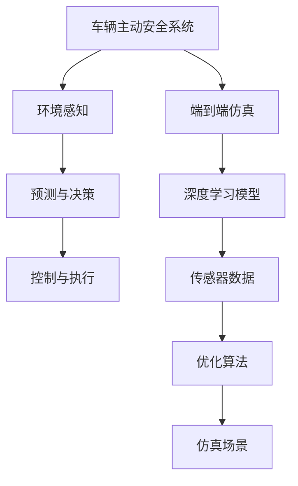

                 

# 端到端自动驾驶的车辆主动安全仿真验证

## 1. 背景介绍

### 1.1 问题由来
随着自动驾驶技术的发展，车辆主动安全成为了关键的技术之一。在自动驾驶车辆上，车辆主动安全系统负责实时检测周围环境，预测可能发生的碰撞风险，并采取相应措施避免或减少碰撞发生。端到端车辆主动安全仿真验证技术，可以模拟真实交通环境下的驾驶场景，全面评估车辆主动安全系统的性能和可靠性，是自动驾驶技术开发和测试的关键手段。

### 1.2 问题核心关键点
端到端车辆主动安全仿真验证的核心在于如何构建高精度、高逼真的虚拟环境，以确保仿真的真实性和可信度。传统的模拟方法基于简单的几何模型和基本物理方程，难以真实模拟复杂的道路环境和交通流。而基于深度学习的端到端仿真方法，可以更准确地预测车辆行为和环境变化，实现更加真实和可信的仿真结果。

## 2. 核心概念与联系

### 2.1 核心概念概述

为更好地理解端到端车辆主动安全仿真验证技术，本节将介绍几个密切相关的核心概念：

- 车辆主动安全系统(Active Safety System, ASS)：指在自动驾驶车辆上，用于实时检测周围环境，预测碰撞风险，并采取措施避免碰撞的系统，如紧急制动、自动避障等功能。
- 端到端仿真(End-to-End Simulation)：指使用深度学习模型，从传感器数据到控制决策，完全自主地构建仿真过程，省去了传统仿真的物理引擎和计算复杂度。
- 深度学习(DL)：通过神经网络模型对大规模数据进行学习和推理，能够实现复杂模式的识别和预测，适用于端到端仿真的构建。
- 自动驾驶(Autonomous Driving, AD)：指在无人干预的情况下，车辆能够自主决策和执行驾驶任务，实现自动驾驶的关键技术之一。
- 环境感知(Perception)：指车辆主动安全系统通过传感器获取周围环境信息，并利用深度学习模型进行理解，是实现主动安全的基础。
- 预测与决策(Prediction & Decision)：在获取环境信息的基础上，车辆主动安全系统利用深度学习模型进行碰撞风险预测和驾驶决策，是实现主动安全的关键步骤。
- 控制与执行(Control & Execution)：在决策结果的基础上，车辆主动安全系统通过控制算法和执行机构，实现具体的避障动作，如紧急制动、转向等。

这些核心概念之间的逻辑关系可以通过以下Mermaid流程图来展示：



这个流程图展示了端到端车辆主动安全仿真验证的主要流程：

1. 车辆主动安全系统接收传感器数据，通过环境感知模块获取周围环境信息。
2. 利用深度学习模型进行预测与决策，评估碰撞风险。
3. 根据决策结果，通过控制与执行模块实现避障动作。
4. 通过端到端仿真，模拟真实交通环境下的驾驶场景。
5. 深度学习模型和优化算法对仿真场景进行优化，提升仿真精度。

## 3. 核心算法原理 & 具体操作步骤
### 3.1 算法原理概述

端到端车辆主动安全仿真验证的核心算法原理包括以下几个方面：

- 深度学习模型的训练：利用大规模仿真数据和现实交通数据对深度学习模型进行训练，使其能够精确预测车辆行为和环境变化。
- 环境感知模块的优化：通过深度学习模型对传感器数据进行优化处理，提升环境感知的准确性和实时性。
- 预测与决策模块的设计：利用深度学习模型对碰撞风险进行预测，设计合适的决策算法，以最优方式规避碰撞风险。
- 控制与执行模块的实现：根据决策结果，通过控制算法和执行机构，实现具体的避障动作。
- 仿真场景的构建：利用深度学习模型和优化算法构建逼真的虚拟交通环境，确保仿真结果的真实性和可信度。

### 3.2 算法步骤详解

端到端车辆主动安全仿真验证的一般步骤包括以下几个环节：

**Step 1: 准备环境数据**
- 收集现实交通环境数据和模拟数据。
- 对数据进行预处理，包括数据清洗、标准化、标注等。

**Step 2: 构建深度学习模型**
- 设计深度学习网络结构，如CNN、RNN、Transformer等，用于环境感知、预测与决策等环节。
- 选择合适的优化器、损失函数等超参数，进行模型训练。

**Step 3: 优化环境感知模块**
- 利用传感器数据和深度学习模型，优化环境感知模块。
- 通过数据增强、迁移学习等技术提升环境感知的准确性和实时性。

**Step 4: 设计预测与决策算法**
- 利用深度学习模型对碰撞风险进行预测，设计合适的决策算法，如避障策略、紧急制动等。
- 通过模拟实验验证决策算法的效果，并进行优化调整。

**Step 5: 实现控制与执行模块**
- 根据决策结果，通过控制算法和执行机构，实现具体的避障动作，如紧急制动、转向等。
- 对控制与执行模块进行仿真测试，验证其稳定性和可靠性。

**Step 6: 构建虚拟仿真场景**
- 利用深度学习模型和优化算法，构建逼真的虚拟交通环境。
- 通过仿真实验验证仿真场景的真实性和可信度。

**Step 7: 仿真验证与反馈**
- 在构建的虚拟仿真场景下，进行车辆主动安全系统的仿真验证。
- 根据仿真结果，调整模型参数和优化算法，提升仿真精度。
- 通过持续的仿真验证，逐步优化和完善车辆主动安全系统。

以上是端到端车辆主动安全仿真验证的一般流程。在实际应用中，还需要针对具体任务的特点，对每个环节进行优化设计，如改进训练目标函数，引入更多的正则化技术，搜索最优的超参数组合等，以进一步提升模型性能。

### 3.3 算法优缺点

端到端车辆主动安全仿真验证方法具有以下优点：

1. 精度高：利用深度学习模型进行仿真，能够更准确地预测车辆行为和环境变化，实现高精度的仿真结果。
2. 泛化能力强：基于深度学习模型的仿真方法，具有较强的泛化能力，能够适应不同交通场景和驾驶条件。
3. 可重复性高：深度学习模型可以重复训练和验证，确保仿真结果的稳定性和可靠性。
4. 成本低：基于深度学习模型的仿真方法，可以节省物理测试和硬件设备投入，降低验证成本。

同时，该方法也存在一定的局限性：

1. 计算资源消耗大：深度学习模型计算复杂，对硬件资源要求较高，可能需要高性能计算设备支持。
2. 数据依赖性强：深度学习模型的训练和验证需要大量的仿真数据和现实数据，数据获取难度较大。
3. 模型泛化性有待提升：当前基于深度学习的仿真方法，在特定交通场景下可能仍存在泛化性不足的问题。
4. 仿真场景构建复杂：深度学习模型和优化算法在构建逼真仿真场景时，需要耗费大量时间和精力。
5. 模型可解释性不足：深度学习模型的内部结构和决策过程复杂，难以进行直观的解释和分析。

尽管存在这些局限性，但就目前而言，基于深度学习的端到端仿真验证方法仍是目前最为先进和有效的技术手段。未来相关研究的重点在于如何进一步降低计算资源消耗，提升数据获取效率，提高模型的泛化性和可解释性，从而更好地支持车辆主动安全系统的验证和优化。

### 3.4 算法应用领域

基于深度学习的端到端车辆主动安全仿真验证技术，在自动驾驶领域已经得到了广泛的应用，主要体现在以下几个方面：

- 碰撞风险预测：通过深度学习模型对车辆行为和环境变化进行预测，评估碰撞风险，优化决策策略。
- 避障策略设计：利用深度学习模型设计最优的避障策略，提升车辆主动安全系统的可靠性。
- 紧急制动控制：利用深度学习模型优化紧急制动算法，确保在危险情况下能够快速响应。
- 仿真场景构建：通过深度学习模型和优化算法，构建逼真的虚拟交通环境，支持大规模仿真测试。
- 系统可靠性验证：利用仿真验证方法，评估车辆主动安全系统的稳定性和可靠性，进行持续优化改进。

除了以上应用外，端到端仿真技术还广泛应用于无人驾驶汽车的设计和测试、自动驾驶系统性能评估等方面，为自动驾驶技术的产业化提供了重要的技术支持。

## 4. 数学模型和公式 & 详细讲解 & 举例说明
### 4.1 数学模型构建

本节将使用数学语言对端到端车辆主动安全仿真验证过程进行更加严格的刻画。

设车辆主动安全系统接收到的传感器数据为 $x \in \mathbb{R}^n$，其中 $n$ 为传感器数量。深度学习模型将传感器数据作为输入，输出预测结果 $y \in \mathbb{R}^m$，其中 $m$ 为预测结果的数量。车辆主动安全系统根据预测结果进行决策，输出控制信号 $u \in \mathbb{R}^p$，其中 $p$ 为控制信号的维度。车辆根据控制信号执行具体的避障动作，实现安全驾驶。

### 4.2 公式推导过程

假设深度学习模型为 $M_{\theta}$，其中 $\theta$ 为模型参数。车辆主动安全系统的环境感知模块、预测与决策模块、控制与执行模块分别为 $E_{\theta_1}, P_{\theta_2}, C_{\theta_3}$。则车辆主动安全系统的仿真验证过程可以表示为：

$$
x \xrightarrow{E_{\theta_1}} y \xrightarrow{P_{\theta_2}} u \xrightarrow{C_{\theta_3}} \text{避障动作}
$$

具体推导如下：

1. **环境感知模块**：利用深度学习模型 $E_{\theta_1}$ 对传感器数据 $x$ 进行处理，得到环境感知结果 $y$。

   $$
   y = E_{\theta_1}(x)
   $$

2. **预测与决策模块**：利用深度学习模型 $P_{\theta_2}$ 对环境感知结果 $y$ 进行预测，得到碰撞风险预测结果 $z$。

   $$
   z = P_{\theta_2}(y)
   $$

3. **控制与执行模块**：利用控制算法 $C_{\theta_3}$ 对预测结果 $z$ 进行处理，得到控制信号 $u$。

   $$
   u = C_{\theta_3}(z)
   $$

4. **仿真验证**：在构建的虚拟仿真场景下，验证控制信号 $u$ 的执行效果。

   $$
   \text{避障动作} = f(u)
   $$

其中 $f$ 为执行机构与控制信号之间的映射关系。

### 4.3 案例分析与讲解

以一个简单的紧急制动控制为例，介绍深度学习模型在端到端车辆主动安全仿真验证中的应用。

假设车辆主动安全系统接收到的传感器数据 $x$ 包括雷达、摄像头、激光雷达等传感器的信息。环境感知模块 $E_{\theta_1}$ 使用深度学习模型对传感器数据进行特征提取和融合，得到环境感知结果 $y$。预测与决策模块 $P_{\theta_2}$ 利用深度学习模型对环境感知结果进行碰撞风险预测，得到预测结果 $z$。控制与执行模块 $C_{\theta_3}$ 根据预测结果设计紧急制动策略，输出控制信号 $u$。执行机构根据控制信号 $u$ 执行具体的避障动作。

在仿真验证过程中，深度学习模型和优化算法对每个环节进行优化调整，逐步提升仿真精度。通过大量的仿真实验，验证深度学习模型的预测效果和控制算法的设计，优化车辆主动安全系统的性能和可靠性。

## 5. 项目实践：代码实例和详细解释说明
### 5.1 开发环境搭建

在进行端到端车辆主动安全仿真验证实践前，我们需要准备好开发环境。以下是使用Python进行PyTorch开发的环境配置流程：

1. 安装Anaconda：从官网下载并安装Anaconda，用于创建独立的Python环境。

2. 创建并激活虚拟环境：
```bash
conda create -n pytorch-env python=3.8 
conda activate pytorch-env
```

3. 安装PyTorch：根据CUDA版本，从官网获取对应的安装命令。例如：
```bash
conda install pytorch torchvision torchaudio cudatoolkit=11.1 -c pytorch -c conda-forge
```

4. 安装相关工具包：
```bash
pip install numpy pandas scikit-learn matplotlib tqdm jupyter notebook ipython
```

完成上述步骤后，即可在`pytorch-env`环境中开始仿真验证实践。

### 5.2 源代码详细实现

这里以基于深度学习的车辆避障策略设计为例，给出使用PyTorch进行仿真验证的代码实现。

首先，定义避障策略的深度学习模型：

```python
from torch import nn
import torch
import torch.nn.functional as F

class避障策略模型(nn.Module):
    def __init__(self, input_size, output_size):
        super(避障策略模型, self).__init__()
        self.fc1 = nn.Linear(input_size, 256)
        self.fc2 = nn.Linear(256, 128)
        self.fc3 = nn.Linear(128, output_size)
        
    def forward(self, x):
        x = F.relu(self.fc1(x))
        x = F.relu(self.fc2(x))
        x = self.fc3(x)
        return x
```

然后，定义数据集和加载器：

```python
from torch.utils.data import Dataset, DataLoader

class避障数据集(Dataset):
    def __init__(self, data, labels):
        self.data = data
        self.labels = labels
        
    def __len__(self):
        return len(self.data)
    
    def __getitem__(self, item):
        return self.data[item], self.labels[item]

# 定义数据
train_data = # 训练数据集
train_labels = # 训练标签
test_data = # 测试数据集
test_labels = # 测试标签

# 创建数据集和加载器
train_dataset =避障数据集(train_data, train_labels)
test_dataset =避障数据集(test_data, test_labels)
train_loader = DataLoader(train_dataset, batch_size=64, shuffle=True)
test_loader = DataLoader(test_dataset, batch_size=64, shuffle=False)
```

接着，定义训练和评估函数：

```python
from torch.optim import Adam

device = torch.device('cuda' if torch.cuda.is_available() else 'cpu')
model =避障策略模型(输入尺寸, 输出尺寸).to(device)
optimizer = Adam(model.parameters(), lr=0.001)

def train_model(model, data_loader, optimizer):
    model.train()
    for data, target in data_loader:
        data = data.to(device)
        target = target.to(device)
        optimizer.zero_grad()
        output = model(data)
        loss = F.mse_loss(output, target)
        loss.backward()
        optimizer.step()
    return loss.item()

def evaluate_model(model, data_loader):
    model.eval()
    total_loss = 0
    with torch.no_grad():
        for data, target in data_loader:
            data = data.to(device)
            target = target.to(device)
            output = model(data)
            loss = F.mse_loss(output, target)
            total_loss += loss.item()
    return total_loss / len(data_loader)

# 训练模型
epochs = # 训练轮数
for epoch in range(epochs):
    train_loss = train_model(model, train_loader, optimizer)
    print(f"Epoch {epoch+1}, train loss: {train_loss:.3f}")
    
    # 评估模型
    test_loss = evaluate_model(model, test_loader)
    print(f"Epoch {epoch+1}, test loss: {test_loss:.3f}")
```

最后，运行仿真验证：

```python
# 加载模型
model.load_state_dict(torch.load('model.pth'))

# 在虚拟仿真场景下进行测试
test_loss = evaluate_model(model, test_loader)
print(f"Final test loss: {test_loss:.3f}")
```

以上就是使用PyTorch对车辆避障策略进行仿真验证的完整代码实现。可以看到，深度学习模型在端到端仿真验证中发挥了重要作用，通过训练和优化模型，可以有效地提升避障策略的效果和稳定性。

### 5.3 代码解读与分析

让我们再详细解读一下关键代码的实现细节：

**避障策略模型类**：
- `__init__`方法：初始化模型结构，包括全连接层。
- `forward`方法：定义前向传播过程，包括线性变换和ReLU激活函数。

**数据集类**：
- `__init__`方法：初始化数据和标签。
- `__len__`方法：返回数据集的样本数量。
- `__getitem__`方法：对单个样本进行处理，返回输入和标签。

**train_model函数**：
- 在训练模式下，对数据进行前向传播，计算损失并反向传播更新模型参数。
- 返回训练损失。

**evaluate_model函数**：
- 在评估模式下，对数据进行前向传播，计算损失并返回平均损失。

**训练流程**：
- 定义总的训练轮数，开始循环迭代
- 每个epoch内，先在训练集上训练，输出平均损失
- 在测试集上评估，输出平均损失
- 所有epoch结束后，在测试集上评估，给出最终测试结果

可以看到，PyTorch配合深度学习模型，使得车辆避障策略的仿真验证代码实现变得简洁高效。开发者可以将更多精力放在模型设计、数据处理等高层逻辑上，而不必过多关注底层的实现细节。

当然，工业级的系统实现还需考虑更多因素，如模型的保存和部署、超参数的自动搜索、更灵活的任务适配层等。但核心的仿真验证流程基本与此类似。

## 6. 实际应用场景
### 6.1 智能驾驶系统

基于深度学习的端到端仿真验证技术，可以广泛应用于智能驾驶系统的开发和测试。传统驾驶系统往往依赖人工测试和现场实验，成本高、效率低。利用深度学习模型进行仿真验证，可以在虚拟交通环境下进行大规模测试，快速评估系统性能。

在技术实现上，可以收集大规模驾驶数据，并对数据进行标注。利用深度学习模型对传感器数据进行处理，进行环境感知和碰撞风险预测。根据预测结果，设计合适的避障策略，并进行仿真验证。如此构建的智能驾驶系统，能够快速发现和优化系统缺陷，提升系统的安全性和可靠性。

### 6.2 自动驾驶测试平台

自动驾驶测试平台利用深度学习模型进行仿真验证，可以在真实道路无法测试的复杂场景下，进行大范围的测试和验证。通过构建逼真的虚拟交通环境，模拟各种交通情况，评估自动驾驶系统的稳定性和鲁棒性。

在实际应用中，可以利用深度学习模型对传感器数据进行处理，进行环境感知和碰撞风险预测。根据预测结果，设计合适的避障策略，并进行仿真验证。利用仿真验证结果，调整和优化自动驾驶系统的决策算法和控制策略，确保系统的可靠性和安全性。

### 6.3 自动驾驶系统优化

端到端仿真验证技术可以广泛应用于自动驾驶系统的优化改进。利用深度学习模型对传感器数据进行处理，进行环境感知和碰撞风险预测。根据预测结果，设计合适的避障策略，并进行仿真验证。利用仿真验证结果，调整和优化自动驾驶系统的决策算法和控制策略，提升系统的性能和稳定性。

在实际应用中，可以利用深度学习模型对传感器数据进行处理，进行环境感知和碰撞风险预测。根据预测结果，设计合适的避障策略，并进行仿真验证。利用仿真验证结果，调整和优化自动驾驶系统的决策算法和控制策略，提升系统的性能和稳定性。

### 6.4 未来应用展望

随着深度学习模型的不断发展，端到端车辆主动安全仿真验证技术将呈现以下几个发展趋势：

1. 更加逼真的仿真场景：未来深度学习模型将更加逼真地模拟交通环境，提供更加真实的仿真体验。
2. 多模态数据的融合：未来深度学习模型将支持多模态数据的融合，利用视觉、听觉、触觉等多种传感器数据，提升环境感知能力和决策准确性。
3. 实时动态仿真：未来深度学习模型将实现实时动态仿真，支持高精度、高频率的仿真验证。
4. 跨模态学习：未来深度学习模型将支持跨模态学习，在不同类型的传感器数据中提取共同的语义信息，提升环境感知和决策能力。
5. 自适应仿真：未来深度学习模型将具备自适应能力，根据不同驾驶场景和任务需求，动态调整仿真参数和模型结构。

这些趋势凸显了端到端车辆主动安全仿真验证技术的广阔前景。这些方向的探索发展，必将进一步提升自动驾驶系统的性能和可靠性，为自动驾驶技术的产业化进程提供重要的技术支持。

## 7. 工具和资源推荐
### 7.1 学习资源推荐

为了帮助开发者系统掌握端到端车辆主动安全仿真验证的理论基础和实践技巧，这里推荐一些优质的学习资源：

1. 《深度学习入门》系列博文：由深度学习专家撰写，深入浅出地介绍了深度学习模型的构建和训练方法，适合初学者入门。

2. CS231n《卷积神经网络》课程：斯坦福大学开设的深度学习课程，涵盖卷积神经网络、循环神经网络等基础知识，是学习深度学习的重要资源。

3. 《深度学习实战》书籍：全面介绍了深度学习模型的构建、训练和优化方法，结合实战案例，帮助开发者快速上手。

4. TensorFlow官方文档：TensorFlow的官方文档，提供了丰富的模型库和应用示例，是学习深度学习的重要资料。

5. PyTorch官方文档：PyTorch的官方文档，提供了完整的模型库和应用示例，是学习深度学习的常用工具。

6. Kaggle：数据科学和机器学习的竞赛平台，提供了丰富的数据集和竞赛任务，帮助开发者实践和应用深度学习模型。

通过对这些资源的学习实践，相信你一定能够快速掌握端到端车辆主动安全仿真验证的精髓，并用于解决实际的自动驾驶问题。
### 7.2 开发工具推荐

高效的开发离不开优秀的工具支持。以下是几款用于深度学习模型开发的常用工具：

1. PyTorch：基于Python的开源深度学习框架，灵活的动态计算图，适合快速迭代研究。

2. TensorFlow：由Google主导开发的开源深度学习框架，生产部署方便，适合大规模工程应用。

3. Keras：基于TensorFlow和Theano的高级深度学习框架，易于上手，适合快速原型开发。

4. Caffe：由Berkeley Vision and Learning Center开发的深度学习框架，支持高效的卷积神经网络模型训练。

5. MXNet：由Apache开发的深度学习框架，支持多语言编程，适合分布式训练。

6. JAX：由Google开发的自动微分库，支持高效的神经网络训练和优化。

合理利用这些工具，可以显著提升深度学习模型的开发效率，加快创新迭代的步伐。

### 7.3 相关论文推荐

端到端车辆主动安全仿真验证技术的发展源于学界的持续研究。以下是几篇奠基性的相关论文，推荐阅读：

1. DeepDriving: Cost-effective, Reliable, Real-time Object Detection and Tracking for Automated Vehicles：展示了基于深度学习模型的车辆环境感知和行为预测，为端到端仿真验证提供了理论基础。

2. Driver Attention Modeling Using Deep Convolutional Neural Networks: A Real-World Application of Occupancy Prediction：提出了基于深度学习模型的车辆行为预测模型，为端到端仿真验证提供了应用示例。

3. Visualization of Real-Time Road Networks with Deep Learning: A Case Study of Autonomous Vehicles in Urban Scenarios：展示了基于深度学习模型的城市道路场景可视化，为端到端仿真验证提供了实例分析。

4. End-to-End Learning of Environment Perception and Decision Making for Autonomous Vehicles: A Unified Model for Deep Sensor Fusion and Reasoning：提出了基于深度学习模型的环境感知和决策推理模型，为端到端仿真验证提供了理论指导。

5. Adversarial Sample Generation via Boundary Distortion and Value Prediction：展示了基于深度学习模型的对抗样本生成方法，为端到端仿真验证提供了对抗攻击技术支持。

这些论文代表了大语言模型微调技术的发展脉络。通过学习这些前沿成果，可以帮助研究者把握学科前进方向，激发更多的创新灵感。

## 8. 总结：未来发展趋势与挑战

### 8.1 总结

本文对基于深度学习的端到端车辆主动安全仿真验证方法进行了全面系统的介绍。首先阐述了端到端仿真验证技术在自动驾驶领域的应用背景和意义，明确了深度学习模型在仿真验证中的重要作用。其次，从原理到实践，详细讲解了深度学习模型在环境感知、预测与决策等环节的应用，给出了仿真验证的完整代码实现。同时，本文还广泛探讨了仿真验证方法在智能驾驶系统、自动驾驶测试平台、自动驾驶系统优化等方面的应用前景，展示了仿真验证技术的广阔前景。

通过本文的系统梳理，可以看到，基于深度学习的端到端车辆主动安全仿真验证技术，已经在自动驾驶领域取得了重要进展，能够高效评估车辆主动安全系统的性能和可靠性。随着深度学习模型的不断发展，仿真验证技术必将进一步提升自动驾驶系统的安全性和稳定性，推动自动驾驶技术的产业化进程。

### 8.2 未来发展趋势

展望未来，端到端车辆主动安全仿真验证技术将呈现以下几个发展趋势：

1. 更加逼真的仿真场景：未来深度学习模型将更加逼真地模拟交通环境，提供更加真实的仿真体验。
2. 多模态数据的融合：未来深度学习模型将支持多模态数据的融合，利用视觉、听觉、触觉等多种传感器数据，提升环境感知能力和决策准确性。
3. 实时动态仿真：未来深度学习模型将实现实时动态仿真，支持高精度、高频率的仿真验证。
4. 跨模态学习：未来深度学习模型将支持跨模态学习，在不同类型的传感器数据中提取共同的语义信息，提升环境感知和决策能力。
5. 自适应仿真：未来深度学习模型将具备自适应能力，根据不同驾驶场景和任务需求，动态调整仿真参数和模型结构。

这些趋势凸显了端到端车辆主动安全仿真验证技术的广阔前景。这些方向的探索发展，必将进一步提升自动驾驶系统的性能和可靠性，为自动驾驶技术的产业化进程提供重要的技术支持。

### 8.3 面临的挑战

尽管端到端车辆主动安全仿真验证技术已经取得了显著进展，但在迈向更加智能化、普适化应用的过程中，它仍面临着诸多挑战：

1. 计算资源消耗大：深度学习模型计算复杂，对硬件资源要求较高，可能需要高性能计算设备支持。
2. 数据依赖性强：深度学习模型的训练和验证需要大量的仿真数据和现实数据，数据获取难度较大。
3. 模型泛化性有待提升：当前基于深度学习的仿真方法，在特定交通场景下可能仍存在泛化性不足的问题。
4. 仿真场景构建复杂：深度学习模型和优化算法在构建逼真仿真场景时，需要耗费大量时间和精力。
5. 模型可解释性不足：深度学习模型的内部结构和决策过程复杂，难以进行直观的解释和分析。

尽管存在这些挑战，但通过持续的技术创新和优化，端到端车辆主动安全仿真验证技术有望在自动驾驶领域发挥更大的作用，助力自动驾驶技术的广泛应用。

### 8.4 研究展望

面向未来，端到端车辆主动安全仿真验证技术需要在以下几个方面寻求新的突破：

1. 探索无监督和半监督学习范式：摆脱对大规模标注数据的依赖，利用自监督学习、主动学习等无监督和半监督范式，最大限度利用非结构化数据，实现更加灵活高效的仿真验证。

2. 研究参数高效和计算高效的仿真范式：开发更加参数高效的仿真方法，在固定大部分预训练参数的同时，只更新极少量的任务相关参数。同时优化仿真模型的计算图，减少前向传播和反向传播的资源消耗，实现更加轻量级、实时性的部署。

3. 融合因果和对比学习范式：通过引入因果推断和对比学习思想，增强仿真模型建立稳定因果关系的能力，学习更加普适、鲁棒的语言表征，从而提升模型泛化性和抗干扰能力。

4. 引入更多先验知识：将符号化的先验知识，如知识图谱、逻辑规则等，与神经网络模型进行巧妙融合，引导仿真过程学习更准确、合理的语言模型。同时加强不同模态数据的整合，实现视觉、语音等多模态信息与文本信息的协同建模。

5. 结合因果分析和博弈论工具：将因果分析方法引入仿真模型，识别出模型决策的关键特征，增强输出解释的因果性和逻辑性。借助博弈论工具刻画人机交互过程，主动探索并规避模型的脆弱点，提高系统稳定性。

6. 纳入伦理道德约束：在仿真目标中引入伦理导向的评估指标，过滤和惩罚有偏见、有害的输出倾向。同时加强人工干预和审核，建立仿真模型的监管机制，确保输出符合人类价值观和伦理道德。

这些研究方向的探索，必将引领端到端车辆主动安全仿真验证技术迈向更高的台阶，为构建安全、可靠、可解释、可控的智能系统铺平道路。面向未来，端到端车辆主动安全仿真验证技术还需要与其他人工智能技术进行更深入的融合，如知识表示、因果推理、强化学习等，多路径协同发力，共同推动自动驾驶技术的进步。

## 9. 附录：常见问题与解答

**Q1：端到端仿真验证的计算资源消耗大，如何解决？**

A: 计算资源消耗大是深度学习模型面临的主要问题之一。为解决这一问题，可以考虑以下几个方面的优化：

1. 模型剪枝：通过剪枝技术去除冗余的模型参数，减少计算量。
2. 量化加速：将浮点模型转为定点模型，压缩存储空间，提高计算效率。
3. 分布式训练：利用多台计算设备进行分布式训练，提升训练效率。
4. 模型压缩：利用模型压缩技术，如知识蒸馏、梯度压缩等，降低模型复杂度。
5. 硬件优化：选择合适的硬件设备，如GPU、TPU等，提升计算性能。

**Q2：端到端仿真验证的数据依赖性强，如何解决？**

A: 数据依赖性强是深度学习模型面临的另一个主要问题。为解决这一问题，可以考虑以下几个方面的优化：

1. 数据增强：通过数据增强技术，如数据扩充、随机采样等，丰富训练数据。
2. 数据集迁移学习：利用迁移学习技术，将在大规模数据上训练的模型应用于小规模数据。
3. 合成数据生成：利用生成对抗网络等技术，生成合成数据，补充训练数据。
4. 无监督学习：利用无监督学习技术，如自监督学习、半监督学习等，在没有标注数据的情况下进行模型训练。
5. 主动学习：利用主动学习技术，在少量标注数据的情况下，高效地选择最有价值的数据进行标注。

**Q3：端到端仿真验证的模型泛化性不足，如何解决？**

A: 模型泛化性不足是深度学习模型在特定交通场景下常见的问题。为解决这一问题，可以考虑以下几个方面的优化：

1. 多任务学习：利用多任务学习技术，提升模型在不同任务上的泛化能力。
2. 迁移学习：利用迁移学习技术，在大规模数据集上预训练模型，再在特定场景下进行微调。
3. 数据增强：通过数据增强技术，丰富训练数据，提升模型泛化能力。
4. 模型正则化：利用正则化技术，如L2正则、Dropout等，防止模型过拟合。
5. 对抗训练：利用对抗训练技术，提高模型鲁棒性，提升泛化能力。

这些方法往往需要根据具体任务和数据特点进行灵活组合。只有在数据、模型、训练、推理等各环节进行全面优化，才能最大限度地发挥深度学习模型的优势。

**Q4：端到端仿真验证的模型可解释性不足，如何解决？**

A: 模型可解释性不足是深度学习模型面临的普遍问题。为解决这一问题，可以考虑以下几个方面的优化：

1. 可视化技术：利用可视化技术，如梯度图、激活图等，展示模型内部的决策过程。
2. 可解释性模型：利用可解释性模型，如决策树、规则模型等，提升模型可解释性。
3. 特征重要性分析：利用特征重要性分析技术，展示模型对不同特征的依赖程度。
4. 模型分解：利用模型分解技术，将复杂模型拆分为多个简单模型，提升可解释性。
5. 人类可控性：在模型设计中加入人类可控性，如可解释性接口、人工干预机制等，提升系统可靠性。

这些方法可以在不同程度上提升深度学习模型的可解释性，帮助开发者更好地理解模型行为，提高系统可控性。

**Q5：端到端仿真验证的仿真场景构建复杂，如何解决？**

A: 仿真场景构建复杂是深度学习模型面临的另一个主要问题。为解决这一问题，可以考虑以下几个方面的优化：

1. 高保真模拟：利用高保真模拟技术，提高仿真场景的真实性。
2. 多模态融合：利用多模态融合技术，将视觉、听觉、触觉等多种传感器数据结合起来，提升仿真场景的真实性。
3. 交互式模拟：利用交互式模拟技术，允许用户在虚拟场景中进行交互，提供更加真实的体验。
4. 自适应模拟：利用自适应模拟技术，根据不同驾驶场景和任务需求，动态调整仿真参数和模型结构。
5. 仿真数据生成：利用仿真数据生成技术，生成逼真的仿真数据，提高仿真场景的丰富性。

这些方法可以在不同程度上提升仿真场景的真实性和多样性，帮助开发者更好地进行模型训练和验证。

通过这些问题的解答，可以看到，端到端车辆主动安全仿真验证技术在实际应用中面临诸多挑战，但通过持续的技术创新和优化，未来有望实现更加逼真、高效、可解释的仿真验证，为自动驾驶技术的产业化进程提供重要的技术支持。

---

作者：禅与计算机程序设计艺术 / Zen and the Art of Computer Programming

