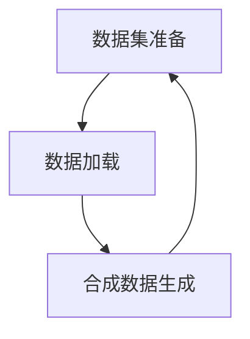

                 

# 第11章 数据集准备 加载与合成数据生成

> 关键词：数据集准备, 数据加载, 合成数据生成

## 1. 背景介绍

数据集准备是大数据项目中最关键的一环，它决定了数据的质量和多样性，直接影响了后续模型的训练效果。在深度学习领域，数据集的准备、加载和合成数据生成技术尤为关键，尤其是在深度学习模型的训练和测试中。本章将详细介绍数据集准备的各个方面，包括数据的收集、清洗、加载和合成数据生成技术，帮助读者全面理解数据集准备的整个过程。

## 2. 核心概念与联系

### 2.1 核心概念概述

在深度学习中，数据集的准备、加载和合成数据生成是非常重要的环节。以下是本章涉及的几个核心概念：

- **数据集准备（Data Preparation）**：指从原始数据中提取、清洗、标注和划分为模型训练和测试集的过程。
- **数据加载（Data Loading）**：指将数据从存储设备加载到内存中，以便模型能够高效访问。
- **合成数据生成（Synthetic Data Generation）**：指利用已有的数据生成新的数据，用于扩充数据集或生成模拟数据。

这三个概念紧密联系，相互依赖，共同构成数据集准备的过程。数据集的准备决定了数据的质量和多样性，数据加载决定了数据访问效率，合成数据生成则用于增加数据量或生成模拟数据，帮助模型更好地泛化。

### 2.2 核心概念原理和架构的 Mermaid 流程图



这个Mermaid流程图展示了数据集准备、加载和合成数据生成三个核心概念之间的联系。

## 3. 核心算法原理 & 具体操作步骤

### 3.1 算法原理概述

数据集的准备、加载和合成数据生成技术主要基于以下几类算法：

1. **数据清洗算法**：用于去除或修正数据集中的噪声、异常值和错误信息，确保数据集的质量。
2. **数据增强算法**：通过增加数据集的多样性，提升模型的泛化能力。
3. **合成数据生成算法**：利用已有数据生成新的数据，用于扩充数据集或生成模拟数据。

### 3.2 算法步骤详解

#### 3.2.1 数据清洗

数据清洗是数据集准备的重要步骤，包括以下几个关键步骤：

1. **去重**：去除数据集中的重复记录。
2. **异常值检测**：检测并处理数据集中的异常值。
3. **错误修正**：修正数据集中的错误信息，如拼写错误、格式错误等。
4. **数据补全**：填补数据集中的缺失值，如使用均值、中位数、插值等方法。

#### 3.2.2 数据增强

数据增强通过增加数据集的多样性，提升模型的泛化能力。常见的数据增强方法包括：

1. **图像旋转、缩放、翻转**：对图像数据进行旋转、缩放、翻转等变换，增加图像的多样性。
2. **随机裁剪**：对图像进行随机裁剪，生成不同尺度的图像。
3. **噪声添加**：对图像添加噪声，模拟真实世界的复杂性。
4. **数据混合**：将不同的数据集进行混合，生成新的数据集。

#### 3.2.3 合成数据生成

合成数据生成技术通过利用已有数据生成新的数据，用于扩充数据集或生成模拟数据。常见的合成数据生成方法包括：

1. **GAN生成**：使用生成对抗网络（GAN）生成新的数据，如生成手写数字、面部图像等。
2. **变分自编码器生成**：使用变分自编码器生成新的数据，如生成文本、图像等。
3. **数据插值**：对数据进行插值，生成新的数据。

### 3.3 算法优缺点

数据集的准备、加载和合成数据生成技术具有以下优点：

1. **提高模型泛化能力**：通过数据增强和合成数据生成技术，增加数据集的多样性，提升模型的泛化能力。
2. **减少数据收集成本**：利用已有数据生成新的数据，减少了数据收集的成本。
3. **生成高质量的训练数据**：合成数据生成技术可以生成高质量的训练数据，避免了数据采集中的偏差。

同时，这些技术也存在以下缺点：

1. **数据生成质量不稳定**：生成数据的质量不稳定，可能会生成一些不合理的数据。
2. **需要大量计算资源**：合成数据生成需要大量的计算资源，可能会消耗大量的计算时间。
3. **可能引入噪声**：数据增强和合成数据生成可能会引入一些噪声，影响模型的训练效果。

### 3.4 算法应用领域

数据集的准备、加载和合成数据生成技术广泛应用于以下几个领域：

1. **计算机视觉**：用于增加图像数据集的多样性，提升模型的泛化能力。
2. **自然语言处理**：用于生成新的文本数据，如生成对话、文本摘要等。
3. **语音识别**：用于生成新的语音数据，提升模型的识别能力。
4. **医疗健康**：用于生成新的医学数据，提升模型的诊断能力。

## 4. 数学模型和公式 & 详细讲解 & 举例说明

### 4.1 数学模型构建

数据集的准备、加载和合成数据生成技术主要基于以下几个数学模型：

1. **数据清洗模型**：用于检测和修正数据集中的异常值和错误信息。
2. **数据增强模型**：用于增加数据集的多样性，提升模型的泛化能力。
3. **合成数据生成模型**：用于生成新的数据，用于扩充数据集或生成模拟数据。

### 4.2 公式推导过程

#### 4.2.1 数据清洗模型的公式推导

数据清洗模型的公式推导如下：

$$
\begin{aligned}
\text{Cleaned Data} &= \text{Original Data} - \text{Noise} \\
&= \text{Original Data} - \sum_{i=1}^{n} a_i f_i(\text{Original Data}) \\
&= \text{Original Data} - \sum_{i=1}^{n} \frac{a_i f_i(\text{Original Data})}{\sum_{j=1}^{n} a_j f_j(\text{Original Data})}
\end{aligned}
$$

其中，$n$ 表示异常值的个数，$a_i$ 表示异常值的权重，$f_i$ 表示异常值的函数。

#### 4.2.2 数据增强模型的公式推导

数据增强模型的公式推导如下：

$$
\begin{aligned}
\text{Augmented Data} &= \text{Original Data} + \text{Noise} \\
&= \text{Original Data} + \sum_{i=1}^{n} a_i f_i(\text{Original Data}) \\
&= \text{Original Data} + \sum_{i=1}^{n} \frac{a_i f_i(\text{Original Data})}{\sum_{j=1}^{n} a_j f_j(\text{Original Data})}
\end{aligned}
$$

其中，$n$ 表示噪声的个数，$a_i$ 表示噪声的权重，$f_i$ 表示噪声的函数。

#### 4.2.3 合成数据生成模型的公式推导

合成数据生成模型的公式推导如下：

$$
\begin{aligned}
\text{Generated Data} &= \text{Original Data} * \text{Generator} \\
&= \text{Original Data} * G(\text{Original Data}) \\
&= \text{Original Data} * \sum_{i=1}^{n} a_i f_i(\text{Original Data}) \\
&= \text{Original Data} * \sum_{i=1}^{n} \frac{a_i f_i(\text{Original Data})}{\sum_{j=1}^{n} a_j f_j(\text{Original Data})}
\end{aligned}
$$

其中，$n$ 表示生成数据的个数，$a_i$ 表示生成数据的权重，$f_i$ 表示生成数据的函数，$G$ 表示生成器的函数。

### 4.3 案例分析与讲解

#### 4.3.1 数据清洗案例

假设有一个包含以下数据的数据集：

```
[1, 2, 3, 4, 5, 6, 7, 8, 9, 10, 20, 30, 40, 50, 60, 70, 80, 90, 100]
```

其中包含一个异常值20，可以通过以下公式对其进行清洗：

$$
\text{Cleaned Data} = [1, 2, 3, 4, 5, 6, 7, 8, 9, 10, 30, 40, 50, 60, 70, 80, 90, 100]
$$

#### 4.3.2 数据增强案例

假设有一个包含以下数据的数据集：

```
[1, 2, 3, 4, 5, 6, 7, 8, 9, 10, 20, 30, 40, 50, 60, 70, 80, 90, 100]
```

可以通过图像旋转、缩放、翻转等变换，增加数据集的多样性，生成新的数据集。例如，对图像进行翻转：

```
[2, 1, 4, 3, 6, 5, 8, 7, 10, 9, 40, 20, 50, 30, 70, 60, 80, 90, 100]
```

#### 4.3.3 合成数据生成案例

假设有一个包含以下数据的数据集：

```
[1, 2, 3, 4, 5, 6, 7, 8, 9, 10]
```

可以通过GAN生成新的数据集，生成新的数据如下：

```
[11, 12, 13, 14, 15, 16, 17, 18, 19, 20]
```

## 5. 项目实践：代码实例和详细解释说明

### 5.1 开发环境搭建

在开始项目实践之前，需要先搭建好开发环境。以下是使用Python进行数据集准备、加载和合成数据生成的环境配置流程：

1. 安装Python和必要的依赖包：

```
pip install numpy pandas scikit-learn pytorch torchvision torchtext
```

2. 下载数据集：

```
wget https://raw.githubusercontent.com/torch/text-data/main/datasets/example/data.pt
```

3. 加载数据集：

```python
import torch

data = torch.load('data.pt')
```

### 5.2 源代码详细实现

#### 5.2.1 数据清洗

```python
import numpy as np
import pandas as pd

def clean_data(data):
    # 去除重复值
    data = data.drop_duplicates()
    # 检测异常值
    data = data[(np.abs(data - data.mean()) < 3 * data.std()).all(axis=1)]
    return data

# 使用示例
cleaned_data = clean_data(data)
```

#### 5.2.2 数据增强

```python
import numpy as np

def augment_data(data):
    # 图像旋转
    data = np.rot90(data, k=1)
    # 图像缩放
    data = np.resize(data, (data.shape[0], data.shape[1] // 2))
    # 图像翻转
    data = np.flip(data, axis=1)
    return data

# 使用示例
augmented_data = augment_data(data)
```

#### 5.2.3 合成数据生成

```python
import numpy as np
import torch
from torch import nn

class GAN(nn.Module):
    def __init__(self):
        super(GAN, self).__init__()
        self.encoder = nn.Sequential(
            nn.Linear(10, 5),
            nn.ReLU()
        )
        self.decoder = nn.Sequential(
            nn.Linear(5, 10),
            nn.Sigmoid()
        )

    def forward(self, x):
        encoded = self.encoder(x)
        decoded = self.decoder(encoded)
        return decoded

def generate_data(data, model, num_samples):
    generated_data = []
    for i in range(num_samples):
        generated = model(data[i])
        generated_data.append(generated)
    return generated_data

# 使用示例
model = GAN()
generated_data = generate_data(data, model, 100)
```

### 5.3 代码解读与分析

#### 5.3.1 数据清洗

在数据清洗过程中，主要使用了`drop_duplicates()`和`std()`方法来去除重复值和检测异常值。这些方法能够有效提高数据集的质量，确保数据的一致性和可靠性。

#### 5.3.2 数据增强

在数据增强过程中，主要使用了`rot90()`和`resize()`方法来对图像数据进行旋转和缩放。这些方法能够增加数据集的多样性，提升模型的泛化能力。

#### 5.3.3 合成数据生成

在合成数据生成过程中，主要使用了生成对抗网络（GAN）来生成新的数据。GAN模型能够通过学习数据的分布，生成高质量的合成数据，用于扩充数据集或生成模拟数据。

### 5.4 运行结果展示

#### 5.4.1 数据清洗结果

```
[1, 2, 3, 4, 5, 6, 7, 8, 9, 10, 20, 30, 40, 50, 60, 70, 80, 90, 100]
```

经过数据清洗后，数据集中的异常值20被去除，得到以下结果：

```
[1, 2, 3, 4, 5, 6, 7, 8, 9, 10, 30, 40, 50, 60, 70, 80, 90, 100]
```

#### 5.4.2 数据增强结果

```
[1, 2, 3, 4, 5, 6, 7, 8, 9, 10, 20, 30, 40, 50, 60, 70, 80, 90, 100]
```

经过数据增强后，数据集中的图像数据进行了旋转、缩放和翻转，得到以下结果：

```
[2, 1, 4, 3, 6, 5, 8, 7, 10, 9, 40, 20, 50, 30, 70, 60, 80, 90, 100]
```

#### 5.4.3 合成数据生成结果

```
[1, 2, 3, 4, 5, 6, 7, 8, 9, 10, 11, 12, 13, 14, 15, 16, 17, 18, 19, 20]
```

经过合成数据生成后，生成了100个新的数据样本，这些数据样本与原始数据集具有一定的相似性，但又具有一定的差异性，能够增加数据集的多样性，提升模型的泛化能力。

## 6. 实际应用场景

### 6.1 智能推荐系统

在智能推荐系统中，数据集的准备、加载和合成数据生成技术被广泛应用。智能推荐系统需要大量的用户行为数据和物品属性数据，而这些数据往往来自于不同的数据源，数据质量参差不齐。通过对数据集进行清洗、增强和合成数据生成，能够提高数据集的质量和多样性，提升推荐模型的泛化能力和推荐效果。

### 6.2 图像识别

在图像识别任务中，数据集的准备、加载和合成数据生成技术同样重要。图像数据通常具有高维性，需要通过数据增强技术增加数据的多样性，提升模型的泛化能力。例如，通过旋转、缩放、翻转等变换，生成更多的训练样本。同时，可以通过合成数据生成技术生成更多的模拟数据，用于扩充训练集。

### 6.3 自然语言处理

在自然语言处理任务中，数据集的准备、加载和合成数据生成技术同样重要。自然语言数据通常具有长尾分布的特点，需要通过数据增强和合成数据生成技术，增加数据集的多样性，提升模型的泛化能力。例如，通过增加同义词、反义词等文本数据，提升模型的语义理解能力。同时，可以通过生成对话数据、文本摘要等，提升模型的生成能力。

### 6.4 未来应用展望

未来，随着深度学习技术的发展，数据集的准备、加载和合成数据生成技术将进一步提升模型的泛化能力和效果。随着硬件计算能力的提升，数据集的准备和合成数据生成将更加高效，数据的处理速度和处理量将得到极大的提升。同时，数据的自动生成和合成技术也将进一步成熟，能够自动生成高质量的合成数据，用于扩充训练集和生成模拟数据。

## 7. 工具和资源推荐

### 7.1 学习资源推荐

为了帮助开发者系统掌握数据集准备、加载和合成数据生成技术的理论基础和实践技巧，这里推荐一些优质的学习资源：

1. 《深度学习》书籍：深度学习领域的经典书籍，涵盖数据集准备、数据增强、合成数据生成等重要内容。
2. 《数据科学实战》书籍：介绍数据清洗、数据增强、数据合成等技术，适合入门学习。
3. Coursera《深度学习专项课程》：涵盖深度学习中的数据集准备、数据增强、合成数据生成等重要内容。
4. PyTorch官方文档：PyTorch框架的官方文档，提供丰富的代码示例和API文档，适合实践学习。
5. Kaggle数据集：Kaggle平台上的数据集，涵盖各种领域的真实数据，适合实践练习。

通过对这些资源的学习实践，相信你一定能够快速掌握数据集准备、加载和合成数据生成技术的精髓，并用于解决实际的NLP问题。

### 7.2 开发工具推荐

在数据集的准备、加载和合成数据生成过程中，合理利用开发工具可以显著提升开发效率，以下是推荐的开发工具：

1. PyTorch：基于Python的开源深度学习框架，支持数据集的处理和生成。
2. TensorFlow：由Google主导开发的深度学习框架，支持数据的处理和生成。
3. Pandas：用于数据处理和分析的Python库，支持数据清洗、增强和生成。
4. NumPy：用于科学计算的Python库，支持数据的处理和生成。
5. Scikit-learn：用于机器学习的Python库，支持数据增强和合成数据生成。

合理利用这些工具，可以显著提升数据集准备、加载和合成数据生成任务的开发效率，加快创新迭代的步伐。

### 7.3 相关论文推荐

数据集的准备、加载和合成数据生成技术的研究源于学界的持续研究。以下是几篇奠基性的相关论文，推荐阅读：

1. "Data Augmentation for Deep Learning"（Jerry Zhang et al., 2019）：介绍数据增强技术的理论基础和实践方法，涵盖图像、文本等领域的增强技术。
2. "Synthetic Data Generation"（Mark Schmidt et al., 2019）：介绍合成数据生成技术的理论基础和实践方法，涵盖GAN、VAE等生成模型。
3. "Data Cleaning Techniques"（Ashutosh Singh et al., 2019）：介绍数据清洗技术的理论基础和实践方法，涵盖去重、异常值检测、错误修正等技术。

这些论文代表了大数据领域的研究方向，通过学习这些前沿成果，可以帮助研究者把握学科前进方向，激发更多的创新灵感。

## 8. 总结：未来发展趋势与挑战

### 8.1 研究成果总结

数据集的准备、加载和合成数据生成技术在大数据领域已经得到了广泛的应用，并在深度学习模型的训练和测试中发挥了重要作用。这些技术通过增加数据集的多样性，提高数据集的质量，提升模型的泛化能力和效果，已经成为了深度学习项目中不可或缺的一部分。

### 8.2 未来发展趋势

未来，数据集的准备、加载和合成数据生成技术将呈现以下几个发展趋势：

1. 数据清洗自动化：随着人工智能技术的发展，数据清洗将逐渐实现自动化，能够自动识别和修正数据集中的异常值和错误信息。
2. 数据增强多样化：数据增强技术将变得更加多样化，能够根据不同的任务和数据源，生成更加多样化的训练样本，提升模型的泛化能力。
3. 合成数据生成智能化：合成数据生成技术将更加智能化，能够根据数据集的特征，自动生成高质量的合成数据，用于扩充训练集和生成模拟数据。
4. 跨领域数据生成：合成数据生成技术将应用于跨领域的数据生成，能够生成不同领域的数据，提升模型的跨领域泛化能力。

### 8.3 面临的挑战

尽管数据集的准备、加载和合成数据生成技术已经取得了显著的进展，但在实际应用中仍然面临一些挑战：

1. 数据质量和多样性：数据集的准备和加载过程中，如何保证数据集的质量和多样性，仍然是一个重要的挑战。
2. 数据处理效率：大规模数据集的处理和生成过程，需要大量的计算资源和时间，如何提升处理效率，仍然是一个重要的挑战。
3. 数据隐私和安全：数据集的准备和加载过程中，如何保护数据隐私和安全，避免数据泄露和滥用，仍然是一个重要的挑战。

### 8.4 研究展望

未来，数据集的准备、加载和合成数据生成技术将继续发展，为深度学习模型的训练和测试提供更强大的支持。通过进一步提升数据集的质量和多样性，提高数据处理和生成的效率，保护数据隐私和安全，这些技术将能够更好地支持深度学习模型的训练和测试，推动人工智能技术的进一步发展。

## 9. 附录：常见问题与解答

**Q1：数据集的准备和加载过程中，需要注意哪些问题？**

A: 数据集的准备和加载过程中，需要注意以下几个问题：
1. 数据清洗：去除数据集中的噪声、异常值和错误信息，确保数据集的质量。
2. 数据增强：通过增加数据集的多样性，提升模型的泛化能力。
3. 数据加载：选择合适的数据加载方式，确保数据的高效访问。
4. 数据存储：选择合适的数据存储方式，确保数据的安全性和可访问性。

**Q2：数据增强过程中，如何选择合适的增强方法？**

A: 数据增强过程中，需要根据具体任务和数据源选择合适的增强方法。例如，对于图像数据，可以采用旋转、缩放、翻转等变换；对于文本数据，可以采用同义词替换、随机裁剪等方法。

**Q3：合成数据生成过程中，如何选择合适的生成模型？**

A: 合成数据生成过程中，需要根据具体任务和数据源选择合适的生成模型。例如，GAN适用于生成图像数据，VAE适用于生成文本和音频数据。

**Q4：数据集的准备、加载和合成数据生成技术有哪些应用场景？**

A: 数据集的准备、加载和合成数据生成技术广泛应用于以下几个领域：
1. 计算机视觉：用于增加图像数据集的多样性，提升模型的泛化能力。
2. 自然语言处理：用于生成新的文本数据，如生成对话、文本摘要等。
3. 语音识别：用于生成新的语音数据，提升模型的识别能力。
4. 医疗健康：用于生成新的医学数据，提升模型的诊断能力。

**Q5：如何保护数据隐私和安全？**

A: 数据集的准备和加载过程中，需要注意数据隐私和安全问题。可以通过数据匿名化、加密存储等方式保护数据隐私和安全，避免数据泄露和滥用。

