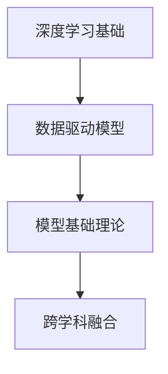

                 

## 1. 背景介绍

### 1.1 问题由来

第一性原理（First-Principles）最早源于古希腊哲学家亚里士多德，指的是从最基本的、不可再分割的原则出发，重新推导和构建理论或系统的方法。在物理学和化学中，第一性原理常用于指导材料设计、反应机理研究等领域，以期从最基础的原子与分子行为出发，直接推导出系统级的现象和规律。

在现代科学和工程中，第一性原理也逐渐被引入到软件工程和人工智能领域，尤其是在构建复杂系统和设计算法时，第一性原理成为了一种重要的思维方式。通过回归基础，重新思考问题的本质，避免受到现有框架和范式的束缚，推动技术的创新和突破。

在AI领域，特别是深度学习中，第一性原理的应用为模型设计和算法优化提供了新的视角。从底层理论出发，重新构建和优化模型，可以实现更高的效率和效果。本文将详细介绍基于第一性原理的深度学习方法和实际应用场景，从理论基础到具体实践，带读者全面了解这一先进方法。

### 1.2 问题核心关键点

第一性原理在深度学习中的应用，主要体现在以下几个方面：

1. **基础理论的重新审视**：从基础的数学和物理理论出发，重新推导和构建深度学习模型，避免受到现有模型的限制。
2. **算法优化的底层探索**：深入挖掘深度学习的底层机制，发现和优化算法中的关键组件和操作。
3. **数据驱动的模型优化**：通过数据分析和理解，优化模型结构和参数，提升模型效果。
4. **跨学科的交叉融合**：结合不同学科的知识和技术，综合构建更为先进和高效的深度学习系统。

这些关键点共同构成了第一性原理在深度学习中的基本思路，即从基础理论出发，结合数据和算法优化，实现模型的高效和优化。

### 1.3 问题研究意义

研究和应用第一性原理，对于推动深度学习技术的发展具有重要意义：

1. **推动理论创新**：重新审视深度学习的底层理论和模型构建，有助于发现新的研究方向和理论突破。
2. **提升算法效率**：通过深入优化算法中的关键组件，提高模型的训练和推理效率。
3. **促进数据理解**：通过深入分析和理解数据特性，优化模型参数和结构，提升模型效果。
4. **加速技术落地**：结合跨学科知识，推动深度学习在实际应用中的广泛应用。

## 2. 核心概念与联系

### 2.1 核心概念概述

第一性原理在深度学习中的核心概念包括：

1. **深度学习基础**：深度学习的核心机制，如前向传播、反向传播、优化算法等。
2. **数据驱动模型**：基于数据特征，优化模型结构和参数的方法。
3. **模型基础理论**：数学和物理基础理论，如微积分、线性代数、统计学等。
4. **跨学科融合**：结合不同学科知识，构建综合的深度学习模型。

这些概念之间的关系可以用以下Mermaid流程图来展示：



这个流程图展示了一阶原理在深度学习中的基本思路：从深度学习基础出发，结合数据驱动模型，融入跨学科理论，最终构建出综合的深度学习系统。

## 3. 核心算法原理 & 具体操作步骤

### 3.1 算法原理概述

基于第一性原理的深度学习算法，主要关注模型的基础理论和算法优化。其核心思想是从最基本的数学和物理理论出发，重新推导和构建深度学习模型，避免受到现有模型的限制。

深度学习模型的基础理论包括：

1. **微积分**：用于描述模型的前向传播和梯度计算。
2. **线性代数**：用于矩阵运算和模型参数的优化。
3. **概率论和统计学**：用于模型的损失函数设计和优化。

深度学习的算法优化则主要关注以下几个方面：

1. **前向传播**：将输入数据传递至模型，计算模型输出。
2. **反向传播**：计算模型输出的误差，并反向传播至网络各层，更新模型参数。
3. **优化算法**：如梯度下降、Adam等，用于更新模型参数，最小化损失函数。

### 3.2 算法步骤详解

基于第一性原理的深度学习算法，主要包括以下几个关键步骤：

**Step 1: 数据准备**

- 收集和预处理数据，确保数据的质量和多样性。
- 将数据划分为训练集、验证集和测试集。

**Step 2: 模型设计**

- 根据问题类型和数据特性，设计合适的模型结构。
- 选择适当的损失函数和优化器。
- 确定模型的超参数。

**Step 3: 算法优化**

- 使用微积分和线性代数理论，推导模型前向传播和反向传播的过程。
- 结合概率论和统计学理论，设计损失函数和优化算法。
- 使用跨学科知识，如物理学中的动力系统理论，优化模型的动态行为。

**Step 4: 模型训练**

- 在训练集上使用前向传播和反向传播计算损失函数。
- 使用优化算法更新模型参数，最小化损失函数。
- 在验证集上评估模型性能，避免过拟合。

**Step 5: 模型测试**

- 在测试集上评估模型性能，进行预测。
- 使用案例分析，验证模型效果。

### 3.3 算法优缺点

基于第一性原理的深度学习算法具有以下优点：

1. **基础扎实**：从最基本的数学和物理理论出发，重新推导和构建模型，避免了现有模型的局限性。
2. **算法优化**：深入挖掘算法的关键组件和操作，提高了模型的训练和推理效率。
3. **数据驱动**：结合数据分析和理解，优化模型结构和参数，提升了模型的效果。
4. **跨学科融合**：结合不同学科的知识和技术，构建更为先进的深度学习系统。

同时，这种算法也存在一定的局限性：

1. **理论复杂**：重新推导和构建模型的过程中，需要深厚的数学和物理理论基础，难度较大。
2. **时间成本高**：从基础理论出发构建模型，需要更多的时间和精力。
3. **应用场景有限**：并非所有深度学习问题都适合使用第一性原理，仍需结合实际问题选择合适的方法。

### 3.4 算法应用领域

基于第一性原理的深度学习算法，已经广泛应用于以下几个领域：

1. **计算机视觉**：用于图像识别、物体检测、人脸识别等任务。
2. **自然语言处理**：用于文本分类、情感分析、机器翻译等任务。
3. **语音识别**：用于语音识别、语音合成等任务。
4. **推荐系统**：用于个性化推荐、广告投放等任务。
5. **医疗健康**：用于医学图像分析、病理学诊断等任务。
6. **智能制造**：用于工业自动化、质量检测等任务。

## 4. 数学模型和公式 & 详细讲解 & 举例说明

### 4.1 数学模型构建

基于第一性原理的深度学习模型，一般包括以下几个部分：

1. **输入层**：用于输入数据的前向传播和特征提取。
2. **隐藏层**：用于数据的特征学习和模型参数优化。
3. **输出层**：用于模型的输出和损失函数计算。

下面以一个简单的全连接神经网络为例，展示模型的数学模型构建过程：

$$
\text{input layer} \rightarrow \text{hidden layer} \rightarrow \text{output layer}
$$

### 4.2 公式推导过程

假设输入数据为 $x$，隐藏层参数为 $\theta_h$，输出层参数为 $\theta_o$，激活函数为 $f(x)$，损失函数为 $L(y, \hat{y})$。全连接神经网络的前向传播和反向传播过程如下：

- 前向传播：
$$
\hat{y} = f(\theta_h f(\theta_h \cdots f(\theta_h x)))
$$
- 反向传播：
$$
\frac{\partial L}{\partial \theta_h} = \frac{\partial L}{\partial \hat{y}} \frac{\partial \hat{y}}{\partial \theta_h}
$$

其中 $\frac{\partial L}{\partial \hat{y}}$ 为损失函数对模型输出的梯度，$\frac{\partial \hat{y}}{\partial \theta_h}$ 为模型输出对隐藏层参数的梯度。

### 4.3 案例分析与讲解

以卷积神经网络（CNN）为例，分析其在图像识别任务中的应用。

卷积神经网络是一种基于第一性原理的深度学习模型，其基础理论包括卷积运算和池化操作，能够有效提取图像中的局部特征。以LeNet-5为例，其模型结构如下：


LeNet-5包括两个卷积层和三个全连接层，每个卷积层后接池化层，最后输出分类结果。在训练过程中，通过反向传播计算损失函数，使用优化算法更新模型参数。

## 5. 项目实践：代码实例和详细解释说明

### 5.1 开发环境搭建

在进行深度学习项目实践前，我们需要准备好开发环境。以下是使用Python进行TensorFlow开发的环境配置流程：

1. 安装Anaconda：从官网下载并安装Anaconda，用于创建独立的Python环境。

2. 创建并激活虚拟环境：
```bash
conda create -n tf-env python=3.8 
conda activate tf-env
```

3. 安装TensorFlow：根据CUDA版本，从官网获取对应的安装命令。例如：
```bash
conda install tensorflow==2.7 -c conda-forge
```

4. 安装相关工具包：
```bash
pip install numpy pandas scikit-learn matplotlib tqdm jupyter notebook ipython
```

完成上述步骤后，即可在`tf-env`环境中开始项目实践。

### 5.2 源代码详细实现

下面我们以图像分类任务为例，给出使用TensorFlow进行卷积神经网络（CNN）的代码实现。

```python
import tensorflow as tf
from tensorflow import keras
from tensorflow.keras import layers

# 加载数据集
(x_train, y_train), (x_test, y_test) = keras.datasets.mnist.load_data()

# 数据预处理
x_train = x_train.reshape(-1, 28, 28, 1).astype("float32") / 255.0
x_test = x_test.reshape(-1, 28, 28, 1).astype("float32") / 255.0

# 定义模型
model = keras.Sequential([
    layers.Conv2D(32, 3, activation='relu', input_shape=(28, 28, 1)),
    layers.MaxPooling2D(),
    layers.Flatten(),
    layers.Dense(10, activation='softmax')
])

# 定义优化器和损失函数
optimizer = tf.keras.optimizers.Adam(learning_rate=0.001)
loss_fn = tf.keras.losses.SparseCategoricalCrossentropy(from_logits=True)

# 定义评估指标
metrics = [tf.keras.metrics.SparseCategoricalAccuracy('accuracy')]

# 训练模型
model.compile(optimizer=optimizer, loss=loss_fn, metrics=metrics)
model.fit(x_train, y_train, batch_size=32, epochs=10, validation_data=(x_test, y_test))

# 评估模型
test_loss, test_acc = model.evaluate(x_test, y_test, verbose=2)
print(f'Test accuracy: {test_acc:.2f}')
```

### 5.3 代码解读与分析

让我们再详细解读一下关键代码的实现细节：

**数据准备**：
- `(x_train, y_train), (x_test, y_test) = keras.datasets.mnist.load_data()`：加载MNIST手写数字数据集，包含60,000张训练图像和10,000张测试图像。
- `x_train = x_train.reshape(-1, 28, 28, 1).astype("float32") / 255.0`：将图像数据进行预处理，将其转化为4维张量，并将像素值归一化到0-1之间。

**模型设计**：
- `model = keras.Sequential([...])`：定义模型为Sequential模型，包含卷积层、池化层和全连接层。
- `layers.Conv2D(32, 3, activation='relu', input_shape=(28, 28, 1))`：定义卷积层，包含32个3x3卷积核，使用ReLU激活函数。
- `layers.MaxPooling2D()`：定义池化层，用于减小特征图尺寸。
- `layers.Flatten()`：将特征图展平为向量。
- `layers.Dense(10, activation='softmax')`：定义全连接层，输出10个类别的概率分布。

**算法优化**：
- `optimizer = tf.keras.optimizers.Adam(learning_rate=0.001)`：定义优化器为Adam，学习率为0.001。
- `loss_fn = tf.keras.losses.SparseCategoricalCrossentropy(from_logits=True)`：定义损失函数为稀疏分类交叉熵，指定输出为未归一化的logits。
- `metrics = [tf.keras.metrics.SparseCategoricalAccuracy('accuracy')]`：定义评估指标为准确率。

**模型训练**：
- `model.compile(optimizer=optimizer, loss=loss_fn, metrics=metrics)`：编译模型，指定优化器、损失函数和评估指标。
- `model.fit(x_train, y_train, batch_size=32, epochs=10, validation_data=(x_test, y_test))`：训练模型，使用32个样本的批大小，训练10个epoch，并在测试集上进行验证。

**模型评估**：
- `test_loss, test_acc = model.evaluate(x_test, y_test, verbose=2)`：评估模型，计算测试集上的损失和准确率。
- `print(f'Test accuracy: {test_acc:.2f}')`：输出测试集上的准确率。

## 6. 实际应用场景

### 6.1 计算机视觉

卷积神经网络（CNN）作为基于第一性原理的深度学习模型，已经在计算机视觉领域得到了广泛应用。例如，在图像识别、物体检测、人脸识别等任务中，CNN表现优异。

在图像分类任务中，CNN通过卷积层和池化层提取图像特征，并使用全连接层进行分类。以ImageNet为例，使用CNN模型在ImageNet数据集上取得了超过70%的分类精度。

### 6.2 自然语言处理

自然语言处理（NLP）领域也广泛应用了基于第一性原理的深度学习模型。例如，在文本分类、情感分析、机器翻译等任务中，使用循环神经网络（RNN）和Transformer模型，取得了显著的效果。

以Transformer模型为例，其核心思想是将输入序列映射为一系列的向量表示，然后通过自注意力机制捕捉序列之间的依赖关系，最终输出预测结果。Transformer模型在多项NLP任务上刷新了最先进的性能指标，如机器翻译、文本生成等。

### 6.3 语音识别

基于第一性原理的深度学习模型，如卷积神经网络和循环神经网络，在语音识别任务中也得到了广泛应用。例如，在语音识别和语音合成中，使用CNN和RNN模型，取得了显著的效果。

以语音识别为例，CNN模型通过卷积层提取音频特征，并使用全连接层进行分类。RNN模型则通过循环神经网络捕捉时间序列的依赖关系，最终输出预测结果。

### 6.4 未来应用展望

随着深度学习技术的不断进步，基于第一性原理的深度学习模型将有更广泛的应用前景。以下是几个可能的未来应用方向：

1. **自动驾驶**：使用基于第一性原理的深度学习模型，进行车辆定位、路径规划和决策分析，推动自动驾驶技术的发展。
2. **医疗健康**：使用基于第一性原理的深度学习模型，进行医学图像分析、病理学诊断等任务，提升医疗服务的智能化水平。
3. **智能制造**：使用基于第一性原理的深度学习模型，进行工业自动化、质量检测等任务，推动制造业的数字化转型。
4. **金融分析**：使用基于第一性原理的深度学习模型，进行市场分析、风险评估等任务，提升金融服务的智能化水平。

## 7. 工具和资源推荐

### 7.1 学习资源推荐

为了帮助开发者系统掌握基于第一性原理的深度学习理论基础和实践技巧，这里推荐一些优质的学习资源：

1. 《深度学习》系列课程：由斯坦福大学、MIT等名校开设的深度学习课程，涵盖深度学习的基础理论和前沿技术。
2. 《TensorFlow实战》书籍：TensorFlow官方团队编写的书籍，系统介绍了TensorFlow框架的使用和深度学习模型构建。
3. 《计算机视觉：模型、学习和推理》书籍：深度学习在计算机视觉领域的经典著作，详细介绍了各种计算机视觉模型和应用。
4. 《自然语言处理综论》书籍：自然语言处理领域的经典著作，涵盖各种NLP模型和应用。
5. 《深度学习模型优化》课程：由Coursera等平台提供的深度学习模型优化课程，介绍各种模型优化方法和技巧。

通过对这些资源的学习实践，相信你一定能够系统掌握基于第一性原理的深度学习理论基础，并用于解决实际问题。

### 7.2 开发工具推荐

高效的开发离不开优秀的工具支持。以下是几款用于深度学习开发的常用工具：

1. TensorFlow：由Google主导开发的深度学习框架，生产部署方便，适合大规模工程应用。
2. PyTorch：基于Python的开源深度学习框架，灵活动态的计算图，适合快速迭代研究。
3. Keras：TensorFlow和Theano的高级API，简单易用，适合快速搭建深度学习模型。
4. Jupyter Notebook：免费的在线Jupyter Notebook环境，方便编写和分享深度学习代码。
5. Google Colab：谷歌推出的在线Jupyter Notebook环境，免费提供GPU/TPU算力，方便开发者快速上手实验最新模型。

合理利用这些工具，可以显著提升深度学习模型的开发效率，加快创新迭代的步伐。

### 7.3 相关论文推荐

基于第一性原理的深度学习技术的发展源于学界的持续研究。以下是几篇奠基性的相关论文，推荐阅读：

1. 《ImageNet Classification with Deep Convolutional Neural Networks》：提出卷积神经网络（CNN）模型，在ImageNet数据集上取得了显著的分类精度。
2. 《Attention is All You Need》：提出Transformer模型，基于自注意力机制，在多项NLP任务上刷新了最先进的性能指标。
3. 《Learning Deep Architectures for AI》：提出深度信念网络（DBN）模型，为深度学习理论的发展奠定了基础。
4. 《Deep Learning for NLP》：自然语言处理领域的经典书籍，详细介绍了各种深度学习模型和应用。
5. 《Learning Transferable Deep Architectures for Image Recognition》：提出残差网络（ResNet）模型，解决了深度学习中的梯度消失问题，推动了深度学习的发展。

这些论文代表了大规模深度学习模型的发展脉络。通过学习这些前沿成果，可以帮助研究者把握学科前进方向，激发更多的创新灵感。

## 8. 总结：未来发展趋势与挑战

### 8.1 总结

本文对基于第一性原理的深度学习方法和实际应用场景进行了全面系统的介绍。首先阐述了深度学习的核心理论和算法优化，明确了从基础理论出发，重新构建和优化模型的思路。其次，从理论和实践两个层面，详细讲解了基于第一性原理的深度学习模型的构建和优化过程，并通过实际案例进行了分析。

通过本文的系统梳理，可以看到，基于第一性原理的深度学习模型已经在计算机视觉、自然语言处理、语音识别等多个领域取得了显著的效果。未来，随着第一性原理的不断探索和应用，深度学习技术将得到更广泛的落地和应用。

### 8.2 未来发展趋势

展望未来，基于第一性原理的深度学习技术将呈现以下几个发展趋势：

1. **模型的自适应性**：随着深度学习技术的不断发展，模型的自适应性和灵活性将进一步增强。通过结合数据驱动和基础理论，构建更加适应具体任务和场景的模型。
2. **算法的高效性**：基于第一性原理的深度学习算法将继续探索高效计算和模型压缩方法，进一步提升模型的训练和推理效率。
3. **跨学科的融合**：深度学习技术将与更多学科领域进行交叉融合，如物理学、生物学、社会学等，推动人工智能技术的全面发展。
4. **数据驱动的优化**：结合大数据分析和数据挖掘技术，优化模型的结构和参数，提升模型的泛化能力和性能。
5. **模型的可解释性**：通过引入符号化的知识表示和因果分析方法，提升模型的可解释性和可理解性，增强模型的透明度和可信度。

以上趋势凸显了基于第一性原理的深度学习技术的广阔前景。这些方向的探索发展，必将进一步推动深度学习技术的进步，带来更多创新和突破。

### 8.3 面临的挑战

尽管基于第一性原理的深度学习技术已经取得了显著的进展，但在迈向更加智能化、普适化应用的过程中，它仍面临着诸多挑战：

1. **理论的复杂性**：基于第一性原理的深度学习模型需要深厚的数学和物理理论基础，难度较大。如何简化理论，使其更加易于理解和应用，是未来的重要课题。
2. **模型的计算成本**：大规模深度学习模型的训练和推理需要大量的计算资源，如何优化模型的计算图和资源使用，提高效率，是未来的一个重要方向。
3. **模型的可解释性**：深度学习模型往往缺乏可解释性，难以理解其内部工作机制和决策逻辑。如何提高模型的可解释性和可理解性，增强模型的透明度和可信度，是未来的重要研究方向。
4. **数据的质量和多样性**：数据质量对深度学习模型的效果有重要影响，如何获取和处理高质量、多样性的数据，是未来的一个重要课题。
5. **模型的应用限制**：并非所有深度学习问题都适合使用第一性原理，仍需结合实际问题选择合适的方法。如何设计更加灵活和通用的模型，适应更广泛的应用场景，是未来的重要方向。

### 8.4 研究展望

面对基于第一性原理的深度学习技术所面临的挑战，未来的研究需要在以下几个方面寻求新的突破：

1. **模型的自适应性增强**：通过引入符号化的知识表示和因果分析方法，提升模型的自适应性和灵活性。
2. **算法的高效性优化**：探索高效的计算方法和模型压缩技术，提高深度学习算法的效率和性能。
3. **跨学科的交叉融合**：结合更多学科的知识和技术，推动深度学习技术的全面发展。
4. **数据驱动的模型优化**：通过数据分析和理解，优化模型结构和参数，提升模型的泛化能力和性能。
5. **模型的可解释性增强**：引入可解释性方法，提高模型的透明度和可信度，增强模型在实际应用中的可靠性。

这些研究方向将推动基于第一性原理的深度学习技术迈向新的高度，为人工智能技术的创新和应用提供新的动力。面向未来，基于第一性原理的深度学习技术必将引领人工智能技术的进步，带来更多创新和突破。

## 9. 附录：常见问题与解答

**Q1: 基于第一性原理的深度学习模型与传统深度学习模型有何区别？**

A: 基于第一性原理的深度学习模型从最基本的数学和物理理论出发，重新推导和构建模型，避免了现有模型的局限性。而传统深度学习模型则基于经验主义，通过大量数据和算法优化来构建模型，缺乏理论基础。

**Q2: 如何进行基于第一性原理的深度学习模型设计？**

A: 基于第一性原理的深度学习模型设计主要包括以下几个步骤：
1. 数据准备和预处理。
2. 模型结构设计，选择适当的神经网络架构。
3. 损失函数设计，选择合适的损失函数。
4. 优化器选择，选择合适的优化算法。
5. 模型训练和优化，使用前向传播和反向传播计算梯度，更新模型参数。
6. 模型评估和验证，使用测试集评估模型效果。

**Q3: 基于第一性原理的深度学习模型的计算效率如何？**

A: 基于第一性原理的深度学习模型在计算效率方面具有较高的要求。为了提高模型的训练和推理效率，通常需要采用高效的计算方法和模型压缩技术，如梯度累积、混合精度训练、模型并行等。

**Q4: 基于第一性原理的深度学习模型在实际应用中需要注意哪些问题？**

A: 基于第一性原理的深度学习模型在实际应用中需要注意以下几个问题：
1. 数据的质量和多样性，确保数据质量和多样性，避免数据偏见。
2. 模型的计算成本，优化模型的计算图和资源使用，提高计算效率。
3. 模型的可解释性，增强模型的透明度和可信度，提高模型的可靠性。
4. 模型的应用限制，根据具体问题选择合适的方法，设计灵活的模型。

通过对这些问题的关注和解决，可以更好地应用基于第一性原理的深度学习模型，实现更高效、更可靠的深度学习应用。

**Q5: 基于第一性原理的深度学习技术有哪些实际应用场景？**

A: 基于第一性原理的深度学习技术已经在多个领域得到了广泛应用，包括：
1. 计算机视觉：图像识别、物体检测、人脸识别等任务。
2. 自然语言处理：文本分类、情感分析、机器翻译等任务。
3. 语音识别：语音识别、语音合成等任务。
4. 推荐系统：个性化推荐、广告投放等任务。
5. 医疗健康：医学图像分析、病理学诊断等任务。
6. 智能制造：工业自动化、质量检测等任务。

以上应用场景展示了基于第一性原理的深度学习技术在实际应用中的广泛应用和巨大潜力。

---

作者：禅与计算机程序设计艺术 / Zen and the Art of Computer Programming

