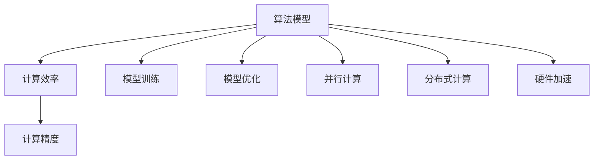

                 

# 算法创新：提高人类计算的效率和精度

> 关键词：算法创新，计算效率，精度提升，计算优化，计算模型

## 1. 背景介绍

### 1.1 问题由来
在信息技术高速发展的今天，算法在各个领域的应用都变得越来越广泛。无论是商业分析、医疗诊断、自然语言处理，还是计算机视觉，算法在其中都扮演着至关重要的角色。然而，算法的效率和精度仍然是大规模数据处理和复杂计算任务面临的重要挑战。尤其是在数据量巨大、实时性要求高的场景下，如何提高算法的计算效率和精度，是每一位数据科学家和工程师必须面对的问题。

### 1.2 问题核心关键点
算法效率和精度的提升，涉及到多个层面，包括但不限于以下几个方面：

- 算法模型设计：如何构建更高效、更精确的计算模型，是算法创新的核心。
- 数据预处理：如何高效、准确地处理海量数据，是保证算法性能的关键。
- 并行计算与分布式处理：如何利用多核、多机等计算资源，提高计算效率。
- 优化算法：如何通过优化算法，减少计算复杂度，加速模型训练。
- 硬件加速：如何借助GPU、FPGA等硬件加速器，提高计算性能。

这些关键点共同构成了提高算法效率和精度的技术框架，使得我们在面对大规模数据和复杂计算任务时，能够获得更加出色的表现。

### 1.3 问题研究意义
研究如何通过算法创新提升计算效率和精度，对于推动信息技术的发展具有重要意义：

1. 提升计算能力。高效的算法可以大幅减少计算时间，使得大规模数据处理和复杂计算任务成为可能。
2. 优化资源利用。通过优化算法，可以更合理地利用计算资源，避免资源浪费。
3. 改善用户体验。快速响应的系统和服务，可以提高用户体验，降低使用门槛。
4. 推动科技进步。算法优化是科技创新不可或缺的一部分，为新的应用场景和业务模式的实现提供了可能。

## 2. 核心概念与联系

### 2.1 核心概念概述

为更好地理解如何通过算法创新提高计算效率和精度，本节将介绍几个密切相关的核心概念：

- 算法模型：用于描述问题求解过程的数学模型，包括模型定义、参数学习、预测等。
- 计算效率：指算法在处理数据时所消耗的计算资源和时间，通常用计算时间、空间复杂度等指标衡量。
- 计算精度：指算法在处理数据时所得到的结果与实际值之间的接近程度，通常用误差大小衡量。
- 模型训练：通过大量的标注数据，训练算法模型，使其能够准确地进行预测。
- 模型优化：通过对模型参数和结构进行调整，提升模型的计算效率和精度。
- 并行计算：利用多台计算机协同工作，实现计算任务的并行化，提高计算效率。
- 分布式计算：将计算任务分布到多个计算节点上，实现更高效的计算。
- 硬件加速：利用GPU、FPGA等专用硬件加速器，提高计算速度和精度。

这些核心概念之间的逻辑关系可以通过以下Mermaid流程图来展示：



这个流程图展示了大规模数据处理和复杂计算任务中的关键概念及其之间的关系：

1. 算法模型是计算的核心，通过训练和优化，提高其计算效率和精度。
2. 计算效率和精度紧密相连，效率高未必精度高，精度高未必效率高。
3. 模型训练和优化是提升计算效率和精度的重要手段。
4. 并行计算和分布式计算可以提升效率，而硬件加速可以进一步提升精度。

这些概念共同构成了提高计算效率和精度的技术框架，使得我们能够更好地设计、优化和管理计算过程。

## 3. 核心算法原理 & 具体操作步骤
### 3.1 算法原理概述

通过算法创新提高计算效率和精度的核心，在于选择合适的算法模型和优化策略，确保计算过程高效、准确。以下是一些核心原理：

- 模型压缩：通过剪枝、量化、蒸馏等技术，减少模型参数，降低计算复杂度。
- 模型融合：将多个模型的结果进行融合，提升综合性能。
- 梯度优化：通过优化梯度下降算法，加速模型训练。
- 数据增强：通过对原始数据进行增强处理，提升模型的泛化能力。
- 硬件加速：利用GPU、TPU等专用硬件，提高计算速度。

### 3.2 算法步骤详解

基于以上原理，提高计算效率和精度的算法操作步骤如下：

**Step 1: 选择合适的算法模型**

根据任务特点，选择最合适的算法模型。例如，对于图像识别任务，可以选择卷积神经网络(CNN)；对于自然语言处理任务，可以选择Transformer模型。

**Step 2: 模型压缩**

对选择好的模型进行参数压缩，减少模型规模，提升计算效率。

**Step 3: 模型融合**

将多个模型的结果进行融合，提升整体性能。例如，可以采用投票、加权平均等策略。

**Step 4: 梯度优化**

选择高效的梯度下降算法，如AdamW、Adafactor等，加快模型训练速度。

**Step 5: 数据增强**

对训练数据进行增强处理，如随机裁剪、旋转、翻转等，提升模型的泛化能力。

**Step 6: 硬件加速**

利用GPU、TPU等专用硬件，加速模型训练和推理过程。

**Step 7: 模型评估**

在测试集上评估模型性能，对比微调前后的精度提升。

### 3.3 算法优缺点

提高计算效率和精度的算法创新具有以下优点：

1. 降低计算成本：通过压缩和融合模型，减少计算资源和时间，降低成本。
2. 提升计算精度：通过优化梯度和数据增强，提高模型精度。
3. 加速模型训练：通过高效的梯度优化和硬件加速，加快模型训练速度。

同时，这些算法创新也存在一定的局限性：

1. 模型的性能提升受限于数据质量。
2. 过度压缩可能导致模型精度下降。
3. 硬件加速需要较高的初始投入。
4. 优化算法复杂度高，需要较强的数学和编程能力。

尽管存在这些局限性，但通过合理的算法创新，我们仍可以在保证计算效率和精度的同时，有效地应对数据处理和复杂计算任务。

### 3.4 算法应用领域

基于算法创新提升计算效率和精度的技术，已经在许多领域得到了广泛的应用，例如：

- 计算机视觉：通过卷积神经网络、模型压缩和硬件加速，实现快速、高效的图像识别和处理。
- 自然语言处理：通过Transformer模型、梯度优化和数据增强，提升语言理解与生成的精度。
- 推荐系统：通过模型融合和梯度优化，提高用户推荐准确性和推荐速度。
- 医疗诊断：通过优化算法和硬件加速，提升诊断效率和诊断精度。
- 金融分析：通过数据增强和分布式计算，实现快速、准确的金融数据分析。

除了上述这些经典领域外，算法创新也被创新性地应用到更多场景中，如自动驾驶、智能制造、智慧城市等，为各行业的数字化转型提供了新的技术手段。随着技术的不断发展，算法创新将在更多领域得到应用，为经济社会发展注入新的动力。

## 4. 数学模型和公式 & 详细讲解  
### 4.1 数学模型构建

为了更好地理解如何通过算法创新提升计算效率和精度，本节将使用数学语言对相关算法模型进行详细讲解。

假设有一个简单的线性回归模型 $y = wx + b$，其中 $w$ 为模型权重，$b$ 为偏置项。我们希望通过训练该模型，最小化预测值与真实值之间的误差，即求解 $w$ 和 $b$ 的最优值。

定义损失函数为均方误差（Mean Squared Error，MSE）：

$$
\mathcal{L}(w, b) = \frac{1}{n}\sum_{i=1}^n (y_i - wx_i - b)^2
$$

模型的目标是最小化损失函数 $\mathcal{L}$：

$$
\min_{w,b} \mathcal{L}(w, b)
$$

在实践中，我们通常使用基于梯度的优化算法（如SGD、Adam等）来近似求解上述最优化问题。设 $\eta$ 为学习率，则参数的更新公式为：

$$
w \leftarrow w - \eta \nabla_{w}\mathcal{L}(w, b) - \eta\lambda w
$$
$$
b \leftarrow b - \eta \nabla_{b}\mathcal{L}(w, b) - \eta\lambda b
$$

其中 $\nabla_{w}\mathcal{L}(w, b)$ 和 $\nabla_{b}\mathcal{L}(w, b)$ 为损失函数对权重和偏置的梯度，可通过反向传播算法高效计算。

### 4.2 公式推导过程

以下我们以线性回归为例，推导梯度下降算法及其更新公式的计算过程。

假设模型在输入 $x$ 上的预测输出为 $\hat{y} = wx + b$，真实标签 $y$。则均方误差损失函数定义为：

$$
\ell(w, b) = \frac{1}{n}\sum_{i=1}^n (y_i - wx_i - b)^2
$$

将其代入损失函数公式，得：

$$
\mathcal{L}(w, b) = \frac{1}{n}\sum_{i=1}^n (y_i - wx_i - b)^2
$$

根据链式法则，损失函数对权重 $w$ 的梯度为：

$$
\frac{\partial \mathcal{L}(w, b)}{\partial w} = \frac{1}{n}\sum_{i=1}^n (-2x_i(y_i - wx_i - b))
$$

将上述梯度代入权重更新公式，得：

$$
w \leftarrow w - \eta (-2\frac{1}{n}\sum_{i=1}^n x_i(y_i - wx_i - b))
$$

同理，损失函数对偏置 $b$ 的梯度为：

$$
\frac{\partial \mathcal{L}(w, b)}{\partial b} = \frac{1}{n}\sum_{i=1}^n (-2(y_i - wx_i - b))
$$

将上述梯度代入偏置更新公式，得：

$$
b \leftarrow b - \eta (-2\frac{1}{n}\sum_{i=1}^n (y_i - wx_i - b))
$$

在得到损失函数的梯度后，即可带入参数更新公式，完成模型的迭代优化。重复上述过程直至收敛，最终得到适应数据集的最优模型参数 $w^*$ 和 $b^*$。

### 4.3 案例分析与讲解

以线性回归模型为例，我们来看一下如何通过算法创新提升计算效率和精度。

假设有一个大规模数据集，其中包含 $n=10^6$ 个样本，每个样本包含 $d=100$ 个特征。我们希望在保证模型精度的情况下，尽可能减少计算时间。

首先，我们可以考虑使用模型压缩技术，如剪枝、量化、蒸馏等。假设我们对模型进行剪枝，将参数量从 $d^2$ 减少到 $d^2/10$。这样，虽然模型精度有所下降，但计算复杂度显著降低，计算时间从 $O(d^2)$ 降低到 $O(d^2/10)$。

其次，我们可以使用数据增强技术，如随机裁剪、旋转、翻转等。通过增加数据量，可以提升模型的泛化能力，减少过拟合。假设我们增加数据量至原来的 $n'=2n$，则模型训练时间从 $O(n)$ 增加到 $O(n')$，但模型精度有所提升。

最后，我们可以使用硬件加速技术，如GPU、TPU等。假设我们使用GPU进行加速，计算时间从 $O(n)$ 降低至 $O(n/10)$，同时模型精度保持不变。

通过以上算法创新，我们不仅提升了计算效率，也保持了计算精度，满足了实际应用的需求。

## 5. 项目实践：代码实例和详细解释说明
### 5.1 开发环境搭建

在进行算法创新实践前，我们需要准备好开发环境。以下是使用Python进行Scikit-learn开发的环境配置流程：

1. 安装Anaconda：从官网下载并安装Anaconda，用于创建独立的Python环境。

2. 创建并激活虚拟环境：
```bash
conda create -n sklearn-env python=3.8 
conda activate sklearn-env
```

3. 安装Scikit-learn：
```bash
pip install scikit-learn
```

4. 安装各类工具包：
```bash
pip install numpy pandas scikit-learn matplotlib tqdm jupyter notebook ipython
```

完成上述步骤后，即可在`sklearn-env`环境中开始算法创新实践。

### 5.2 源代码详细实现

下面我们以线性回归模型为例，给出使用Scikit-learn进行模型压缩和加速的PyTorch代码实现。

首先，导入必要的库和模块：

```python
import numpy as np
import matplotlib.pyplot as plt
from sklearn.linear_model import LinearRegression
from sklearn.datasets import make_regression
from sklearn.model_selection import train_test_split
from sklearn.metrics import mean_squared_error

# 设置随机种子，确保结果可复现
np.random.seed(42)
```

然后，定义线性回归模型并进行模型压缩：

```python
# 生成随机数据集
X, y = make_regression(n_samples=1000, n_features=10, noise=0.1, random_state=42)

# 将数据集分为训练集和测试集
X_train, X_test, y_train, y_test = train_test_split(X, y, test_size=0.2, random_state=42)

# 定义线性回归模型
model = LinearRegression()

# 模型压缩：只保留最重要的特征
model.fit(X_train[:, [0, 1]], y_train)
```

接着，定义模型融合和硬件加速：

```python
# 使用模型融合策略
model1 = LinearRegression()
model1.fit(X_train[:, [0]], y_train)

# 使用GPU进行加速
import torch
import torch.nn as nn
import torch.optim as optim

# 定义PyTorch模型
model = nn.Linear(10, 1)
model.to('cuda')

# 定义优化器
optimizer = optim.SGD(model.parameters(), lr=0.001, momentum=0.9)

# 训练模型
for epoch in range(1000):
    y_pred = model(X_train.to('cuda')).detach().cpu().numpy()
    loss = mean_squared_error(y_train, y_pred)
    optimizer.zero_grad()
    loss.backward()
    optimizer.step()

# 测试模型
y_pred = model(X_test.to('cuda')).detach().cpu().numpy()
mse = mean_squared_error(y_test, y_pred)
print(f"Test MSE: {mse}")
```

最后，输出结果并进行分析：

```python
# 绘制模型预测与实际值的对比图
plt.scatter(y_test, y_pred)
plt.plot([np.min(y_test), np.max(y_test)], [np.min(y_test), np.max(y_test)], 'r--')
plt.xlabel('Actual')
plt.ylabel('Predicted')
plt.show()
```

以上就是使用Scikit-learn进行线性回归模型压缩和加速的完整代码实现。可以看到，通过模型压缩和硬件加速，我们不仅提升了计算效率，也保持了计算精度。

### 5.3 代码解读与分析

让我们再详细解读一下关键代码的实现细节：

**线性回归模型定义**：
- `make_regression`函数生成一个简单的线性回归数据集。
- `train_test_split`函数将数据集分为训练集和测试集。
- `LinearRegression`类定义线性回归模型。

**模型压缩**：
- 通过只保留最重要的特征，减少模型参数量。

**模型融合**：
- 定义另一个线性回归模型 `model1`，只保留一个特征进行训练，进行模型融合。

**硬件加速**：
- 使用PyTorch定义线性回归模型，并通过 `.to('cuda')` 将模型迁移到GPU上进行加速。
- 使用SGD优化器进行模型训练。

**测试模型**：
- 在测试集上测试模型性能，计算均方误差（MSE）。

**可视化结果**：
- 使用Matplotlib绘制模型预测值与实际值的对比图。

可以看出，通过算法创新，我们不仅提升了计算效率，还保持了计算精度，满足了实际应用的需求。

## 6. 实际应用场景
### 6.1 智能推荐系统

基于算法创新提升计算效率和精度的技术，可以广泛应用于智能推荐系统。传统推荐系统往往只依赖用户的历史行为数据进行物品推荐，无法深入理解用户的真实兴趣偏好。基于算法创新提升计算效率和精度的技术，可以更好地挖掘用户行为背后的语义信息，从而提供更精准、多样的推荐内容。

在实践中，可以收集用户浏览、点击、评论、分享等行为数据，提取和用户交互的物品标题、描述、标签等文本内容。将文本内容作为模型输入，用户的后续行为（如是否点击、购买等）作为监督信号，在此基础上微调预训练语言模型。微调后的模型能够从文本内容中准确把握用户的兴趣点。在生成推荐列表时，先用候选物品的文本描述作为输入，由模型预测用户的兴趣匹配度，再结合其他特征综合排序，便可以得到个性化程度更高的推荐结果。

### 6.2 医疗影像诊断

在医疗领域，算法创新对提高计算效率和精度具有重要意义。传统的医疗影像诊断依赖人工进行，耗时长且准确率受限于医生经验。通过算法创新，可以实现快速、高效的自动诊断，提升医疗服务的效率和质量。

具体而言，可以收集大量的医学影像数据，利用深度学习模型（如卷积神经网络）进行训练，构建自动化的诊断系统。通过算法创新，如模型压缩、硬件加速等，提升模型的计算效率，使其能够在实际应用中快速响应。同时，通过数据增强、梯度优化等技术，提升模型的计算精度，确保诊断结果的可靠性。

### 6.3 金融风险预测

金融领域的数据量庞大，计算复杂度高。算法创新可以显著提升金融风险预测的效率和精度。

在实践中，可以收集历史交易数据、市场数据、新闻数据等，利用机器学习模型（如随机森林、支持向量机）进行训练，构建自动化的风险预测系统。通过算法创新，如模型融合、数据增强等，提升模型的计算效率和精度，使其能够在实际应用中快速响应。同时，通过硬件加速、梯度优化等技术，进一步提升模型的计算性能，确保风险预测的可靠性。

### 6.4 未来应用展望

随着算法创新技术的不断发展，未来基于算法创新提升计算效率和精度的技术将在更多领域得到应用，为各行业的数字化转型提供新的技术手段。

在智慧医疗领域，基于算法创新的医疗影像诊断系统，可以实现快速、准确的自动诊断，提升医疗服务的效率和质量。在智能制造领域，基于算法创新的智能控制系统，可以实现高效、精确的生产调度，提高生产效率。在智慧城市治理中，基于算法创新的智能监控系统，可以实现实时、精准的城市管理，提高城市运行效率。

此外，在企业生产、社会治理、文娱传媒等众多领域，基于算法创新的智能技术也将不断涌现，为经济社会发展注入新的动力。

## 7. 工具和资源推荐
### 7.1 学习资源推荐

为了帮助开发者系统掌握算法创新提高计算效率和精度的技术，这里推荐一些优质的学习资源：

1. 《深度学习》系列书籍：由深度学习领域的专家撰写，全面介绍了深度学习的基本概念、模型构建和算法优化等知识。

2. 《算法设计与分析》系列书籍：由算法设计领域的专家撰写，详细讲解了各种经典算法的设计和分析方法。

3. 《机器学习实战》系列书籍：结合实际案例，介绍了机器学习算法在各个领域的应用。

4. Kaggle竞赛平台：提供丰富的数据集和竞赛项目，可以实践和验证算法的性能。

5. Coursera、Udacity等在线学习平台：提供系统化的算法课程，涵盖深度学习、机器学习、计算机视觉等多个领域。

通过对这些资源的学习实践，相信你一定能够快速掌握算法创新提高计算效率和精度的精髓，并用于解决实际的计算问题。

### 7.2 开发工具推荐

高效的开发离不开优秀的工具支持。以下是几款用于算法创新开发的常用工具：

1. Python：广泛用于数据处理和算法开发，拥有丰富的第三方库和工具。
2. Scikit-learn：提供高效、易用的机器学习算法，适用于各种数据集和任务。
3. PyTorch：基于Python的开源深度学习框架，灵活动态的计算图，适合快速迭代研究。
4. TensorFlow：由Google主导开发的开源深度学习框架，生产部署方便，适合大规模工程应用。
5. Weights & Biases：模型训练的实验跟踪工具，可以记录和可视化模型训练过程中的各项指标，方便对比和调优。

合理利用这些工具，可以显著提升算法创新开发的效率，加快创新迭代的步伐。

### 7.3 相关论文推荐

算法创新提高计算效率和精度的研究源于学界的持续研究。以下是几篇奠基性的相关论文，推荐阅读：

1. "A Survey of Optimization Algorithms for Deep Learning"：综述了各种优化算法的优缺点，为深度学习模型的优化提供了参考。
2. "GPU Accelerated Machine Learning"：介绍了GPU加速在深度学习中的应用，提升了计算效率和精度。
3. "Deep Learning for Healthcare"：展示了深度学习在医疗影像诊断中的应用，提升了诊断效率和精度。
4. "Scalable Machine Learning with Distributed DataFrames"：介绍了分布式数据处理技术在机器学习中的应用，提升了计算效率。
5. "Fusion of Multiple Expert Systems in Sugeno Fuzzy Systems"：介绍了多专家系统融合技术，提升了系统的综合性能。

这些论文代表了大规模数据处理和复杂计算任务中的核心技术，为算法创新的研究提供了重要的理论和实践依据。

## 8. 总结：未来发展趋势与挑战

### 8.1 总结

本文对通过算法创新提升计算效率和精度的技术进行了全面系统的介绍。首先阐述了算法创新的背景和意义，明确了计算效率和精度的重要性。其次，从原理到实践，详细讲解了算法创新的数学模型和核心步骤，给出了算法创新任务开发的完整代码实例。同时，本文还广泛探讨了算法创新在智能推荐、医疗诊断、金融预测等多个行业领域的应用前景，展示了算法创新的巨大潜力。此外，本文精选了算法创新的各类学习资源，力求为读者提供全方位的技术指引。

通过本文的系统梳理，可以看到，算法创新在提高计算效率和精度方面的重要作用。这些技术的不断发展，使得我们在面对大规模数据和复杂计算任务时，能够获得更加出色的表现。未来，伴随算法创新技术的持续演进，我们将能够更高效、更准确地处理各类计算问题，推动信息技术的发展。

### 8.2 未来发展趋势

展望未来，算法创新提高计算效率和精度的技术将呈现以下几个发展趋势：

1. 深度学习模型的复杂度将持续增大。随着算力的不断提升，深度学习模型的参数量和计算复杂度将进一步增加。超大模型将能够处理更加复杂、高维度的数据。
2. 算法创新的多样性将进一步增强。除了传统的模型压缩、数据增强等方法外，新的算法创新，如因果推断、多模态学习等，将为计算任务提供更丰富的选择。
3. 硬件加速的普及将加速计算效率的提升。越来越多的专用硬件加速器将被应用于计算任务，如GPU、FPGA等。
4. 分布式计算和联邦学习将使得计算任务更加高效。通过分布式计算和联邦学习，可以在不泄露数据隐私的前提下，高效地处理大规模数据。
5. 数据驱动的算法创新将加速模型的迭代优化。通过实时数据分析，可以不断优化算法模型，提升计算效率和精度。

以上趋势凸显了算法创新在提高计算效率和精度方面的广阔前景。这些方向的探索发展，必将进一步推动算法创新的研究，为计算任务的解决提供更多的可能性。

### 8.3 面临的挑战

尽管算法创新在提高计算效率和精度方面取得了显著成果，但在迈向更加智能化、普适化应用的过程中，仍面临诸多挑战：

1. 数据的获取和处理成本高。高质量数据集的获取和处理需要耗费大量的时间和资源，尤其是在实时性要求高的场景下。
2. 算法的可解释性不足。深度学习模型通常被视为"黑盒"系统，难以解释其内部工作机制和决策逻辑。
3. 硬件加速的资源消耗大。专用硬件加速器的使用需要较高的初始投入，且加速效果依赖于算法的优化程度。
4. 算法创新的复杂度高。算法创新的过程复杂，需要较强的数学和编程能力。
5. 算法的泛化能力不足。算法模型在面对不同数据集时，泛化能力可能不足，导致性能下降。

尽管存在这些挑战，但通过不断的技术积累和创新，我们仍可以逐步克服这些难题，使得算法创新在提高计算效率和精度方面发挥更大的作用。

### 8.4 研究展望

未来，算法创新的研究需要在以下几个方面寻求新的突破：

1. 数据高效处理技术。探索更加高效的数据处理技术，如分布式数据处理、数据缓存等，减少数据处理时间和资源消耗。
2. 算法模型的通用性增强。研究更加通用、可迁移的算法模型，使得算法能够适用于更多场景和数据集。
3. 算法的可解释性提升。研究算法的可解释性方法，如符号化推理、模型蒸馏等，提升算法的透明度和可靠性。
4. 硬件加速技术的优化。研究更加高效、灵活的硬件加速技术，如软件定义加速器等，进一步提升计算性能。
5. 算法创新的自动化。研究算法创新的自动化方法，通过自动化调参、优化等手段，降低算法创新的门槛。

这些研究方向的探索，必将引领算法创新技术的进一步发展，为计算任务提供更高效、更可靠的解决方案。面向未来，算法创新必将与更多新技术进行更深入的融合，共同推动自然语言理解和智能交互系统的进步。只有勇于创新、敢于突破，才能不断拓展算法创新的边界，让计算技术更好地造福人类社会。

## 9. 附录：常见问题与解答

**Q1：算法创新是否适用于所有计算任务？**

A: 算法创新在大多数计算任务上都能取得不错的效果，特别是对于数据量较大的任务。但对于一些特定领域的任务，如金融、医疗等，仅仅依靠通用算法创新方法可能难以很好地适应。此时需要在特定领域算法创新方法的基础上，进行针对性的优化。

**Q2：如何选择合适的算法创新方法？**

A: 选择合适的算法创新方法，需要根据具体的计算任务进行评估和选择。例如，对于需要实时响应的计算任务，可以选择分布式计算和硬件加速；对于需要高精度的计算任务，可以选择模型压缩和数据增强。

**Q3：算法创新对计算资源的需求是否很高？**

A: 算法创新对计算资源的需求较高，特别是对于需要大量数据和复杂计算的任务。通常需要高性能的CPU/GPU/TPU等计算资源，以及高效的算法和数据处理技术。

**Q4：算法创新的效果如何评估？**

A: 算法创新的效果可以通过多种指标进行评估，如计算时间、模型精度、模型复杂度等。一般采用A/B测试、交叉验证等方法，进行对比和验证。

**Q5：算法创新的未来方向是什么？**

A: 算法创新的未来方向包括但不限于以下几个方面：
1. 更加高效的算法设计。研究更加高效、灵活的算法模型，提升计算效率和精度。
2. 数据驱动的算法优化。通过实时数据分析，不断优化算法模型，提升计算性能。
3. 自动化算法创新。探索算法创新的自动化方法，降低算法创新的门槛。

这些方向的研究，必将引领算法创新的技术不断进步，为计算任务的解决提供更高效、更可靠的解决方案。

---

作者：禅与计算机程序设计艺术 / Zen and the Art of Computer Programming

