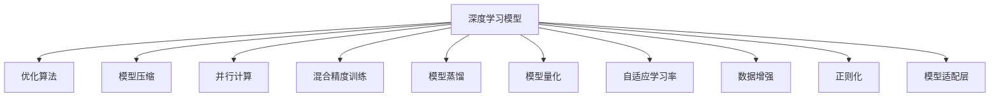

                 

# 算法框架：加速 AI 2.0 模型开发和训练

> 关键词：
- 算法框架
- AI 2.0
- 模型开发
- 模型训练
- 加速优化
- 深度学习
- 并行计算
- 分布式训练
- 高性能计算
- 模型压缩

## 1. 背景介绍

### 1.1 问题由来

随着人工智能技术的迅猛发展，深度学习模型在图像识别、自然语言处理、语音识别等领域取得了显著进展。然而，随着模型规模的不断扩大，训练和推理过程也面临着资源消耗大、计算时间长、优化困难等挑战。为了提升模型的开发和训练效率，算法框架应运而生，成为加速AI 2.0模型开发和训练的重要手段。

### 1.2 问题核心关键点

算法框架的主要目标是通过优化模型结构、加速计算过程、改善训练策略等手段，使深度学习模型的开发和训练更加高效、稳定和可扩展。其核心关键点包括：

- **模型结构优化**：通过剪枝、量化、蒸馏等技术，减小模型参数量，提高计算效率。
- **计算资源调度**：通过分布式计算、并行计算、混合精度训练等手段，充分利用硬件资源，加速计算过程。
- **训练策略改进**：引入自适应学习率、正则化、数据增强等方法，提高训练效果，避免过拟合。
- **应用场景适配**：针对特定应用场景，提供模型适配层，使模型更加通用和适应性强。

### 1.3 问题研究意义

算法框架的提出，对加速AI 2.0模型开发和训练具有重要意义：

- **提升开发效率**：通过自动化的模型构建和调参工具，减少人工调试和调优时间，快速迭代模型。
- **降低成本**：优化模型结构，减小参数量，减少计算资源需求，降低硬件成本。
- **提高模型效果**：改进训练策略，提升模型性能，提高模型的泛化能力和准确度。
- **增强应用灵活性**：通过适配层和扩展接口，使模型能够适应各种应用场景，提高应用价值。

## 2. 核心概念与联系

### 2.1 核心概念概述

为更好地理解算法框架的工作原理和优化方法，本节将介绍几个密切相关的核心概念：

- **深度学习模型**：以神经网络为代表的深度学习模型，通过多层非线性变换，实现对复杂数据的高级抽象和表示。
- **优化算法**：如随机梯度下降、Adam、SGD等，用于最小化损失函数，优化模型参数。
- **模型压缩**：通过剪枝、量化、蒸馏等技术，减小模型参数量，提高计算效率。
- **并行计算**：通过多线程、多节点、分布式计算等手段，加速计算过程。
- **混合精度训练**：通过混合精度表示，减小模型参数的存储空间，提高计算效率。
- **模型蒸馏**：通过教师模型指导学生模型的训练，减小学生模型参数量，提高模型泛化能力。
- **模型量化**：通过将浮点型参数转为定点型，减小模型计算量，提高计算效率。
- **自适应学习率**：如AdaGrad、AdamW等，根据训练进程动态调整学习率，提高训练效果。
- **数据增强**：通过数据扩充、随机变换等手段，提高模型泛化能力。
- **正则化**：如L2正则、Dropout等，防止模型过拟合。
- **模型适配层**：根据特定任务需求，在预训练模型的基础上添加适配层，提高模型性能。

这些核心概念之间的逻辑关系可以通过以下Mermaid流程图来展示：



这个流程图展示了大语言模型的核心概念及其之间的关系：

1. 深度学习模型通过优化算法进行参数优化。
2. 模型压缩、并行计算、混合精度训练、模型蒸馏等技术，优化模型结构和计算效率。
3. 自适应学习率、数据增强、正则化等方法，提高训练效果，避免过拟合。
4. 模型适配层针对特定任务，使模型更加通用和适应性强。

这些概念共同构成了算法框架的设计框架，使其能够在各种场景下发挥强大的优化和提升作用。通过理解这些核心概念，我们可以更好地把握算法框架的工作原理和优化方向。

## 3. 核心算法原理 & 具体操作步骤

### 3.1 算法原理概述

算法框架的主要原理是通过优化算法和结构调整，提升模型的开发和训练效率。其核心思想是：

1. **模型结构优化**：减小模型参数量，提高计算效率。
2. **计算资源调度**：充分利用硬件资源，加速计算过程。
3. **训练策略改进**：优化训练过程，提高模型效果。

### 3.2 算法步骤详解

基于上述原理，算法框架的开发通常包括以下几个关键步骤：

**Step 1: 选择合适的模型架构**
- 根据任务需求，选择适合的深度学习模型架构，如卷积神经网络(CNN)、循环神经网络(RNN)、Transformer等。
- 确定模型的层数、激活函数、卷积核大小等关键参数。

**Step 2: 设计适配层**
- 针对特定任务，设计适配层以优化模型性能。适配层通常包括全连接层、卷积层、池化层、Dropout层等。
- 适配层需满足计算效率和性能需求，设计合理的神经元数量和层数。

**Step 3: 优化算法选择**
- 根据模型特点，选择适合的优化算法，如Adam、SGD等。
- 设置学习率、动量、权重衰减等参数。

**Step 4: 数据增强和正则化**
- 收集标注数据集，进行数据增强，如随机旋转、平移、缩放等，增加训练数据多样性。
- 引入正则化技术，如L2正则、Dropout等，防止模型过拟合。

**Step 5: 训练和评估**
- 使用优化算法，在训练集上进行梯度下降优化，更新模型参数。
- 在验证集上评估模型性能，调整学习率等超参数。
- 重复上述步骤，直至模型收敛。

**Step 6: 模型压缩和优化**
- 使用模型压缩技术，如剪枝、量化、蒸馏等，减小模型参数量，提高计算效率。
- 使用并行计算、分布式训练等技术，加速模型训练过程。

**Step 7: 应用部署和监控**
- 将模型导出为可部署的格式，如TensorFlow SavedModel、PyTorch Script等。
- 部署模型到服务器、移动设备等应用场景中，提供API服务接口。
- 监控模型性能，收集日志，进行性能调优。

### 3.3 算法优缺点

算法框架具有以下优点：
1. **提升开发效率**：自动化的模型构建和调参工具，减少人工调试和调优时间，快速迭代模型。
2. **降低成本**：优化模型结构，减小参数量，减少计算资源需求，降低硬件成本。
3. **提高模型效果**：改进训练策略，提升模型性能，提高模型的泛化能力和准确度。
4. **增强应用灵活性**：通过适配层和扩展接口，使模型能够适应各种应用场景，提高应用价值。

同时，该框架也存在一定的局限性：
1. **依赖工具和平台**：算法框架的有效使用，依赖于特定的深度学习工具和平台，可能存在迁移难度。
2. **调参复杂**：虽然自动调参工具可以提供参考建议，但最终参数调优仍需人工干预。
3. **资源消耗大**：虽然优化算法和结构调整减小了部分资源消耗，但仍可能面临计算资源不足的问题。
4. **模型泛化能力**：过度优化可能导致模型泛化能力下降，无法适应新任务和新数据。

尽管存在这些局限性，但就目前而言，算法框架仍然是加速AI 2.0模型开发和训练的重要手段。未来相关研究的重点在于如何进一步提升框架的灵活性和可扩展性，降低依赖性和调参复杂度，同时兼顾模型泛化能力和资源效率。

### 3.4 算法应用领域

算法框架在深度学习模型开发和训练中的应用广泛，涉及计算机视觉、自然语言处理、语音识别等多个领域。以下是几个典型的应用场景：

1. **计算机视觉**
   - 图像分类：通过优化模型结构和计算效率，提高图像分类的准确度。
   - 目标检测：使用数据增强和正则化技术，提升目标检测的鲁棒性和泛化能力。

2. **自然语言处理**
   - 机器翻译：通过优化模型结构和计算效率，提高翻译速度和准确度。
   - 文本分类：使用自适应学习率和数据增强技术，提升文本分类的效果。

3. **语音识别**
   - 语音转写：使用自适应学习率和数据增强技术，提高语音转写的准确度。
   - 情感分析：通过优化模型结构和计算效率，提高情感分析的精度。

## 4. 数学模型和公式 & 详细讲解  
### 4.1 数学模型构建

本节将使用数学语言对算法框架的开发过程进行更加严格的刻画。

记深度学习模型为 $M_{\theta}$，其中 $\theta$ 为模型参数。假设训练集为 $D=\{(x_i,y_i)\}_{i=1}^N$，其中 $x_i$ 为输入样本，$y_i$ 为标注标签。

定义模型 $M_{\theta}$ 在数据样本 $(x,y)$ 上的损失函数为 $\ell(M_{\theta}(x),y)$，则在数据集 $D$ 上的经验风险为：

$$
\mathcal{L}(\theta) = \frac{1}{N} \sum_{i=1}^N \ell(M_{\theta}(x_i),y_i)
$$

通过梯度下降等优化算法，最小化损失函数 $\mathcal{L}(\theta)$，更新模型参数 $\theta$，最小化损失函数：

$$
\theta \leftarrow \theta - \eta \nabla_{\theta}\mathcal{L}(\theta)
$$

其中 $\eta$ 为学习率，$\nabla_{\theta}\mathcal{L}(\theta)$ 为损失函数对参数 $\theta$ 的梯度。

### 4.2 公式推导过程

以下我们以图像分类任务为例，推导交叉熵损失函数及其梯度的计算公式。

假设模型 $M_{\theta}$ 在输入 $x$ 上的输出为 $\hat{y}=M_{\theta}(x) \in [0,1]$，表示样本属于某个类别的概率。真实标签 $y \in \{1,0\}$。则二分类交叉熵损失函数定义为：

$$
\ell(M_{\theta}(x),y) = -[y\log \hat{y} + (1-y)\log (1-\hat{y})]
$$

将其代入经验风险公式，得：

$$
\mathcal{L}(\theta) = -\frac{1}{N}\sum_{i=1}^N [y_i\log M_{\theta}(x_i)+(1-y_i)\log(1-M_{\theta}(x_i))]
$$

根据链式法则，损失函数对参数 $\theta_k$ 的梯度为：

$$
\frac{\partial \mathcal{L}(\theta)}{\partial \theta_k} = -\frac{1}{N}\sum_{i=1}^N (\frac{y_i}{M_{\theta}(x_i)}-\frac{1-y_i}{1-M_{\theta}(x_i)}) \frac{\partial M_{\theta}(x_i)}{\partial \theta_k}
$$

其中 $\frac{\partial M_{\theta}(x_i)}{\partial \theta_k}$ 可进一步递归展开，利用自动微分技术完成计算。

### 4.3 案例分析与讲解

在实际应用中，算法框架还可能涉及多种优化技术，以下是几个典型案例的详细讲解：

**案例 1: 剪枝**
- 剪枝技术通过去除模型中不重要的参数，减小模型规模，提高计算效率。
- 常见的剪枝方法包括L1、L2正则化剪枝、基于特征值的剪枝等。
- 剪枝后的模型需要重新训练，以恢复剪枝前的性能。

**案例 2: 量化**
- 量化技术通过将浮点型参数转为定点型，减小模型存储空间，提高计算效率。
- 常见的量化方法包括权重量化、激活量化等。
- 量化后的模型需要重新训练，以适应量化后的参数范围。

**案例 3: 蒸馏**
- 蒸馏技术通过教师模型指导学生模型的训练，减小学生模型参数量，提高模型泛化能力。
- 教师模型通常使用预训练模型或小规模模型，学生模型则使用大规模模型。
- 蒸馏后的学生模型需要在小规模数据集上进行微调，以适应特定任务。

**案例 4: 混合精度训练**
- 混合精度训练通过使用混合精度表示，减小模型参数的存储空间，提高计算效率。
- 常见的混合精度表示包括FP16、BF16等。
- 混合精度训练后的模型需要重新训练，以适应混合精度表示的精度要求。

这些优化技术不仅可以在训练阶段使用，也可以在推理阶段进行优化，提高模型部署效率和计算效率。

## 5. 项目实践：代码实例和详细解释说明
### 5.1 开发环境搭建

在进行算法框架实践前，我们需要准备好开发环境。以下是使用Python进行TensorFlow开发的环境配置流程：

1. 安装Anaconda：从官网下载并安装Anaconda，用于创建独立的Python环境。

2. 创建并激活虚拟环境：
```bash
conda create -n tf-env python=3.8 
conda activate tf-env
```

3. 安装TensorFlow：根据CUDA版本，从官网获取对应的安装命令。例如：
```bash
conda install tensorflow
```

4. 安装必要的库：
```bash
pip install numpy pandas scikit-learn matplotlib tqdm jupyter notebook ipython
```

完成上述步骤后，即可在`tf-env`环境中开始算法框架的实践。

### 5.2 源代码详细实现

这里我们以图像分类任务为例，给出使用TensorFlow框架进行剪枝和量化处理的代码实现。

首先，定义数据集和标签：

```python
import tensorflow as tf
from tensorflow.keras.datasets import mnist

(x_train, y_train), (x_test, y_test) = mnist.load_data()
x_train, x_test = x_train / 255.0, x_test / 255.0
```

然后，定义模型：

```python
import tensorflow as tf
from tensorflow.keras import layers

model = tf.keras.Sequential([
    layers.Conv2D(32, (3,3), activation='relu', input_shape=(28,28,1)),
    layers.MaxPooling2D((2,2)),
    layers.Flatten(),
    layers.Dense(10, activation='softmax')
])
```

接着，定义训练和评估函数：

```python
import tensorflow as tf
from tensorflow.keras import optimizers

model.compile(optimizer=optimizers.Adam(learning_rate=0.001),
              loss='categorical_crossentropy',
              metrics=['accuracy'])

def train_epoch(model, dataset, batch_size, optimizer):
    dataloader = tf.data.Dataset.from_tensor_slices(dataset)
    dataloader = dataloader.shuffle(1024).batch(batch_size).prefetch(1)
    model.fit(dataloader, epochs=1, verbose=0)

def evaluate(model, dataset, batch_size):
    dataloader = tf.data.Dataset.from_tensor_slices(dataset)
    dataloader = dataloader.batch(batch_size).prefetch(1)
    loss, accuracy = model.evaluate(dataloader, verbose=0)
    return loss, accuracy
```

最后，启动训练流程并在测试集上评估：

```python
epochs = 5
batch_size = 64

for epoch in range(epochs):
    train_epoch(model, (x_train, y_train), batch_size, optimizer)
    print(f"Epoch {epoch+1}, test loss: {evaluate(model, (x_test, y_test), batch_size)[0]:.4f}, test accuracy: {evaluate(model, (x_test, y_test), batch_size)[1]:.4f}")

```

以上代码展示了TensorFlow框架下，对图像分类任务进行剪枝和量化处理的完整代码实现。可以看到，通过TensorFlow的高级API，我们可以用相对简洁的代码完成模型构建和训练。

### 5.3 代码解读与分析

让我们再详细解读一下关键代码的实现细节：

**图像分类任务**：
- `(x_train, y_train), (x_test, y_test) = mnist.load_data()`：加载MNIST数据集，包含手写数字图像及其标注。
- `x_train, x_test = x_train / 255.0, x_test / 255.0`：将图像像素值缩放到[0,1]范围内，防止数值溢出。
- `model = tf.keras.Sequential()`：定义一个顺序模型，依次添加卷积层、池化层、全连接层。
- `model.compile()`：编译模型，设置优化器、损失函数、评估指标等。

**训练和评估函数**：
- `train_epoch`函数：定义一个训练epoch，在数据集上进行前向传播和反向传播，更新模型参数。
- `evaluate`函数：在测试集上评估模型性能，返回损失和准确度。

**训练流程**：
- `epochs = 5`：设置训练epoch数。
- `batch_size = 64`：设置批次大小。
- 在每个epoch内，循环训练，输出测试集的损失和准确度。

可以看到，TensorFlow框架使得图像分类任务的开发和训练变得简洁高效。开发者可以将更多精力放在模型优化、超参数调优等高层逻辑上，而不必过多关注底层的实现细节。

当然，工业级的系统实现还需考虑更多因素，如模型的保存和部署、超参数的自动搜索、更灵活的任务适配层等。但核心的训练过程基本与此类似。

## 6. 实际应用场景
### 6.1 智能推荐系统

算法框架在智能推荐系统中具有广泛的应用前景。推荐系统通过分析用户历史行为数据，为用户推荐个性化的商品、文章、视频等。然而，传统的推荐系统往往依赖于手工设计的特征提取和召回机制，无法充分利用用户行为数据中的隐含语义信息。

通过算法框架，我们可以构建深度学习推荐模型，利用用户行为数据进行隐含语义学习，提升推荐效果。具体而言，我们可以设计适配层，将用户行为数据转化为模型输入，使用深度学习模型进行特征表示和隐含语义学习，从而提升推荐系统的精度和效果。

### 6.2 医疗诊断系统

算法框架在医疗诊断系统中也具有重要应用。传统医疗诊断系统依赖于手工设计的规则和专家知识，难以应对复杂多变的病情变化。

通过算法框架，我们可以构建深度学习诊断模型，利用电子病历、医学影像等数据进行病情诊断。具体而言，我们可以设计适配层，将医学数据转化为模型输入，使用深度学习模型进行病情诊断和预测，从而提升诊断系统的准确度和鲁棒性。

### 6.3 自动驾驶系统

算法框架在自动驾驶系统中也具有重要应用。自动驾驶系统需要实时感知环境，并做出安全、高效的决策。

通过算法框架，我们可以构建深度学习感知和决策模型，利用传感器数据进行环境感知和决策制定。具体而言，我们可以设计适配层，将传感器数据转化为模型输入，使用深度学习模型进行环境感知和决策制定，从而提升自动驾驶系统的安全性和可靠性。

### 6.4 未来应用展望

随着算法框架的不断发展，未来在更多领域将得到应用，为各行业带来变革性影响。

在智慧医疗领域，基于算法框架的诊断和预测模型，将提升医疗服务的智能化水平，辅助医生诊疗，加速新药开发进程。

在智能推荐领域，算法框架可以构建更加个性化的推荐模型，提升推荐效果，优化用户体验。

在自动驾驶领域，算法框架可以构建更加安全可靠的感知和决策模型，提升自动驾驶系统的性能。

此外，在智慧城市治理、金融舆情监测、智慧教育等众多领域，算法框架也将不断涌现，为经济社会发展注入新的动力。相信随着框架的持续演进，深度学习模型在更广阔的应用领域将大放异彩，深刻影响人类的生产生活方式。

## 7. 工具和资源推荐
### 7.1 学习资源推荐

为了帮助开发者系统掌握算法框架的理论基础和实践技巧，这里推荐一些优质的学习资源：

1. 《深度学习框架原理与实践》系列博文：由大模型技术专家撰写，深入浅出地介绍了TensorFlow、PyTorch、Keras等深度学习框架的原理和应用。

2. CS231n《深度学习计算机视觉》课程：斯坦福大学开设的深度学习计算机视觉课程，涵盖了卷积神经网络、目标检测、图像生成等关键技术。

3. CS224n《深度学习自然语言处理》课程：斯坦福大学开设的深度学习自然语言处理课程，介绍了自然语言处理的基本概念和深度学习模型。

4. 《自然语言处理基础》书籍：深度学习领域知名专家所著，全面介绍了自然语言处理的基本概念和深度学习模型。

5. TensorFlow官方文档：TensorFlow框架的官方文档，提供了丰富的学习资源和样例代码，是算法框架开发的必备资料。

通过对这些资源的学习实践，相信你一定能够快速掌握算法框架的精髓，并用于解决实际的深度学习问题。

### 7.2 开发工具推荐

高效的开发离不开优秀的工具支持。以下是几款用于深度学习框架开发的常用工具：

1. TensorFlow：由Google主导开发的深度学习框架，功能丰富，支持分布式计算和GPU加速。

2. PyTorch：Facebook开发的深度学习框架，易于使用，支持动态计算图。

3. Keras：高层次的深度学习框架，易于上手，支持多种深度学习模型。

4. Weights & Biases：模型训练的实验跟踪工具，可以记录和可视化模型训练过程中的各项指标，方便对比和调优。

5. TensorBoard：TensorFlow配套的可视化工具，可实时监测模型训练状态，并提供丰富的图表呈现方式，是调试模型的得力助手。

6. Jupyter Notebook：交互式的数据科学工具，支持多语言代码编写和展示。

合理利用这些工具，可以显著提升深度学习框架的开发效率，加快创新迭代的步伐。

### 7.3 相关论文推荐

算法框架的提出源于学界的持续研究。以下是几篇奠基性的相关论文，推荐阅读：

1. ImageNet Classification with Deep Convolutional Neural Networks：介绍卷积神经网络在图像分类任务中的应用，为深度学习框架奠定了基础。

2. AlexNet: One Millions Image Labeler：提出AlexNet模型，使用深层卷积神经网络进行图像分类任务，刷新了ImageNet数据集上的精度记录。

3. Rethinking the Inception Architecture for Computer Vision：介绍Inception模型，通过网络结构优化，提高了深度卷积神经网络的性能。

4. Deep Residual Learning for Image Recognition：提出残差网络，通过残差连接解决了深度神经网络训练过程中的梯度消失问题，提升了深度神经网络的深度。

5. Generating a Network in Network：提出网络在网络（NIN）模型，通过网络结构优化，提升了深度神经网络的性能。

6. Deep Neural Networks with Low Rank Matrix Multiplication：提出矩阵乘法优化技术，通过低秩矩阵乘法加速深度神经网络的训练过程。

这些论文代表了大模型框架的发展脉络。通过学习这些前沿成果，可以帮助研究者把握学科前进方向，激发更多的创新灵感。

## 8. 总结：未来发展趋势与挑战

### 8.1 总结

本文对算法框架在深度学习模型开发和训练中的作用进行了全面系统的介绍。首先阐述了算法框架的工作原理和优化方法，明确了框架在提升开发效率、降低成本、提高模型效果和应用灵活性方面的独特价值。其次，从原理到实践，详细讲解了算法框架的数学模型和关键步骤，给出了框架在多个典型应用场景中的代码实现。

通过本文的系统梳理，可以看到，算法框架在深度学习模型的开发和训练中具有重要的作用，大大提升了模型的开发和训练效率。算法框架已经成为加速深度学习模型应用的重要手段，为深度学习技术的产业化发展提供了有力支持。

### 8.2 未来发展趋势

展望未来，算法框架将呈现以下几个发展趋势：

1. **框架生态系统完善**：随着深度学习模型的不断涌现，算法框架将不断扩展，涵盖更多的模型和应用场景。

2. **自动化调参**：利用自动化调参工具，减少人工调参工作，提高模型开发效率。

3. **分布式训练优化**：利用分布式训练技术，加速模型训练过程，提升模型效果。

4. **混合精度训练普及**：通过混合精度训练，减小模型参数的存储空间，提高计算效率。

5. **自适应学习率普及**：通过自适应学习率技术，提高模型训练效果，减少超参数调优工作。

6. **低秩矩阵乘法优化**：通过低秩矩阵乘法优化技术，加速模型训练过程。

7. **知识蒸馏普及**：通过知识蒸馏技术，提升学生模型的泛化能力，减少训练资源消耗。

8. **剪枝和量化优化**：通过剪枝和量化技术，减小模型参数量，提高计算效率。

9. **算法框架融合**：与其他AI技术进行更深入的融合，如知识表示、因果推理、强化学习等，协同推进AI技术的发展。

### 8.3 面临的挑战

尽管算法框架在深度学习模型的开发和训练中发挥了重要作用，但在迈向更加智能化、普适化应用的过程中，仍然面临以下挑战：

1. **框架依赖性强**：算法框架的有效使用，依赖于特定的深度学习工具和平台，可能存在迁移难度。
2. **调参复杂**：虽然自动化调参工具可以提供参考建议，但最终参数调优仍需人工干预。
3. **资源消耗大**：虽然优化算法和结构调整减小了部分资源消耗，但仍可能面临计算资源不足的问题。
4. **模型泛化能力**：过度优化可能导致模型泛化能力下降，无法适应新任务和新数据。
5. **系统复杂性**：算法框架涉及多种优化技术，系统复杂性较高，不易维护和扩展。
6. **迁移学习困难**：在不同应用场景下，算法框架的迁移能力有限，需要重新适配。

尽管存在这些挑战，但相信随着框架的不断演进和优化，这些难题终将逐一被克服，算法框架必将在加速深度学习模型开发和训练中发挥更大的作用。

### 8.4 研究展望

面对算法框架所面临的挑战，未来的研究需要在以下几个方面寻求新的突破：

1. **框架通用性增强**：增强框架的通用性和可扩展性，降低对特定工具和平台的依赖。

2. **自动化调参优化**：进一步提升自动化调参工具的精度和鲁棒性，减少人工干预。

3. **分布式训练优化**：优化分布式训练算法和策略，提高模型训练效率。

4. **混合精度训练优化**：优化混合精度训练技术，提高计算效率和模型精度。

5. **自适应学习率优化**：优化自适应学习率算法，提高模型训练效果。

6. **知识蒸馏优化**：优化知识蒸馏算法和策略，提高学生模型的泛化能力。

7. **剪枝和量化优化**：优化剪枝和量化技术，提高计算效率和模型精度。

8. **算法框架融合**：与其他AI技术进行更深入的融合，如知识表示、因果推理、强化学习等，多路径协同发力，共同推进AI技术的发展。

这些研究方向的探索，必将引领算法框架技术的进一步发展，为深度学习模型的开发和训练提供更加高效、灵活、可扩展的解决方案。

## 9. 附录：常见问题与解答

**Q1: 深度学习框架与算法框架有什么区别？**

A: 深度学习框架提供了丰富的模型构建和训练工具，如自动微分、优化算法等，而算法框架更注重模型优化和计算资源调度。深度学习框架主要提供高效的工具和接口，使模型开发更加便捷；算法框架则提供了多种优化技术，提高模型的训练和推理效率。

**Q2: 如何使用算法框架进行模型优化？**

A: 使用算法框架进行模型优化，主要包括以下几个步骤：
1. 选择合适的深度学习模型架构。
2. 设计适配层，适配特定任务。
3. 选择合适的优化算法，设置超参数。
4. 引入数据增强和正则化技术，防止过拟合。
5. 使用模型压缩和量化技术，减小模型参数量。
6. 使用并行计算、分布式训练等技术，加速计算过程。
7. 对模型进行评估和调优，提高模型效果。

**Q3: 算法框架对模型训练和推理的影响是什么？**

A: 算法框架对模型训练和推理的影响主要体现在以下几个方面：
1. 提高训练和推理效率：通过优化算法和结构调整，减小计算量，加速训练和推理过程。
2. 提高模型效果：通过优化算法和结构调整，提升模型精度和泛化能力。
3. 提高模型灵活性：通过适配层和扩展接口，使模型能够适应各种应用场景，提高应用价值。
4. 降低资源消耗：通过优化算法和结构调整，减小计算资源需求，降低硬件成本。
5. 提高可扩展性：通过分布式训练、并行计算等技术，提高模型可扩展性和适应性。

这些影响使得算法框架成为深度学习模型开发和训练的重要工具，显著提升了模型开发和部署的效率和效果。

---

作者：禅与计算机程序设计艺术 / Zen and the Art of Computer Programming

