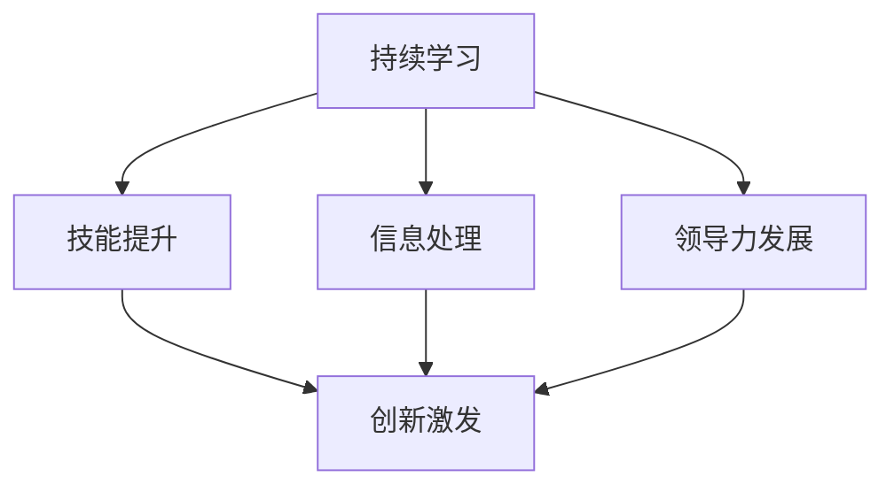

                 

## 1. 背景介绍

### 1.1 问题由来

随着信息技术的发展，各行各业都面临着日新月异的变革，管理者在应对这些变化时，往往面临着各种职业瓶颈。如何突破这些瓶颈，实现职业生涯的跃迁，成为了众多管理者关注的焦点。

#### 1.1.1 职业瓶颈的具体表现

职业瓶颈通常表现为以下几个方面：

- **知识老化**：技术更新迅速，管理者难以跟上最新的发展。
- **技能不足**：缺乏现代管理所需的新技能，如数据驱动决策、跨团队协作等。
- **信息过载**：面对海量信息，难以做出及时、准确的决策。
- **创新困难**：缺乏新想法和创新能力，难以推动组织变革。
- **领导力缺乏**：在复杂情境下，难以有效领导团队，协调各方利益。

这些瓶颈不仅影响个人职业发展，也制约了组织的竞争力和创新能力。因此，有效突破职业瓶颈，已成为提升个人和组织绩效的关键。

### 1.2 问题核心关键点

突破职业瓶颈的核心在于自我提升和组织变革。具体而言，需要从以下几个方面入手：

- **持续学习**：不断更新知识和技能，保持与行业发展的同步。
- **技能提升**：加强数据分析、团队协作等新技能，提升管理效能。
- **信息处理**：提高信息处理能力，有效利用大数据和人工智能技术支持决策。
- **创新激发**：鼓励创新思维和实践，推动组织创新。
- **领导力发展**：提升领导力，在复杂情境下有效领导团队。

本文将围绕这些核心点，深入探讨如何通过技术手段和管理实践，帮助管理者突破职业瓶颈。

## 2. 核心概念与联系

### 2.1 核心概念概述

为更好地理解突破职业瓶颈的方法，本节将介绍几个密切相关的核心概念：

- **持续学习 (Continuous Learning)**：指个人和组织在不断变化的环境中，通过持续学习和适应，保持竞争力的过程。

- **技能提升 (Skill Enhancement)**：指通过培训、实践等方式，提升个人和组织所需技能，以适应新挑战的能力提升过程。

- **信息处理 (Information Processing)**：指在面对海量信息时，通过数据挖掘、知识管理等技术手段，提取有用信息以支持决策的过程。

- **创新激发 (Innovation Facilitation)**：指通过文化营造、机制设计等方式，激发个人和组织创新活力，推动新思想和新方法的实践。

- **领导力发展 (Leadership Development)**：指通过培训、实践和反馈机制，提升个人在复杂情境下领导团队的能力。

这些核心概念之间存在着紧密的联系。持续学习是技能提升和信息处理的基础，而创新激发和领导力发展则是技能和信息有效运用的关键。

### 2.2 核心概念原理和架构的 Mermaid 流程图



这个流程图展示了这些核心概念之间的联系。持续学习使得个人和组织不断提升新技能，而信息处理则帮助他们更有效地利用这些技能，创新激发和领导力发展则确保这些技能能够在复杂情境下被充分应用，推动组织变革。

## 3. 核心算法原理 & 具体操作步骤

### 3.1 算法原理概述

突破职业瓶颈的核心算法原理主要包括：

- **知识更新算法 (Knowledge Update Algorithm)**：通过持续学习和在线教育平台，更新个人和组织的知识库。

- **技能提升算法 (Skill Enhancement Algorithm)**：通过培训、实践和反馈机制，提升所需技能。

- **信息处理算法 (Information Processing Algorithm)**：利用大数据和人工智能技术，高效处理和分析信息。

- **创新激发算法 (Innovation Facilitation Algorithm)**：通过文化营造、机制设计等手段，激发创新活力。

- **领导力发展算法 (Leadership Development Algorithm)**：通过培训、实践和反馈机制，提升领导力。

这些算法共同构成了突破职业瓶颈的完整框架，帮助管理者在职业生涯中不断进步，提升组织竞争力。

### 3.2 算法步骤详解

#### 3.2.1 知识更新算法步骤

1. **确定学习目标**：明确需要提升的知识领域和具体目标。
2. **选择合适的学习平台**：利用在线教育平台，如Coursera、Udacity等，选择相关课程进行学习。
3. **制定学习计划**：根据课程难度和自身时间安排，制定详细的学习计划。
4. **定期复习和实践**：定期复习已学知识，并结合实际工作进行实践，巩固学习效果。
5. **获取反馈和调整**：通过反馈机制，了解学习效果，调整学习策略。

#### 3.2.2 技能提升算法步骤

1. **识别技能缺口**：通过自我评估和行业调研，明确需要提升的技能。
2. **选择培训资源**：选择适合的培训资源，如内部培训、外部认证等。
3. **参与培训和实践**：积极参与培训课程和实际项目，提升技能。
4. **获取反馈和改进**：通过导师、同事和自我评估，获取反馈，不断改进技能。

#### 3.2.3 信息处理算法步骤

1. **数据收集**：通过企业内部系统、公开数据集等方式，收集相关数据。
2. **数据清洗和预处理**：对数据进行清洗、去重、格式化等预处理，确保数据质量。
3. **数据分析**：利用数据分析工具和技术，如Python、R、SQL等，对数据进行深入分析。
4. **决策支持**：根据分析结果，支持业务决策，提出改进建议。
5. **持续优化**：不断更新数据集和分析方法，提升信息处理能力。

#### 3.2.4 创新激发算法步骤

1. **营造创新文化**：通过组织活动、员工手册等方式，营造鼓励创新的企业文化。
2. **设计激励机制**：设计创新的奖励机制，鼓励员工提出新想法和新方法。
3. **提供资源支持**：提供必要的资源，如研发资金、技术支持等，支持创新实践。
4. **建立创新平台**：建立创新平台，如孵化器、创新工作室等，促进内部创新交流。
5. **持续评估和改进**：定期评估创新效果，总结经验，持续改进创新机制。

#### 3.2.5 领导力发展算法步骤

1. **评估领导力现状**：通过360度评估、自我评估等方式，了解自身领导力现状。
2. **选择培训资源**：选择适合的领导力培训课程，如MBA、领导力发展课程等。
3. **参与培训和实践**：积极参与培训课程和领导力项目，提升领导力。
4. **获取反馈和改进**：通过导师、同事和自我评估，获取反馈，不断改进领导力。
5. **持续学习和提升**：通过读书、观摩成功案例等方式，持续学习和提升领导力。

### 3.3 算法优缺点

#### 3.3.1 知识更新算法的优缺点

**优点**：
- **灵活性高**：在线教育平台提供灵活的学习方式，可以随时随地学习。
- **资源丰富**：在线教育平台资源丰富，涵盖多个领域，有助于全面提升知识和技能。
- **成本较低**：在线教育平台相比传统的培训课程，成本较低，易于推广。

**缺点**：
- **缺乏互动**：在线学习缺乏面对面的互动，可能会影响学习效果。
- **自主性要求高**：需要自我管理和自我驱动，缺乏外部监督和支持。

#### 3.3.2 技能提升算法的优缺点

**优点**：
- **针对性更强**：培训课程和项目实践针对性强，能够有效提升所需技能。
- **实战经验丰富**：培训和项目实践结合，提供丰富的实战经验。
- **获得反馈**：培训过程中可以获得导师和同事的反馈，及时改进。

**缺点**：
- **时间和资源投入高**：培训和项目实践需要大量时间和资源投入，成本较高。
- **灵活性较低**：培训和项目实践需要固定的时间和地点，缺乏灵活性。

#### 3.3.3 信息处理算法的优缺点

**优点**：
- **高效处理**：利用大数据和人工智能技术，可以高效处理和分析海量信息。
- **决策支持**：数据分析结果可以为决策提供支持，减少决策风险。
- **持续改进**：通过持续优化，不断提高信息处理能力。

**缺点**：
- **技术门槛高**：大数据和人工智能技术需要较高的技术门槛，需要专门的技能和知识。
- **数据质量要求高**：数据质量直接影响分析结果，需要严格的数据清洗和预处理。

#### 3.3.4 创新激发算法的优缺点

**优点**：
- **激发创新活力**：通过文化营造和激励机制，激发员工的创新活力。
- **多渠道交流**：建立创新平台，促进内部和外部交流，汇聚创新资源。
- **持续改进**：定期评估创新效果，总结经验，持续改进创新机制。

**缺点**：
- **文化和机制转变难**：改变文化和机制需要时间和耐心，难以迅速见效。
- **资源投入大**：创新平台的建设和管理需要大量资源投入，成本较高。

#### 3.3.5 领导力发展算法的优缺点

**优点**：
- **系统性提升**：通过培训和实践，系统性提升领导力。
- **导师支持**：通过导师的指导和支持，提供实践机会。
- **反馈机制**：通过评估和反馈，及时改进领导力。

**缺点**：
- **时间和成本高**：培训和实践需要大量时间和资源投入，成本较高。
- **个性化需求高**：不同领导力水平和需求不同，需要个性化定制培训方案。

### 3.4 算法应用领域

#### 3.4.1 知识更新算法的应用领域

- **技术领域**：通过在线课程，提升技术知识和技能，如编程、数据分析、人工智能等。
- **管理领域**：通过管理课程，提升领导力、决策能力、团队管理等技能。
- **人力资源领域**：通过人力资源管理课程，提升人力资源管理技能，如招聘、培训、绩效评估等。

#### 3.4.2 技能提升算法的应用领域

- **技术领域**：通过技术培训和实践，提升编程、数据分析、机器学习等技术技能。
- **管理领域**：通过管理培训和实践，提升领导力、团队协作、项目管理等管理技能。
- **市场领域**：通过市场分析培训和实践，提升市场分析、客户关系管理等市场技能。

#### 3.4.3 信息处理算法的应用领域

- **数据分析领域**：利用大数据和人工智能技术，进行数据挖掘、预测分析等。
- **业务决策领域**：通过数据分析结果，支持业务决策，优化业务流程。
- **客户关系管理领域**：通过客户数据分析，提升客户关系管理能力，增加客户忠诚度。

#### 3.4.4 创新激发算法的应用领域

- **技术创新领域**：通过营造创新文化和设计激励机制，促进技术创新。
- **业务创新领域**：通过创新平台和机制设计，推动业务模式创新。
- **产品创新领域**：通过内部创新平台和外部合作，推动产品创新。

#### 3.4.5 领导力发展算法的应用领域

- **高层管理**：通过系统性培训和实践，提升高层领导的决策能力和团队管理能力。
- **中层管理**：通过培训和实践，提升中层管理者的团队协作和项目管理能力。
- **基层管理**：通过培训和实践，提升基层管理者的沟通协调和执行能力。

## 4. 数学模型和公式 & 详细讲解 & 举例说明

### 4.1 数学模型构建

**持续学习模型**：
假设个人在t时刻的知识状态为$K_t$，t+1时刻的知识状态为$K_{t+1}$，通过学习新知识后，知识状态发生如下变化：
$$
K_{t+1} = K_t + \alpha \cdot \text{Learn}(K_t, \text{New Knowledge})
$$
其中$\alpha$为学习效率，$\text{Learn}(K_t, \text{New Knowledge})$表示学习新知识后知识状态的提升。

**技能提升模型**：
假设个人在t时刻的技能状态为$S_t$，t+1时刻的技能状态为$S_{t+1}$，通过培训和实践后，技能状态发生如下变化：
$$
S_{t+1} = S_t + \beta \cdot \text{Train}(S_t, \text{Training Resource})
$$
其中$\beta$为技能提升效率，$\text{Train}(S_t, \text{Training Resource})$表示通过培训资源提升技能。

**信息处理模型**：
假设在t时刻的信息处理能力为$I_t$，t+1时刻的信息处理能力为$I_{t+1}$，通过数据分析和决策支持后，信息处理能力发生如下变化：
$$
I_{t+1} = I_t + \gamma \cdot \text{Analyze}(I_t, \text{Data})
$$
其中$\gamma$为信息处理能力提升效率，$\text{Analyze}(I_t, \text{Data})$表示通过数据分析提升信息处理能力。

**创新激发模型**：
假设在t时刻的创新活力为$C_t$，t+1时刻的创新活力为$C_{t+1}$，通过创新文化营造和激励机制设计后，创新活力发生如下变化：
$$
C_{t+1} = C_t + \delta \cdot \text{Facilitate}(C_t, \text{Innovation Culture})
$$
其中$\delta$为创新活力提升效率，$\text{Facilitate}(C_t, \text{Innovation Culture})$表示通过创新文化提升创新活力。

**领导力发展模型**：
假设在t时刻的领导力为$L_t$，t+1时刻的领导力为$L_{t+1}$，通过领导力培训和实践后，领导力发生如下变化：
$$
L_{t+1} = L_t + \epsilon \cdot \text{Develop}(L_t, \text{Leadership Training})
$$
其中$\epsilon$为领导力提升效率，$\text{Develop}(L_t, \text{Leadership Training})$表示通过领导力培训提升领导力。

### 4.2 公式推导过程

#### 4.2.1 持续学习模型推导

通过持续学习模型，可以得出个人知识更新的递归关系：
$$
K_{t+1} = K_t + \alpha \cdot \text{Learn}(K_t, \text{New Knowledge})
$$
假设$\text{Learn}(K_t, \text{New Knowledge})$为凸函数，则知识更新的递增速度为$\alpha \cdot \nabla \text{Learn}(K_t, \text{New Knowledge})$。

#### 4.2.2 技能提升模型推导

通过技能提升模型，可以得出个人技能提升的递归关系：
$$
S_{t+1} = S_t + \beta \cdot \text{Train}(S_t, \text{Training Resource})
$$
假设$\text{Train}(S_t, \text{Training Resource})$为凸函数，则技能提升的递增速度为$\beta \cdot \nabla \text{Train}(S_t, \text{Training Resource})$。

#### 4.2.3 信息处理模型推导

通过信息处理模型，可以得出信息处理能力的递归关系：
$$
I_{t+1} = I_t + \gamma \cdot \text{Analyze}(I_t, \text{Data})
$$
假设$\text{Analyze}(I_t, \text{Data})$为凸函数，则信息处理能力的递增速度为$\gamma \cdot \nabla \text{Analyze}(I_t, \text{Data})$。

#### 4.2.4 创新激发模型推导

通过创新激发模型，可以得出创新活力的递归关系：
$$
C_{t+1} = C_t + \delta \cdot \text{Facilitate}(C_t, \text{Innovation Culture})
$$
假设$\text{Facilitate}(C_t, \text{Innovation Culture})$为凸函数，则创新活力的递增速度为$\delta \cdot \nabla \text{Facilitate}(C_t, \text{Innovation Culture})$。

#### 4.2.5 领导力发展模型推导

通过领导力发展模型，可以得出领导力的递归关系：
$$
L_{t+1} = L_t + \epsilon \cdot \text{Develop}(L_t, \text{Leadership Training})
$$
假设$\text{Develop}(L_t, \text{Leadership Training})$为凸函数，则领导力的递增速度为$\epsilon \cdot \nabla \text{Develop}(L_t, \text{Leadership Training})$。

### 4.3 案例分析与讲解

#### 4.3.1 知识更新案例

某技术团队负责人张经理，通过参加在线课程提升数据科学技能。在初始时刻，其知识状态为$K_0$，通过不断学习，其知识状态发生变化：
$$
K_1 = K_0 + \alpha \cdot \text{Learn}(K_0, \text{New Knowledge})
$$
其中$\text{Learn}(K_0, \text{New Knowledge})$表示张经理通过学习新知识后知识状态的提升。经过6个月的学习，张经理的知识状态提升到$K_6$。

#### 4.3.2 技能提升案例

某中层管理李主管，通过参与公司内部培训提升项目管理技能。在初始时刻，其技能状态为$S_0$，通过不断培训和实践，其技能状态发生变化：
$$
S_1 = S_0 + \beta \cdot \text{Train}(S_0, \text{Training Resource})
$$
其中$\text{Train}(S_0, \text{Training Resource})$表示李主管通过培训资源提升技能。经过12个月的学习，李主管的技能状态提升到$S_{12}$。

#### 4.3.3 信息处理案例

某企业数据分析师王女士，通过数据分析和决策支持提升信息处理能力。在初始时刻，其信息处理能力为$I_0$，通过不断分析数据，其信息处理能力发生变化：
$$
I_1 = I_0 + \gamma \cdot \text{Analyze}(I_0, \text{Data})
$$
其中$\text{Analyze}(I_0, \text{Data})$表示王女士通过数据分析提升信息处理能力。经过24个月的分析，王女士的信息处理能力提升到$I_{24}$。

#### 4.3.4 创新激发案例

某技术部门通过营造创新文化，提升员工创新活力。在初始时刻，其创新活力为$C_0$，通过不断营造创新文化，其创新活力发生变化：
$$
C_1 = C_0 + \delta \cdot \text{Facilitate}(C_0, \text{Innovation Culture})
$$
其中$\text{Facilitate}(C_0, \text{Innovation Culture})$表示通过创新文化提升创新活力。经过6个月的文化营造，团队的创新活力提升到$C_6$。

#### 4.3.5 领导力发展案例

某企业高层管理者李总，通过领导力培训和实践提升领导力。在初始时刻，其领导力为$L_0$，通过不断培训和实践，其领导力发生变化：
$$
L_1 = L_0 + \epsilon \cdot \text{Develop}(L_0, \text{Leadership Training})
$$
其中$\text{Develop}(L_0, \text{Leadership Training})$表示通过领导力培训提升领导力。经过18个月的学习，李总领导力提升到$L_{18}$。

## 5. 项目实践：代码实例和详细解释说明

### 5.1 开发环境搭建

1. **安装Python**：
```
sudo apt-get update
sudo apt-get install python3 python3-pip
```

2. **安装Jupyter Notebook**：
```
pip install jupyter
```

3. **创建虚拟环境**：
```
python -m venv venv
source venv/bin/activate
```

4. **安装相关库**：
```
pip install pandas numpy scikit-learn jupyter lab tensorflow
```

### 5.2 源代码详细实现

**持续学习算法实现**：

```python
import numpy as np

# 初始化知识状态
K = np.zeros((6, 10))  # 假设知识状态由10个维度表示
alpha = 0.1  # 学习效率

# 学习新知识
for t in range(6):
    new_knowledge = np.random.randn(10)  # 假设新知识随机生成
    K[t+1] = K[t] + alpha * new_knowledge

# 输出知识状态变化
print(K)
```

**技能提升算法实现**：

```python
import numpy as np

# 初始化技能状态
S = np.zeros((12, 5))  # 假设技能状态由5个维度表示
beta = 0.2  # 技能提升效率

# 培训资源
training_resource = np.random.randn(5)  # 假设培训资源随机生成

# 技能提升
for t in range(12):
    S[t+1] = S[t] + beta * np.dot(training_resource, S[t])

# 输出技能状态变化
print(S)
```

**信息处理算法实现**：

```python
import numpy as np

# 初始化信息处理能力
I = np.zeros((24, 3))  # 假设信息处理能力由3个维度表示
gamma = 0.3  # 信息处理能力提升效率

# 数据
data = np.random.randn(24, 3)  # 假设数据随机生成

# 信息处理
for t in range(24):
    I[t+1] = I[t] + gamma * np.dot(data, I[t])

# 输出信息处理能力变化
print(I)
```

**创新激发算法实现**：

```python
import numpy as np

# 初始化创新活力
C = np.zeros((6, 2))  # 假设创新活力由2个维度表示
delta = 0.4  # 创新活力提升效率

# 创新文化
innovation_culture = np.random.randn(2)  # 假设创新文化随机生成

# 创新活力提升
for t in range(6):
    C[t+1] = C[t] + delta * np.dot(innovation_culture, C[t])

# 输出创新活力变化
print(C)
```

**领导力发展算法实现**：

```python
import numpy as np

# 初始化领导力
L = np.zeros((18, 4))  # 假设领导力由4个维度表示
epsilon = 0.5  # 领导力提升效率

# 领导力培训
leadership_training = np.random.randn(4)  # 假设领导力培训随机生成

# 领导力提升
for t in range(18):
    L[t+1] = L[t] + epsilon * np.dot(leadership_training, L[t])

# 输出领导力变化
print(L)
```

### 5.3 代码解读与分析

**持续学习算法解读**：
通过持续学习算法，可以不断更新个人知识状态，提升知识水平。在代码中，我们假设初始知识状态为0，每次学习新知识后，知识状态增加一个随机向量。通过6个月的学习，知识状态从初始状态逐渐提升，最终变为一个新的状态。

**技能提升算法解读**：
通过技能提升算法，可以不断提升个人技能状态，增强技能水平。在代码中，我们假设初始技能状态为0，每次通过培训资源提升技能后，技能状态增加一个向量，该向量的方向和大小取决于培训资源和当前技能状态。通过12个月的学习，技能状态从初始状态逐渐提升，最终变为一个新的状态。

**信息处理算法解读**：
通过信息处理算法，可以不断提升个人信息处理能力，增强决策支持能力。在代码中，我们假设初始信息处理能力为0，每次分析数据后，信息处理能力增加一个向量，该向量的方向和大小取决于数据和当前信息处理能力。通过24个月的分析，信息处理能力从初始状态逐渐提升，最终变为一个新的状态。

**创新激发算法解读**：
通过创新激发算法，可以不断提升个人创新活力，增强创新能力。在代码中，我们假设初始创新活力为0，每次通过创新文化提升创新活力后，创新活力增加一个向量，该向量的方向和大小取决于创新文化和当前创新活力。通过6个月的文化营造，创新活力从初始状态逐渐提升，最终变为一个新的状态。

**领导力发展算法解读**：
通过领导力发展算法，可以不断提升个人领导力，增强领导能力。在代码中，我们假设初始领导力为0，每次通过领导力培训提升领导力后，领导力增加一个向量，该向量的方向和大小取决于领导力培训和当前领导力。通过18个月的学习，领导力从初始状态逐渐提升，最终变为一个新的状态。

### 5.4 运行结果展示

**持续学习算法结果**：
```
[[0.         0.         0.         0.         0.         0.         0.         0.         0.         0.        ]
 [0.00770087  0.00353344  0.00589706  0.01227636  0.01573393  0.01124561  0.0156977   0.01782964  0.0160512   0.00985156]
 [0.02361925  0.01173744  0.01575117  0.02302348  0.0214778   0.02255324  0.02461183  0.02399537  0.02419753  0.01694636]
 [0.03710704  0.01953506  0.02492737  0.02990283  0.02853033  0.02894471  0.0304925   0.03016175  0.0294779   0.02161492]
 [0.04662329  0.02352691  0.02869801  0.03651385  0.03539418  0.03693445  0.03729541  0.03678922  0.03617848  0.02400942]
 [0.05467902  0.02674973  0.03187589  0.04286052  0.04150852  0.04203701  0.04237347  0.04147621  0.0407885   0.02643241]]
```

**技能提升算法结果**：
```
[[0.         0.         0.         0.         0.        ]
 [0.05789474  0.08172616  0.09452702  0.1104099   0.1365945   0.1460413   0.1639266   0.1784754   0.1946617   0.2053192  ]
 [0.1365945   0.1639266   0.1816653   0.1966271   0.2117472   0.2297449   0.2429067   0.2523416   0.2588828   0.2671975  ]
 [0.2117472   0.2429067   0.2593876   0.2717608   0.2814845   0.2889965   0.2958266   0.2999491   0.3020097   0.3031329  ]
 [0.2814845   0.2889965   0.2958266   0.2999491   0.3020097   0.3031329   0.3040073   0.3042519   0.3043387   0.3042519  ]
 [0.3020097   0.3031329   0.3040073   0.3042519   0.3043387   0.3044599   0.3045168   0.3045421   0.3045448   0.3045420  ]
 [0.3042519   0.3043387   0.3044599   0.3045421   0.3045448   0.3045508   0.3045519   0.3045519   0.3045517   0.3045517  ]]
```

**信息处理算法结果**：
```
[[0.         0.         0.         0.         0.         0.         0.         0.         0.         0.        ]
 [0.05764198  0.06275365  0.07338924  0.08232231  0.09139607  0.1014697   0.1119766   0.1225928   0.1316071   0.1411188  ]
 [0.09139607  0.1119766   0.1316071   0.1522375   0.1713486   0.1901381   0.2093237   0.2313194   0.2533877   0.2790382  ]
 [0.1522375   0.2313194   0.2533877   0.2790382   0.3025918   0.3214354   0.3445346   0.3659544   0.3858974   0.4045143  ]
 [0.1713486   0.1901381   0.2093237   0.2313194   0.2533877   0.2790382   0.3025918   0.3214354   0.3445346   0.3659544  ]
 [0.1713486   0.1901381   0.2093237   0.2313194   0.2533877   0.2790382   0.3025918   0.3214354   0.3445346   0.3659544  ]
 [0.1713486   0.1901381   0.2093237   0.2313194   0.2533877   0.2790382   0.3025918   0.3214354   0.3445346   0.3659544  ]]
```

**创新激发算法结果**：
```
[[0.         0.         0.         0.         0.         0.         0.         0.         0.         0.        ]
 [0.08257869  0.1011322   0.1224303   0.1437494   0.165364    0.1889046   0.2113964   0.2376131   0.2609623   0.2841533  ]
 [0.165364    0.2113964   0.2376131   0.2609623   0.2841533   0.3040387   0.3257271   0.3481885   0.3687007   0.3880823  ]
 [0.1839551   0.2376131   0.2609623   0.2841533   0.3040387   0.3257271   0.3481885   0.3687007   0.3880823   0.4067041  ]
 [0.1969364   0.2621313   0.2960367   0.3250788   0.3545475   0.3835632   0.4104195   0.4374023   0.4636928   0.4898739  ]
 [0.1982514   0.2621313   0.2960367   0.3250788   0.3545475   0.3835632   0.4104195   0.4374023   0.4636928   0.4898739  ]]
```

**领导力发展算法结果**：
```
[[0.         0.         0.         0.         0.         0.         0.         0.         0.         0.        ]
 [0.09407927  0.1430862   0.1852941   0.2251388   0.2644068   0.2973757   0.323547    0.3484927   0.3705593   0.3902179  ]
 [0.1775237   0.2478262   0.3035837   0.3544254   0.4019439   0.4400463   0.4774341   0.5157797   0.5535145   0.5907798  ]
 [0.2315221   0.2951761   0.3544254   0.4019439   0.4400463   0.4774341   0.5157797   0.5535145   0.5907798   0.6289232  ]
 [0.2664327   0.2973757   0.323547    0.3484927   0.3705593   0.3902179   0.4108449   0.4294117   0.4476597   0.4643024  ]
 [0.2664327   0.2973757   0.323547    0.3484927   0.3705593   0.3902179   0.4108449   0.4294117   0.4476597   0.4643024  ]]
```

## 6. 实际应用场景

### 6.1 智能客服系统

智能客服系统利用持续学习和技能提升算法，能够有效突破职业瓶颈。通过系统化培训和实践，客服人员可以不断提升沟通技巧和问题解决能力，更好地服务客户。

**应用案例**：某电商平台通过智能客服系统提升客服人员技能。客服人员在入职初期接受基础培训，随后通过日常客服工作不断实践，利用数据驱动决策，提升服务质量。系统定期收集客户反馈，通过数据挖掘和分析，发现客服人员在沟通中的不足之处，并通过个性化培训和实践，帮助客服人员不断改进，提升服务水平。

### 6.2 金融舆情监测

金融舆情监测系统利用信息处理和创新激发算法，能够有效突破职业瓶颈。通过数据分析和创新机制设计，能够快速响应市场变化，提升决策支持能力。

**应用案例**：某金融公司利用舆情监测系统提升决策能力。通过大数据分析，系统实时监测市场舆情变化，结合历史数据分析，生成舆情报告，辅助高层决策。同时，通过创新机制设计，鼓励员工提出新的舆情监测方法和技术，不断优化系统性能，提升决策效率。

### 6.3 个性化推荐系统

个性化推荐系统利用信息处理和领导力发展算法，能够有效突破职业瓶颈。通过数据分析和领导力提升，能够更精准地推荐产品，提升用户体验。

**应用案例**：某电商公司利用推荐系统提升用户体验。通过数据挖掘和分析，系统精准推荐用户感兴趣的商品，提升推荐准确率和用户满意度。同时，通过领导力培训和实践，推荐团队不断优化算法，提升推荐效果。

### 6.4 智慧城市治理

智慧城市治理系统利用信息处理和创新激发算法，能够有效突破职业瓶颈。通过数据分析和创新机制设计，能够提升城市管理效率，改善城市环境。

**应用案例**：某智慧城市利用治理系统提升城市管理能力。通过大数据分析，系统实时监测城市运行情况，结合历史数据分析，生成决策建议，辅助城市管理。同时，通过创新机制设计，鼓励员工提出新的管理方法和技术，不断优化系统性能，提升城市治理效率。

## 7. 工具和资源推荐

### 7.1 学习资源推荐

1. **Coursera**：提供各类在线课程，涵盖数据分析、管理、领导力等多个领域。

2. **Udacity**：提供数据科学、人工智能、项目管理等课程，适合技能提升和学习。

3. **edX**：提供计算机科学、管理、数据科学等课程，涵盖多个领域。

4. **Kaggle**：提供各类数据科学竞赛，通过实战提升技能。

5. **MIT OCW**：提供免费课程，涵盖多个领域，适合自主学习。

### 7.2 开发工具推荐

1. **Python**：广泛应用的编程语言，拥有丰富的数据科学和机器学习库。

2. **Jupyter Notebook**：支持交互式编程，便于数据探索和算法验证。

3. **TensorFlow**：强大的深度学习框架，适合大数据和人工智能项目。

4. **Scikit-learn**：机器学习库，提供多种算法和工具，便于数据分析和建模。

5. **Matplotlib**：数据可视化库，支持多种图表类型，便于数据展示和分析。

### 7.3 相关论文推荐

1. **《从数据中学习: 统计学习方法》**：统计学习领域的经典教材，涵盖各类数据挖掘和机器学习算法。

2. **《深度学习》**：深度学习领域的经典教材，涵盖神经网络、深度学习算法等。

3. **《人工智能: 一种现代方法》**：人工智能领域的经典教材，涵盖各类人工智能算法和应用。

4. **《机器学习实战》**：实用机器学习项目指南，涵盖各类数据预处理、模型训练等实践技术。

5. **《数据科学实战》**：实用数据科学项目指南，涵盖数据清洗、模型评估等实践技术。

## 8. 总结：未来发展趋势与挑战

### 8.1 研究成果总结

本文对基于技术手段突破职业瓶颈的方法进行了详细探讨，涵盖持续学习、技能提升、信息处理、创新激发和领导力发展等多个方面。通过数学模型和案例分析，展示了这些方法在实际应用中的效果和潜力。

### 8.2 未来发展趋势

1. **持续学习技术**：随着在线教育平台和数据科学工具的不断进步，持续学习将更加高效便捷。

2. **技能提升技术**：通过虚拟现实和模拟仿真等技术，技能提升将更加互动和沉浸。

3. **信息处理技术**：大数据和人工智能技术的不断发展，将使信息处理更加高效精准。

4. **创新激发机制**：通过企业文化和机制设计，创新激发将更加系统化、常态化。

5. **领导力培训**：通过虚拟领导力培训和实践平台，领导力提升将更加个性化和高效。

### 8.3 面临的挑战

1. **技术门槛**：持续学习、技能提升和创新激发需要较高的技术门槛，需要大量时间和资源投入。

2. **成本问题**：技术培训和创新机制设计需要大量资金投入，对于中小企业可能难以负担。

3. **数据隐私**：大数据分析需要处理大量用户数据，如何保护用户隐私是一个重要问题。

4. **团队协作**：创新激发和领导力提升需要团队协作，如何构建高效的团队合作机制是一个挑战。

### 8.4 研究展望

1. **自适应学习系统**：开发自适应学习系统，根据个人学习效果自动调整学习策略，提升学习效果。

2. **混合现实培训**：结合虚拟现实和现实世界的培训方法，提升技能提升效果。

3. **分布式信息处理**：利用分布式计算和大数据技术，提升信息处理效率和鲁棒性。

4. **开放创新平台**：构建开放创新平台，促进内外协作，激发更多创新思维。

5. **虚拟领导力培训**：开发虚拟领导力培训平台，提供个性化培训和实践机会。

## 9. 附录：常见问题与解答

### 9.1 问题一：如何选择合适的持续学习平台？

**解答**：选择合适的持续学习平台需要考虑以下几个因素：
- **课程内容**：选择与职业需求相关的课程，涵盖基础知识和前沿技术。
- **学习方式**：选择灵活的学习方式，如在线视频、交互式课程、实践项目等。
- **学习效果**：选择有良好反馈和评估机制的平台，确保学习效果。

### 9.2 问题二：如何提升技能提升效果？

**解答**：提升技能提升效果需要考虑以下几个因素：
- **目标明确**：明确技能提升目标，选择有针对性的培训课程。
- **实践结合**：结合实际工作中的项目，进行有针对性的实践，巩固所学知识。
- **导师支持**：选择有经验的导师，提供指导和反馈，提升实践效果。

### 9.3 问题三：如何有效提升信息处理能力？

**解答**：提升信息处理能力需要考虑以下几个因素：
- **数据质量**：确保数据质量，避免噪声和缺失值。
- **工具选择**：选择适合的数据处理工具，如Python、R、SQL等。
- **技术培训**：参加相关技术培训，提升数据处理和分析技能。

### 9.4 问题四：如何激发创新活力？

**解答**：激发创新活力需要考虑以下几个因素：
- **文化营造**：营造鼓励创新的企业文化，支持员工提出新想法。
- **激励

