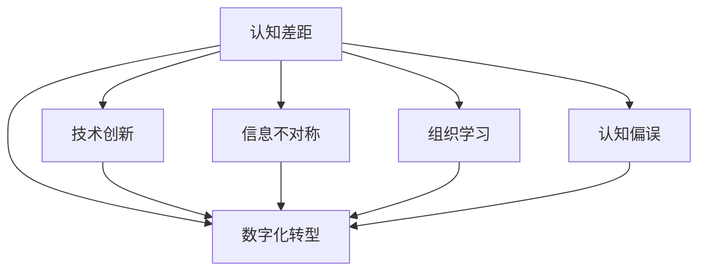

                 

# 管理者的认知差距从何而来

## 1. 背景介绍

### 1.1 问题由来

在快速发展的数字化时代，管理者需要面对复杂多变的市场环境，不断应对技术变革带来的挑战。然而，很多管理者在日常工作中，往往会发现自己与市场和技术前沿存在认知差距。例如，无法理解最新的AI技术，或者误判市场趋势，导致战略决策失误，进而影响公司的长期发展。

这种认知差距的产生，既有宏观背景的影响，也有微观因素的干扰。本文将通过系统梳理认知差距产生的原因，提出针对性的解决方案，帮助管理者在数字化时代中更好地驾驭技术变革，保持战略敏锐度。

### 1.2 问题核心关键点

管理者认知差距的核心在于：
1. **快速变化的技术环境**：技术日新月异，管理者需要不断学习才能跟上技术发展的步伐。
2. **有限的信息获取能力**：管理者往往无法获取到及时、全面、准确的技术和市场信息。
3. **认知偏误**：由于信息过载或认知偏差，管理者可能对技术和市场做出错误的判断。
4. **组织惯性**：组织文化和制度可能限制新技术的应用和扩散。
5. **战略执行困难**：技术和市场变化速度较快，执行层面的响应和调整能力不足。

管理者需要结合自身实际，针对上述问题进行深入反思和改进。

## 2. 核心概念与联系

### 2.1 核心概念概述

为更好地理解认知差距的产生及其解决方案，本节将介绍几个密切相关的核心概念：

- **认知差距(Cognitive Discrepancy)**：管理者与市场和技术前沿之间的知识、信息和理解上的差距。
- **数字化转型(Digital Transformation)**：企业利用数字技术改进和优化业务流程，提升运营效率和客户体验的过程。
- **技术创新(Technological Innovation)**：通过新技术和新方法改进产品或服务，创造新价值的过程。
- **信息不对称(Information Asymmetry)**：交易双方掌握的信息不平衡，可能导致决策偏差。
- **组织学习(Organizational Learning)**：通过知识共享和传播，提升组织整体学习能力。
- **认知偏误(Cognitive Biases)**：由于心理机制、信息处理模式等原因，导致错误的判断和决策。

这些核心概念之间的逻辑关系可以通过以下Mermaid流程图来展示：



这个流程图展示出认知差距的形成过程及其影响因素：

1. 认知差距来源于技术和市场的前沿变化。
2. 数字化转型、技术创新、信息不对称和组织学习都是影响认知差距的关键因素。
3. 认知偏误进一步加剧了认知差距。
4. 最终，认知差距对数字化转型和战略执行产生负面影响。

## 3. 核心算法原理 & 具体操作步骤
### 3.1 算法原理概述

管理者认知差距的产生和影响，可以通过以下算法模型进行刻画：

$$
\text{认知差距} = f(\text{技术创新速度}, \text{信息不对称程度}, \text{组织学习能力}, \text{认知偏误大小})
$$

其中，$f$ 表示一个非线性的映射函数，反映了各种因素对认知差距的复合影响。

### 3.2 算法步骤详解

基于上述模型，认知差距的缓解和消除可以分为以下关键步骤：

**Step 1: 识别认知差距**
- 通过定期市场调研、技术评估、员工反馈等手段，识别出管理者和市场、技术前沿之间的认知差距。
- 制定量化的评估指标，如技术掌握度、市场趋势理解度等，定期进行自我评估。

**Step 2: 加速数字化转型**
- 利用数字技术改进和优化业务流程，提升运营效率和客户体验。
- 引入先进的数字工具和平台，如AI决策支持系统、大数据分析平台等，支持管理决策。

**Step 3: 加强技术创新**
- 设立创新激励机制，鼓励员工和团队提出新想法和解决方案。
- 建立跨部门的技术创新实验室，进行前瞻性技术研究。

**Step 4: 缩小信息不对称**
- 建立开放、透明的信息共享机制，确保管理层和执行层的信息对称。
- 利用大数据分析技术，对市场趋势和客户需求进行深入分析，提供决策支持。

**Step 5: 促进组织学习**
- 建立知识管理系统，促进知识共享和传播。
- 定期组织培训和学习活动，提升团队的技术和管理能力。

**Step 6: 减少认知偏误**
- 引入多元化的观点和数据，避免单一视角和信息片面。
- 建立科学决策机制，如数据驱动的决策、AB测试等，减少主观判断。

### 3.3 算法优缺点

认知差距缓解算法的优缺点如下：

**优点：**
1. **系统性**：通过系统性分析，找到认知差距的根本原因，采取有针对性的改进措施。
2. **可操作性**：提供了具体的操作方法，便于在实际工作中实施。
3. **灵活性**：可以根据具体环境和需求进行调整和优化。

**缺点：**
1. **复杂度**：识别和缓解认知差距涉及多个因素，需要综合考虑。
2. **资源消耗**：实施上述措施需要投入一定的时间和资源，成本较高。
3. **不确定性**：技术发展和市场变化具有不确定性，难以完全预测和控制。

### 3.4 算法应用领域

认知差距缓解算法不仅适用于企业管理，还适用于多个领域，例如：

- **医疗管理**：医疗机构管理者需要应对快速变化的技术和市场需求，通过持续学习和技术创新提升服务质量。
- **教育管理**：教育管理者需要理解和应用最新的教育技术和教学方法，提升教学效果和学生体验。
- **金融管理**：金融行业管理者需要应对复杂多变的市场环境，通过数据分析和技术创新提升风险控制和客户服务。

认知差距的缓解对于这些领域的管理者都具有重要的意义。

## 4. 数学模型和公式 & 详细讲解 & 举例说明

### 4.1 数学模型构建

认知差距缓解算法可以构建为一个多输入、多输出的数学模型，如下所示：

$$
\text{认知差距}_{\text{缓解}} = \text{认知差距}_{\text{原始}} - \text{认知差距}_{\text{增加}}
$$

其中：
- $\text{认知差距}_{\text{缓解}}$ 表示缓解后的认知差距。
- $\text{认知差距}_{\text{原始}}$ 表示原始的认知差距。
- $\text{认知差距}_{\text{增加}}$ 表示通过上述步骤导致的认知差距增加量。

### 4.2 公式推导过程

为了简化计算，可以引入以下假设：
1. 技术创新速度 $v$ 表示每年技术进步的速率。
2. 信息不对称程度 $s$ 表示市场和技术信息的不对称性。
3. 组织学习能力 $l$ 表示组织吸收和应用新技术的能力。
4. 认知偏误大小 $b$ 表示认知偏差对决策的影响程度。

则认知差距的缓解函数可以近似为：

$$
f(v,s,l,b) = k \cdot (1 - \frac{v}{c}) \cdot \frac{s}{c} \cdot \frac{l}{c} \cdot \frac{1}{1+b}
$$

其中 $k$ 为正常化因子，$c$ 为阈值，$v$、$s$、$l$、$b$ 分别代入具体数值，即可计算出缓解后的认知差距。

### 4.3 案例分析与讲解

以某科技公司的管理为例，公司管理者面临以下情况：

- **技术创新速度**：公司每年推出10项新技术，但市场接受度较低。
- **信息不对称程度**：市场和技术信息获取渠道有限，信息不对称。
- **组织学习能力**：公司定期进行技术培训，但培训效果不佳。
- **认知偏误大小**：管理层过度依赖历史经验，忽视新技术和市场变化。

通过上述模型和公式，可以计算出公司当前认知差距的大小，并提出改善建议：

1. **加速数字化转型**：引入先进的数字化工具，提升运营效率和客户体验。
2. **加强技术创新**：设立创新激励机制，推动新技术的应用。
3. **缩小信息不对称**：建立开放的信息共享机制，提升信息透明度。
4. **促进组织学习**：定期组织技术培训和知识分享，提升团队学习能力。
5. **减少认知偏误**：引入数据驱动的决策机制，减少主观判断。

## 5. 项目实践：代码实例和详细解释说明
### 5.1 开发环境搭建

在进行认知差距缓解项目实践前，我们需要准备好开发环境。以下是使用Python进行数据分析和决策支持的环境配置流程：

1. 安装Anaconda：从官网下载并安装Anaconda，用于创建独立的Python环境。

2. 创建并激活虚拟环境：
```bash
conda create -n cognitivedata python=3.8 
conda activate cognitivedata
```

3. 安装相关库：
```bash
conda install pandas numpy scikit-learn statsmodels matplotlib seaborn
```

4. 安装TensorFlow：
```bash
pip install tensorflow
```

5. 安装Jupyter Notebook：
```bash
pip install jupyter notebook
```

完成上述步骤后，即可在`cognitivedata`环境中开始认知差距缓解项目实践。

### 5.2 源代码详细实现

接下来，我们将通过一个具体的项目实例，演示如何通过数据分析和机器学习技术缓解认知差距。

假设某公司管理者需要进行一项产品升级决策，需要收集市场和技术信息，并进行数据分析。项目步骤如下：

1. 收集市场和技术信息：通过网络爬虫和公开数据源，收集市场趋势、技术发展等信息。
2. 数据清洗和预处理：去除噪声数据，进行数据归一化等预处理操作。
3. 数据分析和建模：使用统计分析、机器学习等方法，对数据进行分析建模。
4. 决策支持：根据分析结果，提供数据驱动的决策支持。

以下是具体的代码实现：

```python
# 第一步：数据收集
import pandas as pd
import requests

# 从公开数据源获取市场和技术信息
market_data = requests.get('https://example.com/market-data')
tech_data = requests.get('https://example.com/tech-data')

# 第二步：数据清洗和预处理
data = pd.concat([market_data, tech_data])
data = data.dropna()  # 去除缺失数据
data = data.drop_duplicates()  # 去除重复数据

# 第三步：数据分析和建模
from statsmodels.api import OLS
from sklearn.preprocessing import StandardScaler
from sklearn.decomposition import PCA

# 定义特征和目标变量
X = data[['market_trend', 'tech_innovation', 'customer_feedback']]
y = data['product_upgrade']

# 标准化数据
scaler = StandardScaler()
X_scaled = scaler.fit_transform(X)

# 主成分分析
pca = PCA(n_components=2)
X_pca = pca.fit_transform(X_scaled)

# 第四步：决策支持
# 使用回归模型预测产品升级的效果
model = OLS(y, X_pca).fit()
print(model.summary())
```

### 5.3 代码解读与分析

让我们再详细解读一下关键代码的实现细节：

**数据收集**：
- 使用`requests`库获取市场和技术信息，可以使用网络爬虫获取更多数据。

**数据清洗和预处理**：
- 使用`pandas`库对数据进行清洗和预处理，包括去除缺失值和重复值，进行标准化等操作。

**数据分析和建模**：
- 使用`statsmodels`和`scikit-learn`库进行统计分析和机器学习建模。
- 通过主成分分析(PCA)将高维数据降维，简化分析过程。
- 使用线性回归模型进行预测，评估产品升级的效果。

**决策支持**：
- 根据分析结果，提供数据驱动的决策支持。

通过上述代码，我们可以快速构建一个简单的认知差距缓解项目，帮助管理者做出更加科学和准确的决策。

## 6. 实际应用场景
### 6.1 智能制造管理

在智能制造领域，管理者需要应对快速变化的技术和市场需求，通过持续学习和技术创新提升生产效率和产品质量。

在技术实现上，可以收集生产过程中的各项数据，如设备状态、生产参数、质量检测结果等。利用大数据分析和机器学习技术，对数据进行深入分析，识别出生产瓶颈和优化空间，提供数据驱动的生产优化方案。

### 6.2 健康管理

在健康管理领域，管理者需要应对复杂多变的医疗技术和市场需求，通过持续学习和技术创新提升医疗服务质量和患者体验。

在技术实现上，可以收集患者数据、医疗设备数据、医疗记录等，利用大数据分析和AI技术，进行疾病预测、健康管理、个性化治疗等。通过持续学习新技术和新方法，提升医疗服务水平和患者满意度。

### 6.3 教育管理

在教育管理领域，管理者需要理解和应用最新的教育技术和教学方法，提升教学效果和学生体验。

在技术实现上，可以收集学生的学习数据、教师的教学数据、学校的运营数据等，利用大数据分析和AI技术，进行学生行为分析、课程优化、教学效果评估等。通过持续学习新技术和新方法，提升教育管理水平和教学效果。

### 6.4 未来应用展望

随着认知差距缓解算法的不断发展和完善，未来将在更多领域得到应用，为管理者提供科学决策的支撑。

在智慧城市管理中，管理者需要应对复杂多变的城市环境和市场需求，通过持续学习和技术创新提升城市管理和公共服务水平。

在金融风险管理中，管理者需要应对快速变化的市场和风险，通过持续学习和技术创新提升风险控制和投资决策能力。

在环境管理中，管理者需要应对日益严峻的环境问题和市场需求，通过持续学习和技术创新提升环保水平和资源利用效率。

此外，在农业、能源、交通等众多领域，认知差距缓解算法也将不断涌现，为管理者提供科学决策的支撑。相信随着技术的不断发展，认知差距缓解算法必将在更多领域得到应用，助力管理者在数字化时代中更好地驾驭技术变革，提升管理水平。

## 7. 工具和资源推荐
### 7.1 学习资源推荐

为了帮助管理者系统掌握认知差距缓解的理论基础和实践技巧，这里推荐一些优质的学习资源：

1. 《数据驱动的决策制定》系列博文：由数据科学专家撰写，深入浅出地介绍了数据驱动决策的原理和方法。

2. 《统计学习基础》课程：斯坦福大学开设的统计学入门课程，有Lecture视频和配套作业，带你入门统计学习的基础概念和基本方法。

3. 《机器学习实战》书籍：由机器学习专家所著，全面介绍了机器学习的理论基础和实践技巧，适合初学者学习。

4. Coursera《数据科学导论》课程：Coursera提供的入门级数据科学课程，内容涵盖了数据收集、处理、分析等多个方面，适合非专业人士学习。

5. Kaggle：Kaggle数据科学社区，提供了大量公开数据集和竞赛任务，通过实践练习提升数据分析能力。

通过对这些资源的学习实践，相信你一定能够快速掌握认知差距缓解的精髓，并用于解决实际的决策问题。

### 7.2 开发工具推荐

高效的开发离不开优秀的工具支持。以下是几款用于认知差距缓解开发的常用工具：

1. Jupyter Notebook：免费的开源Jupyter Notebook环境，方便进行数据分析和机器学习实验。

2. Python：Python语言简单易用，是数据分析和机器学习的首选语言。

3. R语言：R语言也是数据分析和统计学习的常用工具，具有强大的统计分析和可视化能力。

4. Tableau：Tableau数据可视化工具，可以直观展示数据分析结果，帮助管理者进行决策支持。

5. Power BI：Microsoft提供的商业智能工具，可以进行数据可视化和业务分析，支持数据同步和自动化。

合理利用这些工具，可以显著提升认知差距缓解任务的开发效率，加快创新迭代的步伐。

### 7.3 相关论文推荐

认知差距缓解技术的发展源于学界的持续研究。以下是几篇奠基性的相关论文，推荐阅读：

1. Data-Driven Decision Making in Complex Organizations：介绍如何在复杂组织中进行数据驱动决策的论文，提出了基于数据的决策支持框架。

2. Transforming Data into Intelligent Insights：介绍如何将数据转化为智能洞察的论文，提供了数据可视化和分析的实用技巧。

3. Improving Decision Making with AI：介绍如何利用AI技术提升决策质量的论文，探讨了AI在决策支持中的应用。

4. Cognitive Biases in Decision Making：介绍认知偏误对决策影响的论文，提供了认知偏误的识别和应对方法。

5. Organizational Learning and Innovation：介绍组织学习与创新的论文，探讨了如何通过知识共享和传播提升组织能力。

这些论文代表了大规模数据分析和认知差距缓解技术的发展脉络。通过学习这些前沿成果，可以帮助管理者把握学科前进方向，激发更多的创新灵感。

## 8. 总结：未来发展趋势与挑战

### 8.1 研究成果总结

本文对认知差距的产生及其缓解方法进行了全面系统的介绍。首先阐述了认知差距在数字化时代对管理者的重要性和产生原因，明确了缓解认知差距的必要性和紧迫性。其次，通过系统梳理认知差距缓解的核心概念和操作步骤，提供了详细的算法模型和实际案例，帮助管理者在实际工作中应用这些方法。同时，本文还广泛探讨了认知差距缓解在多个行业领域的应用前景，展示了认知差距缓解技术的广泛应用价值。

通过本文的系统梳理，可以看到，认知差距缓解方法在数字化时代具有重要的意义。这些方法的实施，不仅能提升管理者的决策能力，还能增强组织的应变能力和竞争力。

### 8.2 未来发展趋势

展望未来，认知差距缓解技术将呈现以下几个发展趋势：

1. **自动化和智能化**：随着AI技术的发展，认知差距缓解过程将更加自动化和智能化，管理者只需简单输入信息，系统即可提供决策建议。

2. **数据驱动决策**：数据驱动决策将成为管理者的主要决策方式，通过数据分析和机器学习技术，提升决策的科学性和准确性。

3. **跨领域应用**：认知差距缓解技术将广泛应用于多个领域，如智能制造、健康管理、教育管理等，帮助管理者在各个领域中更好地应对挑战。

4. **实时反馈和调整**：随着实时数据流的引入，认知差距缓解模型将能够实时监测和管理者的认知差距，提供动态调整建议。

5. **多模态数据融合**：认知差距缓解技术将更加注重多模态数据的融合，如结合文本、图像、视频等多源数据，提升决策的全面性和准确性。

以上趋势凸显了认知差距缓解技术的广阔前景。这些方向的探索发展，必将进一步提升管理者的决策能力，推动组织的数字化转型和智能化升级。

### 8.3 面临的挑战

尽管认知差距缓解技术已经取得了瞩目成就，但在迈向更加智能化、普适化应用的过程中，它仍面临着诸多挑战：

1. **数据隐私和安全**：在数据驱动决策过程中，数据隐私和安全问题成为一大挑战。如何保护用户数据隐私，避免数据泄露，是认知差距缓解技术应用的重要前提。

2. **数据质量和完整性**：数据质量和完整性问题直接影响到分析结果的准确性。如何确保数据的准确性和完整性，是一个长期而复杂的任务。

3. **数据融合和协同**：多模态数据的融合和协同处理需要更高的技术要求。如何实现不同数据源之间的无缝对接和协同处理，是认知差距缓解技术需要解决的难题。

4. **模型可解释性**：认知差距缓解模型往往是"黑盒"系统，难以解释其内部工作机制和决策逻辑。如何提高模型的可解释性，提升决策的透明度和可信度，是一个重要研究方向。

5. **技术成熟度**：认知差距缓解技术尚处于发展初期，技术成熟度有待提高。如何进一步优化算法模型，提升其实用性和普适性，是一个重要的研究方向。

6. **跨部门协作**：认知差距缓解技术需要跨部门协作，涉及数据共享、流程优化等多个环节。如何建立有效的跨部门协作机制，是一个重要挑战。

这些挑战凸显了认知差距缓解技术的发展潜力，但同时也需要在技术、组织、管理等多个层面进行深入探索和改进。只有解决好这些挑战，才能真正实现认知差距缓解技术的广泛应用和落地。

### 8.4 研究展望

面对认知差距缓解技术所面临的种种挑战，未来的研究需要在以下几个方面寻求新的突破：

1. **数据隐私保护技术**：开发更加高效的数据隐私保护技术，确保数据在传输和使用过程中的安全。

2. **数据质量控制技术**：研究数据清洗、校验和修复技术，提高数据质量和完整性。

3. **多模态数据融合技术**：探索多源数据融合和协同处理的技术，实现多模态数据的无缝对接。

4. **模型可解释性提升技术**：研究可解释性机器学习技术，提升模型的透明度和可信度。

5. **跨部门协作机制**：建立有效的跨部门协作机制，促进数据共享和协同工作。

这些研究方向将推动认知差距缓解技术向更加智能化、普适化方向发展，为管理者提供更加科学、高效、可信的决策支持。面向未来，认知差距缓解技术还需要与其他人工智能技术进行更深入的融合，如知识表示、因果推理、强化学习等，多路径协同发力，共同推动认知差距缓解技术的发展。只有勇于创新、敢于突破，才能真正实现认知差距缓解技术的广泛应用，帮助管理者在数字化时代中更好地驾驭技术变革，提升管理水平。

## 9. 附录：常见问题与解答

**Q1：如何有效收集和管理数据？**

A: 有效收集和管理数据需要从以下几个方面入手：
1. 数据源选择：选择权威、可靠的数据源，确保数据的准确性和完整性。
2. 数据清洗：去除噪声数据和重复数据，进行数据预处理。
3. 数据存储：采用分布式存储技术，如Hadoop、Spark等，提高数据存储和检索效率。
4. 数据管理：建立数据管理系统，进行数据标注、访问控制等管理。

**Q2：如何评估数据的价值和质量？**

A: 评估数据价值和质量需要从以下几个方面入手：
1. 数据覆盖度：评估数据是否涵盖了关键业务场景和变量。
2. 数据准确性：通过抽样检查和验证，评估数据的准确性。
3. 数据及时性：评估数据的更新频率和时效性。
4. 数据一致性：评估不同数据源之间的数据一致性。

**Q3：如何在跨部门协作中分享数据？**

A: 在跨部门协作中分享数据需要从以下几个方面入手：
1. 建立数据共享协议：明确各部门的数据分享职责和权限。
2. 数据脱敏和匿名化：对敏感数据进行脱敏和匿名化处理，保护数据隐私。
3. 数据接口和API：开发数据接口和API，方便各部门之间数据共享。
4. 数据安全和监控：建立数据安全和监控机制，确保数据传输和使用过程中的安全。

**Q4：如何进行数据驱动的决策支持？**

A: 进行数据驱动的决策支持需要从以下几个方面入手：
1. 数据整合：将不同来源的数据整合在一起，形成统一的数据集。
2. 数据分析：使用统计分析、机器学习等技术，对数据进行分析建模。
3. 决策支持：根据分析结果，提供数据驱动的决策建议。
4. 动态调整：根据实时数据和反馈，动态调整决策模型。

**Q5：如何在多模态数据融合中提升准确性？**

A: 在多模态数据融合中提升准确性需要从以下几个方面入手：
1. 数据融合算法：选择适合的多模态数据融合算法，如特征融合、聚类、关联规则等。
2. 数据标注和校验：对多模态数据进行标注和校验，确保数据的准确性。
3. 数据同步和对齐：确保多源数据之间的同步和对齐，消除数据偏差。
4. 数据可视化：使用数据可视化工具，直观展示多模态数据融合结果。

通过这些常见问题的解答，希望能帮助管理者更好地理解和应用认知差距缓解技术，提升决策能力和管理水平。

