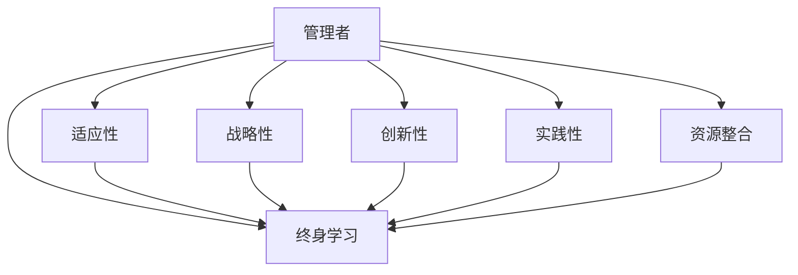

                 

# 管理者终身学习的重要性与方法

> 关键词：管理者, 终身学习, 重要性, 方法, 策略, 创新, 实践, 资源

## 1. 背景介绍

### 1.1 问题由来
在快速变化的商业环境中，技术革新、市场竞争、客户需求的变化日新月异。管理者作为企业战略的制定者和执行者，必须不断适应新环境，把握新机会。然而，许多管理者发现自己陷入了知识更新缓慢、技能提升停滞的困境。这种“知识枯竭”现象，不仅影响个人职业发展，更严重制约了企业的长期竞争力。因此，探讨管理者终身学习的重要性与方法，成为当前管理理论和实践研究的一个重要课题。

### 1.2 问题核心关键点
管理者终身学习的重要性和方法主要涉及以下几个核心关键点：

1. **适应性**：管理者需具备不断适应新环境、新技术和新趋势的能力。
2. **战略性**：终身学习应围绕企业战略目标展开，提升决策质量。
3. **创新性**：通过持续学习，激发创新思维，推动企业持续改进。
4. **实践性**：学习不应只是理论知识的积累，更应结合实际工作场景进行应用。
5. **资源整合**：利用各类资源（如在线课程、专业书籍、培训机会等）进行系统学习。

这些问题共同构成了管理者终身学习的核心框架，指导管理者在复杂的商业环境中不断进步，保持竞争优势。

## 2. 核心概念与联系

### 2.1 核心概念概述

为了更好地理解管理者终身学习的概念，我们首先概述几个关键概念：

- **管理者(Manager)**：在组织中负责规划、组织、领导和控制团队和个人，以达成组织目标的人员。
- **终身学习(Lifelong Learning)**：个人在其整个职业生涯中不断获取新知识和技能的过程，旨在适应和应对职业生涯中遇到的挑战。
- **适应性(Adaptability)**：个人或组织应对变化的能力，包括对新技术、市场变化和客户需求的适应。
- **战略性(Strategic)**：与企业长期目标和愿景相关的决策和行动。
- **创新性(Creativity)**：通过学习新技术、新方法和新思路，推动组织创新。
- **实践性(Practicality)**：将学习成果应用于实际工作，解决实际问题。
- **资源整合(Resource Integration)**：充分利用各类学习资源，如在线课程、专业书籍、培训机会等，实现高效学习。

这些核心概念之间的逻辑关系可以通过以下Mermaid流程图来展示：



这个流程图展示了几大核心概念之间的联系：

1. 管理者通过终身学习提升适应性，以应对环境变化。
2. 终身学习围绕战略性进行，确保学习与企业目标一致。
3. 创新性是终身学习的重要目标，通过不断学习推动组织创新。
4. 实践性确保学习成果应用于实际工作，提升解决实际问题的能力。
5. 资源整合为终身学习提供了坚实基础，使学习更加高效和全面。

## 3. 核心算法原理 & 具体操作步骤
### 3.1 算法原理概述

管理者终身学习的原理基于以下几个主要假设：

1. **知识不断更新**：技术和市场环境的变化要求管理者不断更新知识和技能。
2. **学习循环**：持续学习是一个循环过程，包括计划、执行、评估和调整。
3. **系统学习**：通过整合各类资源，进行系统性、结构化的学习，提升学习效果。
4. **反馈机制**：通过实际应用中的反馈，不断调整学习策略和方向。

基于这些假设，管理者终身学习的目标是通过不断学习和适应，提升自身能力，最终推动企业的持续发展。

### 3.2 算法步骤详解

管理者终身学习的具体操作步骤如下：

**Step 1: 制定学习计划**
- 根据自身角色和组织需求，设定学习目标和计划。
- 确定所需知识领域的优先级，如市场分析、战略规划、领导力等。

**Step 2: 选择学习资源**
- 利用在线课程、专业书籍、研讨会、工作坊等资源进行学习。
- 结合自身情况，选择适合的线上线下学习方式。

**Step 3: 执行学习活动**
- 定期参加培训、阅读专业书籍、听取专家讲座。
- 实践新学到的知识，如在项目中应用、与同事讨论等。

**Step 4: 评估学习效果**
- 通过考试、工作表现、项目结果等评估学习效果。
- 总结学习成果，识别不足之处。

**Step 5: 调整学习策略**
- 根据评估结果，调整学习计划和策略。
- 加入新的学习活动，持续改进。

通过这些步骤，管理者能够系统地进行终身学习，不断提升自己的能力，以应对商业环境的变化。

### 3.3 算法优缺点

管理者终身学习的优点包括：

1. **适应能力强**：通过不断学习，管理者能更好地适应技术、市场和客户的变化。
2. **决策质量提升**：系统学习帮助管理者获得更多信息，提高决策的科学性和合理性。
3. **创新驱动**：持续学习激发创新思维，推动企业产品和服务创新。
4. **个人成长**：终身学习帮助管理者实现职业成长，提升个人价值。

其缺点则主要包括：

1. **时间和精力投入**：终身学习需要持续的时间和精力，对管理者来说是一个长期挑战。
2. **资源获取难度**：高质量的学习资源可能不易获取，且需自行筛选和判断。
3. **即时效果难以体现**：学习效果往往需要较长时间才能在实际工作中显现。
4. **内部抵触情绪**：部分管理者可能对终身学习持怀疑态度，认为其无法带来立竿见影的效果。

尽管存在这些局限，但终身学习的整体优势明显，对于提升管理者能力和企业竞争力具有重要意义。

### 3.4 算法应用领域

管理者终身学习的应用领域广泛，包括但不限于：

1. **企业战略规划**：通过学习新的管理理论和实践，制定更科学、合理的企业战略。
2. **市场营销**：掌握最新的市场趋势和客户需求，优化市场营销策略。
3. **团队管理**：提升领导力和沟通技能，增强团队凝聚力和执行力。
4. **财务分析**：学习财务知识和工具，提升企业财务管理能力。
5. **人力资源管理**：通过学习人力资源管理新理念，优化人才招聘、培训和绩效管理。

这些领域的学习和应用，能够全面提升管理者的综合素质，推动企业的整体发展。

## 4. 数学模型和公式 & 详细讲解  
### 4.1 数学模型构建

本节将使用数学语言对管理者终身学习的原理进行更加严格的刻画。

假设管理者的能力可以用一系列指标表示，记为 $C=(c_1, c_2, ..., c_n)$，其中 $c_i$ 表示第 $i$ 项能力的水平。初始能力记为 $C_0$，经过一次学习后，能力提升为 $C_1$。学习效果可以用数学模型表示为：

$$
C_1 = C_0 + \alpha \cdot F(C_0, L)
$$

其中 $\alpha$ 为学习效率，$F$ 为学习函数，$L$ 为学习投入（如时间、精力、资源等）。

### 4.2 公式推导过程

为了简化问题，我们假设 $F(C_0, L)$ 为线性函数：

$$
F(C_0, L) = \beta \cdot L + \gamma \cdot C_0
$$

其中 $\beta$ 和 $\gamma$ 为学习函数的参数。

将上式代入 $C_1$ 的表达式中，得：

$$
C_1 = C_0 + \alpha (\beta \cdot L + \gamma \cdot C_0)
$$

化简得：

$$
C_1 = (1+\alpha\gamma)C_0 + \alpha\beta \cdot L
$$

该公式表明，管理者的能力提升不仅依赖初始能力 $C_0$，还与学习投入 $L$ 成正比。

### 4.3 案例分析与讲解

假设某公司CEO的初始能力为 $C_0=(100, 80, 70)$，表示其市场分析、战略规划和团队管理的能力分别为100、80和70（分值范围0-100）。通过一次系统的学习，学习投入 $L=200$，学习效率 $\alpha=0.5$。则学习后的能力为：

$$
C_1 = (1+0.5\gamma)C_0 + 0.5\beta \cdot 200
$$

设市场分析、战略规划和团队管理的提升率为 $r_1, r_2, r_3$，则有：

$$
C_{1,1} = 100 + 0.5r_1 \cdot 100 + 0.5\beta \cdot 200
$$
$$
C_{1,2} = 80 + 0.5r_2 \cdot 80 + 0.5\beta \cdot 200
$$
$$
C_{1,3} = 70 + 0.5r_3 \cdot 70 + 0.5\beta \cdot 200
$$

通过实际工作中的反馈和评估，可以得到 $r_1, r_2, r_3$ 的数值。进而可以计算学习后的能力提升效果，指导后续的学习计划。

## 5. 项目实践：代码实例和详细解释说明
### 5.1 开发环境搭建

在进行管理者终身学习项目实践前，我们需要准备好开发环境。以下是使用Python进行数据分析和模型构建的环境配置流程：

1. 安装Anaconda：从官网下载并安装Anaconda，用于创建独立的Python环境。

2. 创建并激活虚拟环境：
```bash
conda create -n lifelong_learning_env python=3.8 
conda activate lifelong_learning_env
```

3. 安装必要的库：
```bash
pip install numpy pandas scikit-learn matplotlib seaborn jupyter notebook
```

4. 安装自定义库（如用于模拟学习效果的库）：
```bash
pip install my_custom_library
```

完成上述步骤后，即可在`lifelong_learning_env`环境中开始项目实践。

### 5.2 源代码详细实现

下面以一个简单的学习效果评估模型为例，展示如何在Python中实现管理者终身学习的仿真模拟。

```python
import numpy as np
from sklearn.linear_model import LinearRegression

# 设定初始能力向量
C_0 = np.array([100, 80, 70])

# 设定学习投入和学习效率
L = 200
alpha = 0.5

# 设定学习函数参数
beta = 0.2
gamma = 0.1

# 模拟一次学习
C_1 = (1 + alpha * gamma) * C_0 + alpha * beta * L

# 输出学习后的能力向量
print("学习后的能力向量：", C_1)
```

在上述代码中，我们设定了初始能力向量 $C_0$，学习投入 $L$，学习效率 $\alpha$，以及学习函数的参数 $\beta$ 和 $\gamma$。通过模拟一次学习，计算出学习后的能力向量 $C_1$，并输出结果。

### 5.3 代码解读与分析

让我们再详细解读一下关键代码的实现细节：

**初始能力向量 $C_0$**：
- 表示管理者各项能力的初始水平，如市场分析、战略规划、团队管理等。

**学习投入 $L$**：
- 表示管理者在学习过程中投入的时间和精力，如参加培训、阅读书籍等。

**学习效率 $\alpha$**：
- 表示学习效果的提升比例，即每次学习能够提升能力的比例。

**学习函数参数 $\beta$ 和 $\gamma$**：
- $\beta$ 表示学习函数中与学习投入成正比的部分，即投入时间越多，能力提升越多。
- $\gamma$ 表示学习函数中与初始能力成正比的部分，即初始能力越高，学习提升越多。

通过以上参数的设定和计算，可以模拟管理者在一次学习活动后的能力提升情况。

## 6. 实际应用场景
### 6.1 企业战略规划

在企业战略规划中，管理者需要不断学习和适应新的市场趋势和技术变革。通过系统学习，管理者可以掌握最新的市场分析方法和战略规划工具，提升决策的科学性和前瞻性。例如，某公司CEO通过参加EMBA课程，学习了前沿的市场分析和战略管理理论，结合公司实际情况，制定了新的发展战略，成功应对了市场变化，实现了企业的持续增长。

### 6.2 市场营销

市场营销管理者需要掌握最新的客户需求和市场动态，通过终身学习，可以不断提升市场营销策略的效果。例如，某市场营销经理通过学习数字营销技术和数据分析方法，成功优化了公司的广告投放策略，大幅提升了市场活动的ROI。

### 6.3 团队管理

团队管理是企业管理者的一项核心职责，通过终身学习，可以提升领导力和沟通技能，增强团队凝聚力和执行力。例如，某部门经理通过参加领导力培训，学习了有效的团队管理和激励方法，团队成员的工作积极性和效率显著提升。

### 6.4 财务分析

财务分析对于企业的健康发展和风险管理至关重要。通过持续学习，管理者可以掌握财务知识和工具，提升企业的财务管理能力。例如，某企业CFO通过参加财务管理课程，学习了先进的财务分析和预算管理方法，帮助公司优化了财务结构，降低了运营成本。

### 6.5 人力资源管理

人力资源管理是企业管理的重要组成部分，通过终身学习，可以优化人才招聘、培训和绩效管理。例如，某公司HRD通过参加人力资源管理课程，学习了现代人力资源管理理论和实践，成功实施了新的招聘和培训体系，提高了员工满意度和留存率。

## 7. 工具和资源推荐
### 7.1 学习资源推荐

为了帮助管理者系统掌握终身学习的理论基础和实践技巧，这里推荐一些优质的学习资源：

1. **哈佛商学院课程**：哈佛商学院开设了丰富的管理课程，涵盖企业战略、市场营销、财务管理等核心领域，是管理者终身学习的重要资源。
2. **Coursera和edX**：在线学习平台Coursera和edX提供了大量高质量的管理和商业课程，覆盖了从基础到高级的各类管理知识。
3. **LinkedIn Learning**：通过LinkedIn平台，管理者可以获取最新的商业和管理技巧，提升实战能力。
4. **专业书籍**：如《管理学》、《战略管理》、《领导力》等经典书籍，是管理者终身学习的必读书目。
5. **学术期刊**：如《哈佛商业评论》、《管理科学季刊》等，提供最新的学术研究成果和管理实践案例。

通过对这些资源的学习实践，相信管理者能够不断提升自身能力，应对商业环境的变化。

### 7.2 开发工具推荐

高效的开发和学习离不开优秀的工具支持。以下是几款用于管理者终身学习开发的常用工具：

1. **Jupyter Notebook**：免费、开源的交互式编程环境，支持Python等语言，适合数据分析和模型构建。
2. **Google Colab**：谷歌推出的在线Jupyter Notebook环境，免费提供GPU/TPU算力，方便快速迭代实验。
3. **Python代码编辑器**：如Visual Studio Code、PyCharm等，提供代码高亮、调试等功能，提升编程效率。
4. **数据可视化工具**：如Matplotlib、Seaborn等，帮助管理者直观展示数据分析结果。

合理利用这些工具，可以显著提升管理者的学习效率，推动组织知识共享和创新。

### 7.3 相关论文推荐

管理者的终身学习涉及多个领域的研究，以下是几篇经典的相关论文，推荐阅读：

1. **《管理者的学习：适应环境变化的路径》**：探讨了管理者如何通过终身学习适应环境变化，提升个人和组织竞争力。
2. **《持续学习与创新：组织能力提升的策略》**：研究了持续学习如何驱动组织创新，推动企业发展。
3. **《管理者的领导力发展：理论与实践》**：介绍了领导力发展的最新研究成果和实践方法，帮助管理者提升领导能力。
4. **《财务分析与管理：现代企业财务管理的新方法》**：介绍了现代财务分析的工具和方法，提升企业的财务管理能力。
5. **《人力资源管理的新趋势：现代管理者的必备技能》**：介绍了人力资源管理的新趋势和实践案例，帮助管理者优化人力资源管理。

这些论文代表了大管理者的学习和发展方向，对于提升管理者的综合素质具有重要参考价值。

## 8. 总结：未来发展趋势与挑战
### 8.1 总结

本文对管理者终身学习的重要性与方法进行了全面系统的介绍。首先阐述了管理者终身学习的必要性和应用场景，明确了学习对于适应环境变化、提升决策质量和推动组织创新的重要性。其次，从原理到实践，详细讲解了终身学习的数学模型和操作步骤，给出了具体的代码实例和分析。同时，本文还探讨了终身学习在多个实际应用场景中的应用，展示了其广泛的应用前景。最后，推荐了多种学习资源和工具，帮助管理者系统提升自身能力。

通过本文的系统梳理，可以看到，管理者终身学习是一个多维度、多层次的学习过程，涉及适应性、战略性、创新性、实践性和资源整合等多个方面。通过持续学习，管理者可以不断提升自身能力，推动组织的持续发展。

### 8.2 未来发展趋势

展望未来，管理者终身学习将呈现以下几个发展趋势：

1. **智能化学习**：利用人工智能和大数据技术，提供个性化和智能化的学习方案，提升学习效果。
2. **跨学科学习**：结合多学科知识，培养具有跨学科背景的管理者，推动组织创新。
3. **在线学习普及**：在线学习平台和工具的普及，使得终身学习更加便捷和灵活。
4. **虚拟现实(VR)和增强现实(AR)**：通过VR和AR技术，提供沉浸式学习体验，提升学习效果。
5. **学习社区建设**：通过建立学习社区，促进知识共享和经验交流，形成学习生态。

这些趋势将推动管理者终身学习向更加系统化、智能化的方向发展，为管理者提供更多、更好的学习资源和工具。

### 8.3 面临的挑战

尽管终身学习在管理中的应用前景广阔，但在实际推进过程中，仍面临诸多挑战：

1. **时间和资源限制**：管理者往往面临繁忙的工作和家庭事务，难以抽出大量时间和资源进行学习。
2. **知识更新速度快**：新技术和新趋势不断涌现，管理者需要持续学习以跟上发展步伐。
3. **学习效果评估困难**：如何衡量终身学习的实际效果，并不断调整学习策略，是管理者的重要挑战。
4. **个性化需求难以满足**：不同管理者的学习需求和背景各异，如何提供个性化的学习方案，是终身学习推广的关键。
5. **学习投入成本高**：高质量的学习资源和工具往往需要较高投入，对管理者的经济压力较大。

克服这些挑战，需要管理者和组织共同努力，探索更加高效、灵活的学习方法。

### 8.4 研究展望

未来，管理者终身学习的研究方向将更加多样化，主要集中在以下几个方面：

1. **学习算法研究**：开发更智能、高效的学习算法，提升学习效果和效率。
2. **学习路径设计**：结合管理者的职业背景和组织需求，设计个性化的学习路径。
3. **学习效果评估**：建立科学、系统的学习效果评估体系，指导管理者不断优化学习策略。
4. **跨领域知识整合**：探索不同学科知识的整合方法，提升管理者的综合素质。
5. **跨组织学习协作**：通过建立跨组织学习网络，促进知识共享和经验交流，提升组织整体能力。

这些研究方向将为管理者终身学习提供更加坚实的基础，推动管理者的全面发展。

## 9. 附录：常见问题与解答

**Q1：终身学习是否适用于所有管理岗位？**

A: 终身学习适用于所有管理岗位，但不同岗位的学习重点和需求不同。例如，CEO需要掌握战略管理，而项目经理则需要专注于项目管理。管理者应根据自身岗位特点，制定相应的学习计划。

**Q2：管理者如何进行高效的学习？**

A: 管理者进行高效学习需要以下几个步骤：
1. 设定明确的学习目标。
2. 选择合适的学习资源，如在线课程、专业书籍、培训机会等。
3. 制定详细的学习计划，合理安排时间和精力。
4. 实践新学到的知识，结合实际工作进行应用。
5. 定期评估学习效果，总结学习成果，调整学习策略。

通过以上步骤，管理者能够高效地进行学习，提升自身能力。

**Q3：终身学习是否需要投入大量时间和金钱？**

A: 终身学习确实需要投入一定的时间和金钱，但与传统的高等教育相比，性价比更高。管理者可以通过在线课程和开放资源进行自学，节省时间和成本。

**Q4：学习过程中如何保持动力？**

A: 保持学习动力需要以下几个方法：
1. 设定阶段性目标，不断实现小目标，获得成就感。
2. 找到学习的意义和价值，明确学习对个人和组织的重要性。
3. 加入学习社区，与志同道合的人交流，互相激励。
4. 保持学习的灵活性，根据实际情况调整学习计划。

通过以上方法，管理者可以持续保持学习动力，实现终身学习的目标。

**Q5：如何评估学习效果？**

A: 评估学习效果可以从以下几个方面进行：
1. 通过考试、测评等工具，评估理论知识的掌握情况。
2. 结合实际工作中的应用效果，评估学习成果的实用性和有效性。
3. 通过反馈机制，不断调整学习策略，确保学习目标的达成。
4. 定期总结学习成果，识别不足之处，进行改进。

通过系统的评估，管理者可以不断优化学习策略，提升学习效果。

---

作者：禅与计算机程序设计艺术 / Zen and the Art of Computer Programming

