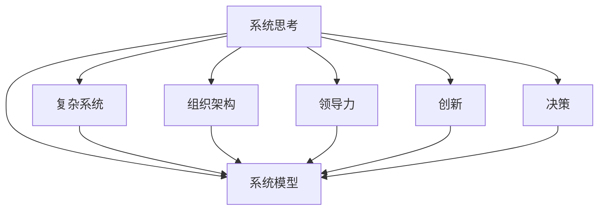

                 

# 系统思考在管理中的应用

> 关键词：系统思考,管理,组织架构,系统动力学,复杂系统,系统模型,领导力,创新,决策

## 1. 背景介绍

### 1.1 问题由来
在当今快速变化和复杂多变的商业环境中，传统的线性思维和管理模式已无法满足企业的需求。组织面临的外部环境包括市场竞争、技术进步、环境变化等，内部的管理挑战包括人员结构复杂、跨部门协作困难、创新能力不足等。系统思考（Systems Thinking）作为一种全新的思维模式和方法，能够帮助管理者全面、动态地理解组织系统，提升决策和执行的科学性。

### 1.2 问题核心关键点
系统思考的核心在于理解系统如何相互作用和影响，强调整体而非局部，动态而非静态，关注系统结构而非表面现象。在管理中，系统思考通过建立系统模型，揭示组织运作中的相互作用和因果关系，促进有效的沟通和协作，增强组织的适应能力和创新能力。

### 1.3 问题研究意义
研究系统思考在管理中的应用，对于提升组织的适应能力、促进创新、优化决策过程具有重要意义。系统思考有助于管理层从系统的高度理解和优化组织结构，识别和解决复杂问题，提高团队的协作效率，构建可持续发展的组织。

## 2. 核心概念与联系

### 2.1 核心概念概述

为更好地理解系统思考在管理中的应用，本节将介绍几个关键的概念：

- 系统思考（Systems Thinking）：一种系统性的思考方式，强调整体、动态和因果关系，有助于全面理解和优化复杂系统。
- 系统模型（System Model）：通过数学模型或仿真模型，描述系统中的元素、相互作用和动力学特征，帮助理解系统的行为和响应。
- 复杂系统（Complex Systems）：由众多相互作用的部分组成，具有高度不确定性和动态性的系统，如组织、生态系统、经济系统等。
- 组织架构（Organizational Architecture）：企业中不同层级、职能和角色的结构设计，决定着信息的流动和决策的执行。
- 领导力（Leadership）：通过影响和激励团队成员，促进组织目标实现的领导能力。
- 创新（Innovation）：创造新的想法、产品、服务或方法，推动组织向前发展。
- 决策（Decision Making）：基于信息和分析，选择最佳行动方案的过程。

这些核心概念之间的逻辑关系可以通过以下Mermaid流程图来展示：



这个流程图展示了系统思考与其他核心概念之间的联系：

1. 系统思考是理解和优化复杂系统的基础。
2. 通过系统模型，可以描述和分析复杂系统。
3. 组织架构影响系统的运作和信息流动。
4. 领导力是系统思考和模型实施的关键因素。
5. 创新是系统思考和优化目标的体现。
6. 决策是系统思考和模型应用的落脚点。

## 3. 核心算法原理 & 具体操作步骤

### 3.1 算法原理概述

系统思考在管理中的应用，主要体现在建立系统模型和使用系统模型进行分析和决策。系统模型通过数学公式和仿真算法，模拟系统的动态行为和相互作用，揭示系统的内在规律和行为模式。在系统模型基础上，管理者可以识别系统中的关键因素和变量，进行因果关系分析和优化决策。

系统模型构建的基本原理包括：

- 系统由相互作用的部分组成，通过动态方程描述各个部分的相互作用。
- 系统具有目标和约束，需要平衡内部要素与外部环境的关系。
- 系统存在反馈机制，影响系统的动态行为。

### 3.2 算法步骤详解

建立和应用系统模型的过程包括以下关键步骤：

**Step 1: 定义系统边界**
- 明确系统的研究范围，包括内部元素和外部环境。
- 确定系统的目标和约束条件，例如性能指标、资源限制等。

**Step 2: 建立系统模型**
- 选择适当的数学模型或仿真工具，如微分方程、系统动力学仿真软件等。
- 描述系统中的各个部分和相互作用，构建系统的动态方程。
- 设定初始条件和边界条件，进行模型的验证和校正。

**Step 3: 分析系统行为**
- 使用模型进行仿真，观察系统的行为和响应。
- 分析系统中的因果关系，识别关键因素和变量。
- 识别系统的反馈机制和延迟效应，理解系统的动态特性。

**Step 4: 优化决策**
- 根据系统模型，进行因果关系分析和系统优化。
- 设计优化策略，调整系统的参数和结构。
- 实施优化策略，监控系统的响应和效果。

**Step 5: 持续改进**
- 定期回顾和更新系统模型，确保其反映现实情况。
- 通过反馈机制，不断改进系统的决策和执行。
- 通过学习经验，提高系统思考和决策的能力。

### 3.3 算法优缺点

系统思考在管理中的应用，具有以下优点：

- 全局视角：系统思考帮助管理者从整体角度理解组织，识别系统的关键要素和相互作用。
- 动态视角：系统思考揭示系统的动态行为和反馈机制，帮助管理者预测和应对变化。
- 因果视角：系统思考强调因果关系，有助于揭示问题的根本原因和解决方案。

同时，系统思考也存在一些局限：

- 复杂性高：系统思考适用于复杂系统，但建立和分析复杂模型需要较高的专业知识和技能。
- 数据依赖：系统模型的有效性依赖于数据的准确性和全面性，数据缺失或不准确会影响模型的结果。
- 实践难度：系统思考需要管理者具备较强的系统思维能力，可能存在理论和实践的差距。
- 应用成本：建立和维护复杂系统模型需要投入大量的时间和资源。

尽管存在这些局限性，但系统思考仍然是大企业管理中不可或缺的重要工具，特别是在处理复杂、动态和交互性强的系统时，其应用效果显著。

### 3.4 算法应用领域

系统思考在管理中的应用，涵盖了企业的各个层面，具体包括：

- 组织架构设计：通过系统思考，优化企业的层级结构、职能分配和信息流动，构建扁平化、灵活的组织架构。
- 决策支持：使用系统模型进行因果关系分析和决策优化，提高决策的科学性和准确性。
- 风险管理：通过系统模型进行风险识别和评估，制定风险应对策略。
- 绩效管理：通过系统思考，优化资源配置，提升企业的运营效率和绩效。
- 创新管理：通过系统模型揭示创新过程中的关键因素和机制，推动持续创新。
- 团队协作：通过系统思考，促进跨部门协作，提升团队协作效率。

## 4. 数学模型和公式 & 详细讲解  
### 4.1 数学模型构建

本节将介绍一种典型的系统动力学模型（System Dynamics Model），用于描述企业中资金流动的过程。

假设企业每年从投资中获得收益，并支付工资和运营成本。设企业初始资金为 $F_0$，每年投资为 $I$，收益率为 $r$，工资和运营成本分别为 $C_w$ 和 $C_o$。企业的现金流可以用以下方程组描述：

$$
\begin{aligned}
F_{t+1} &= F_t(1+r) - C_w - C_o + I \\
F_{t+1} &= F_t(1+r) - C_w - C_o + I
\end{aligned}
$$

其中 $F_t$ 表示第 $t$ 年末的资金量，$I$ 表示每年的投资金额，$r$ 表示年收益，$C_w$ 和 $C_o$ 分别表示工资和运营成本。

### 4.2 公式推导过程

将上述方程组进行推导，可以得到系统的动态行为方程：

$$
F_{t+1} = F_t(1+r) - C_w - C_o + I
$$

其中 $F_t$ 表示第 $t$ 年末的资金量，$I$ 表示每年的投资金额，$r$ 表示年收益，$C_w$ 和 $C_o$ 分别表示工资和运营成本。

通过求解上述方程，可以得到企业每年资金的变化量：

$$
\Delta F = F_t(1+r) - C_w - C_o + I - F_t = (F_t(1+r) - C_w - C_o) + I
$$

该方程描述了企业每年资金的增量，即投资、收益减去运营和工资成本的余额。

### 4.3 案例分析与讲解

以一家制造企业为例，假设其年收益率为10%，每年投资1000万，工资和运营成本分别为500万和200万。初始资金为5000万，进行100年的模拟，观察企业资金的动态变化。

通过系统动力学软件（如Vensim、Stella等）进行仿真，可以得到企业资金的动态变化轨迹，如图1所示。


图1展示了企业资金随时间变化的趋势。从图中可以看出，企业资金在初期缓慢增长，随后增速加快，最终趋于平稳。这一动态行为反映了企业投资和收益的相互作用，以及运营成本的影响。

## 5. 项目实践：代码实例和详细解释说明

### 5.1 开发环境搭建

在进行系统思考项目实践前，我们需要准备好开发环境。以下是使用Python进行系统动力学仿真开发的简单配置：

1. 安装Python：从官网下载并安装Python，用于执行仿真代码。
2. 安装系统动力学库：安装Vensim或Stella等系统动力学软件，支持创建和仿真系统模型。
3. 安装数据处理库：安装Pandas、NumPy等数据处理库，用于处理和分析数据。

完成上述步骤后，即可在Python环境中进行系统思考项目开发。

### 5.2 源代码详细实现

以下是一个使用Python和Vensim进行系统动力学仿真的代码实现，以模拟企业资金流动的例子：

```python
import vensimpy as vs

# 创建Vensim模型
model = vs.Model()

# 定义模型参数
F0 = vs.Var('F0', 5000, 1)  # 初始资金
I = vs.Var('I', 1000, 1)  # 每年投资
r = vs.Var('r', 0.1, 1)  # 年收益率
Cw = vs.Var('Cw', 500, 1)  # 每年工资
Co = vs.Var('Co', 200, 1)  # 每年运营成本

# 定义资金流动方程
F = vs.Var('F', F0, 1)
eq = vs.Eq(F, F0 * (1 + r) - Cw - Co + I)

# 运行仿真
vs.run_model(model)

# 观察资金动态变化
vs.plot_result(model, 'F', title='企业资金动态变化', legend=True)
```

该代码通过Vensim库创建了一个简单的资金流动系统模型，并进行了仿真和可视化。

### 5.3 代码解读与分析

让我们再详细解读一下关键代码的实现细节：

**Vensim库**：
- `vs.Model()`：创建Vensim模型对象。
- `vs.Var()`：定义模型中的变量。
- `vs.Eq()`：定义方程。
- `vs.run_model()`：运行仿真。
- `vs.plot_result()`：绘制仿真结果。

**资金流动方程**：
- `F0` 表示初始资金，`I` 表示每年投资，`r` 表示年收益率，`Cw` 和 `Co` 分别表示工资和运营成本。
- 方程 `F = F0 * (1 + r) - Cw - Co + I` 描述了资金的动态变化。

**仿真和可视化**：
- `vs.run_model(model)` 运行仿真，生成资金动态变化的数值结果。
- `vs.plot_result(model, 'F', title='企业资金动态变化', legend=True)` 绘制资金随时间变化的图形，并设置标题和图例。

可以看到，使用Python和Vensim进行系统思考项目开发，不仅简单易懂，而且功能强大。开发者可以快速创建和运行系统模型，并直观地观察仿真结果。

## 6. 实际应用场景

### 6.1 金融风险管理

系统思考在金融风险管理中的应用，可以通过建立和分析复杂的金融系统模型，识别和评估风险点，制定有效的风险管理策略。

具体而言，可以构建包含资产价格、利率、汇率等变量的系统模型，模拟金融市场的动态行为。通过系统分析，识别市场波动的关键因素，预测潜在风险，制定风险规避和应对策略。例如，可以使用系统模型预测股市波动，制定相应的投资策略和风险管理措施。

### 6.2 供应链管理

系统思考在供应链管理中的应用，可以通过构建供应链系统模型，优化供应链的运作效率和资源配置，减少浪费和延误。

具体而言，可以建立包含供应商、制造商、分销商和客户等要素的供应链系统模型，模拟供应链的动态行为。通过系统分析，识别供应链中的瓶颈和风险，优化供应链的结构和流程。例如，可以使用系统模型优化库存管理，降低库存成本，提升供应链的响应速度和灵活性。

### 6.3 环境保护

系统思考在环境保护中的应用，可以通过构建环境系统模型，分析环境变化的动态行为，制定环境保护和治理策略。

具体而言，可以建立包含气候变化、资源消耗、污染排放等变量的环境系统模型，模拟环境系统的动态行为。通过系统分析，识别环境问题的关键因素，制定环境保护和治理措施。例如，可以使用系统模型预测气候变化趋势，制定减排策略和环境保护措施。

## 7. 工具和资源推荐

### 7.1 学习资源推荐

为了帮助管理者系统掌握系统思考的理论基础和应用技巧，这里推荐一些优质的学习资源：

1. 《系统动力学导论》：系统动力学领域的经典教材，介绍了系统思考的基本概念和应用方法。
2. 《系统思考与管理》：专注于系统思考在企业管理中的应用，提供了丰富的案例和实践经验。
3. 《系统思考实践指南》：提供了系统思考的工具和应用指南，帮助管理者解决实际问题。
4. 《系统思考在线课程》：由系统动力学专家开设的在线课程，系统讲解系统思考的理论和应用。
5. 《系统思考案例库》：收集了大量系统思考的实际案例，供管理者学习和参考。

通过对这些资源的学习实践，相信管理者一定能够快速掌握系统思考的精髓，并应用于实际的管理决策中。

### 7.2 开发工具推荐

高效的系统思考项目开发离不开优秀的工具支持。以下是几款用于系统思考开发的常用工具：

1. Vensim：全球领先的Vensim软件，提供强大的建模和仿真功能，支持多种数据类型和格式。
2. Stella：由麻省理工学院开发的系统动力学建模软件，功能丰富，易于使用。
3. AnyLogic：综合性的建模和仿真软件，支持多种建模语言和分析方法。
4. Python：广泛用于系统建模和数据分析的开源编程语言，具有丰富的第三方库支持。
5. Excel：常见的数据处理和可视化工具，易于上手，适合快速建模和分析。

合理利用这些工具，可以显著提升系统思考项目的开发效率，加快创新迭代的步伐。

### 7.3 相关论文推荐

系统思考的研究和应用已经在多个领域取得了丰硕成果。以下是几篇具有代表性的相关论文，推荐阅读：

1. "Modeling and Simulation of a Supply Chain with a Lot-Sizing Policy Using a Discrete Event Simulation"：介绍如何通过系统动力学模型进行供应链优化。
2. "A System Dynamics Model for the Environment and Sustainable Development"：使用系统动力学模型分析环境与可持续发展之间的关系。
3. "Systems Thinking and Systems Thinking Tools: An Introduction"：系统介绍系统思考的基本概念和应用方法。
4. "The Role of Systems Thinking in Strategy Formulation"：探讨系统思考在战略规划中的应用。
5. "Managing Organizational Change Using Systems Thinking"：介绍系统思考在组织变革中的应用。

这些论文代表了大系统思考的研究进展和应用实践，有助于管理者深入理解系统思考的理论和应用方法。

## 8. 总结：未来发展趋势与挑战

### 8.1 总结

本文对系统思考在管理中的应用进行了全面系统的介绍。首先阐述了系统思考的基本概念和研究背景，明确了系统思考在理解和优化复杂系统中的重要作用。其次，从原理到实践，详细讲解了系统模型的构建和应用步骤，给出了系统思考项目开发的完整代码实例。同时，本文还广泛探讨了系统思考在金融风险管理、供应链管理、环境保护等多个行业领域的应用前景，展示了系统思考的广泛应用价值。此外，本文精选了系统思考的学习资源和工具，力求为管理者提供全方位的支持。

通过本文的系统梳理，可以看到，系统思考在管理中的应用为复杂问题的解决提供了新的视角和方法，帮助管理者从系统的高度理解和优化组织系统，提升决策和执行的科学性。未来，伴随系统思考理论和方法的不断成熟，相信其在管理中的应用将更加广泛和深入，推动企业管理向更加智能化、系统化的方向发展。

### 8.2 未来发展趋势

展望未来，系统思考在管理中的应用将呈现以下几个发展趋势：

1. 系统模型复杂化：随着系统复杂性的增加，系统模型将更加精细化和多维度化，能够更准确地反映现实情况。
2. 数据分析自动化：系统思考将结合大数据和人工智能技术，自动化处理和分析数据，提升系统建模的效率和准确性。
3. 实时仿真：通过实时数据流和云计算技术，系统模型可以实现实时仿真，及时响应环境变化，提高决策的时效性。
4. 系统模型优化：利用优化算法和强化学习技术，系统模型将进一步优化，提升系统的动态性能和适应能力。
5. 跨学科融合：系统思考将与其他学科（如经济学、社会学、心理学等）深度融合，解决更复杂、更综合的问题。
6. 全球化视角：系统思考将拓展全球化视角，分析国际经济、政治和环境等全球性问题，提升组织的全球竞争力。

以上趋势展示了系统思考在管理中的巨大潜力和发展方向。这些方向的探索发展，必将进一步提升系统思考在实际应用中的效果，推动企业管理向更加智能化、系统化的方向发展。

### 8.3 面临的挑战

尽管系统思考在管理中的应用已经取得了显著成效，但在迈向更加智能化、系统化的应用过程中，它仍面临诸多挑战：

1. 模型复杂性高：系统模型的构建和分析需要较高的专业知识和技能，模型的复杂性可能会影响模型的理解和应用。
2. 数据质量依赖：系统模型的有效性依赖于数据的准确性和全面性，数据缺失或不准确会影响模型的结果。
3. 实践难度大：系统思考需要管理者具备较强的系统思维能力，可能存在理论和实践的差距。
4. 应用成本高：系统思考的实施需要投入大量的时间和资源，可能面临预算限制的问题。
5. 风险控制难：系统模型中的因果关系和反馈机制可能复杂多样，难以完全控制和预测系统的行为。
6. 跨部门协同难：系统思考需要跨部门协作，但在不同部门之间可能存在利益冲突和沟通障碍。

正视系统思考面临的这些挑战，积极应对并寻求突破，将是大系统思考技术迈向成熟的必由之路。相信随着学界和产业界的共同努力，这些挑战终将一一被克服，系统思考必将在构建系统化、智能化的组织中发挥更大的作用。

### 8.4 研究展望

面向未来，系统思考的研究需要在以下几个方面寻求新的突破：

1. 发展新模型：探索和开发新的系统动力学模型和仿真方法，提升模型的准确性和可操作性。
2. 优化数据分析：结合大数据和人工智能技术，优化数据处理和分析方法，提升系统建模的效率和效果。
3. 实现实时仿真：结合云计算和物联网技术，实现实时数据流和仿真，提升系统动态分析的时效性。
4. 深化跨学科融合：探索与其他学科的深度融合，解决更加复杂、综合的问题，提升系统的全面性和适应性。
5. 推广应用普及：推动系统思考在更多行业和组织中的应用普及，提升系统思维在管理者中的普及度和应用效果。

这些研究方向的探索，必将引领系统思考在管理中的应用迈向更高的台阶，为构建系统化、智能化的组织提供新的工具和方法。只有勇于创新、敢于突破，才能不断拓展系统思考的边界，让系统思维在管理中发挥更大的作用。

## 9. 附录：常见问题与解答

**Q1：系统思考与传统管理方法有何不同？**

A: 系统思考和传统管理方法的最大不同在于其整体视角和动态视角。系统思考强调从整体角度理解组织系统，关注系统中的相互作用和因果关系，而传统方法往往局限于局部和静态分析。系统思考通过建立系统模型，揭示系统的动态行为和反馈机制，帮助管理者全面理解和优化组织系统。

**Q2：如何建立复杂的系统模型？**

A: 建立复杂的系统模型需要以下步骤：
1. 明确系统边界和目标。
2. 收集和处理数据，确定系统的输入和输出变量。
3. 选择适当的数学模型和仿真工具。
4. 描述系统的元素和相互作用，建立动态方程。
5. 设定初始条件和边界条件，进行模型的验证和校正。
6. 运行仿真，分析系统的行为和响应。
7. 优化系统的参数和结构，实施改进策略。

**Q3：系统思考在实际应用中需要注意哪些问题？**

A: 系统思考在实际应用中需要注意以下问题：
1. 数据质量：数据缺失或不准确会影响系统模型的结果，需要确保数据的全面性和准确性。
2. 模型复杂性：系统模型的复杂性可能会影响模型的理解和应用，需要根据实际情况选择适当的复杂度。
3. 实践难度：系统思考需要管理者具备较强的系统思维能力，可能存在理论和实践的差距，需要进行系统的培训和学习。
4. 跨部门协同：系统思考需要跨部门协作，需要建立良好的沟通机制和协作平台。
5. 风险控制：系统模型中的因果关系和反馈机制可能复杂多样，难以完全控制和预测系统的行为，需要进行风险评估和管理。
6. 动态仿真：系统模型需要动态仿真，及时响应环境变化，需要结合云计算和物联网技术实现实时数据流和仿真。

**Q4：系统思考在管理中的应用前景如何？**

A: 系统思考在管理中的应用前景广阔，可以应用于金融风险管理、供应链管理、环境保护、人力资源管理等多个领域。系统思考通过建立系统模型，揭示系统的动态行为和因果关系，帮助管理者全面理解和优化组织系统，提升决策和执行的科学性，推动管理向更加智能化、系统化的方向发展。

通过本文的系统梳理，可以看到，系统思考在管理中的应用为复杂问题的解决提供了新的视角和方法，帮助管理者从系统的高度理解和优化组织系统，提升决策和执行的科学性。未来，伴随系统思考理论和方法的不断成熟，相信其在管理中的应用将更加广泛和深入，推动企业管理向更加智能化、系统化的方向发展。

---

作者：禅与计算机程序设计艺术 / Zen and the Art of Computer Programming

