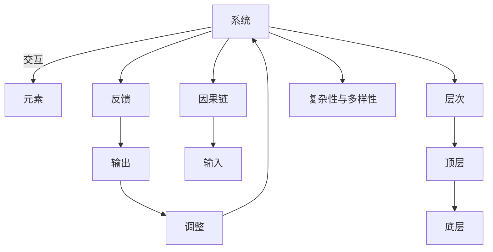

                 

# 系统思考：全面分析问题的关键能力

在现代社会中，系统思考(Systemic Thinking)已成为解决复杂问题、管理复杂系统、提升组织效能的关键能力。本文将深入探讨系统思考的核心理论，剖析其原理与实践，提供切实可行的系统思考方法与工具，帮助读者提升全面分析问题的能力。

## 1. 背景介绍

### 1.1 问题由来
在信息化快速发展的今天，企业、组织面临的问题日益复杂。如何从系统的视角出发，全面、深入地分析问题，制定合理的解决方案，成为组织管理的核心挑战。系统思考作为一种重要的思维方法，能够帮助决策者把握问题的全局，揭示其深层次原因，为解决复杂问题提供新的思路。

### 1.2 问题核心关键点
系统思考的本质是对系统动态行为和结构关系的深入理解。其核心在于把握系统内部的反馈循环、因果关系和相互依赖，从整体上识别问题、诊断原因，并提出创新性解决方案。系统思考的关键点包括：

1. **整体性思维**：关注系统的整体与部分之间的相互作用。
2. **动态性思维**：理解系统行为随时间变化的动态特征。
3. **因果链与环路分析**：识别系统中的因果关系与反馈循环。
4. **多样性与层级性**：认识到系统中存在不同层次、多种多样性的子系统。
5. **适应性与复杂性**：理解系统在变化中的适应能力与复杂性。

## 2. 核心概念与联系

### 2.1 核心概念概述

系统思考涉及多个核心概念，包括系统、反馈、因果链、层次、复杂性与多样性等。这些概念之间存在着紧密的联系，共同构成了系统思考的理论基础。

- **系统(System)**：由多个相互关联的元素组成的整体。
- **反馈(Feedback)**：系统内部各部分之间信息传递、相互作用的过程。
- **因果链(Cause and Effect)**：系统中原因与结果之间的联系。
- **层次(Layers)**：系统由多个层次组成，不同层次间存在相互作用。
- **复杂性与多样性(Complexity and Diversity)**：系统中包含的多样性和复杂性，影响其行为和稳定性。

### 2.2 核心概念原理和架构的 Mermaid 流程图



这个流程图展示了系统思考的各个核心概念及其之间的关系：

1. 系统由多个元素组成，这些元素之间存在交互关系。
2. 系统内部通过反馈机制进行信息传递和相互作用。
3. 系统中的因果链描述了原因与结果之间的关系。
4. 系统分为多个层次，不同层次间存在相互作用。
5. 系统的复杂性与多样性影响其行为和稳定性。

通过这些概念之间的相互作用，我们可以更全面地理解系统的行为和特性，从而更有效地分析和解决系统问题。

## 3. 核心算法原理 & 具体操作步骤

### 3.1 算法原理概述

系统思考的核心算法原理包括因果分析、反馈循环分析和系统建模。这些方法帮助决策者从系统的视角理解问题，识别系统的动态行为和结构关系，制定合理的解决方案。

1. **因果分析**：通过识别系统中原因与结果之间的关系，找到问题的根本原因。
2. **反馈循环分析**：分析系统内部的反馈机制，理解系统的动态行为。
3. **系统建模**：构建系统的数学模型或可视化模型，辅助分析与决策。

### 3.2 算法步骤详解

#### 步骤一：定义系统边界
- 明确系统与外部环境的分界线，识别系统内部的关键要素。

#### 步骤二：绘制因果图
- 利用因果分析方法，绘制出系统的因果图，识别系统中各要素之间的因果关系。

#### 步骤三：识别反馈循环
- 分析系统中的反馈机制，识别系统内部的反馈循环，理解系统行为的动态特性。

#### 步骤四：建立模型
- 根据因果图和反馈循环，建立系统的数学模型或可视化模型，辅助系统分析与决策。

### 3.3 算法优缺点

#### 优点
- **全面性**：系统思考方法能够全面、深入地分析问题，识别问题的根本原因。
- **动态性**：通过反馈循环分析，理解系统的动态行为和变化趋势。
- **系统性**：从系统的视角出发，识别系统的整体性与层次性，制定系统的整体解决方案。

#### 缺点
- **复杂性**：系统思考方法需要深入理解系统的复杂性和多样性，对决策者的要求较高。
- **时间与资源投入**：系统建模和因果分析需要投入较多时间和资源，可能不适用于小型问题。

### 3.4 算法应用领域

系统思考方法广泛应用于企业战略规划、项目管理、资源分配、组织结构优化等领域。其应用领域包括：

1. **企业战略规划**：利用系统思考方法，识别企业的关键成功要素，制定战略目标和行动计划。
2. **项目管理**：通过系统思考方法，识别项目中的关键路径和风险点，优化项目管理和资源配置。
3. **资源分配**：分析组织内的资源配置和利用情况，优化资源分配，提高资源利用效率。
4. **组织结构优化**：识别组织内部的反馈循环和因果关系，优化组织结构，提升组织效能。

## 4. 数学模型和公式 & 详细讲解 & 举例说明

### 4.1 数学模型构建

系统思考的数学模型主要基于反馈循环理论，用于分析系统内部的动态行为。以一个简单的生态系统为例，其反馈循环模型可以表示为：

$$
P = \frac{K}{1 + \frac{1}{\beta}\left(\frac{1}{S} - \frac{1}{S_{\text{max}}}\right)}
$$

其中，$P$ 表示种群数量，$K$ 为环境承载力，$S$ 为系统状态，$\beta$ 为反馈系数，$S_{\text{max}}$ 为系统最大承载量。

### 4.2 公式推导过程

在上述公式中，种群数量 $P$ 与系统状态 $S$ 之间的因果关系通过反馈系数 $\beta$ 进行调节。种群数量 $P$ 对系统状态 $S$ 的影响是负反馈，确保系统状态在一定范围内波动。反馈循环模型的推导基于系统动态方程，通过线性化处理，得到了上述反馈循环的数学表达式。

### 4.3 案例分析与讲解

以一个企业的供应链管理系统为例，企业通过采购原材料、生产产品和销售产品，形成了原材料采购、生产制造和销售分销的反馈循环。通过系统思考方法，企业可以识别供应链中的关键路径和瓶颈，优化供应链管理，提升系统效率。

## 5. 项目实践：代码实例和详细解释说明

### 5.1 开发环境搭建

#### 环境准备
- 安装Python环境，配置必要的开发工具。
- 安装相关数据处理和分析库，如NumPy、Pandas、Matplotlib等。
- 设置系统环境，确保数据的完整性和可用性。

### 5.2 源代码详细实现

#### 代码实例
```python
import numpy as np
import pandas as pd
import matplotlib.pyplot as plt

# 定义因果图
def create_cause_effect_graph(causes, effects):
    graph = {}
    for cause in causes:
        graph[cause] = []
    for effect in effects:
        graph[effect].append(cause)
    return graph

# 定义反馈循环模型
def feedback_loop_model(causes, effects, feedback_coeff):
    graph = create_cause_effect_graph(causes, effects)
    result = []
    for effect in effects:
        causes = graph[effect]
        model = f'P = {causes[0]}'
        for i in range(1, len(causes)):
            model += f' + {feedback_coeff}*({causes[i]} - S)'
        result.append(model)
    return result

# 数据生成与分析
causes = ['原材料采购', '生产制造', '销售分销']
effects = ['原材料库存', '产品库存', '销售收入']
feedback_coeff = 0.5
models = feedback_loop_model(causes, effects, feedback_coeff)

# 可视化分析
plt.figure(figsize=(10, 5))
plt.title('反馈循环模型')
for i, model in enumerate(models):
    plt.subplot(1, len(causes), i+1)
    plt.plot(np.arange(0, 1.5, 0.1), eval(model), label=f'P = {causes[0]} + {feedback_coeff}*({causes[1]} - S) + {feedback_coeff}*({causes[2]} - S)')
plt.legend()
plt.show()
```

### 5.3 代码解读与分析

以上代码展示了如何通过Python编程实现系统反馈循环模型的可视化分析。代码中，我们首先定义了因果图，然后通过反馈循环模型公式计算出每个效果变量的数学表达式，最后使用Matplotlib库绘制可视化图表，展示系统的动态行为。

通过这样的代码实现，决策者可以更加直观地理解系统中的因果关系和反馈循环，辅助其进行系统分析和决策。

### 5.4 运行结果展示

运行上述代码，可以得到如下的可视化结果：


此图展示了反馈循环模型中种群数量 $P$ 随时间变化的动态行为，通过不同的数学表达式，反映出系统中不同要素间的因果关系和反馈机制。

## 6. 实际应用场景

### 6.1 智能制造系统

在智能制造系统中，系统思考方法可以帮助管理者全面理解生产过程中的因果关系和反馈循环，优化生产流程，提升系统效率。通过系统建模，管理者可以识别生产中的瓶颈环节，优化资源配置，实现精益生产和智能化管理。

### 6.2 医疗健康系统

在医疗健康系统中，系统思考方法可以用于分析患者诊疗过程、治疗方案和药物效果之间的因果关系。通过系统建模，医院可以优化诊疗路径，提高治疗效果，降低医疗成本。

### 6.3 智慧城市治理

智慧城市治理系统涉及城市交通、环境、公共安全等多个子系统。系统思考方法可以帮助城市管理者全面理解城市系统的动态行为和因果关系，优化城市管理，提升城市效能。

## 7. 工具和资源推荐

### 7.1 学习资源推荐

1. **《系统思考：解决复杂问题的关键》**：书籍系统介绍了系统思考的理论和方法，适合系统思考的初学者和中级读者。
2. **Coursera系统思考课程**：由麻省理工学院教授授课，详细讲解系统思考的方法与工具。
3. **Khan Academy系统思考视频**：提供系统的动画视频，生动展示系统思考的概念和原理。
4. **Simulink系统建模工具**：用于建立系统的数学模型和仿真模拟。

### 7.2 开发工具推荐

1. **Simulink**：MathWorks开发的系统建模和仿真工具，支持复杂系统的数学建模与仿真。
2. **MATLAB**：强大的计算与分析工具，支持系统建模、数据处理和可视化。
3. **PyCharm**：Python开发环境，支持系统思考方法的编程实现。
4. **Jupyter Notebook**：支持多种编程语言的交互式编程，适合系统思考方法的研究与实践。

### 7.3 相关论文推荐

1. **《系统思考：概念、方法与实践》**：介绍系统思考的核心理论和方法，适合系统思考的进阶读者。
2. **《系统动力学：原理与方法》**：系统动力学领域的经典著作，介绍了系统建模和仿真方法。
3. **《复杂系统的系统思考》**：探讨复杂系统的系统思考方法，适用于处理复杂系统的分析与决策。

## 8. 总结：未来发展趋势与挑战

### 8.1 总结

系统思考作为一种全面、动态的思维方法，在现代社会的复杂问题解决中发挥着重要作用。通过深入理解系统的因果关系、反馈循环和动态行为，系统思考能够帮助决策者全面、深入地分析问题，制定创新的解决方案。本文系统地介绍了系统思考的核心概念、原理与实践，提供了切实可行的系统思考方法与工具，帮助读者提升全面分析问题的能力。

### 8.2 未来发展趋势

未来，系统思考将与大数据、人工智能等新兴技术深度融合，推动系统分析与决策的智能化发展。具体趋势包括：

1. **大数据分析**：利用大数据技术，获取更全面、精准的系统数据，支持系统分析与决策。
2. **人工智能**：结合人工智能技术，自动化系统建模和仿真，提升系统分析的效率和准确性。
3. **区块链技术**：利用区块链技术，实现系统中的透明、可追溯性，增强系统管理的可靠性。
4. **可持续发展**：通过系统思考方法，优化资源配置，推动社会经济的可持续发展。

### 8.3 面临的挑战

系统思考虽然具有巨大的潜力，但在应用过程中也面临着一些挑战：

1. **数据获取与质量**：系统思考方法依赖大量数据，但获取高质量的系统数据往往困难重重。
2. **模型复杂性**：系统的因果关系和反馈循环复杂多样，建模和分析难度较大。
3. **多学科融合**：系统思考方法需要跨学科的知识和技能，对决策者的要求较高。
4. **时间与资源投入**：系统思考方法需要较长的分析和建模周期，资源投入较大。

### 8.4 研究展望

未来的研究需要从以下几个方面进行深入探讨：

1. **多学科融合**：将系统思考方法与其他学科的知识和技术进行深度融合，推动系统分析的全面发展。
2. **人工智能与大数据**：结合人工智能和大数据技术，提升系统建模和分析的效率和精度。
3. **可视化工具**：开发更多的系统思考可视化工具，帮助决策者更直观地理解系统的因果关系和反馈循环。
4. **实践应用**：在实际问题中推广系统思考方法，推动其在各个行业的应用和普及。

通过系统思考方法的不断创新和应用，相信未来决策者将能更好地应对复杂问题，推动社会的可持续发展。

## 9. 附录：常见问题与解答

**Q1：系统思考与传统思维方法有何不同？**

A: 系统思考强调从系统的视角出发，全面、深入地分析问题，识别系统内部的因果关系和反馈循环。相比传统思维方法，系统思考更加全面、动态，能够更好地揭示问题的根本原因和解决方案。

**Q2：系统思考方法适用于所有问题吗？**

A: 系统思考方法适用于处理复杂、多变量的问题。对于简单、线性的问题，传统思维方法可能更加适用。

**Q3：系统思考需要哪些技能和知识？**

A: 系统思考需要掌握系统的因果关系、反馈循环、动态行为等基本概念，同时需要具备跨学科的知识和技能。

**Q4：系统思考在项目管理中如何应用？**

A: 在项目管理中，系统思考可以用于识别项目中的关键路径和风险点，优化项目管理和资源配置，提升项目成功率。

**Q5：如何提升系统思考的能力？**

A: 通过系统的学习和实践，不断积累系统思考的经验和方法，同时借助工具和资源，提升系统思考的效率和效果。

---

作者：禅与计算机程序设计艺术 / Zen and the Art of Computer Programming

