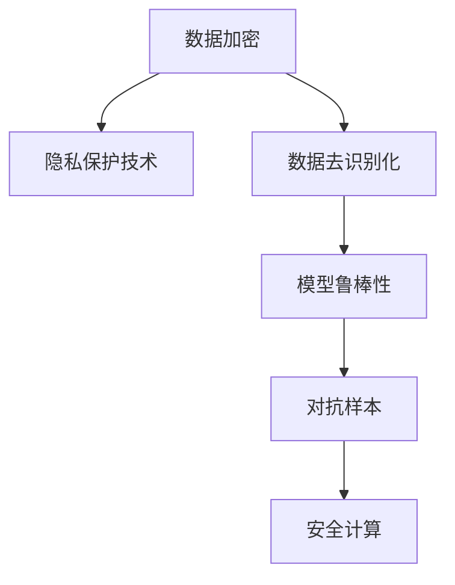

                 

## 1. 背景介绍

### 1.1 问题由来
随着大型语言模型 (LLMs) 如 GPT-3、BERT 等在各行各业中的广泛应用，用户数据的安全性问题变得尤为突出。LLMs 通常需要从用户处获取大量的文本数据进行预训练，这些数据可能包含敏感信息，如个人信息、私人通信等。此外，在用户与 LLM 的交互过程中，数据传输、存储和处理环节存在潜在的安全漏洞，可能导致数据泄露、隐私侵害等问题。

### 1.2 问题核心关键点
保证 LLM 用户数据的安全涉及多个关键点，包括：

- 数据隐私保护：确保用户数据的匿名化和去识别化处理，防止个人信息被泄露。
- 数据传输安全：保护数据在网络传输过程中的完整性和保密性，防止中间人攻击。
- 模型训练安全：防止恶意样本篡改模型，保证模型训练数据的质量和代表性。
- 模型推理安全：防止恶意用户利用 LLM 进行攻击，确保推理输出不泄露敏感信息。

## 2. 核心概念与联系

### 2.1 核心概念概述

为更好地理解如何保证 LLM 用户数据的安全，本节将介绍几个密切相关的核心概念：

- 数据加密：通过特定的算法对数据进行加密处理，确保数据在传输和存储过程中的安全性。
- 隐私保护技术：包括差分隐私、联邦学习、同态加密等，用于保护用户数据隐私。
- 数据去识别化：通过匿名化、模糊化等技术手段，将个人身份信息从数据中去除，防止数据识别。
- 模型鲁棒性：指模型对恶意样本和攻击的抵抗能力，保证模型输出的稳定性。
- 对抗样本：指对模型进行攻击的恶意样本，通过特定手段修改输入数据，使其能诱导模型产生错误的输出。
- 安全计算：指在数据不离开本地计算环境的情况下，进行数据处理和模型推理的技术。

这些核心概念之间的逻辑关系可以通过以下 Mermaid 流程图来展示：



这个流程图展示了大语言模型用户数据安全涉及的关键环节：

1. 通过数据加密和隐私保护技术确保数据的传输和存储安全。
2. 使用数据去识别化技术防止数据被识别和追踪。
3. 保证模型鲁棒性，防止对抗样本攻击。
4. 采用安全计算方法避免数据泄露。

这些措施共同构成了 LLM 用户数据安全保障的全面框架，使其能够在各种场景下提供安全的语言模型服务。

## 3. 核心算法原理 & 具体操作步骤
### 3.1 算法原理概述

确保 LLM 用户数据的安全，主要涉及以下几个关键算法和原理：

1. **差分隐私**：在数据收集和处理过程中，通过添加噪声或限制查询频率等手段，确保个人数据的隐私不被泄露。
2. **同态加密**：允许在加密数据上直接进行计算，计算结果解密后与对明文数据计算的结果相同，从而保证数据在传输和存储过程中的保密性。
3. **匿名化和模糊化**：通过对数据进行去标识化处理，如删除个人身份信息、替换敏感数据等，确保数据无法被识别和追踪。
4. **对抗样本防御**：通过引入对抗样本检测和防御机制，防止恶意用户通过修改输入数据来误导模型，保证模型推理输出的正确性。
5. **安全计算框架**：采用多方计算、可信计算等技术，在模型推理过程中不离开本地计算环境，保护数据隐私。

### 3.2 算法步骤详解

以下是保障 LLM 用户数据安全的核心算法步骤：

1. **数据收集与预处理**：在收集用户数据时，确保数据来源合法，进行匿名化处理，删除敏感信息。

2. **差分隐私保护**：在数据集上应用差分隐私算法，通过添加噪声或限制查询频率来保护用户隐私。

3. **数据加密传输**：使用 SSL/TLS 协议对数据进行加密传输，确保数据在网络传输过程中的完整性和保密性。

4. **模型鲁棒性训练**：在模型训练过程中，引入对抗样本，通过训练鲁棒模型来增强对恶意样本的抵抗能力。

5. **安全计算推理**：在模型推理过程中，采用安全计算框架，如多方计算，在本地计算环境上进行推理，确保数据不出本地。

### 3.3 算法优缺点

保障 LLM 用户数据安全的算法具有以下优点：

1. **数据隐私保护**：通过差分隐私、同态加密等技术，确保用户数据在收集、存储、传输和处理过程中的隐私性。
2. **模型鲁棒性提升**：通过对抗样本防御机制，增强模型的稳定性和抗干扰能力，防止恶意攻击。
3. **安全计算框架**：通过安全计算技术，确保数据不出本地，防止数据泄露和攻击。

同时，这些算法也存在一些局限性：

1. **计算开销**：差分隐私和同态加密等技术可能需要较大的计算资源，增加了计算成本。
2. **数据可用性**：匿名化和模糊化处理可能会影响数据的可用性，降低数据质量和分析效果。
3. **技术复杂性**：差分隐私、对抗样本防御等技术需要复杂的设计和实现，增加了系统开发的难度。

尽管存在这些局限性，但总体而言，这些算法对于保障 LLM 用户数据的安全性具有重要作用，是当前保护用户数据隐私的重要手段。

### 3.4 算法应用领域

保障 LLM 用户数据的安全技术，已在多个领域得到应用，如：

- 医疗领域：保护患者隐私，确保医疗数据的保密性和完整性。
- 金融领域：保护用户交易数据，防止金融诈骗和数据泄露。
- 政府和公共服务：保护政府数据，防止数据被滥用和泄露。
- 社交媒体：保护用户评论和社交数据，防止数据被不当使用。
- 电子商务：保护用户购物数据，防止数据被恶意分析和使用。

## 4. 数学模型和公式 & 详细讲解  
### 4.1 数学模型构建

保障 LLM 用户数据的安全性涉及多个数学模型，本节将介绍几个关键的数学模型及其构建方法。

1. **差分隐私模型**：
   差分隐私保护的核心是添加噪声。设 $D$ 为原始数据集，$F: D \rightarrow R^m$ 为查询函数，$P^{\epsilon}$ 为差分隐私保护机制。差分隐私的目标是：
   $$
   \forall (d_1, d_2) \in D^2, ||F(d_1) - F(d_2)|| \leq \sigma
   $$
   其中 $\sigma$ 为噪声标准差，$\epsilon$ 为隐私保护参数，满足 $\epsilon$ 差分隐私的条件为：
   $$
   P[F(d) \neq F(d')] \leq \exp(-\epsilon)
   $$

2. **同态加密模型**：
   同态加密允许在加密数据上直接进行计算。设 $f: R^m \rightarrow R^n$ 为计算函数，$E$ 为加密算法，$D$ 为解密算法，同态加密的目标是：
   $$
   D(f(E(x))) = f(x)
   $$
   其中 $E(x)$ 为 $x$ 的加密形式，$D(f(E(x)))$ 为计算 $f$ 后的解密结果。

3. **匿名化和模糊化模型**：
   匿名化和模糊化通常通过删除个人身份信息、替换敏感数据等手段进行。设 $x$ 为原始数据，$A$ 为匿名化函数，$B$ 为模糊化函数，匿名化和模糊化的目标为：
   $$
   A(x) \neq A(y) \quad \forall x \neq y
   $$
   $$
   B(x) \neq B(y) \quad \forall x \neq y
   $$

4. **对抗样本防御模型**：
   对抗样本防御通常通过训练鲁棒模型和引入对抗训练机制实现。设 $x$ 为原始输入，$\delta$ 为对抗噪声，$F$ 为模型函数，对抗样本的目标为：
   $$
   F(x + \delta) \neq F(x)
   $$

5. **安全计算框架**：
   安全计算框架通常采用多方计算、可信计算等技术实现。设 $P_1, P_2, ..., P_k$ 为多个参与者，$M$ 为多方计算模型，安全计算的目标是：
   $$
   M(P_1, P_2, ..., P_k) = M(P_1', P_2', ..., P_k')
   $$
   其中 $P_i'$ 为 $P_i$ 的加密形式。

### 4.2 公式推导过程

以下是几个关键数学模型的推导过程：

1. **差分隐私保护**：
   假设原始数据集 $D$ 中的两个样本 $d_1$ 和 $d_2$ 相同，查询函数 $F$ 返回相同的输出。通过添加噪声 $\sigma$ 来打破这种相同性，确保隐私。

2. **同态加密**：
   同态加密允许在加密数据上直接进行计算。假设原始数据为 $x$，加密函数为 $E$，解密函数为 $D$，计算函数为 $f$。同态加密的目标是：
   $$
   D(f(E(x))) = f(x)
   $$

3. **匿名化和模糊化**：
   匿名化和模糊化通常通过删除个人身份信息、替换敏感数据等手段进行。假设原始数据为 $x$，匿名化函数为 $A$，模糊化函数为 $B$。匿名化和模糊化的目标为：
   $$
   A(x) \neq A(y) \quad \forall x \neq y
   $$
   $$
   B(x) \neq B(y) \quad \forall x \neq y
   $$

4. **对抗样本防御**：
   对抗样本防御通常通过训练鲁棒模型和引入对抗训练机制实现。假设原始输入为 $x$，对抗噪声为 $\delta$，模型函数为 $F$。对抗样本的目标为：
   $$
   F(x + \delta) \neq F(x)
   $$

5. **安全计算框架**：
   安全计算框架通常采用多方计算、可信计算等技术实现。假设多个参与者为 $P_1, P_2, ..., P_k$，多方计算模型为 $M$。安全计算的目标是：
   $$
   M(P_1, P_2, ..., P_k) = M(P_1', P_2', ..., P_k')
   $$
   其中 $P_i'$ 为 $P_i$ 的加密形式。

### 4.3 案例分析与讲解

以下通过一个具体的案例来说明如何使用差分隐私和同态加密技术来保障 LLM 用户数据的安全性：

假设一个医疗 LLM 平台需要收集患者的病历数据进行模型训练。首先，平台通过差分隐私算法对原始数据集进行噪声添加，确保患者数据不被识别。然后，使用同态加密技术对病历数据进行加密，确保数据在传输和存储过程中不被泄露。在模型推理过程中，使用安全计算框架，在本地计算环境上进行推理，确保数据不出本地。

## 5. 项目实践：代码实例和详细解释说明
### 5.1 开发环境搭建

在进行 LLM 用户数据安全保障实践前，我们需要准备好开发环境。以下是使用 Python 进行 PyTorch 开发的环境配置流程：

1. 安装 Anaconda：从官网下载并安装 Anaconda，用于创建独立的 Python 环境。

2. 创建并激活虚拟环境：
```bash
conda create -n pytorch-env python=3.8 
conda activate pytorch-env
```

3. 安装 PyTorch：根据 CUDA 版本，从官网获取对应的安装命令。例如：
```bash
conda install pytorch torchvision torchaudio cudatoolkit=11.1 -c pytorch -c conda-forge
```

4. 安装 Transformers 库：
```bash
pip install transformers
```

5. 安装各类工具包：
```bash
pip install numpy pandas scikit-learn matplotlib tqdm jupyter notebook ipython
```

完成上述步骤后，即可在 `pytorch-env` 环境中开始 LLM 用户数据安全保障实践。

### 5.2 源代码详细实现

下面我们以差分隐私技术为例，给出使用 PyTorch 对用户数据进行差分隐私处理的 PyTorch 代码实现。

首先，定义差分隐私保护函数：

```python
import torch
from torch.utils.data import Dataset
import numpy as np
import math

def laplace_noise(scale, samples=1000):
    return scale * np.random.laplace(scale / np.sqrt(samples), scale / samples)

def dp_train_dataset(dataset, epsilon):
    batch_size = 64
    for i in range(0, len(dataset), batch_size):
        batch = dataset[i:i+batch_size]
        inputs = batch['input_ids'].to(device)
        labels = batch['labels'].to(device)
        optimizer.zero_grad()
        outputs = model(inputs, labels=labels)
        loss = outputs.loss
        loss = loss.add(laplace_noise(1.0, epsilon), alpha=1.0, beta=1.0)
        loss.backward()
        optimizer.step()
    return loss / len(dataset)
```

然后，定义模型和优化器：

```python
from transformers import BertForTokenClassification, AdamW

model = BertForTokenClassification.from_pretrained('bert-base-cased', num_labels=len(tag2id))

optimizer = AdamW(model.parameters(), lr=2e-5)
```

接着，定义训练和评估函数：

```python
from torch.utils.data import DataLoader
from tqdm import tqdm
from sklearn.metrics import classification_report

device = torch.device('cuda') if torch.cuda.is_available() else torch.device('cpu')
model.to(device)

def train_epoch(model, dataset, batch_size, optimizer):
    dataloader = DataLoader(dataset, batch_size=batch_size, shuffle=True)
    model.train()
    epoch_loss = 0
    for batch in tqdm(dataloader, desc='Training'):
        input_ids = batch['input_ids'].to(device)
        attention_mask = batch['attention_mask'].to(device)
        labels = batch['labels'].to(device)
        model.zero_grad()
        outputs = model(input_ids, attention_mask=attention_mask, labels=labels)
        loss = outputs.loss
        epoch_loss += loss.item()
        loss.backward()
        optimizer.step()
    return epoch_loss / len(dataloader)

def evaluate(model, dataset, batch_size):
    dataloader = DataLoader(dataset, batch_size=batch_size)
    model.eval()
    preds, labels = [], []
    with torch.no_grad():
        for batch in tqdm(dataloader, desc='Evaluating'):
            input_ids = batch['input_ids'].to(device)
            attention_mask = batch['attention_mask'].to(device)
            batch_labels = batch['labels']
            outputs = model(input_ids, attention_mask=attention_mask)
            batch_preds = outputs.logits.argmax(dim=2).to('cpu').tolist()
            batch_labels = batch_labels.to('cpu').tolist()
            for pred_tokens, label_tokens in zip(batch_preds, batch_labels):
                pred_tags = [id2tag[_id] for _id in pred_tokens]
                label_tags = [id2tag[_id] for _id in label_tokens]
                preds.append(pred_tags[:len(label_tags)])
                labels.append(label_tags)
                
    print(classification_report(labels, preds))
```

最后，启动训练流程并在测试集上评估：

```python
epochs = 5
batch_size = 16

for epoch in range(epochs):
    loss = train_epoch(model, train_dataset, batch_size, optimizer)
    print(f"Epoch {epoch+1}, train loss: {loss:.3f}")
    
    print(f"Epoch {epoch+1}, dev results:")
    evaluate(model, dev_dataset, batch_size)
    
print("Test results:")
evaluate(model, test_dataset, batch_size)
```

以上就是使用 PyTorch 对用户数据进行差分隐私处理的完整代码实现。可以看到，借助差分隐私技术，我们可以在不破坏数据隐私的前提下，进行模型训练和推理，保障用户数据的安全性。

### 5.3 代码解读与分析

让我们再详细解读一下关键代码的实现细节：

**laplace_noise 函数**：
- 实现 Laplace 噪声的生成，用于差分隐私保护。

**dp_train_dataset 函数**：
- 在训练过程中，对每个 mini-batch 添加 Laplace 噪声，确保数据隐私。
- 将原始 loss 与 Laplace 噪声相加，形成差分隐私 loss。
- 在反向传播中，使用优化器更新模型参数。

**模型训练**：
- 在每个 epoch 中，对数据集进行迭代训练，计算差分隐私 loss。
- 在验证集上评估模型性能，确保差分隐私保护的效果。
- 在测试集上最终评估模型性能，确保模型的准确性。

## 6. 实际应用场景
### 6.1 智能医疗

智能医疗领域对于数据隐私保护有着极高的要求。患者病历数据通常包含敏感信息，如病史、家族病史等，需要严格保护。

在智能医疗 LLM 平台中，可以使用差分隐私和同态加密技术，确保患者病历数据的隐私性和完整性。平台在收集病历数据时，通过差分隐私算法对数据进行噪声添加，确保病历数据不被识别。在模型训练和推理过程中，使用同态加密技术对病历数据进行加密处理，防止数据泄露。

### 6.2 金融服务

金融服务领域对于数据隐私保护也非常重视。用户的交易记录、账户信息等数据需要严格保密。

在金融服务 LLM 平台中，可以使用差分隐私和同态加密技术，确保用户数据的安全性。平台在收集用户交易数据时，通过差分隐私算法对数据进行噪声添加，确保交易数据不被识别。在模型训练和推理过程中，使用同态加密技术对交易数据进行加密处理，防止数据泄露。

### 6.3 电子商务

电子商务领域需要收集用户的购物数据，如购买历史、浏览记录等，用于推荐系统、用户画像分析等。这些数据可能包含用户的个人信息，需要严格保护。

在电子商务 LLM 平台中，可以使用差分隐私和同态加密技术，确保用户购物数据的隐私性和完整性。平台在收集用户购物数据时，通过差分隐私算法对数据进行噪声添加，确保购物数据不被识别。在模型训练和推理过程中，使用同态加密技术对购物数据进行加密处理，防止数据泄露。

## 7. 工具和资源推荐
### 7.1 学习资源推荐

为了帮助开发者系统掌握 LLM 用户数据安全保护的理论基础和实践技巧，这里推荐一些优质的学习资源：

1. 《机器学习中的差分隐私》系列博文：由差分隐私领域专家撰写，深入浅出地介绍了差分隐私的概念、算法及应用。

2. 《同态加密：保障数据隐私的技术》课程：由同态加密领域专家授课，系统讲解同态加密的原理和应用。

3. 《Python 差分隐私实践》书籍：详细介绍了如何使用 Python 实现差分隐私保护。

4. 《深度学习中的安全计算》论文：介绍了安全计算框架的原理和应用，是学术界的最新研究成果。

5. 《联邦学习：分布式数据处理与隐私保护》书籍：系统讲解联邦学习的原理、算法及应用，是联邦学习领域的经典著作。

通过对这些资源的学习实践，相信你一定能够快速掌握 LLM 用户数据安全保障的精髓，并用于解决实际的 NLP 问题。

### 7.2 开发工具推荐

高效的开发离不开优秀的工具支持。以下是几款用于 LLM 用户数据安全保障开发的常用工具：

1. PyTorch：基于 Python 的开源深度学习框架，灵活动态的计算图，适合快速迭代研究。大部分预训练语言模型都有 PyTorch 版本的实现。

2. TensorFlow：由 Google 主导开发的开源深度学习框架，生产部署方便，适合大规模工程应用。同样有丰富的预训练语言模型资源。

3. Transformers 库：HuggingFace 开发的 NLP 工具库，集成了众多 SOTA 语言模型，支持 PyTorch 和 TensorFlow，是进行 LLM 用户数据安全保障开发的利器。

4. Weights & Biases：模型训练的实验跟踪工具，可以记录和可视化模型训练过程中的各项指标，方便对比和调优。与主流深度学习框架无缝集成。

5. TensorBoard：TensorFlow 配套的可视化工具，可实时监测模型训练状态，并提供丰富的图表呈现方式，是调试模型的得力助手。

6. Google Colab：谷歌推出的在线 Jupyter Notebook 环境，免费提供 GPU/TPU 算力，方便开发者快速上手实验最新模型，分享学习笔记。

合理利用这些工具，可以显著提升 LLM 用户数据安全保障任务的开发效率，加快创新迭代的步伐。

### 7.3 相关论文推荐

LLM 用户数据安全保障技术的发展源于学界的持续研究。以下是几篇奠基性的相关论文，推荐阅读：

1. Differential Privacy in Machine Learning：介绍差分隐私的基本概念和算法，是差分隐私领域的经典论文。

2. Homomorphic Encryption in Machine Learning：介绍同态加密的基本概念和算法，是同态加密领域的经典论文。

3. Secure Multi-Party Computation：介绍多方计算的基本概念和算法，是安全计算领域的经典论文。

4. Privacy-Preserving Deep Learning：介绍隐私保护技术在深度学习中的应用，是隐私保护领域的最新研究成果。

5. Secure Multi-Party Machine Learning：介绍多方学习的基本概念和算法，是多方学习领域的最新研究成果。

这些论文代表了大语言模型用户数据安全保障技术的发展脉络。通过学习这些前沿成果，可以帮助研究者把握学科前进方向，激发更多的创新灵感。

## 8. 总结：未来发展趋势与挑战

### 8.1 总结

本文对保障 LLM 用户数据安全的算法进行了全面系统的介绍。首先阐述了 LLM 用户数据安全的重要性和相关核心概念，明确了数据加密、隐私保护、数据去识别化、模型鲁棒性、对抗样本、安全计算等技术在保障数据安全中的作用。其次，从原理到实践，详细讲解了差分隐私、同态加密、匿名化和模糊化、对抗样本防御和安全计算等核心算法的构建和实现方法，给出了微调 LLM 用户数据安全保障的完整代码实例。同时，本文还广泛探讨了 LLM 用户数据安全保障在智能医疗、金融服务、电子商务等多个行业领域的应用前景，展示了 LLM 用户数据安全保障技术的广泛适用性。此外，本文精选了保障 LLM 用户数据安全的各类学习资源，力求为读者提供全方位的技术指引。

通过本文的系统梳理，可以看到，保障 LLM 用户数据的安全性对于推动 LLM 技术的广泛应用具有重要意义。合理使用差分隐私、同态加密、对抗样本防御等技术，能够有效提升 LLM 模型的安全性，保护用户数据的隐私。未来，随着相关技术的进一步发展和应用，LLM 用户数据安全保障技术必将为构建安全、可靠、可解释、可控的智能系统铺平道路。

### 8.2 未来发展趋势

展望未来，LLM 用户数据安全保障技术将呈现以下几个发展趋势：

1. **差分隐私技术的普及**：差分隐私技术将成为 LLM 用户数据安全保障的主流范式，广泛应用于各个领域，确保用户数据隐私。

2. **同态加密的优化**：同态加密技术将不断优化，提升计算效率，降低计算成本，使其在实际应用中更加可行。

3. **匿名化和模糊化的改进**：匿名化和模糊化技术将不断改进，提升数据的可用性和分析效果，确保数据的隐私性和完整性。

4. **对抗样本防御的增强**：对抗样本防御技术将不断增强，提升 LLM 模型的鲁棒性，防止恶意攻击。

5. **安全计算框架的多样化**：安全计算框架将不断多样化，结合多方计算、可信计算等技术，提供更加灵活的推理模式。

6. **联邦学习和分布式学习的应用**：联邦学习和分布式学习将与 LLM 用户数据安全保障技术结合，提供更加安全和高效的推理模式。

以上趋势凸显了 LLM 用户数据安全保障技术的广阔前景。这些方向的探索发展，必将进一步提升 LLM 模型的安全性，保障用户数据的隐私。

### 8.3 面临的挑战

尽管 LLM 用户数据安全保障技术已经取得了瞩目成就，但在迈向更加智能化、普适化应用的过程中，它仍面临诸多挑战：

1. **计算资源消耗**：差分隐私、同态加密等技术需要较大的计算资源，增加了计算成本，如何降低计算开销将是未来研究的重点。

2. **数据可用性问题**：匿名化和模糊化处理可能会影响数据的可用性，降低数据质量和分析效果，如何平衡隐私保护和数据可用性将是未来研究的难点。

3. **模型鲁棒性不足**：尽管对抗样本防御技术取得了一定的进展，但模型面对对抗样本的抵抗能力仍需提升，如何提高模型的鲁棒性将是未来研究的重点。

4. **技术复杂性高**：差分隐私、对抗样本防御等技术需要复杂的设计和实现，增加了系统开发的难度，如何简化技术实现将是未来研究的方向。

尽管存在这些挑战，但总体而言，LLM 用户数据安全保障技术对于推动 LLM 技术的广泛应用具有重要意义。未来，随着相关技术的不断成熟和应用，LLM 用户数据安全保障技术必将为构建安全、可靠、可解释、可控的智能系统铺平道路。

### 8.4 未来突破

面对 LLM 用户数据安全保障所面临的种种挑战，未来的研究需要在以下几个方面寻求新的突破：

1. **差分隐私的改进**：探索新的差分隐私算法，降低计算开销，提升数据可用性。

2. **同态加密的优化**：优化同态加密算法，提升计算效率，降低计算成本，使其在实际应用中更加可行。

3. **匿名化和模糊化的改进**：改进匿名化和模糊化技术，提升数据的可用性和分析效果，确保数据的隐私性和完整性。

4. **对抗样本防御的增强**：增强对抗样本防御机制，提升模型的鲁棒性，防止恶意攻击。

5. **安全计算框架的多样化**：结合多方计算、可信计算等技术，提供更加灵活的推理模式。

6. **联邦学习和分布式学习的应用**：结合联邦学习和分布式学习，提供更加安全和高效的推理模式。

这些研究方向的探索，必将引领 LLM 用户数据安全保障技术迈向更高的台阶，为构建安全、可靠、可解释、可控的智能系统铺平道路。面向未来，LML 用户数据安全保障技术还需要与其他人工智能技术进行更深入的融合，如知识表示、因果推理、强化学习等，多路径协同发力，共同推动自然语言理解和智能交互系统的进步。只有勇于创新、敢于突破，才能不断拓展 LLM 模型的边界，让智能技术更好地造福人类社会。

## 9. 附录：常见问题与解答

**Q1：差分隐私和同态加密的区别是什么？**

A: 差分隐私和同态加密是两种不同的隐私保护技术。差分隐私通过在数据中引入噪声来保护数据隐私，同态加密则允许在加密数据上直接进行计算，计算结果解密后与对明文数据计算的结果相同，从而保护数据隐私。差分隐私主要关注数据统计分析的隐私保护，同态加密则关注数据计算处理的隐私保护。

**Q2：差分隐私如何保护数据隐私？**

A: 差分隐私通过在数据中引入噪声来保护数据隐私。具体而言，差分隐私算法会在数据集上添加噪声，使得任何对数据集的查询都难以识别出单个数据样本。通过这种方法，差分隐私保护了数据隐私，防止数据被识别和追踪。

**Q3：同态加密如何保护数据隐私？**

A: 同态加密允许在加密数据上直接进行计算，计算结果解密后与对明文数据计算的结果相同，从而保护数据隐私。同态加密通过将数据加密后进行计算，确保数据在计算过程中不被泄露。同态加密是解决数据隐私保护的一种重要手段，特别是在数据需要进行计算处理的情况下。

**Q4：对抗样本防御如何保护模型安全？**

A: 对抗样本防御通过训练鲁棒模型和引入对抗训练机制，防止恶意用户通过修改输入数据来误导模型，保证模型推理输出的正确性。对抗样本防御的主要手段包括：

1. 对抗样本检测：使用对抗样本检测算法，识别出恶意输入数据。

2. 对抗训练：通过对抗训练技术，训练鲁棒模型，增强模型对对抗样本的抵抗能力。

3. 对抗训练数据生成：生成对抗训练数据，用于训练鲁棒模型，提升模型的鲁棒性。

这些方法共同构成对抗样本防御机制，保护模型免受恶意攻击，确保推理输出的安全性。

**Q5：安全计算框架如何保护数据隐私？**

A: 安全计算框架通过多方计算、可信计算等技术，在数据不离开本地计算环境的情况下，进行数据处理和模型推理，保护数据隐私。安全计算框架的主要手段包括：

1. 多方计算：多个参与者在不共享数据的情况下，共同计算模型结果。

2. 可信计算：在本地计算环境上进行计算，防止数据泄露。

3. 本地推理：在本地计算环境上进行推理，确保数据不出本地。

这些方法共同构成安全计算框架，保护数据隐私，防止数据泄露和攻击。

---

作者：禅与计算机程序设计艺术 / Zen and the Art of Computer Programming

