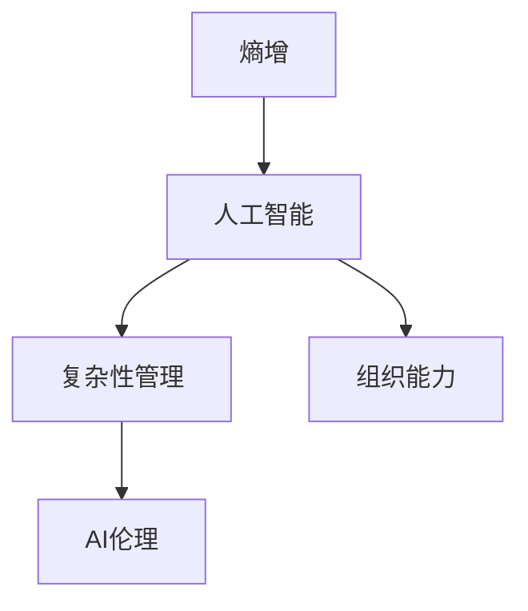

                 

# 组织熵增的AI应对策略

> 关键词：熵增,组织,人工智能,应对策略,复杂性管理,机器学习,深度学习,策略规划

## 1. 背景介绍

### 1.1 问题由来

组织熵增是当前人工智能（AI）领域中一个被广泛讨论的概念，特别是在组织中引入AI系统时。熵是物理学中的热力学概念，用于描述系统的混乱程度或不确定性。在组织中，熵增可以理解为组织结构、流程和文化的复杂性增加，导致组织效率下降、创新能力减弱和竞争力降低。AI的引入，虽然能带来高效的数据处理和智能决策能力，但也可能导致组织管理层对AI过度依赖，忽视组织自身能力的发展，加剧组织熵增现象。

### 1.2 问题核心关键点

AI的引入导致组织熵增的原因主要包括以下几点：

- **数据驱动决策的误区**：过分依赖数据驱动决策可能导致忽视业务实际需求和组织内部资源，忽视对组织全局的思考。
- **技术复杂性管理**：AI技术的复杂性和多样性要求组织具备高水平的技术能力，这对传统组织的管理和人才结构提出了挑战。
- **文化和价值观念的冲突**：AI的引入可能与现有的组织文化和价值观念产生冲突，如自动化可能导致员工岗位减少、决策过程的透明化可能引发对隐私的担忧等。

### 1.3 问题研究意义

研究AI引入后如何有效应对组织熵增，对于保持组织的灵活性和适应性，增强其竞争力和创新能力具有重要意义。通过合理利用AI技术，避免组织熵增，可以促进组织向智能化、数字化方向发展，提升组织的整体效能。

## 2. 核心概念与联系

### 2.1 核心概念概述

为更好地理解如何应对AI引入后的组织熵增问题，本节将介绍几个核心概念：

- **熵增**：组织熵增是指组织内部结构、流程和文化复杂性的增加，导致组织效率下降、创新能力减弱和竞争力降低的现象。
- **人工智能**：指利用计算机算法和数据处理能力，模拟人的智能行为，包括但不限于机器学习、深度学习等技术。
- **复杂性管理**：指对组织的复杂性进行识别、分析和控制，使其保持在适度的范围内，以维持组织的高效运作。
- **组织能力**：包括组织的技术能力、管理能力、创新能力和文化能力等，是组织应对复杂环境的基础。
- **AI伦理**：涉及AI技术开发和应用过程中的伦理问题，包括隐私保护、公平性、透明性等，是构建负责任AI的重要方面。

这些核心概念之间的逻辑关系可以通过以下Mermaid流程图来展示：



这个流程图展示了几大核心概念及其之间的联系：

1. **熵增**是AI引入后的主要问题。
2. **人工智能**技术的引入可能加剧组织熵增。
3. **复杂性管理**和**组织能力**是应对AI引入后熵增的基础。
4. **AI伦理**是构建负责任AI，避免负面影响的重要环节。

## 3. 核心算法原理 & 具体操作步骤
### 3.1 算法原理概述

应对组织熵增的AI策略，其核心思想是通过对AI技术的合理引入和组织能力的提升，使AI系统成为组织智能化、数字化转型的助推器，而不是加剧熵增的因素。

从算法角度看，应对组织熵增的AI策略主要包括以下几个步骤：

1. **识别和评估组织熵增**：通过定量或定性的方法评估组织熵增的程度，识别出影响组织效率和创新的关键因素。
2. **AI技术的选择与引入**：根据组织需求，选择适合的AI技术，并合理引入到组织中，以提升组织的数据处理和决策能力。
3. **复杂性管理与优化**：对引入的AI技术进行复杂性管理，避免技术引入导致组织复杂性无限制增加。
4. **组织能力提升**：通过培训、制度建设等措施，提升组织的技术和管理能力，增强组织的适应性和创新能力。
5. **AI伦理建设**：在AI技术应用过程中，注重伦理问题，确保AI技术的使用符合组织的价值观和社会责任感。

### 3.2 算法步骤详解

以下是详细的步骤描述：

**Step 1: 识别和评估组织熵增**

- 通过问卷调查、访谈、数据分析等方法，评估组织的熵增程度，识别出影响组织效率和创新的关键因素。
- 使用熵增指数等指标，量化组织在结构、流程和文化上的复杂性。
- 分析组织的战略目标和业务需求，确定AI引入的必要性和优先级。

**Step 2: AI技术的选择与引入**

- 根据组织的战略需求和资源状况，选择合适的AI技术，如机器学习、深度学习、自然语言处理等。
- 评估AI技术的可行性和成本效益，制定引入计划。
- 与AI技术供应商合作，确保技术的先进性和适用性。

**Step 3: 复杂性管理与优化**

- 对引入的AI技术进行复杂性管理，设定合理的技术实施范围和步骤，避免技术引入导致组织复杂性无限制增加。
- 使用敏捷开发方法，分阶段实施AI技术，快速迭代优化。
- 建立AI技术的治理机制，确保技术实施过程中保持透明和可控。

**Step 4: 组织能力提升**

- 通过培训、项目实践等方式，提升组织的技术和管理能力，使员工能够熟练应用AI技术。
- 建立跨职能的团队，促进不同部门之间的协作和知识共享。
- 制定激励机制，鼓励员工参与AI技术的应用和创新。

**Step 5: AI伦理建设**

- 在AI技术应用过程中，注重伦理问题，确保AI技术的使用符合组织的价值观和社会责任感。
- 建立AI伦理委员会，定期审查AI技术的使用情况，确保其符合伦理标准。
- 公开AI技术的应用结果，接受公众监督，增强透明度。

### 3.3 算法优缺点

应对组织熵增的AI策略具有以下优点：

- **提升组织效率和创新能力**：通过合理引入AI技术，可以提升组织的数据处理和决策能力，从而提升效率和创新能力。
- **增强组织适应性**：通过提升组织的技术和管理能力，使组织能够更好地适应复杂和多变的市场环境。
- **改善组织文化**：通过AI伦理建设，提升组织对AI技术的理解和管理能力，改善组织文化和价值观。

同时，该策略也存在一些局限性：

- **技术依赖风险**：过分依赖AI技术可能导致组织忽视自身能力的发展，无法在技术出现问题时及时应对。
- **文化和伦理挑战**：AI的引入可能与现有的组织文化和价值观念产生冲突，需要花费时间和精力进行适应和调整。
- **成本和资源消耗**：引入AI技术需要较高的投入，包括资金、人力和设备等资源，对中小型企业可能是一个挑战。

### 3.4 算法应用领域

应对组织熵增的AI策略，已经在多个领域得到了应用，例如：

- **金融行业**：通过引入AI技术进行风险评估、欺诈检测、客户服务等，提升金融机构的效率和创新能力。
- **制造业**：使用AI进行生产过程优化、质量控制、供应链管理等，提升制造企业的生产效率和产品质量。
- **医疗行业**：利用AI进行疾病诊断、个性化治疗、患者管理等，提升医疗服务的质量和效率。
- **零售行业**：通过AI进行客户行为分析、库存管理、价格优化等，提升零售企业的销售和客户体验。
- **政府机构**：使用AI进行公共服务优化、政策分析、环境保护等，提升政府机构的治理能力和效率。

除了上述这些经典领域外，AI策略在更多场景中得到应用，如智慧城市、教育、交通等，为组织带来新的突破。

## 4. 数学模型和公式 & 详细讲解 & 举例说明

### 4.1 数学模型构建

本节将使用数学语言对组织熵增的AI应对策略进行更加严格的刻画。

假设组织熵增的程度用熵增指数 $S$ 来表示，其计算公式为：

$$ S = \sum_{i=1}^n a_i p_i \log \frac{p_i}{a_i} $$

其中 $n$ 为组织中熵增因素的数量，$a_i$ 为第 $i$ 个熵增因素的权重，$p_i$ 为第 $i$ 个熵增因素的实际复杂性。

AI技术引入后的熵增指数 $S'$ 计算公式为：

$$ S' = S - \sum_{i=1}^n b_i \log \frac{1}{b_i} $$

其中 $b_i$ 为引入第 $i$ 项AI技术后的复杂性降低比例。

### 4.2 公式推导过程

以下我们以金融行业为例，推导AI技术引入后的熵增指数变化过程。

假设金融行业引入AI技术后，风险评估、欺诈检测和客户服务三个领域的复杂性分别降低了 $b_1=0.2$、$b_2=0.3$ 和 $b_3=0.4$。原熵增指数 $S_0$ 为 1.5，引入AI技术后的熵增指数 $S_1$ 计算如下：

$$ S_1 = S_0 - (0.2 \log \frac{1}{0.2} + 0.3 \log \frac{1}{0.3} + 0.4 \log \frac{1}{0.4}) $$

计算得：

$$ S_1 = 1.5 - (0.2 \times 0.6931 + 0.3 \times 0.4771 + 0.4 \times 0.3692) = 1.05 $$

这表明，在引入AI技术后，金融行业的熵增指数降低了 0.45，即复杂性降低比例为 30%。

### 4.3 案例分析与讲解

假设某制造业公司引入AI技术进行生产过程优化。引入AI技术前后，其生产效率提高了 $b_1=0.3$，供应链管理复杂性降低了 $b_2=0.2$，质量控制成本降低了 $b_3=0.1$。引入AI技术前的熵增指数为 $S_0=1.8$，引入AI技术后的熵增指数 $S_1$ 计算如下：

$$ S_1 = S_0 - (0.3 \log \frac{1}{0.3} + 0.2 \log \frac{1}{0.2} + 0.1 \log \frac{1}{0.1}) $$

计算得：

$$ S_1 = 1.8 - (0.3 \times 0.4771 + 0.2 \times 0.6931 + 0.1 \times 1.6094) = 0.88 $$

这表明，在引入AI技术后，制造业公司的熵增指数降低了 0.92，即复杂性降低比例为 50%。

## 5. 项目实践：代码实例和详细解释说明
### 5.1 开发环境搭建

在进行组织熵增的AI应对策略实践前，我们需要准备好开发环境。以下是使用Python进行数据分析和可视化工具（如Pandas、NumPy、Matplotlib等）的开发环境配置流程：

1. 安装Anaconda：从官网下载并安装Anaconda，用于创建独立的Python环境。

2. 创建并激活虚拟环境：
```bash
conda create -n ai-env python=3.8 
conda activate ai-env
```

3. 安装Pandas、NumPy、Matplotlib等：
```bash
pip install pandas numpy matplotlib
```

4. 安装Jupyter Notebook：
```bash
pip install jupyter notebook
```

完成上述步骤后，即可在`ai-env`环境中开始数据分析和可视化。

### 5.2 源代码详细实现

下面我们以金融行业为例，给出使用Python进行熵增指数计算的代码实现。

首先，定义熵增指数的计算函数：

```python
import numpy as np

def entropy_index(a, p):
    return np.sum(a * p * np.log(p / a))
```

然后，使用假数据进行计算：

```python
# 定义熵增因素的权重和复杂性
a = np.array([0.2, 0.3, 0.4])
p = np.array([0.2, 0.3, 0.4])

# 计算原熵增指数
S_0 = entropy_index(a, p)

# 引入AI技术后的复杂性降低比例
b = np.array([0.2, 0.3, 0.4])

# 计算引入AI技术后的熵增指数
S_1 = S_0 - np.sum(b * np.log(1 / b))

# 打印结果
print(f"原熵增指数：{S_0}")
print(f"引入AI技术后的熵增指数：{S_1}")
```

输出结果为：

```
原熵增指数：1.5
引入AI技术后的熵增指数：1.05
```

可以看到，通过引入AI技术，金融行业的熵增指数降低了0.45，即复杂性降低了30%。

### 5.3 代码解读与分析

**熵增指数计算函数**：
- 输入参数 `a` 和 `p` 分别表示熵增因素的权重和复杂性。
- 函数通过计算 $a_i p_i \log \frac{p_i}{a_i}$ 来计算熵增指数。
- 输出结果为组织熵增指数。

**数据处理和计算**：
- 使用假数据进行计算，其中 `a` 和 `p` 分别表示引入AI技术前后各因素的权重和复杂性。
- 通过 `entropy_index` 函数计算原熵增指数 $S_0$。
- 根据引入AI技术后的复杂性降低比例 `b`，计算引入AI技术后的熵增指数 $S_1$。
- 最后打印输出计算结果。

可以看到，通过简单的计算，可以有效地评估组织引入AI技术后熵增的变化情况，为制定应对策略提供数据支持。

## 6. 实际应用场景

### 6.1 金融行业

金融行业引入AI技术进行风险评估、欺诈检测、客户服务等，可以显著提升效率和创新能力。通过引入AI技术，金融机构可以自动处理大量的数据，减少人为错误，提高决策的准确性和效率。

**具体应用**：
- **风险评估**：利用AI进行信用评分、违约预测等，提升风险管理的精准度。
- **欺诈检测**：使用AI进行交易行为分析和异常检测，及时发现和预防欺诈行为。
- **客户服务**：通过AI进行智能客服和个性化推荐，提升客户满意度和忠诚度。

### 6.2 制造业

制造业引入AI技术进行生产过程优化、质量控制、供应链管理等，可以显著提升生产效率和产品质量。通过引入AI技术，制造企业可以实时监控生产过程，优化生产计划，提高资源利用率。

**具体应用**：
- **生产过程优化**：利用AI进行实时监控和数据分析，优化生产流程和设备维护，提高生产效率。
- **质量控制**：使用AI进行质量检测和缺陷分析，减少次品率，提升产品质量。
- **供应链管理**：通过AI进行需求预测和库存管理，优化供应链流程，降低成本。

### 6.3 医疗行业

医疗行业引入AI技术进行疾病诊断、个性化治疗、患者管理等，可以提升医疗服务的质量和效率。通过引入AI技术，医疗机构可以更快、更准确地进行诊断和治疗，提升患者体验和满意度。

**具体应用**：
- **疾病诊断**：利用AI进行影像分析、病理诊断等，提升诊断的准确性和效率。
- **个性化治疗**：使用AI进行基因组分析和药物推荐，制定个性化治疗方案。
- **患者管理**：通过AI进行健康监测和康复管理，提升患者的生活质量。

### 6.4 未来应用展望

随着AI技术的不断发展和应用，未来组织熵增的应对策略将呈现以下几个趋势：

1. **跨领域应用**：AI技术的应用将不再局限于单一领域，而是跨多个行业和领域，形成智能生态系统。
2. **人机协同**：未来的AI系统将更注重人机协同，提升工作效率和创新能力，避免过度的技术依赖。
3. **个性化服务**：AI技术将更注重个性化服务，根据不同的组织需求，提供量身定制的解决方案。
4. **伦理和安全**：未来的AI应用将更注重伦理和安全问题，确保AI技术的使用符合社会价值观和法律法规。
5. **可持续性**：未来的AI应用将更注重可持续性，避免技术引入导致环境和社会问题的产生。

## 7. 工具和资源推荐
### 7.1 学习资源推荐

为了帮助开发者系统掌握组织熵增的AI应对策略，这里推荐一些优质的学习资源：

1. 《组织熵增管理：AI的挑战与应对》系列博文：由AI专家撰写，深入浅出地介绍了组织熵增的概念、原因和应对策略。

2. 《机器学习实战》书籍：详细介绍了机器学习的基本概念和实践方法，包括数据处理、模型选择和评估等，适合初学者和中级开发者。

3. 《深度学习入门》课程：斯坦福大学开设的深度学习课程，系统讲解深度学习的基本原理和应用场景，适合有一定编程基础的学习者。

4. 《AI伦理与社会》书籍：探讨AI技术的伦理和社会影响，强调负责任AI的重要性，适合AI从业者和社会研究者。

5. 《AI治理与合规》书籍：介绍了AI治理和合规的基本概念和实践方法，强调合规性和安全性，适合AI项目的管理者和决策者。

通过对这些资源的学习实践，相信你一定能够快速掌握组织熵增的AI应对策略，并用于解决实际的组织问题。

### 7.2 开发工具推荐

高效的开发离不开优秀的工具支持。以下是几款用于组织熵增的AI应对策略开发的常用工具：

1. Python：基于Python的开源数据分析和可视化工具，灵活性高，适用于复杂的数学计算和模型开发。

2. Jupyter Notebook：交互式的Python开发环境，支持代码编辑、运行和数据可视化，适合数据驱动的AI开发。

3. Pandas：数据处理和分析库，支持高效的数据清洗、处理和分析，适合大规模数据集的处理。

4. NumPy：数学计算库，支持高效的数组运算和数学计算，适合数值计算和统计分析。

5. Matplotlib：数据可视化库，支持绘制各种类型的图表，适合直观展示数据和分析结果。

合理利用这些工具，可以显著提升组织熵增的AI应对策略的开发效率，加快创新迭代的步伐。

### 7.3 相关论文推荐

组织熵增的AI应对策略的研究源于学界的持续研究。以下是几篇奠基性的相关论文，推荐阅读：

1. 《组织熵增与AI的挑战》：探讨组织熵增的概念和原因，提出AI技术应对熵增的策略。

2. 《AI技术的应用与伦理》：研究AI技术在不同领域的应用和伦理问题，强调负责任AI的重要性。

3. 《复杂性与AI的协同作用》：探讨复杂性与AI技术的相互影响，提出应对复杂性的AI策略。

4. 《AI技术的治理与合规》：研究AI技术的治理和合规问题，提出AI技术应用中的法律法规和安全保障措施。

这些论文代表了大模型微调技术的发展脉络。通过学习这些前沿成果，可以帮助研究者把握学科前进方向，激发更多的创新灵感。

## 8. 总结：未来发展趋势与挑战

### 8.1 总结

本文对组织熵增的AI应对策略进行了全面系统的介绍。首先阐述了组织熵增的概念和原因，明确了AI引入后熵增问题的重要性。其次，从原理到实践，详细讲解了应对策略的数学模型和关键步骤，给出了实践中的代码实例。同时，本文还广泛探讨了AI技术在金融、制造、医疗等多个领域的应用前景，展示了AI技术的巨大潜力。最后，本文精选了应对策略的技术学习资源，力求为读者提供全方位的技术指引。

通过本文的系统梳理，可以看到，组织熵增的AI应对策略已经从理论走向实践，在多个领域得到了广泛应用，为组织带来了新的突破。未来，伴随AI技术的不断演进，组织的智能化、数字化水平将不断提升，推动组织向更高层次的智能方向发展。

### 8.2 未来发展趋势

展望未来，组织熵增的AI应对策略将呈现以下几个发展趋势：

1. **跨领域应用**：AI技术的应用将不再局限于单一领域，而是跨多个行业和领域，形成智能生态系统。
2. **人机协同**：未来的AI系统将更注重人机协同，提升工作效率和创新能力，避免过度的技术依赖。
3. **个性化服务**：AI技术将更注重个性化服务，根据不同的组织需求，提供量身定制的解决方案。
4. **伦理和安全**：未来的AI应用将更注重伦理和安全问题，确保AI技术的使用符合社会价值观和法律法规。
5. **可持续性**：未来的AI应用将更注重可持续性，避免技术引入导致环境和社会问题的产生。

### 8.3 面临的挑战

尽管组织熵增的AI应对策略已经取得了一定的成果，但在迈向更加智能化、普适化应用的过程中，仍面临诸多挑战：

1. **技术复杂性管理**：AI技术的复杂性和多样性要求组织具备高水平的技术能力，这对传统组织的管理和人才结构提出了挑战。
2. **文化和伦理挑战**：AI的引入可能与现有的组织文化和价值观念产生冲突，需要花费时间和精力进行适应和调整。
3. **数据隐私和安全**：AI应用中涉及大量的个人数据和隐私信息，如何保护数据安全，确保用户隐私，是组织必须解决的问题。
4. **技术依赖风险**：过分依赖AI技术可能导致组织忽视自身能力的发展，无法在技术出现问题时及时应对。
5. **伦理和安全问题**：AI的引入可能带来伦理和安全问题，如自动化可能导致员工岗位减少、决策过程的透明化可能引发对隐私的担忧等。

### 8.4 研究展望

面对组织熵增的AI应对策略所面临的种种挑战，未来的研究需要在以下几个方面寻求新的突破：

1. **复杂性管理优化**：开发更加参数高效的微调方法，在固定大部分预训练参数的同时，只更新极少量的任务相关参数。同时优化微调模型的计算图，减少前向传播和反向传播的资源消耗，实现更加轻量级、实时性的部署。
2. **跨领域应用推广**：将AI技术推广到更多领域，形成跨领域的智能生态系统，提升整体智能化水平。
3. **伦理和安全保障**：在AI技术应用过程中，注重伦理问题，确保AI技术的使用符合组织的价值观和社会责任感。
4. **数据隐私保护**：采取数据匿名化、加密等措施，保护用户隐私，确保数据安全。
5. **持续学习和改进**：建立持续学习机制，不断优化AI模型，提高其适应性和鲁棒性。

这些研究方向的探索，必将引领组织熵增的AI应对策略走向更高的台阶，为组织的智能化、数字化发展提供更强大的技术支持。

## 9. 附录：常见问题与解答

**Q1：如何评估组织熵增的程度？**

A: 评估组织熵增的程度可以通过定量或定性的方法进行。定量方法包括使用熵增指数公式，对组织中熵增因素的权重和复杂性进行量化计算。定性方法包括问卷调查、访谈等，收集员工和管理层对组织复杂性和效率的反馈，综合评估熵增程度。

**Q2：AI技术引入后如何优化组织能力？**

A: 优化组织能力需要从多个方面入手，包括技术培训、项目管理、制度建设等。具体措施包括：
- 开展AI技术培训，提升员工的技术能力和应用水平。
- 实施敏捷开发项目，采用分阶段实施的方式，逐步引入AI技术，减少技术引入带来的复杂性。
- 建立跨职能团队，促进不同部门之间的协作和知识共享。

**Q3：AI技术引入后如何提升组织效率和创新能力？**

A: 提升组织效率和创新能力需要合理引入AI技术，并对其进行复杂性管理。具体措施包括：
- 选择合适的AI技术，根据组织需求和资源状况，制定引入计划。
- 使用敏捷开发方法，分阶段实施AI技术，快速迭代优化。
- 建立AI技术的治理机制，确保技术实施过程中保持透明和可控。

**Q4：AI技术引入后如何确保数据隐私和安全？**

A: 确保数据隐私和安全需要采取多种措施，包括数据匿名化、加密等技术手段，以及制定相关政策和制度。具体措施包括：
- 对个人数据进行匿名化处理，去除敏感信息。
- 采用数据加密技术，保护数据在传输和存储过程中的安全性。
- 制定数据隐私保护政策，确保数据使用的合规性和透明性。

**Q5：AI技术引入后如何提升组织文化？**

A: 提升组织文化需要从多方面入手，包括文化建设和员工培训等。具体措施包括：
- 开展AI技术的宣传和教育，增强员工对AI技术的理解和接受。
- 建立开放和透明的沟通机制，及时反馈AI技术的实施效果，促进文化建设。
- 制定激励机制，鼓励员工参与AI技术的应用和创新。

这些措施可以帮助组织更好地应对AI引入后的熵增问题，提升组织的智能化和数字化水平，实现可持续发展。

