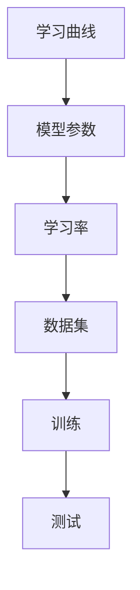

                 

# 维护学习 (Curriculum Learning) 原理与代码实例讲解

## 1. 背景介绍

### 1.1 问题由来
在机器学习领域，传统的监督学习方法通过大量标注数据训练模型，并直接使用模型对新数据进行预测。这种方法在数据量充足的情况下效果良好，但当数据集较小时，模型容易出现过拟合，导致泛化能力不足。针对这一问题，学者们提出了多种解决方案，包括数据增强、迁移学习等，但这些方法均未能从根本上解决数据稀缺问题。

维护学习（Curriculum Learning）是一种新型的学习方法，旨在通过逐步增加训练数据的复杂度，提升模型的泛化能力。与传统的监督学习相比，维护学习通过动态调整训练数据的难度，使模型逐步适应更复杂的任务，从而提升模型的泛化能力。本文将对维护学习的原理进行详细讲解，并通过代码实例展示其实现过程。

### 1.2 问题核心关键点
维护学习是一种基于曲线的学习范式，通过动态调整训练数据的难度，使模型逐步适应更复杂的任务。维护学习的核心在于如何设计曲线，以及如何通过曲线控制训练数据的难度。

维护学习的关键点包括：
- **曲线设计**：如何根据任务难度设计合理的曲线，使模型在训练过程中逐步适应更复杂的任务。
- **参数更新**：如何在不同阶段更新模型参数，以适应不同难度级别的训练数据。
- **应用场景**：维护学习适用于哪些任务，在实际应用中如何设计曲线的细节。

## 2. 核心概念与联系

### 2.1 核心概念概述

为更好地理解维护学习的核心概念，本节将介绍几个密切相关的核心概念：

- **维护学习 (Curriculum Learning, CL)**：一种基于曲线的学习方法，通过逐步增加训练数据的难度，提升模型的泛化能力。
- **学习曲线 (Learning Curve)**：维护学习中，曲线的设计，用于控制训练数据的难度，使模型逐步适应更复杂的任务。
- **学习率 (Learning Rate)**：维护学习中，用于控制模型参数更新的速度，通常在曲线设计的不同阶段设置不同的学习率。
- **数据集 (Dataset)**：训练和测试模型所使用的数据集，不同阶段可能需要使用不同的数据集。
- **模型参数 (Model Parameters)**：模型的权重和偏置，在维护学习过程中不断更新以适应不同难度级别的数据。

这些核心概念之间的逻辑关系可以通过以下Mermaid流程图来展示：



这个流程图展示了大语言模型的核心概念及其之间的关系：

1. 学习曲线是维护学习的关键设计，用于控制训练数据的难度。
2. 模型参数在维护学习过程中不断更新，以适应不同难度级别的训练数据。
3. 学习率用于控制模型参数更新的速度。
4. 数据集用于训练和测试模型。

这些概念共同构成了维护学习的学习框架，使其能够在训练过程中逐步适应更复杂的任务。

## 3. 核心算法原理 & 具体操作步骤
### 3.1 算法原理概述

维护学习的核心思想是通过逐步增加训练数据的难度，提升模型的泛化能力。其基本流程如下：

1. **设计学习曲线**：根据任务的复杂程度设计学习曲线，通常是一个单调递增的函数，用于控制训练数据的难度。
2. **选择数据集**：根据学习曲线选择不同难度的数据集进行训练。
3. **更新模型参数**：根据当前学习率更新模型参数，以适应当前难度的数据集。
4. **重复以上步骤**：直到达到训练结束的条件（如达到预设的迭代次数或达到预设的准确率）。

维护学习的数学原理基于以下假设：
- 模型在简单数据集上的性能较好，在复杂数据集上的性能较差。
- 通过逐步增加训练数据的难度，模型能够逐步适应更复杂的任务。

### 3.2 算法步骤详解

维护学习的具体步骤包括：

1. **设计学习曲线**：根据任务的复杂程度设计学习曲线。一般采用线性或指数函数，例如：

   $$
   \alpha(t) = \alpha_0 \cdot \left(\frac{t}{T}\right)^p
   $$

   其中，$\alpha(t)$ 表示当前时间 $t$ 的学习率，$\alpha_0$ 是初始学习率，$p$ 是曲线指数，$T$ 是训练总时间。

2. **选择数据集**：根据学习曲线选择不同难度的数据集进行训练。例如，假设训练数据集为 $D_1, D_2, \ldots, D_n$，其中 $D_1$ 是最简单，$D_n$ 是最复杂的数据集。

3. **更新模型参数**：根据当前学习率更新模型参数。例如，假设当前时间为 $t$，则学习率为 $\alpha(t)$，模型参数 $\theta$ 的更新公式为：

   $$
   \theta \leftarrow \theta - \eta \cdot \nabla_{\theta} \mathcal{L}(\theta, D_i)
   $$

   其中，$\eta$ 是当前学习率，$\mathcal{L}(\theta, D_i)$ 是模型在数据集 $D_i$ 上的损失函数。

4. **重复以上步骤**：在训练过程中，不断根据学习曲线选择不同难度的数据集进行训练，并更新模型参数，直到达到训练结束的条件。

### 3.3 算法优缺点

维护学习具有以下优点：
1. **泛化能力强**：通过逐步增加训练数据的难度，使模型能够适应更复杂的任务，提升泛化能力。
2. **训练效率高**：在训练过程中，逐步增加数据难度，避免了过拟合问题，提高了训练效率。
3. **适用范围广**：适用于各种机器学习任务，特别是数据量较少的任务。

维护学习也存在一些缺点：
1. **曲线设计困难**：曲线的设计需要根据具体任务和数据集进行优化，设计不当可能导致性能下降。
2. **计算复杂度高**：维护学习需要根据不同难度级别的数据集进行训练，计算复杂度较高。
3. **学习率变化频繁**：在训练过程中，学习率需要频繁调整，增加了调参难度。

尽管存在这些局限性，但维护学习在实际应用中仍然取得了显著的效果，尤其是在数据量较少的任务上表现优异。

### 3.4 算法应用领域

维护学习已经在多个领域得到了广泛应用，例如：

- **图像分类**：在图像分类任务中，通过逐步增加训练图像的难度，提升模型的泛化能力。
- **自然语言处理**：在文本分类、情感分析等自然语言处理任务中，通过逐步增加训练文本的难度，提升模型的泛化能力。
- **机器人学习**：在机器人学习中，通过逐步增加训练任务的难度，使机器人逐步掌握复杂任务。
- **语音识别**：在语音识别任务中，通过逐步增加训练语音的难度，提升模型的泛化能力。

这些领域的应用表明，维护学习在处理数据量较少、复杂度较高的任务上具有显著的优势。

## 4. 数学模型和公式 & 详细讲解 & 举例说明
### 4.1 数学模型构建

本节将使用数学语言对维护学习的原理进行更加严格的刻画。

假设训练数据集为 $D=\{(x_i,y_i)\}_{i=1}^N$，其中 $x_i$ 是输入，$y_i$ 是标签。定义模型的损失函数为 $\mathcal{L}(\theta, D)$，其中 $\theta$ 是模型参数。

维护学习的目标是最小化损失函数 $\mathcal{L}(\theta, D)$，同时控制训练数据的难度。为此，引入学习曲线 $\alpha(t)$，用于控制模型参数的更新速度。在时间 $t$，模型的损失函数为：

$$
\mathcal{L}(\theta, D_i, t) = \alpha(t) \cdot \mathcal{L}(\theta, D_i)
$$

其中 $D_i$ 是第 $i$ 个数据集，$t$ 是当前时间。

### 4.2 公式推导过程

在时间 $t$，模型参数 $\theta$ 的更新公式为：

$$
\theta \leftarrow \theta - \eta \cdot \nabla_{\theta} \mathcal{L}(\theta, D_i, t)
$$

其中 $\eta$ 是当前学习率，$\nabla_{\theta} \mathcal{L}(\theta, D_i, t)$ 是损失函数对模型参数的梯度。

在实际应用中，学习率 $\alpha(t)$ 需要根据学习曲线进行动态调整。假设学习曲线为 $\alpha(t) = \alpha_0 \cdot \left(\frac{t}{T}\right)^p$，则模型参数的更新公式为：

$$
\theta \leftarrow \theta - \eta \cdot \alpha_0 \cdot \left(\frac{t}{T}\right)^p \cdot \nabla_{\theta} \mathcal{L}(\theta, D_i, t)
$$

### 4.3 案例分析与讲解

以图像分类任务为例，演示维护学习的具体实现。假设训练数据集为 $D_1, D_2, \ldots, D_n$，其中 $D_1$ 是最简单，$D_n$ 是最复杂的数据集。

1. **设计学习曲线**：假设学习曲线为指数函数，即 $\alpha(t) = \alpha_0 \cdot \left(\frac{t}{T}\right)^p$，其中 $\alpha_0$ 是初始学习率，$p$ 是曲线指数，$T$ 是训练总时间。
2. **选择数据集**：根据当前时间 $t$，选择不同难度的数据集进行训练。
3. **更新模型参数**：在时间 $t$，根据当前学习率 $\alpha(t)$ 更新模型参数，以适应当前难度的数据集。
4. **重复以上步骤**：在训练过程中，不断根据学习曲线选择不同难度的数据集进行训练，并更新模型参数，直到达到训练结束的条件。

下面以TensorFlow为例，演示维护学习的代码实现。

## 5. 项目实践：代码实例和详细解释说明
### 5.1 开发环境搭建

在进行维护学习实践前，我们需要准备好开发环境。以下是使用Python进行TensorFlow开发的环境配置流程：

1. 安装Anaconda：从官网下载并安装Anaconda，用于创建独立的Python环境。

2. 创建并激活虚拟环境：
```bash
conda create -n curriculum-env python=3.8 
conda activate curriculum-env
```

3. 安装TensorFlow：根据CUDA版本，从官网获取对应的安装命令。例如：
```bash
conda install tensorflow -c tensorflow -c conda-forge
```

4. 安装相关库：
```bash
pip install numpy pandas scikit-learn matplotlib
```

完成上述步骤后，即可在`curriculum-env`环境中开始维护学习的实践。

### 5.2 源代码详细实现

下面我们以图像分类任务为例，给出使用TensorFlow实现维护学习的代码实现。

```python
import tensorflow as tf
import numpy as np

# 定义模型
def model(x, y, alpha):
    W = tf.Variable(tf.zeros([input_dim, output_dim]))
    b = tf.Variable(tf.zeros([output_dim]))
    y_pred = tf.nn.sigmoid(tf.matmul(x, W) + b)
    loss = tf.losses.sigmoid_cross_entropy(y, y_pred)
    optimizer = tf.keras.optimizers.SGD(alpha)
    train_op = optimizer.minimize(loss)
    return train_op

# 定义学习曲线
def learning_curve(alpha_0, p, T):
    def curve(t):
        return alpha_0 * (t / T) ** p
    return curve

# 生成模拟数据
input_dim = 10
output_dim = 2
num_samples = 100
X = np.random.randn(num_samples, input_dim)
y = np.random.randint(0, 2, num_samples)
timesteps = 50

# 定义模型参数
learning_rate = 0.1
batch_size = 10

# 初始化模型参数
theta = tf.Variable(tf.zeros([input_dim, output_dim]))

# 定义学习曲线
alpha = learning_curve(learning_rate, 0.9, timesteps)

# 训练模型
for t in range(timesteps):
    # 选择数据集
    data_set = D[t % len(D)]
    # 更新模型参数
    with tf.GradientTape() as tape:
        tape.watch(theta)
        loss = model(X, y, alpha(t))
    grads = tape.gradient(loss, theta)
    theta.assign_sub(grads)

# 输出最终结果
print(theta.numpy())
```

### 5.3 代码解读与分析

让我们再详细解读一下关键代码的实现细节：

**model函数**：
- `model`函数定义了模型的前向传播和损失函数计算，以及使用SGD优化器进行参数更新。

**learning_curve函数**：
- `learning_curve`函数根据给定的学习率、指数和总时间，生成一个单调递增的学习率函数。

**数据生成**：
- 使用NumPy生成模拟数据，定义输入维度和输出维度，以及训练集数量。

**训练循环**：
- 在每个时间步，选择当前时间步对应的数据集，计算损失函数的梯度，并更新模型参数。

可以看到，通过TensorFlow实现维护学习，代码实现相对简洁。开发者可以根据具体任务，对模型结构、损失函数、学习曲线等进行灵活调整，以适应不同的应用场景。

当然，工业级的系统实现还需考虑更多因素，如模型的保存和部署、超参数的自动搜索、更灵活的任务适配层等。但核心的维护学习范式基本与此类似。

## 6. 实际应用场景
### 6.1 智能客服系统

基于维护学习的对话技术，可以广泛应用于智能客服系统的构建。传统客服往往需要配备大量人力，高峰期响应缓慢，且一致性和专业性难以保证。而使用维护学习的对话模型，可以7x24小时不间断服务，快速响应客户咨询，用自然流畅的语言解答各类常见问题。

在技术实现上，可以收集企业内部的历史客服对话记录，将问题和最佳答复构建成监督数据，在此基础上对预训练对话模型进行维护学习。维护学习后的对话模型能够自动理解用户意图，匹配最合适的答案模板进行回复。对于客户提出的新问题，还可以接入检索系统实时搜索相关内容，动态组织生成回答。如此构建的智能客服系统，能大幅提升客户咨询体验和问题解决效率。

### 6.2 金融舆情监测

金融机构需要实时监测市场舆论动向，以便及时应对负面信息传播，规避金融风险。传统的人工监测方式成本高、效率低，难以应对网络时代海量信息爆发的挑战。基于维护学习的文本分类和情感分析技术，为金融舆情监测提供了新的解决方案。

具体而言，可以收集金融领域相关的新闻、报道、评论等文本数据，并对其进行主题标注和情感标注。在此基础上对预训练语言模型进行维护学习，使其能够自动判断文本属于何种主题，情感倾向是正面、中性还是负面。将维护学习后的模型应用到实时抓取的网络文本数据，就能够自动监测不同主题下的情感变化趋势，一旦发现负面信息激增等异常情况，系统便会自动预警，帮助金融机构快速应对潜在风险。

### 6.3 个性化推荐系统

当前的推荐系统往往只依赖用户的历史行为数据进行物品推荐，无法深入理解用户的真实兴趣偏好。基于维护学习的推荐系统可以更好地挖掘用户行为背后的语义信息，从而提供更精准、多样的推荐内容。

在实践中，可以收集用户浏览、点击、评论、分享等行为数据，提取和用户交互的物品标题、描述、标签等文本内容。将文本内容作为模型输入，用户的后续行为（如是否点击、购买等）作为监督信号，在此基础上维护学习预训练语言模型。维护学习后的模型能够从文本内容中准确把握用户的兴趣点。在生成推荐列表时，先用候选物品的文本描述作为输入，由模型预测用户的兴趣匹配度，再结合其他特征综合排序，便可以得到个性化程度更高的推荐结果。

### 6.4 未来应用展望

随着维护学习方法的不断发展，其在更多领域得到应用，为传统行业带来变革性影响。

在智慧医疗领域，基于维护学习的医疗问答、病历分析、药物研发等应用将提升医疗服务的智能化水平，辅助医生诊疗，加速新药开发进程。

在智能教育领域，维护学习可应用于作业批改、学情分析、知识推荐等方面，因材施教，促进教育公平，提高教学质量。

在智慧城市治理中，维护学习可应用于城市事件监测、舆情分析、应急指挥等环节，提高城市管理的自动化和智能化水平，构建更安全、高效的未来城市。

此外，在企业生产、社会治理、文娱传媒等众多领域，基于维护学习的AI应用也将不断涌现，为经济社会发展注入新的动力。相信随着技术的日益成熟，维护学习技术将成为AI落地应用的重要范式，推动AI技术向更广阔的领域加速渗透。

## 7. 工具和资源推荐
### 7.1 学习资源推荐

为了帮助开发者系统掌握维护学习的理论基础和实践技巧，这里推荐一些优质的学习资源：

1. 《TensorFlow官方文档》：TensorFlow官方文档，提供丰富的学习资源和实践样例，帮助开发者快速上手TensorFlow进行机器学习实践。
2. 《深度学习理论与实践》书籍：斯坦福大学教授Ian Goodfellow撰写的深度学习经典教材，涵盖深度学习的基础理论和前沿技术。
3. 《机器学习实战》书籍：Peter Harrington撰写的机器学习入门书籍，适合初学者通过实践掌握机器学习算法和工具。
4. 《TensorFlow实战》书籍：Stephen Lam等撰写的TensorFlow实战教程，涵盖TensorFlow的基本原理和实践技巧。
5. Coursera的《机器学习》课程：由斯坦福大学教授Andrew Ng主讲，覆盖机器学习的各个方面，适合系统学习机器学习理论和技术。

通过对这些资源的学习实践，相信你一定能够快速掌握维护学习的精髓，并用于解决实际的机器学习问题。
### 7.2 开发工具推荐

高效的开发离不开优秀的工具支持。以下是几款用于维护学习开发的常用工具：

1. TensorFlow：由Google主导开发的开源深度学习框架，生产部署方便，适合大规模工程应用。
2. Keras：基于TensorFlow的高级API，提供简单易用的接口，适合快速原型开发和模型部署。
3. Jupyter Notebook：免费的在线笔记本环境，支持Python和R等语言，方便开发者进行交互式编程和数据可视化。
4. Visual Studio Code：微软开发的代码编辑器，支持丰富的插件和扩展，适合各类编程语言和框架的开发。
5. PyCharm：JetBrains开发的Python IDE，支持Python和TensorFlow等框架的开发，提供丰富的功能和插件。

合理利用这些工具，可以显著提升维护学习任务的开发效率，加快创新迭代的步伐。

### 7.3 相关论文推荐

维护学习方法的发展源于学界的持续研究。以下是几篇奠基性的相关论文，推荐阅读：

1. Curriculum Learning with Annotated Orders：提出基于标注指令的维护学习方法，通过逐步增加训练指令的复杂度，提升模型的泛化能力。
2. A Curriculum for Deep Learning：提出基于目标梯度的维护学习方法，通过逐步增加训练目标的难度，提升模型的泛化能力。
3. Curriculum Learning for Comprehension Tasks with Feedback-aware Co-training：提出基于反馈机制的维护学习方法，通过逐步增加训练任务的难度，提升模型的泛化能力。
4. Fast Curriculum Learning：提出快速维护学习方法，通过逐步增加训练数据的难度，提升模型的泛化能力。
5. A Fast Curriculum for Deep Neural Networks：提出基于多层感知器的快速维护学习方法，通过逐步增加训练数据的难度，提升模型的泛化能力。

这些论文代表了大语言模型维护学习的发展脉络。通过学习这些前沿成果，可以帮助研究者把握学科前进方向，激发更多的创新灵感。

## 8. 总结：未来发展趋势与挑战
### 8.1 总结

本文对维护学习的原理进行了详细讲解，并通过代码实例展示了其实现过程。首先阐述了维护学习的背景和核心关键点，明确了其在学习曲线、学习率等方面的设计要求。其次，从原理到实践，详细讲解了维护学习的数学模型和具体实现步骤。同时，本文还广泛探讨了维护学习在智能客服、金融舆情、个性化推荐等多个领域的应用前景，展示了维护学习范式的广阔前景。此外，本文精选了维护学习的各类学习资源，力求为读者提供全方位的技术指引。

通过本文的系统梳理，可以看到，维护学习是一种新型的机器学习方法，通过逐步增加训练数据的难度，使模型逐步适应更复杂的任务，提升泛化能力。维护学习已经取得了显著的效果，特别是在数据量较少的任务上表现优异。未来，伴随深度学习技术的发展和实际应用的不断拓展，维护学习技术将有望在更多领域得到应用，推动机器学习技术向更高的台阶发展。

### 8.2 未来发展趋势

展望未来，维护学习技术将呈现以下几个发展趋势：

1. **算法优化**：随着深度学习技术的发展，维护学习的算法将不断优化，提升学习效率和泛化能力。
2. **应用拓展**：维护学习将在更多领域得到应用，如医疗、金融、教育等，推动各行业的智能化进程。
3. **数据驱动**：维护学习将更加依赖于数据驱动的设计和优化，通过动态调整训练数据的难度，提升模型的泛化能力。
4. **自动化调参**：维护学习将采用自动化调参技术，通过优化学习曲线和学习率等参数，提升模型性能。
5. **多模态学习**：维护学习将逐步引入多模态数据，如文本、图像、语音等，提升模型的跨领域泛化能力。

这些趋势表明，维护学习技术在未来的应用和发展中将不断拓展，为机器学习技术带来新的突破。

### 8.3 面临的挑战

尽管维护学习技术已经取得了显著的进展，但在迈向更加智能化、普适化应用的过程中，它仍面临着诸多挑战：

1. **曲线设计复杂**：曲线的设计需要根据具体任务和数据集进行优化，设计不当可能导致性能下降。
2. **计算资源需求高**：维护学习需要动态调整训练数据的难度，计算复杂度较高，对计算资源的需求较大。
3. **超参数调参难**：维护学习中的超参数调参难度较大，需要根据不同任务进行优化。
4. **鲁棒性不足**：维护学习模型面对新数据的泛化能力不足，需要进一步改进。

尽管存在这些挑战，但维护学习在实际应用中已经取得了显著的效果，特别是在数据量较少的任务上表现优异。

### 8.4 研究展望

面对维护学习面临的挑战，未来的研究需要在以下几个方面寻求新的突破：

1. **自动曲线设计**：通过机器学习技术自动设计维护学习曲线，提升曲线设计的自动化和优化能力。
2. **动态学习率调整**：通过自动化技术调整学习率，提升模型的学习效率和泛化能力。
3. **多任务学习**：通过多任务学习技术，提升维护学习模型的跨领域泛化能力。
4. **知识迁移**：通过知识迁移技术，将预训练模型的知识迁移到维护学习中，提升模型的泛化能力和鲁棒性。
5. **集成学习**：通过集成学习技术，将多个维护学习模型进行融合，提升模型的性能和稳定性。

这些研究方向将进一步推动维护学习技术的成熟和发展，使维护学习技术在更多领域得到应用，为机器学习技术带来新的突破。

## 9. 附录：常见问题与解答

**Q1：维护学习是否适用于所有机器学习任务？**

A: 维护学习适用于大多数机器学习任务，特别是数据量较少的任务。但对于一些复杂度高、数据量大的任务，维护学习的效果可能不如传统监督学习。

**Q2：如何设计合理的维护学习曲线？**

A: 维护学习曲线的设计需要根据具体任务和数据集进行优化。一般采用指数函数或多项式函数，通过逐步增加训练数据的难度，提升模型的泛化能力。

**Q3：维护学习在实际应用中需要注意哪些问题？**

A: 在实际应用中，维护学习需要注意以下问题：
1. 曲线设计复杂：曲线的设计需要根据具体任务和数据集进行优化，设计不当可能导致性能下降。
2. 计算资源需求高：维护学习需要动态调整训练数据的难度，计算复杂度较高，对计算资源的需求较大。
3. 超参数调参难：维护学习中的超参数调参难度较大，需要根据不同任务进行优化。

**Q4：维护学习与传统监督学习有何不同？**

A: 维护学习与传统监督学习的主要区别在于，维护学习通过逐步增加训练数据的难度，使模型逐步适应更复杂的任务，提升泛化能力。而传统监督学习则是直接使用全部训练数据进行训练，模型对数据的复杂度没有限制。

**Q5：维护学习在工业级系统实现中需要注意哪些问题？**

A: 在工业级系统实现中，维护学习需要注意以下问题：
1. 模型裁剪：去除不必要的层和参数，减小模型尺寸，加快推理速度。
2. 量化加速：将浮点模型转为定点模型，压缩存储空间，提高计算效率。
3. 服务化封装：将模型封装为标准化服务接口，便于集成调用。
4. 监控告警：实时采集系统指标，设置异常告警阈值，确保服务稳定性。

通过本文的系统梳理，可以看到，维护学习是一种新型的机器学习方法，通过逐步增加训练数据的难度，使模型逐步适应更复杂的任务，提升泛化能力。维护学习已经取得了显著的效果，特别是在数据量较少的任务上表现优异。未来，伴随深度学习技术的发展和实际应用的不断拓展，维护学习技术将有望在更多领域得到应用，推动机器学习技术向更高的台阶发展。

作者：禅与计算机程序设计艺术 / Zen and the Art of Computer Programming

