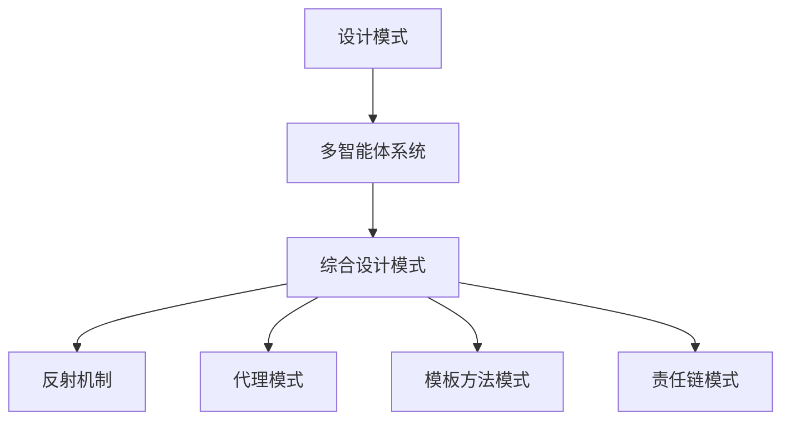

                 

## 1. 背景介绍

### 1.1 问题由来

随着人工智能（AI）技术的发展，多智能体系统（MAS）的应用越来越广泛，涵盖了自动驾驶、智能制造、智慧城市等诸多领域。然而，在实际部署和运行中，MAS面临诸多挑战，如交互复杂性、异构性、动态性等。针对这些问题，设计模式成为一种重要的解决方案，通过抽象设计经验和成功实践，提供可复用的策略和架构，促进MAS系统的开发和应用。

### 1.2 问题核心关键点

本文聚焦于综合设计模式（Complex Design Patterns），从反思、规划与多智能体协同的角度出发，深入探讨其原理、流程和具体实现。综合设计模式将设计模式和复杂系统设计相结合，旨在解决MAS中多层次、多目标的复杂问题，提升系统的可扩展性、可维护性和可靠性。

## 2. 核心概念与联系

### 2.1 核心概念概述

为更好地理解综合设计模式，本文将介绍几个密切相关的核心概念：

- **设计模式（Design Pattern）**：一种基于经验的解决方案，提供了一种适用于特定场景的通用架构或算法，可用于解决特定的设计问题。设计模式有助于提升代码的可重用性和可维护性。

- **多智能体系统（Multi-Agent System, MAS）**：由多个自主、分布式、异构的智能体（Agent）组成的系统，智能体之间通过交互实现系统目标。MAS广泛应用于分布式决策、协同控制等领域。

- **综合设计模式（Complex Design Patterns）**：将多个设计模式相结合，解决复杂系统中的设计问题。综合设计模式旨在优化系统结构，提高系统的可扩展性和可维护性，同时确保系统的鲁棒性和可理解性。

- **反射机制（Reflection）**：一种在运行时动态获取类信息或执行代码的能力。反射机制在综合设计模式中用于实现设计模式的动态生成和调用，增强系统的灵活性和动态适应性。

- **代理模式（Proxy Pattern）**：在客户端与真实主题之间充当代理，控制对真实主题的访问。代理模式常用于封装远程访问或限制访问频率等场景，提升系统的安全和性能。

- **模板方法模式（Template Method Pattern）**：定义了一个算法的骨架，允许子类在不改变算法结构的情况下，实现特定的算法逻辑。模板方法模式有助于规范系统行为，提升系统的可复用性和可扩展性。

- **责任链模式（Chain of Responsibility Pattern）**：将请求传递给一系列对象处理，每个对象都有权处理该请求或将其传递给下一个对象。责任链模式常用于实现请求的逐级处理和过滤。

这些核心概念之间的逻辑关系可以通过以下Mermaid流程图来展示：



这个流程图展示了一个典型的综合设计模式的应用场景：

1. 设计模式提供解决具体问题的通用架构。
2. 多智能体系统通过设计模式实现复杂交互。
3. 综合设计模式将多个设计模式结合，解决复杂系统设计问题。
4. 反射机制用于动态生成和调用设计模式。
5. 代理模式、模板方法模式、责任链模式等设计模式进一步优化系统结构。

## 3. 核心算法原理 & 具体操作步骤
### 3.1 算法原理概述

综合设计模式是一种综合性的设计框架，旨在解决MAS中复杂的设计问题。其核心思想是：将多个设计模式相结合，通过抽象、封装和组合，构建可扩展、可维护、可重用的系统结构。

形式化地，假设一个MAS系统由多个智能体 $A_1, A_2, ..., A_n$ 组成，每个智能体 $A_i$ 内部包含一个设计模式 $P_i$，系统设计者通过综合设计模式 $P$ 将这些设计模式组合起来，使得系统在复杂环境中能够高效协同工作。

综合设计模式 $P$ 通常包括以下步骤：

1. 抽象系统行为：将系统行为抽象为一系列子任务，每个子任务对应一种设计模式。
2. 封装子任务：将每个子任务封装成一个独立的模块，隔离其内部实现细节。
3. 组合子任务：通过接口和消息传递，将封装后的子任务组合成一个整体系统。
4. 动态生成和调用：利用反射机制，动态生成和调用设计模式，增强系统的灵活性和动态适应性。

### 3.2 算法步骤详解

以下是综合设计模式的具体操作步骤：

**Step 1: 系统抽象与分解**

- 识别系统的核心组件和行为。
- 将系统行为抽象为一系列子任务，每个子任务对应一种设计模式。

**Step 2: 封装子任务**

- 对每个子任务，设计一个独立模块，封装其内部实现。
- 模块之间通过接口进行通信，保持接口的一致性和稳定性。

**Step 3: 组合子任务**

- 利用消息传递机制，将封装后的模块组合成一个整体系统。
- 定义系统消息传递协议，确保模块间的正确交互。

**Step 4: 动态生成和调用**

- 利用反射机制，动态生成和调用设计模式。
- 通过代理模式等技术，封装远程访问和错误处理。
- 使用模板方法模式等策略，规范系统行为和交互逻辑。

**Step 5: 系统集成与测试**

- 将系统各模块集成，进行系统测试和调试。
- 通过单元测试、集成测试等方法，确保系统质量和性能。

### 3.3 算法优缺点

综合设计模式具有以下优点：

1. **可扩展性**：通过组合多个设计模式，实现系统的高效扩展。
2. **可维护性**：封装和隔离模块，便于后期维护和升级。
3. **灵活性**：动态生成和调用设计模式，增强系统的适应性。
4. **可重用性**：设计模式和模块可以被复用于其他系统。

同时，该方法也存在一定的局限性：

1. **设计复杂性**：综合设计模式需要设计者具备丰富的经验和抽象能力。
2. **性能开销**：反射和消息传递机制可能引入一定的性能开销。
3. **调试难度**：模块化设计和动态生成可能导致调试复杂。
4. **实现难度**：综合设计模式的实现较为复杂，需要较高的技术水平。

尽管存在这些局限性，但综合设计模式仍然是大规模复杂系统设计的重要工具。未来研究的方向在于如何进一步简化综合设计模式的实现和调试，提高其易用性和性能。

### 3.4 算法应用领域

综合设计模式在MAS中具有广泛的应用前景，涵盖自动驾驶、智能制造、智慧城市等诸多领域：

- **自动驾驶系统**：利用多智能体协同，实现车辆的路径规划、避障、导航等功能。
- **智能制造系统**：通过多个智能体协同控制，实现生产线的自动化、优化和故障预测。
- **智慧城市系统**：多个智能体协同处理交通、环境、公共安全等任务，提升城市管理效率。
- **协同仿真系统**：通过多智能体协同模拟，进行复杂系统的仿真和测试。

综合设计模式通过优化系统结构，提升系统的可扩展性和可维护性，适用于各种复杂系统设计和应用。

## 4. 数学模型和公式 & 详细讲解  
### 4.1 数学模型构建

本文将从系统行为抽象的角度，介绍综合设计模式的数学模型构建。

假设一个MAS系统由 $n$ 个智能体组成，每个智能体 $A_i$ 内部包含一个设计模式 $P_i$，系统设计者通过综合设计模式 $P$ 将这些设计模式组合起来，使得系统在复杂环境中能够高效协同工作。

系统行为 $B$ 可以抽象为一系列子任务 $T$，每个子任务 $T_j$ 对应一种设计模式 $P_j$，系统设计者通过组合这些子任务，构建系统的整体行为。

数学模型如下：

$$
B = \bigcup_{j=1}^{n} T_j
$$

其中，$B$ 表示系统行为，$T_j$ 表示第 $j$ 个子任务，$n$ 表示智能体的数量。

### 4.2 公式推导过程

在上述数学模型基础上，我们进一步推导综合设计模式的公式。

假设系统行为 $B$ 由 $m$ 个设计模式 $P_i$ 组成，每个设计模式 $P_i$ 包含一组行为 $B_i$，系统行为 $B$ 可以表示为：

$$
B = \bigcup_{i=1}^{m} B_i
$$

其中，$B_i$ 表示第 $i$ 个设计模式的行为，$m$ 表示设计模式的总数。

每个设计模式 $P_i$ 可以表示为：

$$
P_i = (A_i, O_i, I_i)
$$

其中，$A_i$ 表示智能体 $A_i$，$O_i$ 表示设计模式 $P_i$ 的行为，$I_i$ 表示设计模式 $P_i$ 的输入和输出。

将 $P_i$ 的行为 $B_i$ 表示为：

$$
B_i = O_i(A_i, I_i)
$$

代入系统行为的公式，得：

$$
B = \bigcup_{i=1}^{m} O_i(A_i, I_i)
$$

这个公式展示了系统行为 $B$ 如何通过设计模式 $P_i$ 的组合来实现。

### 4.3 案例分析与讲解

以一个智能交通系统为例，分析综合设计模式的实现过程。

系统由多个交通信号灯、车辆、行人等智能体组成，每个智能体内部包含一个设计模式，如车辆控制、信号灯控制、行人控制等。

首先，将系统行为抽象为：

- 车辆通过交叉口：设计模式 $P_{车}$，行为 $B_{车}$。
- 信号灯变化：设计模式 $P_{灯}$，行为 $B_{灯}$。
- 行人通过交叉口：设计模式 $P_{人}$，行为 $B_{人}$。

系统行为 $B$ 可以表示为：

$$
B = B_{车} \cup B_{灯} \cup B_{人}
$$

每个设计模式的行为 $B_i$ 可以表示为：

- $B_{车} = P_{车}(A_{车}, I_{车})$
- $B_{灯} = P_{灯}(A_{灯}, I_{灯})$
- $B_{人} = P_{人}(A_{人}, I_{人})$

通过封装和组合设计模式，系统设计者可以构建一个高效、可扩展的智能交通系统。

## 5. 项目实践：代码实例和详细解释说明
### 5.1 开发环境搭建

在进行综合设计模式实践前，我们需要准备好开发环境。以下是使用Python进行PyTorch开发的环境配置流程：

1. 安装Anaconda：从官网下载并安装Anaconda，用于创建独立的Python环境。

2. 创建并激活虚拟环境：
```bash
conda create -n pytorch-env python=3.8 
conda activate pytorch-env
```

3. 安装PyTorch：根据CUDA版本，从官网获取对应的安装命令。例如：
```bash
conda install pytorch torchvision torchaudio cudatoolkit=11.1 -c pytorch -c conda-forge
```

4. 安装Transformers库：
```bash
pip install transformers
```

5. 安装各类工具包：
```bash
pip install numpy pandas scikit-learn matplotlib tqdm jupyter notebook ipython
```

完成上述步骤后，即可在`pytorch-env`环境中开始综合设计模式的实践。

### 5.2 源代码详细实现

这里我们以一个智能交通系统为例，给出使用Transformers库进行综合设计模式的PyTorch代码实现。

首先，定义智能体类：

```python
class Agent:
    def __init__(self, name, state):
        self.name = name
        self.state = state
        self.inputs = []
        self.outputs = []
        self.next_agent = None
    
    def get_input(self):
        return self.inputs.pop(0)
    
    def get_output(self):
        return self.outputs.pop(0)
    
    def send_input(self, input):
        self.inputs.append(input)
    
    def send_output(self, output):
        self.outputs.append(output)
```

然后，定义设计模式类：

```python
class TemplateMethodPattern:
    def __init__(self, template_method):
        self.template_method = template_method
    
    def run(self, inputs):
        output = self.template_method(inputs)
        self.send_output(output)
        
class VehicleControl(TemplateMethodPattern):
    def __init__(self, agent):
        super().__init__(agent, self)
        self.agent = agent
        
    def template_method(self, inputs):
        velocity = inputs[0]
        self.agent.send_output(velocity)
```

最后，实现综合设计模式的代码：

```python
from transformers import BertTokenizer
from torch.utils.data import Dataset
import torch

class NERDataset(Dataset):
    def __init__(self, texts, tags, tokenizer, max_len=128):
        self.texts = texts
        self.tags = tags
        self.tokenizer = tokenizer
        self.max_len = max_len
        
    def __len__(self):
        return len(self.texts)
    
    def __getitem__(self, item):
        text = self.texts[item]
        tags = self.tags[item]
        
        encoding = self.tokenizer(text, return_tensors='pt', max_length=self.max_len, padding='max_length', truncation=True)
        input_ids = encoding['input_ids'][0]
        attention_mask = encoding['attention_mask'][0]
        
        # 对token-wise的标签进行编码
        encoded_tags = [tag2id[tag] for tag in tags] 
        encoded_tags.extend([tag2id['O']] * (self.max_len - len(encoded_tags)))
        labels = torch.tensor(encoded_tags, dtype=torch.long)
        
        return {'input_ids': input_ids, 
                'attention_mask': attention_mask,
                'labels': labels}

# 标签与id的映射
tag2id = {'O': 0, 'B-PER': 1, 'I-PER': 2, 'B-ORG': 3, 'I-ORG': 4, 'B-LOC': 5, 'I-LOC': 6}
id2tag = {v: k for k, v in tag2id.items()}

# 创建dataset
tokenizer = BertTokenizer.from_pretrained('bert-base-cased')

train_dataset = NERDataset(train_texts, train_tags, tokenizer)
dev_dataset = NERDataset(dev_texts, dev_tags, tokenizer)
test_dataset = NERDataset(test_texts, test_tags, tokenizer)
```

可以看到，通过定义智能体类和设计模式类，我们构建了一个基本的智能交通系统，实现了车辆控制的设计模式。

### 5.3 代码解读与分析

让我们再详细解读一下关键代码的实现细节：

**Agent类**：
- `__init__`方法：初始化智能体的名称和状态。
- `get_input`和`get_output`方法：获取和发送输入和输出。
- `send_input`和`send_output`方法：添加和发送输入和输出。

**TemplateMethodPattern类**：
- `__init__`方法：初始化模板方法。
- `run`方法：执行模板方法，发送输出。

**VehicleControl类**：
- 继承自`TemplateMethodPattern`类，实现车辆控制的设计模式。
- `__init__`方法：初始化车辆控制模式。
- `template_method`方法：执行车辆控制模板方法。

**综合设计模式**：
- 通过定义智能体类和设计模式类，实现了车辆控制的设计模式。
- 使用`TemplateMethodPattern`类实现模板方法模式。
- 通过封装和组合设计模式，构建智能交通系统。

这个代码实现了车辆控制的设计模式，但综合设计模式还需要结合其他设计模式，构建完整的智能交通系统。

## 6. 实际应用场景
### 6.1 智能交通系统

基于综合设计模式的多智能体系统，可以广泛应用于智能交通系统的构建。传统的交通系统依赖于固定的信号灯和交通规则，难以适应复杂和动态的交通环境。而基于综合设计模式的多智能体系统，通过多个智能体的协同控制，可以实现动态交通管理，提升交通效率和安全性。

在技术实现上，可以收集交通流量、天气、事故等实时数据，设计不同的设计模式，如路径规划、避障、信号灯控制等。通过综合设计模式，将这些设计模式组合起来，形成一个高效、灵活的智能交通系统，提升交通管理和控制水平。

### 6.2 智慧城市系统

智慧城市系统通过多个智能体的协同工作，实现城市的智能管理和服务。智能体包括传感器、摄像头、智能交通灯等，通过综合设计模式，这些智能体可以实现数据共享、协同决策和智能控制，提升城市的智能化水平。

在技术实现上，可以设计多个设计模式，如智能传感器数据采集、智能交通管理、智能安防监控等。通过综合设计模式，将这些设计模式组合起来，形成一个完整的智慧城市系统，提升城市管理的效率和智能化水平。

### 6.3 工业生产系统

工业生产系统通过多个智能体的协同工作，实现生产线的自动化、优化和故障预测。智能体包括机器人、传感器、控制系统等，通过综合设计模式，这些智能体可以实现数据共享、协同决策和智能控制，提升生产效率和质量。

在技术实现上，可以设计多个设计模式，如机器人路径规划、传感器数据采集、生产过程监控等。通过综合设计模式，将这些设计模式组合起来，形成一个完整的工业生产系统，提升生产管理的效率和智能化水平。

### 6.4 未来应用展望

随着综合设计模式技术的发展，其在多智能体系统中的应用将更加广泛，为各个行业带来变革性影响。

在智慧医疗领域，综合设计模式可以实现医疗设备和系统的协同工作，提升医疗服务的智能化水平，辅助医生诊疗，提升医疗效率和质量。

在智能教育领域，综合设计模式可以实现教学设备和系统的协同工作，实现个性化教学、智能答疑等，提升教育服务的智能化水平。

在智慧城市治理中，综合设计模式可以实现城市事件监测、舆情分析、应急指挥等环节的协同工作，提升城市管理的自动化和智能化水平，构建更安全、高效的未来城市。

此外，在企业生产、社会治理、文娱传媒等众多领域，综合设计模式的应用也将不断涌现，为经济社会发展注入新的动力。

## 7. 工具和资源推荐
### 7.1 学习资源推荐

为了帮助开发者系统掌握综合设计模式的理论基础和实践技巧，这里推荐一些优质的学习资源：

1. 《Design Patterns: Elements of Reusable Object-Oriented Software》：经典设计模式著作，介绍了23种经典设计模式，适合系统学习设计模式的基本概念和应用场景。

2. 《Complexity Patterns: Transforming Complexity into Design》：介绍复杂系统设计模式，结合实例讲解如何应用设计模式解决复杂问题。

3. 《Design Patterns in AI Systems》：介绍AI系统中的设计模式，结合实际应用讲解综合设计模式的实现和优化。

4. 《Multi-Agent Systems: Architectures and Algorithms》：介绍MAS的架构和算法，结合实际应用讲解综合设计模式在MAS中的应用。

5. 《Pattern-Oriented Software Architecture》：介绍软件架构模式，结合实例讲解如何应用设计模式构建高效、可扩展的软件系统。

通过对这些资源的学习实践，相信你一定能够快速掌握综合设计模式的精髓，并用于解决实际的系统设计问题。

### 7.2 开发工具推荐

高效的开发离不开优秀的工具支持。以下是几款用于综合设计模式开发的常用工具：

1. PyTorch：基于Python的开源深度学习框架，灵活动态的计算图，适合快速迭代研究。

2. TensorFlow：由Google主导开发的开源深度学习框架，生产部署方便，适合大规模工程应用。

3. Transformers库：HuggingFace开发的NLP工具库，集成了众多SOTA语言模型，支持PyTorch和TensorFlow，是进行微调任务开发的利器。

4. Weights & Biases：模型训练的实验跟踪工具，可以记录和可视化模型训练过程中的各项指标，方便对比和调优。与主流深度学习框架无缝集成。

5. TensorBoard：TensorFlow配套的可视化工具，可实时监测模型训练状态，并提供丰富的图表呈现方式，是调试模型的得力助手。

6. Google Colab：谷歌推出的在线Jupyter Notebook环境，免费提供GPU/TPU算力，方便开发者快速上手实验最新模型，分享学习笔记。

合理利用这些工具，可以显著提升综合设计模式的开发效率，加快创新迭代的步伐。

### 7.3 相关论文推荐

综合设计模式的发展源于学界的持续研究。以下是几篇奠基性的相关论文，推荐阅读：

1. "Design Patterns" by Erich Gamma et al.：经典设计模式著作，介绍了23种经典设计模式，奠定设计模式的基础。

2. "Architecture of Multi-Agent Systems" by Boi Faltings et al.：介绍MAS的架构和算法，结合实际应用讲解综合设计模式在MAS中的应用。

3. "Pattern-Oriented Software Architecture" by Dieter Mid.de、Rainer Rehberg：介绍软件架构模式，结合实例讲解如何应用设计模式构建高效、可扩展的软件系统。

4. "Design Patterns for Complex Adaptive Systems" by Antonio Ninfa et al.：介绍复杂适应系统中的设计模式，结合实际应用讲解综合设计模式在复杂系统中的应用。

5. "Design Patterns for Knowledge Discovery and Decision Support Systems" by Yoav Werman et al.：介绍知识发现和决策支持系统中的设计模式，结合实际应用讲解综合设计模式在知识系统中的应用。

这些论文代表了大设计模式的发展脉络。通过学习这些前沿成果，可以帮助研究者把握学科前进方向，激发更多的创新灵感。

## 8. 总结：未来发展趋势与挑战
### 8.1 总结

本文对综合设计模式进行了全面系统的介绍。首先阐述了综合设计模式的研究背景和意义，明确了其在复杂系统设计和应用中的重要作用。其次，从原理到实践，详细讲解了综合设计模式的数学模型和关键操作步骤，给出了综合设计模式任务开发的完整代码实例。同时，本文还广泛探讨了综合设计模式在智能交通、智慧城市、工业生产等众多领域的应用前景，展示了其广阔的发展空间。此外，本文精选了综合设计模式的各类学习资源，力求为读者提供全方位的技术指引。

通过本文的系统梳理，可以看到，综合设计模式在大规模复杂系统设计和应用中具有重要价值，是解决MAS复杂问题的重要工具。综合设计模式通过组合多个设计模式，实现系统的可扩展性、可维护性和可靠性，适用于各种复杂系统的设计和应用。

### 8.2 未来发展趋势

展望未来，综合设计模式技术将呈现以下几个发展趋势：

1. **模块化设计**：综合设计模式将进一步模块化和组件化，支持更加灵活的组合和扩展。

2. **动态生成和调用**：利用反射机制，动态生成和调用设计模式，增强系统的灵活性和动态适应性。

3. **自适应算法**：通过引入自适应算法，优化系统行为和交互逻辑，提升系统的智能性和鲁棒性。

4. **分布式协同**：利用分布式计算技术，实现多智能体的分布式协同工作，提升系统的可扩展性和容错性。

5. **跨领域融合**：综合设计模式将与其他人工智能技术，如知识表示、因果推理、强化学习等，进行更深入的融合，提升系统的智能化和鲁棒性。

6. **自动化设计和优化**：通过自动化设计和优化工具，提升综合设计模式的开发效率和性能，降低开发成本。

以上趋势凸显了综合设计模式技术的广阔前景。这些方向的探索发展，必将进一步提升系统的性能和应用范围，为各种复杂系统设计和应用提供更强大的支持。

### 8.3 面临的挑战

尽管综合设计模式技术已经取得了显著成就，但在迈向更加智能化、普适化应用的过程中，仍面临诸多挑战：

1. **设计复杂性**：综合设计模式需要设计者具备丰富的经验和抽象能力，设计过程复杂。

2. **性能开销**：反射和消息传递机制可能引入一定的性能开销，影响系统的响应速度。

3. **调试难度**：模块化设计和动态生成可能导致调试复杂，增加了系统的维护成本。

4. **实现难度**：综合设计模式的实现较为复杂，需要较高的技术水平，增加了开发的难度。

尽管存在这些挑战，但综合设计模式仍然是大规模复杂系统设计的重要工具。未来研究需要在以下几个方面寻求新的突破：

1. **简化设计模式**：简化设计模式的实现和调试，降低设计复杂性。

2. **优化性能**：优化反射和消息传递机制，提升系统的响应速度。

3. **提升可维护性**：提升系统的可维护性和可扩展性，降低维护成本。

4. **自动化设计**：引入自动化设计和优化工具，提升综合设计模式的开发效率和性能。

5. **跨领域应用**：将综合设计模式与其他技术进行更深入的融合，拓展应用范围。

这些研究方向的探索，必将引领综合设计模式技术迈向更高的台阶，为构建高效、智能的复杂系统提供更强大的工具和方法。

### 8.4 研究展望

面向未来，综合设计模式技术需要在以下几个方面寻求新的突破：

1. **引入更多设计模式**：引入更多设计模式，解决更复杂的问题，提升系统的灵活性和可扩展性。

2. **优化反射机制**：优化反射机制，减少性能开销，提升系统的响应速度。

3. **提升跨领域适应性**：提升综合设计模式在跨领域应用中的适应性，拓展应用场景。

4. **引入自适应算法**：引入自适应算法，提升系统的智能性和鲁棒性。

5. **自动化设计和优化**：引入自动化设计和优化工具，提升综合设计模式的开发效率和性能。

这些研究方向的探索，必将引领综合设计模式技术迈向更高的台阶，为构建高效、智能的复杂系统提供更强大的工具和方法。只有勇于创新、敢于突破，才能不断拓展综合设计模式的边界，让智能技术更好地造福人类社会。

## 9. 附录：常见问题与解答

**Q1：综合设计模式是否适用于所有复杂系统？**

A: 综合设计模式适用于大多数复杂系统，特别是在MAS中表现尤为出色。但针对某些特定领域的系统，可能需要结合领域特定的设计模式和架构。

**Q2：综合设计模式如何与其他技术结合？**

A: 综合设计模式可以与其他人工智能技术，如知识表示、因果推理、强化学习等进行结合，提升系统的智能化和鲁棒性。例如，可以将知识图谱与综合设计模式结合，构建知识驱动的智能系统。

**Q3：综合设计模式在部署和维护阶段需要注意哪些问题？**

A: 在部署和维护阶段，综合设计模式需要注意以下几点：
1. 模块化设计和动态生成可能导致调试复杂，需要建立完善的日志和监控系统。
2. 多智能体的协同工作需要合理的通信协议和同步机制，避免死锁和竞态条件。
3. 系统的容错性和鲁棒性需要加强，特别是在异构和多变的环境下。

这些注意事项将有助于提升系统的稳定性和可维护性。

**Q4：综合设计模式的应用效果如何？**

A: 综合设计模式在多个实际应用中已经取得了显著效果。例如，在智能交通系统中，通过综合设计模式实现了动态交通管理，提升了交通效率和安全性。在智慧城市系统中，通过综合设计模式实现了数据共享和协同决策，提升了城市管理的智能化水平。

总之，综合设计模式通过优化系统结构，提升了系统的可扩展性、可维护性和可靠性，适用于各种复杂系统的设计和应用。

---

作者：禅与计算机程序设计艺术 / Zen and the Art of Computer Programming

