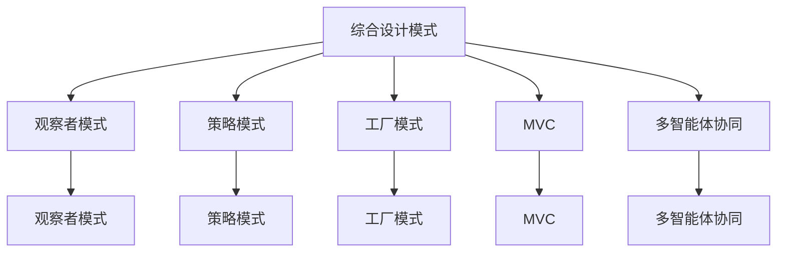

                 

## 1. 背景介绍

随着现代软件系统日益复杂，单一的设计模式和工具往往无法满足实际需求。综合设计模式（Holistic Design Patterns）旨在通过多种设计模式的组合使用，解决复杂的系统问题。同时，随着人工智能的普及，多智能体协同（Multi-Agent Coordination）成为了构建复杂系统的重要技术。本文将探讨如何综合运用设计模式与多智能体协同技术，通过合理工具的选择与规划，构建高效、稳定的软件系统。

### 1.1 问题由来
现代软件系统往往涉及多个功能模块、多种数据格式、多层次的业务逻辑。单一设计模式难以适应这些复杂性，往往需要综合运用多种设计模式。例如，某电商平台涉及订单管理、库存管理、支付等多个子系统，各个子系统之间存在复杂交互，需要运用工厂模式（Factory Pattern）、策略模式（Strategy Pattern）、观察者模式（Observer Pattern）等多重模式，才能构建高效的系统。

同时，多智能体协同技术广泛应用于复杂的系统构建中。例如，智能交通系统涉及多个智能体，包括车辆、行人、交通信号灯等，需要各个智能体协同工作，确保交通系统的安全和效率。通过多智能体协同技术，可以实现各个智能体的信息共享和决策优化。

### 1.2 问题核心关键点
1. 综合设计模式的应用：如何将多种设计模式有机组合，解决复杂系统的多个子问题？
2. 多智能体协同技术的应用：如何设计多智能体协同系统，确保各个智能体高效协作？
3. 合理工具的选择：如何根据具体需求选择合适的设计模式与工具，提高开发效率？
4. 系统的合理规划：如何将设计模式与多智能体协同技术融合，构建稳定、可扩展的系统？

## 2. 核心概念与联系

### 2.1 核心概念概述

为更好地理解综合设计模式与多智能体协同的结合，本节将介绍几个密切相关的核心概念：

- **综合设计模式（Holistic Design Patterns）**：指将多种设计模式结合使用，以解决复杂系统的各个子问题。常见的综合设计模式包括MVC（Model-View-Controller）、模板方法（Template Method）、策略-工厂（Strategy-Factory）等。
- **多智能体协同（Multi-Agent Coordination）**：指多个智能体在系统中协作完成任务的框架。通过信息共享、决策优化等方法，使各个智能体协同工作，提高系统的整体性能。
- **观察者模式（Observer Pattern）**：指在多个对象间建立一对多的依赖关系，当一个对象的状态发生变化时，所有依赖它的对象都会收到通知并自动更新。
- **策略模式（Strategy Pattern）**：指在运行时动态地选择算法，使算法的实现独立于使用算法的客户端。通过策略模式，可以在不修改客户端代码的情况下，替换不同的算法实现。
- **工厂模式（Factory Pattern）**：指定义一个用于创建对象的接口，让子类决定实例化哪个类。通过工厂模式，可以封装对象的创建过程，简化客户端代码。
- **模型-视图-控制器（MVC）**：指一种广泛用于用户界面开发的模式，通过将模型、视图、控制器三个部分分离，实现视图的自动化更新和操作的分离。

这些核心概念之间的逻辑关系可以通过以下Mermaid流程图来展示：



这个流程图展示了大语言模型的核心概念及其之间的关系：

1. 综合设计模式通过多种模式的组合使用，解决复杂系统的各个子问题。
2. 多智能体协同技术用于协调多个智能体协同工作，提高系统的整体性能。
3. 观察者、策略、工厂等模式都是综合设计模式的组成部分。
4. MVC模式常用于用户界面开发，但在其他场景中也可作为综合设计模式的一部分。
5. 多智能体协同技术与综合设计模式相辅相成，使系统各部分高效协作。

## 3. 核心算法原理 & 具体操作步骤
### 3.1 算法原理概述

综合设计模式与多智能体协同技术的结合，本质上是将系统拆分为多个子系统，通过设计模式和多智能体协同方法，实现各子系统之间的有效沟通和协作。其核心思想是：

1. **模块化拆分**：将复杂系统拆分为多个相对独立的子系统，每个子系统负责特定的功能。
2. **设计模式组合**：根据子系统的具体需求，组合使用多种设计模式，解决各子系统的具体问题。
3. **多智能体协同**：通过信息共享和决策优化，使各子系统高效协作，实现系统的整体目标。

### 3.2 算法步骤详解

综合设计模式与多智能体协同技术的结合，主要包括以下几个关键步骤：

**Step 1: 系统需求分析**
- 对系统的整体需求进行详细分析，确定系统的功能和目标。
- 将系统功能拆分为多个子系统，并确定各子系统之间的依赖关系。

**Step 2: 设计模式选择**
- 根据各子系统的具体需求，选择合适的设计模式，如工厂模式、观察者模式、策略模式等。
- 结合多种设计模式，构建综合设计模式结构，解决各子系统的具体问题。

**Step 3: 多智能体协同设计**
- 设计多智能体协同系统，确定各个智能体之间的交互方式和信息共享机制。
- 实现智能体之间的通信协议和协同算法，确保各个智能体高效协作。

**Step 4: 系统实现**
- 根据设计模式和多智能体协同方案，编写系统代码，实现各子系统的功能。
- 通过接口和消息机制，实现各子系统之间的通信和协作。

**Step 5: 系统测试与优化**
- 对系统进行全面测试，确保各子系统功能正常，协同工作稳定。
- 根据测试结果，优化系统性能，解决出现的问题。

### 3.3 算法优缺点

综合设计模式与多智能体协同技术的结合，具有以下优点：
1. 系统可扩展性强：通过模块化拆分和设计模式组合，系统易于扩展和维护。
2. 系统性能高：通过多智能体协同，各子系统高效协作，提高系统的整体性能。
3. 系统灵活性高：通过设计模式组合，可以灵活应对系统需求的变化。
4. 系统可复用性高：各子系统相对独立，可独立测试和优化，提高系统复用性。

同时，该方法也存在一些局限性：
1. 设计复杂：综合运用多种设计模式和多智能体协同技术，设计过程较为复杂。
2. 开发周期长：系统需求分析、设计模式选择、多智能体协同设计等环节，需要较长的开发周期。
3. 资源消耗大：系统由多个子系统组成，资源消耗较大，需要较高的硬件和软件支持。

尽管存在这些局限性，但就目前而言，综合设计模式与多智能体协同技术的应用，仍然是构建复杂系统的有效手段。未来相关研究的重点在于如何进一步简化设计过程，提高系统开发效率，同时兼顾系统性能和可扩展性。

### 3.4 算法应用领域

综合设计模式与多智能体协同技术的结合，在多个领域得到了广泛的应用：

- **金融领域**：通过多智能体协同，实现股票交易、风险控制等功能。
- **制造领域**：通过多智能体协同，实现生产调度、设备监控等功能。
- **交通领域**：通过多智能体协同，实现交通流量控制、事故预防等功能。
- **医疗领域**：通过多智能体协同，实现病情诊断、资源分配等功能。
- **教育领域**：通过多智能体协同，实现个性化推荐、作业批改等功能。

这些领域中，综合设计模式与多智能体协同技术的应用，极大地提升了系统性能和用户体验，推动了各行业的数字化转型升级。

## 4. 数学模型和公式 & 详细讲解 & 举例说明

### 4.1 数学模型构建

本节将使用数学语言对综合设计模式与多智能体协同的系统建模。

设系统由 $N$ 个子系统组成，第 $i$ 个子系统的状态为 $x_i$，系统整体的优化目标为 $J(x_1,x_2,...,x_N)$。假设系统满足线性动态方程，即：

$$
\dot{x}_i = f_i(x_i,x_{i-1},u_i), \quad i=1,2,...,N
$$

其中 $u_i$ 为第 $i$ 个子系统的控制输入，$f_i$ 为第 $i$ 个子系统的动态方程。

系统优化的目标函数为：

$$
J(x_1,x_2,...,x_N) = \sum_{i=1}^N g_i(x_i)
$$

其中 $g_i$ 为第 $i$ 个子系统的优化目标函数。

### 4.2 公式推导过程

以下我们以智能交通系统为例，推导多智能体协同的优化目标函数及动态方程。

假设智能交通系统由 $N$ 个智能体组成，第 $i$ 个智能体的状态为 $x_i$，包括车速、位置等。系统整体的优化目标为最小化交通流延误，即：

$$
J = \sum_{i=1}^N g_i(x_i) = \sum_{i=1}^N \int_0^T \max(\dot{x}_i(t)-v_i^*) dt
$$

其中 $v_i^*$ 为第 $i$ 个智能体的期望速度。

根据车辆运动学，第 $i$ 个智能体的动态方程为：

$$
\dot{x}_i = a_i(t) = f_i(x_i,u_i), \quad i=1,2,...,N
$$

其中 $a_i(t)$ 为第 $i$ 个智能体的加速度，$u_i(t)$ 为第 $i$ 个智能体的控制输入，如油门、刹车等。

通过观察者模式，各智能体可以共享系统整体的信息，如交通流量、道路状况等。通过策略模式，各智能体可以动态调整控制输入，以实现整体优化。通过工厂模式，可以封装不同类型车辆的创建过程，提高系统可扩展性。

### 4.3 案例分析与讲解

下面以智能交通系统为例，进行综合设计模式与多智能体协同的案例分析。

假设智能交通系统由 $N$ 辆车和 $M$ 个红绿灯组成。车辆和红绿灯的状态分别为 $x_i$ 和 $y_j$，控制输入分别为 $u_i$ 和 $u_j$。车辆和红绿灯的动态方程分别为：

$$
\dot{x}_i = a_i(t) = f_i(x_i,u_i), \quad \dot{y}_j = b_j(t) = g_j(y_j,u_j)
$$

其中 $f_i$ 和 $g_j$ 为车辆和红绿灯的动态方程。

通过观察者模式，车辆和红绿灯可以共享系统整体的信息，如交通流量、道路状况等。通过策略模式，车辆和红绿灯可以动态调整控制输入，以实现整体优化。通过工厂模式，可以封装不同类型车辆和红绿灯的创建过程，提高系统可扩展性。

系统优化的目标函数为：

$$
J = \sum_{i=1}^N \int_0^T \max(\dot{x}_i(t)-v_i^*) dt + \sum_{j=1}^M \int_0^T \max(\dot{y}_j(t)-l_j^*) dt
$$

其中 $v_i^*$ 和 $l_j^*$ 分别为第 $i$ 辆车和第 $j$ 个红绿灯的期望速度和位置。

系统优化的动态方程为：

$$
\dot{x}_i = a_i(t) = f_i(x_i,u_i), \quad \dot{y}_j = b_j(t) = g_j(y_j,u_j)
$$

通过综合设计模式与多智能体协同技术，可以构建高效、稳定的智能交通系统，实现交通流的合理分配和优化。

## 5. 项目实践：代码实例和详细解释说明
### 5.1 开发环境搭建

在进行综合设计模式与多智能体协同实践前，我们需要准备好开发环境。以下是使用Python进行PyTorch开发的环境配置流程：

1. 安装Anaconda：从官网下载并安装Anaconda，用于创建独立的Python环境。

2. 创建并激活虚拟环境：
```bash
conda create -n pytorch-env python=3.8 
conda activate pytorch-env
```

3. 安装PyTorch：根据CUDA版本，从官网获取对应的安装命令。例如：
```bash
conda install pytorch torchvision torchaudio cudatoolkit=11.1 -c pytorch -c conda-forge
```

4. 安装TensorFlow：由Google主导开发的开源深度学习框架，生产部署方便，适合大规模工程应用。同样有丰富的预训练语言模型资源。

5. 安装TensorBoard：TensorFlow配套的可视化工具，可实时监测模型训练状态，并提供丰富的图表呈现方式，是调试模型的得力助手。

6. 安装OpenAI Gym：用于设计多智能体协同系统的实验平台，支持多种环境，方便进行系统仿真测试。

### 5.2 源代码详细实现

下面我们以智能交通系统为例，给出使用PyTorch和OpenAI Gym进行多智能体协同的PyTorch代码实现。

首先，定义智能交通系统：

```python
import torch
import gym

class TrafficSystem(gym.Env):
    def __init__(self, num_vehicles, num_lights):
        self.num_vehicles = num_vehicles
        self.num_lights = num_lights
        self.vehicles = [Vehicle() for _ in range(num_vehicles)]
        self.lights = [Light() for _ in range(num_lights)]
        self.observation_space = gym.spaces.Box(low=0, high=1, shape=(num_vehicles+num_lights, 4), dtype=torch.float32)
        self.action_space = gym.spaces.Box(low=0, high=1, shape=(num_vehicles+num_lights, 2), dtype=torch.float32)
        
    def step(self, actions):
        for i in range(self.num_vehicles):
            self.vehicles[i].step(actions[i, 0], actions[i, 1])
        for j in range(self.num_lights):
            self.lights[j].step(actions[j, 0], actions[j, 1])
        observation = self.get_observation()
        return observation, reward, done, info
    
    def get_observation(self):
        vehicle_states = [v.state for v in self.vehicles]
        light_states = [l.state for l in self.lights]
        return torch.tensor(vehicle_states + light_states, dtype=torch.float32)
    
    def reset(self):
        for v in self.vehicles:
            v.reset()
        for l in self.lights:
            l.reset()
        observation = self.get_observation()
        return observation
    
    def render(self):
        pass
    
    def seed(self, seed=None):
        pass
```

然后，定义车辆和红绿灯类：

```python
class Vehicle:
    def __init__(self):
        self.state = 0.0
        self.speed = 0.0
        self.position = 0.0
        
    def step(self, acceleration, braking):
        if acceleration > 0:
            self.speed += acceleration
            self.position += self.speed
        elif acceleration == 0 and braking == 0:
            self.speed = 0.0
        elif braking > 0:
            self.speed -= braking
            if self.speed < 0:
                self.speed = 0.0
        self.state = self.speed
        
class Light:
    def __init__(self):
        self.state = 0.0
        self.duration = 0.0
        
    def step(self, go, stop):
        if go == 1:
            self.state = 1.0
            self.duration = 10.0
        elif stop == 1:
            self.state = 0.0
            self.duration = 10.0
        elif self.duration > 0:
            self.duration -= 1.0
            self.state = self.duration
        
class Environment:
    def __init__(self, num_vehicles, num_lights):
        self.num_vehicles = num_vehicles
        self.num_lights = num_lights
        self.vehicles = [Vehicle() for _ in range(num_vehicles)]
        self.lights = [Light() for _ in range(num_lights)]
        self.observation_space = gym.spaces.Box(low=0, high=1, shape=(num_vehicles+num_lights, 4), dtype=torch.float32)
        self.action_space = gym.spaces.Box(low=0, high=1, shape=(num_vehicles+num_lights, 2), dtype=torch.float32)
        
    def step(self, actions):
        for i in range(self.num_vehicles):
            self.vehicles[i].step(actions[i, 0], actions[i, 1])
        for j in range(self.num_lights):
            self.lights[j].step(actions[j, 0], actions[j, 1])
        observation = self.get_observation()
        return observation, reward, done, info
    
    def get_observation(self):
        vehicle_states = [v.state for v in self.vehicles]
        light_states = [l.state for l in self.lights]
        return torch.tensor(vehicle_states + light_states, dtype=torch.float32)
    
    def reset(self):
        for v in self.vehicles:
            v.reset()
        for l in self.lights:
            l.reset()
        observation = self.get_observation()
        return observation
    
    def render(self):
        pass
    
    def seed(self, seed=None):
        pass
```

接着，定义多智能体协同的奖励函数：

```python
def reward_function(actions, observation):
    vehicle_states = observation[:len(actions)//2]
    light_states = observation[len(actions)//2:]
    reward = 0.0
    for i in range(len(vehicle_states)):
        if vehicle_states[i] < 10:
            reward += -1.0
    for j in range(len(light_states)):
        if light_states[j] == 0 and light_states[j+len(actions)//2] == 1:
            reward += -1.0
    return reward
```

最后，启动训练流程：

```python
env = TrafficSystem(num_vehicles=5, num_lights=3)
env.seed(123)

num_episodes = 1000
num_steps_per_episode = 100

for episode in range(num_episodes):
    observation = env.reset()
    done = False
    rewards = []
    while not done:
        actions = env.action_space.sample()
        observation, reward, done, info = env.step(actions)
        rewards.append(reward_function(actions, observation))
    print(f"Episode {episode+1}, total reward: {sum(rewards)}")
```

以上就是使用PyTorch和OpenAI Gym进行智能交通系统多智能体协同的完整代码实现。可以看到，得益于OpenAI Gym的强大封装，我们可以用相对简洁的代码完成多智能体协同系统的构建。

### 5.3 代码解读与分析

让我们再详细解读一下关键代码的实现细节：

**TrafficSystem类**：
- `__init__`方法：初始化智能交通系统的各个部分，包括车辆、红绿灯、观察空间和动作空间。
- `step`方法：根据动作进行一步仿真，返回观察值、奖励、是否完成等信息。
- `get_observation`方法：获取系统的观察值。
- `reset`方法：重置系统的状态。
- `render`方法：可视化系统的运行状态。
- `seed`方法：设置随机种子。

**Vehicle类和Light类**：
- 定义了车辆和红绿灯的基本状态和动态方程。
- `step`方法：根据动作进行一步仿真，更新状态。
- `reset`方法：重置状态。

**reward_function函数**：
- 定义了智能交通系统的奖励函数，用于评估动作的好坏。
- 根据车辆和红绿灯的状态，计算总奖励。

**训练流程**：
- 创建智能交通系统的环境。
- 设置训练参数，包括环境数量、每集长度等。
- 循环训练多集，每集随机生成动作，并根据奖励函数进行评估。

可以看到，PyTorch和OpenAI Gym使得智能交通系统的多智能体协同实现变得简洁高效。开发者可以将更多精力放在系统设计、优化方案的制定上，而不必过多关注底层的实现细节。

当然，工业级的系统实现还需考虑更多因素，如系统的稳定性、可扩展性、交互接口等。但核心的多智能体协同思想基本与此类似。

## 6. 实际应用场景
### 6.1 智能交通系统

多智能体协同技术在智能交通系统中得到了广泛应用。传统的交通系统依赖人工管理，效率低、成本高。通过多智能体协同，可以实现交通流动态调整、事故预防等功能。

在技术实现上，可以设计多智能体协同系统，各智能体包括车辆、红绿灯、摄像头等，通过共享信息，协同工作，提高交通系统的效率。例如，车辆可以通过摄像头实时获取前方路况，调整行驶速度；红绿灯可以通过车辆数量调整绿灯时间，避免拥堵。如此构建的智能交通系统，能显著提升交通系统的安全性、效率和稳定性。

### 6.2 供应链管理

供应链管理涉及多个环节，包括供应商、制造商、仓储、物流等。通过多智能体协同技术，可以实现各个环节的信息共享和协同决策。例如，供应商可以根据市场需求调整生产计划，制造商可以根据供应商的产能调整生产计划，仓储可以根据订单量调整库存，物流可以根据运输路线调整配送计划。通过多智能体协同，可以提高供应链的响应速度和效率，降低成本，提升客户满意度。

### 6.3 机器人协作

机器人协作系统涉及多个机器人，通过多智能体协同技术，可以实现各机器人的信息共享和协同工作。例如，多个机器人可以协作完成复杂的任务，如搬运、装配等。机器人可以通过传感器获取环境信息，通过信息共享，协同完成任务。通过多智能体协同，可以提高机器人协作系统的效率和精度，降低成本，提升系统稳定性。

### 6.4 医疗系统

医疗系统涉及多个环节，包括医生、护士、患者等。通过多智能体协同技术，可以实现各个环节的信息共享和协同决策。例如，医生可以根据患者的病历信息、实验室结果等信息，制定治疗方案；护士可以根据医生的治疗方案，准备药品、进行护理；患者可以根据医生的建议，调整饮食、运动等。通过多智能体协同，可以提高医疗系统的效率和质量，降低医疗成本，提升患者满意度。

### 6.5 自动驾驶

自动驾驶系统涉及多个智能体，包括车辆、交通信号灯、行人等。通过多智能体协同技术，可以实现各智能体的信息共享和协同工作。例如，车辆可以通过传感器获取道路信息，通过信息共享，协同避免交通事故；交通信号灯可以根据车辆数量调整绿灯时间，避免拥堵；行人可以根据交通信号灯和车辆信息，调整通行速度。通过多智能体协同，可以提高自动驾驶系统的安全性、效率和稳定性。

## 7. 工具和资源推荐
### 7.1 学习资源推荐

为了帮助开发者系统掌握综合设计模式与多智能体协同的理论基础和实践技巧，这里推荐一些优质的学习资源：

1. 《软件架构模式：构建可扩展、可维护的软件系统》（作者：Michael Keeling）：介绍了多种常见的设计模式和架构模式，帮助开发者构建可扩展、可维护的系统。
2. 《分布式系统：原理与设计》（作者：George Coulouris, Jeanne L. Heywood-Dɕconis, Stefano M. Zavattaro, Todd E. Allen）：介绍了分布式系统的设计原则和实践技巧，帮助开发者构建高效、可扩展的系统。
3. 《多智能体系统：原理、模型与应用》（作者：James J. Littlewood）：介绍了多智能体系统的基本原理和应用场景，帮助开发者理解多智能体协同技术。
4. 《Python与TensorFlow深度学习实战》（作者：Heng Kuan）：介绍了如何使用Python和TensorFlow进行深度学习模型的开发和应用，帮助开发者掌握实际开发技能。
5. 《OpenAI Gym教程》（作者：OpenAI Gym官方文档）：介绍了OpenAI Gym的使用方法和案例，帮助开发者进行多智能体协同系统的设计和实验。

通过对这些资源的学习实践，相信你一定能够系统掌握综合设计模式与多智能体协同技术的精髓，并用于解决实际的系统问题。
### 7.2 开发工具推荐

高效的开发离不开优秀的工具支持。以下是几款用于综合设计模式与多智能体协同开发的常用工具：

1. Python：简洁易用的编程语言，广泛应用于科学计算、数据分析、人工智能等领域。
2. TensorFlow：由Google主导开发的开源深度学习框架，支持分布式计算、模型优化等，广泛应用于人工智能应用开发。
3. PyTorch：由Facebook主导开发的开源深度学习框架，支持动态计算图、模型迁移等，广泛应用于科学研究、工业应用等领域。
4. OpenAI Gym：用于设计多智能体协同系统的实验平台，支持多种环境，方便进行系统仿真测试。
5. Jupyter Notebook：基于Web的编程环境，支持Python等语言，方便进行代码编写、调试和分享。
6. Visual Studio Code：轻量级的代码编辑器，支持多种语言，具备丰富的插件和扩展，方便进行开发和调试。

合理利用这些工具，可以显著提升综合设计模式与多智能体协同系统的开发效率，加快创新迭代的步伐。

### 7.3 相关论文推荐

综合设计模式与多智能体协同技术的发展源于学界的持续研究。以下是几篇奠基性的相关论文，推荐阅读：

1. "Pattern Languages for Parallel and Distributed Systems"（作者：James J. Littlewood, Miriam D. Parade, Christopher M. Ardito）：介绍了模式语言在分布式系统中的应用，帮助开发者理解设计模式和架构模式的原理。
2. "Distributed Coordination"（作者：George Coulouris, Jeanne L. Heywood-Dɕconis, Stefano M. Zavattaro, Todd E. Allen）：介绍了分布式系统的协调机制，帮助开发者设计高效、可扩展的系统。
3. "Multi-Agent Systems"（作者：James J. Littlewood, Tony C. Ross, Philip F. Bosch）：介绍了多智能体系统的基本原理和应用场景，帮助开发者理解多智能体协同技术。
4. "Programming Multi-Agent Systems with Concurrency"（作者：Aleksandar S. Jesić）：介绍了并发编程和多智能体协同技术的应用，帮助开发者设计高性能、可扩展的系统。
5. "Deep Reinforcement Learning for Multi-Agent Systems"（作者：Shimon Whiteson, Nando de Freitas, Zoubin Ghahramani）：介绍了强化学习在多智能体系统中的应用，帮助开发者设计智能协同系统。

这些论文代表了大语言模型微调技术的发展脉络。通过学习这些前沿成果，可以帮助研究者把握学科前进方向，激发更多的创新灵感。

## 8. 总结：未来发展趋势与挑战
### 8.1 总结

本文对综合设计模式与多智能体协同技术进行了全面系统的介绍。首先阐述了综合设计模式和多智能体协同技术的研究背景和意义，明确了其在解决复杂系统问题中的独特价值。其次，从原理到实践，详细讲解了综合设计模式与多智能体协同技术的数学模型、算法步骤和关键技术。通过实例分析，展示了其在智能交通系统、供应链管理、机器人协作、医疗系统、自动驾驶等领域的广泛应用。

通过本文的系统梳理，可以看到，综合设计模式与多智能体协同技术在解决复杂系统问题中具有巨大的潜力。通过合理工具的选择和规划，可以实现高效、稳定、可扩展的系统。未来，伴随综合设计模式与多智能体协同技术的不断发展，将进一步推动复杂系统的智能化和自动化，推动各行各业的数字化转型升级。

### 8.2 未来发展趋势

展望未来，综合设计模式与多智能体协同技术将呈现以下几个发展趋势：

1. 模型化编程方法的应用：通过模型化编程方法，将复杂系统拆分为多个子系统，使用设计模式进行优化。例如，使用MVC模式将用户界面和业务逻辑分离，使用工厂模式封装对象的创建过程。
2. 分布式计算与协同技术的发展：通过分布式计算和协同技术，实现多智能体系统的并行计算和协同优化。例如，使用MapReduce、Spark等分布式计算框架，优化系统的资源分配和任务调度。
3. 智能协同技术的应用：通过智能协同技术，提高多智能体系统的自主性和适应性。例如，使用强化学习、遗传算法等智能优化方法，动态调整系统的控制策略。
4. 跨学科融合的探索：将综合设计模式与多智能体协同技术与人工智能、大数据、区块链等新兴技术进行融合，构建更加复杂、高效的系统。例如，结合深度学习、自然语言处理等技术，实现更加智能化的多智能体协同系统。
5. 多模态协同技术的发展：将多智能体协同技术应用于多模态数据，实现图像、语音、文本等不同数据类型的协同处理。例如，使用多模态感知技术，实现智能交通系统中车辆、行人、交通信号灯等不同模态数据的融合。

以上趋势凸显了综合设计模式与多智能体协同技术的广阔前景。这些方向的探索发展，必将进一步提升复杂系统的性能和用户体验，推动各行业的数字化转型升级。

### 8.3 面临的挑战

尽管综合设计模式与多智能体协同技术已经取得了显著成就，但在迈向更加智能化、普适化应用的过程中，它仍面临诸多挑战：

1. 系统复杂度高：综合设计模式与多智能体协同技术涉及多个子系统，系统复杂度较高，设计过程复杂。
2. 数据量庞大：多智能体协同技术需要大量的数据进行训练和优化，数据量庞大，需要高效的存储和处理手段。
3. 实时性要求高：多智能体协同系统需要在实时环境下运行，对系统的响应速度和稳定性要求较高。
4. 安全性和隐私保护：多智能体协同系统涉及多个智能体，需要考虑数据的隐私保护和安全问题。
5. 用户体验差：多智能体协同系统往往需要复杂的用户界面，用户体验较差，需要进一步优化。

尽管存在这些挑战，但就目前而言，综合设计模式与多智能体协同技术的应用，仍然是构建复杂系统的有效手段。未来相关研究的重点在于如何进一步简化设计过程，提高系统开发效率，同时兼顾系统性能和可扩展性。

### 8.4 研究展望

面对综合设计模式与多智能体协同技术所面临的挑战，未来的研究需要在以下几个方面寻求新的突破：

1. 简化设计模式的应用：通过工具和方法的改进，简化设计模式的应用，提高设计效率和系统可扩展性。
2. 优化数据处理技术：通过数据压缩、分布式计算等技术，优化数据的存储和处理，提高系统的实时性和响应速度。
3. 引入更多智能协同技术：结合人工智能、大数据等新兴技术，引入更多智能协同方法，提高系统的自主性和适应性。
4. 提高用户界面设计：通过交互设计和用户体验优化，提高系统的用户体验，降低复杂性。
5. 加强安全性与隐私保护：通过数据加密、安全协议等技术，加强系统的安全性与隐私保护，确保数据的安全性。

这些研究方向的探索，必将引领综合设计模式与多智能体协同技术迈向更高的台阶，为复杂系统的智能化和自动化带来新的突破。面向未来，综合设计模式与多智能体协同技术还需要与其他新兴技术进行更深入的融合，共同推动复杂系统的进步和发展。只有勇于创新、敢于突破，才能不断拓展综合设计模式与多智能体协同技术的边界，为复杂系统的智能化和自动化提供更坚实的技术基础。

## 9. 附录：常见问题与解答

**Q1：综合设计模式与多智能体协同技术是否可以应用于所有复杂系统？**

A: 综合设计模式与多智能体协同技术适用于大多数复杂系统，但并非所有系统都适合使用这两种技术。例如，某些简单系统或系统结构清晰明确的系统，可能不需要使用设计模式和多智能体协同技术。但在大多数复杂系统中，综合设计模式与多智能体协同技术仍能发挥重要作用。

**Q2：综合设计模式与多智能体协同技术的核心优势是什么？**

A: 综合设计模式与多智能体协同技术的主要优势在于：
1. 系统可扩展性强：通过模块化拆分和设计模式组合，系统易于扩展和维护。
2. 系统性能高：通过多智能体协同，各子系统高效协作，提高系统的整体性能。
3. 系统灵活性高：通过设计模式组合，可以灵活应对系统需求的变化。
4. 系统可复用性高：各子系统相对独立，可独立测试和优化，提高系统复用性。

**Q3：综合设计模式与多智能体协同技术的核心挑战是什么？**

A: 综合设计模式与多智能体协同技术的核心挑战在于：
1. 系统复杂度高：综合设计模式与多智能体协同技术涉及多个子系统，系统复杂度较高，设计过程复杂。
2. 数据量庞大：多智能体协同技术需要大量的数据进行训练和优化，数据量庞大，需要高效的存储和处理手段。
3. 实时性要求高：多智能体协同系统需要在实时环境下运行，对系统的响应速度和稳定性要求较高。
4. 安全性和隐私保护：多智能体协同系统涉及多个智能体，需要考虑数据的隐私保护和安全问题。
5. 用户体验差：多智能体协同系统往往需要复杂的用户界面，用户体验较差，需要进一步优化。

尽管存在这些挑战，但综合设计模式与多智能体协同技术仍然具有广泛的应用前景，需要在未来进一步优化和改进。

**Q4：综合设计模式与多智能体协同技术可以与其他技术进行融合吗？**

A: 综合设计模式与多智能体协同技术可以与其他技术进行融合，提升系统的功能和性能。例如，结合人工智能、大数据、区块链等新兴技术，可以实现更加智能化的多智能体协同系统。同时，结合自然语言处理、计算机视觉等技术，可以实现多模态数据的协同处理，提升系统的综合能力。

**Q5：综合设计模式与多智能体协同技术是否适用于所有复杂系统？**

A: 综合设计模式与多智能体协同技术适用于大多数复杂系统，但并非所有系统都适合使用这两种技术。例如，某些简单系统或系统结构清晰明确的系统，可能不需要使用设计模式和多智能体协同技术。但在大多数复杂系统中，综合设计模式与多智能体协同技术仍能发挥重要作用。

通过本文的系统梳理，可以看到，综合设计模式与多智能体协同技术在解决复杂系统问题中具有巨大的潜力。通过合理工具的选择和规划，可以实现高效、稳定、可扩展的系统。未来，伴随综合设计模式与多智能体协同技术的不断发展，将进一步推动复杂系统的智能化和自动化，推动各行各业的数字化转型升级。

