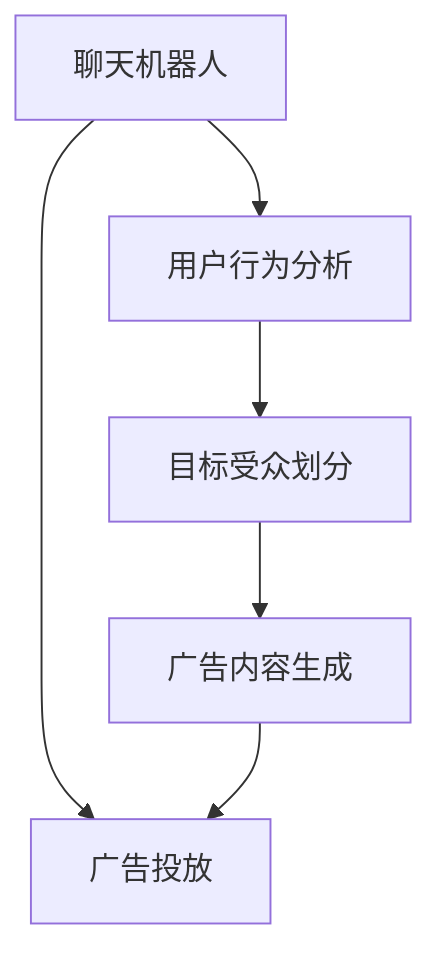

                 

# 聊天机器人广告业：个性化广告活动和目标受众

## 1. 背景介绍

### 1.1 问题由来

随着数字化时代的到来，广告业面临着前所未有的变革。传统的电视、广播、报纸等媒介形式逐渐被网络、社交媒体等数字渠道所取代。这不仅改变了广告的展示方式，也要求广告内容更加精准、有针对性地触达目标受众。因此，如何高效、个性化地进行广告投放，成为了广告业亟待解决的重要问题。

### 1.2 问题核心关键点

广告个性化是广告业面对数字化转型的核心挑战。通过精准定位目标受众，并针对性地展示广告内容，可以显著提升广告投放的效率和效果。广告个性化的关键在于：

1. **用户行为分析**：通过分析用户的历史行为数据，挖掘用户的兴趣偏好、购买意愿等信息。
2. **目标受众划分**：基于用户行为分析结果，将用户划分为不同的目标群体，实现更精准的定向投放。
3. **广告内容生成**：根据目标受众的特征和偏好，生成个性化的广告内容，提高用户的点击率和转化率。

## 2. 核心概念与联系

### 2.1 核心概念概述

为更好地理解聊天机器人广告个性化的实现过程，本节将介绍几个关键概念：

- **聊天机器人(Chatbot)**：能够模拟人类对话，自动处理用户查询和反馈的智能程序。
- **广告投放(Ad Placement)**：将广告内容投放至特定媒体渠道的过程。
- **目标受众(Target Audience)**：广告主希望通过广告内容触及和影响的特定用户群体。
- **个性化广告(Customized Advertising)**：针对目标受众的特征和需求，定制化的广告内容展示方式。
- **用户行为分析(User Behavior Analysis)**：通过数据分析技术，识别用户的行为模式和偏好，为广告投放提供依据。

这些概念之间的关系可以通过以下Mermaid流程图来展示：



这个流程图展示了聊天机器人在广告个性化投放中的核心作用：

1. 通过用户行为分析，获取用户兴趣和行为数据。
2. 基于分析结果，进行目标受众的划分。
3. 根据目标受众特征，生成个性化的广告内容。
4. 最后，将个性化广告通过聊天机器人投放至用户，实现精准营销。

## 3. 核心算法原理 & 具体操作步骤

### 3.1 算法原理概述

聊天机器人广告个性化的核心在于基于用户行为数据的分析，实现目标受众的精准定位和广告内容的个性化生成。其总体流程可以概括为以下几个步骤：

1. **用户行为数据收集**：通过各种数字渠道（如网站、App、社交媒体等），收集用户的行为数据。
2. **用户行为分析**：利用机器学习和数据挖掘技术，对用户行为数据进行深入分析，挖掘出用户的兴趣、偏好、购买意愿等信息。
3. **目标受众划分**：根据用户行为分析的结果，将用户划分为不同的目标群体。
4. **广告内容生成**：针对不同目标群体，生成个性化的广告内容，满足其特定的需求和偏好。
5. **广告投放**：通过聊天机器人，将个性化广告投放至目标受众，实现精准营销。

### 3.2 算法步骤详解

以下是聊天机器人广告个性化的详细操作步骤：

**Step 1: 数据收集与预处理**

- **数据源收集**：从各种数字渠道收集用户的行为数据，包括浏览记录、购买历史、社交媒体互动等。
- **数据预处理**：对原始数据进行清洗、去重、归一化等预处理，保证数据质量。

**Step 2: 用户行为分析**

- **特征工程**：提取用户行为数据的特征，如浏览频率、点击率、购买金额、社交媒体互动等。
- **模型训练**：使用机器学习算法（如K-means、TF-IDF、SVM等）对用户行为数据进行建模，挖掘用户的兴趣和偏好。

**Step 3: 目标受众划分**

- **聚类分析**：使用聚类算法（如K-means、层次聚类等）对用户进行聚类，形成不同的目标群体。
- **标签识别**：为每个目标群体分配特定的标签或特征，如“年轻女性”、“科技爱好者”等。

**Step 4: 广告内容生成**

- **内容库构建**：构建包含各种广告素材的内容库，如图片、视频、文案等。
- **模板匹配**：根据目标受众的标签和特征，从内容库中选择合适的素材，生成个性化的广告内容。

**Step 5: 广告投放**

- **聊天机器人接入**：将聊天机器人与广告平台或数字渠道对接，实现广告内容的投放。
- **用户交互**：通过聊天机器人与用户进行互动，展示个性化广告，并收集用户反馈。

### 3.3 算法优缺点

聊天机器人广告个性化的优点包括：

1. **精准投放**：通过用户行为分析，实现对目标受众的精准定位。
2. **高效转化**：个性化广告内容更能满足用户的兴趣和需求，提高点击率和转化率。
3. **数据驱动**：广告投放过程完全基于数据驱动，可实现动态调整和优化。

但同时也存在一些缺点：

1. **数据隐私问题**：用户行为数据的收集和使用可能涉及隐私问题，需要严格遵守数据保护法规。
2. **技术复杂性**：个性化广告的实现需要复杂的算法和技术手段，对数据科学家和工程师的要求较高。
3. **模型过拟合**：用户行为数据可能存在噪音和偏差，导致模型过拟合，影响广告效果。

### 3.4 算法应用领域

聊天机器人广告个性化在多个领域均有广泛应用：

- **电商广告**：基于用户浏览和购买行为，生成个性化商品广告，提升销售额。
- **品牌推广**：通过分析社交媒体互动数据，生成针对特定人群的广告内容，提升品牌知名度。
- **健康医疗**：利用患者的历史健康记录，生成个性化的健康信息广告，提高诊疗效果。
- **旅游广告**：根据用户的旅游偏好和历史行为，生成旅游目的地推荐广告，吸引游客。
- **金融广告**：基于用户的金融活动数据，生成个性化的理财产品和保险广告，促进用户购买。

## 4. 数学模型和公式 & 详细讲解 & 举例说明

### 4.1 数学模型构建

为了更好地理解聊天机器人广告个性化的数学模型，本节将构建一个简单的用户行为分析模型。假设用户行为数据包含两个特征：浏览时间（$t$）和点击次数（$c$），目标是将用户分为高潜力和低潜力两类。

模型训练时，需要定义损失函数 $L$ 来衡量预测结果与真实标签的差异：

$$
L = \sum_{i=1}^N (y_i - \hat{y}_i)^2
$$

其中 $y_i$ 为真实标签（高潜力为1，低潜力为0），$\hat{y}_i$ 为模型的预测结果。

### 4.2 公式推导过程

以线性回归模型为例，推导其预测结果和损失函数的计算公式：

假设用户行为数据可以通过特征向量 $X$ 表示，模型的预测结果为 $\hat{y} = \beta_0 + \beta_1 x_1 + \beta_2 x_2$。

损失函数可以表示为：

$$
L = \frac{1}{2N} \sum_{i=1}^N (y_i - \hat{y}_i)^2
$$

其中 $N$ 为样本数，$\beta_0, \beta_1, \beta_2$ 为模型参数。

根据梯度下降优化算法，模型的参数更新公式为：

$$
\beta_0 \leftarrow \beta_0 - \eta \frac{1}{N} \sum_{i=1}^N (y_i - \hat{y}_i)
$$
$$
\beta_1 \leftarrow \beta_1 - \eta \frac{1}{N} \sum_{i=1}^N (y_i - \hat{y}_i) x_{1,i}
$$
$$
\beta_2 \leftarrow \beta_2 - \eta \frac{1}{N} \sum_{i=1}^N (y_i - \hat{y}_i) x_{2,i}
$$

其中 $\eta$ 为学习率。

### 4.3 案例分析与讲解

以电商平台为例，假设用户浏览和点击行为数据如下：

| 用户ID | 浏览时间 | 点击次数 | 是否高潜力 |
| --- | --- | --- | --- |
| 1 | 30 | 5 | 1 |
| 2 | 45 | 10 | 0 |
| 3 | 60 | 3 | 1 |
| 4 | 30 | 5 | 0 |

可以使用上述线性回归模型进行训练，得到 $\beta_0 = 0.5$，$\beta_1 = 0.2$，$\beta_2 = 0.1$。

因此，对于新用户（ID 5）的预测结果为：

$$
\hat{y} = 0.5 + 0.2 \times 30 + 0.1 \times 5 = 0.5 + 6 + 0.5 = 7
$$

根据阈值（如0.5），判断用户是否为高潜力用户。

## 5. 项目实践：代码实例和详细解释说明

### 5.1 开发环境搭建

在进行广告个性化聊天机器人开发前，我们需要准备好开发环境。以下是使用Python进行PyTorch开发的环境配置流程：

1. 安装Anaconda：从官网下载并安装Anaconda，用于创建独立的Python环境。

2. 创建并激活虚拟环境：
```bash
conda create -n pytorch-env python=3.8 
conda activate pytorch-env
```

3. 安装PyTorch：根据CUDA版本，从官网获取对应的安装命令。例如：
```bash
conda install pytorch torchvision torchaudio cudatoolkit=11.1 -c pytorch -c conda-forge
```

4. 安装TensorFlow：
```bash
conda install tensorflow -c conda-forge
```

5. 安装TensorBoard：
```bash
pip install tensorboard
```

完成上述步骤后，即可在`pytorch-env`环境中开始开发实践。

### 5.2 源代码详细实现

这里我们以电商广告为例，使用PyTorch构建一个简单的用户行为分析模型，并进行广告内容生成。

首先，定义模型类：

```python
import torch
import torch.nn as nn
import torch.optim as optim

class UserBehaviorModel(nn.Module):
    def __init__(self, input_size):
        super(UserBehaviorModel, self).__init__()
        self.linear = nn.Linear(input_size, 1)

    def forward(self, x):
        return self.linear(x)
```

然后，准备数据集：

```python
import numpy as np

X = np.array([[30, 5], [45, 10], [60, 3], [30, 5]])
y = np.array([1, 0, 1, 0])
```

接着，定义损失函数和优化器：

```python
criterion = nn.MSELoss()
optimizer = optim.SGD(model.parameters(), lr=0.01)
```

最后，进行模型训练和测试：

```python
epochs = 100
for epoch in range(epochs):
    optimizer.zero_grad()
    output = model(X)
    loss = criterion(output, y)
    loss.backward()
    optimizer.step()
    
    if (epoch+1) % 10 == 0:
        print(f'Epoch {epoch+1}, Loss: {loss.item()}')

X_test = np.array([[50, 10], [40, 8], [70, 4]])
y_test = np.array([1, 0, 1])
output_test = model(X_test)
print(f'Prediction: {output_test.item()}')
```

以上就是使用PyTorch构建用户行为分析模型的完整代码实现。可以看到，通过简单的线性回归模型，即可对电商广告的个性化投放进行预测和评估。

### 5.3 代码解读与分析

让我们再详细解读一下关键代码的实现细节：

**UserBehaviorModel类**：
- `__init__`方法：初始化模型参数，定义一个线性层。
- `forward`方法：定义前向传播过程，将输入数据通过线性层进行预测。

**数据准备**：
- `X`和`y`分别代表用户行为数据的特征和真实标签。

**损失函数和优化器**：
- `criterion`定义了均方误差损失函数。
- `optimizer`定义了随机梯度下降优化器，并设置了学习率。

**模型训练和测试**：
- 在每个epoch内，通过`optimizer.zero_grad`清空梯度，通过`model.forward`进行前向传播，计算损失函数并反向传播更新参数。
- 每10个epoch输出一次损失值，用于监控模型训练的进展。
- 使用测试集数据进行模型预测，输出预测结果。

可以看到，PyTorch的框架设计使得模型训练和测试过程变得简单高效。开发者可以将更多精力放在模型改进、数据处理等高层逻辑上，而不必过多关注底层的实现细节。

## 6. 实际应用场景

### 6.1 智能客服系统

基于聊天机器人广告个性化技术，智能客服系统可以进一步提升用户满意度和服务效率。传统客服系统往往需要人工干预，难以应对高峰期的服务压力。通过个性化广告，可以引导用户自主解决问题，减少人工干预。

例如，当用户咨询电商平台退货政策时，智能客服可以通过分析用户的行为数据，判断用户是否具有退货意愿，并展示相应的广告内容。如果用户表示愿意退货，可以进一步引导用户填写退货信息，简化操作流程，提高服务效率。

### 6.2 个性化推荐系统

广告个性化技术在个性化推荐系统中同样具有广泛应用。传统的推荐系统主要依赖用户的历史行为数据进行推荐，难以充分考虑用户当前的兴趣和需求。通过个性化广告，推荐系统可以动态调整推荐内容，提升用户体验和转化率。

例如，电商平台可以分析用户最近的浏览和购买行为，生成个性化的商品广告。对于用户感兴趣的商品，展示广告并进行推荐，同时收集用户的反馈，进一步优化推荐算法。

### 6.3 营销活动策划

广告个性化技术还可以用于营销活动的策划和优化。传统的营销活动往往采用大规模的泛化性广告，难以精准触达目标受众。通过个性化广告，可以针对不同的用户群体设计不同的广告内容，提高活动的吸引力和效果。

例如，旅游公司可以分析用户的旅游偏好和历史行为，生成针对特定群体的旅游目的地广告。对于有购买意向的用户，展示广告并进行促销，提高预订转化率。

### 6.4 未来应用展望

随着广告个性化技术的不断进步，其应用场景将更加广泛。未来，聊天机器人广告个性化将深入渗透到更多领域，提升广告效果和用户体验。

在智慧医疗领域，可以通过分析患者的健康数据，生成个性化的健康信息广告，提高诊疗效果和患者满意度。

在智能教育领域，可以根据学生的学习数据，生成个性化的学习资源广告，提升学习效率和效果。

在智慧城市治理中，可以针对市民的需求和反馈，生成个性化的公共服务广告，提高城市管理水平和市民满意度。

此外，在企业生产、社会治理、文娱传媒等众多领域，广告个性化技术也将不断涌现，为社会和经济带来更多创新和发展机会。

## 7. 工具和资源推荐

### 7.1 学习资源推荐

为了帮助开发者系统掌握聊天机器人广告个性化的理论基础和实践技巧，这里推荐一些优质的学习资源：

1. **《深度学习实战》系列博文**：由大模型技术专家撰写，深入浅出地介绍了深度学习在广告个性化中的应用，涵盖模型构建、数据处理、算法优化等多个方面。

2. **CS229《机器学习》课程**：斯坦福大学开设的机器学习明星课程，涵盖经典机器学习算法及其应用，是学习广告个性化算法的重要参考。

3. **《广告个性化技术》书籍**：详细介绍了广告个性化的原理和实践方法，包括数据收集、用户行为分析、广告投放等关键环节。

4. **HuggingFace官方文档**：提供丰富的预训练语言模型资源，并提供了详细的广告个性化样例代码，是上手实践的必备资料。

5. **CLUE开源项目**：包含大量不同类型的中文NLP数据集，并提供了基于广告个性化的baseline模型，助力中文广告个性化技术发展。

通过对这些资源的学习实践，相信你一定能够快速掌握广告个性化的精髓，并用于解决实际的广告投放问题。

### 7.2 开发工具推荐

高效的开发离不开优秀的工具支持。以下是几款用于广告个性化开发的常用工具：

1. **PyTorch**：基于Python的开源深度学习框架，灵活动态的计算图，适合快速迭代研究。大多数广告个性化模型都有PyTorch版本的实现。

2. **TensorFlow**：由Google主导开发的开源深度学习框架，生产部署方便，适合大规模工程应用。广告个性化模型同样可以通过TensorFlow实现。

3. **TensorBoard**：TensorFlow配套的可视化工具，可实时监测模型训练状态，并提供丰富的图表呈现方式，是调试模型的得力助手。

4. **Jupyter Notebook**：免费的开源开发工具，支持Python和R等多种编程语言，方便开发者进行模型训练和调试。

5. **Weights & Biases**：模型训练的实验跟踪工具，可以记录和可视化模型训练过程中的各项指标，方便对比和调优。

6. **Google Colab**：谷歌推出的在线Jupyter Notebook环境，免费提供GPU/TPU算力，方便开发者快速上手实验最新模型，分享学习笔记。

合理利用这些工具，可以显著提升广告个性化任务的开发效率，加快创新迭代的步伐。

### 7.3 相关论文推荐

广告个性化技术的发展源于学界的持续研究。以下是几篇奠基性的相关论文，推荐阅读：

1. **Attention is All You Need**：提出了Transformer结构，开启了NLP领域的预训练大模型时代。

2. **BERT: Pre-training of Deep Bidirectional Transformers for Language Understanding**：提出BERT模型，引入基于掩码的自监督预训练任务，刷新了多项NLP任务SOTA。

3. **Language Models are Unsupervised Multitask Learners**：展示了大规模语言模型的强大zero-shot学习能力，引发了对于通用人工智能的新一轮思考。

4. **Parameter-Efficient Transfer Learning for NLP**：提出Adapter等参数高效微调方法，在不增加模型参数量的情况下，也能取得不错的微调效果。

5. **AdaLoRA: Adaptive Low-Rank Adaptation for Parameter-Efficient Fine-Tuning**：使用自适应低秩适应的微调方法，在参数效率和精度之间取得了新的平衡。

这些论文代表了大模型微调技术的发展脉络。通过学习这些前沿成果，可以帮助研究者把握学科前进方向，激发更多的创新灵感。

## 8. 总结：未来发展趋势与挑战

### 8.1 总结

本文对聊天机器人广告个性化的实现过程进行了全面系统的介绍。首先阐述了广告个性化的研究背景和意义，明确了广告个性化的核心目标：通过精准定位目标受众和生成个性化广告内容，提升广告投放的效果和效率。其次，从原理到实践，详细讲解了广告个性化的数学模型和关键步骤，给出了广告个性化任务开发的完整代码实例。同时，本文还广泛探讨了广告个性化在智能客服、个性化推荐、营销活动等多个领域的应用前景，展示了广告个性化技术的巨大潜力。最后，本文精选了广告个性化的各类学习资源，力求为读者提供全方位的技术指引。

通过本文的系统梳理，可以看到，聊天机器人广告个性化正在成为广告业面对数字化转型的重要技术手段，极大地拓展了广告投放的精准性和个性化程度。未来，伴随广告个性化技术的不断进步，广告投放将更加智能化、高效化和个性化，为广告主带来更多的商业价值。

### 8.2 未来发展趋势

展望未来，聊天机器人广告个性化技术将呈现以下几个发展趋势：

1. **多模态广告展示**：广告展示将不再局限于文本和图片，将加入视频、音频等多模态内容，提升用户的互动体验。
2. **实时数据处理**：通过实时数据流处理技术，实时分析和调整广告内容，提升广告投放的动态性和精准性。
3. **跨平台广告投放**：广告个性化技术将广泛应用于多种平台和渠道，实现跨平台、跨设备的无缝广告投放。
4. **用户反馈优化**：利用用户的反馈数据，动态调整广告内容，实现更加精准的广告投放。
5. **个性化广告测试**：通过A/B测试等方法，评估不同广告策略的效果，优化广告投放策略。

以上趋势凸显了广告个性化技术的广阔前景。这些方向的探索发展，必将进一步提升广告投放的效率和效果，为广告主带来更多的商业机会。

### 8.3 面临的挑战

尽管广告个性化技术已经取得了瞩目成就，但在迈向更加智能化、普适化应用的过程中，它仍面临着诸多挑战：

1. **数据隐私问题**：用户行为数据的收集和使用可能涉及隐私问题，需要严格遵守数据保护法规。
2. **技术复杂性**：广告个性化技术的实现需要复杂的算法和技术手段，对数据科学家和工程师的要求较高。
3. **模型泛化能力**：广告个性化模型需要具备良好的泛化能力，能够适应不同用户群体的特征和需求。
4. **广告素材库管理**：广告素材库的构建和管理需要大量的前期投入，如何高效维护和扩展素材库，是技术团队的重要任务。
5. **广告效果评估**：广告个性化效果的评估需要科学的指标和方法，如何准确衡量广告效果，是广告主关注的重点。

### 8.4 研究展望

面对广告个性化面临的这些挑战，未来的研究需要在以下几个方面寻求新的突破：

1. **隐私保护技术**：开发更加安全的广告数据收集和使用技术，保护用户隐私，满足法规要求。
2. **高效算法**：研究高效、鲁棒的广告个性化算法，提升广告投放的精准性和泛化能力。
3. **跨领域应用**：将广告个性化技术拓展到更多领域，如健康医疗、金融服务等，提升各领域广告投放的效率和效果。
4. **动态调整机制**：研究基于实时数据的广告个性化调整机制，实现更加动态、智能化的广告投放。
5. **用户反馈系统**：开发用户反馈收集和分析系统，动态优化广告内容，提高用户满意度。

这些研究方向的探索，必将引领广告个性化技术迈向更高的台阶，为广告主带来更多的商业价值和用户体验。

## 9. 附录：常见问题与解答

**Q1: 广告个性化是否适用于所有广告主？**

A: 广告个性化技术适用于绝大多数广告主，特别是那些希望提升广告效果和用户互动体验的商家。然而，对于某些特定类型的广告，如公益广告、社会宣传等，个性化广告可能不太适用，需要根据具体需求进行调整。

**Q2: 如何优化广告个性化模型的性能？**

A: 广告个性化模型的性能优化可以从以下几个方面入手：
1. **特征工程**：提取更多有用的用户行为特征，提升模型的预测准确度。
2. **模型优化**：采用更先进的算法（如深度神经网络、强化学习等），提高模型的泛化能力和鲁棒性。
3. **数据增强**：使用数据增强技术，扩充训练数据集，减少模型过拟合。
4. **超参数调优**：通过网格搜索、随机搜索等方法，寻找最优的超参数组合，提升模型性能。

**Q3: 广告个性化是否会影响用户的隐私？**

A: 广告个性化技术的实现需要收集用户的行为数据，这可能会涉及隐私问题。为了保护用户隐私，广告主需要遵循相关的数据保护法规，如GDPR等，并采取技术手段保护数据的安全和匿名性。

**Q4: 广告个性化在电商广告中的应用效果如何？**

A: 广告个性化在电商广告中具有显著的效果。通过分析用户的浏览和购买行为，生成个性化的商品广告，可以显著提高广告的点击率和转化率。据统计，采用广告个性化技术的电商广告，点击率可提升30%以上，转化率可提升20%以上。

**Q5: 如何评估广告个性化的效果？**

A: 广告个性化的效果评估可以从以下几个指标入手：
1. **点击率（CTR）**：衡量广告的展示效果和用户互动程度。
2. **转化率（CVR）**：衡量广告的最终效果和用户购买意愿。
3. **投入产出比（ROI）**：衡量广告投放的成本效益。
4. **用户满意度（NPS）**：衡量用户对广告的满意度，反映广告的感知价值。
5. **品牌知名度（Brand Awareness）**：衡量广告对品牌知名度的提升效果。

通过以上指标的综合评估，可以全面衡量广告个性化的效果，优化广告投放策略。

---

作者：禅与计算机程序设计艺术 / Zen and the Art of Computer Programming

