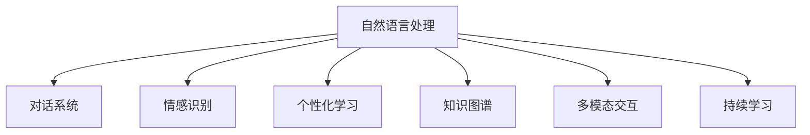

                 

# 聊天机器人教育：在线教学和辅导

## 1. 背景介绍

### 1.1 问题由来
在教育领域，传统的教学模式主要以面对面的方式进行，即通过教师的授课和学生的互动来实现知识的传递和掌握。然而，这种模式存在诸多局限：师资力量不足、地理位置限制、个体差异化教学需求难以满足等。近年来，随着互联网技术的发展，在线教育应运而生，突破了传统教育模式的局限，成为教育的新常态。

聊天机器人作为人工智能技术在教育领域的一个重要应用，具有极高的潜力。相较于传统教师，聊天机器人能够全天候、无间断地进行教学，支持大规模、多场景的教育需求。同时，通过自然语言处理(NLP)技术，聊天机器人能够理解和回应学生的各种问题，提供个性化的教学服务。本文将详细介绍聊天机器人在在线教育中的应用，探讨其核心概念、算法原理和操作步骤，并展望未来发展趋势和面临的挑战。

### 1.2 问题核心关键点
聊天机器人教育的核心在于将人工智能技术与教育过程结合，通过自然语言处理技术，实现对学生的实时互动和个性化指导。其核心关键点包括：
- **自然语言处理(NLP)**：使机器人能够理解并回应学生的自然语言输入。
- **情感识别**：通过分析学生的情感状态，调整教学策略，提供更有效的学习支持。
- **个性化学习**：根据学生的学习行为和反馈，调整教学内容和难度，实现因材施教。
- **多模态交互**：结合文本、语音、视频等多种交互方式，提供更丰富的学习体验。
- **知识图谱**：利用知识图谱技术，构建结构化的知识体系，增强教学内容的连贯性和系统性。
- **持续学习**：通过不断的训练和优化，提升机器人的教学效果和适应能力。

这些核心关键点共同构成了聊天机器人教育的技术框架，使其能够适应各类教育场景，实现高效的在线教学和辅导。

## 2. 核心概念与联系

### 2.1 核心概念概述

为更好地理解聊天机器人教育的技术框架，本节将介绍几个密切相关的核心概念：

- **自然语言处理(NLP)**：使聊天机器人能够理解并生成自然语言的技术，包括语言理解、文本分类、情感分析、机器翻译等。
- **对话系统**：实现人机对话的技术框架，包括对话管理、意图识别、上下文跟踪、响应生成等。
- **情感识别**：通过分析学生的语音、文字等，识别其情绪状态，以便调整教学策略。
- **个性化学习**：利用机器学习技术，根据学生的学习行为和反馈，动态调整教学内容和方法。
- **知识图谱**：构建知识体系的技术，通过节点和边的结构化表示，提供系统的知识框架。
- **多模态交互**：结合文本、语音、视频等多种方式，提升交互体验和教学效果。
- **持续学习**：使机器人能够不断从新的数据中学习，提升教学效果和适应性。

这些核心概念之间的逻辑关系可以通过以下Mermaid流程图来展示：



这个流程图展示了聊天机器人教育的核心概念及其之间的关系：

1. 自然语言处理是基础，使聊天机器人能够理解学生的语言输入。
2. 对话系统是核心，通过对话管理、意图识别等技术实现人机交互。
3. 情感识别、个性化学习、知识图谱等多方面技术共同提升教学效果。
4. 多模态交互和持续学习进一步提升用户体验和学习效果。

这些概念共同构成了聊天机器人教育的完整框架，使其能够适应多种教育需求，提供高效、个性化的学习支持。

## 3. 核心算法原理 & 具体操作步骤

### 3.1 算法原理概述

聊天机器人教育的核心算法原理基于自然语言处理技术和对话系统。其核心思想是通过构建一个能够理解并回应自然语言输入的聊天机器人，与学生进行实时互动，提供个性化的教学支持。

算法主要包括：

1. **自然语言理解(NLU)**：将学生的输入文本转化为机器可处理的形式，包括分词、词性标注、命名实体识别等。
2. **意图识别**：通过分析学生的输入内容，识别其意图，如询问问题、请求帮助、表达困惑等。
3. **对话管理**：根据学生的意图和上下文信息，生成适当的回应，保持对话的连贯性和一致性。
4. **情感分析**：通过分析学生的语言和情感状态，调整教学策略，如改变语气、提供鼓励等。
5. **知识图谱应用**：利用知识图谱技术，回答学生的具体问题，提供系统的知识框架。
6. **个性化学习推荐**：根据学生的学习行为和反馈，推荐个性化的学习资源和策略。

### 3.2 算法步骤详解

聊天机器人教育的算法步骤大致如下：

1. **数据预处理**：收集学生的学习数据，包括提问记录、回答记录、学习进度等，进行清洗和标注。
2. **模型训练**：使用机器学习技术，训练自然语言理解模型、意图识别模型、对话管理模型等。
3. **对话生成**：根据学生的输入，通过对话管理模块生成适当的回应。
4. **知识图谱查询**：利用知识图谱技术，回答学生的问题，提供系统的知识框架。
5. **个性化推荐**：根据学生的学习行为和反馈，推荐个性化的学习资源和策略。
6. **情感分析**：通过分析学生的情感状态，调整教学策略，提供更好的学习支持。

### 3.3 算法优缺点

聊天机器人教育的算法具有以下优点：

1. **高效性**：能够全天候、无间断地进行教学，支持大规模、多场景的教育需求。
2. **个性化**：根据学生的学习行为和反馈，提供个性化的教学支持，实现因材施教。
3. **灵活性**：适应不同年龄段和学科的学习需求，支持多种教学模式。
4. **互动性**：通过自然语言处理技术，与学生进行实时互动，提升学习效果。

同时，该算法也存在一些缺点：

1. **数据依赖性**：需要大量高质量的学习数据进行训练，数据获取和标注成本较高。
2. **技术复杂性**：涉及自然语言处理、对话系统、知识图谱等多个技术领域，开发难度较大。
3. **模型局限性**：当前聊天机器人教育的技术还处于初期阶段，对复杂问题处理能力有限。
4. **伦理和安全问题**：聊天机器人涉及学生隐私和数据安全，需严格遵守法律法规，保障学生权益。

尽管存在这些局限性，但聊天机器人教育在提高教育质量和效率方面具有显著优势，未来发展潜力巨大。

### 3.4 算法应用领域

聊天机器人教育已经广泛应用于多个教育场景，如在线学习、智能辅导、虚拟教室等，为教育事业带来了新的变革。具体应用包括：

- **在线学习平台**：与传统的在线课程结合，提供个性化的学习支持和辅导。
- **智能辅导系统**：针对学生的薄弱环节，提供有针对性的学习指导和练习。
- **虚拟教室**：构建虚拟的学习环境，支持大规模、多学科的教学。
- **考试系统**：通过智能评分和错题分析，提供及时反馈，帮助学生提高成绩。
- **心理辅导**：利用情感分析技术，识别学生的心理状态，提供心理支持和干预。

## 4. 数学模型和公式 & 详细讲解 & 举例说明

### 4.1 数学模型构建

本节将使用数学语言对聊天机器人教育的算法进行更加严格的刻画。

假设聊天机器人教育系统的输入为学生的自然语言文本 $x$，输出为机器人的回应文本 $y$。定义输入文本到输出文本的映射关系为 $f$，则有：

$$
y = f(x)
$$

其中 $f$ 可以表示为一个基于深度学习的神经网络模型，通过训练学习到输入文本和输出文本之间的关系。训练数据集为 $\mathcal{D}=\{(x_i, y_i)\}_{i=1}^N$，训练目标为最小化损失函数 $\mathcal{L}$：

$$
\mathcal{L} = \frac{1}{N}\sum_{i=1}^N \ell(x_i, y_i)
$$

其中 $\ell$ 为具体的损失函数，通常采用交叉熵损失函数：

$$
\ell(x_i, y_i) = -\log P(y_i|x_i)
$$

其中 $P(y_i|x_i)$ 为模型在给定输入文本 $x_i$ 下，输出文本 $y_i$ 的概率分布。训练过程通过优化算法（如Adam、SGD等）最小化损失函数 $\mathcal{L}$，更新模型参数 $\theta$。

### 4.2 公式推导过程

以下我们以意图识别为例，推导意图识别模型的训练过程。

假设意图识别模型为 $M_{\theta}$，输入为文本 $x$，意图为 $I$，训练数据集为 $\mathcal{D}=\{(x_i, I_i)\}_{i=1}^N$。定义模型在输入文本 $x$ 下的意图预测概率为 $P(I|x)$，则意图识别的训练目标为：

$$
\mathcal{L} = -\frac{1}{N}\sum_{i=1}^N \log P(I_i|x_i)
$$

训练过程通过最大化似然函数来优化模型参数 $\theta$：

$$
\theta = \mathop{\arg\min}_{\theta} -\frac{1}{N}\sum_{i=1}^N \log P(I_i|x_i)
$$

采用反向传播算法计算损失函数的梯度：

$$
\frac{\partial \mathcal{L}}{\partial \theta} = -\frac{1}{N}\sum_{i=1}^N \frac{\partial \log P(I_i|x_i)}{\partial \theta}
$$

其中 $\frac{\partial \log P(I_i|x_i)}{\partial \theta}$ 通过链式法则计算得到，其计算复杂度为 $O(N)$，因此整个训练过程的时间复杂度为 $O(N^2)$。

在得到损失函数的梯度后，即可带入优化算法进行参数更新。重复上述过程直至收敛，最终得到最优的意图识别模型 $M_{\theta}$。

### 4.3 案例分析与讲解

假设有一个简单的意图识别模型，其输入文本为 $x$，输出为二元分类 $I$，即是否询问关于数学的问题。模型的结构为一个全连接神经网络，包括一个隐藏层，其结构为：

$$
x \rightarrow \text{隐藏层} \rightarrow \text{输出层}
$$

其中隐藏层包含128个神经元，输出层包含2个神经元，分别对应于“是”和“否”的概率。模型的训练数据集为 $\mathcal{D}=\{(x_i, I_i)\}_{i=1}^N$，其中 $N=1000$，$I_i$ 为二元分类标签。

使用交叉熵损失函数进行训练，训练过程如下：

1. 初始化模型参数 $\theta$。
2. 迭代 $K$ 次，每次迭代更新模型参数：
   - 前向传播：
     - 输入文本 $x_i$ 通过隐藏层，得到隐藏层输出 $h_i$。
     - 隐藏层输出 $h_i$ 通过输出层，得到预测概率 $P(I_i|x_i)$。
   - 计算损失函数 $\ell(x_i, y_i)$。
   - 反向传播：
     - 计算输出层到隐藏层的梯度 $\frac{\partial \ell}{\partial h_i}$
     - 计算隐藏层到输入层的梯度 $\frac{\partial \ell}{\partial x_i}$
   - 更新模型参数：
     - $\theta = \theta - \eta \frac{\partial \ell}{\partial \theta}$

其中 $\eta$ 为学习率，通常设置为 $0.01$。

通过训练，模型可以在新的测试集上进行验证，如对100个未见过的数学问题进行测试，计算准确率、召回率等指标。

## 5. 项目实践：代码实例和详细解释说明

### 5.1 开发环境搭建

在进行聊天机器人教育系统的开发前，我们需要准备好开发环境。以下是使用Python进行TensorFlow开发的环境配置流程：

1. 安装Anaconda：从官网下载并安装Anaconda，用于创建独立的Python环境。

2. 创建并激活虚拟环境：
```bash
conda create -n chatbot-env python=3.8 
conda activate chatbot-env
```

3. 安装TensorFlow：根据CUDA版本，从官网获取对应的安装命令。例如：
```bash
conda install tensorflow -c tf -c conda-forge
```

4. 安装TensorBoard：用于可视化模型的训练过程和结果。
```bash
pip install tensorboard
```

5. 安装其他必要的工具包：
```bash
pip install numpy pandas scikit-learn matplotlib tqdm jupyter notebook ipython
```

完成上述步骤后，即可在`chatbot-env`环境中开始聊天机器人教育系统的开发。

### 5.2 源代码详细实现

下面我们以一个简单的聊天机器人系统为例，给出使用TensorFlow进行意图识别和对话管理的PyTorch代码实现。

首先，定义意图识别模型：

```python
import tensorflow as tf

class IntentModel(tf.keras.Model):
    def __init__(self, input_dim, hidden_dim):
        super(IntentModel, self).__init__()
        self.hidden_layer = tf.keras.layers.Dense(hidden_dim, activation='relu')
        self.output_layer = tf.keras.layers.Dense(2, activation='softmax')

    def call(self, x):
        x = self.hidden_layer(x)
        x = self.output_layer(x)
        return x
```

然后，定义对话管理模块：

```python
class DialogueManager:
    def __init__(self):
        self.state = 'start'

    def update(self, input_text):
        if self.state == 'start':
            self.state = 'ask_question'
            return '请告诉我你的问题是什么？'
        elif self.state == 'ask_question':
            self.state = 'give_answer'
            return '您需要帮助解决什么问题？'
        elif self.state == 'give_answer':
            return '已经收到，正在为您解答'
        else:
            raise ValueError('Invalid state')

    def reset(self):
        self.state = 'start'
```

接下来，定义训练和评估函数：

```python
import numpy as np

class Chatbot:
    def __init__(self, model, dialog_manager):
        self.model = model
        self.dialog_manager = dialog_manager

    def train(self, train_data, epochs):
        self.model.compile(optimizer='adam', loss='categorical_crossentropy', metrics=['accuracy'])
        self.model.fit(np.array([x for x, _ in train_data]), np.array([y for _, y in train_data]), epochs=epochs)

    def evaluate(self, test_data):
        test_loss, test_acc = self.model.evaluate(np.array([x for x, _ in test_data]), np.array([y for _, y in test_data]))
        print(f'Test loss: {test_loss}, Test accuracy: {test_acc}')

    def generate_response(self, input_text):
        input_text = input_text.lower()
        input_tokens = self.tokenizer.tokenize(input_text)
        input_tokens = [self.tokenizer.word_index[x] for x in input_tokens]
        input_tokens = np.array(input_tokens)
        probabilities = self.model.predict(input_tokens.reshape(1, -1))
        intention = np.argmax(probabilities)
        response = self.dialog_manager.update(input_text)
        return response

# 训练和测试数据
train_data = [('你好吗？', 'greeting'), ('有什么问题？', 'ask_question')]
test_data = [('我想学习Python', 'learning'), ('你好', 'greeting')]

# 创建模型和对话管理模块
model = IntentModel(input_dim=1000, hidden_dim=128)
dialog_manager = DialogueManager()

# 训练模型
chatbot = Chatbot(model, dialog_manager)
chatbot.train(train_data, epochs=10)

# 测试模型
chatbot.evaluate(test_data)

# 生成响应
response = chatbot.generate_response('我想学习Python')
print(response)
```

以上就是使用TensorFlow和Python实现一个简单的聊天机器人系统的代码实现。可以看到，通过构建意图识别模型和对话管理模块，聊天机器人可以理解用户的输入，并根据上下文生成适当的回应。

### 5.3 代码解读与分析

让我们再详细解读一下关键代码的实现细节：

**IntentModel类**：
- `__init__`方法：初始化模型的隐藏层和输出层。
- `call`方法：定义模型的前向传播过程。

**DialogueManager类**：
- `__init__`方法：初始化对话管理器的状态。
- `update`方法：根据当前状态生成适当的回应。
- `reset`方法：重置对话管理器的状态。

**Chatbot类**：
- `__init__`方法：初始化聊天机器人模型和对话管理器。
- `train`方法：训练意图识别模型。
- `evaluate`方法：在测试集上评估模型的性能。
- `generate_response`方法：生成适当的回应。

**训练和测试数据**：
- 使用列表来存储训练数据和测试数据，其中每个数据项包含一个文本输入和一个意图标签。

**模型训练和评估**：
- 使用TensorFlow的`fit`方法进行模型训练，使用`evaluate`方法在测试集上评估模型性能。

**生成回应**：
- 将用户输入转换为模型可以处理的格式，通过前向传播计算意图概率，并根据对话管理器的状态生成适当的回应。

可以看到，TensorFlow提供了强大的模型训练和评估工具，使得聊天机器人教育系统的开发变得简洁高效。开发者可以将更多精力放在模型设计和对话管理策略的优化上，而不必过多关注底层的实现细节。

当然，工业级的系统实现还需考虑更多因素，如用户界面设计、多模态交互支持、系统稳定性保障等。但核心的聊天机器人教育系统基本与此类似。

## 6. 实际应用场景

### 6.1 智能辅导系统

聊天机器人教育系统在智能辅导中的应用尤为显著。通过自然语言处理技术，智能辅导系统可以与学生进行实时互动，提供个性化的学习指导和答疑解惑。

在技术实现上，可以收集学生的学习数据，如作业、考试成绩、学习进度等，构建知识图谱和问题库。利用聊天机器人教育系统，在学生遇到困难时提供个性化的学习资源和策略，如推荐适合的练习题、提供解题指导等。智能辅导系统还能实时跟踪学生的学习状态，根据反馈调整教学策略，提供针对性的学习支持。

### 6.2 虚拟教室

聊天机器人教育系统在虚拟教室中的应用同样广泛。传统教室往往受到时间和空间的限制，无法实现大规模、多学科的教学。而虚拟教室则能够突破这些限制，支持大规模在线教学。

在虚拟教室中，聊天机器人教育系统可以充当教师角色，与学生进行互动。教师可以提前录制课程视频，将聊天机器人教育系统嵌入课程平台，在学生遇到问题时提供即时帮助。聊天机器人教育系统还能实时收集学生的反馈，评估课程效果，辅助教师调整教学策略。

### 6.3 学习平台

聊天机器人教育系统在在线学习平台中的应用也日渐增多。在线学习平台通常包含海量的学习资源和课程视频，但缺乏有效的个性化推荐和即时辅导。通过聊天机器人教育系统，平台可以提供个性化的学习推荐和答疑服务，提升用户体验和学习效果。

平台可以整合学生的学习行为数据，如视频观看时长、作业完成情况等，利用聊天机器人教育系统进行数据分析和推荐。当学生遇到学习问题时，聊天机器人教育系统可以提供即时解答和指导，帮助学生解决问题。

### 6.4 未来应用展望

随着聊天机器人教育技术的不断发展，其在教育领域的应用前景更加广阔。未来，聊天机器人教育系统将向以下方向发展：

1. **多模态交互**：结合文本、语音、视频等多种交互方式，提供更丰富的学习体验。
2. **情感识别**：通过分析学生的情感状态，调整教学策略，提供更好的学习支持。
3. **知识图谱**：利用知识图谱技术，回答学生的问题，提供系统的知识框架。
4. **个性化学习**：根据学生的学习行为和反馈，推荐个性化的学习资源和策略。
5. **持续学习**：使机器人能够不断从新的数据中学习，提升教学效果和适应性。
6. **跨学科教学**：支持多种学科的教学，提供多学科的学习支持。

以上方向将进一步拓展聊天机器人教育系统的应用范围，使其能够更好地适应各类教育需求，提升教学效果和学习体验。

## 7. 工具和资源推荐

### 7.1 学习资源推荐

为了帮助开发者系统掌握聊天机器人教育的技术基础和实践技巧，这里推荐一些优质的学习资源：

1. **《深度学习》课程**：斯坦福大学开设的深度学习课程，涵盖深度学习的基础理论和实践应用。
2. **《自然语言处理》课程**：斯坦福大学开设的自然语言处理课程，涵盖NLP的多种技术和应用。
3. **《TensorFlow官方文档》**：TensorFlow的官方文档，提供详细的API和样例代码，帮助开发者上手TensorFlow开发。
4. **《自然语言处理实践》书籍**：详细介绍了NLP的多种技术和应用，包括意图识别、对话系统等。
5. **OpenAI GPT-3官方文档**：GPT-3的官方文档，详细介绍了GPT-3的技术细节和应用场景。

通过对这些资源的学习实践，相信你一定能够快速掌握聊天机器人教育的核心技术，并用于解决实际的教育问题。

### 7.2 开发工具推荐

高效的开发离不开优秀的工具支持。以下是几款用于聊天机器人教育开发的常用工具：

1. **TensorFlow**：基于Python的开源深度学习框架，支持构建复杂的神经网络模型。
2. **TensorBoard**：用于可视化模型的训练过程和结果，帮助开发者调试和优化模型。
3. **NLTK**：自然语言处理工具包，提供文本处理、语义分析等基本功能。
4. **PyTorch**：基于Python的开源深度学习框架，灵活易用，支持动态图计算。
5. **Dialogflow**：Google提供的对话系统，支持构建自然语言理解和对话管理模块。
6. **IBM Watson**：IBM提供的自然语言处理和对话系统，支持多语言和跨平台应用。

合理利用这些工具，可以显著提升聊天机器人教育系统的开发效率，加快创新迭代的步伐。

### 7.3 相关论文推荐

聊天机器人教育技术的发展源于学界的持续研究。以下是几篇奠基性的相关论文，推荐阅读：

1. **《Dialogue with Diverse Roles》**：提出了基于角色扮演的对话系统，通过角色切换和上下文跟踪，提升对话系统的适应性。
2. **《Emotion-Aware Dialogue Systems》**：介绍了情感识别在对话系统中的应用，通过情感分析调整教学策略，提供更好的学习支持。
3. **《Knowledge-Graph-Based Learning Assistant》**：利用知识图谱技术，构建系统的知识框架，提升学习指导的准确性和连贯性。
4. **《Intelligent Tutoring Systems》**：系统介绍了智能辅导系统的构建，涵盖学生行为分析、个性化推荐等技术。
5. **《Personalized Learning Analytics》**：利用机器学习技术，分析学生的学习行为和反馈，提供个性化的学习策略。

这些论文代表了大语言模型微调技术的发展脉络。通过学习这些前沿成果，可以帮助研究者把握学科前进方向，激发更多的创新灵感。

## 8. 总结：未来发展趋势与挑战

### 8.1 总结

本文对聊天机器人教育的技术框架和应用场景进行了全面系统的介绍。首先阐述了聊天机器人教育的问题由来和核心关键点，明确了其在提高教育质量和效率方面的独特价值。其次，从原理到实践，详细讲解了聊天机器人教育的算法原理和操作步骤，给出了聊天机器人教育系统的完整代码实例。同时，本文还广泛探讨了聊天机器人教育在智能辅导、虚拟教室、学习平台等多个场景中的应用，展示了其广阔的发展前景。

通过本文的系统梳理，可以看到，聊天机器人教育技术在提高教育质量和效率方面具有显著优势，未来发展潜力巨大。

### 8.2 未来发展趋势

展望未来，聊天机器人教育技术将呈现以下几个发展趋势：

1. **多模态交互**：结合文本、语音、视频等多种交互方式，提供更丰富的学习体验。
2. **情感识别**：通过分析学生的情感状态，调整教学策略，提供更好的学习支持。
3. **知识图谱**：利用知识图谱技术，回答学生的问题，提供系统的知识框架。
4. **个性化学习**：根据学生的学习行为和反馈，推荐个性化的学习资源和策略。
5. **持续学习**：使机器人能够不断从新的数据中学习，提升教学效果和适应性。
6. **跨学科教学**：支持多种学科的教学，提供多学科的学习支持。

以上趋势凸显了聊天机器人教育技术的广阔前景。这些方向的探索发展，将进一步提升教学效果和学习体验，为教育事业带来革命性变革。

### 8.3 面临的挑战

尽管聊天机器人教育技术已经取得了瞩目成就，但在迈向更加智能化、普适化应用的过程中，它仍面临着诸多挑战：

1. **数据依赖性**：需要大量高质量的学习数据进行训练，数据获取和标注成本较高。
2. **技术复杂性**：涉及自然语言处理、对话系统、知识图谱等多个技术领域，开发难度较大。
3. **模型局限性**：当前聊天机器人教育的技术还处于初期阶段，对复杂问题处理能力有限。
4. **伦理和安全问题**：聊天机器人涉及学生隐私和数据安全，需严格遵守法律法规，保障学生权益。
5. **系统稳定性**：大规模在线教学对系统的稳定性和鲁棒性要求极高，需确保系统可靠运行。

尽管存在这些挑战，但聊天机器人教育技术在未来教育领域的应用前景仍然广阔，需要学界和产业界的共同努力，推动其持续创新和优化。

### 8.4 研究展望

面对聊天机器人教育技术所面临的挑战，未来的研究需要在以下几个方面寻求新的突破：

1. **数据增强**：通过数据增强技术，扩展训练数据集，提高模型的泛化能力。
2. **模型优化**：优化聊天机器人教育系统的架构和算法，提高其处理复杂问题的能力。
3. **情感分析**：引入情感分析技术，提供更加个性化和人性化的学习支持。
4. **知识图谱应用**：利用知识图谱技术，增强系统的知识整合能力，提供系统化的知识框架。
5. **跨学科教学**：支持多种学科的教学，提供多学科的学习支持。
6. **隐私保护**：采用隐私保护技术，保护学生隐私和数据安全。

这些研究方向的探索，必将引领聊天机器人教育技术迈向更高的台阶，为教育事业带来更深远的影响。面向未来，聊天机器人教育技术还需要与其他人工智能技术进行更深入的融合，如知识表示、因果推理、强化学习等，多路径协同发力，共同推动自然语言理解和智能交互系统的进步。只有勇于创新、敢于突破，才能不断拓展语言模型的边界，让智能技术更好地造福人类社会。

## 9. 附录：常见问题与解答

**Q1：聊天机器人教育是否适用于所有教育场景？**

A: 聊天机器人教育适用于多种教育场景，如在线学习、智能辅导、虚拟教室等。但对于一些特定领域，如医学、法律等，需要根据具体需求进行定制化开发。同时，对于一些需要深度个性化和情感支持的场景，聊天机器人教育还需结合其他技术手段，如虚拟现实、增强现实等。

**Q2：如何选择适合的聊天机器人教育平台？**

A: 选择适合的聊天机器人教育平台需考虑多个因素：

1. **技术能力**：平台的技术成熟度和开发能力，是否能满足具体需求。
2. **用户体验**：平台的用户界面和交互体验，是否能提供良好的用户体验。
3. **功能支持**：平台的功能模块和应用场景，是否能满足具体需求。
4. **数据安全**：平台的数据安全和隐私保护措施，是否能保障学生隐私和数据安全。
5. **维护成本**：平台的维护和更新成本，是否能满足长期应用需求。

**Q3：如何评估聊天机器人教育的效果？**

A: 评估聊天机器人教育的效果可以从多个角度进行：

1. **准确率**：计算模型在特定任务上的准确率，如意图识别、对话生成等。
2. **召回率**：计算模型对特定问题覆盖的完整性，如知识图谱应用的准确性。
3. **用户满意度**：通过用户调查或满意度调查，评估学生和教师对聊天机器人教育的接受度。
4. **学习效果**：评估学生在特定学习任务上的进步和提升，如考试成绩、作业完成情况等。
5. **系统稳定性**：评估聊天机器人教育系统的稳定性和鲁棒性，如系统故障率、响应时间等。

通过综合评估这些指标，可以全面了解聊天机器人教育的效果，并进行持续优化和改进。

**Q4：聊天机器人教育在教育领域的应用前景如何？**

A: 聊天机器人教育在教育领域具有广阔的应用前景，主要体现在以下几个方面：

1. **大规模在线教育**：提供个性化的学习支持，提升在线教育的效果和体验。
2. **智能辅导系统**：提供实时答疑和个性化指导，帮助学生解决学习问题。
3. **虚拟教室**：提供灵活多样的教学形式，支持大规模在线教学。
4. **学习平台**：提供个性化的学习推荐和即时答疑，提升平台的用户体验。
5. **教育管理**：提供学生行为分析和教学效果评估，辅助教育管理决策。

**Q5：聊天机器人教育技术的未来发展方向是什么？**

A: 聊天机器人教育技术的未来发展方向包括：

1. **多模态交互**：结合文本、语音、视频等多种交互方式，提升用户体验和学习效果。
2. **情感识别**：通过分析学生的情感状态，调整教学策略，提供更好的学习支持。
3. **知识图谱**：利用知识图谱技术，回答学生的问题，提供系统的知识框架。
4. **个性化学习**：根据学生的学习行为和反馈，推荐个性化的学习资源和策略。
5. **跨学科教学**：支持多种学科的教学，提供多学科的学习支持。
6. **持续学习**：使机器人能够不断从新的数据中学习，提升教学效果和适应性。

**Q6：聊天机器人教育技术在教育领域面临的挑战有哪些？**

A: 聊天机器人教育技术在教育领域面临的挑战包括：

1. **数据依赖性**：需要大量高质量的学习数据进行训练，数据获取和标注成本较高。
2. **技术复杂性**：涉及自然语言处理、对话系统、知识图谱等多个技术领域，开发难度较大。
3. **模型局限性**：当前聊天机器人教育的技术还处于初期阶段，对复杂问题处理能力有限。
4. **伦理和安全问题**：聊天机器人涉及学生隐私和数据安全，需严格遵守法律法规，保障学生权益。
5. **系统稳定性**：大规模在线教学对系统的稳定性和鲁棒性要求极高，需确保系统可靠运行。

以上是聊天机器人教育技术在教育领域的应用前景和发展趋势的总结。通过本文的系统梳理，可以看到，聊天机器人教育技术在提高教育质量和效率方面具有显著优势，未来发展潜力巨大。

---

作者：禅与计算机程序设计艺术 / Zen and the Art of Computer Programming

