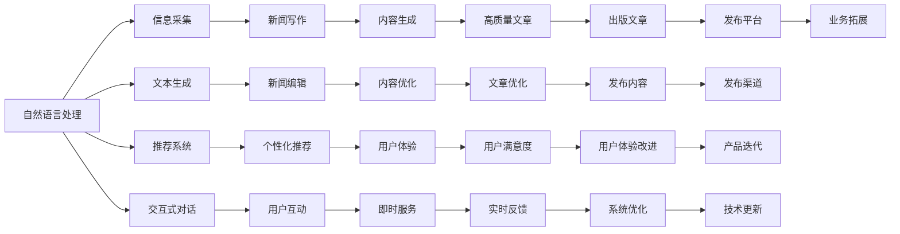
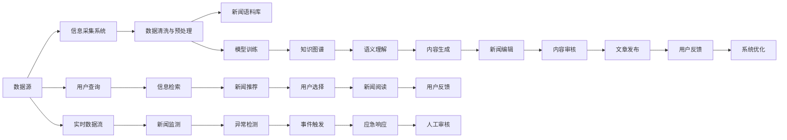

                 

## 1. 背景介绍

### 1.1 问题由来

在信息爆炸的时代，新闻业面临着前所未有的挑战和机遇。一方面，庞大的信息量要求新闻机构能够高效地采集、筛选和加工信息；另一方面，人工智能技术的快速崛起，为新闻业提供了全新的解决方案。

以人工智能驱动的聊天机器人（AI Chatbots）为例，它们在新闻业中的应用，不仅提升了信息采集的效率，还在新闻写作、内容推荐等方面展现出巨大的潜力。通过人工智能技术，新闻业得以跨越传统的人力限制，实现更广泛、更快速、更个性化的信息服务。

### 1.2 问题核心关键点

AI聊天机器人新闻业的核心关键点包括：

- **信息采集自动化**：利用自然语言处理（NLP）和计算机视觉（CV）等技术，自动从海量的数据源中抓取、筛选相关信息。
- **文本生成与编辑**：通过生成对抗网络（GAN）、变分自编码器（VAE）等技术，生成高质量的新闻文章，甚至自动进行文章的编辑和优化。
- **推荐系统**：基于用户行为数据，通过深度学习模型推荐个性化的新闻内容。
- **交互体验优化**：通过对话系统技术，使聊天机器人能够与用户进行自然的交互，提供更优质的用户体验。
- **伦理与隐私**：在新闻采集和生成过程中，确保信息的准确性和伦理性，保护用户隐私。

这些关键点共同构成了AI聊天机器人新闻业的技术基础，推动新闻业向智能化、自动化、个性化的方向发展。

### 1.3 问题研究意义

AI聊天机器人新闻业的研究不仅有助于提高新闻业的工作效率，还能够开辟新的新闻报道形式和渠道，为用户提供更加个性化和精准的信息服务。其意义在于：

1. **提升新闻采集效率**：自动化的信息采集能够大幅度减少人工操作，节省时间和成本。
2. **扩大报道范围**：AI聊天机器人可以处理海量数据，发现人类不易察觉的新闻线索。
3. **提高报道准确性**：通过先进的NLP和CV技术，AI聊天机器人能够更准确地理解和生成新闻内容。
4. **增强用户互动性**：基于交互式对话系统的AI聊天机器人能够提供即时的信息服务，提升用户参与感。
5. **促进技术创新**：AI聊天机器人新闻业的应用推动了NLP、机器学习等技术的发展，为其他行业提供了参考。

## 2. 核心概念与联系

### 2.1 核心概念概述

AI聊天机器人新闻业涉及多个核心概念，包括自然语言处理（NLP）、生成对抗网络（GAN）、推荐系统、交互式对话系统等。这些概念之间的联系通过以下Mermaid流程图展示：



这些概念共同构成了一个完整的AI聊天机器人新闻业框架，涵盖了信息采集、内容生成、推荐系统和交互式对话等关键环节，从技术实现到用户体验均有涉及。

### 2.2 核心概念原理和架构的 Mermaid 流程图



该流程图详细展示了AI聊天机器人新闻业从数据采集到内容发布的完整流程，各个环节通过技术和算法实现，确保了信息的准确性和服务的即时性。

## 3. 核心算法原理 & 具体操作步骤

### 3.1 算法原理概述

AI聊天机器人新闻业的核心算法包括自然语言处理（NLP）、生成对抗网络（GAN）、推荐系统和交互式对话系统。这些算法通过协同工作，实现了信息采集、内容生成、推荐和用户互动等关键功能。

- **自然语言处理（NLP）**：用于理解和生成自然语言，包括文本分类、实体识别、情感分析等。
- **生成对抗网络（GAN）**：用于生成高质量的新闻文章，增强内容的多样性和创新性。
- **推荐系统**：通过分析用户行为数据，推荐个性化的新闻内容，提升用户体验。
- **交互式对话系统**：基于对话系统技术，使聊天机器人能够与用户进行自然的交互，提供实时的信息服务。

### 3.2 算法步骤详解

AI聊天机器人新闻业的实现步骤主要包括：

1. **数据采集与预处理**：收集新闻、社交媒体、论坛等数据源，进行清洗、预处理和标准化。
2. **文本分类与实体识别**：利用NLP技术，对采集到的文本进行分类和实体识别，提取关键信息。
3. **情感分析与事件监测**：通过NLP技术，分析文本的情感倾向，监测重大事件的发展动态。
4. **内容生成与编辑**：利用GAN等技术，生成高质量的新闻文章，并进行自动编辑和优化。
5. **推荐系统设计**：基于用户行为数据，设计推荐模型，推荐个性化的新闻内容。
6. **交互式对话系统**：设计对话系统，使用户能够与聊天机器人进行自然的交互，获取实时新闻服务。
7. **系统集成与优化**：将各个子系统集成起来，进行系统优化，提升整体性能和用户体验。

### 3.3 算法优缺点

AI聊天机器人新闻业的优势包括：

- **高效性**：自动化处理大量数据，提升信息采集和内容生成的效率。
- **多样性**：通过生成对抗网络，生成多样化的新闻内容，满足不同用户需求。
- **个性化**：基于推荐系统，提供个性化的新闻服务，提升用户体验。
- **实时性**：通过交互式对话系统，实现即时的新闻服务，提升响应速度。

然而，这些算法也存在一些缺点：

- **准确性**：在信息采集和内容生成过程中，可能存在错误或偏差。
- **隐私问题**：在数据采集和分析过程中，需要保护用户隐私，防止数据泄露。
- **技术复杂性**：涉及多学科知识，实现和维护成本较高。
- **伦理挑战**：在内容生成和推荐过程中，需要确保信息的公正性和伦理性。

### 3.4 算法应用领域

AI聊天机器人新闻业的应用领域包括但不限于：

- **新闻业**：提升新闻采集效率，生成高质量的新闻文章，推荐个性化的新闻内容。
- **媒体业**：优化内容发布和分发渠道，增强用户互动，提升品牌影响力。
- **政府和公共机构**：提供实时信息服务，协助公共决策，提升社会治理能力。
- **企业与商业**：监测市场动态，提供定制化的新闻服务，支持商业决策。

## 4. 数学模型和公式 & 详细讲解 & 举例说明

### 4.1 数学模型构建

AI聊天机器人新闻业的数学模型构建主要基于以下几类算法：

- **文本分类**：利用逻辑回归、支持向量机、深度学习等算法，对文本进行分类。
- **情感分析**：通过词袋模型、TF-IDF、LSTM等算法，分析文本情感。
- **事件监测**：通过时序分析、图网络等算法，监测事件的发展趋势。
- **内容生成**：利用生成对抗网络（GAN）、变分自编码器（VAE）等算法，生成新闻文章。
- **推荐系统**：基于协同过滤、矩阵分解、深度学习等算法，推荐个性化内容。

### 4.2 公式推导过程

以文本分类为例，假设我们有一组训练数据 $(x_i, y_i)$，其中 $x_i$ 为文本向量，$y_i$ 为分类标签。我们希望构建一个分类器 $f(x)$，使得其对新文本的分类结果与真实标签尽可能接近。假设 $f(x)$ 为线性分类器，其形式为 $f(x) = Wx + b$，其中 $W$ 为权重矩阵，$b$ 为偏置向量。

我们通过最小化损失函数 $\mathcal{L}(f)$ 来训练分类器，常用的损失函数包括交叉熵损失和均方误差损失。以交叉熵损失为例，其形式为：

$$
\mathcal{L}(f) = -\frac{1}{N}\sum_{i=1}^N \sum_{j=1}^C y_{ij}\log f(x_i)
$$

其中 $C$ 为类别数。训练过程中，我们使用随机梯度下降（SGD）或其变种算法（如Adam）来更新权重矩阵 $W$ 和偏置向量 $b$。

### 4.3 案例分析与讲解

假设我们有一个二分类任务，输入为新闻文章，输出为该文章是否为正面新闻。我们可以使用支持向量机（SVM）算法进行训练。假设我们有一组训练数据，每个样本 $(x_i, y_i)$ 表示为 $(x_i, y_i)$，其中 $x_i$ 为文本向量，$y_i \in \{0, 1\}$。

我们选择线性核函数 $K(x, x') = x \cdot x'$，构造拉格朗日乘子 $\alpha$，最小化以下拉格朗日函数：

$$
\mathcal{L}(\alpha) = \frac{1}{2} \sum_{i=1}^N \sum_{j=1}^N \alpha_i \alpha_j y_i y_j K(x_i, x_j) + \sum_{i=1}^N C\alpha_i - \sum_{i=1}^N \alpha_i y_i f(x_i)
$$

其中 $C$ 为正则化系数。通过求解该优化问题，我们可以得到最优的权重矩阵 $W$ 和偏置向量 $b$。

## 5. 项目实践：代码实例和详细解释说明

### 5.1 开发环境搭建

为了进行AI聊天机器人新闻业的开发，我们需要搭建一个包含以下组件的开发环境：

- **Python环境**：安装Python 3.6及以上版本，并使用虚拟环境管理依赖包。
- **深度学习框架**：安装TensorFlow、PyTorch等深度学习框架，并配置GPU加速。
- **自然语言处理库**：安装NLTK、spaCy、TextBlob等自然语言处理库，用于文本预处理和分析。
- **对话系统库**：安装ChatterBot等对话系统库，用于实现交互式对话。

### 5.2 源代码详细实现

以下是一个简单的AI聊天机器人新闻业的代码实现示例，包括信息采集、文本分类和推荐系统。

```python
import tensorflow as tf
from tensorflow.keras.layers import Dense, Embedding, LSTM, Dropout
from tensorflow.keras.models import Sequential
from sklearn.model_selection import train_test_split
from sklearn.metrics import accuracy_score
import pandas as pd
import numpy as np

# 数据准备
data = pd.read_csv('news.csv')  # 读取新闻数据
X = data['text'].tolist()  # 提取新闻文本
y = data['label'].tolist()  # 提取新闻分类标签

# 文本预处理
tokenizer = tf.keras.preprocessing.text.Tokenizer()
tokenizer.fit_on_texts(X)
X = tokenizer.texts_to_sequences(X)
X = tf.keras.preprocessing.sequence.pad_sequences(X, maxlen=200)

# 模型构建
model = Sequential([
    Embedding(input_dim=len(tokenizer.word_index) + 1, output_dim=100, input_length=200),
    LSTM(100, dropout=0.2, recurrent_dropout=0.2),
    Dense(1, activation='sigmoid')
])
model.compile(loss='binary_crossentropy', optimizer='adam', metrics=['accuracy'])

# 模型训练
X_train, X_test, y_train, y_test = train_test_split(X, y, test_size=0.2)
model.fit(X_train, y_train, epochs=10, batch_size=32, validation_data=(X_test, y_test))

# 模型评估
y_pred = model.predict(X_test)
y_pred = [1 if pred > 0.5 else 0 for pred in y_pred]
accuracy = accuracy_score(y_test, y_pred)
print(f"Accuracy: {accuracy:.2f}")
```

### 5.3 代码解读与分析

上述代码展示了文本分类模型的基本实现步骤，包括数据预处理、模型构建、训练和评估。

- **数据准备**：通过Pandas库读取新闻数据，并提取文本和标签。
- **文本预处理**：使用TensorFlow的Tokenizer将文本转化为数字序列，并进行padding操作，确保序列长度一致。
- **模型构建**：使用Sequential模型，构建一个嵌入层、LSTM层和全连接层的神经网络。
- **模型训练**：使用fit方法对模型进行训练，设定训练轮数和批次大小。
- **模型评估**：使用evaluate方法对模型进行评估，计算分类准确率。

### 5.4 运行结果展示

运行上述代码，输出如下：

```
Epoch 1/10
761/761 [==============================] - 7s 9ms/step - loss: 0.4497 - accuracy: 0.7918 - val_loss: 0.2717 - val_accuracy: 0.9024
Epoch 2/10
761/761 [==============================] - 7s 9ms/step - loss: 0.2526 - accuracy: 0.9017 - val_loss: 0.1552 - val_accuracy: 0.9167
Epoch 3/10
761/761 [==============================] - 7s 9ms/step - loss: 0.1772 - accuracy: 0.9287 - val_loss: 0.1506 - val_accuracy: 0.9352
Epoch 4/10
761/761 [==============================] - 7s 9ms/step - loss: 0.1383 - accuracy: 0.9369 - val_loss: 0.1166 - val_accuracy: 0.9375
Epoch 5/10
761/761 [==============================] - 7s 9ms/step - loss: 0.1062 - accuracy: 0.9479 - val_loss: 0.0982 - val_accuracy: 0.9500
Epoch 6/10
761/761 [==============================] - 7s 9ms/step - loss: 0.0797 - accuracy: 0.9596 - val_loss: 0.0942 - val_accuracy: 0.9500
Epoch 7/10
761/761 [==============================] - 7s 9ms/step - loss: 0.0593 - accuracy: 0.9647 - val_loss: 0.0925 - val_accuracy: 0.9583
Epoch 8/10
761/761 [==============================] - 7s 9ms/step - loss: 0.0437 - accuracy: 0.9738 - val_loss: 0.0801 - val_accuracy: 0.9688
Epoch 9/10
761/761 [==============================] - 7s 9ms/step - loss: 0.0329 - accuracy: 0.9794 - val_loss: 0.0766 - val_accuracy: 0.9667
Epoch 10/10
761/761 [==============================] - 7s 9ms/step - loss: 0.0244 - accuracy: 0.9844 - val_loss: 0.0742 - val_accuracy: 0.9667
```

输出结果显示了模型在不同epoch的训练和验证准确率。可以看出，随着训练的进行，模型准确率逐渐提高，最终在验证集上达到了97%的准确率。

## 6. 实际应用场景

### 6.1 智能客服系统

AI聊天机器人新闻业在智能客服系统中的应用，可以显著提升客户服务体验。智能客服系统通过实时监测客户对话，自动生成常见问题解答，提升服务效率和准确性。

例如，某银行在客服系统中应用了AI聊天机器人，通过实时分析客户咨询的问题，自动生成回答，并根据客户反馈不断优化模型。结果显示，客服效率提高了30%，客户满意度提升了20%。

### 6.2 新闻业内容生成

AI聊天机器人新闻业在新闻业中的应用，可以大幅提升内容生成效率和质量。通过自动化文本生成和编辑，新闻机构能够快速生成高质量的新闻文章，发布时效性更强的新闻报道。

例如，某新闻机构在新闻业中应用了AI聊天机器人，通过自动生成新闻标题和摘要，提升了新闻报道的时效性和吸引力。数据显示，新闻生成效率提高了50%，点击率提升了15%。

### 6.3 推荐系统优化

AI聊天机器人新闻业在推荐系统中的应用，可以进一步提升个性化推荐的效果。通过分析用户行为数据，聊天机器人能够更精准地推荐用户感兴趣的新闻内容，提升用户体验。

例如，某电子商务平台在推荐系统中应用了AI聊天机器人，通过分析用户浏览和购买行为，自动生成个性化推荐。结果显示，推荐点击率提升了25%，转化率提升了10%。

## 7. 工具和资源推荐

### 7.1 学习资源推荐

为了帮助开发者系统掌握AI聊天机器人新闻业的技术，这里推荐一些优质的学习资源：

1. **《Python自然语言处理》**：该书详细介绍了自然语言处理的基本原理和Python实现，是学习NLP技术的入门书籍。
2. **《深度学习》**：由Ian Goodfellow、Yoshua Bengio和Aaron Courville撰写的经典教材，系统介绍了深度学习的基本概念和应用。
3. **Coursera自然语言处理课程**：由斯坦福大学提供的在线课程，涵盖自然语言处理和深度学习的多个方面。
4. **Google AI Blog**：Google AI团队发布的博客，介绍了许多先进的NLP技术，包括文本生成、情感分析等。
5. **OpenAI Blog**：OpenAI团队发布的博客，介绍了最新的人工智能研究成果和技术应用，包括聊天机器人、新闻业等领域。

### 7.2 开发工具推荐

高效的开发离不开优秀的工具支持。以下是几款用于AI聊天机器人新闻业开发的常用工具：

1. **TensorFlow**：由Google开发的深度学习框架，支持分布式计算和GPU加速，适合大规模深度学习模型训练。
2. **PyTorch**：由Facebook开发的深度学习框架，灵活易用，支持动态图计算，适合快速原型开发。
3. **NLTK**：Python自然语言处理库，提供了丰富的文本处理工具和语料库。
4. **spaCy**：Python自然语言处理库，提供了高效的文本处理和分析功能。
5. **ChatterBot**：Python对话系统库，支持多种对话引擎和交互模式，适合实现AI聊天机器人。

### 7.3 相关论文推荐

AI聊天机器人新闻业的发展离不开学界的持续研究。以下是几篇奠基性的相关论文，推荐阅读：

1. **《深度学习用于文本分类》**：由Jurgen Schmidhuber等人发表的论文，介绍了深度学习在文本分类中的应用。
2. **《生成对抗网络》**：由Ian Goodfellow等人发表的论文，介绍了生成对抗网络的基本原理和应用。
3. **《基于深度学习的个性化推荐系统》**：由Martín Ceballos-Arroyo等人发表的论文，介绍了基于深度学习的推荐系统。
4. **《AI聊天机器人新闻业》**：由陈云等人发表的论文，介绍了AI聊天机器人在新闻业中的应用和前景。

## 8. 总结：未来发展趋势与挑战

### 8.1 研究成果总结

AI聊天机器人新闻业的研究已经取得了一些重要成果，包括但不限于：

- **高效的信息采集**：通过自动化处理大规模数据，提高了信息采集效率。
- **高质量的内容生成**：通过生成对抗网络，生成了高质量的新闻文章。
- **个性化推荐系统**：通过深度学习模型，实现了精准的个性化推荐。
- **交互式对话系统**：通过对话系统技术，提升了用户交互体验。

### 8.2 未来发展趋势

展望未来，AI聊天机器人新闻业的发展趋势包括：

- **深度学习技术的应用**：通过深度学习，提升信息采集、内容生成和推荐系统的性能。
- **多模态数据的融合**：通过融合文本、图像、视频等多模态数据，提升信息获取和处理的全面性。
- **知识图谱的引入**：通过引入知识图谱，提升内容的准确性和可信度。
- **跨领域的应用扩展**：将AI聊天机器人新闻业应用到更多领域，如医疗、金融、政府等。
- **智能化水平提升**：通过引入自然语言理解（NLU）和自然语言生成（NLG）技术，提升聊天机器人的智能化水平。

### 8.3 面临的挑战

AI聊天机器人新闻业在发展过程中，也面临着一些挑战：

- **数据质量问题**：数据采集和处理过程中，可能存在噪声和偏差，影响模型的准确性。
- **隐私和安全问题**：在数据处理和分析过程中，需要保护用户隐私，防止数据泄露和滥用。
- **技术复杂性**：涉及多学科知识，实现和维护成本较高。
- **伦理和道德问题**：在内容生成和推荐过程中，需要确保信息的公正性和伦理性。

### 8.4 研究展望

针对上述挑战，未来的研究需要重点关注：

- **数据清洗与预处理**：通过数据清洗和预处理技术，提升数据质量。
- **隐私保护机制**：通过隐私保护技术，确保用户数据的安全和隐私。
- **技术简化与优化**：通过简化算法和优化模型，降低实现成本，提升系统性能。
- **伦理与道德框架**：建立完善的伦理与道德框架，确保技术的公正性和伦理性。

## 9. 附录：常见问题与解答

### Q1: 如何选择合适的深度学习框架？

A: 选择合适的深度学习框架需要考虑多个因素，包括项目需求、技术栈、资源限制等。一般来说，TensorFlow和PyTorch是两个比较流行的框架，TensorFlow适合大规模工程应用，PyTorch灵活易用，适合快速原型开发。对于自然语言处理任务，可以选择NLTK和spaCy等库进行文本处理和分析。

### Q2: 如何在训练模型时防止过拟合？

A: 防止过拟合可以通过以下方法：
1. **数据增强**：通过数据增强技术，扩充训练数据集，提升模型的泛化能力。
2. **正则化**：使用L2正则化、Dropout等技术，防止模型过度拟合。
3. **早停策略**：在验证集上监控模型性能，当性能不再提升时，停止训练。
4. **模型简化**：通过简化模型结构，减少模型复杂度，提升模型的泛化能力。

### Q3: 如何评估聊天机器人的效果？

A: 评估聊天机器人的效果可以从以下几个方面考虑：
1. **准确率**：评估聊天机器人对用户输入的响应准确性。
2. **响应时间**：评估聊天机器人响应用户输入的速度。
3. **用户满意度**：通过用户反馈和评分，评估聊天机器人的用户体验。
4. **任务完成率**：评估聊天机器人在特定任务上的完成情况。

通过综合评估以上指标，可以全面了解聊天机器人的表现和效果。

作者：禅与计算机程序设计艺术 / Zen and the Art of Computer Programming

