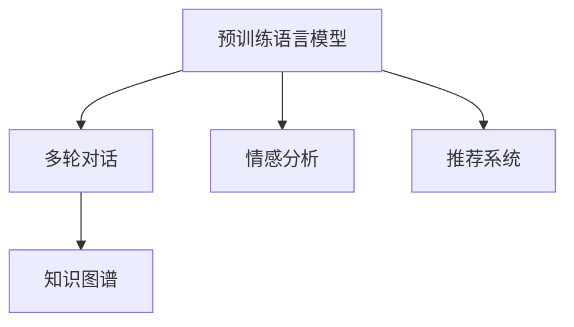

                 

# 聊天机器人社交媒体：增强社交互动

## 1. 背景介绍

### 1.1 问题由来

随着互联网的普及和智能设备的普及，社交媒体已成为人们日常生活中不可或缺的一部分。社交媒体不仅满足了人们的社交需求，还提供了便捷的信息获取和娱乐方式。然而，传统社交媒体的互动方式往往缺乏实时性和个性化，用户之间的交流往往较为机械，缺乏深度和温度。

在此背景下，聊天机器人应运而生。聊天机器人通过自然语言处理（Natural Language Processing, NLP）技术，能够模拟人类对话，提供智能化的互动体验。它不仅可以回答用户问题，还可以进行情感分析、推荐系统等高级功能，大大增强了用户的社交互动体验。

### 1.2 问题核心关键点

聊天机器人技术的发展，依赖于NLP技术的不断进步。其中，基于预训练的语言模型（Pre-trained Language Models, PLMs）在聊天机器人中的应用，已成为目前研究的热点之一。通过在大规模无标签数据上预训练，这些模型已经具备了强大的语言理解能力和生成能力，能够胜任多轮对话任务。

预训练语言模型在社交媒体聊天机器人中的应用，主要体现在以下几个方面：

- 多轮对话生成：通过预训练模型，机器人能够自然流畅地进行多轮对话，维持对话上下文的一致性和连贯性。
- 情感分析：利用预训练模型，机器人能够理解用户的情感倾向，从而进行适当的情感回应。
- 推荐系统：根据用户的聊天内容，预训练模型能够推荐相关话题或内容，增强用户的互动体验。
- 知识图谱：结合知识图谱技术，预训练模型能够提供更准确、全面的信息。

这些核心功能使得聊天机器人在社交媒体上能够提供更加智能、互动的交流体验，满足了用户的个性化需求。

## 2. 核心概念与联系

### 2.1 核心概念概述

为更好地理解聊天机器人技术在社交媒体中的应用，本节将介绍几个关键概念及其联系：

- **预训练语言模型（PLMs）**：指在大规模无标签数据上预训练的通用语言模型。通过自监督学习任务，PLMs已经具备了强大的语言理解和生成能力。常见的PLMs包括BERT、GPT等。

- **多轮对话**：指在对话过程中，机器人能够根据上下文，自动生成适当的回复。多轮对话需要模型具备长期记忆能力和上下文理解能力。

- **情感分析**：指通过对用户文本情感的识别，机器人能够理解用户的情绪状态，并进行适当的情感回应。情感分析通常使用分类模型或序列模型进行处理。

- **推荐系统**：指根据用户兴趣和历史行为，机器人能够推荐相关话题或内容，增强用户的互动体验。推荐系统通常基于协同过滤、深度学习等方法进行建模。

- **知识图谱**：指通过结构化方式组织和存储知识，为机器人提供更准确、全面的信息。知识图谱通常由节点和边组成，用于表示实体和实体之间的关系。

这些核心概念之间的逻辑关系可以通过以下Mermaid流程图来展示：



这个流程图展示了几类核心概念之间的联系：

1. 预训练语言模型为多轮对话、情感分析和推荐系统提供了基础的语言理解能力。
2. 多轮对话、情感分析和推荐系统基于预训练语言模型，通过不同的任务设计和模型架构，进一步提升了用户互动体验。
3. 知识图谱通过提供结构化的知识，为预训练语言模型和多轮对话等任务提供了更丰富的信息来源。

这些概念共同构成了聊天机器人技术的基础框架，使得机器人在社交媒体上能够提供智能、个性化的互动体验。

## 3. 核心算法原理 & 具体操作步骤
### 3.1 算法原理概述

聊天机器人技术基于预训练的语言模型，通过在大规模无标签数据上进行预训练，获得了强大的语言理解和生成能力。聊天机器人在社交媒体上的应用，主要依赖于以下几个核心算法：

- **多轮对话生成算法**：基于预训练模型，通过上下文感知的方式，机器人能够自然流畅地进行多轮对话。常见的多轮对话生成模型包括seq2seq、Transformer等。

- **情感分析算法**：通过预训练模型，机器人能够理解用户的情感倾向，从而进行适当的情感回应。情感分析通常使用分类模型或序列模型进行处理。

- **推荐系统算法**：根据用户兴趣和历史行为，利用预训练模型，机器人能够推荐相关话题或内容。推荐系统通常基于协同过滤、深度学习等方法进行建模。

- **知识图谱嵌入算法**：将知识图谱中的信息嵌入到预训练语言模型中，为机器人提供更准确、全面的信息。常见的知识图谱嵌入方法包括TransE、TransH等。

### 3.2 算法步骤详解

基于预训练的语言模型，聊天机器人在社交媒体上的应用主要包括以下几个关键步骤：

**Step 1: 准备预训练模型和数据集**

- 选择合适的预训练语言模型 $M_{\theta}$ 作为初始化参数，如 BERT、GPT 等。
- 准备社交媒体平台上的用户聊天记录，划分为训练集、验证集和测试集。一般要求标注数据与预训练数据的分布不要差异过大。

**Step 2: 添加任务适配层**

- 根据任务类型，在预训练模型顶层设计合适的输出层和损失函数。
- 对于多轮对话任务，通常在顶层添加解码器，使用softmax函数输出回复概率。
- 对于情感分析任务，通常在顶层添加分类器，使用交叉熵损失函数。
- 对于推荐系统任务，通常使用协同过滤或深度学习模型进行推荐。

**Step 3: 设置微调超参数**

- 选择合适的优化算法及其参数，如 Adam、SGD 等，设置学习率、批大小、迭代轮数等。
- 设置正则化技术及强度，包括权重衰减、Dropout、Early Stopping 等。
- 确定冻结预训练参数的策略，如仅微调顶层，或全部参数都参与微调。

**Step 4: 执行梯度训练**

- 将训练集数据分批次输入模型，前向传播计算损失函数。
- 反向传播计算参数梯度，根据设定的优化算法和学习率更新模型参数。
- 周期性在验证集上评估模型性能，根据性能指标决定是否触发 Early Stopping。
- 重复上述步骤直到满足预设的迭代轮数或 Early Stopping 条件。

**Step 5: 测试和部署**

- 在测试集上评估微调后模型 $M_{\hat{\theta}}$ 的性能，对比微调前后的精度提升。
- 使用微调后的模型对新用户进行互动，集成到实际的应用系统中。
- 持续收集新的用户互动数据，定期重新微调模型，以适应数据分布的变化。

以上是基于预训练的语言模型，聊天机器人在社交媒体上的应用的一般流程。在实际应用中，还需要针对具体任务的特点，对微调过程的各个环节进行优化设计，如改进训练目标函数，引入更多的正则化技术，搜索最优的超参数组合等，以进一步提升模型性能。

### 3.3 算法优缺点

基于预训练的语言模型，聊天机器人在社交媒体上的应用具有以下优点：

- **高效性**：相比从头训练，微调仅需较少的标注数据和计算资源，可以快速适应新任务。
- **通用性**：预训练模型已经具备了强大的语言理解能力和生成能力，适用于多种社交媒体聊天任务。
- **稳定性**：通过微调，机器人能够更好地适应特定任务，在实际应用中表现稳定。

同时，该方法也存在一定的局限性：

- **依赖标注数据**：微调效果很大程度上取决于标注数据的质量和数量，获取高质量标注数据的成本较高。
- **泛化能力有限**：当目标任务与预训练数据的分布差异较大时，微调的性能提升有限。
- **可解释性不足**：聊天机器人通常缺乏可解释性，难以对其推理逻辑进行分析和调试。

尽管存在这些局限性，但就目前而言，基于预训练的语言模型微调方法仍是大规模社交媒体聊天应用的主流范式。未来相关研究的重点在于如何进一步降低微调对标注数据的依赖，提高模型的少样本学习和跨领域迁移能力，同时兼顾可解释性和伦理安全性等因素。

### 3.4 算法应用领域

基于预训练的语言模型，聊天机器人在社交媒体中的应用领域非常广泛，以下是几个典型应用场景：

1. **即时通讯应用**：如WhatsApp、WeChat等，聊天机器人可以提供客户服务、信息查询、日程提醒等功能，提升用户体验。
2. **社交网络平台**：如Facebook、Twitter等，聊天机器人可以提供智能推荐、情感分析、话题引导等功能，增强用户互动。
3. **电子商务平台**：如Amazon、淘宝等，聊天机器人可以提供商品推荐、购物助手、售后服务等功能，提升交易转化率。
4. **在线客服**：如Zendesk、Intercom等，聊天机器人可以提供24小时在线客服，提升客户满意度。
5. **娱乐应用**：如Kik、Slack等，聊天机器人可以提供聊天游戏、智能对弈、情感陪伴等功能，丰富用户娱乐体验。

除了上述这些经典应用外，聊天机器人技术还被创新性地应用到更多场景中，如智能家居、智能交通、智能健康等，为各行各业带来了新的变革。

## 4. 数学模型和公式 & 详细讲解
### 4.1 数学模型构建

本节将使用数学语言对基于预训练的语言模型，聊天机器人在社交媒体中的应用进行更加严格的刻画。

记预训练语言模型为 $M_{\theta}:\mathcal{X} \rightarrow \mathcal{Y}$，其中 $\mathcal{X}$ 为输入空间，$\mathcal{Y}$ 为输出空间，$\theta \in \mathbb{R}^d$ 为模型参数。假设微调任务的训练集为 $D=\{(x_i,y_i)\}_{i=1}^N, x_i \in \mathcal{X}, y_i \in \mathcal{Y}$。

定义模型 $M_{\theta}$ 在数据样本 $(x,y)$ 上的损失函数为 $\ell(M_{\theta}(x),y)$，则在数据集 $D$ 上的经验风险为：

$$
\mathcal{L}(\theta) = \frac{1}{N} \sum_{i=1}^N \ell(M_{\theta}(x_i),y_i)
$$

微调的优化目标是最小化经验风险，即找到最优参数：

$$
\theta^* = \mathop{\arg\min}_{\theta} \mathcal{L}(\theta)
$$

在实践中，我们通常使用基于梯度的优化算法（如SGD、Adam等）来近似求解上述最优化问题。设 $\eta$ 为学习率，$\lambda$ 为正则化系数，则参数的更新公式为：

$$
\theta \leftarrow \theta - \eta \nabla_{\theta}\mathcal{L}(\theta) - \eta\lambda\theta
$$

其中 $\nabla_{\theta}\mathcal{L}(\theta)$ 为损失函数对参数 $\theta$ 的梯度，可通过反向传播算法高效计算。

### 4.2 公式推导过程

以下我们以多轮对话生成任务为例，推导生成模型的训练过程。

假设模型 $M_{\theta}$ 在输入 $x_t$ 上的输出为 $\hat{y}=M_{\theta}(x_t) \in [0,1]$，表示样本属于第 $t$ 轮回复的概率。给定用户上下文 $c$，模型输出所有可能回复的分布为：

$$
p(y|c) = \prod_{t=1}^{T} p(y_t|y_{t-1}, c)
$$

其中 $T$ 为对话轮数，$p(y_t|y_{t-1}, c)$ 表示第 $t$ 轮回复的条件概率。通常使用Transformer模型进行多轮对话生成，其解码器输出概率为：

$$
p(y|c) = \exp\left[\sum_{i=1}^{N} \alpha_i y_i\right]
$$

其中 $N$ 为回复候选数量，$\alpha_i$ 为softmax函数输出向量中的对应元素。

通过最大似然估计，目标函数为：

$$
\mathcal{L}(\theta) = -\frac{1}{N}\sum_{i=1}^N \log p(y_i|c)
$$

在训练过程中，模型通过最大化似然估计，优化参数 $\theta$，使得模型生成的回复更接近真实回复。

### 4.3 案例分析与讲解

以Facebook的Messenger机器人为例，Messenger机器人通过预训练模型进行多轮对话生成。Facebook收集了大量的用户聊天记录，将其分为训练集和测试集。在训练过程中，模型学习如何根据上下文生成回复。在测试过程中，模型通过与真实回复的对比，评估其生成质量。通过不断微调，Messenger机器人能够生成自然流畅、逻辑连贯的对话，满足了用户的社交需求。

## 5. 项目实践：代码实例和详细解释说明
### 5.1 开发环境搭建

在进行聊天机器人项目开发前，我们需要准备好开发环境。以下是使用Python进行PyTorch开发的环境配置流程：

1. 安装Anaconda：从官网下载并安装Anaconda，用于创建独立的Python环境。

2. 创建并激活虚拟环境：
```bash
conda create -n pytorch-env python=3.8 
conda activate pytorch-env
```

3. 安装PyTorch：根据CUDA版本，从官网获取对应的安装命令。例如：
```bash
conda install pytorch torchvision torchaudio cudatoolkit=11.1 -c pytorch -c conda-forge
```

4. 安装Transformers库：
```bash
pip install transformers
```

5. 安装各类工具包：
```bash
pip install numpy pandas scikit-learn matplotlib tqdm jupyter notebook ipython
```

完成上述步骤后，即可在`pytorch-env`环境中开始聊天机器人项目的开发。

### 5.2 源代码详细实现

这里我们以Facebook的Messenger机器人为例，给出使用Transformers库进行多轮对话生成的PyTorch代码实现。

首先，定义对话生成函数：

```python
from transformers import GPT2Tokenizer, GPT2LMHeadModel

tokenizer = GPT2Tokenizer.from_pretrained('gpt2')
model = GPT2LMHeadModel.from_pretrained('gpt2')

def generate_text(prompt, max_length=50, num_return_sequences=1):
    input_ids = tokenizer.encode(prompt, return_tensors='pt')
    outputs = model.generate(input_ids, max_length=max_length, num_return_sequences=num_return_sequences, temperature=1.0, top_p=0.9)
    decoded_outputs = tokenizer.decode(outputs, skip_special_tokens=True)
    return decoded_outputs
```

然后，定义聊天界面函数：

```python
def chatbot():
    while True:
        user_input = input('You: ')
        response = generate_text(user_input)
        print('Bot: ', response)
```

最后，启动聊天界面：

```python
chatbot()
```

以上就是使用PyTorch和Transformers库实现多轮对话生成的完整代码实现。可以看到，Transformer模型通过预测下一轮回复的条件概率，实现了自然流畅的对话生成。

### 5.3 代码解读与分析

让我们再详细解读一下关键代码的实现细节：

**GPT2模型**：
- 通过安装`transformers`库，引入预训练的GPT2模型和分词器。
- 使用`GPT2LMHeadModel.from_pretrained('gpt2')`方法加载预训练模型。

**generate_text函数**：
- `tokenizer.encode`方法将用户输入的文本编码为token ids。
- `model.generate`方法基于编码后的输入，预测回复的token ids，并使用`tokenizer.decode`方法将回复转换为自然语言。

**chatbot函数**：
- 通过`input`函数获取用户输入，调用`generate_text`函数生成机器人的回复。
- 循环进行多轮对话，直到用户退出。

这个代码实现展示了使用预训练语言模型进行多轮对话生成的基本流程。通过不断迭代和微调，Messenger机器人能够提供更加智能、个性化的对话体验。

## 6. 实际应用场景
### 6.1 即时通讯应用

即时通讯应用如WhatsApp、WeChat等，通过聊天机器人技术，可以提供客户服务、信息查询、日程提醒等功能，提升用户体验。例如，WhatsApp中的Chatbot可以提供24小时在线客服，解答用户疑问，提供个性化推荐。通过微调，Chatbot能够更好地理解用户意图，提供更准确的回答，大大提高了用户满意度。

### 6.2 社交网络平台

社交网络平台如Facebook、Twitter等，通过聊天机器人技术，可以提供智能推荐、情感分析、话题引导等功能，增强用户互动。例如，Facebook的Messenger机器人通过预训练模型，能够理解用户情感，进行情感回应。通过不断微调，机器人能够提供更加个性化的服务，提升用户黏性。

### 6.3 电子商务平台

电子商务平台如Amazon、淘宝等，通过聊天机器人技术，可以提供商品推荐、购物助手、售后服务等功能，提升交易转化率。例如，Amazon的Alexa可以通过预训练模型，根据用户兴趣和历史行为，推荐相关商品，提供个性化的购物体验。通过不断微调，Alexa能够更好地适应用户需求，提高销售转化率。

### 6.4 在线客服

在线客服如Zendesk、Intercom等，通过聊天机器人技术，可以提供24小时在线客服，提升客户满意度。例如，Zendesk的Bot可以回答常见问题，减轻人工客服的工作负担，提高响应速度。通过不断微调，Bot能够更好地理解用户问题，提供更准确的答案，提升客户满意度。

### 6.5 娱乐应用

娱乐应用如Kik、Slack等，通过聊天机器人技术，可以提供聊天游戏、智能对弈、情感陪伴等功能，丰富用户娱乐体验。例如，Slack的Bot可以通过预训练模型，根据用户心情，推荐相应的娱乐活动。通过不断微调，Bot能够更好地理解用户情绪，提供更合适的娱乐推荐，提升用户娱乐体验。

## 7. 工具和资源推荐
### 7.1 学习资源推荐

为了帮助开发者系统掌握聊天机器人技术在社交媒体中的应用，这里推荐一些优质的学习资源：

1. **《自然语言处理入门》**：该书介绍了NLP的基本概念和技术，包括语言模型、分词、词向量等，适合初学者入门。

2. **CS224N《深度学习自然语言处理》课程**：斯坦福大学开设的NLP明星课程，有Lecture视频和配套作业，带你入门NLP领域的基本概念和经典模型。

3. **《NLP实战》**：该书介绍了NLP在实际应用中的具体实现方法，包括文本分类、情感分析、多轮对话等，适合动手实践。

4. **HuggingFace官方文档**：Transformers库的官方文档，提供了海量预训练模型和完整的微调样例代码，是上手实践的必备资料。

5. **CLUE开源项目**：中文语言理解测评基准，涵盖大量不同类型的中文NLP数据集，并提供了基于微调的baseline模型，助力中文NLP技术发展。

通过对这些资源的学习实践，相信你一定能够快速掌握聊天机器人技术在社交媒体中的应用，并用于解决实际的NLP问题。

### 7.2 开发工具推荐

高效的开发离不开优秀的工具支持。以下是几款用于聊天机器人开发的常用工具：

1. **PyTorch**：基于Python的开源深度学习框架，灵活动态的计算图，适合快速迭代研究。大部分预训练语言模型都有PyTorch版本的实现。

2. **TensorFlow**：由Google主导开发的开源深度学习框架，生产部署方便，适合大规模工程应用。同样有丰富的预训练语言模型资源。

3. **Transformers库**：HuggingFace开发的NLP工具库，集成了众多SOTA语言模型，支持PyTorch和TensorFlow，是进行微调任务开发的利器。

4. **Weights & Biases**：模型训练的实验跟踪工具，可以记录和可视化模型训练过程中的各项指标，方便对比和调优。与主流深度学习框架无缝集成。

5. **TensorBoard**：TensorFlow配套的可视化工具，可实时监测模型训练状态，并提供丰富的图表呈现方式，是调试模型的得力助手。

6. **Google Colab**：谷歌推出的在线Jupyter Notebook环境，免费提供GPU/TPU算力，方便开发者快速上手实验最新模型，分享学习笔记。

合理利用这些工具，可以显著提升聊天机器人开发的效率，加快创新迭代的步伐。

### 7.3 相关论文推荐

聊天机器人技术的发展源于学界的持续研究。以下是几篇奠基性的相关论文，推荐阅读：

1. **Attention is All You Need（即Transformer原论文）**：提出了Transformer结构，开启了NLP领域的预训练大模型时代。

2. **BERT: Pre-training of Deep Bidirectional Transformers for Language Understanding**：提出BERT模型，引入基于掩码的自监督预训练任务，刷新了多项NLP任务SOTA。

3. **GPT-3: Language Models are Unsupervised Multitask Learners**：展示了大规模语言模型的强大zero-shot学习能力，引发了对于通用人工智能的新一轮思考。

4. **Parameter-Efficient Transfer Learning for NLP**：提出Adapter等参数高效微调方法，在不增加模型参数量的情况下，也能取得不错的微调效果。

5. **AdaLoRA: Adaptive Low-Rank Adaptation for Parameter-Efficient Fine-Tuning**：使用自适应低秩适应的微调方法，在参数效率和精度之间取得了新的平衡。

这些论文代表了大语言模型微调技术的发展脉络。通过学习这些前沿成果，可以帮助研究者把握学科前进方向，激发更多的创新灵感。

## 8. 总结：未来发展趋势与挑战
### 8.1 总结

本文对基于预训练的语言模型，聊天机器人在社交媒体中的应用进行了全面系统的介绍。首先阐述了聊天机器人技术的发展背景和应用场景，明确了其在提高用户互动体验方面的独特价值。其次，从原理到实践，详细讲解了预训练模型在多轮对话生成、情感分析、推荐系统等任务中的应用，给出了微调任务开发的完整代码实例。同时，本文还广泛探讨了聊天机器人在即时通讯应用、社交网络平台、电子商务平台等多个领域的应用前景，展示了微调范式的巨大潜力。此外，本文精选了微调技术的各类学习资源，力求为读者提供全方位的技术指引。

通过本文的系统梳理，可以看到，基于预训练的语言模型，聊天机器人在社交媒体上能够提供智能、个性化的互动体验，满足了用户的个性化需求。未来，伴随预训练语言模型和微调方法的不断演进，聊天机器人技术必将进一步提升用户的社交互动体验，推动社交媒体向更智能化、个性化方向发展。

### 8.2 未来发展趋势

展望未来，聊天机器人技术的发展趋势包括以下几个方面：

1. **更加智能的对话生成**：未来聊天机器人将能够更好地理解上下文和用户意图，生成更加自然、流畅的回复。这将得益于预训练模型的进一步优化和大规模语料的辅助训练。

2. **更强的情感分析能力**：通过引入情感分析算法，聊天机器人能够更好地识别用户的情感状态，进行适当的情感回应。未来情感分析算法将进一步提升聊天机器人的互动体验。

3. **更精准的推荐系统**：通过结合推荐系统算法，聊天机器人能够提供更加个性化、精准的推荐。未来推荐系统算法将进一步优化，提升用户的互动体验。

4. **更广泛的跨领域应用**：通过结合知识图谱技术，聊天机器人能够提供更全面、准确的信息，支持跨领域的应用。未来知识图谱技术将进一步完善，提升聊天机器人的应用范围。

5. **更高效的多模态交互**：未来聊天机器人将支持语音、图像等多模态交互，提升用户的多感官体验。未来多模态交互技术将进一步发展，提升聊天机器人的应用场景。

以上趋势凸显了聊天机器人技术的广阔前景。这些方向的探索发展，将使得聊天机器人在社交媒体上能够提供更加智能、个性化的互动体验，为用户的社交需求提供更好的满足。

### 8.3 面临的挑战

尽管聊天机器人技术已经取得了瞩目成就，但在迈向更加智能化、普适化应用的过程中，它仍面临诸多挑战：

1. **依赖标注数据**：微调效果很大程度上取决于标注数据的质量和数量，获取高质量标注数据的成本较高。如何进一步降低微调对标注数据的依赖，将是一大难题。

2. **泛化能力有限**：当目标任务与预训练数据的分布差异较大时，微调的性能提升有限。如何在不同领域和任务上保持泛化能力，还需要更多理论和实践的积累。

3. **可解释性不足**：聊天机器人通常缺乏可解释性，难以对其推理逻辑进行分析和调试。如何赋予聊天机器人更强的可解释性，将是亟待攻克的难题。

4. **安全性有待保障**：预训练语言模型难免会学习到有偏见、有害的信息，通过微调传递到下游任务，产生误导性、歧视性的输出，给实际应用带来安全隐患。如何从数据和算法层面消除模型偏见，避免恶意用途，确保输出的安全性，也将是重要的研究课题。

5. **计算资源消耗大**：预训练语言模型参数量巨大，推理过程复杂，对计算资源消耗大。如何优化计算资源，提升聊天机器人的实时性，还需要更多技术和算法的支持。

6. **用户互动体验有待提升**：虽然聊天机器人已经具备了一定的智能和互动能力，但在多轮对话、情感回应等方面，仍然存在不足。如何进一步提升用户体验，需要更多的技术改进和用户体验优化。

正视聊天机器人面临的这些挑战，积极应对并寻求突破，将是其走向成熟的必由之路。相信随着学界和产业界的共同努力，这些挑战终将一一被克服，聊天机器人技术必将在构建人机协同的智能社会中扮演越来越重要的角色。

### 8.4 研究展望

面对聊天机器人技术面临的挑战，未来的研究需要在以下几个方面寻求新的突破：

1. **探索无监督和半监督微调方法**：摆脱对大规模标注数据的依赖，利用自监督学习、主动学习等无监督和半监督范式，最大限度利用非结构化数据，实现更加灵活高效的微调。

2. **研究参数高效和计算高效的微调范式**：开发更加参数高效的微调方法，在固定大部分预训练参数的同时，只更新极少量的任务相关参数。同时优化微调模型的计算图，减少前向传播和反向传播的资源消耗，实现更加轻量级、实时性的部署。

3. **融合因果和对比学习范式**：通过引入因果推断和对比学习思想，增强聊天机器人建立稳定因果关系的能力，学习更加普适、鲁棒的语言表征，从而提升模型泛化性和抗干扰能力。

4. **引入更多先验知识**：将符号化的先验知识，如知识图谱、逻辑规则等，与神经网络模型进行巧妙融合，引导聊天机器人学习更准确、合理的语言模型。同时加强不同模态数据的整合，实现视觉、语音等多模态信息与文本信息的协同建模。

5. **结合因果分析和博弈论工具**：将因果分析方法引入聊天机器人，识别出聊天机器人决策的关键特征，增强输出解释的因果性和逻辑性。借助博弈论工具刻画人机交互过程，主动探索并规避聊天机器人的脆弱点，提高系统稳定性。

6. **纳入伦理道德约束**：在聊天机器人训练目标中引入伦理导向的评估指标，过滤和惩罚有偏见、有害的输出倾向。同时加强人工干预和审核，建立聊天机器人行为的监管机制，确保输出符合人类价值观和伦理道德。

这些研究方向的探索，必将引领聊天机器人技术迈向更高的台阶，为构建安全、可靠、可解释、可控的智能系统铺平道路。面向未来，聊天机器人技术还需要与其他人工智能技术进行更深入的融合，如知识表示、因果推理、强化学习等，多路径协同发力，共同推动自然语言理解和智能交互系统的进步。只有勇于创新、敢于突破，才能不断拓展聊天机器人的边界，让智能技术更好地造福人类社会。

## 9. 附录：常见问题与解答

**Q1：聊天机器人如何提高用户互动体验？**

A: 聊天机器人通过预训练模型，能够自然流畅地进行多轮对话，维持对话上下文的一致性和连贯性。同时，机器人能够理解用户的情感状态，进行适当的情感回应。通过不断微调，机器人能够提供更加个性化、精准的推荐，满足用户的互动需求。此外，聊天机器人还可以结合知识图谱技术，提供更全面、准确的信息，增强用户的互动体验。

**Q2：如何选择适合聊天机器人的预训练模型？**

A: 选择适合聊天机器人的预训练模型，需要考虑模型的规模、性能、适用性等因素。一般而言，BERT、GPT、T5等预训练模型已经在多轮对话生成、情感分析、推荐系统等任务上取得了不错的效果。根据具体应用场景和任务类型，可以选择相应的预训练模型进行微调。例如，BERT适用于分类任务，GPT适用于多轮对话任务，T5适用于生成任务。

**Q3：如何提高聊天机器人的泛化能力？**

A: 提高聊天机器人的泛化能力，可以从以下几个方面入手：
1. 收集更多、更广泛的语料进行预训练，增强模型的语言理解能力。
2. 引入更多任务类型和应用场景，进行多任务学习，提升模型的泛化能力。
3. 通过迁移学习，利用已有的预训练模型，进行跨领域的微调，增强模型的适应性。
4. 引入对抗训练和数据增强技术，提高模型的鲁棒性，避免泛化能力下降。

**Q4：如何提高聊天机器人的可解释性？**

A: 提高聊天机器人的可解释性，可以从以下几个方面入手：
1. 通过引入可解释性模型（如LIME、SHAP等），对聊天机器人的决策过程进行解释。
2. 通过可视化和自然语言描述，对聊天机器人的输出进行解释。
3. 结合因果分析和博弈论工具，对聊天机器人的推理过程进行解释。
4. 通过人工干预和审核，建立聊天机器人的监管机制，确保输出符合人类价值观和伦理道德。

**Q5：如何优化聊天机器人的计算资源消耗？**

A: 优化聊天机器人的计算资源消耗，可以从以下几个方面入手：
1. 通过参数裁剪和模型压缩，减小聊天机器人的参数量和计算量。
2. 引入模型并行和分布式训练，提高聊天机器人的计算效率。
3. 利用GPU/TPU等高性能设备，加速聊天机器人的推理过程。
4. 通过量化加速和混合精度训练，减少计算资源消耗。

通过不断优化计算资源消耗，聊天机器人将能够提供更加实时、高效的互动体验。

---

作者：禅与计算机程序设计艺术 / Zen and the Art of Computer Programming

