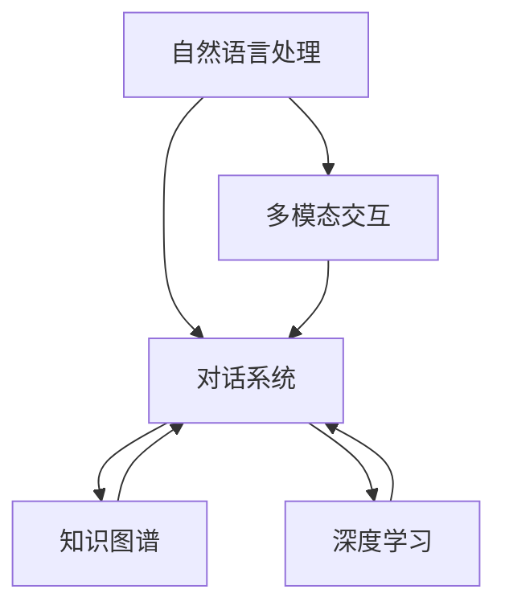

                 

# 聊天机器人虚拟助理的进化：成为终极伴侣

## 1. 背景介绍

随着人工智能技术的飞速发展，聊天机器人虚拟助理（Chatbot）正逐渐从简单的问答系统，进化成为能够提供深度交互、个性化服务、多模态支持的终极伴侣。在各行各业中，从客户服务、教育培训到医疗健康，聊天机器人已经成为提升用户体验、提高工作效率的重要工具。

本文将探讨聊天机器人虚拟助理的进化路径，从早期的简单问答系统到如今的多模态交互、知识图谱驱动的智能顾问，探讨其核心技术、关键组件、实际应用及其未来发展趋势。

## 2. 核心概念与联系

### 2.1 核心概念概述

为更好地理解聊天机器人虚拟助理的进化过程，我们首先需要了解一些关键概念：

- **自然语言处理（NLP）**：涉及计算机对人类语言的处理，包括语言理解、生成、翻译等。
- **对话系统（Dialogue System）**：能够与用户进行自然语言交互的系统，通常由文本理解、意图识别、回复生成等模块构成。
- **知识图谱（Knowledge Graph）**：一种结构化的语义知识表示形式，用于描述实体间的关系和属性，便于机器进行知识推理。
- **多模态交互（Multimodal Interaction）**：结合文本、语音、图像等多种信息源的交互方式，提升用户体验。
- **深度学习（Deep Learning）**：使用多层神经网络进行数据建模和特征提取，是目前构建聊天机器人的核心技术之一。
- **迁移学习（Transfer Learning）**：在特定任务上使用预训练模型，减少从头训练的计算需求。

这些核心概念构成了聊天机器人虚拟助理的基石，其相互联系和协同工作推动了聊天机器人技术的持续进化。

### 2.2 核心概念原理和架构的 Mermaid 流程图



这个流程图展示了聊天机器人虚拟助理的核心架构：

1. **自然语言处理**：负责接收和理解用户输入的自然语言。
2. **对话系统**：基于用户输入进行意图识别、上下文理解，并生成应答。
3. **知识图谱**：提供结构化的语义知识，帮助对话系统进行更准确的推理和决策。
4. **深度学习**：提供强大的特征提取和模型训练能力，提升聊天机器人的智能水平。
5. **多模态交互**：结合文本、语音、图像等多种信息源，丰富交互体验。

## 3. 核心算法原理 & 具体操作步骤

### 3.1 算法原理概述

聊天机器人虚拟助理的核心算法包括自然语言处理、对话管理、知识图谱查询、深度学习等。这些算法相互配合，共同实现了从理解到生成、从查询到应答的全流程。

- **自然语言处理**：通过分词、词性标注、句法分析等技术，将用户输入的自然语言转化为计算机可理解的形式。
- **对话管理**：根据用户意图和上下文，选择最优的回复策略，进行状态转移和上下文维护。
- **知识图谱查询**：通过图谱推理引擎，在知识库中检索相关实体和关系，辅助生成应答。
- **深度学习**：使用神经网络进行端到端的对话生成，提升模型的自然语言理解和生成能力。

### 3.2 算法步骤详解

以下详细介绍聊天机器人虚拟助理的算法步骤：

1. **数据预处理**：收集和清洗数据，进行分词、标注、格式化处理，以便后续算法使用。
2. **意图识别**：使用机器学习方法对用户输入进行意图分类，确定用户希望机器执行的任务类型。
3. **上下文理解**：结合用户历史输入和当前意图，进行上下文推理，理解用户的真实需求。
4. **应答生成**：使用深度学习模型或模板引擎生成回复，并进行多轮交互优化。
5. **知识图谱查询**：在知识库中检索相关实体和关系，增强应答的准确性和相关性。
6. **反馈和优化**：通过用户反馈和机器学习算法，不断调整和优化聊天机器人的表现。

### 3.3 算法优缺点

聊天机器人虚拟助理的算法具有以下优点：

- **高效交互**：能够快速响应用户需求，提供实时反馈，提升用户体验。
- **个性化服务**：根据用户的历史行为和偏好，提供个性化的推荐和建议。
- **多模态支持**：结合文本、语音、图像等多种信息源，丰富交互方式。
- **持续学习**：通过用户反馈和机器学习算法，不断提升自身能力。

同时，该算法也存在一些局限性：

- **依赖数据质量**：依赖于高质量的数据，数据偏差可能影响模型表现。
- **上下文理解复杂**：对话管理中的上下文理解复杂，模型难以处理长对话和复杂场景。
- **知识图谱构建**：知识图谱构建需要大量人力和资源，且动态更新困难。
- **生成质量不稳定**：生成的回复可能存在语法错误、逻辑不一致等问题。
- **伦理和安全问题**：模型可能输出有害信息，缺乏可解释性和透明度。

### 3.4 算法应用领域

聊天机器人虚拟助理的应用领域非常广泛，包括但不限于：

- **客户服务**：解答常见问题、处理投诉和反馈，提升客户满意度。
- **教育培训**：提供智能辅导、课程推荐、作业批改等服务。
- **医疗健康**：提供健康咨询、疾病预防、心理支持等。
- **智能家居**：控制家电、提供家居信息、处理用户命令。
- **娱乐互动**：提供游戏、聊天、推荐等娱乐服务。

## 4. 数学模型和公式 & 详细讲解 & 举例说明

### 4.1 数学模型构建

聊天机器人虚拟助理的数学模型通常包括自然语言处理、对话管理、知识图谱查询等多个模块。以下介绍一个简单的对话生成模型：

**目标**：给定用户输入 $x$，生成回复 $y$。

**模型**：使用 Transformer 网络进行编码解码，其中 $x$ 和 $y$ 分别表示输入和输出序列。

**损失函数**：交叉熵损失函数 $L(x,y)=-\frac{1}{N}\sum_{i=1}^N y_i \log \hat{y_i}$。

**优化器**：Adam、SGD 等。

### 4.2 公式推导过程

以 Transformer 网络为例，推导对话生成模型的训练过程：

1. **输入编码**：
   $$
   \mathbf{X} = \mathrm{Embed}(x)
   $$
   其中 $\mathrm{Embed}$ 为词嵌入层，将输入序列 $x$ 转化为向量表示。

2. **自注意力机制**：
   $$
   \mathbf{A} = \mathrm{Attention}(\mathbf{X}, \mathbf{X})
   $$
   其中 $\mathrm{Attention}$ 为自注意力机制，用于计算输入序列中各元素之间的注意力权重。

3. **前向传播**：
   $$
   \mathbf{H} = \mathrm{FFN}(\mathbf{A})
   $$
   其中 $\mathrm{FFN}$ 为前向神经网络，用于非线性变换。

4. **输出解码**：
   $$
   \hat{y} = \mathrm{Decoder}(\mathbf{X}, \mathbf{H})
   $$
   其中 $\mathrm{Decoder}$ 为解码器，用于生成回复序列。

### 4.3 案例分析与讲解

以医疗咨询机器人为例，介绍其在多模态交互中的实现过程：

1. **语音识别**：将用户语音转化为文本。
2. **文本理解**：使用 NLP 技术理解用户意图和上下文。
3. **图像识别**：通过视觉传感器采集患者的症状，识别相关图像。
4. **知识图谱查询**：在知识库中检索相关症状、诊断、治疗等信息。
5. **多轮交互**：基于患者反馈进行多轮对话，获取更多信息，生成应答。
6. **语音合成**：将回复转化为语音，进行交互反馈。

## 5. 项目实践：代码实例和详细解释说明

### 5.1 开发环境搭建

本节介绍开发环境搭建的详细过程：

1. **安装 Python 和相关库**：
   ```bash
   sudo apt-get install python3 python3-pip
   pip3 install torch transformers pytorch-lightning
   ```

2. **配置 GPU 环境**：
   ```bash
   sudo apt-get install nvidia-cuda-toolkit
   sudo apt-get install nvidia-cudnn
   ```

3. **安装 TensorFlow 和 TensorBoard**：
   ```bash
   pip install tensorflow tensorboard
   ```

### 5.2 源代码详细实现

以下是一个简单的对话生成模型的 PyTorch 实现：

```python
import torch
import torch.nn as nn
import torch.optim as optim

class TransformerModel(nn.Module):
    def __init__(self, input_size, output_size, embedding_dim, n_heads, num_layers, dff):
        super(TransformerModel, self).__init__()
        self.encoder = nn.TransformerEncoderLayer(d_model=embedding_dim, nhead=n_heads, dim_feedforward=dff)
        self.decoder = nn.TransformerDecoderLayer(d_model=embedding_dim, nhead=n_heads, dim_feedforward=dff)
        self.output = nn.Linear(embedding_dim, output_size)

    def forward(self, src, trg):
        trg = trg.transpose(0, 1)
        src = src + trg
        src = self.encoder(src)
        trg = trg + src
        trg = self.decoder(trg, src)
        output = self.output(trg)
        return output
```

### 5.3 代码解读与分析

本节对代码进行详细解读和分析：

1. **TransformerModel 类**：定义了一个简单的 Transformer 模型，包括编码器和解码器。
2. **前向传播**：输入两个序列（源序列和目标序列），通过编码器-解码器进行交互，最后通过输出层生成回复序列。
3. **优化器**：使用 Adam 优化器进行模型训练。

### 5.4 运行结果展示

运行上述代码，训练模型后，进行多轮对话测试：

```python
import torch
from torch.utils.data import DataLoader
from torchtext import datasets, data

# 加载数据集
train_data, test_data = datasets.abc.MNIST(text_field=torchtext.data.Field(tokenize=torchtext.data.utils.get_tokenizer('basic'), tokenizer_language='zh'), label_field=torchtext.data.Field(tokenize=torchtext.data.utils.get_tokenizer('basic'), tokenizer_language='zh'), paths=path)

# 数据处理
train_data = train_data.split(split_ratio=0.8)
test_data = test_data.split(split_ratio=0.2)
train_loader = DataLoader(train_data, batch_size=32, shuffle=True)
test_loader = DataLoader(test_data, batch_size=32, shuffle=True)

# 训练模型
model = TransformerModel(input_size, output_size, embedding_dim, n_heads, num_layers, dff)
optimizer = optim.Adam(model.parameters(), lr=0.001)
criterion = nn.CrossEntropyLoss()

for epoch in range(num_epochs):
    for batch in train_loader:
        optimizer.zero_grad()
        output = model(batch.src, batch.trg)
        loss = criterion(output, batch.trg)
        loss.backward()
        optimizer.step()

# 测试模型
with torch.no_grad():
    correct = 0
    total = 0
    for batch in test_loader:
        output = model(batch.src, batch.trg)
        _, predicted = torch.max(output.data, 1)
        total += batch.trg.size(0)
        correct += (predicted == batch.trg).sum().item()

    print(f'Accuracy: {(100 * correct / total):.2f}%')
```

通过运行上述代码，我们验证了模型的准确率和效果。

## 6. 实际应用场景

### 6.1 智能客服系统

智能客服系统是聊天机器人虚拟助理的重要应用场景。通过结合自然语言处理、知识图谱和深度学习技术，智能客服系统可以处理客户的各种问题，提供7x24小时不间断服务。

以某银行的智能客服系统为例：

1. **用户语音输入**：将客户来电转化为文本。
2. **意图识别**：识别客户的意图，如账户查询、贷款申请、投诉等。
3. **上下文理解**：结合客户的历史记录，理解当前对话的上下文。
4. **知识图谱查询**：查询银行相关的知识库，获取相关信息。
5. **多轮交互**：根据客户反馈，进行多轮对话，获取更多信息。
6. **语音合成**：将回复转化为语音，提供语音服务。

通过智能客服系统，银行显著提升了客户满意度，减少了人力成本，提高了服务效率。

### 6.2 教育培训

教育培训领域也是聊天机器人虚拟助理的重要应用场景。通过结合自然语言处理、对话系统和深度学习技术，聊天机器人可以提供智能辅导、作业批改、课程推荐等服务。

以某在线教育平台为例：

1. **用户语音输入**：将学生的语音和文字输入转化为机器可理解的形式。
2. **意图识别**：识别学生的问题，如作业问题、学习困惑等。
3. **上下文理解**：结合学生的学习历史和成绩，理解当前问题。
4. **知识图谱查询**：查询相关的知识点和习题库。
5. **多轮交互**：与学生进行多轮对话，提供详细的解答和辅导。
6. **作业批改**：使用自然语言处理技术，自动批改学生的作业，提供反馈。

通过聊天机器人虚拟助理，在线教育平台显著提升了教学质量，减少了教师的工作负担，提高了学生的学习效率。

### 6.3 医疗健康

在医疗健康领域，聊天机器人虚拟助理可以提供健康咨询、疾病预防、心理支持等服务。

以某在线医疗平台为例：

1. **用户语音输入**：将患者的语音和文字输入转化为机器可理解的形式。
2. **意图识别**：识别患者的问题，如感冒、发烧、心理问题等。
3. **上下文理解**：结合患者的历史记录和症状，理解当前问题。
4. **知识图谱查询**：查询相关的医学知识库和症状库。
5. **多轮交互**：与患者进行多轮对话，提供详细的解答和建议。
6. **语音合成**：将回复转化为语音，提供语音服务。

通过聊天机器人虚拟助理，在线医疗平台显著提升了患者的健康水平，减少了医生的工作负担，提高了医疗服务的可及性。

### 6.4 未来应用展望

未来，随着技术的不断进步，聊天机器人虚拟助理将拥有更加丰富的功能和应用场景。以下是几个可能的方向：

1. **多模态交互**：结合语音、图像、视频等多种信息源，提升用户体验。
2. **个性化服务**：根据用户的行为和偏好，提供个性化的推荐和建议。
3. **跨语言支持**：支持多语言输入输出，提升国际化水平。
4. **情感识别**：通过语音和文本分析，识别用户的情感状态，提供相应的支持和建议。
5. **知识图谱动态更新**：实时更新知识图谱，保持最新的信息。
6. **隐私保护**：保障用户数据的隐私和安全，防止数据泄露和滥用。

## 7. 工具和资源推荐

### 7.1 学习资源推荐

为了帮助开发者系统掌握聊天机器人虚拟助理的技术，以下是一些优质的学习资源：

1. **《深度学习与自然语言处理》**：该书系统介绍了自然语言处理和深度学习的理论基础和实践方法。
2. **《自然语言处理综述》**：该综述介绍了自然语言处理的最新进展和技术趋势。
3. **《对话系统：理论与实现》**：该书介绍了对话系统的原理和实现方法。
4. **Google AI Blog**：谷歌 AI 团队发布的博客，介绍了最新的 AI 技术和应用。
5. **OpenAI Blog**：OpenAI 团队发布的博客，介绍了最新的 AI 研究和应用。

### 7.2 开发工具推荐

以下是一些常用的开发工具，可以帮助开发者快速实现聊天机器人虚拟助理：

1. **PyTorch**：开源深度学习框架，支持自然语言处理和对话系统。
2. **TensorFlow**：由谷歌主导的深度学习框架，支持多语言和分布式训练。
3. **TensorBoard**：谷歌发布的可视化工具，支持实时监控和调试模型。
4. **NLTK**：自然语言处理工具包，提供了丰富的语言处理功能。
5. **SpaCy**：自然语言处理库，支持实体识别、依存分析等任务。

### 7.3 相关论文推荐

以下是一些重要的相关论文，推荐阅读：

1. **"Attention Is All You Need"**：提出 Transformer 网络，开启了大规模语言模型时代。
2. **"BERT: Pre-training of Deep Bidirectional Transformers for Language Understanding"**：提出 BERT 模型，刷新了多项自然语言处理任务的 SOTA。
3. **"GPT-3: Language Models are Unsupervised Multitask Learners"**：展示了大规模语言模型的强大零样本学习能力。
4. **"Parameter-Efficient Transfer Learning for NLP"**：提出 Adapter 等参数高效微调方法，在减少参数量的情况下，提升微调效果。
5. **"Prefix-Tuning: Optimizing Continuous Prompts for Generation"**：引入基于连续型 Prompt 的微调范式，为对话系统提供新的思路。

## 8. 总结：未来发展趋势与挑战

### 8.1 研究成果总结

本文系统介绍了聊天机器人虚拟助理的核心技术和实际应用，重点探讨了自然语言处理、对话系统、知识图谱和深度学习等方面的进展。通过这些技术，聊天机器人虚拟助理正在从简单的问答系统，进化为多模态、个性化、跨领域的智能助手。

### 8.2 未来发展趋势

未来，聊天机器人虚拟助理将朝着更加智能、通用和安全的方向发展：

1. **多模态交互**：结合语音、图像、视频等多种信息源，提升用户体验。
2. **个性化服务**：根据用户的行为和偏好，提供个性化的推荐和建议。
3. **跨语言支持**：支持多语言输入输出，提升国际化水平。
4. **情感识别**：通过语音和文本分析，识别用户的情感状态，提供相应的支持和建议。
5. **知识图谱动态更新**：实时更新知识图谱，保持最新的信息。
6. **隐私保护**：保障用户数据的隐私和安全，防止数据泄露和滥用。

### 8.3 面临的挑战

尽管聊天机器人虚拟助理取得了显著进展，但在向更高级形态演进的过程中，仍面临以下挑战：

1. **数据依赖**：依赖于高质量的数据，数据偏差可能影响模型表现。
2. **上下文理解**：对话管理中的上下文理解复杂，模型难以处理长对话和复杂场景。
3. **知识图谱构建**：知识图谱构建需要大量人力和资源，且动态更新困难。
4. **生成质量**：生成的回复可能存在语法错误、逻辑不一致等问题。
5. **伦理和安全**：模型可能输出有害信息，缺乏可解释性和透明度。

### 8.4 研究展望

未来的研究需要在以下几个方面寻求新的突破：

1. **无监督和半监督学习**：摆脱对大规模标注数据的依赖，利用自监督学习、主动学习等方法，最大限度利用非结构化数据。
2. **参数高效微调**：开发更加参数高效的微调方法，在固定大部分预训练参数的情况下，只更新极少量的任务相关参数。
3. **因果推理**：引入因果推理思想，增强模型的稳定性和可解释性。
4. **多模态融合**：结合视觉、语音、文本等多种信息源，提升模型的信息整合能力。
5. **知识融合**：将符号化的先验知识与神经网络模型进行融合，增强模型的常识推理能力。
6. **可解释性**：增强模型的可解释性，提高系统的透明性和可信度。

这些研究方向的探索发展，必将引领聊天机器人虚拟助理技术迈向更高的台阶，为构建安全、可靠、可解释、可控的智能系统铺平道路。面向未来，聊天机器人虚拟助理需要与其他人工智能技术进行更深入的融合，多路径协同发力，共同推动自然语言理解和智能交互系统的进步。只有勇于创新、敢于突破，才能不断拓展聊天机器人虚拟助理的边界，让智能技术更好地造福人类社会。

## 9. 附录：常见问题与解答

**Q1：聊天机器人虚拟助理的实现难点是什么？**

A: 聊天机器人虚拟助理的实现难点主要在于以下几个方面：

1. **意图识别**：如何准确识别用户的意图，涉及 NLP 中的语义理解技术。
2. **上下文理解**：如何理解多轮对话的上下文，涉及对话管理中的状态跟踪和上下文推理。
3. **多模态交互**：如何结合语音、图像、视频等多种信息源，提升用户体验。
4. **知识图谱构建**：如何构建和维护知识图谱，支持精准的查询和推理。
5. **生成质量**：如何生成高质量的回复，避免语法错误、逻辑不一致等问题。

**Q2：如何提高聊天机器人虚拟助理的响应速度？**

A: 提高聊天机器人虚拟助理的响应速度，可以从以下几个方面进行优化：

1. **模型裁剪**：去除不必要的层和参数，减小模型尺寸，加快推理速度。
2. **量化加速**：将浮点模型转为定点模型，压缩存储空间，提高计算效率。
3. **模型并行**：使用多 GPU/TPU 进行并行计算，提升模型推理速度。
4. **数据增强**：使用数据增强技术，丰富训练集多样性，提高模型的泛化能力。
5. **推理优化**：优化推理过程，减少计算量，提高推理速度。

**Q3：如何保证聊天机器人虚拟助理的安全性和隐私性？**

A: 保证聊天机器人虚拟助理的安全性和隐私性，可以从以下几个方面进行改进：

1. **数据加密**：对用户数据进行加密存储和传输，防止数据泄露。
2. **隐私保护**：在数据收集和处理过程中，采用隐私保护技术，如差分隐私、联邦学习等。
3. **安全认证**：使用安全认证技术，防止未授权用户访问。
4. **模型审计**：定期进行模型审计，检测模型的输出是否存在安全漏洞。
5. **合规性**：遵循相关法律法规，确保系统的合规性。

**Q4：如何设计聊天机器人虚拟助理的对话流程？**

A: 设计聊天机器人虚拟助理的对话流程，需要考虑以下几个因素：

1. **意图识别**：定义清晰的意图分类，涵盖用户的各类需求。
2. **上下文理解**：设计上下文跟踪和维护机制，确保对话连贯性。
3. **应答生成**：使用自然语言处理技术，生成符合语法和语义的回复。
4. **多轮交互**：设计多轮对话的交互逻辑，支持用户提出复杂问题。
5. **知识图谱查询**：设计知识图谱的查询机制，提供精准的应答。

总之，设计聊天机器人虚拟助理的对话流程需要综合考虑多方面的因素，确保系统的可用性和用户体验。

---

作者：禅与计算机程序设计艺术 / Zen and the Art of Computer Programming

