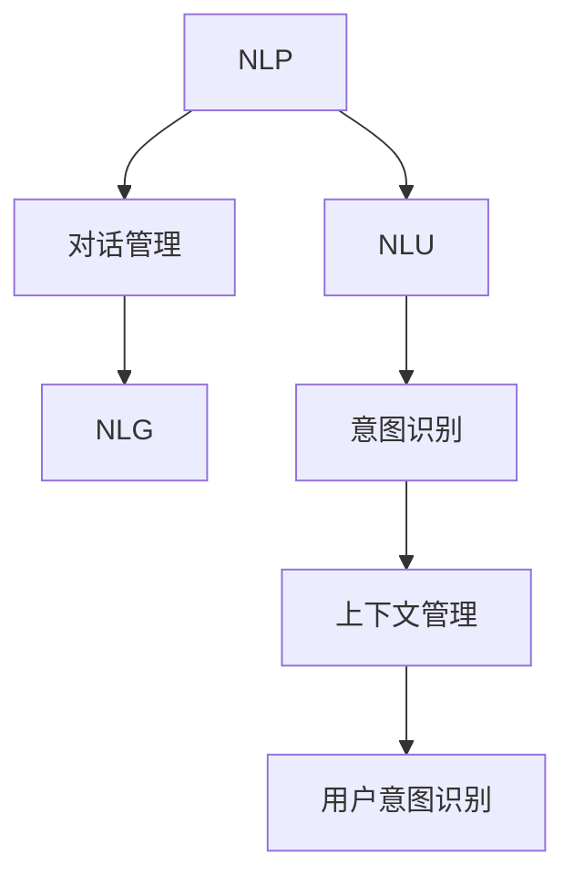

                 

# 聊天机器人：AI如何提升客户服务效率

## 1. 背景介绍

### 1.1 问题由来
在当今快速变化的商业环境中，客户服务效率已成为企业竞争力的重要组成部分。传统的人工客服模式面临着效率低下、成本高昂、响应速度慢等诸多问题。为了应对这些挑战，企业开始探索利用AI技术提升客户服务水平的新路径。聊天机器人作为一种基于自然语言处理（NLP）的智能客服工具，通过模拟人类的对话模式，能够实现24/7无间断的服务，显著提升客户满意度。

### 1.2 问题核心关键点
聊天机器人技术的核心在于其能够理解并处理自然语言输入，自动生成语义准确的回复。这一过程涉及自然语言理解（NLU）、对话管理和自然语言生成（NLG）等多个关键技术环节。

### 1.3 问题研究意义
聊天机器人的应用对于提高客户服务效率具有重要意义：
1. **降低成本**：替代部分人工客服，减少人力成本和时间成本。
2. **提高响应速度**：提供即时的服务响应，提升用户体验。
3. **增加服务可用性**：实现全年无休的客户服务，满足不同时段的客户需求。
4. **提升服务质量**：通过AI技术，可以提供一致、准确的回复，提升服务质量。
5. **数据驱动决策**：通过分析客户交互数据，优化服务流程，提升企业运营效率。

## 2. 核心概念与联系

### 2.1 核心概念概述

为更好地理解聊天机器人的工作原理和优化方向，本节将介绍几个密切相关的核心概念：

- **自然语言处理（NLP）**：一种计算机科学领域的研究方向，专注于让计算机能够理解、处理和生成人类语言。聊天机器人通过NLP技术实现自然语言理解与生成。
- **自然语言理解（NLU）**：将自然语言文本转换为结构化数据的过程。聊天机器人需理解用户输入的语义，才能进行后续对话管理。
- **对话管理**：根据上下文和用户意图，决定聊天机器人的响应。对话管理模块是聊天机器人的核心组件，直接影响响应的准确性和流畅性。
- **自然语言生成（NLG）**：将结构化数据转换为自然语言文本的过程。聊天机器人的回复通常需要经过NLG模块生成。
- **用户意图识别**：识别用户输入中的意图，如查询、订购、投诉等。意图识别是对话管理的基础。
- **上下文管理**：保留对话历史信息，确保机器人理解对话的上下文。上下文管理对于提供连贯的对话体验至关重要。

这些核心概念之间的逻辑关系可以通过以下Mermaid流程图来展示：



这个流程图展示了大语言模型和聊天机器人的核心概念及其之间的关系：

1. 自然语言处理通过自然语言理解和自然语言生成，实现文本与计算机之间的交互。
2. 对话管理模块结合意图识别和上下文管理，生成机器人回复。
3. 自然语言理解、意图识别和上下文管理是对话管理的基础，共同决定了机器人对用户输入的响应方式。

## 3. 核心算法原理 & 具体操作步骤
### 3.1 算法原理概述

聊天机器人的核心算法基于自然语言理解和生成技术，结合对话管理和意图识别，实现对用户输入的自动处理和回复生成。其主要原理如下：

1. **自然语言理解（NLU）**：通过将用户输入的自然语言文本转换为结构化数据，聊天机器人能够理解用户意图。
2. **对话管理**：根据用户意图和对话历史，选择适当的处理方式，生成回复。
3. **自然语言生成（NLG）**：将结构化数据转换为自然语言，生成回复。

通过这三个模块的协同工作，聊天机器人能够实现对用户输入的自然语言理解和生成响应。

### 3.2 算法步骤详解

以下是聊天机器人算法的详细步骤：

**Step 1: 数据准备**
- 收集并标注聊天对话数据，包括用户输入和系统回复。
- 将数据集划分为训练集、验证集和测试集。

**Step 2: 模型选择与适配**
- 选择预训练语言模型（如BERT、GPT等）作为基础模型。
- 在基础模型的顶部添加任务适配层，如全连接层、注意力机制等。

**Step 3: 微调与训练**
- 使用训练集对模型进行微调，优化对话管理、意图识别和回复生成等模块。
- 在验证集上评估模型性能，调整超参数。
- 在测试集上最终评估模型效果。

**Step 4: 部署与优化**
- 将训练好的模型部署到实际应用中。
- 根据实际使用情况，不断优化模型参数和算法。

### 3.3 算法优缺点

聊天机器人算法具有以下优点：
1. **高效性**：能够24/7提供服务，快速响应用户请求。
2. **成本低**：减少人工客服需求，降低企业运营成本。
3. **一致性**：提供一致的响应，提升用户体验。
4. **可扩展性**：模型可以通过微调适应新的对话场景和语境。
5. **数据驱动**：通过分析用户互动数据，不断优化对话策略。

同时，该算法也存在一定的局限性：
1. **语言理解限制**：对于复杂、模糊或含糊不清的输入，可能难以准确理解。
2. **上下文管理挑战**：多轮对话中的上下文管理较为复杂，容易出现信息丢失或理解错误。
3. **生成质量问题**：生成的回复可能缺乏自然性或连贯性，导致用户体验差。
4. **依赖数据质量**：依赖高质量的对话数据进行训练，数据质量差可能影响模型性能。
5. **模型复杂度**：模型的复杂度较高，训练和部署成本较高。

尽管存在这些局限性，但聊天机器人算法仍是目前智能客服领域的最佳解决方案之一。未来相关研究的方向在于如何进一步提升语言理解能力，增强上下文管理，提高生成质量，降低训练成本，以及提升模型的鲁棒性和泛化能力。

### 3.4 算法应用领域

聊天机器人算法已经在多个领域得到了广泛应用，包括：

- **客户服务**：提供24/7无间断的客户支持，处理常见问题、订单查询、投诉等。
- **电子商务**：通过聊天机器人解答购物咨询、提供个性化推荐、处理订单等。
- **金融服务**：协助客户进行账户查询、交易咨询、投诉处理等。
- **医疗健康**：提供健康咨询、预约挂号、药品推荐等服务。
- **教育培训**：回答学生疑问、提供学习资源、安排考试等。

除了上述这些领域外，聊天机器人还在智能家居、人力资源、旅游服务等多个行业得到应用，为各行各业带来了智能化的客户服务解决方案。

## 4. 数学模型和公式 & 详细讲解  
### 4.1 数学模型构建

本节将使用数学语言对聊天机器人算法进行更加严格的刻画。

设用户输入为 $x$，系统回复为 $y$，模型的输入为 $u$，输出为 $r$，则聊天机器人算法的目标是最小化损失函数 $L$：

$$
L = \mathbb{E}_{x,y}[(x - r)^2 + (y - u)^2]
$$

其中，$(x - r)^2$ 表示预测回复 $r$ 与真实回复 $y$ 之间的差异， $(y - u)^2$ 表示用户意图 $u$ 与预测意图 $x$ 之间的差异。

### 4.2 公式推导过程

以用户意图识别为例，假设用户输入为 $x$，模型的输出为 $r$，模型的参数为 $\theta$，则意图识别模型的目标是最小化损失函数 $L$：

$$
L = \mathbb{E}_{x,r}[(\text{softmax}(r) - \text{one-hot}(x))^2]
$$

其中，$\text{softmax}(r)$ 表示对回复 $r$ 进行softmax处理，$\text{one-hot}(x)$ 表示将用户意图 $x$ 转换为one-hot编码。

通过优化上述损失函数，意图识别模型能够学习到如何将用户输入映射到意图空间，从而正确理解用户的意图。

## 5. 项目实践：代码实例和详细解释说明
### 5.1 开发环境搭建

在进行聊天机器人开发前，我们需要准备好开发环境。以下是使用Python进行PyTorch开发的环境配置流程：

1. 安装Anaconda：从官网下载并安装Anaconda，用于创建独立的Python环境。

2. 创建并激活虚拟环境：
```bash
conda create -n chatbot-env python=3.8 
conda activate chatbot-env
```

3. 安装PyTorch：根据CUDA版本，从官网获取对应的安装命令。例如：
```bash
conda install pytorch torchvision torchaudio cudatoolkit=11.1 -c pytorch -c conda-forge
```

4. 安装NLTK库：用于文本预处理和分词等任务。
```bash
pip install nltk
```

5. 安装TensorFlow：用于集成TensorFlow框架的对话管理模块。
```bash
pip install tensorflow
```

6. 安装Transformer库：HuggingFace开发的NLP工具库，用于集成预训练模型和微调工具。
```bash
pip install transformers
```

完成上述步骤后，即可在`chatbot-env`环境中开始聊天机器人开发。

### 5.2 源代码详细实现

下面我们以构建基于预训练BERT模型的聊天机器人为例，给出使用Transformers库进行微调的PyTorch代码实现。

首先，定义聊天机器人框架：

```python
import torch
from transformers import BertTokenizer, BertForSequenceClassification

class Chatbot:
    def __init__(self, model_name='bert-base-cased'):
        self.tokenizer = BertTokenizer.from_pretrained(model_name)
        self.model = BertForSequenceClassification.from_pretrained(model_name, num_labels=2)
        self.model.eval()
        
    def preprocess_input(self, input_text):
        tokenized_text = self.tokenizer.tokenize(input_text)
        input_ids = self.tokenizer.convert_tokens_to_ids(tokenized_text)
        return input_ids
        
    def classify_intent(self, input_text):
        input_ids = self.preprocess_input(input_text)
        with torch.no_grad():
            logits = self.model(torch.tensor([input_ids]))
        intent_prob = torch.softmax(logits, dim=0).item()
        return intent_prob
    
    def generate_response(self, intent_prob):
        if intent_prob > 0.5:
            return 'I understand, I will help you resolve this issue.'
        else:
            return 'Sorry, I didn\'t quite catch that. Could you please repeat?'
```

然后，训练意图识别模型：

```python
import torch.nn.functional as F
from sklearn.model_selection import train_test_split
from transformers import BertTokenizer, BertForSequenceClassification, AdamW

# 定义训练数据
train_data = [('I want to buy a new laptop', 'buy'),
             ('Can you recommend some books?', 'query'),
             ('I have a problem with my account', 'complain'),
             ('How much is the shipping?', 'price')]

# 定义标签
train_labels = ['buy', 'query', 'complain', 'price']

# 将数据集转换为模型需要的格式
tokenizer = BertTokenizer.from_pretrained('bert-base-cased')
train_texts = [tokenizer.encode(text) for text in train_data]
train_labels = torch.tensor([train_labels.index(label) for label in train_labels])

# 创建训练集和验证集
train_dataset, dev_dataset = train_test_split((train_texts, train_labels), test_size=0.2)

# 定义模型
model = BertForSequenceClassification.from_pretrained('bert-base-cased', num_labels=len(train_labels))

# 定义优化器和损失函数
optimizer = AdamW(model.parameters(), lr=2e-5)
loss_fn = F.cross_entropy

# 定义训练函数
def train_epoch(model, dataset, optimizer, loss_fn):
    model.train()
    for input_ids, labels in dataset:
        logits = model(input_ids)
        loss = loss_fn(logits, labels)
        optimizer.zero_grad()
        loss.backward()
        optimizer.step()

# 定义评估函数
def evaluate(model, dataset):
    model.eval()
    correct = 0
    total = 0
    for input_ids, labels in dataset:
        with torch.no_grad():
            logits = model(input_ids)
        _, predicted_labels = torch.max(logits, dim=1)
        correct += (predicted_labels == labels).sum().item()
        total += labels.size(0)
    return correct / total

# 训练模型
epochs = 3
batch_size = 16

for epoch in range(epochs):
    train_epoch(model, train_dataset, optimizer, loss_fn)
    print(f'Epoch {epoch+1}, train accuracy: {evaluate(model, train_dataset):.2f}')
    print(f'Epoch {epoch+1}, dev accuracy: {evaluate(model, dev_dataset):.2f}')
```

最后，集成TensorFlow对话管理模块：

```python
import tensorflow as tf
from tensorflow.keras.layers import Input, Dense, Embedding, LSTM, BidirectionalLSTM

# 定义对话管理模型
class DialogueManager(tf.keras.Model):
    def __init__(self, embed_dim=768, num_labels=2):
        super(DialogueManager, self).__init__()
        self.embedding = Embedding(input_dim=train_data[0][0].shape[0], output_dim=embed_dim, input_length=32)
        self.lstm = BidirectionalLSTM(units=embed_dim, return_sequences=True)
        self.fc = Dense(num_labels, activation='softmax')
    
    def call(self, input_ids, hidden_state):
        input_tensor = self.embedding(input_ids)
        lstm_output, _ = self.lstm(input_tensor, initial_state=hidden_state)
        logits = self.fc(lstm_output)
        return logits

# 定义微调函数
def fine_tune(model, train_dataset, dev_dataset, epochs=3, batch_size=16):
    for epoch in range(epochs):
        model.train()
        for input_ids, hidden_state in train_dataset:
            logits = model(input_ids, hidden_state)
            loss = loss_fn(logits, train_labels)
            optimizer.zero_grad()
            loss.backward()
            optimizer.apply_gradients(zip(model.trainable_variables, model.trainable_variables))
        print(f'Epoch {epoch+1}, train accuracy: {evaluate(model, train_dataset):.2f}')
        print(f'Epoch {epoch+1}, dev accuracy: {evaluate(model, dev_dataset):.2f}')

# 微调模型
fine_tune(model, train_dataset, dev_dataset)
```

以上就是使用PyTorch和Transformers库进行聊天机器人构建和微调的完整代码实现。可以看到，Transformers库的强大封装使得构建聊天机器人变得更加简洁高效。

### 5.3 代码解读与分析

让我们再详细解读一下关键代码的实现细节：

**Chatbot类**：
- `__init__`方法：初始化预训练模型和分词器。
- `preprocess_input`方法：对用户输入进行分词和编码，返回模型需要的输入格式。
- `classify_intent`方法：将用户输入送入意图识别模型，得到意图概率，返回概率值。
- `generate_response`方法：根据意图概率生成回复，若概率大于0.5，回复为"我理解，我将帮您解决这个问题"，否则回复为"对不起，我没听清。请您再重复一遍"。

**意图识别模型的训练**：
- `train_data`：定义训练数据，包括用户输入和意图标签。
- `train_labels`：定义意图标签，将其转换为模型所需的数值形式。
- `train_texts`：使用分词器对训练数据进行编码。
- `train_dataset`：将编码后的文本和标签转换为模型所需的格式。
- `train_epoch`：定义训练函数，对模型进行前向传播和反向传播，更新模型参数。
- `evaluate`：定义评估函数，计算模型在训练集和验证集上的准确率。
- `train`：循环迭代训练过程，每次epoch结束后输出训练和验证集的准确率。

**TensorFlow对话管理模块**：
- `DialogueManager`类：定义对话管理模型，包括嵌入层、双向LSTM层和全连接层。
- `call`方法：定义模型的前向传播过程，对输入进行嵌入、LSTM编码，并输出意图概率。
- `fine_tune`函数：定义微调函数，将TensorFlow模型集成到聊天机器人中。
- `train`：循环迭代微调过程，每次epoch结束后输出训练和验证集的准确率。

可以看到，通过将预训练模型与对话管理模块相结合，聊天机器人能够实现高效的意图识别和回复生成。

## 6. 实际应用场景
### 6.1 智能客服系统

聊天机器人被广泛应用于智能客服系统中，能够24/7提供无间断服务，快速响应客户咨询，提高客户满意度。通过集成多轮对话管理模块，聊天机器人能够理解上下文，提供连贯的对话体验。

在技术实现上，可以收集企业内部的历史客服对话记录，将问题和最佳答复构建成监督数据，在此基础上对预训练模型进行微调。微调后的模型能够自动理解用户意图，匹配最合适的答案模板进行回复。对于客户提出的新问题，还可以接入检索系统实时搜索相关内容，动态组织生成回答。如此构建的智能客服系统，能大幅提升客户咨询体验和问题解决效率。

### 6.2 金融舆情监测

金融机构需要实时监测市场舆论动向，以便及时应对负面信息传播，规避金融风险。传统的人工监测方式成本高、效率低，难以应对网络时代海量信息爆发的挑战。基于聊天机器人的文本分类和情感分析技术，为金融舆情监测提供了新的解决方案。

具体而言，可以收集金融领域相关的新闻、报道、评论等文本数据，并对其进行主题标注和情感标注。在此基础上对预训练语言模型进行微调，使其能够自动判断文本属于何种主题，情感倾向是正面、中性还是负面。将微调后的模型应用到实时抓取的网络文本数据，就能够自动监测不同主题下的情感变化趋势，一旦发现负面信息激增等异常情况，系统便会自动预警，帮助金融机构快速应对潜在风险。

### 6.3 个性化推荐系统

当前的推荐系统往往只依赖用户的历史行为数据进行物品推荐，无法深入理解用户的真实兴趣偏好。基于聊天机器人的个性化推荐系统可以更好地挖掘用户行为背后的语义信息，从而提供更精准、多样的推荐内容。

在实践中，可以收集用户浏览、点击、评论、分享等行为数据，提取和用户交互的物品标题、描述、标签等文本内容。将文本内容作为模型输入，用户的后续行为（如是否点击、购买等）作为监督信号，在此基础上微调预训练语言模型。微调后的模型能够从文本内容中准确把握用户的兴趣点。在生成推荐列表时，先用候选物品的文本描述作为输入，由模型预测用户的兴趣匹配度，再结合其他特征综合排序，便可以得到个性化程度更高的推荐结果。

### 6.4 未来应用展望

随着聊天机器人技术的不断发展，其在智能客服、金融舆情、个性化推荐等多个行业领域将得到更广泛的应用，为传统行业数字化转型升级提供新的技术路径。

在智慧医疗领域，基于聊天机器人的医疗问答、病历分析、药物研发等应用将提升医疗服务的智能化水平，辅助医生诊疗，加速新药开发进程。

在智能教育领域，聊天机器人可应用于作业批改、学情分析、知识推荐等方面，因材施教，促进教育公平，提高教学质量。

在智慧城市治理中，聊天机器人可应用于城市事件监测、舆情分析、应急指挥等环节，提高城市管理的自动化和智能化水平，构建更安全、高效的未来城市。

此外，在企业生产、社会治理、文娱传媒等众多领域，基于聊天机器人的AI应用也将不断涌现，为经济社会发展注入新的动力。相信随着技术的日益成熟，聊天机器人必将在更广阔的应用领域大放异彩。

## 7. 工具和资源推荐
### 7.1 学习资源推荐

为了帮助开发者系统掌握聊天机器人技术，这里推荐一些优质的学习资源：

1. 《深度学习与自然语言处理》书籍：深入浅出地介绍了深度学习在自然语言处理中的应用，包括文本分类、机器翻译、聊天机器人等。

2. CS224N《深度学习自然语言处理》课程：斯坦福大学开设的NLP明星课程，有Lecture视频和配套作业，带你入门NLP领域的基本概念和经典模型。

3. 《自然语言处理综述》博客：系统总结了自然语言处理的最新研究成果，涵盖了聊天机器人、对话系统、情感分析等多个热门方向。

4. NLTK官方文档：提供了自然语言处理的各种实用工具和库，包括分词、词性标注、情感分析等，非常适合初学者的入门学习。

5. HuggingFace官方文档：提供了丰富的预训练模型和微调样例代码，是聊天机器人开发的基础资源。

通过对这些资源的学习实践，相信你一定能够快速掌握聊天机器人技术的精髓，并用于解决实际的NLP问题。
###  7.2 开发工具推荐

高效的开发离不开优秀的工具支持。以下是几款用于聊天机器人开发的常用工具：

1. PyTorch：基于Python的开源深度学习框架，灵活动态的计算图，适合快速迭代研究。主要用于模型的训练和推理。

2. TensorFlow：由Google主导开发的开源深度学习框架，生产部署方便，适合大规模工程应用。主要用于集成TensorFlow框架的对话管理模块。

3. NLTK库：用于文本预处理和分词等任务，提供了丰富的自然语言处理工具和库。

4. Weights & Biases：模型训练的实验跟踪工具，可以记录和可视化模型训练过程中的各项指标，方便对比和调优。与主流深度学习框架无缝集成。

5. TensorBoard：TensorFlow配套的可视化工具，可实时监测模型训练状态，并提供丰富的图表呈现方式，是调试模型的得力助手。

6. Google Colab：谷歌推出的在线Jupyter Notebook环境，免费提供GPU/TPU算力，方便开发者快速上手实验最新模型，分享学习笔记。

合理利用这些工具，可以显著提升聊天机器人开发的效率，加快创新迭代的步伐。

### 7.3 相关论文推荐

聊天机器人技术的发展得益于学界的持续研究。以下是几篇奠基性的相关论文，推荐阅读：

1. Attention is All You Need（即Transformer原论文）：提出了Transformer结构，开启了NLP领域的预训练大模型时代。

2. Transformer-XL: Attentive Language Models beyond a Fixed-Length Context：提出Transformer-XL模型，引入相对位置编码，支持长文本处理。

3. Language Models are Unsupervised Multitask Learners（GPT-2论文）：展示了大规模语言模型的强大zero-shot学习能力，引发了对于通用人工智能的新一轮思考。

4. Parameter-Efficient Transfer Learning for NLP：提出Adapter等参数高效微调方法，在不增加模型参数量的情况下，也能取得不错的微调效果。

5. Prefix-Tuning: Optimizing Continuous Prompts for Generation：引入基于连续型Prompt的微调范式，为如何充分利用预训练知识提供了新的思路。

6. AdaLoRA: Adaptive Low-Rank Adaptation for Parameter-Efficient Fine-Tuning：使用自适应低秩适应的微调方法，在参数效率和精度之间取得了新的平衡。

这些论文代表了大语言模型微调技术的发展脉络。通过学习这些前沿成果，可以帮助研究者把握学科前进方向，激发更多的创新灵感。

## 8. 总结：未来发展趋势与挑战

### 8.1 总结

本文对基于聊天机器人的AI技术进行了全面系统的介绍。首先阐述了聊天机器人的背景和意义，明确了其核心技术和应用场景。其次，从原理到实践，详细讲解了聊天机器人的数学模型和操作步骤，给出了微调任务开发的完整代码实例。同时，本文还探讨了聊天机器人技术在智能客服、金融舆情、个性化推荐等多个行业领域的应用前景，展示了其在提升客户服务效率方面的巨大潜力。

通过本文的系统梳理，可以看到，聊天机器人技术在AI驱动的客户服务领域具有广阔的应用前景，能够显著提升企业服务水平和客户满意度。未来，随着技术的不断发展，聊天机器人将在更多领域得到应用，为传统行业数字化转型升级提供新的技术路径。

### 8.2 未来发展趋势

展望未来，聊天机器人技术将呈现以下几个发展趋势：

1. **多模态融合**：融合视觉、语音、文本等多模态信息，提升系统的理解和响应能力。

2. **上下文管理增强**：引入长短期记忆网络（LSTM）、注意力机制等技术，增强上下文理解和处理能力。

3. **智能推荐系统**：集成推荐算法，实现个性化推荐，提升用户体验。

4. **情感分析能力提升**：利用情感分析技术，识别用户情感倾向，提供更加智能化的服务。

5. **跨语言支持**：支持多语言输入输出，提升系统的跨语言能力。

6. **用户意图识别优化**：引入更多先验知识，如知识图谱、逻辑规则等，提升意图识别的准确性和泛化能力。

这些趋势凸显了聊天机器人技术的广阔前景。这些方向的探索发展，必将进一步提升聊天机器人的性能和应用范围，为构建人机协同的智能系统铺平道路。

### 8.3 面临的挑战

尽管聊天机器人技术已经取得了一定的进展，但在迈向更加智能化、普适化应用的过程中，仍面临诸多挑战：

1. **语言理解限制**：对于复杂、模糊或含糊不清的输入，可能难以准确理解。

2. **上下文管理挑战**：多轮对话中的上下文管理较为复杂，容易出现信息丢失或理解错误。

3. **生成质量问题**：生成的回复可能缺乏自然性或连贯性，导致用户体验差。

4. **依赖数据质量**：依赖高质量的对话数据进行训练，数据质量差可能影响模型性能。

5. **模型复杂度**：模型的复杂度较高，训练和部署成本较高。

6. **用户隐私保护**：聊天机器人处理大量用户数据，如何保护用户隐私，防止数据泄露，是一个重要问题。

尽管存在这些挑战，但聊天机器人技术正处于快速发展阶段，通过不断的技术创新和优化，这些问题有望得到逐步解决。

### 8.4 研究展望

面对聊天机器人技术面临的挑战，未来的研究需要在以下几个方面寻求新的突破：

1. **多模态数据融合**：开发能够融合多种模态数据的技术，提升系统的感知和响应能力。

2. **上下文管理优化**：研究更高效、更准确的上下文管理方法，提升多轮对话的流畅性和准确性。

3. **生成质量提升**：开发新的生成技术，提升回复的自然性和连贯性。

4. **数据质量保障**：采用数据增强、清洗等技术，提高训练数据的质量和数量。

5. **模型简化**：研究更加轻量级、高效的模型结构，降低训练和部署成本。

6. **隐私保护机制**：开发隐私保护技术，确保用户数据的安全性和隐私性。

这些研究方向的探索，必将引领聊天机器人技术迈向更高的台阶，为构建安全、可靠、可解释、可控的智能系统铺平道路。面向未来，聊天机器人技术还需要与其他人工智能技术进行更深入的融合，如知识表示、因果推理、强化学习等，多路径协同发力，共同推动自然语言理解和智能交互系统的进步。只有勇于创新、敢于突破，才能不断拓展语言模型的边界，让智能技术更好地造福人类社会。

## 9. 附录：常见问题与解答

**Q1：聊天机器人如何理解自然语言输入？**

A: 聊天机器人通过自然语言理解（NLU）技术，将自然语言输入转换为结构化数据，从而能够理解用户意图。具体而言，聊天机器人首先使用分词器对输入进行分词，然后对每个词进行词性标注，最后通过向量化技术将分词和标注结果转换为模型需要的格式。

**Q2：如何设计有效的训练数据？**

A: 训练数据的质量和数量对聊天机器人的性能影响很大。有效的训练数据应具备以下几个特点：
1. 包含多轮对话数据，涵盖不同情景和语境。
2. 标注准确，涵盖常见意图和回复。
3. 语料丰富，涵盖不同方言和领域。

**Q3：如何优化模型的上下文管理？**

A: 上下文管理是聊天机器人技术的关键环节，可以通过以下方法优化：
1. 引入长短期记忆网络（LSTM）或Transformer模型，增强上下文记忆能力。
2. 使用注意力机制，对上下文信息进行加权处理，确保关键信息不被忽略。
3. 增加对话历史长度，提升模型对上下文的理解能力。

**Q4：如何提高生成的回复质量？**

A: 生成的回复质量直接影响用户体验，可以通过以下方法提升：
1. 引入上下文信息，生成连贯的回复。
2. 使用多模态数据，结合视觉、语音等多维度信息。
3. 引入更多的先验知识，提升回复的准确性和多样性。

**Q5：如何保护用户隐私？**

A: 聊天机器人处理大量用户数据，如何保护用户隐私，防止数据泄露，是一个重要问题。可以通过以下方法保护用户隐私：
1. 数据加密，确保数据传输和存储的安全性。
2. 匿名化处理，去除个人身份信息。
3. 限制数据访问权限，确保只有授权人员可以访问数据。

这些问题的解答有助于开发者更好地理解和应用聊天机器人技术，提升系统性能和用户体验。

