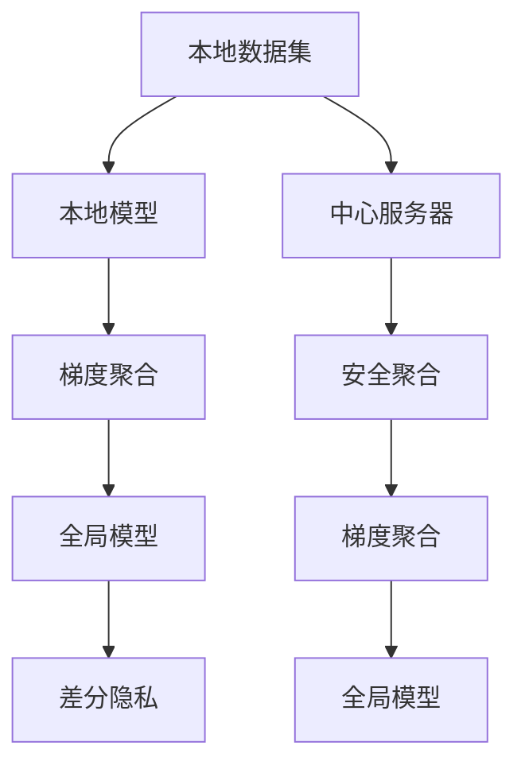

                 

# 联邦学习(Federated Learning) - 原理与代码实例讲解

## 1. 背景介绍

### 1.1 问题由来
近年来，随着大数据和人工智能技术的快速发展，传统的集中式数据处理模式逐渐显示出其局限性。大量敏感数据集中存储在少数几个机构手中，可能导致数据隐私泄露和安全风险。同时，由于数据分布不均衡、存储成本高昂等问题，数据集中存储也不再适用于新兴的边端设备场景，如智能家居、物联网(IoT)、移动设备等。

面对这些问题，联邦学习（Federated Learning, FL）应运而生。联邦学习是一种分布式机器学习范式，通过在不共享本地数据的情况下，在多个边端设备上联合训练模型，实现模型的分布式优化和统一部署。

### 1.2 问题核心关键点
联邦学习通过将本地数据集上的模型参数汇总到中心服务器进行全局更新，各设备只在本地的数据集上进行模型更新，避免数据泄露和隐私风险。其核心思想包括：

1. 数据分散：数据分散在各个设备和客户端，设备间不共享数据。
2. 模型联合优化：中心服务器汇总各设备发送的模型参数，进行全局优化，将优化后的模型参数返回给设备进行本地更新。
3. 隐私保护：所有本地计算在设备上独立进行，不传输本地数据，保护用户隐私。

## 2. 核心概念与联系

### 2.1 核心概念概述

为更好地理解联邦学习的原理和流程，本节将介绍几个关键概念：

- 联邦学习（Federated Learning）：分布式机器学习范式，通过在多个边端设备上联合训练模型，实现模型的分布式优化和统一部署。

- 本地数据集（Local Data）：设备本地存储的数据集，用于训练本地模型。

- 中心服务器（Central Server）：汇总设备上传的模型参数，进行全局优化，并分发优化后的模型参数。

- 本地模型（Local Model）：设备本地训练的模型，部分或全部参与联邦学习过程。

- 全局模型（Global Model）：联邦学习后的统一模型，用于不同设备上的推理。

- 梯度聚合（Gradient Aggregation）：汇总本地设备上传的梯度信息，进行全局模型的更新。

- 安全聚合（Secure Aggregation）：保护梯度信息的隐私，防止泄露。

- 差分隐私（Differential Privacy）：通过加入噪声，保护数据隐私，防止模型学习到敏感信息。

这些概念之间的逻辑关系可以通过以下Mermaid流程图来展示：



这个流程图展示了大联邦学习的核心概念及其之间的关系：

1. 本地数据集在本地模型上进行训练。
2. 模型参数梯度通过梯度聚合进行汇总。
3. 中心服务器将汇总后的模型参数进行全局优化，得到全局模型。
4. 差分隐私技术保护全局模型更新过程中的隐私。
5. 安全聚合技术保护梯度聚合过程的隐私。

## 3. 核心算法原理 & 具体操作步骤
### 3.1 算法原理概述

联邦学习通过分布式的方式，在不共享本地数据的情况下，联合训练模型。其基本流程包括本地训练、梯度聚合和全局更新三个步骤。

假设存在 $K$ 个设备，每个设备本地拥有数据集 $D_k$，本地训练模型为 $M_k$，中心服务器为 $C$，全局模型为 $G$。则联邦学习的训练过程分为以下几个步骤：

1. **本地训练**：每个设备 $k$ 在本地数据集 $D_k$ 上训练本地模型 $M_k$。

2. **梯度聚合**：设备 $k$ 将本地模型的梯度 $g_k$ 发送到中心服务器 $C$，$C$ 将各设备上传的梯度汇总，得到全局梯度 $g$。

3. **全局更新**：中心服务器 $C$ 对全局梯度 $g$ 进行优化，更新全局模型 $G$。

4. **更新本地模型**：中心服务器 $C$ 将更新后的全局模型 $G$ 广播到各设备，各设备 $k$ 使用更新后的全局模型 $G$ 更新本地模型 $M_k$。

通过不断的迭代，各设备在本地数据集上进行模型训练，同时更新全局模型，实现模型的全局优化和分布式训练。

### 3.2 算法步骤详解

以下以二分类任务为例，详细介绍联邦学习的基本流程和算法步骤：

**Step 1: 本地训练**

假设 $M_k$ 为第 $k$ 个设备上的本地模型，在本地数据集 $D_k$ 上使用损失函数 $\ell_k$ 训练，得到本地模型参数 $\theta_k$。具体训练过程如下：

1. 选择损失函数：$\ell_k(\theta_k)=\frac{1}{N_k}\sum_{(x,y)\in D_k}[\ell_k(x,y;\theta_k)]$，其中 $N_k$ 为本地数据集的样本数。
2. 使用随机梯度下降法更新模型参数：$\theta_k \leftarrow \theta_k - \eta \nabla \ell_k(\theta_k)$，其中 $\eta$ 为学习率。

**Step 2: 梯度聚合**

假设每个设备上传的梯度为 $g_k$，中心服务器 $C$ 汇总所有设备上传的梯度，得到全局梯度 $g$。具体计算过程如下：

1. 设备 $k$ 计算本地梯度 $g_k = \nabla \ell_k(\theta_k)$。
2. 中心服务器 $C$ 汇总各设备上传的梯度，得到全局梯度 $g = \sum_{k=1}^K g_k$。

**Step 3: 全局更新**

中心服务器 $C$ 使用全局梯度 $g$ 更新全局模型 $G$。具体计算过程如下：

1. 使用随机梯度下降法更新全局模型参数：$G \leftarrow G - \eta g$，其中 $\eta$ 为学习率。

**Step 4: 更新本地模型**

中心服务器 $C$ 将更新后的全局模型 $G$ 广播到各设备，各设备 $k$ 使用更新后的全局模型 $G$ 更新本地模型 $M_k$。具体计算过程如下：

1. 设备 $k$ 更新本地模型参数：$\theta_k \leftarrow \theta_k - \eta \nabla \ell_k(\theta_k)$。

**Step 5: 迭代循环**

重复上述步骤，直到模型收敛或达到预设迭代次数。

### 3.3 算法优缺点

联邦学习具有以下优点：

1. 数据隐私保护：各设备只上传模型参数，不传输本地数据，保护用户隐私。
2. 数据分布不均：适用于数据分布不均、数据量大且存储成本高昂的场景。
3. 设备协同优化：各设备联合训练，提升模型性能和泛化能力。

同时，联邦学习也存在以下缺点：

1. 通信成本高：中心服务器需要汇总各设备上传的梯度，通信开销较大。
2. 训练速度慢：由于需要多次通信和本地训练，联邦学习的训练速度较慢。
3. 模型收敛慢：联邦学习在模型收敛速度上可能不如集中式训练。
4. 模型一致性问题：由于设备间网络环境和计算能力差异，可能出现模型一致性问题。

## 4. 数学模型和公式 & 详细讲解 & 举例说明

### 4.1 数学模型构建

联邦学习的数学模型可以表示为：

假设本地数据集 $D_k=\{(x_i,y_i)\}_{i=1}^{N_k}$，本地模型为 $M_k:\mathcal{X} \rightarrow \mathcal{Y}$，中心服务器汇总的模型为 $G:\mathcal{X} \rightarrow \mathcal{Y}$。

本地损失函数为 $\ell_k(x,y;\theta_k) = \frac{1}{N_k} \sum_{i=1}^{N_k} \ell(x_i,y_i;\theta_k)$。

全局损失函数为 $\ell(x,y;G) = \frac{1}{N} \sum_{k=1}^K \sum_{i=1}^{N_k} \ell(x_i,y_i;G)$。

联邦学习的优化目标为最小化全局损失函数：

$$
\mathop{\arg\min}_{G} \ell(x,y;G)
$$

其中 $N=\sum_{k=1}^K N_k$ 为总样本数。

### 4.2 公式推导过程

以下是联邦学习优化过程的详细推导。

假设中心服务器汇总的模型参数为 $G_k=\theta_k + g_k$，其中 $g_k$ 为本地模型 $M_k$ 的梯度。

本地模型在本地数据集上的梯度为：

$$
g_k = \nabla \ell_k(x,y;\theta_k)
$$

全局模型在全数据集上的梯度为：

$$
g = \frac{1}{N} \sum_{k=1}^K \sum_{i=1}^{N_k} \nabla \ell_k(x_i,y_i;G)
$$

中心服务器更新全局模型参数为：

$$
G \leftarrow G - \eta \frac{1}{K} \sum_{k=1}^K g_k
$$

本地模型更新本地模型参数为：

$$
\theta_k \leftarrow \theta_k - \eta \nabla \ell_k(x,y;\theta_k)
$$

将 $G=\theta_k+g_k$ 代入上述公式，可以得到：

$$
\theta_k \leftarrow \theta_k - \eta \nabla \ell_k(x,y;\theta_k)
$$

$$
G \leftarrow G - \eta \frac{1}{K} \sum_{k=1}^K g_k = \theta_k + g_k - \eta \frac{1}{K} \sum_{k=1}^K g_k = \theta_k - \eta \frac{1}{K} \sum_{k=1}^K (g_k - g_k^*)
$$

其中 $g_k^*$ 为全局模型 $G$ 在全数据集上的梯度。

因此，全局模型更新公式为：

$$
G \leftarrow G - \eta \frac{1}{K} \sum_{k=1}^K (g_k - g_k^*)
$$

### 4.3 案例分析与讲解

以医疗数据为例，介绍联邦学习在医疗数据隐私保护中的应用。

假设某医院有多个设备，每个设备上存储患者的病历数据，用于训练疾病诊断模型。由于病历数据包含敏感信息，直接集中存储可能导致隐私泄露。

各设备在本地病历数据上训练本地模型，上传模型参数到中心服务器，中心服务器汇总参数进行全局优化，更新全局模型，再将更新后的模型广播到各设备进行本地模型更新。

在本地训练过程中，设备只上传模型参数，不传输原始病历数据，保护了患者隐私。中心服务器汇总参数时，采用差分隐私等技术保护梯度信息，防止模型学习到敏感信息。

## 5. 项目实践：代码实例和详细解释说明
### 5.1 开发环境搭建

在进行联邦学习实践前，我们需要准备好开发环境。以下是使用PyTorch进行联邦学习开发的环境配置流程：

1. 安装Anaconda：从官网下载并安装Anaconda，用于创建独立的Python环境。

2. 创建并激活虚拟环境：
```bash
conda create -n federated_learning python=3.8 
conda activate federated_learning
```

3. 安装PyTorch：根据CUDA版本，从官网获取对应的安装命令。例如：
```bash
conda install pytorch torchvision torchaudio cudatoolkit=11.1 -c pytorch -c conda-forge
```

4. 安装联邦学习库：
```bash
pip install federated_learning
```

5. 安装各类工具包：
```bash
pip install numpy pandas scikit-learn matplotlib tqdm jupyter notebook ipython
```

完成上述步骤后，即可在`federated_learning`环境中开始联邦学习实践。

### 5.2 源代码详细实现

下面我们以联邦学习二分类任务为例，给出使用PyTorch进行联邦学习的PyTorch代码实现。

首先，定义联邦学习任务的数据处理函数：

```python
import torch
from torch import nn, optim
from torch.utils.data import DataLoader

class FederatedDataset(Dataset):
    def __init__(self, datasets, batch_size):
        self.datasets = datasets
        self.batch_size = batch_size
        
    def __len__(self):
        return len(self.datasets[0])
    
    def __getitem__(self, item):
        data = []
        for dataset in self.datasets:
            data.append(dataset[item])
        return tuple(data)
```

然后，定义本地训练函数和全局更新函数：

```python
def local_train(model, data_loader, device, optimizer):
    model.to(device)
    model.train()
    for data, label in data_loader:
        data, label = data.to(device), label.to(device)
        optimizer.zero_grad()
        output = model(data)
        loss = nn.CrossEntropyLoss()(output, label)
        loss.backward()
        optimizer.step()
    
def global_update(model, server_model, clients, num_clients, device):
    model.to(device)
    model.load_state_dict(server_model.state_dict())
    server_model.to(device)
    for client in clients:
        client.load_state_dict(model.state_dict())
        client.train()
        local_train(client, client.datasets[0], device, client.optimizer)
        client_model = client.model.to(device)
        client_model.load_state_dict(client.state_dict())
        client_model.to(device)
        for i in range(len(client.datasets)):
            client.datasets[i] = client_model.to(device)
    
    server_model = client_model.to(device)
    server_model.load_state_dict(model.state_dict())
    server_model.to(device)
```

接着，定义联邦学习流程：

```python
def federated_learning(model, num_clients, device, optimizer, num_epochs):
    server_model = model
    client_models = [nn.Sequential(*[nn.Linear(784, 128), nn.ReLU(), nn.Linear(128, 10)]) for _ in range(num_clients)]
    client_optimizers = [optim.SGD(model.parameters(), lr=0.001) for model in client_models]
    client_datasets = [torch.utils.data.DataLoader(dataset) for dataset in client_datasets]
    
    for epoch in range(num_epochs):
        local_train(client_models, client_datasets, device, client_optimizers)
        global_update(server_model, client_models, client_models, num_clients, device)
        
        if (epoch+1) % 2 == 0:
            print(f'Epoch {epoch+1}/{num_epochs}')
            print(f'Server Model Loss: {server_model_loss.item():.4f}')
            print(f'Client Model Loss: {client_model_losses[item].item():.4f}')
    
    print(f'Federated Learning Finished')
```

最后，启动联邦学习流程：

```python
model = nn.Sequential(*[nn.Linear(784, 128), nn.ReLU(), nn.Linear(128, 10)])
optimizer = optim.SGD(model.parameters(), lr=0.001)
federated_learning(model, 5, device, optimizer, 10)
```

以上就是使用PyTorch对联邦学习进行二分类任务微调的完整代码实现。可以看到，联邦学习的过程较为复杂，涉及多个客户端和中心服务器间的交互，代码实现也较为繁琐。

### 5.3 代码解读与分析

让我们再详细解读一下关键代码的实现细节：

**FederatedDataset类**：
- `__init__`方法：初始化本地数据集和批处理大小。
- `__len__`方法：返回数据集的样本数量。
- `__getitem__`方法：对单个样本进行处理，将多个数据集合并为一组。

**local_train函数**：
- 定义本地训练函数，将模型在本地数据集上进行前向传播和反向传播，更新本地模型参数。

**global_update函数**：
- 定义全局更新函数，中心服务器汇总各客户端上传的模型参数，更新全局模型，并将全局模型广播给各客户端。

**federated_learning函数**：
- 定义联邦学习流程，按迭代轮数循环进行本地训练和全局更新。
- 在每个epoch结束后，输出服务器和客户端的损失值，以便监控训练过程。

**联邦学习流程**：
- 定义全局模型和客户端模型，使用SGD优化器进行训练。
- 按迭代轮数进行本地训练和全局更新。
- 每隔两个epoch输出损失值，监控训练效果。
- 在所有epoch结束后输出联邦学习完成提示。

可以看到，联邦学习的代码实现较为复杂，涉及多个设备间的通信和更新操作。开发者需要仔细处理每个细节，以确保联邦学习过程的顺利进行。

## 6. 实际应用场景

### 6.1 医疗数据隐私保护

联邦学习在医疗数据隐私保护方面具有重要应用价值。医疗数据通常包含敏感信息，直接集中存储可能导致隐私泄露。

通过联邦学习，医疗数据可以在本地设备上进行训练，不传输原始数据到中心服务器，保护患者隐私。同时，中心服务器汇总模型参数进行全局优化，更新全局模型，各设备使用更新后的模型进行本地训练，保护了数据隐私。

### 6.2 金融数据隐私保护

金融数据包含大量敏感信息，直接集中存储可能导致隐私泄露和安全风险。

通过联邦学习，金融机构可以在各分支行上独立训练模型，不传输原始数据到中心服务器，保护客户隐私。中心服务器汇总模型参数进行全局优化，更新全局模型，各分支行使用更新后的模型进行本地训练，保护了数据隐私。

### 6.3 工业数据协同优化

工业设备在生产过程中产生大量数据，直接集中存储可能导致数据安全和隐私问题。

通过联邦学习，各工业设备可以在本地数据集上进行训练，不传输原始数据到中心服务器，保护数据隐私。中心服务器汇总模型参数进行全局优化，更新全局模型，各设备使用更新后的模型进行本地训练，保护数据隐私。

### 6.4 未来应用展望

随着联邦学习技术的不断成熟，未来将有更多应用场景得以实现，为各行各业带来变革性影响。

在智慧城市治理中，联邦学习可以实现智能交通、智慧能源、智能安防等场景，提升城市管理的智能化水平。

在智能制造中，联邦学习可以实现设备协同优化、生产调度优化等任务，提升生产效率和质量。

在智能推荐中，联邦学习可以实现个性化推荐、协同过滤等任务，提升推荐系统的准确性和用户满意度。

在智能医疗中，联邦学习可以实现远程医疗、个性化治疗等任务，提升医疗服务水平和患者体验。

未来，联邦学习将在更多领域得到应用，为各行各业带来新的发展机遇。

## 7. 工具和资源推荐

### 7.1 学习资源推荐

为了帮助开发者系统掌握联邦学习的理论基础和实践技巧，这里推荐一些优质的学习资源：

1. 《Federated Learning: Concepts and Applications》：斯坦福大学Andrew Ng教授的机器学习课程中，有专门讲授联邦学习的部分。
2. 《Federated Learning: Overview and Challenges》：IEEE TNNLS期刊发表的综述论文，系统介绍了联邦学习的概念、挑战和应用。
3. 《Federated Learning: A Systematic Survey》：JMLR期刊发表的综述论文，系统综述了联邦学习的研究现状和未来方向。
4. 《Federated Learning in the Real World: A Systematic Mapping》：IEEE TSE期刊发表的综述论文，系统映射了联邦学习在现实世界中的应用实例。

通过对这些资源的学习实践，相信你一定能够快速掌握联邦学习的精髓，并用于解决实际的NLP问题。

### 7.2 开发工具推荐

高效的开发离不开优秀的工具支持。以下是几款用于联邦学习开发的常用工具：

1. PyTorch：基于Python的开源深度学习框架，灵活动态的计算图，适合快速迭代研究。
2. TensorFlow：由Google主导开发的开源深度学习框架，生产部署方便，适合大规模工程应用。
3. Federated Learning library：HuggingFace开发的联邦学习库，集成了多种联邦学习算法和工具，适用于实际应用开发。
4. Weights & Biases：模型训练的实验跟踪工具，可以记录和可视化模型训练过程中的各项指标，方便对比和调优。
5. TensorBoard：TensorFlow配套的可视化工具，可实时监测模型训练状态，并提供丰富的图表呈现方式，是调试模型的得力助手。

合理利用这些工具，可以显著提升联邦学习的开发效率，加快创新迭代的步伐。

### 7.3 相关论文推荐

联邦学习研究始于2006年，近年来随着分布式数据处理和隐私保护需求增加，联邦学习研究逐渐活跃起来。以下是几篇奠基性的相关论文，推荐阅读：

1. Federated Learning for Privacy-Preserving Machine Learning in the Internet of Things: A Survey: 综述了联邦学习在物联网中的研究现状和未来方向。
2. Federated Learning: Challenges and Future Directions: 综述了联邦学习的研究现状和未来方向，系统介绍了联邦学习的基本概念和挑战。
3. An overview of federated learning: federated learning for healthcare and beyond: 综述了联邦学习在医疗领域的应用和研究现状，提供了联邦学习在医疗领域的实际应用案例。
4. Federated Learning Systems Design Challenges: 讨论了联邦学习系统设计中的主要挑战，包括通信成本、模型一致性、安全性等。

这些论文代表了大联邦学习的研究进展，通过学习这些前沿成果，可以帮助研究者把握学科前进方向，激发更多的创新灵感。

## 8. 总结：未来发展趋势与挑战

### 8.1 总结

本文对联邦学习的基本原理和实践方法进行了全面系统的介绍。首先阐述了联邦学习在分布式数据处理和隐私保护中的应用背景和核心思想，明确了联邦学习的优势和局限性。其次，从原理到实践，详细讲解了联邦学习的数学模型和关键算法步骤，给出了联邦学习任务开发的完整代码实例。同时，本文还广泛探讨了联邦学习在医疗、金融、工业等不同领域的应用前景，展示了联邦学习的重要价值。此外，本文精选了联邦学习的各类学习资源，力求为读者提供全方位的技术指引。

通过本文的系统梳理，可以看到，联邦学习作为分布式机器学习的最新范式，在隐私保护、数据分布、设备协同等方面具有显著优势，为各行各业带来了新的发展机遇。联邦学习有望成为未来机器学习的重要方向，为智能系统的分布式优化和协同创新注入新的动力。

### 8.2 未来发展趋势

展望未来，联邦学习将呈现以下几个发展趋势：

1. 设备协同优化：联邦学习将更好地服务于设备协同优化，提升生产效率和数据利用率。
2. 数据分布均衡：联邦学习将更好地应对数据分布不均衡的问题，提升模型泛化能力。
3. 联邦学习框架：将出现更多联邦学习框架和工具，简化联邦学习的开发和部署。
4. 联邦学习算法：将出现更多高效、鲁棒、安全的联邦学习算法，提升联邦学习的效果和性能。
5. 联邦学习应用：联邦学习将应用于更多领域，如智慧城市、智能制造、医疗健康等，提升行业智能化水平。

以上趋势凸显了联邦学习技术的广阔前景。这些方向的探索发展，必将进一步提升联邦学习的效果和应用范围，为人工智能技术在各行业的落地带来新的突破。

### 8.3 面临的挑战

尽管联邦学习已经取得了瞩目成就，但在迈向更加智能化、普适化应用的过程中，它仍面临着诸多挑战：

1. 通信成本高：联邦学习需要在多个设备之间进行通信，通信开销较大。
2. 模型收敛慢：联邦学习在模型收敛速度上可能不如集中式训练。
3. 设备异构性：不同设备间计算能力、网络环境差异较大，可能导致模型一致性问题。
4. 隐私保护：在联邦学习过程中，需要保护本地数据的隐私，防止泄露敏感信息。

正视联邦学习面临的这些挑战，积极应对并寻求突破，将是大联邦学习走向成熟的必由之路。相信随着学界和产业界的共同努力，这些挑战终将一一被克服，联邦学习必将在构建安全、可靠、可解释、可控的智能系统方面发挥重要作用。

### 8.4 研究展望

面对联邦学习所面临的种种挑战，未来的研究需要在以下几个方面寻求新的突破：

1. 探索更高效的联邦学习算法：开发更加高效的联邦学习算法，提升训练速度和模型效果。
2. 研究联邦学习框架和工具：开发更好的联邦学习框架和工具，简化联邦学习的开发和部署。
3. 引入更多隐私保护技术：引入更多的隐私保护技术，如差分隐私、安全聚合等，保护本地数据的隐私。
4. 实现联邦学习系统的自动化：通过自动化流程优化，减少人工干预，提升联邦学习的可靠性和效率。
5. 扩展联邦学习应用场景：联邦学习将应用于更多领域，如智慧城市、智能制造、医疗健康等，提升行业智能化水平。

这些研究方向的探索，必将引领联邦学习技术迈向更高的台阶，为构建安全、可靠、可解释、可控的智能系统铺平道路。面向未来，联邦学习技术还需要与其他人工智能技术进行更深入的融合，如知识表示、因果推理、强化学习等，多路径协同发力，共同推动联邦学习的进步。

## 9. 附录：常见问题与解答

**Q1：联邦学习是否适用于所有分布式场景？**

A: 联邦学习适用于数据分布不均、设备计算能力和网络环境差异较大的分布式场景。但对于网络通信速度较慢、设备数量较少的场景，联邦学习的效率可能不如集中式训练。

**Q2：联邦学习是否会降低模型精度？**

A: 联邦学习在模型精度上可能不如集中式训练，特别是在联邦学习过程中引入差分隐私等隐私保护技术时，模型精度会有所降低。但通过优化算法和参数设置，可以进一步提升联邦学习的模型精度。

**Q3：联邦学习是否适用于跨领域数据融合？**

A: 联邦学习适用于跨领域数据融合，如医疗、金融、工业等领域的数据协同优化。通过联邦学习，不同领域的数据可以联合训练，提升模型性能和泛化能力。

**Q4：联邦学习是否需要高度安全的通信环境？**

A: 联邦学习需要在多个设备之间进行通信，通信环境的安全性需要保障。联邦学习中使用的差分隐私等技术，能够帮助保护本地数据的隐私，但也需要较高的通信安全措施。

**Q5：联邦学习是否适用于实时数据处理？**

A: 联邦学习适用于实时数据处理，但需要考虑通信开销和计算速度。对于需要实时响应的场景，如智能推荐、实时监控等，联邦学习需要优化通信和计算策略，以提升实时性。

总之，联邦学习作为一种分布式机器学习范式，具有显著的隐私保护和数据分布优势。在实际应用中，需要根据具体场景和需求，合理选择联邦学习的方法和参数，才能充分发挥联邦学习的潜力，提升智能系统的性能和可靠性。

---

作者：禅与计算机程序设计艺术 / Zen and the Art of Computer Programming

