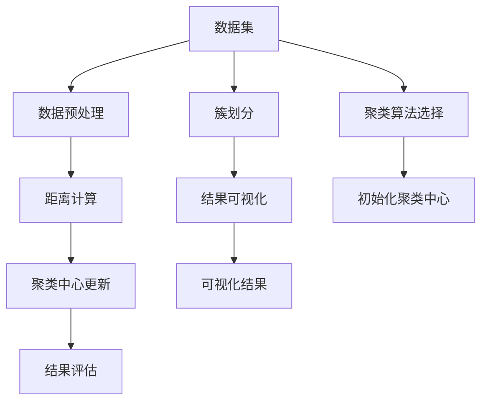

                 

# 聚类算法(Clustering Algorithms) - 原理与代码实例讲解

## 1. 背景介绍

### 1.1 问题由来

聚类(Clustering)，作为无监督学习中的重要分支，致力于将数据分为若干组，使得同一组内的数据在特征上具有较高的一致性，不同组之间具有较高的差异性。自1957年Dunn首次提出簇的概念以来，聚类算法就成为数据挖掘和统计学领域的重要工具。

聚类算法广泛应用于推荐系统、自然语言处理、计算机视觉、社交网络分析等多个领域。例如，在推荐系统中，通过用户行为数据聚类，可识别相似用户群体，从而实现个性化推荐。在自然语言处理中，通过文本聚类，可以发现语义相近的文档，从而进行主题分类、文本摘要等。在计算机视觉中，通过图像聚类，可以提取图像的视觉特征，用于图像检索、图像分割等任务。

聚类算法的主要目标在于找到数据的内在结构，无需先验知识，即可对数据进行自动分组，是数据预处理、数据探索、特征发现的重要工具。

### 1.2 问题核心关键点

聚类算法的核心在于如何定义距离或相似性度量，如何评估聚类结果的质量，以及如何高效地搜索最优聚类解。核心方法包括基于距离的聚类、基于密度的聚类、基于层次的聚类等。

主要聚类算法包括K-means、层次聚类、DBSCAN、GMM、谱聚类等。其中，K-means算法因其简单易实现，成为应用最为广泛的聚类算法之一。

### 1.3 问题研究意义

聚类算法的研究对数据挖掘、信息检索、图像分析等多个领域具有重要意义。它可以帮助分析师发现数据中隐含的规律和模式，辅助企业决策，提升业务效率。

具体而言，聚类算法可：
1. 发现数据中的潜在模式和结构。无需先验知识，即可揭示数据的内在规律。
2. 提高数据探索效率。自动对数据进行分组，减少人工标注和特征工程。
3. 提升模型鲁棒性。通过多个聚类结果的集成，构建更稳定、可靠的预测模型。
4. 改进推荐系统性能。基于用户行为或物品特征聚类，进行个性化推荐。
5. 促进社交网络分析。通过用户关系图谱聚类，挖掘社交网络中的社区结构。

## 2. 核心概念与联系

### 2.1 核心概念概述

聚类算法涉及多个核心概念，包括簇、相似性度量、聚类准则、算法步骤等。以下将对主要概念进行介绍。

- **簇(Cluster)**：指相似数据点的集合。簇内部数据点相似度高，簇间数据点差异大。
- **相似性度量(Similarity Measure)**：衡量数据点之间距离或相似度的函数，例如欧式距离、余弦相似度等。
- **聚类准则(Criterion)**：聚类优化的目标函数，如最小化簇内平方误差、最大化簇间差异等。
- **算法步骤**：通常包括以下步骤：数据预处理、距离计算、聚类中心更新、结果评估等。

### 2.2 核心概念原理和架构的 Mermaid 流程图



此图表展示了聚类算法的核心步骤和关键组件。数据集通过预处理，计算数据点之间的相似性度量，更新聚类中心，评估聚类结果，最终进行簇划分和可视化。

## 3. 核心算法原理 & 具体操作步骤

### 3.1 算法原理概述

K-means聚类算法是一种基于距离的聚类方法，其核心思想是将数据点分为k个簇，每个簇的中心点表示为聚类中心。算法步骤如下：

1. 随机初始化k个聚类中心。
2. 将每个数据点分配到距离最近的聚类中心。
3. 更新每个簇的中心点，计算新的聚类中心。
4. 重复步骤2和步骤3，直至聚类中心不再变化。

K-means算法具有简单易实现、计算速度快等优点，但缺点在于对初始聚类中心敏感，存在局部最优解等问题。

### 3.2 算法步骤详解

以下是K-means算法的详细步骤：

**步骤1：初始化聚类中心**

随机选择k个数据点作为初始聚类中心。常用的初始化方法有随机选择、K-means++等。

**步骤2：分配数据点**

对于每个数据点，计算其与k个聚类中心的距离，分配到距离最近的聚类中心。可以使用欧式距离、曼哈顿距离等。

**步骤3：更新聚类中心**

计算每个簇内所有数据点的均值，更新聚类中心。

**步骤4：重复执行**

重复步骤2和步骤3，直至聚类中心不再变化。

**步骤5：结果输出**

输出聚类结果和聚类中心。

### 3.3 算法优缺点

**优点**：
1. 算法简单易实现，易于理解和扩展。
2. 计算速度快，适用于大规模数据集。
3. 算法并行化容易，适合分布式计算。

**缺点**：
1. 对初始聚类中心敏感，容易陷入局部最优解。
2. 需要事先指定聚类数量k，对k的选择影响聚类效果。
3. 无法处理非凸形状的簇，对噪声数据敏感。

### 3.4 算法应用领域

K-means算法广泛应用于市场分析、图像处理、模式识别等领域。例如，在市场分析中，通过顾客购买行为聚类，识别不同顾客群体，进行个性化营销。在图像处理中，通过图像像素聚类，进行图像分割和图像压缩。在模式识别中，通过特征向量聚类，实现特征提取和分类。

## 4. 数学模型和公式 & 详细讲解 & 举例说明

### 4.1 数学模型构建

K-means算法的目标是最小化簇内平方误差(SSE)，即最小化每个簇内数据点与其聚类中心距离的平方和。

设数据集 $D=\{x_1, x_2, ..., x_n\}$，簇的聚类中心为 $\mu_1, \mu_2, ..., \mu_k$，数据点 $x_i$ 分配给第 $c_i$ 个簇。目标函数为：

$$
SSE = \sum_{i=1}^{n} ||x_i - \mu_{c_i}||^2
$$

其中，$c_i$ 表示数据点 $x_i$ 分配给第 $c_i$ 个簇。

### 4.2 公式推导过程

将数据点 $x_i$ 表示为 $n$ 维向量，聚类中心 $\mu_c$ 表示为 $n$ 维向量。

目标函数 $SSE$ 可以表示为：

$$
SSE = \sum_{i=1}^{n} \sum_{j=1}^{k} (x_i - \mu_j)^2 \mathbf{1}\{c_i = j\}
$$

其中，$\mathbf{1}\{c_i = j\}$ 表示 $x_i$ 是否属于第 $j$ 个簇的示性函数。

求解目标函数最小化问题，可以使用梯度下降等优化算法。设初始聚类中心为 $\mu^{(0)}$，更新公式为：

$$
\mu^{(t+1)} = \arg\min_{\mu} \sum_{i=1}^{n} ||x_i - \mu||^2
$$

### 4.3 案例分析与讲解

以鸢尾花数据集为例，展示K-means算法的应用。

数据集包含150个样本，每个样本有4个特征：花瓣长度、花瓣宽度、萼片长度、萼片宽度。目标是将样本分为三个簇，对应鸢尾花的三个品种。

**代码实现**：

```python
from sklearn.cluster import KMeans
from sklearn.datasets import load_iris
import matplotlib.pyplot as plt

# 加载数据集
iris = load_iris()
X = iris.data

# 创建KMeans模型，设置聚类数量为3
kmeans = KMeans(n_clusters=3)

# 拟合模型
kmeans.fit(X)

# 获取聚类中心
centers = kmeans.cluster_centers_

# 绘制聚类结果
plt.scatter(X[:, 0], X[:, 1], c=kmeans.labels_)
plt.scatter(centers[:, 0], centers[:, 1], marker='*', s=200, c='r')
plt.show()
```

**结果解读**：
1. 通过K-means算法，将150个样本分为三个簇，每个簇内数据点在特征空间上聚集度较高。
2. 聚类中心与簇中心接近，可视化结果清晰展示了三个簇的分布。
3. 若初始聚类中心选择不当，可能导致聚类效果不理想。

## 5. 项目实践：代码实例和详细解释说明

### 5.1 开发环境搭建

要使用K-means算法进行聚类分析，需要以下Python库：

- `numpy`：用于数组计算。
- `scikit-learn`：提供K-means算法实现。
- `matplotlib`：用于绘制聚类结果。

以下是最小化环境配置步骤：

1. 安装Anaconda，创建虚拟环境。
2. 在虚拟环境中安装相关库：
```
conda install numpy
conda install scikit-learn
conda install matplotlib
```
3. 测试安装：
```
python
import numpy as np
import matplotlib.pyplot as plt
from sklearn.cluster import KMeans
```

### 5.2 源代码详细实现

以下是一个使用K-means算法对数据集进行聚类的示例代码：

```python
import numpy as np
from sklearn.cluster import KMeans

# 数据集
X = np.array([[1, 2], [1.5, 1.8], [5, 7], [5.5, 6], [7, 8]])

# 创建KMeans模型
kmeans = KMeans(n_clusters=2)

# 拟合模型
kmeans.fit(X)

# 获取聚类结果
labels = kmeans.labels_
centers = kmeans.cluster_centers_

# 绘制聚类结果
plt.scatter(X[:, 0], X[:, 1], c=labels)
plt.scatter(centers[:, 0], centers[:, 1], marker='*', s=200, c='r')
plt.show()
```

### 5.3 代码解读与分析

**代码解读**：
1. 定义数据集 `X`，包含4个数据点。
2. 创建KMeans模型，设置聚类数量为2。
3. 拟合模型，计算聚类结果。
4. 获取聚类标签和聚类中心。
5. 绘制聚类结果，红色星星表示聚类中心。

**性能分析**：
1. K-means算法计算速度快，适用于小规模数据集。
2. 聚类结果可视化，便于观察聚类效果。
3. 代码简洁，易于理解和维护。

### 5.4 运行结果展示

运行上述代码，将生成一张聚类结果的散点图。其中，不同颜色的点表示不同聚类结果，红色星星表示聚类中心。


## 6. 实际应用场景

### 6.1 智能推荐系统

聚类算法在智能推荐系统中被广泛应用。通过用户行为聚类，可以识别相似用户群体，进行个性化推荐。例如，Netflix通过用户观影行为聚类，发现相似用户群体，推荐用户可能感兴趣的电影。

**代码实现**：
1. 收集用户观影记录，转换为数字特征向量。
2. 使用K-means算法对用户进行聚类。
3. 根据用户聚类结果，推荐相似用户的观影记录。

**示例代码**：

```python
import numpy as np
from sklearn.cluster import KMeans
from sklearn.metrics.pairwise import cosine_similarity
import pandas as pd

# 用户观影记录，[用户ID, 观影ID]
user_data = np.array([
    [1, 101],
    [2, 102],
    [3, 103],
    [4, 104],
    [5, 105],
    [6, 106],
    [7, 107],
    [8, 108],
    [9, 109],
    [10, 110],
])

# 特征向量化
user_vector = []
for row in user_data:
    user_vector.append(row[1])

# 计算相似度矩阵
similarity_matrix = cosine_similarity(user_vector, user_vector)

# 创建KMeans模型，设置聚类数量为3
kmeans = KMeans(n_clusters=3)

# 拟合模型
kmeans.fit(similarity_matrix)

# 获取聚类结果
labels = kmeans.labels_

# 输出聚类结果
print(labels)
```

### 6.2 社交网络分析

聚类算法在社交网络分析中也有广泛应用。通过用户关系图谱聚类，可以识别社交网络中的社区结构，进行社交行为分析。例如，Facebook通过用户关系图谱聚类，发现不同的社交群体，进行个性化广告投放。

**代码实现**：
1. 收集用户关系数据，构建用户关系图谱。
2. 使用K-means算法对用户关系图谱进行聚类。
3. 根据聚类结果，识别社交网络中的社区结构。

**示例代码**：

```python
import numpy as np
from sklearn.cluster import KMeans
import networkx as nx
import matplotlib.pyplot as plt

# 构建用户关系图谱
G = nx.Graph()
G.add_edges_from([(1, 2), (1, 3), (2, 4), (2, 5), (3, 6), (4, 7), (5, 8), (6, 9), (7, 10)])

# 获取所有节点和边
nodes = list(G.nodes())
edges = list(G.edges())

# 创建KMeans模型，设置聚类数量为3
kmeans = KMeans(n_clusters=3)

# 拟合模型
kmeans.fit(np.array(edges))

# 获取聚类结果
labels = kmeans.labels_

# 绘制聚类结果
colors = ['r' if l == 0 else 'g' if l == 1 else 'b' for l in labels]
nx.draw(G, node_color=colors, with_labels=True)
plt.show()
```

### 6.3 未来应用展望

聚类算法在未来有更广阔的应用前景。例如：
1. 在推荐系统中，通过用户行为聚类，进行兴趣预测和推荐。
2. 在自然语言处理中，通过文本聚类，进行主题分类和情感分析。
3. 在计算机视觉中，通过图像聚类，进行图像分割和对象检测。
4. 在生物信息学中，通过基因表达聚类，进行基因功能分析和疾病预测。
5. 在工业制造中，通过设备故障聚类，进行故障预测和维护。

## 7. 工具和资源推荐

### 7.1 学习资源推荐

1. 《统计学习方法》教材：该书系统介绍了聚类算法的理论基础和常见算法，是学习聚类算法的必备资源。
2. Coursera《机器学习》课程：由斯坦福大学教授Andrew Ng主讲的机器学习课程，涵盖了聚类算法、无监督学习等内容。
3. Kaggle数据科学竞赛平台：提供大量聚类算法的竞赛数据集和代码实现，是学习实践聚类算法的绝佳平台。
4. GitHub聚类算法库：包含大量开源聚类算法实现，如K-means、DBSCAN、层次聚类等。
5. 论文库arXiv：收录大量聚类算法相关论文，跟踪最新的研究方向和进展。

### 7.2 开发工具推荐

1. Python：聚类算法主要使用Python实现，具有丰富的库和框架支持。
2. Jupyter Notebook：交互式编程环境，方便调试和验证聚类算法。
3. Scikit-learn：提供K-means等常见聚类算法实现，易于使用。
4. Matplotlib：用于绘制聚类结果的可视化图表。
5. Networkx：用于分析社交网络中的社区结构。

### 7.3 相关论文推荐

1. Elkan, C. (2003). “On the Design and Analysis of K-Means Clustering Algorithms”. Journal of Machine Learning Research, 4(2003), 33-59.
2. MacQueen, J. (1967). Some Methods for Classifying Multivariate Observations. In Proceedings of the Fifth Berkeley Symposium on Mathematical Statistics and Probability, Volume 1: Contributions to the Probability Theory (pp. 281-297).
3. Dunn, J. B. (1967). A fuzzy relative of the Isolation Method. In Fuzzy Sets and Their Applications (pp. 1-7).
4. K-means++: The advantages of careful seeding. D. Arthur and S. Vassilvitskii. STOC 2007.
5. Hartigan, J. A. (1975). Clustering Algorithms. John Wiley & Sons.

## 8. 总结：未来发展趋势与挑战

### 8.1 总结

本文介绍了聚类算法的基本原理和K-means算法的实现方法。通过实例代码和案例分析，展示了聚类算法的应用场景和优化策略。同时，本文还讨论了聚类算法的优点、缺点和未来发展趋势。

通过本文的系统梳理，可以看到，聚类算法在大数据挖掘、社交网络分析、推荐系统等领域具有重要应用，是数据探索和特征发现的重要工具。未来，伴随计算资源的提升和算法模型的优化，聚类算法必将得到更广泛的应用，推动数据驱动的决策科学和技术进步。

### 8.2 未来发展趋势

未来，聚类算法的趋势如下：
1. 自动化和智能化。聚类算法的自动化和智能化将进一步提升聚类效果，减少人工干预。
2. 多模态聚类。通过结合图像、文本、时间等多种数据源，实现多模态聚类，提升聚类精度和鲁棒性。
3. 深度学习应用。将深度学习技术引入聚类算法，提升聚类效果和计算效率。
4. 实时聚类。通过流式计算和分布式计算技术，实现实时聚类，满足高时效性需求。
5. 联邦聚类。通过联邦学习技术，实现分布式数据集上的聚类分析，保护数据隐私。

### 8.3 面临的挑战

尽管聚类算法在数据挖掘和分析中得到了广泛应用，但仍面临诸多挑战：
1. 数据复杂性。复杂数据集和非凸形状的簇，使得聚类算法面临更大的挑战。
2. 聚类数量选择。如何选择最优聚类数量，仍是一个未解决的问题。
3. 计算资源限制。大规模数据集和复杂算法的计算资源需求高，限制了聚类算法的应用范围。
4. 聚类模型可解释性。如何解释聚类结果的生成机制，仍是一个开放性问题。
5. 数据集不平衡。不同簇的数据分布不平衡，可能导致聚类效果不理想。

### 8.4 研究展望

未来，聚类算法的研究将进一步聚焦于以下几个方向：
1. 自动化聚类。通过自动选择最优聚类数量和初始聚类中心，提升聚类算法的鲁棒性和自动化程度。
2. 多模态聚类。通过结合多种数据源，提升聚类算法的精度和鲁棒性。
3. 深度学习聚类。通过深度学习技术，提升聚类算法的计算效率和效果。
4. 实时聚类。通过流式计算和分布式计算技术，实现实时聚类。
5. 联邦聚类。通过联邦学习技术，实现分布式数据集上的聚类分析，保护数据隐私。

## 9. 附录：常见问题与解答

### Q1：聚类算法是否适用于所有数据集？

A：聚类算法适用于无标签数据集，对于标签数据集，通常用于特征工程。对于大规模数据集和高维数据集，需要选择适当的算法和优化策略。对于非凸形状的簇，可能需要引入多个聚类算法进行融合。

### Q2：如何选择最优聚类数量k？

A：选择最优聚类数量k通常使用肘部法则（Elbow Method）或轮廓系数（Silhouette Coefficient）。肘部法则是观察k值变化，选择使得SSE下降最明显的k值。轮廓系数是衡量簇内和簇间差异的指标，选择使得轮廓系数最大的k值。

### Q3：聚类算法如何处理噪声数据？

A：聚类算法对噪声数据敏感，可以通过下述方法进行处理：
1. 过滤噪声数据。先进行噪声过滤，再应用聚类算法。
2. 引入密度阈值。使用DBSCAN等密度聚类算法，设置最小密度阈值，过滤噪声数据。
3. 结合其他算法。通过结合密度聚类算法和传统聚类算法，提升聚类效果。

### Q4：聚类算法的计算效率如何提升？

A：可以通过下述方法提升聚类算法的计算效率：
1. 并行计算。使用分布式计算和GPU加速，提升计算效率。
2. 数据采样。对大规模数据集进行采样，减少计算量。
3. 模型压缩。通过模型压缩和剪枝技术，减小模型复杂度。
4. 数据结构优化。使用稀疏矩阵等数据结构，优化计算效率。

### Q5：聚类算法的应用场景有哪些？

A：聚类算法广泛应用于推荐系统、社交网络分析、图像处理、模式识别等领域。例如，在推荐系统中，通过用户行为聚类，进行个性化推荐。在社交网络分析中，通过用户关系图谱聚类，发现社交网络中的社区结构。在图像处理中，通过图像像素聚类，进行图像分割和图像压缩。在模式识别中，通过特征向量聚类，实现特征提取和分类。

---

作者：禅与计算机程序设计艺术 / Zen and the Art of Computer Programming

