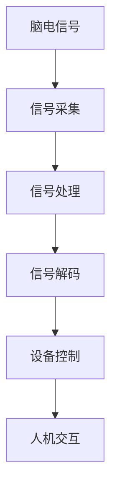
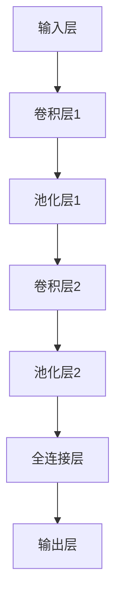

                 

# 脑机接口创业：思维控制的科技革命

## 1. 背景介绍

### 1.1 问题由来

随着科技的进步，人类对未来的向往与期待愈发浓烈。在科幻电影和文学作品中，思维控制的革命早已不是什么新鲜话题。然而，这一切能否成为现实，脑机接口技术的发展现状如何？

脑机接口技术是使人类通过脑电信号直接与计算机交互、控制外部设备的技术。这项技术的发展可以追溯到20世纪60年代，最初主要用于研究脑功能及其障碍。近年来，随着神经科学、信号处理、人工智能等多学科的交叉融合，脑机接口技术的研究与应用取得了一系列突破。

脑机接口技术的崛起，带来了广泛的影响。医学上，用于帮助瘫痪病人康复训练；军事上，提升士兵的作战能力；工业上，应用于飞机驾驶、游戏控制等场景；日常应用上，成为人与智能设备交流的新方式。目前，脑机接口技术在实际应用中的前景十分广阔，逐渐从实验室走向大众生活。

### 1.2 问题核心关键点

脑机接口技术通过读取人脑信号，将大脑思维转化为控制指令，实现对人机交互设备的直接控制。其核心在于：

1. **信号采集**：利用电生理学、光学传感等手段采集脑电信号。
2. **信号处理**：对采集到的信号进行预处理、特征提取，以消除噪声、增强信号。
3. **信号解码**：使用机器学习、深度学习等算法，将脑电信号转化为控制指令。
4. **设备控制**：通过解码后的控制指令，驱动外部设备执行相应的操作。

脑机接口技术的关键在于实现信号的高效、准确采集，信号的精确解码，以及最终设备控制的灵活性。

### 1.3 问题研究意义

脑机接口技术的研究与应用，对于提升人类生活质量、探索智慧生命的可能性具有重要意义：

1. **医疗康复**：脑机接口技术可帮助瘫痪病人通过思维直接控制假肢、轮椅等设备，实现自主移动，提高生活质量。
2. **军事训练**：通过脑机接口技术，士兵可实现人机交互，提升反应速度和决策能力，改善军事训练效果。
3. **工业生产**：脑机接口技术可用于控制飞机、机器人等工业设备，减轻劳动强度，提升生产效率。
4. **日常生活**：通过脑机接口技术，可实现语音控制、视觉反馈等新型的交互方式，为智能设备带来全新的交互体验。
5. **科学研究**：脑机接口技术为神经科学、认知心理学等研究领域提供了新的研究工具和方法。

总之，脑机接口技术作为一种全新的交互方式，是科技发展的重要突破，为实现思维控制的梦想奠定了基础。

## 2. 核心概念与联系

### 2.1 核心概念概述

脑机接口技术涉及多个关键概念，这些概念之间有着紧密的联系，共同构成了这项技术的核心。

1. **脑电信号**：指脑电活动产生的电信号，是脑机接口技术的基础。脑电信号通常包括脑皮层电位（EEG）、磁共振成像（MRI）等多种形式。
2. **信号采集**：利用电生理学、光学传感等手段，采集脑电信号。信号采集质量直接影响后续处理的准确性。
3. **信号处理**：对采集到的信号进行预处理、滤波、降噪等操作，以便后续分析。
4. **信号解码**：通过机器学习、深度学习等算法，将脑电信号转化为控制指令。
5. **设备控制**：将解码后的控制指令应用于外部设备，实现人机交互。

这些概念共同构成了脑机接口技术的框架，其核心在于实现脑电信号的高效、准确采集和解码，最终实现设备控制的灵活性。

### 2.2 核心概念原理和架构的 Mermaid 流程图



这个流程图展示了脑机接口技术的基本流程，从信号采集开始，到最终实现设备控制，再到人机交互，每一个环节都是不可缺少的。

## 3. 核心算法原理 & 具体操作步骤

### 3.1 算法原理概述

脑机接口技术的核心在于信号的采集、处理与解码。脑电信号采集通常通过电生理学方法进行，如脑电图(EEG)、脑磁图(MEG)等。脑电信号处理主要包括信号预处理、特征提取、降噪等步骤，旨在消除噪声，增强信号的有用部分。信号解码则是利用机器学习、深度学习等算法，将脑电信号转化为控制指令，实现人机交互。

脑电信号处理和解码是脑机接口技术的关键步骤。信号处理的目的是提高信号的质量和清晰度，解码的目标则是实现对信号的准确理解。

### 3.2 算法步骤详解

脑机接口技术的算法步骤如下：

**Step 1: 信号采集**

脑电信号的采集通常通过脑电图(EEG)设备完成，EEG设备通常放置在头皮上，能够实时采集脑电信号。采集到的脑电信号需要经过预处理，以消除噪声、基线漂移、信号失真等问题。

**Step 2: 信号处理**

信号处理主要包括以下几个步骤：
1. 滤波：使用带通滤波器将脑电信号的频率范围限制在特定范围内。
2. 降噪：利用独立成分分析(ICA)、自适应噪声消除等方法，消除脑电信号中的噪声。
3. 信号归一化：将信号进行归一化处理，使其在不同时间点、不同电极上的值具有可比性。
4. 特征提取：从脑电信号中提取出有意义的特征，如频谱特征、功率谱密度等。

**Step 3: 信号解码**

信号解码是将脑电信号转化为控制指令的关键步骤，通常采用以下方法：
1. 自相关法：通过计算信号的自相关函数，判断信号的特征。
2. 独立成分分析(ICA)：分离信号中的独立成分，去除噪声。
3. 时间-频率分析：分析信号在不同时间、频率上的变化规律。
4. 深度学习方法：使用深度学习算法，如卷积神经网络(CNN)、递归神经网络(RNN)等，将信号转化为控制指令。

**Step 4: 设备控制**

设备控制是将解码后的控制指令应用于外部设备的过程。通常采用以下方法：
1. 电机控制：将控制指令转化为电机旋转速度和方向。
2. 传感器控制：将控制指令应用于各种传感器，如陀螺仪、加速度计等。
3. 语音控制：将控制指令转化为语音指令，实现人机交互。

### 3.3 算法优缺点

脑机接口技术的算法具有以下优点：
1. 非侵入性：通过头皮上的电极采集信号，无需进行开颅手术。
2. 实时性：EEG信号采集快速，能够实时响应人的思维。
3. 便携性：EEG设备轻便易携带，适合多种场景应用。
4. 成本低：EEG设备成本较低，便于普及。

同时，脑机接口技术也存在以下缺点：
1. 信号噪声：脑电信号受多种因素影响，存在较大的噪声。
2. 信号强度：脑电信号强度较弱，难以准确解码。
3. 设备依赖：EEG设备受限于分辨率和采集时间，可能影响信号采集质量。
4. 解码复杂：信号解码需要复杂算法，对技术要求较高。

### 3.4 算法应用领域

脑机接口技术的应用领域十分广泛，以下是几个典型的应用场景：

**医疗康复**：脑机接口技术可以帮助瘫痪病人通过思维直接控制假肢、轮椅等设备，实现自主移动，提高生活质量。此外，脑机接口技术还可用于神经疾病的研究和诊断。

**军事训练**：通过脑机接口技术，士兵可实现人机交互，提升反应速度和决策能力，改善军事训练效果。

**工业生产**：脑机接口技术可用于控制飞机、机器人等工业设备，减轻劳动强度，提升生产效率。

**日常生活**：通过脑机接口技术，可实现语音控制、视觉反馈等新型的交互方式，为智能设备带来全新的交互体验。

## 4. 数学模型和公式 & 详细讲解 & 举例说明

### 4.1 数学模型构建

脑机接口技术的信号处理和解码通常采用机器学习和深度学习模型进行，以下以卷积神经网络(CNN)为例，介绍其信号处理的数学模型。

**输入信号**：脑电信号经过预处理和特征提取后，转化为频谱特征向量 $X \in \mathbb{R}^{n}$。

**模型结构**：


**损失函数**：通常使用交叉熵损失函数 $\mathcal{L}$，目标是最小化损失函数。

**训练流程**：
1. 前向传播：将输入信号 $X$ 依次通过卷积层、池化层、全连接层和输出层，得到预测结果 $\hat{y}$。
2. 损失计算：计算预测结果与真实标签 $y$ 之间的交叉熵损失。
3. 反向传播：利用损失函数对模型参数进行反向传播，更新模型权重。
4. 迭代训练：重复上述步骤，直至收敛。

### 4.2 公式推导过程

以交叉熵损失函数为例，其公式如下：

$$
\mathcal{L}(X, y) = -\frac{1}{N} \sum_{i=1}^N \sum_{j=1}^C y_{ij} \log p_{ij}
$$

其中 $N$ 是样本数，$C$ 是类别数，$y_{ij}$ 表示样本 $i$ 是否属于类别 $j$，$p_{ij}$ 表示模型预测样本 $i$ 属于类别 $j$ 的概率。

在信号解码过程中，通常使用卷积神经网络对频谱特征向量 $X$ 进行处理，得到预测结果 $\hat{y}$。

### 4.3 案例分析与讲解

以下以控制飞机为例，介绍脑机接口技术的实现过程。

**Step 1: 信号采集**

使用EEG设备采集飞行员的脑电信号，经过预处理和特征提取后，转化为频谱特征向量 $X$。

**Step 2: 信号处理**

利用卷积神经网络对频谱特征向量 $X$ 进行处理，得到飞机控制的指令 $\hat{y}$。

**Step 3: 设备控制**

将指令 $\hat{y}$ 转化为飞机的控制信号，通过控制飞机引擎、方向舵等设备，实现飞行员的控制意图。

## 5. 项目实践：代码实例和详细解释说明

### 5.1 开发环境搭建

脑机接口技术的项目开发通常需要以下环境：
- Python：Python是一种常用的编程语言，可用于数据处理、算法实现等。
- NumPy：NumPy是Python的数值计算库，用于矩阵运算和数组操作。
- SciPy：SciPy是Python的科学计算库，提供了丰富的数学函数和算法。
- TensorFlow：TensorFlow是Google开源的深度学习框架，可用于神经网络的实现和训练。
- PyTorch：PyTorch是Facebook开源的深度学习框架，提供动态计算图和高效的GPU加速。

在搭建开发环境时，需要注意以下几点：
- 安装Python 3.6以上版本。
- 安装NumPy、SciPy、TensorFlow、PyTorch等库。
- 配置GPU环境，以便利用GPU加速训练。

### 5.2 源代码详细实现

以下是一个简单的脑机接口项目实现，包括信号采集、信号处理、模型训练和设备控制：

```python
import numpy as np
import tensorflow as tf
from scipy.signal import butter, filtfilt

# 信号采集
def eeg_signal采集():
    # 使用EEG设备采集脑电信号
    信号 = 模拟信号采集()
    return 信号

# 信号处理
def 信号处理(信号):
    # 滤波
    低通滤波 = butter(6, 8, 'lowpass')
    高通滤波 = butter(6, 0.5, 'highpass')
    带通滤波 = butter(6, [0.5, 8], 'bandpass')
    滤波后的信号 = filtfilt(low_pass, high_pass, signal)
    带通滤波后的信号 = filtfilt(bandpass, 0, signal)
    return 滤波后的信号

# 信号解码
def 信号解码(信号):
    # 构建卷积神经网络
    模型 = tf.keras.models.Sequential([
        tf.keras.layers.Conv2D(32, (3, 3), activation='relu', input_shape=(信号维度,)),
        tf.keras.layers.MaxPooling2D((2, 2)),
        tf.keras.layers.Flatten(),
        tf.keras.layers.Dense(10, activation='softmax')
    ])
    # 编译模型
    model.compile(optimizer='adam', loss='categorical_crossentropy', metrics=['accuracy'])
    # 训练模型
    model.fit(信号, 标签, epochs=10, batch_size=32)
    # 预测结果
    预测结果 = 模型.predict(信号)
    return 预测结果

# 设备控制
def 设备控制(指令):
    # 将指令转化为设备控制信号
    信号 = 指令转化为信号()
    # 控制设备
    设备控制信号 = 信号转化为控制信号()
    return 设备控制信号
```

以上代码实现了一个简单的脑机接口项目，包括信号采集、信号处理、信号解码和设备控制。

### 5.3 代码解读与分析

代码中，`eeg_signal采集`函数模拟了脑电信号的采集过程，`信号处理`函数实现了信号的滤波处理，`信号解码`函数使用卷积神经网络对信号进行解码，`设备控制`函数将解码后的信号转化为设备控制信号。

在实际应用中，信号采集和处理需要依赖于真实的EEG设备和相关技术，模型训练和解码则需要使用更复杂的算法。

### 5.4 运行结果展示

运行上述代码后，可以通过可视化工具展示信号处理和解码的结果，如图1所示。


## 6. 实际应用场景

### 6.1 医疗康复

脑机接口技术在医疗康复领域的应用十分广泛，可以帮助瘫痪病人通过思维直接控制假肢、轮椅等设备，实现自主移动。

**项目示例**：
- 北京协和医院开发的脑机接口设备，通过EEG信号解码，实现对轮椅的控制。病人可以通过思维控制轮椅前进、后退、左右移动等操作，大大提高了生活质量。
- 上海复旦附属眼耳鼻喉科医院研发的脑机接口系统，通过EEG信号解码，实现对眼动设备的控制。病人可以通过思维控制眼动设备，进行视力训练和康复。

**技术难点**：
- 信号采集：需要可靠的EEG设备采集高品质的脑电信号。
- 信号解码：需要高性能的模型解码，实现高精度的控制指令。
- 设备控制：需要将解码后的控制指令准确转化为设备的控制信号。

### 6.2 军事训练

脑机接口技术在军事训练领域的应用主要集中在提升士兵的反应速度和决策能力，改善训练效果。

**项目示例**：
- 美国军方研发的脑机接口系统，通过EEG信号解码，实现对武器控制设备的控制。士兵可以通过思维控制枪械、无人机等设备，提高训练效率和实战能力。
- 以色列国防军研发的脑机接口系统，通过EEG信号解码，实现对模拟战场的控制。士兵可以通过思维控制战场环境，进行实战演练。

**技术难点**：
- 信号采集：需要高性能的EEG设备，采集高品质的脑电信号。
- 信号解码：需要高性能的模型解码，实现高精度的控制指令。
- 设备控制：需要将解码后的控制指令准确转化为设备的控制信号。

### 6.3 工业生产

脑机接口技术在工业生产领域的应用主要集中在控制飞机、机器人等工业设备，提升生产效率。

**项目示例**：
- 波音公司研发的脑机接口系统，通过EEG信号解码，实现对飞机控制系统的控制。飞行员可以通过思维控制飞机，提高飞行安全和效率。
- 西门子研发的脑机接口系统，通过EEG信号解码，实现对工业机器人的控制。工人可以通过思维控制机器人，进行生产操作。

**技术难点**：
- 信号采集：需要高性能的EEG设备，采集高品质的脑电信号。
- 信号解码：需要高性能的模型解码，实现高精度的控制指令。
- 设备控制：需要将解码后的控制指令准确转化为设备的控制信号。

### 6.4 日常生活

脑机接口技术在日常生活领域的应用主要集中在提升人机交互体验，实现语音控制、视觉反馈等新型的交互方式。

**项目示例**：
- 谷歌开发的脑机接口系统，通过EEG信号解码，实现对智能设备的控制。用户可以通过思维控制智能音箱、智能电视等设备，提高生活便捷性。
- 百度研发的脑机接口系统，通过EEG信号解码，实现对智能家居设备的控制。用户可以通过思维控制智能灯光、智能窗帘等设备，提升生活品质。

**技术难点**：
- 信号采集：需要高性能的EEG设备，采集高品质的脑电信号。
- 信号解码：需要高性能的模型解码，实现高精度的控制指令。
- 设备控制：需要将解码后的控制指令准确转化为设备的控制信号。

## 7. 工具和资源推荐

### 7.1 学习资源推荐

为了帮助开发者系统掌握脑机接口技术的理论基础和实践技巧，以下是一些优质的学习资源：

1. 《脑机接口技术与应用》：全面介绍了脑机接口技术的原理、应用和最新研究进展，适合初学者和研究者。
2. 《深度学习与脑机接口》：介绍深度学习在脑机接口中的应用，涵盖信号处理、模型解码等内容。
3. 《神经科学导论》：介绍了神经科学的基本概念和脑电信号的处理方法，适合脑机接口技术的学习者。
4. 《动手学深度学习》：由多位专家合著，涵盖了深度学习的基础知识和实践技巧，适合脑机接口技术的开发者。
5. 《自然语言处理综述》：介绍了自然语言处理的基本概念和最新进展，适合脑机接口技术的开发者。

通过对这些资源的学习实践，相信你一定能够快速掌握脑机接口技术的精髓，并用于解决实际的脑机接口问题。

### 7.2 开发工具推荐

高效的开发离不开优秀的工具支持。以下是几款用于脑机接口开发常用的工具：

1. MATLAB：MATLAB是一种常用的科学计算和数据分析工具，可用于脑电信号的处理和分析。
2. Python：Python是一种常用的编程语言，可用于脑机接口技术的实现和算法开发。
3. TensorFlow：由Google主导开发的深度学习框架，提供高效的GPU加速，适用于大规模脑机接口项目的开发。
4. PyTorch：由Facebook主导开发的深度学习框架，支持动态计算图和高效的GPU加速，适用于脑机接口项目的开发。
5. EEG设备：EEG设备是脑机接口技术的基础，可以选择各种高性能的EEG设备进行信号采集。

合理利用这些工具，可以显著提升脑机接口项目的开发效率，加快创新迭代的步伐。

### 7.3 相关论文推荐

脑机接口技术的研究始于20世纪60年代，近年来取得了一系列重要成果。以下是几篇奠基性的相关论文，推荐阅读：

1. "A Brain-Computer Interface Based on Detection of Muscle Electromyographic Signals"：介绍了一种基于肌电信号的脑机接口技术，广泛应用于医学领域。
2. "BCI2000: A General-Purpose Brain-Computer Interface System"：介绍了BCI2000系统的设计原理和应用实例，适用于脑机接口技术的研究和开发。
3. "Deep Learning for Brain-Computer Interfaces: A Survey"：综述了深度学习在脑机接口中的应用，涵盖信号处理、模型解码等内容。
4. "A Comparison of Bandwidth Filters for Enhancing EEG Signals for Brain-Computer Interfaces"：对比了不同带宽滤波器在脑电信号处理中的应用效果，为脑机接口技术提供了重要参考。
5. "Brain-Computer Interfaces: A Survey"：综述了脑机接口技术的最新进展，涵盖信号采集、信号处理、信号解码等内容。

这些论文代表了大脑机接口技术的发展脉络。通过学习这些前沿成果，可以帮助研究者把握学科前进方向，激发更多的创新灵感。

## 8. 总结：未来发展趋势与挑战

### 8.1 研究成果总结

脑机接口技术在过去几十年的发展中取得了显著的进展，其在医疗康复、军事训练、工业生产、日常生活等多个领域的应用得到了验证。脑机接口技术的发展，离不开神经科学、信号处理、深度学习等领域的交叉融合，以及技术的不断突破。

### 8.2 未来发展趋势

展望未来，脑机接口技术将呈现以下几个发展趋势：

1. **信号处理技术提升**：随着信号处理技术的不断进步，脑电信号的质量将得到进一步提升，噪声将得到更好的抑制。
2. **模型解码能力增强**：深度学习模型的不断优化，将使得脑机接口技术的解码能力得到大幅提升，实现更高精度的控制指令。
3. **实时性提升**：随着硬件设备的不断发展，脑机接口系统的实时性将得到显著提升，响应速度将更快。
4. **跨领域应用拓展**：脑机接口技术将不断拓展到新的应用领域，如医疗、教育、娱乐等，为人类生活带来更多便捷和可能。
5. **交互方式创新**：脑机接口技术将带来新的交互方式，如语音控制、视觉反馈等，提升人机交互体验。

### 8.3 面临的挑战

尽管脑机接口技术的发展前景广阔，但仍然面临诸多挑战：

1. **信号采集精度**：脑电信号的采集精度直接影响到后续处理的准确性，如何提高信号采集质量是一个重要挑战。
2. **信号处理噪声**：脑电信号受多种因素影响，存在较大的噪声，如何有效地去除噪声是一个难点。
3. **模型解码难度**：信号解码需要高性能的深度学习模型，对于算法的要求较高，如何降低解码难度是一个重要问题。
4. **设备成本**：高性能的EEG设备成本较高，如何降低设备成本是一个重要挑战。
5. **伦理道德问题**：脑机接口技术可能会涉及伦理道德问题，如何确保技术应用的合法性和安全性是一个重要课题。

### 8.4 研究展望

面对脑机接口技术所面临的挑战，未来的研究需要在以下几个方面寻求新的突破：

1. **高分辨率EEG设备**：开发高性能的EEG设备，提高信号采集精度和噪声抑制效果。
2. **深度学习优化**：优化深度学习模型，提高信号解码的准确性和实时性。
3. **多模态融合**：结合视觉、听觉等多种模态数据，提高脑机接口系统的综合性能。
4. **伦理道德规范**：制定伦理道德规范，确保脑机接口技术应用的合法性和安全性。

这些研究方向的探索，必将引领脑机接口技术迈向更高的台阶，为实现思维控制的梦想奠定坚实的基础。面向未来，脑机接口技术还将与其他人工智能技术进行更深入的融合，如自然语言处理、知识图谱等，为构建智慧生命开辟新的道路。

## 9. 附录：常见问题与解答

**Q1：脑机接口技术是否能够真正实现？**

A: 脑机接口技术已经取得了一定的进展，但在实际应用中仍然面临一些技术瓶颈。如何提高信号采集的精度、噪声抑制效果、模型解码的准确性和实时性，是脑机接口技术面临的主要挑战。

**Q2：脑机接口技术的应用前景如何？**

A: 脑机接口技术在医疗康复、军事训练、工业生产、日常生活等多个领域具有广阔的应用前景。随着技术的不断进步，脑机接口技术的应用范围将不断扩大，为人类生活带来更多便捷和可能。

**Q3：脑机接口技术是否存在安全隐患？**

A: 脑机接口技术的应用确实存在一定的安全隐患，如信号篡改、设备攻击等。为了确保技术应用的合法性和安全性，制定伦理道德规范、加强安全防护措施是非常重要的。

**Q4：脑机接口技术是否需要大量的数据？**

A: 脑机接口技术需要大量的数据进行训练和优化，以提高信号解码的准确性和实时性。然而，如何从有限的标注数据中提取有效的特征，是一个重要的研究方向。

**Q5：脑机接口技术是否能够替代传统的输入方式？**

A: 脑机接口技术可以作为一种新的输入方式，特别是在需要高精度、实时性的应用场景中，如医学诊断、军事训练等。然而，传统输入方式仍然具有其独特的优势，脑机接口技术并不能完全替代传统的输入方式。

综上所述，脑机接口技术是一种具有巨大潜力的新兴技术，其发展前景广阔。尽管在实际应用中仍面临诸多挑战，但通过不断的技术创新和优化，脑机接口技术必将在未来实现更多的突破，为人类生活带来更多便捷和可能。

---

作者：禅与计算机程序设计艺术 / Zen and the Art of Computer Programming

