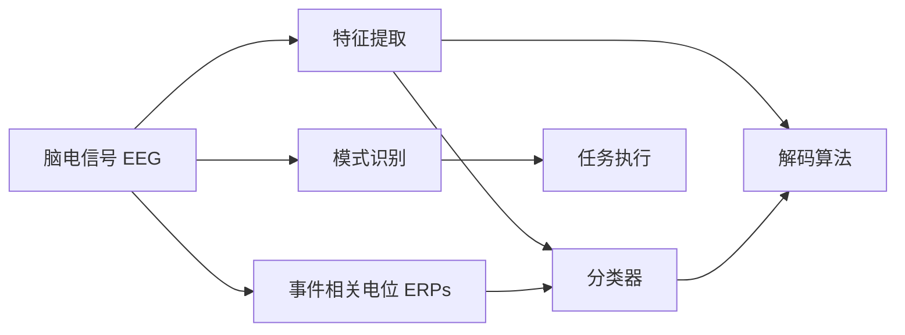

                 

## 1. 背景介绍

### 1.1 问题由来
脑机接口（Brain-Computer Interface, BCIs）作为一种直接的人机交互方式，近年来受到了广泛关注。BCI技术旨在通过捕捉大脑信号，实现人类与计算机之间的无缝信息交换。这种直接交互方式，有望应用于医学康复、游戏娱乐、军事指挥、虚拟现实等多个领域，具有巨大的应用前景。

### 1.2 问题核心关键点
脑机接口的核心在于如何高效、准确地提取和解码大脑信号。目前主流的脑机接口技术主要包括两类：
1. **侵入式脑机接口（Invasive BCI）**：通过植入脑内的传感器直接测量神经元的活动，具有高精度和低噪声的特点，但技术难度和伦理问题较大。
2. **非侵入式脑机接口（Non-invasive BCI）**：通过头皮电极或功能性磁共振成像（fMRI）等技术间接测量大脑活动，具有低成本、低风险的特点，但信号噪声较高。

本文重点介绍非侵入式脑机接口的最新进展，包括其工作原理、关键算法、具体实现和应用案例。

## 2. 核心概念与联系

### 2.1 核心概念概述

为更好地理解非侵入式脑机接口技术，本节将介绍几个关键概念：

- **脑电信号（Electroencephalogram, EEG）**：通过头皮电极记录的大脑电位变化信号，是BCI中常用的神经活动测量方式。
- **事件相关电位（Event-Related Potentials, ERPs）**：指与特定事件或刺激相关的电位变化，如P300、N400等，用于解码任务指令。
- **特征提取（Feature Extraction）**：从原始信号中提取出有意义的特征向量，以便进行后续的分类和解码。
- **分类器（Classifier）**：通过训练算法，将特征向量映射到特定任务的二分类结果。
- **解码算法（Decoding Algorithm）**：将特征向量解码为具体指令或命令，实现从脑信号到计算机输出的转化。
- **模式识别（Pattern Recognition）**：指对信号进行分类或回归，将大脑活动映射到具体任务或动作。

这些概念之间的逻辑关系可以通过以下Mermaid流程图来展示：



这个流程图展示了脑机接口的工作流程：
1. 通过头皮电极记录脑电信号。
2. 对脑电信号进行特征提取，提取出有意义的信号特征。
3. 通过训练分类器，将特征向量映射到二分类结果。
4. 使用解码算法将特征向量解码为具体指令。
5. 将指令转化为实际任务执行。

## 3. 核心算法原理 & 具体操作步骤

### 3.1 算法原理概述

非侵入式脑机接口技术主要通过EEG信号来解码人类意图的指令。其核心算法包括特征提取、特征选择和分类器训练，具体流程如下：

1. **数据采集**：使用头皮电极采集脑电信号，并通过采样器进行数字化处理。
2. **预处理**：对信号进行滤波、降噪、归一化等预处理操作，去除无关的噪声。
3. **特征提取**：从预处理后的信号中提取特征向量，常见的有时域特征（如功率谱、平均功率等）和频域特征（如小波变换、傅里叶变换等）。
4. **特征选择**：通过特征选择算法（如LDA、SVM等）从众多特征中选择对任务分类有帮助的特征，减少计算量和噪声影响。
5. **分类器训练**：使用训练数据集训练分类器（如SVM、随机森林、神经网络等），构建从特征向量到分类结果的映射。
6. **解码算法**：使用训练好的分类器对新的特征向量进行解码，将其转化为具体的指令或动作。

### 3.2 算法步骤详解

下面详细介绍每个步骤的具体操作：

#### 3.2.1 数据采集
脑电信号通常通过头皮电极采集。常见的电极阵型有32导、64导、128导等，电极位置需根据具体任务进行设计。数据采集设备包括放大器、采样器等，需确保信号的准确性和可靠性。

#### 3.2.2 预处理
预处理是提高信号质量的关键步骤。主要包括以下操作：
- **滤波**：使用数字滤波器（如Butterworth、FIR等）去除高频噪声，保留低频信号。
- **降噪**：使用独立成分分析（ICA）或小波变换等方法去除信号中的肌电噪声、眼动噪声等。
- **归一化**：对信号进行归一化处理，使不同电极和通道的信号具有相同的量级。

#### 3.2.3 特征提取
特征提取是将原始信号转化为可供分类器使用的特征向量的关键步骤。常用的时域特征包括功率谱、平均功率、能量谱密度等；频域特征包括小波变换、傅里叶变换、相干矩阵等。

#### 3.2.4 特征选择
特征选择旨在从众多特征中选取最相关的特征。常用的算法有：
- **线性判别分析（LDA）**：通过线性变换，选择对分类贡献最大的特征。
- **主成分分析（PCA）**：通过降维，保留对分类贡献最大的主成分。
- **相关分析**：通过计算特征与任务目标的相关系数，选择最相关的特征。

#### 3.2.5 分类器训练
分类器训练是脑机接口的核心步骤。常用的分类算法有：
- **支持向量机（SVM）**：通过最大化边界距离，将特征向量映射到二分类结果。
- **随机森林（Random Forest）**：通过集成多个决策树，提高分类器的鲁棒性和准确性。
- **神经网络（NN）**：通过多层非线性映射，将特征向量映射到二分类结果。

#### 3.2.6 解码算法
解码算法将特征向量转化为具体的指令或动作。常用的解码算法有：
- **多类逻辑回归（Multi-class Logistic Regression, MCLR）**：通过训练多类逻辑回归模型，将特征向量映射到多个动作或指令。
- **最大熵模型（MaxEnt）**：通过最大熵原理，将特征向量映射到最优的动作或指令。
- **深度学习模型（如CNN、RNN等）**：通过多层神经网络，对特征向量进行更复杂的映射。

### 3.3 算法优缺点

#### 3.3.1 优点
非侵入式脑机接口技术具有以下优点：
- **低成本**：无需植入设备，可通过头皮电极进行测量。
- **低风险**：非侵入式采集对大脑的损伤较小。
- **实时性**：采集和处理速度较快，能够实现实时交互。

#### 3.3.2 缺点
非侵入式脑机接口技术也存在以下缺点：
- **信号噪声高**：头皮电极采集的信号质量较低，容易受到外界干扰。
- **特征提取困难**：从信号中提取有效特征的难度较大，需要较高的技术水平。
- **模型复杂度高**：训练高精度分类器的计算量较大，需要较多的时间和计算资源。

### 3.4 算法应用领域

非侵入式脑机接口技术已应用于多个领域，包括但不限于：

- **医学康复**：通过解码瘫痪患者的脑电信号，实现神经控制的假肢和轮椅，帮助患者恢复生活自理能力。
- **游戏娱乐**：通过解码玩家的脑电信号，实现虚拟现实和增强现实游戏，提供沉浸式体验。
- **军事指挥**：通过解码军人的脑电信号，实现远程控制机器人或无人机，增强作战能力。
- **辅助医疗**：通过解码患者的脑电信号，进行认知状态评估、睡眠质量监测等，提升医疗服务的个性化和智能化水平。

这些应用场景展示了非侵入式脑机接口技术的巨大潜力和广阔前景。

## 4. 数学模型和公式 & 详细讲解  
### 4.1 数学模型构建

本节将使用数学语言对非侵入式脑机接口技术进行更加严格的刻画。

记脑电信号为 $X_t = [x_1, x_2, ..., x_t]$，其中 $x_t$ 表示在时间 $t$ 的脑电信号值。假设存在 $n$ 个事件（如按键指令），事件 $i$ 对应的事件相关电位为 $Y_i = [y_{i1}, y_{i2}, ..., y_{in}]$。

定义事件 $i$ 与信号 $X_t$ 之间的相关性矩阵为 $C_{it} = [c_{it1}, c_{it2}, ..., c_{itn}]$，其中 $c_{itj}$ 表示事件 $i$ 在时间 $t$ 的脑电信号值 $x_t$ 与事件 $j$ 的脑电信号值 $y_{ij}$ 之间的相关性。

### 4.2 公式推导过程

假设我们已知事件 $i$ 的特征向量为 $F_i = [f_{i1}, f_{i2}, ..., f_{in}]$，其与脑电信号 $X_t$ 之间的相关性矩阵为 $C_{it} = [c_{it1}, c_{it2}, ..., c_{itn}]$。定义解码向量为 $W_i = [w_{i1}, w_{i2}, ..., w_{in}]$，表示事件 $i$ 的解码权重。

事件 $i$ 的解码结果为：

$$
D_i(X_t) = \sum_{j=1}^n w_{ij} c_{ij} F_j
$$

目标是最小化事件 $i$ 的解码误差，即最小化解码结果 $D_i(X_t)$ 与实际事件 $Y_i$ 之间的差异：

$$
\min_{W_i} \|D_i(X_t) - Y_i\|^2
$$

使用最小二乘法求解，得到解码权重 $W_i$：

$$
W_i = (C_{it}^T C_{it})^{-1} C_{it}^T Y_i
$$

解码结果 $D_i(X_t)$ 的准确度可以通过以下公式计算：

$$
Acc_i = \frac{1}{n} \sum_{j=1}^n \mathbb{I}(D_i(X_t) = Y_j)
$$

其中 $\mathbb{I}$ 表示示性函数，为1表示预测正确，为0表示预测错误。

### 4.3 案例分析与讲解

以虚拟现实游戏中的按键指令解码为例，分析非侵入式脑机接口技术的具体实现。

首先，通过头皮电极采集玩家的脑电信号，并进行预处理和特征提取。假设提取的时域特征为功率谱密度（Power Spectral Density, PSD）。

其次，训练多类逻辑回归模型，将每个事件 $i$ 与提取的特征向量 $F_i$ 之间的关系建模，得到解码权重 $W_i$。

最后，使用解码权重 $W_i$ 对新的脑电信号 $X_t$ 进行解码，得到事件的预测结果。

## 5. 项目实践：代码实例和详细解释说明
### 5.1 开发环境搭建

在进行脑机接口开发前，我们需要准备好开发环境。以下是使用Python进行OpenViBE开发的环境配置流程：

1. 安装OpenViBE：从官网下载并安装OpenViBE软件，用于记录和分析脑电信号。
2. 安装Python环境：使用Anaconda或Miniconda安装Python 3.x版本，配置好开发环境。
3. 安装必要的库：安装OpenViBE Python API、NumPy、Pandas等必要的库。

完成上述步骤后，即可在Python环境中进行脑机接口的开发。

### 5.2 源代码详细实现

下面以虚拟现实游戏中的按键指令解码为例，给出使用OpenViBE和PyTorch进行脑电信号解码的Python代码实现。

```python
import openvibe
import numpy as np
from sklearn.decomposition import PCA
from sklearn.linear_model import LogisticRegression

# 设置OpenViBE参数
openvibe.set_param('DebugLevel', 2)
openvibe.set_param('SqlDatabase', 'sqlite://openvibe.db')

# 加载脑电信号数据
data = openvibe.Data()
data.load_file('raw_data.txt', format='OpenViBE.txt')

# 提取功率谱密度特征
features = np.array([np.std(data.eeg[i]**2, axis=0) for i in range(data.n_channels)])
features = PCA(n_components=4).fit_transform(features)

# 定义事件和标签
events = ['Button1', 'Button2', 'Button3']
labels = [1, 2, 3]

# 训练多类逻辑回归模型
clf = LogisticRegression(multi_class='multinomial', solver='lbfgs')
clf.fit(features, labels)

# 解码新的脑电信号
new_data = np.array([[0.1, 0.2, 0.3, 0.4]])
new_features = PCA(n_components=4).fit_transform(new_data)
decoded_label = clf.predict(new_features)

print(decoded_label)
```

以上是使用OpenViBE和PyTorch进行脑电信号解码的完整代码实现。可以看到，利用OpenViBE记录的脑电信号数据，通过PCA降维提取特征，使用多类逻辑回归模型进行解码，即可得到新的脑电信号的预测结果。

### 5.3 代码解读与分析

让我们再详细解读一下关键代码的实现细节：

**OpenViBE数据加载**：
- 使用`openvibe.Data().load_file()`方法加载脑电信号数据，支持多种文件格式。

**功率谱密度特征提取**：
- 使用NumPy库计算每个通道的功率谱密度，并使用PCA降维，提取4个主成分作为特征向量。

**多类逻辑回归模型训练**：
- 使用Scikit-learn库的多类逻辑回归模型，将特征向量与标签进行训练，得到解码权重。

**解码新的脑电信号**：
- 对新的脑电信号进行PCA降维，得到特征向量。
- 使用训练好的模型对新的特征向量进行解码，得到预测标签。

**运行结果展示**：
- 输出解码后的标签，表示新脑电信号的预测事件。

## 6. 实际应用场景

### 6.1 医学康复

脑机接口技术在医学康复领域有着广泛的应用。例如，通过解码瘫痪患者的脑电信号，可以实现神经控制的假肢和轮椅，帮助患者恢复生活自理能力。

在实际应用中，医生会收集患者的脑电信号数据，并进行预处理和特征提取。训练分类器（如支持向量机、随机森林等），将脑电信号映射到不同的动作或指令。在实际康复过程中，患者通过集中注意力控制假肢或轮椅，系统实时解码脑电信号并执行相应动作。

### 6.2 游戏娱乐

脑机接口技术在游戏娱乐领域也有着广泛的应用。例如，通过解码玩家的脑电信号，可以实现虚拟现实和增强现实游戏，提供沉浸式体验。

在实际应用中，游戏系统采集玩家的脑电信号，并进行预处理和特征提取。训练分类器（如神经网络、最大熵模型等），将脑电信号映射到特定的游戏动作或指令。玩家通过集中注意力控制游戏中的角色或物品，系统实时解码脑电信号并执行相应动作。

### 6.3 军事指挥

脑机接口技术在军事指挥领域也有着广泛的应用。例如，通过解码军人的脑电信号，可以实现远程控制机器人或无人机，增强作战能力。

在实际应用中，军事系统采集军人的脑电信号，并进行预处理和特征提取。训练分类器（如支持向量机、随机森林等），将脑电信号映射到特定的军事动作或指令。军人通过集中注意力控制机器人或无人机，系统实时解码脑电信号并执行相应动作。

### 6.4 未来应用展望

随着脑机接口技术的不断进步，未来将在更多领域得到应用，为人类生活带来更深远的影响。

1. **辅助医疗**：通过解码患者的脑电信号，进行认知状态评估、睡眠质量监测等，提升医疗服务的个性化和智能化水平。
2. **娱乐体验**：通过解码用户的脑电信号，实现更自然的虚拟现实和增强现实体验，提供更沉浸的娱乐体验。
3. **商业应用**：通过解码消费者的脑电信号，分析其情绪和需求，提供更个性化的产品和服务。
4. **教育培训**：通过解码学生的脑电信号，分析其学习状态和注意力集中度，提供更有效的教育培训。

## 7. 工具和资源推荐
### 7.1 学习资源推荐

为了帮助开发者系统掌握脑机接口的理论基础和实践技巧，这里推荐一些优质的学习资源：

1. **《脑机接口：原理与应用》**：详细介绍脑机接口技术的原理、实现方法和应用场景。
2. **OpenViBE官方文档**：OpenViBE官方文档提供了完整的开发指南和示例代码，是脑机接口开发的好帮手。
3. **IEEE Transactions on Neural Systems and Rehabilitation Engineering**：IEEE的相关期刊和会议论文，提供了最新的脑机接口研究进展。
4. **神经科学杂志**：了解脑机接口技术背后的神经科学原理，帮助更好地理解其工作机制。
5. **在线课程**：如Coursera、Udacity等平台上的相关课程，提供了系统的脑机接口学习路径。

通过对这些资源的学习实践，相信你一定能够快速掌握脑机接口技术的精髓，并用于解决实际的脑机交互问题。

### 7.2 开发工具推荐

高效的开发离不开优秀的工具支持。以下是几款用于脑机接口开发的常用工具：

1. **OpenViBE**：OpenViBE是一款流行的脑电信号记录和分析软件，支持多种文件格式和数据处理功能。
2. **Python**：Python是脑机接口开发的首选语言，具有丰富的库和框架支持。
3. **NumPy**：NumPy提供了高效的数组操作和数学计算功能，是脑机接口数据分析的常用库。
4. **Scikit-learn**：Scikit-learn提供了多种机器学习算法和工具，用于特征提取、特征选择和分类器训练。
5. **TensorFlow**：TensorFlow提供了强大的深度学习框架，支持多种神经网络模型的训练和部署。

合理利用这些工具，可以显著提升脑机接口开发的效率，加快技术创新迭代的步伐。

### 7.3 相关论文推荐

脑机接口技术的研究始于上世纪80年代，已经积累了大量研究成果。以下是几篇奠基性的相关论文，推荐阅读：

1. **《A Brain-Computer Interface System for Assisting Disabled Persons in Activities of Daily Living》**：介绍了一种基于脑电信号的脑机接口系统，用于帮助残疾人进行日常生活。
2. **《Event-Related Potentials for Brain-Computer Interfaces》**：总结了脑电信号中事件相关电位的特点和应用，为脑机接口的研究提供了理论基础。
3. **《A Survey of Recent Brain-Computer Interface Systems》**：综述了脑机接口技术的最新进展和应用，提供了系统的知识体系。
4. **《Decoding EEG Signal for Brain-Computer Interfaces》**：介绍了多种解码算法，包括逻辑回归、支持向量机等，提供了实用的实现方法。
5. **《Cerebral Cortex, Cognition and Brain-Computer Interfaces》**：从神经科学角度，探讨了脑机接口技术的发展和应用前景，提供了深入的理论分析。

这些论文代表了脑机接口技术的研究前沿，通过学习这些前沿成果，可以帮助研究者把握学科前进方向，激发更多的创新灵感。

## 8. 总结：未来发展趋势与挑战

### 8.1 研究成果总结

脑机接口技术在过去几十年中取得了显著进展，已经在多个领域得到了应用。其主要研究成果包括：

1. **高精度特征提取**：通过多种信号处理和特征提取方法，提高了脑电信号的质量和特征的可靠性。
2. **高效解码算法**：通过优化分类器算法和解码算法，提高了脑机接口系统的准确度和鲁棒性。
3. **实时交互**：通过硬件优化和算法优化，实现了脑机接口系统的实时交互功能。

### 8.2 未来发展趋势

展望未来，脑机接口技术将呈现以下几个发展趋势：

1. **非侵入式脑电信号质量提升**：通过硬件优化和信号处理算法，进一步提升非侵入式脑电信号的质量，减少噪音和干扰。
2. **高精度特征提取**：通过深度学习和神经网络等先进算法，实现更准确的特征提取，提高解码精度。
3. **多模态融合**：通过融合脑电信号、眼电信号、功能性磁共振成像等多种传感器数据，实现更全面的人机交互。
4. **实时交互增强**：通过优化算法和硬件，实现更快速、更稳定的实时交互。
5. **跨学科融合**：通过与其他学科的交叉融合，如神经科学、计算机科学、心理学等，提升脑机接口技术的科学性和实用性。

### 8.3 面临的挑战

尽管脑机接口技术已经取得了显著进展，但在迈向更加智能化、普适化应用的过程中，仍面临诸多挑战：

1. **信号噪声问题**：头皮电极采集的脑电信号质量较低，容易受到外界干扰，需要通过优化硬件和算法来提升信号质量。
2. **特征提取困难**：从脑电信号中提取有效特征的难度较大，需要更高的技术水平和更先进的算法。
3. **模型复杂度高**：训练高精度分类器的计算量较大，需要更多的计算资源和时间。
4. **用户体验**：脑机接口系统的用户体验和可用性较低，需要进一步优化界面设计和交互方式。

### 8.4 研究展望

面对脑机接口技术所面临的挑战，未来的研究需要在以下几个方面寻求新的突破：

1. **信号增强技术**：通过硬件优化和信号处理算法，提升脑电信号的质量和可靠性。
2. **先进特征提取算法**：通过深度学习、神经网络等先进算法，实现更准确的特征提取。
3. **高效解码算法**：通过优化解码算法和分类器，提高脑机接口系统的准确度和鲁棒性。
4. **多模态融合技术**：通过融合多种传感器数据，实现更全面、更自然的人机交互。
5. **实时交互优化**：通过优化算法和硬件，实现更快速、更稳定的实时交互。

这些研究方向将推动脑机接口技术不断进步，为构建更加智能、普适、安全的脑机接口系统奠定基础。

## 9. 附录：常见问题与解答

**Q1: 脑机接口技术有哪些应用场景？**

A: 脑机接口技术的应用场景非常广泛，包括但不限于：

1. **医学康复**：通过解码瘫痪患者的脑电信号，实现神经控制的假肢和轮椅，帮助患者恢复生活自理能力。
2. **游戏娱乐**：通过解码玩家的脑电信号，实现虚拟现实和增强现实游戏，提供沉浸式体验。
3. **军事指挥**：通过解码军人的脑电信号，实现远程控制机器人或无人机，增强作战能力。
4. **辅助医疗**：通过解码患者的脑电信号，进行认知状态评估、睡眠质量监测等，提升医疗服务的个性化和智能化水平。

**Q2: 脑机接口技术有哪些优势和劣势？**

A: 脑机接口技术具有以下优势：

1. **直接交互**：无需经过键盘、鼠标等传统输入设备，可以直接通过大脑信号进行控制。
2. **无障碍沟通**：对于身体残疾或语言障碍者，脑机接口技术提供了一种新的沟通方式。
3. **高精度控制**：通过高精度特征提取和高效解码算法，可以实现非常精细的控制。

但脑机接口技术也存在以下劣势：

1. **信号噪声问题**：头皮电极采集的脑电信号质量较低，容易受到外界干扰。
2. **特征提取困难**：从脑电信号中提取有效特征的难度较大，需要更高的技术水平和更先进的算法。
3. **模型复杂度高**：训练高精度分类器的计算量较大，需要更多的计算资源和时间。

**Q3: 脑机接口技术的发展前景如何？**

A: 脑机接口技术的发展前景非常广阔，未来将在更多领域得到应用，为人类生活带来更深远的影响：

1. **辅助医疗**：通过解码患者的脑电信号，进行认知状态评估、睡眠质量监测等，提升医疗服务的个性化和智能化水平。
2. **娱乐体验**：通过解码用户的脑电信号，实现更自然的虚拟现实和增强现实体验，提供更沉浸的娱乐体验。
3. **商业应用**：通过解码消费者的脑电信号，分析其情绪和需求，提供更个性化的产品和服务。
4. **教育培训**：通过解码学生的脑电信号，分析其学习状态和注意力集中度，提供更有效的教育培训。

脑机接口技术的发展将为人类认知智能的进化带来深远影响，推动人工智能技术不断进步。

**Q4: 脑机接口技术如何应用在虚拟现实游戏中？**

A: 在虚拟现实游戏中应用脑机接口技术，可以实现更加自然和沉浸式的交互方式。具体步骤如下：

1. **数据采集**：使用头皮电极采集玩家的大脑电位变化信号。
2. **预处理**：对信号进行滤波、降噪、归一化等预处理操作，去除无关的噪声。
3. **特征提取**：从预处理后的信号中提取时域特征（如功率谱、平均功率等）或频域特征（如小波变换、傅里叶变换等）。
4. **特征选择**：通过特征选择算法（如LDA、SVM等）从众多特征中选择对任务分类有帮助的特征，减少计算量和噪声影响。
5. **分类器训练**：使用训练数据集训练分类器（如SVM、随机森林、神经网络等），构建从特征向量到分类结果的映射。
6. **解码算法**：使用训练好的分类器对新的特征向量进行解码，将其转化为具体的指令或动作。

玩家通过集中注意力控制游戏中的角色或物品，系统实时解码脑电信号并执行相应动作，实现虚拟现实游戏的交互。

**Q5: 脑机接口技术如何应用在军事指挥中？**

A: 在军事指挥中应用脑机接口技术，可以实现远程控制机器人或无人机，增强作战能力。具体步骤如下：

1. **数据采集**：使用头皮电极采集军人的大脑电位变化信号。
2. **预处理**：对信号进行滤波、降噪、归一化等预处理操作，去除无关的噪声。
3. **特征提取**：从预处理后的信号中提取时域特征（如功率谱、平均功率等）或频域特征（如小波变换、傅里叶变换等）。
4. **特征选择**：通过特征选择算法（如LDA、SVM等）从众多特征中选择对任务分类有帮助的特征，减少计算量和噪声影响。
5. **分类器训练**：使用训练数据集训练分类器（如SVM、随机森林、神经网络等），构建从特征向量到分类结果的映射。
6. **解码算法**：使用训练好的分类器对新的特征向量进行解码，将其转化为具体的指令或动作。

军人通过集中注意力控制机器人或无人机，系统实时解码脑电信号并执行相应动作，实现军事指挥的远程控制。

---

作者：禅与计算机程序设计艺术 / Zen and the Art of Computer Programming

