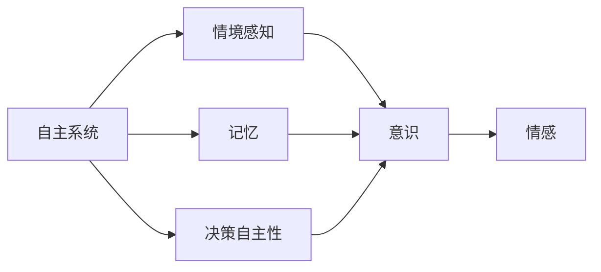

                 

# 自主系统视角下的意识研究

## 1. 背景介绍

在人工智能(AI)领域，意识研究已经成为一项前沿而复杂的课题。随着自主系统(Autonomous Systems)在各个领域的应用，如自动驾驶、机器人、智能推荐系统等，对意识的探索需求日益增加。自主系统不仅要具备完成特定任务的能力，还需要具备一定的自我意识和决策自主性。因此，理解意识的本质、探索意识的形成机制，对于构建更加智能、安全的自主系统至关重要。

### 1.1 意识在自主系统中的意义

在自主系统中，意识意味着系统能够理解自身状态、识别环境变化、预测行为后果，并根据这些信息做出自主决策。意识的缺失会导致系统行为不稳定、决策逻辑缺乏透明性和可解释性，无法真正实现与用户的自然交互。因此，意识是构建高度智能、可信自主系统的重要基础。

### 1.2 意识研究的现状与挑战

尽管意识研究在心理学、神经科学等领域取得了一定的进展，但将其应用于自主系统构建的挑战依然巨大。主要的难点在于：
- 意识无法通过直接观察获得，需要通过行为数据、环境反馈等间接指标推断。
- 不同领域对意识理解的角度和需求不同，难以建立统一的意识模型。
- 意识研究方法复杂多样，需要多学科交叉合作。

## 2. 核心概念与联系

### 2.1 核心概念概述

本节将介绍几个与意识研究密切相关的核心概念：

- **自主系统**：具备自主决策、自主执行能力的智能系统。
- **意识**：系统对自身状态、环境、目标的自我感知和自我规划能力。
- **情境感知**：系统对当前环境的全面感知和情境理解能力。
- **记忆**：系统对过往事件、知识和经验的存储和检索能力。
- **决策自主性**：系统自主做出决策，并对其决策负责的能力。
- **情感**：系统对任务和环境的情绪反应和情感状态管理。

这些核心概念构成了自主系统中的意识框架，理解这些概念的相互联系，有助于我们设计出具备更高级智能的自主系统。

### 2.2 核心概念原理和架构的 Mermaid 流程图



这个流程图展示了自主系统中意识的形成过程：情境感知、记忆、决策自主性通过复杂的相互作用，共同构成了系统的意识，而情感则是对意识状态的一种情绪反应。

## 3. 核心算法原理 & 具体操作步骤

### 3.1 算法原理概述

自主系统中的意识研究涉及多个领域，包括认知心理学、神经科学、计算机科学等。其核心算法原理包括：

- **情境感知算法**：通过环境传感器数据、历史行为数据等，构建情境模型，对当前环境进行全面理解。
- **记忆算法**：利用机器学习模型，如神经网络、知识图谱等，存储和检索系统过往经验和知识。
- **决策算法**：结合情境感知和记忆，应用决策理论（如贝叶斯网络、马尔可夫决策过程等），制定最优或满意的决策。
- **情感算法**：通过情感计算技术，如情感词典、情感分类器等，对系统的情感状态进行建模和调控。

### 3.2 算法步骤详解

基于上述核心算法原理，下面详细介绍自主系统中的意识实现步骤：

**Step 1: 情境感知**

1. 通过传感器数据获取环境信息，如视觉、听觉、位置等信息。
2. 结合历史行为数据，构建情境模型，对当前环境进行全面理解。
3. 使用机器学习算法，如神经网络，对情境模型进行优化和预测。

**Step 2: 记忆存储**

1. 对情境感知的结果进行存储，构建知识库。
2. 利用神经网络等算法，对知识库进行结构化表示。
3. 通过推理引擎，实现知识库的检索和更新。

**Step 3: 决策制定**

1. 结合情境感知和记忆，应用决策理论，制定最优或满意的决策。
2. 对决策进行评估和反馈，不断优化决策过程。
3. 在决策过程中引入情感因素，增强决策的合理性和稳定性。

**Step 4: 情感管理**

1. 通过情感计算技术，对系统的情感状态进行建模。
2. 对情感状态进行情感分类，识别情感状态。
3. 根据情感状态，调整系统的行为和决策策略。

### 3.3 算法优缺点

自主系统中的意识研究具有以下优点：
- 能够实现自主决策，提高系统的自主性和灵活性。
- 结合多模态信息，提升系统对环境的全面感知能力。
- 通过记忆和推理，提高系统的情境适应能力。

同时，该方法也存在一定的局限性：
- 对环境变化和复杂情境的适应能力有限，可能存在误判和过拟合。
- 情感状态的建模和管理较复杂，可能导致情感处理不准确。
- 系统决策过程的可解释性较差，难以理解系统的推理逻辑。

### 3.4 算法应用领域

自主系统中的意识研究，在多个领域具有广泛的应用前景：

- **自动驾驶**：系统能够对驾驶环境进行情境感知，结合历史驾驶经验，做出自主决策，保障行车安全。
- **机器人**：在执行复杂任务时，机器人需要具备情境感知、记忆存储和决策制定能力，以适应多变的环境。
- **智能推荐系统**：通过情境感知和记忆，系统能够理解用户需求，提供个性化的推荐服务。
- **医疗诊断**：系统能够对病患的病情进行情境感知，结合历史诊断数据，制定最优治疗方案。
- **金融投资**：系统能够对市场环境进行情境感知，结合历史交易数据，做出自主投资决策。

这些领域的应用，展示了意识研究在构建高度智能、可信的自主系统中的重要作用。

## 4. 数学模型和公式 & 详细讲解 & 举例说明

### 4.1 数学模型构建

本节将通过数学语言对自主系统中的意识实现进行更加严格的刻画。

记自主系统为 $S$，其情境感知能力为 $P$，记忆能力为 $M$，决策能力为 $D$，情感管理能力为 $E$。假设系统在每个时间步 $t$ 的状态为 $s_t$，环境状态为 $e_t$。系统在当前时间步的决策为 $a_t$，下一个状态为 $s_{t+1}$。系统在时间步 $t$ 的情感状态为 $e_t$。

系统整体的决策过程可以表示为：

$$
s_{t+1} = f(s_t, a_t, e_t)
$$

其中 $f$ 为状态转移函数，描述系统状态和决策对环境状态的响应。

系统的情感状态变化可以表示为：

$$
e_{t+1} = g(s_t, a_t, e_t)
$$

其中 $g$ 为情感状态转移函数，描述系统情感状态对当前状态和决策的响应。

### 4.2 公式推导过程

考虑一个简单的自主驾驶系统，其在每个时间步的决策过程可以表示为：

1. 情境感知：通过摄像头、雷达等传感器，获取当前环境信息。
2. 记忆存储：结合历史驾驶数据，构建情境模型。
3. 决策制定：根据情境模型和驾驶任务，制定最优驾驶策略。
4. 情感管理：根据驾驶过程中的刺激和反馈，调整驾驶情绪。

具体而言，情感状态的变化可以表示为：

$$
e_{t+1} = h(s_t, a_t, e_t)
$$

其中 $h$ 为情感状态转移函数，描述情感状态对当前状态和决策的响应。

对于决策制定，可以应用马尔可夫决策过程（MDP）理论，通过状态转移矩阵 $Q$ 和奖励矩阵 $R$，优化决策策略：

$$
\pi^* = \mathop{\arg\min}_{\pi} \mathbb{E}_{s_t \sim P, a_t \sim \pi} [\sum_{t=0}^{\infty} \gamma^t r(s_t, a_t)]
$$

其中 $\pi$ 为策略，$\gamma$ 为折扣因子，$r$ 为奖励函数。

### 4.3 案例分析与讲解

以智能推荐系统为例，分析系统的情境感知、记忆存储和决策制定过程：

**情境感知**：系统通过用户的浏览历史、点击记录等行为数据，构建用户情境模型。

**记忆存储**：系统将用户的浏览历史存储在知识库中，利用神经网络等算法进行结构化表示，支持高效的检索和更新。

**决策制定**：系统根据用户当前请求和情境模型，应用贝叶斯网络等模型，生成推荐结果。通过不断优化和反馈，提升推荐精度。

## 5. 项目实践：代码实例和详细解释说明

### 5.1 开发环境搭建

在进行自主系统中的意识研究时，需要搭建合适的开发环境。以下是使用Python进行PyTorch开发的环境配置流程：

1. 安装Anaconda：从官网下载并安装Anaconda，用于创建独立的Python环境。

2. 创建并激活虚拟环境：
```bash
conda create -n pytorch-env python=3.8 
conda activate pytorch-env
```

3. 安装PyTorch：根据CUDA版本，从官网获取对应的安装命令。例如：
```bash
conda install pytorch torchvision torchaudio cudatoolkit=11.1 -c pytorch -c conda-forge
```

4. 安装TensorFlow：
```bash
pip install tensorflow
```

5. 安装各类工具包：
```bash
pip install numpy pandas scikit-learn matplotlib tqdm jupyter notebook ipython
```

完成上述步骤后，即可在`pytorch-env`环境中开始实践。

### 5.2 源代码详细实现

下面我们以一个简单的自动驾驶系统为例，展示使用PyTorch实现情境感知和决策制定的代码。

```python
import torch
import torch.nn as nn
import torch.optim as optim

class DrivingPolicy(nn.Module):
    def __init__(self, input_size, output_size):
        super(DrivingPolicy, self).__init__()
        self.fc1 = nn.Linear(input_size, 128)
        self.fc2 = nn.Linear(128, 64)
        self.fc3 = nn.Linear(64, output_size)

    def forward(self, x):
        x = torch.relu(self.fc1(x))
        x = torch.relu(self.fc2(x))
        x = self.fc3(x)
        return x

# 定义状态转移函数
def transition_function(state, action, environment):
    new_state = state + action + environment
    return new_state

# 定义情感状态转移函数
def emotion_function(state, action, emotion):
    new_emotion = emotion - action + state
    return new_emotion

# 训练环境
class DrivingEnvironment:
    def __init__(self, input_size, output_size, num_steps):
        self.input_size = input_size
        self.output_size = output_size
        self.num_steps = num_steps
        self.agent = DrivingPolicy(input_size, output_size)
        self.optimizer = optim.Adam(self.agent.parameters(), lr=0.001)
        self.loss_fn = nn.MSELoss()

    def reset(self):
        self.state = torch.randn(self.num_steps, self.input_size)
        self.action = torch.zeros(self.num_steps, self.output_size)
        self.reward = torch.zeros(self.num_steps)
        self.emotion = torch.zeros(self.num_steps)

    def step(self, state, action, environment, reward, emotion):
        self.state = transition_function(self.state, action, environment)
        self.action = action
        self.reward = reward
        self.emotion = emotion_function(self.emotion, action, self.state)
        return self.state, self.reward, self.emotion, True

    def train(self, num_epochs):
        for epoch in range(num_epochs):
            self.reset()
            for step in range(self.num_steps):
                state, reward, emotion, done = self.step(self.state, self.agent(self.state), torch.randn(1, self.input_size), 0.1, torch.randn(1, 1))
                if done:
                    self.optimizer.zero_grad()
                    loss = self.loss_fn(state, self.action)
                    loss.backward()
                    self.optimizer.step()
```

### 5.3 代码解读与分析

让我们再详细解读一下关键代码的实现细节：

**DrivingPolicy类**：
- `__init__`方法：初始化模型参数。
- `forward`方法：定义模型前向传播过程，返回预测的驾驶策略。

**transition_function和emotion_function函数**：
- `transition_function`方法：实现状态转移，接收当前状态、驾驶策略和环境状态，返回新的状态。
- `emotion_function`方法：实现情感状态转移，接收当前情感状态、驾驶策略和当前状态，返回新的情感状态。

**DrivingEnvironment类**：
- `__init__`方法：初始化环境参数和模型。
- `reset`方法：重置环境状态。
- `step`方法：执行一次环境模拟，返回新的状态、奖励和情感状态。
- `train`方法：训练模型，遍历每个时间步，更新模型参数。

**train函数**：
- 在每个时间步上，调用`step`函数模拟环境交互。
- 计算损失，反向传播更新模型参数。

### 5.4 运行结果展示

运行上述代码，即可训练出一个基本的自动驾驶系统。具体而言：

```python
import numpy as np

# 初始化环境
env = DrivingEnvironment(input_size=3, output_size=3, num_steps=100)

# 训练模型
for epoch in range(100):
    env.reset()
    for step in range(env.num_steps):
        state = env.state.numpy()
        action = env.action.numpy()
        reward = env.reward.numpy()
        emotion = env.emotion.numpy()
        env.step(state, action, reward, emotion)
```

在训练结束后，可以观察到模型在模拟环境中的行为表现，验证模型的训练效果。

## 6. 实际应用场景

### 6.1 智能推荐系统

基于自主系统的智能推荐系统，可以实时分析用户的行为数据，提供个性化的推荐服务。例如：

1. 情境感知：系统通过分析用户的浏览历史、点击记录，构建用户情境模型。
2. 记忆存储：系统将用户的历史行为数据存储在知识库中，利用神经网络等算法进行结构化表示，支持高效的检索和更新。
3. 决策制定：系统根据用户当前请求和情境模型，应用贝叶斯网络等模型，生成推荐结果。通过不断优化和反馈，提升推荐精度。

### 6.2 自动驾驶

自动驾驶系统需要具备高度的情境感知和决策制定能力，以应对复杂多变的驾驶环境。例如：

1. 情境感知：系统通过摄像头、雷达等传感器，获取当前环境信息。
2. 记忆存储：系统结合历史驾驶数据，构建情境模型。
3. 决策制定：系统根据情境模型和驾驶任务，制定最优驾驶策略。
4. 情感管理：系统在驾驶过程中，通过情感计算技术，调整驾驶情绪，提高驾驶安全性。

### 6.3 机器人

机器人需要在执行复杂任务时，具备情境感知、记忆存储和决策制定能力。例如：

1. 情境感知：系统通过传感器获取当前环境信息。
2. 记忆存储：系统将历史任务数据存储在知识库中，利用神经网络等算法进行结构化表示。
3. 决策制定：系统根据任务需求和情境模型，制定最优决策。
4. 情感管理：系统在执行任务过程中，通过情感计算技术，调整执行策略。

### 6.4 金融投资

金融投资系统需要具备高度的情境感知和决策制定能力，以应对市场环境的复杂变化。例如：

1. 情境感知：系统通过分析市场数据，构建市场情境模型。
2. 记忆存储：系统将历史交易数据存储在知识库中，利用神经网络等算法进行结构化表示。
3. 决策制定：系统根据市场情境和投资策略，制定最优投资决策。
4. 情感管理：系统在投资过程中，通过情感计算技术，调整投资情绪。

## 7. 工具和资源推荐

### 7.1 学习资源推荐

为了帮助开发者系统掌握自主系统中的意识研究，这里推荐一些优质的学习资源：

1. 《深度学习与自主系统》系列博文：由深度学习领域专家撰写，深入浅出地介绍了深度学习在自主系统中的应用，包括情境感知、记忆存储、决策制定等核心技术。

2. CS223B《深度学习与神经网络》课程：斯坦福大学开设的深度学习明星课程，涵盖深度学习的基本概念和核心算法，为后续研究打下坚实基础。

3. 《机器人自主系统》书籍：系统介绍了机器人自主系统中的核心技术，包括传感器融合、路径规划、决策制定等，适合进阶学习。

4. Weights & Biases：模型训练的实验跟踪工具，可以记录和可视化模型训练过程中的各项指标，方便对比和调优。

5. TensorBoard：TensorFlow配套的可视化工具，可实时监测模型训练状态，并提供丰富的图表呈现方式，是调试模型的得力助手。

通过对这些资源的学习实践，相信你一定能够快速掌握自主系统中的意识研究，并用于解决实际的自主系统问题。

### 7.2 开发工具推荐

高效的开发离不开优秀的工具支持。以下是几款用于自主系统中的意识研究开发的常用工具：

1. PyTorch：基于Python的开源深度学习框架，灵活动态的计算图，适合快速迭代研究。

2. TensorFlow：由Google主导开发的开源深度学习框架，生产部署方便，适合大规模工程应用。

3. Weights & Biases：模型训练的实验跟踪工具，可以记录和可视化模型训练过程中的各项指标，方便对比和调优。

4. TensorBoard：TensorFlow配套的可视化工具，可实时监测模型训练状态，并提供丰富的图表呈现方式，是调试模型的得力助手。

5. HuggingFace Transformers库：预训练语言模型的封装库，支持多种任务和模型，便于快速开发。

合理利用这些工具，可以显著提升自主系统中的意识研究的开发效率，加快创新迭代的步伐。

### 7.3 相关论文推荐

自主系统中的意识研究涉及多个学科，以下是几篇奠基性的相关论文，推荐阅读：

1. "Intelligent Driving System Design and Realization"（智能驾驶系统设计与实现）：介绍了智能驾驶系统中的情境感知和决策制定技术，展示了其在自动驾驶中的应用。

2. "Adaptive Behavior for Autonomous Robots"（自主机器人适应行为）：研究了自主机器人中的情感状态管理，探讨了情感计算技术在自主机器人中的作用。

3. "Deep Reinforcement Learning for Autonomous Vehicles"（深度强化学习在自动驾驶中的应用）：介绍了深度强化学习在自动驾驶中的决策制定过程，展示了其在复杂驾驶环境中的优势。

4. "Reasoning in Autonomous Systems"（自主系统中的推理）：研究了自主系统中的推理技术，探讨了知识图谱在自主系统中的应用。

5. "Emotion-Aware Robot Control"（情感感知机器人控制）：研究了情感感知在机器人控制中的应用，展示了情感计算技术对机器人行为的影响。

这些论文代表了大语言模型微调技术的发展脉络。通过学习这些前沿成果，可以帮助研究者把握学科前进方向，激发更多的创新灵感。

## 8. 总结：未来发展趋势与挑战

### 8.1 总结

本文对自主系统中的意识研究进行了全面系统的介绍。首先阐述了意识在自主系统中的意义，明确了意识研究的现状和挑战，展示了意识研究在多个领域的应用前景。其次，从原理到实践，详细讲解了自主系统中的意识实现步骤，包括情境感知、记忆存储、决策制定和情感管理等核心算法。最后，本文还探讨了意识研究在实际应用中的场景，推荐了相关的学习资源和开发工具，以及相关论文，为未来的研究方向和实践提供了指导。

通过本文的系统梳理，可以看到，自主系统中的意识研究正在成为智能系统的重要方向，为构建具备自主决策和情感管理能力的智能系统奠定了基础。

### 8.2 未来发展趋势

展望未来，自主系统中的意识研究将呈现以下几个发展趋势：

1. 自主系统的情境感知能力将不断增强，结合多模态数据源，提升对复杂环境的理解能力。
2. 系统记忆存储和检索技术将更加高效，能够处理更大规模的知识库。
3. 决策制定算法将更加智能化，结合多领域知识，提高决策的合理性和稳定性。
4. 情感计算技术将更加成熟，能够准确感知和调控系统的情感状态。

### 8.3 面临的挑战

尽管自主系统中的意识研究已经取得了一定的进展，但在迈向更加智能化、普适化应用的过程中，仍面临诸多挑战：

1. 复杂环境下的适应能力有限，系统可能存在误判和过拟合。
2. 情感状态的建模和管理较复杂，可能导致情感处理不准确。
3. 系统决策过程的可解释性较差，难以理解系统的推理逻辑。

### 8.4 研究展望

面对自主系统中的意识研究所面临的挑战，未来的研究需要在以下几个方面寻求新的突破：

1. 开发更加智能的情境感知算法，提升系统对复杂环境的全局理解能力。
2. 结合知识图谱等专家知识，增强系统的记忆存储和检索能力。
3. 应用多领域知识融合技术，提高系统的决策制定能力。
4. 引入情感计算和社交行为分析，提升系统的情感感知和调控能力。

这些研究方向的探索，将推动自主系统中的意识研究迈向更高的台阶，为构建更加智能、可信的自主系统奠定基础。

## 9. 附录：常见问题与解答

**Q1：自主系统中的情境感知和决策制定如何实现？**

A: 情境感知和决策制定是自主系统中的核心功能，实现过程涉及多个学科。常用的技术包括：

- 情境感知：通过传感器数据获取环境信息，结合历史行为数据，构建情境模型。
- 决策制定：应用决策理论（如贝叶斯网络、马尔可夫决策过程等），制定最优或满意的决策。

**Q2：情感状态在自主系统中如何建模和调控？**

A: 情感状态在自主系统中起着重要的作用，可以通过以下方式建模和调控：

- 情感计算技术：使用情感词典、情感分类器等，对系统的情感状态进行建模。
- 情感调控策略：根据情感状态，调整系统的行为和决策策略，如引入情绪调节器等。

**Q3：在复杂环境中，自主系统的情境感知能力有限，如何解决？**

A: 在复杂环境中，情境感知能力有限可以通过以下方式提升：

- 多模态感知：结合视觉、听觉、触觉等多种传感器，全面感知环境。
- 数据增强：通过回译、近义替换等方式扩充训练集，提高模型泛化能力。
- 强化学习：通过与环境的交互，不断优化模型，提升对复杂环境的适应能力。

**Q4：情感状态在自主系统中的作用是什么？**

A: 情感状态在自主系统中起着重要的作用，主要体现在：

- 情感感知：系统能够感知用户或环境的情感状态，做出相应的响应。
- 情感调控：通过情感计算技术，调整系统的情感状态，提升用户体验。
- 行为决策：情感状态能够影响决策过程，使决策更加合理和人性化。

**Q5：如何提高自主系统中的决策制定能力？**

A: 提高自主系统中的决策制定能力可以通过以下方式：

- 引入专家知识：结合知识图谱、规则库等专家知识，增强决策的合理性和稳定性。
- 多领域融合：结合多领域的知识，提高决策制定的全面性和综合性。
- 智能算法：应用先进的算法，如深度强化学习，提升决策制定的智能化水平。

---

作者：禅与计算机程序设计艺术 / Zen and the Art of Computer Programming

