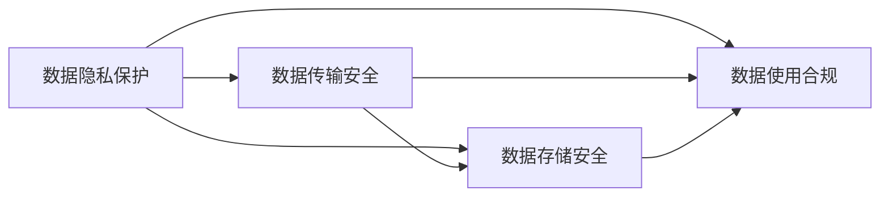

                 

## 1. 背景介绍

### 1.1 问题由来

随着互联网技术的快速发展和商业模式的不断创新，自动化创业成为当前热门趋势，越来越多的创业者通过构建基于云计算、人工智能、大数据等技术的自动化系统，实现商业模式的创新和优化。然而，伴随着自动化系统规模的快速增长，数据安全和合规管理的重要性愈发凸显。如何确保自动化创业中的数据安全和合规，成为摆在新型创业者面前的一大挑战。

### 1.2 问题核心关键点

自动化创业中的数据安全合规管理，涉及到对数据隐私保护、数据合规审查、数据传输安全、数据存储安全、数据使用合规等多个方面。有效的数据安全合规管理，不仅能保护企业的商业机密和客户隐私，避免法律风险，还能增强企业竞争力和客户信任。

### 1.3 问题研究意义

数据安全合规管理在自动化创业中具有重要意义：

1. **风险规避**：保障数据安全，避免数据泄露、丢失、篡改等风险，维护企业声誉和用户信任。
2. **合规经营**：遵循法律法规，避免法律诉讼和经济损失，确保企业长期健康发展。
3. **数据价值提升**：合理利用数据，实现数据驱动的决策和创新，提升企业运营效率和竞争力。
4. **客户忠诚度**：尊重用户隐私，增强用户信任，提高客户满意度和忠诚度。

## 2. 核心概念与联系

### 2.1 核心概念概述

为了更好地理解自动化创业中的数据安全合规管理，我们需要先了解几个关键概念：

- **数据隐私保护**：通过加密、匿名化、访问控制等技术手段，确保数据在传输、存储和使用过程中不被未授权访问和泄露。
- **数据合规审查**：按照法律法规和行业标准，对数据收集、处理、传输和存储的全生命周期进行合规性审查和审计。
- **数据传输安全**：在数据传输过程中，通过加密、认证、访问控制等手段，确保数据在传输过程中的安全性和完整性。
- **数据存储安全**：在数据存储过程中，通过加密、备份、灾难恢复等手段，确保数据的安全性和可恢复性。
- **数据使用合规**：确保数据的使用符合法律法规和业务需求，避免滥用数据造成损失。

### 2.2 核心概念原理和架构的 Mermaid 流程图



这个流程图展示了数据安全合规管理的核心概念及其相互关系：

1. **数据隐私保护**是整个数据安全合规管理的基础，确保数据在传输、存储和使用过程中不被泄露。
2. **数据传输安全**关注数据在传输过程中的安全性，保障数据传输过程中的加密和完整性。
3. **数据存储安全**涉及数据的存储管理和备份策略，确保数据存储的安全性和可恢复性。
4. **数据使用合规**关注数据的合法使用，确保数据的使用符合法律法规和业务需求。

这些概念之间的逻辑关系相互关联，共同构成了数据安全合规管理的整体框架。

## 3. 核心算法原理 & 具体操作步骤

### 3.1 算法原理概述

自动化创业中的数据安全合规管理，主要通过以下算法和步骤实现：

- **加密算法**：对数据进行加密处理，确保数据在传输和存储过程中的安全性。
- **访问控制算法**：对数据进行访问控制，限制未授权用户对数据的访问。
- **匿名化算法**：对数据进行匿名化处理，确保数据在处理和分析过程中的隐私性。
- **合规审查算法**：对数据处理全生命周期进行合规性审查，确保符合法律法规和行业标准。
- **数据传输协议**：采用安全的传输协议，如HTTPS、TLS等，保障数据传输的安全性。
- **数据存储策略**：制定合理的数据存储策略，包括备份、加密、灾难恢复等。
- **合规审计**：定期对数据处理流程进行合规性审计，发现并解决潜在的安全和合规问题。

### 3.2 算法步骤详解

以下详细讲解数据安全合规管理的算法步骤：

#### 3.2.1 数据加密

数据加密是保障数据安全的基础步骤，主要涉及对称加密和非对称加密两种方式：

- **对称加密**：使用同一个密钥进行加密和解密，速度快但密钥管理复杂。常用算法有AES、DES等。
- **非对称加密**：使用公钥加密，私钥解密，安全性高但速度慢。常用算法有RSA、ECC等。

#### 3.2.2 访问控制

访问控制主要通过身份验证和授权管理实现：

- **身份验证**：验证用户身份，常用的方法包括用户名密码、双因素认证、生物识别等。
- **授权管理**：根据用户身份和角色，分配不同级别的访问权限。常用的访问控制模型有基于角色的访问控制（RBAC）、基于属性的访问控制（ABAC）等。

#### 3.2.3 匿名化

匿名化主要通过数据去标识化和假名化处理实现：

- **数据去标识化**：删除或伪装数据中的个人身份信息，如姓名、身份证号等。
- **假名化**：对数据进行假名化处理，使用唯一的ID号代替真实身份信息。

#### 3.2.4 合规审查

合规审查主要通过定期审计和实时监控实现：

- **审计**：定期对数据处理流程进行全面审计，发现并解决潜在的安全和合规问题。
- **实时监控**：通过日志记录和异常检测，实时监控数据处理流程，发现异常行为并及时处理。

#### 3.2.5 数据传输协议

数据传输协议主要通过HTTPS、TLS等安全协议实现：

- **HTTPS**：在HTTP基础上增加了SSL/TLS加密协议，保障数据传输的安全性。
- **TLS**：传输层安全性协议，提供加密和认证功能，保障数据传输的安全性。

#### 3.2.6 数据存储策略

数据存储策略主要通过备份、加密、灾难恢复等手段实现：

- **备份**：定期对重要数据进行备份，确保数据在故障或灾难后的可恢复性。
- **加密**：对存储数据进行加密处理，确保数据在存储过程中的安全性。
- **灾难恢复**：制定灾难恢复计划，确保数据在灾难发生后能够快速恢复。

#### 3.2.7 合规审计

合规审计主要通过审计工具和自动化手段实现：

- **审计工具**：使用专业的审计工具，定期对数据处理流程进行审计。
- **自动化**：通过自动化工具，实时监控数据处理流程，发现并解决潜在的安全和合规问题。

### 3.3 算法优缺点

#### 3.3.1 优点

- **安全性高**：通过加密、匿名化、访问控制等技术手段，保障数据在传输、存储和使用过程中的安全性。
- **合规性强**：按照法律法规和行业标准进行数据处理，避免法律风险和经济损失。
- **操作便捷**：通过自动化工具和策略管理，实现数据安全合规管理的便捷化和高效化。

#### 3.3.2 缺点

- **成本高**：数据加密、访问控制等技术手段需要较高的成本投入。
- **复杂度高**：数据隐私保护和合规审查需要复杂的算法和技术实现，管理和维护难度大。
- **技术依赖**：依赖于高性能加密算法和安全协议，需要不断更新和维护。

### 3.4 算法应用领域

数据安全合规管理在自动化创业中的应用领域包括但不限于：

- **金融科技**：保障客户交易数据的安全性，避免数据泄露和欺诈行为。
- **医疗健康**：保护患者医疗数据的安全性和隐私性，避免数据滥用和泄露。
- **智能制造**：保障生产数据的安全性，避免数据泄露和设备安全风险。
- **在线教育**：保护学生和教师数据的安全性和隐私性，避免数据滥用和泄露。
- **智能物流**：保障运输和配送数据的安全性，避免数据泄露和设备安全风险。

## 4. 数学模型和公式 & 详细讲解 & 举例说明

### 4.1 数学模型构建

#### 4.1.1 数据加密模型

数据加密模型主要涉及对称加密和非对称加密两种形式：

- **对称加密模型**：
  $$
  E_k(m) = c, \quad D_k(c) = m
  $$
  其中 $m$ 为明文，$c$ 为密文，$E_k$ 和 $D_k$ 分别为加密和解密算法，$k$ 为对称密钥。

- **非对称加密模型**：
  $$
  E_{pub}(m) = c, \quad D_{prv}(c) = m
  $$
  其中 $m$ 为明文，$c$ 为密文，$E_{pub}$ 和 $D_{prv}$ 分别为公钥加密和私钥解密算法。

#### 4.1.2 访问控制模型

访问控制模型主要涉及基于角色的访问控制（RBAC）和基于属性的访问控制（ABAC）两种形式：

- **RBAC模型**：
  $$
  P = R \times A
  $$
  其中 $P$ 为权限，$R$ 为角色，$A$ 为权限分配规则。

- **ABAC模型**：
  $$
  P = A \times C
  $$
  其中 $P$ 为权限，$A$ 为属性，$C$ 为访问控制策略。

### 4.2 公式推导过程

#### 4.2.1 对称加密算法推导

以AES加密算法为例，其密钥长度为128位，加密过程可以表示为：
$$
c = E_k(m) = F_{k, r}(m, k, r)
$$
其中 $F_{k, r}$ 为加密函数，$r$ 为轮密钥，$k$ 为密钥。

#### 4.2.2 访问控制模型推导

以RBAC模型为例，假设角色集合为 $R$，权限集合为 $P$，权限分配规则为 $A$，则访问控制过程可以表示为：
$$
A = P \times R
$$

### 4.3 案例分析与讲解

#### 4.3.1 数据加密案例

假设公司需要在云端存储客户数据，可以使用AES算法进行加密处理：

- **密钥管理**：使用KMS（密钥管理服务）进行密钥生成、存储和轮换。
- **数据加密**：在数据传输前，使用AES算法对数据进行加密处理，生成密文。
- **数据解密**：在数据传输后，使用AES算法对密文进行解密处理，还原明文。

#### 4.3.2 访问控制案例

假设公司需要在云端存储员工数据，可以使用RBAC模型进行访问控制：

- **角色划分**：将员工角色分为管理员、普通员工和访客三种。
- **权限分配**：管理员拥有所有权限，普通员工只能访问部分权限，访客无访问权限。
- **访问控制**：在数据请求时，根据角色和权限进行访问控制，只有授权用户才能访问数据。

## 5. 项目实践：代码实例和详细解释说明

### 5.1 开发环境搭建

#### 5.1.1 安装Python和相关库

安装Python和必要的库，如SymPy、pandas、pycryptodome等，可以通过以下命令完成：
```bash
pip install sympy pandas pycryptodome
```

#### 5.1.2 配置数据库

配置MySQL数据库，用于存储访问控制和审计日志。可以使用以下命令安装和配置MySQL：
```bash
sudo apt-get update
sudo apt-get install mysql-server
sudo mysql_secure_installation
```

### 5.2 源代码详细实现

#### 5.2.1 数据加密实现

以下代码实现AES加密算法：
```python
from Crypto.Cipher import AES
import os

def aes_encrypt(data, key):
    # 生成随机向量
    iv = os.urandom(16)
    # 加密数据
    cipher = AES.new(key, AES.MODE_CBC, iv)
    ct = cipher.encrypt(data)
    return ct, iv
```

#### 5.2.2 访问控制实现

以下代码实现RBAC模型：
```python
class RoleBasedAccessControl:
    def __init__(self):
        self.roles = {'admin': {'p': ['read', 'write']}, 'employee': {'p': ['read']}, 'visitor': {'p': []}}
        self.users = {'user1': 'admin', 'user2': 'employee', 'user3': 'visitor'}
        self.actions = {'read': True, 'write': True}
        self.permissions = {}
    
    def grant_permission(self, user, role, permission):
        if role in self.roles:
            self.permissions[user] = self.roles[role]
    
    def check_permission(self, user, action):
        if user in self.permissions:
            if action in self.permissions[user]:
                return True
        return False
```

#### 5.2.3 审计日志实现

以下代码实现审计日志记录和查询：
```python
class AuditLog:
    def __init__(self):
        self.logs = []
    
    def log_event(self, event, user, action):
        self.logs.append({'event': event, 'user': user, 'action': action})
    
    def query_logs(self, user, action):
        return [log for log in self.logs if log['user'] == user and log['action'] == action]
```

### 5.3 代码解读与分析

#### 5.3.1 数据加密实现

- **AES算法**：使用AES算法进行对称加密，保障数据传输过程中的安全性。
- **随机向量**：使用随机向量（IV）进行加密，防止重放攻击。
- **密钥管理**：使用KMS服务进行密钥管理，确保密钥的安全性。

#### 5.3.2 访问控制实现

- **角色划分**：定义管理员、普通员工和访客三种角色，并分配不同权限。
- **权限分配**：根据用户角色进行权限分配，确保数据访问的安全性。
- **访问控制**：在数据请求时，根据用户角色和权限进行访问控制，确保数据的安全性。

#### 5.3.3 审计日志实现

- **日志记录**：记录数据访问和审计事件，用于后续的审计和分析。
- **查询日志**：根据用户和操作类型，查询审计日志，发现潜在的安全和合规问题。

### 5.4 运行结果展示

#### 5.4.1 数据加密示例

- **加密数据**：假设要加密的明文为 "Hello, world!"，密钥为 "0123456789abcdef"。
- **生成密文**：使用AES算法进行加密，生成密文和向量。

#### 5.4.2 访问控制示例

- **角色授权**：将用户user1授权为管理员，拥有读和写权限。
- **访问控制**：在数据请求时，检查用户角色和权限，确保数据的安全性。

#### 5.4.3 审计日志示例

- **记录日志**：记录用户user1进行数据读操作的事件。
- **查询日志**：查询用户user1的数据读操作日志，发现异常行为并进行处理。

## 6. 实际应用场景

### 6.1 智能制造

在智能制造中，数据安全和合规管理至关重要。通过数据加密和访问控制，保障生产数据的安全性，避免数据泄露和设备安全风险。例如，在智能制造的生产线上，传感器收集的生产数据需要实时传输和存储，但这些数据涉及公司的商业机密和设备信息，必须进行加密处理和访问控制。

### 6.2 医疗健康

在医疗健康领域，患者医疗数据的安全性和隐私性至关重要。通过数据加密和匿名化处理，保障患者数据的安全性，避免数据滥用和泄露。例如，在智能医疗系统中，医生需要访问患者的历史诊疗记录，这些记录必须进行加密处理，并根据医生的角色进行访问控制，确保数据的安全性和合规性。

### 6.3 金融科技

在金融科技中，客户交易数据的安全性至关重要。通过数据加密和访问控制，保障客户交易数据的安全性，避免数据泄露和欺诈行为。例如，在金融科技的在线交易系统中，客户账户信息必须进行加密处理，并根据角色的不同进行访问控制，确保数据的安全性和合规性。

### 6.4 未来应用展望

随着技术的发展和应用的普及，自动化创业中的数据安全合规管理将呈现以下几个发展趋势：

- **自动化程度提升**：未来，数据加密和访问控制将更多地采用自动化工具和策略管理，减少人工干预，提高效率。
- **智能化程度提升**：通过人工智能技术，实现数据隐私保护和合规审查的智能化，提高安全性和合规性。
- **跨域协作增强**：随着跨行业、跨领域的合作增多，数据安全和合规管理将需要更多的跨域协作和数据共享机制。
- **合规标准统一**：未来，不同行业和地区的合规标准将逐步统一，实现数据安全和合规管理的标准化和规范化。

## 7. 工具和资源推荐

### 7.1 学习资源推荐

1. **《数据安全与隐私保护》**：是一本系统介绍数据安全和隐私保护技术的经典教材，适合初学者入门。
2. **《数据合规与法律法规》**：是一本详细介绍数据合规和法律法规的权威书籍，适合法律专业人士参考。
3. **《数据隐私保护算法与技术》**：是一本介绍数据隐私保护算法和技术实现的书籍，适合技术爱好者深入学习。
4. **《数据安全与合规审计》**：是一本详细介绍数据安全与合规审计的书籍，适合审计和合规人员参考。

### 7.2 开发工具推荐

1. **Python**：作为数据安全合规管理的主要开发语言，Python具有丰富的库和工具支持，适合数据分析和开发。
2. **SymPy**：用于数学计算和算法实现的Python库，适合进行算法推导和实现。
3. **MySQL**：常用的关系型数据库，适合存储和管理数据访问和审计日志。
4. **pycryptodome**：Python加密库，支持多种加密算法，适合进行数据加密和解密处理。

### 7.3 相关论文推荐

1. **《数据加密算法与安全协议》**：介绍了多种数据加密算法和安全协议，适合深入学习数据加密技术。
2. **《基于角色的访问控制模型》**：介绍了RBAC和ABAC模型，适合学习访问控制技术。
3. **《数据隐私保护与合规审查》**：介绍了数据隐私保护和合规审查的理论和实践，适合学习数据安全和合规管理。

## 8. 总结：未来发展趋势与挑战

### 8.1 研究成果总结

自动化创业中的数据安全合规管理是一个多学科交叉的研究领域，涉及数据加密、访问控制、合规审查等多个方面。通过合理应用这些技术手段，可以有效保障数据的安全性和合规性，避免法律风险和经济损失。

### 8.2 未来发展趋势

未来，数据安全合规管理将呈现以下几个发展趋势：

- **自动化和智能化**：自动化工具和智能化技术将逐步普及，提高数据安全合规管理的效率和效果。
- **跨域协作**：数据安全和合规管理将需要更多的跨域协作和数据共享机制，保障数据安全和合规性。
- **标准化和规范化**：数据安全和合规标准将逐步统一，实现数据安全和合规管理的标准化和规范化。

### 8.3 面临的挑战

尽管数据安全合规管理技术不断发展，但在实施过程中仍面临以下挑战：

- **技术复杂性**：数据安全和合规管理涉及复杂的技术实现，管理和维护难度较大。
- **成本高昂**：数据加密和访问控制等技术手段需要较高的成本投入。
- **合规风险**：不同行业和地区的合规标准存在差异，需要不断调整和更新，确保符合法律法规。

### 8.4 研究展望

未来，数据安全合规管理的研究需要进一步深化和拓展，主要集中在以下几个方面：

- **新技术应用**：探索新的加密算法和访问控制模型，提高数据安全性和合规性。
- **跨域协作机制**：构建跨行业、跨领域的协作机制，实现数据共享和互操作。
- **智能化和自动化**：通过人工智能和自动化技术，提高数据安全合规管理的智能化和自动化水平。

总之，数据安全合规管理是自动化创业中不可或缺的重要环节，需要综合应用多种技术手段，确保数据的安全性和合规性。未来，随着技术的不断进步和应用的深入，数据安全合规管理将变得更加智能、高效和安全，为自动化创业提供坚实的保障。

## 9. 附录：常见问题与解答

**Q1: 数据加密和访问控制有什么区别？**

A: 数据加密主要是对数据本身进行加密处理，确保数据在传输和存储过程中的安全性。而访问控制主要通过对数据的访问进行控制，限制未授权用户的访问。两者是数据安全管理中不可或缺的重要手段。

**Q2: 数据加密和访问控制哪个更重要？**

A: 数据加密和访问控制同等重要，两者相辅相成。数据加密保证了数据在传输和存储过程中的安全性，而访问控制确保了数据在访问过程中的安全性。只有同时采用数据加密和访问控制，才能有效保障数据的安全性。

**Q3: 数据加密和访问控制的实现难度大吗？**

A: 数据加密和访问控制的实现难度较大，需要综合应用多种技术手段，如对称加密、非对称加密、访问控制模型等。但通过合理设计和实现，可以在保证数据安全性的同时，实现较高的效率和灵活性。

**Q4: 数据安全和合规管理对自动化创业有什么影响？**

A: 数据安全和合规管理对自动化创业具有重要影响。只有在保障数据安全性和合规性的基础上，才能有效利用数据进行业务创新和优化，提升企业的竞争力和客户信任度。

**Q5: 自动化创业中数据安全和合规管理的未来发展方向是什么？**

A: 未来，数据安全和合规管理将朝着自动化和智能化方向发展，通过自动化工具和智能化技术，提高数据安全性和合规性。同时，跨域协作和标准化也将逐步普及，实现数据共享和互操作。

总之，数据安全和合规管理是自动化创业中不可或缺的重要环节，需要综合应用多种技术手段，确保数据的安全性和合规性。未来，随着技术的不断进步和应用的深入，数据安全合规管理将变得更加智能、高效和安全，为自动化创业提供坚实的保障。

