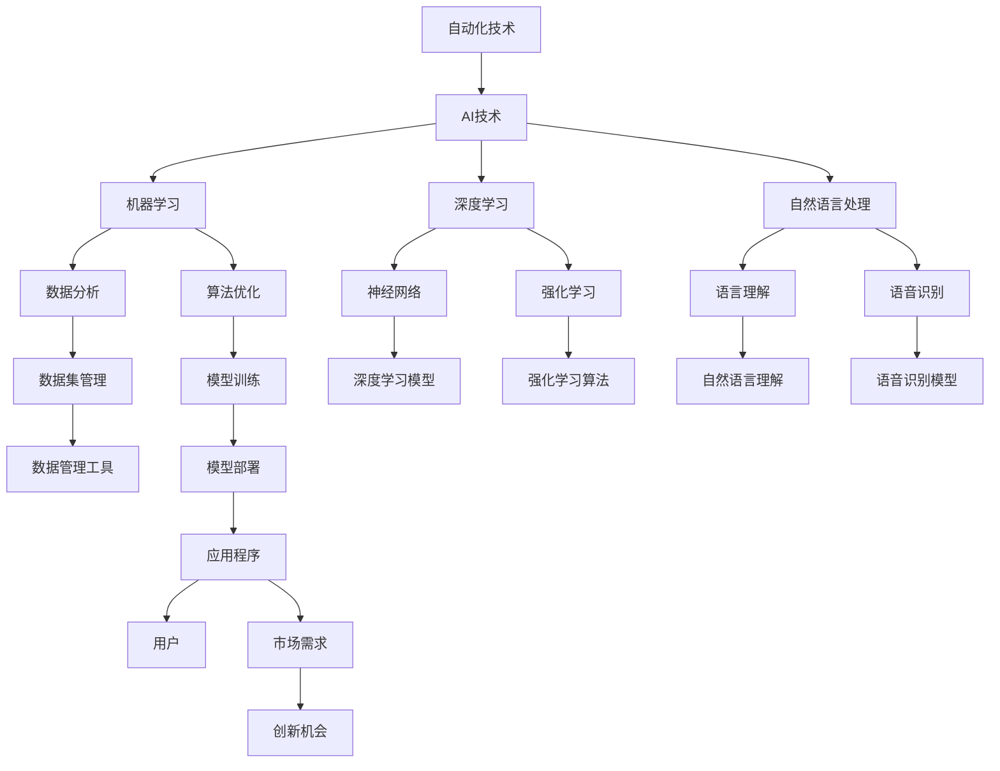

                 

# 自动化创业的未来趋势与展望

## 1. 背景介绍

### 1.1 问题由来

随着技术的发展，自动化（也称为"机器学习"或"人工智能"）在各个行业的应用越来越广泛，从制造业、金融业到医疗健康、零售业等，都可以看到自动化的身影。这一现象促使我们思考：自动化技术如何更好地服务于创业？自动化创业的潜力在哪里？本文将围绕这些问题展开探讨，希望为创业者提供一些启示。

### 1.2 问题核心关键点

本文将围绕以下几个核心关键点进行详细分析：

- 自动化创业的本质：自动化技术如何驱动创业？
- 自动化创业的趋势：当前自动化技术在创业中的趋势和发展方向。
- 自动化创业的挑战：在实现自动化创业的过程中可能遇到的问题和挑战。
- 自动化创业的未来：自动化创业的潜力、应用场景和未来趋势。

## 2. 核心概念与联系

### 2.1 核心概念概述

在进行自动化创业的探讨之前，我们先明确几个核心概念及其联系：

- 自动化（Automation）：指通过使用技术手段，将原本由人工完成的任务自动完成的过程。自动化技术的应用，可以大幅度提高工作效率，降低成本，增加生产力和创新能力。
- 人工智能（AI）：是自动化技术的高级阶段，通过模拟人类智能行为，使得机器具有学习、推理、自我修正的能力。AI技术包括机器学习、深度学习、自然语言处理等方向。
- 创业（Entrepreneurship）：是指创业者利用技术手段，创造新的产品或服务，以满足市场需求的过程。创业不仅包括技术创新，还包括商业模式、市场运营等多方面的创新。
- 自动化创业（Automated Entrepreneurship）：是指创业者利用自动化和人工智能技术，快速构建产品或服务，提升市场竞争力，实现创业成功的过程。

### 2.2 核心概念原理和架构的 Mermaid 流程图



该流程图展示了自动化技术在创业中的架构，从中可以看出自动化与人工智能技术之间的联系和转化。自动化技术是创业的基础，而AI技术则提供了更多的创新可能。

## 3. 核心算法原理 & 具体操作步骤

### 3.1 算法原理概述

自动化创业的核心在于利用自动化和人工智能技术，快速构建产品或服务，以满足市场需求。自动化创业的本质是通过技术手段，实现业务流程的自动化，从而提高效率、降低成本、增强市场竞争力。其核心算法原理如下：

- 数据驱动：通过收集、分析和利用大量的数据，识别市场需求和用户痛点，驱动产品或服务的创新和改进。
- 自动化流程：利用自动化技术，将原本由人工完成的任务转化为自动化流程，提高生产效率。
- 人工智能辅助：通过人工智能技术，增强数据分析、用户行为预测、产品推荐等功能，提升用户体验和满意度。

### 3.2 算法步骤详解

自动化创业的算法步骤包括以下几个关键步骤：

**Step 1: 数据收集与处理**

- 收集市场数据、用户反馈、竞争对手信息等数据。
- 清洗和预处理数据，去除噪声和无效数据。
- 对数据进行特征提取和处理，使其更适合机器学习模型的输入。

**Step 2: 模型训练与优化**

- 选择合适的机器学习或深度学习模型，并根据数据集进行训练。
- 调整模型的超参数，进行模型优化和性能提升。
- 利用数据增强、正则化等技术，防止过拟合和提高模型的泛化能力。

**Step 3: 应用部署与监控**

- 将训练好的模型部署到应用程序中，实现自动化流程。
- 实时监控模型性能，及时调整模型参数和优化策略。
- 集成反馈机制，收集用户反馈和业务数据，持续优化模型和应用。

### 3.3 算法优缺点

自动化创业的算法具有以下优点：

- 快速迭代：利用自动化技术，可以快速构建和迭代产品或服务，缩短市场响应时间。
- 成本节约：自动化技术可以大幅度降低人力成本，提高生产效率。
- 数据驱动：通过数据分析，可以实现产品或服务的精准定位和优化。

同时，自动化创业的算法也存在一些缺点：

- 数据质量要求高：数据收集和处理需要高质量的数据，否则影响模型的效果。
- 模型复杂度高：深度学习等技术需要强大的计算资源，且模型调优较为复杂。
- 对人的依赖：自动化流程需要人的干预和监控，否则可能出现意外情况。

### 3.4 算法应用领域

自动化创业的应用领域非常广泛，主要包括以下几个方向：

- **电商与零售**：通过自动化技术，实现商品推荐、库存管理、物流优化等功能。
- **金融服务**：利用自动化和人工智能技术，进行风险评估、信用评分、智能投顾等功能。
- **健康医疗**：通过自动化和AI技术，实现智能诊断、病历分析、个性化治疗等功能。
- **教育培训**：自动化技术可以用于智能推荐、作业批改、学习分析等功能。
- **智能制造**：通过自动化和AI技术，实现智能设备控制、质量检测、生产优化等功能。

## 4. 数学模型和公式 & 详细讲解 & 举例说明

### 4.1 数学模型构建

自动化创业的数学模型主要基于机器学习和深度学习，其核心数学模型如下：

$$
f(x) = Wx + b
$$

其中 $f(x)$ 表示模型输出，$W$ 为权重矩阵，$b$ 为偏置项，$x$ 为输入数据。

在机器学习中，常见的算法包括线性回归、逻辑回归、决策树、支持向量机等。在深度学习中，常见的算法包括卷积神经网络、循环神经网络、生成对抗网络等。

### 4.2 公式推导过程

以线性回归模型为例，其公式推导过程如下：

假设已知 $n$ 个训练样本 $(x_1, y_1), (x_2, y_2), \ldots, (x_n, y_n)$，其中 $x_i \in \mathbb{R}^d$，$y_i \in \mathbb{R}$。我们的目标是找到最优的权重矩阵 $W$ 和偏置项 $b$，使得模型输出 $f(x)$ 最小化均方误差损失函数：

$$
J(W,b) = \frac{1}{2n} \sum_{i=1}^n (y_i - Wx_i - b)^2
$$

通过梯度下降算法，对 $W$ 和 $b$ 进行优化：

$$
W = W - \eta \frac{1}{n} \sum_{i=1}^n (x_i - Wx_i - b)(Wx_i + b - y_i)
$$

$$
b = b - \eta \frac{1}{n} \sum_{i=1}^n (x_i - Wx_i - b)
$$

其中 $\eta$ 为学习率，需要根据具体情况进行调整。

### 4.3 案例分析与讲解

以智能推荐系统为例，其核心算法为协同过滤和矩阵分解。协同过滤算法通过分析用户的历史行为数据，预测用户对新物品的偏好。矩阵分解算法通过分解用户-物品评分矩阵，提取用户和物品的隐含特征，预测用户对新物品的评分。

假设已知用户对 $n$ 个物品的评分矩阵 $P \in \mathbb{R}^{n \times n}$，我们的目标是找到最优的权重矩阵 $W$ 和偏置项 $b$，使得预测的评分 $P'$ 最小化均方误差损失函数：

$$
J(W,b) = \frac{1}{2n} \sum_{i=1}^n \sum_{j=1}^n (p_{ij} - Wp_i - b)^2
$$

其中 $p_{ij}$ 表示用户 $i$ 对物品 $j$ 的评分，$p_i$ 表示用户 $i$ 的特征向量，$P'$ 表示预测的评分矩阵。

通过梯度下降算法，对 $W$ 和 $b$ 进行优化：

$$
W = W - \eta \frac{1}{n} \sum_{i=1}^n \sum_{j=1}^n (p_{ij} - Wp_i - b)(p_i - Wp_i - b)^T
$$

$$
b = b - \eta \frac{1}{n} \sum_{i=1}^n \sum_{j=1}^n (p_{ij} - Wp_i - b)
$$

其中 $\eta$ 为学习率，需要根据具体情况进行调整。

## 5. 项目实践：代码实例和详细解释说明

### 5.1 开发环境搭建

在进行自动化创业的实践之前，我们需要准备好开发环境。以下是使用Python进行TensorFlow开发的环境配置流程：

1. 安装Anaconda：从官网下载并安装Anaconda，用于创建独立的Python环境。

2. 创建并激活虚拟环境：
```bash
conda create -n tf-env python=3.7 
conda activate tf-env
```

3. 安装TensorFlow：根据CUDA版本，从官网获取对应的安装命令。例如：
```bash
conda install tensorflow -c pytorch -c conda-forge
```

4. 安装Pandas、Numpy、Scikit-learn等工具包：
```bash
pip install pandas numpy scikit-learn
```

5. 安装TensorBoard：
```bash
pip install tensorboard
```

完成上述步骤后，即可在`tf-env`环境中开始自动化创业的实践。

### 5.2 源代码详细实现

这里我们以推荐系统为例，给出使用TensorFlow进行协同过滤算法的代码实现。

```python
import tensorflow as tf
import numpy as np
import pandas as pd

# 构造训练数据
train_data = pd.DataFrame({
    'user_id': [1, 2, 3, 4, 5, 6, 7, 8, 9, 10],
    'item_id': [1, 2, 3, 4, 5, 6, 7, 8, 9, 10],
    'rating': [5, 4, 3, 2, 1, 2, 4, 5, 3, 2]
})
train_data = train_data.reindex(columns=['user_id', 'item_id', 'rating'])

# 分割数据集
train_data = train_data.dropna()
user_id, item_id = train_data['user_id'], train_data['item_id']
rating = train_data['rating']

# 构造模型
model = tf.keras.models.Sequential([
    tf.keras.layers.Dense(64, activation='relu', input_shape=[2]),
    tf.keras.layers.Dense(1)
])

# 编译模型
model.compile(optimizer='adam', loss='mse')

# 训练模型
model.fit(user_id, rating, epochs=50, batch_size=32, validation_split=0.2)

# 测试模型
test_data = pd.DataFrame({
    'user_id': [4, 6, 8, 9, 10],
    'item_id': [1, 3, 5, 7, 9],
    'rating': [NaN, 4, 5, 2, 1]
})
test_data = test_data.reindex(columns=['user_id', 'item_id', 'rating'])
test_data = test_data.dropna()

# 预测评分
pred = model.predict(test_data)
print(pred)
```

以上代码实现了使用协同过滤算法进行推荐系统的基本流程，包括数据处理、模型构建、训练和测试。

### 5.3 代码解读与分析

让我们再详细解读一下关键代码的实现细节：

**数据处理**：
- 使用Pandas库，将训练数据、测试数据从CSV文件读入，并处理缺失值。
- 将用户ID、物品ID和评分分别作为模型输入。

**模型构建**：
- 使用Keras框架，构建一个包含两个全连接层的神经网络模型，输入为两个特征（用户ID和物品ID），输出为一个实数表示评分。
- 编译模型时，使用Adam优化器和均方误差损失函数。

**训练模型**：
- 使用fit方法，将训练数据输入模型，设置训练轮数和批次大小，并在验证集上进行验证。

**测试模型**：
- 将测试数据输入模型，预测评分，并打印输出。

可以看到，TensorFlow提供了一套便捷的API，使得模型构建和训练过程变得非常简单。同时，TensorBoard工具可以帮助我们实时监控训练过程，及时发现并调整问题。

## 6. 实际应用场景

### 6.1 智能客服系统

智能客服系统是自动化创业的重要应用场景之一。传统客服方式依赖人力，高峰期响应速度慢，人工成本高。利用自动化技术，可以构建7x24小时的智能客服系统，提高响应速度和服务质量。

具体实现步骤如下：
1. 收集历史客服对话数据，构建对话语料库。
2. 使用机器学习算法，如决策树、支持向量机等，构建智能客服模型。
3. 将模型部署到在线客服平台上，实时处理用户问题。
4. 通过用户反馈，不断优化模型，提升智能客服的准确率和用户体验。

### 6.2 金融投资

金融投资是自动化创业的另一个重要应用场景。金融市场数据复杂多变，传统人工分析效率低、精度差。利用自动化和AI技术，可以实现实时数据分析和投资策略优化。

具体实现步骤如下：
1. 收集金融市场数据，如股票价格、交易量、财务报表等。
2. 使用机器学习算法，如深度学习、强化学习等，构建金融投资模型。
3. 将模型部署到交易系统上，实时分析市场动态，生成投资策略。
4. 通过实盘测试，不断优化模型，提高投资收益。

### 6.3 智能制造

智能制造是自动化创业的重要方向。传统制造业生产效率低，质量控制难。利用自动化技术，可以实现智能设备控制、质量检测、生产优化等功能。

具体实现步骤如下：
1. 收集生产设备数据，如温度、湿度、能耗等。
2. 使用机器学习算法，如深度学习、时间序列分析等，构建智能制造模型。
3. 将模型部署到生产设备上，实时监控生产过程，优化生产参数。
4. 通过反馈机制，不断优化模型，提高生产效率和产品质量。

## 7. 工具和资源推荐

### 7.1 学习资源推荐

为了帮助开发者系统掌握自动化创业的理论基础和实践技巧，这里推荐一些优质的学习资源：

1. Coursera《机器学习》课程：由斯坦福大学教授Andrew Ng开设，系统讲解了机器学习的基本概念和算法。
2. TensorFlow官方文档：提供了TensorFlow框架的详细教程和API文档，是学习自动化创业不可或缺的资源。
3. Kaggle竞赛平台：提供了大量真实世界的数据集和竞赛任务，是实践自动化创业的绝佳平台。
4. GitHub上的自动化创业项目：可以查看其他开发者的代码实现，学习其思路和方法。
5. 《深度学习》书籍：由Ian Goodfellow等著名学者共同编写，详细讲解了深度学习的基本原理和算法。

通过对这些资源的学习实践，相信你一定能够快速掌握自动化创业的理论基础和实践技巧。

### 7.2 开发工具推荐

高效的开发离不开优秀的工具支持。以下是几款用于自动化创业开发的常用工具：

1. TensorFlow：由Google主导开发的开源深度学习框架，提供了丰富的机器学习算法和API，适合自动化创业中的算法开发。
2. PyTorch：由Facebook主导开发的开源深度学习框架，灵活性强，适合自动化创业中的模型优化和部署。
3. Jupyter Notebook：用于编写和运行Python代码的工具，支持多种编程语言和库，是自动化创业中常用的交互式开发环境。
4. GitHub：提供版本控制和代码托管服务，适合自动化创业中的协作开发和项目管理。
5. Google Colab：提供免费的GPU资源，支持在线运行Python代码，方便自动化创业中的快速迭代和实验。

合理利用这些工具，可以显著提升自动化创业的开发效率，加快创新迭代的步伐。

### 7.3 相关论文推荐

自动化创业的发展得益于学界的持续研究。以下是几篇奠基性的相关论文，推荐阅读：

1. 《深度学习》（Deep Learning）书籍：由Ian Goodfellow等著名学者共同编写，详细讲解了深度学习的基本原理和算法。
2. 《强化学习》（Reinforcement Learning）书籍：由Richard S. Sutton等学者编写，讲解了强化学习的基本原理和算法。
3. 《机器学习》（Machine Learning）课程：由Andrew Ng教授开设，讲解了机器学习的基本概念和算法。
4. 《自然语言处理综论》（Speech and Language Processing）书籍：由Daniel Jurafsky等学者编写，讲解了自然语言处理的基本原理和算法。
5. 《人工智能》（Artificial Intelligence）课程：由深度学习领域知名学者Geoffrey Hinton教授开设，讲解了人工智能的基本概念和算法。

这些论文代表了大语言模型微调技术的发展脉络。通过学习这些前沿成果，可以帮助研究者把握学科前进方向，激发更多的创新灵感。

## 8. 总结：未来发展趋势与挑战

### 8.1 研究成果总结

本文对自动化创业的现状和未来发展趋势进行了全面系统的介绍。首先明确了自动化创业的本质、趋势、挑战和未来，并通过数据驱动、自动化流程和人工智能辅助等核心算法原理，阐述了自动化创业的核心步骤。

通过以上分析，可以看出自动化创业在电商、金融、制造等领域具有广阔的应用前景，但也面临数据质量、模型复杂度、人依赖等挑战。只有在数据、模型、算法、工程、业务等多个维度协同发力，才能真正实现自动化创业的成功。

### 8.2 未来发展趋势

展望未来，自动化创业的发展趋势如下：

1. **自动化技术不断进步**：随着技术的发展，自动化技术将越来越先进，应用场景将越来越广泛。
2. **数据质量和数据量将不断提升**：随着大数据技术的发展，数据的质量和数量将不断提升，为自动化创业提供更多的机会。
3. **算法复杂度不断提升**：深度学习等技术的不断进步，使得自动化创业中的算法复杂度将不断提升，但同时也带来了更大的创新空间。
4. **跨领域应用将不断拓展**：自动化技术将从传统领域向更多新兴领域拓展，如医疗、教育、智能家居等。
5. **人机协作将更加紧密**：自动化技术将与人类协作，共同完成复杂任务，提升生产力和效率。

### 8.3 面临的挑战

自动化创业虽然前景广阔，但也面临诸多挑战：

1. **数据质量问题**：自动化创业依赖于大量的数据，但数据质量往往参差不齐，需要花费大量时间和精力进行数据清洗和处理。
2. **模型复杂度高**：深度学习等技术需要强大的计算资源，且模型调优较为复杂，需要更高的技术门槛。
3. **人依赖问题**：自动化创业需要人类的干预和监控，否则可能出现意外情况，需要不断提高技术水平和人员素质。

### 8.4 研究展望

面对自动化创业的挑战，未来的研究需要在以下几个方面寻求新的突破：

1. **数据治理和质量管理**：开发更多高效的数据清洗和处理算法，提升数据质量。
2. **模型压缩和优化**：开发更加高效的模型压缩和优化技术，减少计算资源消耗。
3. **人机协作机制**：研究人机协作机制，优化人机交互，提高自动化创业的效率和可靠性。
4. **跨领域融合**：研究跨领域融合技术，将不同领域的知识和技能融合到自动化创业中。
5. **模型可解释性**：提高模型的可解释性，增强自动化创业的透明度和可信度。

## 9. 附录：常见问题与解答

**Q1：什么是自动化创业？**

A: 自动化创业是指创业者利用自动化和人工智能技术，快速构建产品或服务，提升市场竞争力，实现创业成功的过程。其本质是通过技术手段，实现业务流程的自动化，从而提高效率、降低成本、增强市场竞争力。

**Q2：自动化创业的优点和缺点是什么？**

A: 自动化创业的优点包括快速迭代、成本节约、数据驱动等，缺点包括数据质量要求高、模型复杂度高、人依赖等。

**Q3：自动化创业的应用场景有哪些？**

A: 自动化创业的应用场景包括电商与零售、金融服务、健康医疗、教育培训、智能制造等。

**Q4：自动化创业的算法包括哪些？**

A: 自动化创业的算法包括机器学习、深度学习、协同过滤、决策树、支持向量机等。

**Q5：如何进行自动化创业的实践？**

A: 进行自动化创业的实践需要遵循以下步骤：数据收集与处理、模型训练与优化、应用部署与监控。

**Q6：如何选择合适的自动化技术？**

A: 选择合适的自动化技术需要考虑数据质量、业务需求、技术成熟度等多个因素。可以通过实验对比、实际应用等多种方式进行选择。

**Q7：如何优化自动化创业的模型？**

A: 优化自动化创业的模型需要考虑模型复杂度、计算资源、模型效果等多个因素。可以通过数据增强、正则化、超参数调优等多种方式进行优化。

**Q8：自动化创业的挑战有哪些？**

A: 自动化创业的挑战包括数据质量问题、模型复杂度高、人依赖问题等。需要通过数据治理、模型优化、人机协作机制等多种方式进行应对。

通过以上分析和解答，相信你对自动化创业有了更全面的认识，并能够在实际应用中更好地利用自动化和人工智能技术，推动创业的成功。

---

作者：禅与计算机程序设计艺术 / Zen and the Art of Computer Programming

