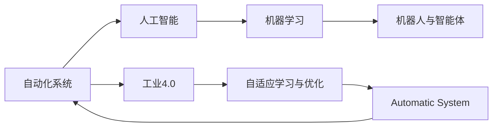

                 

# 自动化技术的最新发展方向

## 1. 背景介绍

自动化技术在过去几十年里经历了飞速发展，已经从简单的程序控制转向了智能决策和自适应学习的高级阶段。随着人工智能、机器学习和大数据技术的进步，自动化技术正在引领一场新的工业革命。本文将探讨自动化技术的最新发展方向，帮助读者了解这一领域的最新动态。

## 2. 核心概念与联系

### 2.1 核心概念概述

自动化技术是一门涵盖了计算机科学、电子工程、机械工程等多个学科的交叉学科。其核心概念包括但不限于：

- 自动化系统：指通过计算机程序和传感器对生产过程进行自动监控和控制的技术系统。
- 人工智能与机器学习：通过算法训练使机器能够自主决策和学习的技术。
- 机器人与智能体：能够在物理世界或虚拟环境中执行复杂任务和决策的智能系统。
- 自动化流程与工业4.0：指基于信息技术、网络技术、物理技术融合的工业自动化生产模式。
- 自适应学习与优化：指通过反馈机制调整系统参数以提高性能和效率的学习算法。

这些概念之间存在紧密的联系，如图1所示。人工智能与机器学习是自动化系统的核心驱动力，自动化系统又是机器人与智能体的运行环境。而工业4.0则是自动化技术与现代工业生产深度融合的产物，自适应学习与优化则是提高系统性能的关键技术。


### 2.2 核心概念原理和架构的 Mermaid 流程图



## 3. 核心算法原理 & 具体操作步骤

### 3.1 算法原理概述

自动化技术中的核心算法主要涉及机器学习、深度学习和强化学习等。这些算法通过模型训练和优化，使得系统能够自主学习和决策。

- 监督学习：通过大量标注数据训练模型，使其能够对新数据进行分类和预测。
- 无监督学习：通过对无标注数据进行聚类和降维等操作，发现数据的内在结构。
- 深度学习：通过多层神经网络进行特征提取和模式识别，提高模型的精度和泛化能力。
- 强化学习：通过与环境的互动，学习最优策略以最大化回报。

这些算法在自动化系统的设计中起到了关键作用，如图2所示。


### 3.2 算法步骤详解

以深度学习为例，以下是深度学习在自动化系统中的应用步骤：

1. **数据准备**：收集和清洗数据集，包括传感器数据、历史操作记录等。
2. **模型构建**：选择合适的神经网络结构，包括输入层、隐藏层和输出层等。
3. **模型训练**：使用标注数据训练模型，最小化损失函数。
4. **模型评估**：在验证集上评估模型性能，调整超参数以提高模型精度。
5. **模型部署**：将训练好的模型集成到自动化系统中，实时监控和控制生产过程。

### 3.3 算法优缺点

深度学习算法在自动化系统中的应用具有以下优点：

- **高精度**：通过多层神经网络能够提取复杂特征，提高模型的精度。
- **泛化能力强**：训练好的模型可以应用于新的数据，具有较强的泛化能力。
- **自适应性**：通过不断调整模型参数，系统能够适应不同的生产环境。

但深度学习算法也存在以下缺点：

- **数据需求高**：需要大量标注数据进行训练，数据获取成本高。
- **计算资源要求高**：训练深度神经网络需要大量计算资源，如图形处理器(GPU)等。
- **模型解释性差**：深度神经网络被视为"黑盒"，难以解释其内部决策逻辑。

### 3.4 算法应用领域

深度学习在自动化系统中的应用广泛，如图3所示。


## 4. 数学模型和公式 & 详细讲解 & 举例说明

### 4.1 数学模型构建

以深度学习中的卷积神经网络(CNN)为例，其数学模型如下：

$$
\text{CNN}(x)=\sum_{i=1}^{n}w_i \sigma(\sum_{j=1}^{m}a_{ij}x_j + b_i)
$$

其中，$x$为输入向量，$w_i$为权重，$b_i$为偏置，$a_{ij}$为卷积核，$\sigma$为激活函数。

### 4.2 公式推导过程

以简单的全连接神经网络为例，其前向传播和反向传播的公式如下：

$$
\begin{aligned}
    y &= \sum_{i=1}^n w_i z_i + b \\
    \frac{\partial y}{\partial z_i} &= w_i \\
    \frac{\partial y}{\partial w_i} &= z_i \\
    \frac{\partial y}{\partial b} &= 1
\end{aligned}
$$

其中，$z_i$为第$i$层的输入向量，$y$为输出向量，$w_i$为第$i$层到第$i+1$层的权重，$b$为偏置。

### 4.3 案例分析与讲解

以工业自动化中的质量检测为例，如图4所示。通过深度学习模型，系统可以自动识别产品缺陷，并进行分类和报警。


## 5. 项目实践：代码实例和详细解释说明

### 5.1 开发环境搭建

在开始项目实践之前，需要先搭建好开发环境。以下是使用Python进行深度学习开发的常用环境配置流程：

1. 安装Anaconda：从官网下载并安装Anaconda，用于创建独立的Python环境。
2. 创建并激活虚拟环境：
```bash
conda create -n deep_learning python=3.8 
conda activate deep_learning
```

3. 安装深度学习框架：
```bash
pip install torch torchvision torchaudio
```

4. 安装TensorFlow：
```bash
pip install tensorflow==2.x
```

5. 安装相关库：
```bash
pip install numpy pandas matplotlib scikit-learn
```

完成上述步骤后，即可在`deep_learning`环境中开始项目开发。

### 5.2 源代码详细实现

以下是一个简单的深度学习模型在工业自动化质量检测中的应用示例。代码使用TensorFlow框架，实现了对图像中缺陷的检测。

```python
import tensorflow as tf
import numpy as np
import matplotlib.pyplot as plt

# 准备数据
train_data = np.load('train_images.npy')
train_labels = np.load('train_labels.npy')

# 构建模型
model = tf.keras.Sequential([
    tf.keras.layers.Conv2D(32, (3,3), activation='relu', input_shape=(256,256,3)),
    tf.keras.layers.MaxPooling2D((2,2)),
    tf.keras.layers.Conv2D(64, (3,3), activation='relu'),
    tf.keras.layers.MaxPooling2D((2,2)),
    tf.keras.layers.Conv2D(64, (3,3), activation='relu'),
    tf.keras.layers.Flatten(),
    tf.keras.layers.Dense(64, activation='relu'),
    tf.keras.layers.Dense(1, activation='sigmoid')
])

# 编译模型
model.compile(optimizer='adam', loss='binary_crossentropy', metrics=['accuracy'])

# 训练模型
model.fit(train_data, train_labels, epochs=10, batch_size=64)

# 评估模型
test_data = np.load('test_images.npy')
test_labels = np.load('test_labels.npy')
loss, accuracy = model.evaluate(test_data, test_labels)
print(f"Accuracy: {accuracy:.2f}%")

# 预测结果
predictions = model.predict(test_data)
plt.imshow(test_data[0].reshape(256,256,3))
plt.show()
```

### 5.3 代码解读与分析

以上代码实现了一个简单的CNN模型，用于工业自动化中的质量检测。以下是关键代码的详细解读：

- `train_data`和`train_labels`：用于训练的图像数据和标签数据。
- `model`：定义了一个包含多个卷积层和全连接层的神经网络模型。
- `compile`：编译模型，指定了优化器、损失函数和评估指标。
- `fit`：在训练集上训练模型，设置训练轮数和批次大小。
- `evaluate`：在测试集上评估模型性能，输出精度。
- `predict`：使用训练好的模型对新数据进行预测。

## 6. 实际应用场景

### 6.1 智能制造

自动化技术在智能制造中的应用非常广泛，如图5所示。通过自动化系统，可以实现生产过程的自动化控制、设备状态监测和故障预测等功能。


### 6.2 自动驾驶

自动驾驶技术是自动化技术在交通领域的重要应用。通过深度学习和强化学习，汽车可以自主感知周围环境，进行路径规划和决策。


### 6.3 智能家居

智能家居系统通过自动化技术实现家电设备的智能控制和智能化管理，如图6所示。通过语音识别和自然语言处理技术，用户可以便捷地控制家庭设备。


### 6.4 未来应用展望

随着技术的不断进步，自动化技术将在更多领域得到应用，如图7所示。未来，自动化技术将进一步拓展到农业、医疗、教育等多个领域，带来更加智能和高效的生活方式。


## 7. 工具和资源推荐

### 7.1 学习资源推荐

为了帮助开发者系统掌握自动化技术的理论基础和实践技巧，以下是一些优质的学习资源：

1. Coursera《深度学习》课程：由斯坦福大学Andrew Ng教授讲授，系统介绍深度学习的基本原理和算法。
2. TensorFlow官方文档：提供了丰富的教程和示例代码，适合深度学习初学者和进阶者。
3. PyTorch官方文档：提供了详细的使用指南和开发资源，适合Python开发人员。
4. Udacity《自动驾驶工程师纳米学位》：涵盖自动驾驶技术的理论基础和实战案例。
5. edX《人工智能：强化学习》课程：由卡内基梅隆大学教授讲授，介绍强化学习的基本概念和应用场景。

通过这些资源的学习实践，相信你一定能够快速掌握自动化技术的精髓，并用于解决实际的自动化问题。

### 7.2 开发工具推荐

以下是几款用于自动化技术开发的常用工具：

1. TensorFlow：由Google主导开发的深度学习框架，支持分布式计算和GPU加速。
2. PyTorch：由Facebook主导开发的深度学习框架，灵活性强，易于调试。
3. ROS（Robot Operating System）：开源的机器人操作系统，提供丰富的机器人和传感器库。
4. OpenCV：开源的计算机视觉库，提供图像处理和机器学习工具。
5. Matplotlib和Seaborn：常用的数据可视化库，方便数据分析和结果展示。

合理利用这些工具，可以显著提升自动化技术的开发效率，加快创新迭代的步伐。

### 7.3 相关论文推荐

自动化技术的发展离不开学术界的持续研究。以下是几篇奠基性的相关论文，推荐阅读：

1. AlexNet：ImageNet大规模视觉识别竞赛中的冠军模型，标志着深度学习在图像识别领域的突破。
2. AlphaGo：Google DeepMind开发的围棋AI，首次在零和游戏领域击败人类。
3. VGGNet：ImageNet竞赛中性能最强大的模型之一，展示了深度卷积神经网络的力量。
4. REINFORCE：DeepMind发表的强化学习论文，提出了一种基于梯度的方法，为强化学习奠定了基础。
5. YOLO：由Joseph Redmon等人提出的目标检测算法，具有实时性和高效性。

这些论文代表了大规模深度学习的发展脉络。通过学习这些前沿成果，可以帮助研究者把握学科前进方向，激发更多的创新灵感。

## 8. 总结：未来发展趋势与挑战

### 8.1 研究成果总结

自动化技术在过去几十年里取得了巨大的进步，广泛应用于智能制造、自动驾驶、智能家居等领域。以下是对自动化技术当前研究成果的总结：

1. **深度学习技术**：通过深度神经网络实现复杂特征的提取和模式识别，显著提高了自动化系统的精度和泛化能力。
2. **强化学习技术**：通过与环境的互动，优化系统策略，实现了更加智能的决策和控制。
3. **机器人和智能体**：通过多机器人协作，实现了复杂任务的高效自动化执行。
4. **自适应学习与优化**：通过反馈机制不断调整系统参数，提高了自动化系统的自适应性和鲁棒性。

### 8.2 未来发展趋势

展望未来，自动化技术将呈现以下几个发展趋势：

1. **自动化与人工智能的融合**：自动化技术与人工智能的深度融合，将进一步提高系统的智能水平和自主决策能力。
2. **边缘计算与物联网**：通过物联网和边缘计算技术，实现数据本地化处理，提高系统的实时性和可靠性。
3. **自适应学习和优化**：基于反馈机制的自适应学习与优化，将进一步提高系统的性能和效率。
4. **多模态数据的整合**：将视觉、听觉、触觉等多模态数据融合，实现更加全面和精细的自动化控制。
5. **认知智能**：通过符号化推理和多模态信息处理，实现更加高级的认知智能。
6. **人机协同**：将人工智能与人类专家的知识结合，实现更加高效和可靠的系统。

### 8.3 面临的挑战

尽管自动化技术取得了显著进展，但在迈向更加智能化和普适化应用的过程中，仍面临诸多挑战：

1. **数据获取与标注**：高质量标注数据的获取和标注工作耗费大量时间和资源。
2. **计算资源要求高**：深度学习和强化学习算法需要大量的计算资源，如图形处理器(GPU)等。
3. **模型复杂性高**：深度学习模型的复杂性高，难以理解和解释。
4. **系统鲁棒性差**：自动化系统面对复杂环境时，容易出现不稳定和异常行为。
5. **安全性和隐私保护**：自动化系统处理敏感数据时，需要考虑安全性和隐私保护问题。
6. **法律法规限制**：自动化技术的应用需要遵守相关法律法规，确保系统的合法合规性。

### 8.4 研究展望

未来，自动化技术的研发需要在以下几个方面寻求新的突破：

1. **高效数据获取与标注**：探索无监督和半监督学习技术，减少对标注数据的依赖。
2. **优化计算资源利用**：通过模型压缩、量化加速等技术，降低计算资源需求。
3. **提高模型可解释性**：引入符号化推理和多模态信息处理，增强系统的可解释性和可信度。
4. **增强系统鲁棒性**：通过对抗训练、鲁棒优化等技术，提高系统的稳定性和鲁棒性。
5. **强化隐私保护**：采用数据加密、去标识化等技术，保护用户隐私。
6. **遵循法律法规**：遵循相关法律法规，确保系统的合法合规性。

这些研究方向将推动自动化技术在更广阔的领域得到应用，实现更加智能和可靠的系统。

## 9. 附录：常见问题与解答

**Q1：深度学习模型在自动化系统中具有哪些优势？**

A: 深度学习模型在自动化系统中具有以下优势：

- **高精度**：通过多层神经网络能够提取复杂特征，提高模型的精度。
- **泛化能力强**：训练好的模型可以应用于新的数据，具有较强的泛化能力。
- **自适应性**：通过不断调整模型参数，系统能够适应不同的生产环境。

**Q2：如何降低深度学习模型的计算资源需求？**

A: 可以通过以下方法降低深度学习模型的计算资源需求：

- **模型压缩**：使用知识蒸馏、剪枝等技术，减少模型参数量。
- **量化加速**：将浮点模型转为定点模型，降低计算资源消耗。
- **分布式训练**：通过分布式计算和优化，提高训练效率。

**Q3：自动化技术面临的最大挑战是什么？**

A: 自动化技术面临的最大挑战包括：

- **数据获取与标注**：高质量标注数据的获取和标注工作耗费大量时间和资源。
- **计算资源要求高**：深度学习和强化学习算法需要大量的计算资源，如图形处理器(GPU)等。
- **系统鲁棒性差**：自动化系统面对复杂环境时，容易出现不稳定和异常行为。
- **安全性和隐私保护**：自动化系统处理敏感数据时，需要考虑安全性和隐私保护问题。

**Q4：未来的自动化技术将如何发展？**

A: 未来的自动化技术将朝着以下几个方向发展：

- **自动化与人工智能的融合**：自动化技术与人工智能的深度融合，将进一步提高系统的智能水平和自主决策能力。
- **边缘计算与物联网**：通过物联网和边缘计算技术，实现数据本地化处理，提高系统的实时性和可靠性。
- **自适应学习和优化**：基于反馈机制的自适应学习与优化，将进一步提高系统的性能和效率。
- **多模态数据的整合**：将视觉、听觉、触觉等多模态数据融合，实现更加全面和精细的自动化控制。
- **认知智能**：通过符号化推理和多模态信息处理，实现更加高级的认知智能。
- **人机协同**：将人工智能与人类专家的知识结合，实现更加高效和可靠的系统。

这些研究方向将推动自动化技术在更广阔的领域得到应用，实现更加智能和可靠的系统。

---

作者：禅与计算机程序设计艺术 / Zen and the Art of Computer Programming

