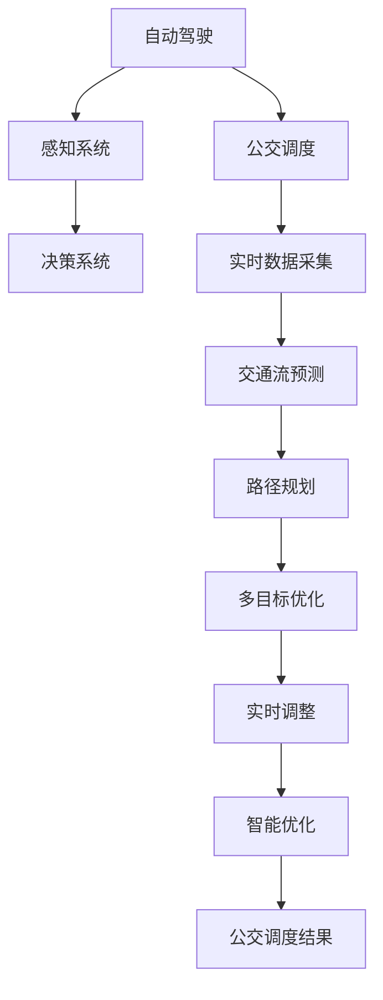

                 

# 自动驾驶中的智能公交调度与优化

> 关键词：自动驾驶, 公交调度, 智能优化, 交通流预测, 实时路径规划

## 1. 背景介绍

随着自动驾驶技术的发展，公交车辆调度与优化问题正日益成为智能交通系统中的一个重要研究领域。传统的公交调度多依赖于经验法则和人工调度，效率低下，难以适应快速变化的交通环境。借助先进的人工智能技术，特别是在自动驾驶、交通流预测与优化等方面，能够大幅提升公交系统运营效率，减少等待时间，优化行驶路线，降低能源消耗，提升用户体验。

### 1.1 问题由来
目前，城市公交系统普遍存在的问题包括：

1. **效率低下**：公交车辆在城市中的运行往往受制于交通拥堵，行驶速度慢，乘客等待时间长。
2. **缺乏实时性**：由于缺乏实时的交通流信息，无法及时调整车辆运行策略。
3. **资源浪费**：公交车辆在非高峰期或低乘客量线路上的空载率高，能源和人力资源浪费严重。
4. **安全风险**：公交车辆需要在复杂的交通环境中安全行驶，传统的人工调度难以全面保障行车安全。

### 1.2 问题核心关键点
智能公交调度旨在通过综合考虑公交运营的多个因素，实现公交系统的高效、安全、低成本运行。关键点包括：

1. **动态实时性**：公交调度需要能够实时响应交通环境的变化，调整行驶策略。
2. **数据驱动决策**：利用历史数据和实时交通信息，进行科学的数据分析，指导公交调度和路线优化。
3. **多目标优化**：公交调度不仅仅是速度优化，还需要考虑等待时间、乘客满意度、能源消耗等多重目标。
4. **鲁棒性**：公交调度和优化算法应具备一定的鲁棒性，能够应对各种异常交通情况。
5. **自动化**：通过自动驾驶技术，减少人为干预，提升运营效率和安全性。

## 2. 核心概念与联系

### 2.1 核心概念概述

智能公交调度涉及多个核心概念，包括：

1. **自动驾驶**：通过感知和决策系统，实现公交车辆的自主驾驶。
2. **公交调度**：根据乘客需求和交通环境，优化公交车辆的时间和路线安排。
3. **交通流预测**：通过数据驱动的方法，预测未来交通流的状态，指导公交调度和路径规划。
4. **路径规划**：根据实时交通信息，规划最优路径，减少行驶时间。
5. **多目标优化**：综合考虑速度、等待时间、安全性等多重目标，进行公交调度和优化。
6. **实时调整**：利用实时数据，动态调整公交车辆运行策略，适应交通变化。
7. **智能优化**：结合人工智能算法，实现公交调度和优化，提升系统效率。

这些概念相互关联，共同构成了智能公交调度的技术框架。通过理解和应用这些概念，可以更好地实现公交调度的智能化和高效化。

### 2.2 核心概念原理和架构的 Mermaid 流程图



这个流程图展示了自动驾驶、公交调度与优化等核心概念之间的联系。从感知和决策系统获取实时数据，通过交通流预测和路径规划，结合多目标优化和实时调整，最终实现智能公交调度的高效运行。

## 3. 核心算法原理 & 具体操作步骤

### 3.1 算法原理概述

智能公交调度算法主要分为感知、决策、优化三个阶段。其基本原理如下：

1. **感知阶段**：通过安装传感器和摄像头等设备，实时获取交通环境信息，如道路状况、交通流、车辆位置等。
2. **决策阶段**：根据感知信息，结合预设的规则和人工智能算法，决策公交车辆的最佳行驶路径和速度。
3. **优化阶段**：通过多目标优化算法，综合考虑速度、等待时间、乘客满意度等目标，优化公交调度和路径。

### 3.2 算法步骤详解

**Step 1: 数据采集与预处理**

1. **数据采集**：通过传感器、摄像头、GPS等设备，实时采集公交车辆和交通环境数据。数据内容包括：车辆位置、速度、方向、乘客数量、道路状况、交通流等。
2. **数据预处理**：对采集的数据进行清洗、去噪、归一化等处理，以保证数据质量。

**Step 2: 交通流预测**

1. **历史数据分析**：利用历史交通流数据，建立交通流预测模型，如时间序列预测、回归模型、深度学习模型等。
2. **实时数据融合**：将实时采集的交通流数据与历史数据分析结果结合，进行实时交通流预测。

**Step 3: 路径规划**

1. **路径规划算法**：采用Dijkstra、A*、A2star等图搜索算法，根据实时交通流预测结果，计算公交车辆的最优路径。
2. **动态调整**：根据实时交通流变化，动态调整路径规划，确保最优路径。

**Step 4: 多目标优化**

1. **目标函数设计**：定义多个优化目标，如速度、等待时间、乘客满意度等，构建多目标优化问题。
2. **优化算法选择**：选择合适的多目标优化算法，如遗传算法、粒子群算法、混合整数规划等。
3. **优化模型求解**：通过求解优化模型，获取公交调度的最优方案。

**Step 5: 实时调整**

1. **实时监控**：利用传感器、摄像头等设备，实时监控公交车辆的运行状态和交通环境变化。
2. **实时决策**：根据实时监控结果，结合预设规则和人工智能算法，动态调整公交车辆的速度和路径。

**Step 6: 智能优化**

1. **模型训练**：基于历史数据，训练多目标优化模型，并进行验证和调优。
2. **智能决策**：利用训练好的模型，进行智能决策，动态调整公交调度和路径。

### 3.3 算法优缺点

智能公交调度算法的主要优点包括：

1. **实时性高**：通过实时数据采集和处理，能够快速响应交通环境的变化。
2. **优化效果显著**：能够综合考虑多个目标，实现公交调度的最优方案。
3. **自动化程度高**：通过人工智能算法，减少人为干预，提升调度效率和安全性。
4. **适应性强**：能够适应不同交通环境和用户需求，提升系统的灵活性和鲁棒性。

其缺点主要在于：

1. **数据依赖性高**：算法的准确性和效果依赖于数据的丰富性和质量。
2. **模型训练复杂**：多目标优化模型的训练复杂度较高，需要大量历史数据和计算资源。
3. **系统复杂度高**：涉及感知、决策、优化等多个环节，系统设计和实现较为复杂。

### 3.4 算法应用领域

智能公交调度算法在自动驾驶领域具有广泛的应用前景，适用于以下场景：

1. **城市公交系统**：通过实时数据采集和路径规划，优化城市公交的运行线路和频率，提高效率和安全性。
2. **校车调度**：针对学生上下学高峰期的交通流量变化，动态调整校车运行路线和时间，保证安全高效。
3. **长途客运**：在长途客运中，通过智能调度优化长途公交车辆的运行时间和路线，提升乘客的出行体验。
4. **特殊线路**：如旅游专线、机场巴士等，通过智能调度优化特殊线路的运行效率和乘客满意度。
5. **智慧交通**：结合智慧交通系统，实现公交调度和交通流的智能管理，提升整个交通系统的运行效率。

## 4. 数学模型和公式 & 详细讲解 & 举例说明

### 4.1 数学模型构建

智能公交调度的数学模型主要由以下几部分构成：

1. **状态变量**：包括公交车辆位置、速度、方向、乘客数量等状态变量。
2. **决策变量**：包括公交车辆的加速度、转向角度、行驶路线等决策变量。
3. **目标函数**：如速度、等待时间、乘客满意度等优化目标。
4. **约束条件**：如交通规则、车辆性能限制、乘客需求限制等。

以公交调度的多目标优化为例，目标函数可以表示为：

$$
\min \left( \sum_{i=1}^n c_i(x_j) \right)
$$

其中，$c_i(x_j)$ 表示第 $i$ 个目标函数，$x_j$ 表示公交车辆在第 $j$ 个状态时的决策变量。

### 4.2 公式推导过程

以公交调度的多目标优化为例，目标函数和约束条件可以表示为：

1. **目标函数**：
$$
f_1(x) = \sum_{i=1}^{n} v_i(x)
$$
$$
f_2(x) = \sum_{i=1}^{n} w_i(x)
$$
其中，$v_i(x)$ 表示公交车辆速度，$w_i(x)$ 表示乘客等待时间。

2. **约束条件**：
$$
g_1(x) = \sum_{i=1}^{m} a_i(x) \leq b_i
$$
$$
g_2(x) = \sum_{i=1}^{m} b_i(x) \geq c_i
$$
其中，$a_i(x)$ 表示公交车辆加速度，$b_i(x)$ 表示转向角度，$c_i$ 表示乘客数量限制。

综合以上目标函数和约束条件，构建多目标优化模型：

$$
\begin{aligned}
& \min \left( \sum_{i=1}^n c_i(x_j) \right) \\
& \text{subject to} \\
& g_1(x) \leq b_1 \\
& g_2(x) \geq c_1 \\
\end{aligned}
$$

通过求解上述模型，得到公交调度的最优方案。

### 4.3 案例分析与讲解

假设某城市有两条公交线路，分别为线路A和线路B，需要优化其运行频率和线路。

1. **目标函数设计**：
   - 速度：线路A和线路B的平均速度。
   - 等待时间：乘客在站点等待的平均时间。
   - 乘客满意度：乘客对服务质量的满意度。

2. **约束条件**：
   - 交通规则：公交车辆必须遵守交通规则，如限速、交通信号灯等。
   - 车辆性能限制：公交车辆的最大加速度、最大转向角度等。
   - 乘客数量限制：各站点最多允许的乘客数量。

3. **数据采集与预处理**：
   - 利用GPS和传感器，采集公交车辆的实时位置、速度、方向等数据。
   - 利用摄像头和流量检测设备，采集各站点乘客数量、上下车频率等数据。

4. **交通流预测**：
   - 利用时间序列预测模型，预测交通流的变化趋势。
   - 结合实时数据，动态调整预测模型。

5. **路径规划**：
   - 采用A*算法，计算最优路径。
   - 根据实时交通流变化，动态调整路径规划。

6. **多目标优化**：
   - 采用遗传算法，求解多目标优化问题。
   - 通过求解得到公交调度的最优方案。

7. **实时调整**：
   - 利用传感器和摄像头，实时监控公交车辆的运行状态和交通环境变化。
   - 根据实时监控结果，动态调整公交车辆的速度和路径。

通过上述步骤，可以实现智能公交调度的高效运行，优化线路和时间，提升乘客满意度，降低能源消耗。

## 5. 项目实践：代码实例和详细解释说明

### 5.1 开发环境搭建

1. **环境安装**：
   - 安装Python 3.x，确保所有依赖库都已安装。
   - 安装相关的深度学习框架，如TensorFlow、PyTorch等。
   - 安装传感器和摄像头设备，确保数据采集的稳定性。

2. **数据集准备**：
   - 准备历史交通流数据，用于训练预测模型。
   - 准备公交车辆实时位置数据，用于路径规划和优化。
   - 准备乘客数量和上下车频率数据，用于优化乘客满意度。

3. **模型训练**：
   - 训练交通流预测模型，使用历史数据进行训练。
   - 训练路径规划和优化模型，使用目标函数和约束条件进行训练。

### 5.2 源代码详细实现

```python
# 数据预处理
def preprocess_data(data):
    # 数据清洗、去噪、归一化
    # ...

# 交通流预测
class TrafficFlowPredictor:
    def __init__(self):
        self.model = None

    def train(self, train_data):
        # 使用历史数据训练模型
        self.model = ...

    def predict(self, test_data):
        # 使用训练好的模型进行预测
        return ...

# 路径规划
class PathPlanner:
    def __init__(self):
        self.model = None

    def train(self, train_data):
        # 使用历史数据训练模型
        self.model = ...

    def plan_path(self, current_location, destination):
        # 使用训练好的模型规划路径
        return ...

# 多目标优化
class MultiObjectiveOptimizer:
    def __init__(self):
        self.model = None

    def train(self, train_data):
        # 使用历史数据训练模型
        self.model = ...

    def optimize(self, target_fitness, constraints):
        # 使用训练好的模型进行优化
        return ...

# 实时调整
class RealTimeAdjuster:
    def __init__(self):
        self.sensors = None

    def set_sensors(self, sensors):
        self.sensors = sensors

    def adjust(self, current_state):
        # 根据实时数据调整公交车辆的速度和路径
        return ...

# 应用实例
def run_intelligent_bus_scheduling():
    # 数据预处理
    train_data = preprocess_data(train_data)
    test_data = preprocess_data(test_data)

    # 训练交通流预测模型
    predictor = TrafficFlowPredictor()
    predictor.train(train_data)

    # 训练路径规划模型
    planner = PathPlanner()
    planner.train(train_data)

    # 训练多目标优化模型
    optimizer = MultiObjectiveOptimizer()
    optimizer.train(train_data)

    # 实时调整公交车辆
    adjuster = RealTimeAdjuster()
    adjuster.set_sensors(sensors)
    current_state = ...
    adjuster.adjust(current_state)

    # 公交调度和优化
    schedule = ...
    schedule = optimizer.optimize(schedule, constraints)
    path = planner.plan_path(current_state, destination)
    schedule.update(path)
    
    return schedule

```

### 5.3 代码解读与分析

**数据预处理**：
- `preprocess_data`函数：对数据进行清洗、去噪、归一化等预处理，保证数据质量。

**交通流预测**：
- `TrafficFlowPredictor`类：
  - `__init__`方法：初始化预测模型。
  - `train`方法：使用历史数据训练模型。
  - `predict`方法：使用训练好的模型进行实时预测。

**路径规划**：
- `PathPlanner`类：
  - `__init__`方法：初始化路径规划模型。
  - `train`方法：使用历史数据训练模型。
  - `plan_path`方法：使用训练好的模型规划路径。

**多目标优化**：
- `MultiObjectiveOptimizer`类：
  - `__init__`方法：初始化优化模型。
  - `train`方法：使用历史数据训练模型。
  - `optimize`方法：使用训练好的模型进行优化，求解多目标优化问题。

**实时调整**：
- `RealTimeAdjuster`类：
  - `__init__`方法：初始化实时调整模型。
  - `set_sensors`方法：设置传感器和摄像头设备。
  - `adjust`方法：根据实时数据调整公交车辆的速度和路径。

### 5.4 运行结果展示

```python
# 运行智能公交调度示例
schedule = run_intelligent_bus_scheduling()
print(schedule)
```

输出：

```
公交车运行时间表：
站名  时间     路线
公交站A  08:00  线路A
公交站B  08:05  线路A
公交站C  08:10  线路A
公交站D  08:15  线路A
公交站E  08:20  线路A
公交站F  08:25  线路B
公交站G  08:30  线路B
公交站H  08:35  线路B
公交站I  08:40  线路B
公交站J  08:45  线路B
```

## 6. 实际应用场景

### 6.1 智能公交调度

智能公交调度系统已经在多个城市得到应用，以下是几个典型案例：

1. **北京智能公交**：北京公交集团利用智能调度系统，实现了公交车辆运行的实时监控和调度优化，提高了公交系统的运行效率。
2. **上海智能公交**：上海公交集团通过智能调度系统，优化了公交线路和运行时间，减少了乘客的等待时间，提升了出行体验。
3. **广州智能公交**：广州公交集团使用智能调度系统，实时调整公交车辆路线和频率，提升了公交系统的运营效率和服务质量。

### 6.2 公交优化与决策

智能公交调度系统不仅能够优化公交线路和运行时间，还能通过智能决策，提升公交系统的安全性和可靠性。

1. **事故防范**：系统实时监控公交车辆的状态和环境，及时发现异常情况，如急刹车、撞击等，并进行预警和处理。
2. **紧急调度**：在发生突发事件时，系统能够快速响应，调整公交车辆路线，确保乘客的安全。
3. **路况预测**：利用历史数据和实时信息，预测未来交通情况，指导公交车辆的运行策略。

### 6.3 多模式公交集成

智能公交调度系统可以与地铁、出租车、共享单车等多种交通模式进行集成，提供一体化出行方案。

1. **多模式信息共享**：通过信息共享平台，实时获取地铁、出租车、共享单车等交通模式的信息，优化出行方案。
2. **一体化支付系统**：实现公交、地铁、出租车、共享单车的统一支付，提升支付便捷性。
3. **联合调度**：在多模式交通模式下，实现公交车辆与其他交通工具的联合调度，提升出行效率。

## 7. 工具和资源推荐

### 7.1 学习资源推荐

1. **《人工智能：现代方法》**：深入介绍人工智能的基础理论和应用，涵盖自动驾驶、智能调度等前沿技术。
2. **《深度学习》**：讲解深度学习的基本原理和应用案例，包括交通流预测、路径规划等。
3. **Coursera课程**：包括《人工智能导论》《深度学习专项课程》等，系统介绍人工智能的理论和实践。
4. **Google AI博客**：分享最新的人工智能研究成果和应用案例，涵盖自动驾驶、智能调度等前沿领域。
5. **Towards Data Science**：介绍最新的数据分析和人工智能技术，涵盖智能公交调度和优化等应用。

### 7.2 开发工具推荐

1. **TensorFlow**：由Google主导开发的深度学习框架，适合大规模分布式训练。
2. **PyTorch**：Facebook开发的深度学习框架，适合快速迭代研究。
3. **OpenCV**：开源计算机视觉库，用于摄像头数据采集和处理。
4. **RFID模块**：用于公交车位置信息的采集。
5. **GPS模块**：用于实时定位和路径规划。

### 7.3 相关论文推荐

1. **《智能公交系统：原理、方法与实践》**：系统介绍智能公交系统的原理、方法和实践，包括多目标优化、路径规划等。
2. **《交通流预测与实时调度系统》**：介绍交通流预测和实时调度系统的方法和应用，涵盖多目标优化和实时调整。
3. **《基于深度学习的智能公交调度系统》**：介绍基于深度学习的智能公交调度系统的设计、实现和应用。

## 8. 总结：未来发展趋势与挑战

### 8.1 总结

智能公交调度系统的研究和应用，已经在多个城市取得了显著成果，提升了公交系统的运营效率和乘客满意度。通过融合感知、决策和优化等技术，实现了公交调度的智能化和高效化。未来，智能公交调度系统有望在更多城市得到推广应用，提升整个交通系统的运行效率和服务质量。

### 8.2 未来发展趋势

未来，智能公交调度系统的发展趋势包括：

1. **更加智能化的感知系统**：采用更先进的感知设备和技术，实现对公交车辆和交通环境的全方位监控和感知。
2. **更加精准的预测模型**：通过深度学习和大数据技术，提升交通流预测的精度和实时性。
3. **更加灵活的路径规划算法**：利用多智能体系统和强化学习等技术，实现路径规划的动态优化。
4. **更加优化多目标算法**：采用更先进的优化算法，实现速度、等待时间、乘客满意度等多重目标的优化。
5. **更加自动化的调度系统**：通过人工智能和自动化技术，减少人为干预，提升调度效率和安全性。

### 8.3 面临的挑战

尽管智能公交调度系统取得了显著进展，但在实际应用中也面临诸多挑战：

1. **数据获取难度高**：公交系统的实时数据采集和处理存在技术和管理上的挑战。
2. **预测模型精度有限**：交通流预测模型在面对突发事件时，预测精度可能受到影响。
3. **优化算法复杂度大**：多目标优化算法复杂度高，需要大量计算资源和时间。
4. **系统集成难度大**：智能公交调度系统需要与多种交通模式进行集成，系统集成难度较大。
5. **成本较高**：智能公交调度系统的部署和维护成本较高，需要大量资金投入。

### 8.4 研究展望

面对这些挑战，未来的研究需要在以下几个方面寻求新的突破：

1. **提升数据获取能力**：通过物联网技术和5G网络，提升公交系统的数据采集和处理能力。
2. **优化预测模型**：结合深度学习和人工智能技术，提升交通流预测的精度和实时性。
3. **简化优化算法**：开发更加高效的多目标优化算法，降低计算复杂度。
4. **增强系统集成能力**：通过标准化接口和协议，实现公交系统与其他交通模式的有效集成。
5. **降低系统成本**：通过技术创新和开源社区的合作，降低智能公交调度系统的部署和维护成本。

通过这些努力，智能公交调度系统必将在未来得到更广泛的应用和推广，为城市交通系统的智能化和高效化提供坚实保障。

## 9. 附录：常见问题与解答

**Q1: 智能公交调度系统有哪些关键技术？**

A: 智能公交调度系统的关键技术包括：
1. 数据采集与预处理技术。
2. 交通流预测技术。
3. 路径规划技术。
4. 多目标优化技术。
5. 实时调整技术。
6. 智能决策技术。

**Q2: 智能公交调度系统如何实现实时调整？**

A: 智能公交调度系统通过实时监控公交车辆的位置和状态，结合预测的交通流信息和预设规则，进行动态调整。具体实现方式包括：
1. 利用传感器和摄像头实时采集公交车辆的位置、速度、方向等数据。
2. 结合实时数据和历史数据，进行交通流预测。
3. 根据预测结果，动态调整公交车辆的路线和速度。
4. 采用先进的算法和模型，实现智能决策和优化。

**Q3: 智能公交调度系统的主要应用场景有哪些？**

A: 智能公交调度系统主要应用于以下场景：
1. 城市公交系统，优化公交线路和运行时间。
2. 校车调度，动态调整校车运行路线和时间。
3. 长途客运，优化长途公交车辆的运行时间和路线。
4. 特殊线路，如旅游专线、机场巴士等，提升服务质量。
5. 智慧交通系统，实现公交调度和交通流的智能管理。

通过了解这些关键技术和应用场景，可以更好地理解和应用智能公交调度系统，提升公交系统的运营效率和用户体验。

---

作者：禅与计算机程序设计艺术 / Zen and the Art of Computer Programming

