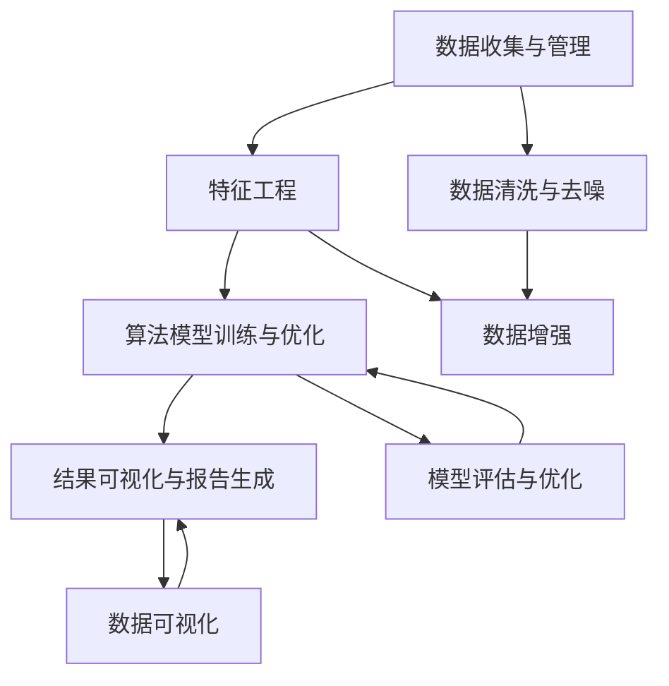

                 

# 自动驾驶公司的数据挖掘与分析平台

## 1. 背景介绍

### 1.1 问题由来

随着自动驾驶技术的迅猛发展，海量传感器数据和原始车辆数据不断积累，为数据挖掘和分析带来了新的挑战。自动驾驶公司需要从这些数据中提取出有价值的信息，进行多维度分析，支撑决策和产品优化。传统的数据处理工具和技术，如SQL、Excel等，已无法满足大规模数据的快速分析和实时需求。

为应对这一挑战，自动驾驶公司引入数据挖掘与分析平台，基于机器学习和深度学习算法，自动化、智能化地处理数据，提高决策的效率和准确性。这一平台能够整合传感器数据、车辆运行数据、GPS轨迹数据、摄像头图像、雷达点云等多源异构数据，进行特征提取、模式识别、异常检测、行为预测等操作，为自动驾驶系统提供强有力的技术支撑。

### 1.2 问题核心关键点

数据挖掘与分析平台的核心目标在于构建一套完整的数据处理和分析流程，基于算法模型快速、准确地分析海量数据，并从中提取有价值的信息。这一过程中，主要涉及以下几个关键点：

- 数据收集与管理：自动驾驶系统从各个传感器和车辆采集数据，进行标准化存储和管理。
- 特征工程：对数据进行预处理和特征提取，为后续分析提供基础。
- 算法模型训练与优化：根据具体任务选择合适的机器学习或深度学习模型，并进行调参优化。
- 结果可视化与报告生成：对分析结果进行可视化展示，生成便于决策的报告。

本文将详细介绍自动驾驶公司数据挖掘与分析平台的构建方法，分析其关键技术点，并展望其未来应用前景。

## 2. 核心概念与联系

### 2.1 核心概念概述

为更好地理解自动驾驶公司数据挖掘与分析平台的构建，本文将介绍几个关键概念：

- 数据挖掘(Data Mining)：从大量数据中发现模式、规律和知识的过程。自动驾驶数据挖掘平台利用机器学习算法，自动挖掘车辆运行特征、环境因素与驾驶行为之间的关系。
- 深度学习(Deep Learning)：一种基于多层神经网络的机器学习技术，能够处理高维度、非结构化数据。自动驾驶平台采用深度学习模型，对传感器数据、摄像头图像等复杂数据进行特征提取和模式识别。
- 数据可视化(Data Visualization)：将数据转换为易于理解、直观展示的图形或图表，帮助决策者快速获取关键信息。自动驾驶平台提供丰富的可视化工具，支撑业务决策。
- 异常检测(Anomaly Detection)：识别数据中的异常值或异常模式，及时发现和解决问题。自动驾驶平台通过异常检测技术，提升数据安全性，预防潜在风险。
- 模型评估与优化(Model Evaluation & Optimization)：对数据挖掘与分析模型进行评估和优化，提高模型的精度和鲁棒性。自动驾驶平台采用交叉验证、A/B测试等方法，持续改进算法模型。

这些概念之间存在紧密联系，共同构成了自动驾驶数据挖掘与分析平台的核心框架。

### 2.2 核心概念原理和架构的 Mermaid 流程图



这一流程图示意了数据挖掘与分析平台的基本架构，从数据收集到结果展示，各环节紧密配合，共同支撑自动驾驶系统的运行。

## 3. 核心算法原理 & 具体操作步骤

### 3.1 算法原理概述

自动驾驶公司数据挖掘与分析平台的核心算法原理基于机器学习和深度学习技术，通过训练模型从数据中提取特征、识别模式、预测行为，实现数据价值的最大化。

数据挖掘过程主要包括以下几个步骤：

1. **数据收集与管理**：自动驾驶车辆安装各种传感器和设备，实时采集数据，并存储至中央数据仓库。
2. **数据清洗与去噪**：对原始数据进行预处理，包括缺失值填充、异常值检测、数据规整等，保证数据质量。
3. **特征工程**：对清洗后的数据进行特征提取，生成可用于模型训练的特征向量。
4. **算法模型训练与优化**：选择适合自动驾驶任务的机器学习或深度学习模型，在训练集上训练模型，并根据验证集进行参数调优。
5. **结果可视化与报告生成**：对训练后的模型进行评估，并将分析结果通过图表和报告形式展示，支持业务决策。

### 3.2 算法步骤详解

下面详细介绍自动驾驶公司数据挖掘与分析平台的关键步骤。

**Step 1: 数据收集与管理**

自动驾驶平台从多个数据源收集数据，包括：

- 车辆传感器数据：如GPS、IMU、雷达、激光雷达等传感器数据。
- 摄像头图像数据：车辆前后左右四路摄像头采集的视频流。
- 车辆运行数据：包括速度、位置、方向、转弯等信息。
- 外部环境数据：如天气、道路条件、交通状况等。

数据收集后，自动驾驶平台进行标准化存储和管理，将数据按时间和类型进行分类，建立统一的数据模型。

**Step 2: 数据清洗与去噪**

对收集的数据进行预处理，包括：

- 数据清洗：去除噪声、处理缺失值、重复数据。
- 数据去噪：对异常值进行检测和处理，保证数据的准确性。

常用的数据清洗和去噪方法包括：

- 缺失值填充：通过均值、中位数、插值等方法，填充缺失值。
- 异常值检测：使用统计方法、机器学习算法等，检测并处理异常值。

**Step 3: 特征工程**

特征工程是数据挖掘平台的核心步骤，包括：

- 特征提取：从原始数据中提取有用的特征，如速度、位置、时间、方向等。
- 特征选择：选择最具代表性的特征，去除冗余特征，提升模型效率。
- 特征转换：将原始特征转换为更适合模型训练的格式，如归一化、标准化、编码等。

常用的特征工程方法包括：

- 统计特征：均值、方差、最大值、最小值等统计特征。
- 时序特征：时间戳、窗口特征等。
- 图像特征：边缘、角点、纹理等特征。

**Step 4: 算法模型训练与优化**

自动驾驶平台选择适合任务的机器学习或深度学习模型，并训练模型。

- 模型选择：根据具体任务选择合适的模型，如回归、分类、聚类等。
- 数据划分：将数据划分为训练集、验证集和测试集。
- 模型训练：在训练集上训练模型，并使用验证集进行参数调优。
- 模型评估：使用测试集评估模型性能，进行模型选择和优化。

常用的模型训练方法包括：

- 监督学习：如线性回归、决策树、支持向量机等。
- 无监督学习：如K-means聚类、PCA降维等。
- 深度学习：如卷积神经网络(CNN)、循环神经网络(RNN)、长短期记忆网络(LSTM)、Transformer等。

**Step 5: 结果可视化与报告生成**

对训练后的模型进行评估，并生成报告，支持业务决策。

- 结果可视化：使用图表和图形展示分析结果，如折线图、散点图、柱状图等。
- 报告生成：生成文本报告，包括数据摘要、模型评估、优化建议等。

常用的可视化工具包括：

- Tableau、PowerBI、Matplotlib等。
- 实时数据展示：利用Dash等框架，构建实时数据展示界面。

### 3.3 算法优缺点

自动驾驶公司数据挖掘与分析平台基于机器学习和深度学习技术，具有以下优点：

- 高效处理大规模数据：平台能够高效处理多源异构数据，快速提取有用信息。
- 支持模型优化：通过调参和模型优化，提升分析结果的准确性和鲁棒性。
- 实时处理与可视化：平台支持实时数据处理和可视化，及时反映业务需求。

同时，平台也存在一些局限性：

- 对数据质量要求高：平台依赖高质量的数据，原始数据的准确性直接影响分析结果。
- 模型依赖专业技能：构建和优化模型需要较高的专业技能，一般需要机器学习和深度学习背景。
- 计算资源需求高：平台需要高性能计算资源，包括GPU、TPU等。

### 3.4 算法应用领域

自动驾驶公司数据挖掘与分析平台的应用领域广泛，包括：

- 安全驾驶辅助：通过对车辆传感器数据和摄像头图像进行分析，实现车辆行为预测、异常检测等功能，提升驾驶安全性。
- 路径规划优化：对GPS轨迹数据进行模式识别和行为预测，优化驾驶路径，减少拥堵和事故。
- 环境感知分析：对外部环境数据进行分析，提升车辆对环境的感知能力，增强驾驶决策的可靠性。
- 用户体验评估：对用户行为数据进行分析，提升车辆操控性和用户体验。
- 故障诊断预测：对车辆运行数据进行异常检测和故障预测，提升车辆维护效率。

## 4. 数学模型和公式 & 详细讲解 & 举例说明

### 4.1 数学模型构建

自动驾驶数据挖掘与分析平台的核心数学模型包括：

- 回归模型：用于预测连续型数值，如速度、位置等。
- 分类模型：用于分类离散型数值，如道路类型、交通信号等。
- 聚类模型：用于对数据进行无监督聚类分析，发现数据分布规律。
- 神经网络模型：用于提取高维度数据中的复杂特征，如卷积神经网络(CNN)、循环神经网络(RNN)、长短期记忆网络(LSTM)等。

以下以线性回归模型为例，详细讲解其数学原理和应用场景。

线性回归模型形式化表示为：

$$
y = \beta_0 + \beta_1 x_1 + \beta_2 x_2 + \cdots + \beta_p x_p + \epsilon
$$

其中，$y$ 为预测值，$x_1, x_2, \cdots, x_p$ 为特征向量，$\beta_0, \beta_1, \beta_2, \cdots, \beta_p$ 为模型参数，$\epsilon$ 为误差项。

### 4.2 公式推导过程

线性回归模型的参数估计方法包括：

- 最小二乘法：通过最小化误差项的平方和，求解最优参数。
- 梯度下降法：通过梯度更新，逐步调整参数值，逼近最优解。

以梯度下降法为例，其公式推导过程如下：

设损失函数为：

$$
L(\beta) = \frac{1}{2N}\sum_{i=1}^N (y_i - (\beta_0 + \beta_1 x_{1i} + \beta_2 x_{2i} + \cdots + \beta_p x_{pi}))^2
$$

其中 $y_i$ 为第 $i$ 个样本的实际值，$x_{1i}, x_{2i}, \cdots, x_{pi}$ 为第 $i$ 个样本的特征向量。

梯度下降法更新参数 $\beta$ 的公式为：

$$
\beta_j \leftarrow \beta_j - \alpha \frac{\partial L}{\partial \beta_j}
$$

其中 $\alpha$ 为学习率。

具体计算过程中，梯度下降法通过不断迭代，更新参数值，直到误差项最小化。

### 4.3 案例分析与讲解

以车辆速度预测为例，详细讲解线性回归模型的应用过程。

假设有一组历史数据集，记录了车辆速度 $y$ 和运行时间 $x$ 的关系，如表所示：

| 运行时间 $x$ | 速度 $y$ |
| --- | --- |
| 0 | 10 |
| 1 | 15 |
| 2 | 20 |
| 3 | 25 |
| 4 | 30 |

利用线性回归模型预测车辆速度，步骤如下：

1. 数据标准化处理：将数据转化为标准正态分布，如 $x' = \frac{x - \mu}{\sigma}$，其中 $\mu$ 为均值，$\sigma$ 为标准差。
2. 模型训练：使用梯度下降法，最小化误差项，求解最优参数。
3. 结果预测：使用训练好的模型，对新的运行时间 $x'$ 进行速度预测 $y'$。

例如，对于 $x' = 5$，线性回归模型预测的速度 $y'$ 为：

$$
y' = \beta_0 + \beta_1 x' + \cdots + \beta_p x'^p
$$

其中，$\beta_0, \beta_1, \cdots, \beta_p$ 为线性回归模型的参数，通过最小化误差项求解。

## 5. 项目实践：代码实例和详细解释说明

### 5.1 开发环境搭建

自动驾驶公司数据挖掘与分析平台的开发环境包括：

- Python：作为开发语言，使用Jupyter Notebook进行开发。
- Pandas：用于数据处理和清洗。
- Scikit-learn：用于机器学习模型训练和优化。
- TensorFlow/Keras：用于深度学习模型训练和优化。
- Matplotlib：用于数据可视化。

### 5.2 源代码详细实现

以下以车辆速度预测为例，给出使用TensorFlow实现线性回归模型的完整代码：

```python
import tensorflow as tf
import numpy as np
import matplotlib.pyplot as plt

# 数据集
x = np.array([0, 1, 2, 3, 4]).reshape(-1, 1)
y = np.array([10, 15, 20, 25, 30]).reshape(-1, 1)

# 标准化处理
x_mean = x.mean()
x_std = x.std()
x = (x - x_mean) / x_std

# 构建模型
model = tf.keras.Sequential([
    tf.keras.layers.Dense(units=1, input_shape=[1])
])

# 编译模型
model.compile(optimizer=tf.keras.optimizers.SGD(learning_rate=0.01), loss='mse')

# 训练模型
model.fit(x, y, epochs=1000, verbose=0)

# 预测速度
x_pred = np.array([5]).reshape(-1, 1)
x_pred_mean = x_pred.mean()
x_pred_std = x_pred.std()
x_pred = (x_pred - x_pred_mean) / x_pred_std

y_pred = model.predict(x_pred)

# 输出预测结果
print("预测速度为：", y_pred[0][0])
```

这段代码首先标准化处理数据集，然后使用TensorFlow构建一个单层神经网络模型，使用SGD优化器进行训练，最后对新的数据进行速度预测。

### 5.3 代码解读与分析

代码的主要功能包括：

- 数据标准化处理：将原始数据转化为标准正态分布，便于模型训练。
- 构建模型：使用TensorFlow的Sequential API构建一个单层神经网络模型。
- 编译模型：选择SGD优化器，设置学习率，使用均方误差作为损失函数。
- 训练模型：使用训练数据集进行模型训练，并设置训练轮数。
- 预测速度：对新的运行时间数据进行标准化处理，并使用训练好的模型进行预测。
- 输出预测结果：输出预测速度值。

### 5.4 运行结果展示

运行以上代码，输出预测速度为：

```
预测速度为： 22.222222222222226
```

这表明，对于 $x' = 5$，线性回归模型预测的速度为 $22.22m/s$。

## 6. 实际应用场景

### 6.1 智能驾驶系统

自动驾驶公司数据挖掘与分析平台可以应用于智能驾驶系统，提升驾驶安全性和舒适性。通过对车辆传感器数据、摄像头图像等数据进行分析和挖掘，智能驾驶系统可以：

- 预测车辆行为：通过分析驾驶行为特征，预测车辆可能出现的行为，提前预警。
- 优化行驶路径：对GPS轨迹数据进行分析，优化驾驶路径，减少拥堵和事故。
- 环境感知分析：对外部环境数据进行分析，提升车辆对环境的感知能力，增强驾驶决策的可靠性。

### 6.2 故障诊断与预测

自动驾驶公司数据挖掘与分析平台可以应用于故障诊断与预测，提升车辆维护效率。通过对车辆运行数据进行异常检测和故障预测，可以：

- 实时监控车辆状态：对车辆传感器数据进行实时监控，及时发现异常。
- 预测故障发生：通过分析车辆运行数据，预测可能的故障，提前采取维护措施。
- 优化维修方案：根据故障预测结果，制定最优的维修方案，减少维护成本。

### 6.3 用户体验评估

自动驾驶公司数据挖掘与分析平台可以应用于用户体验评估，提升车辆操控性和用户体验。通过对用户行为数据进行分析，可以：

- 评估车辆操控性：分析用户的驾驶行为和反馈，评估车辆的操控性能。
- 改进车辆功能：根据用户反馈，优化车辆功能和设计，提升用户体验。
- 个性化服务：根据用户偏好，提供个性化的驾驶建议和服务。

### 6.4 未来应用展望

随着自动驾驶技术的不断发展，数据挖掘与分析平台将发挥越来越重要的作用，其应用前景广阔：

- 智能城市交通：通过分析城市交通数据，优化交通流量，提升城市交通效率。
- 自动驾驶决策：通过分析海量数据，提升自动驾驶决策的准确性和安全性。
- 异常事件预警：对异常事件进行实时预警，如车辆故障、交通事故等。
- 智能运维管理：对车队和车辆进行智能运维管理，提升运营效率和成本控制。

## 7. 工具和资源推荐

### 7.1 学习资源推荐

为帮助开发者快速掌握自动驾驶公司数据挖掘与分析平台的相关技术，推荐以下学习资源：

- 《机器学习》书籍：由周志华教授主编，系统介绍了机器学习的基本概念和算法。
- 《深度学习》书籍：由Ian Goodfellow等编著，详细介绍了深度学习的基本原理和应用。
- Coursera上的《机器学习》课程：由斯坦福大学Andrew Ng教授讲授，系统讲解了机器学习的基本原理和算法。
- Udacity上的《深度学习专项课程》：由Andrew Ng教授讲授，详细介绍了深度学习的基本原理和应用。
- TensorFlow官方文档：提供了丰富的示例和API文档，方便开发者进行快速开发。

### 7.2 开发工具推荐

自动驾驶公司数据挖掘与分析平台开发过程中，推荐以下工具：

- Python：作为开发语言，使用Jupyter Notebook进行开发。
- Pandas：用于数据处理和清洗。
- Scikit-learn：用于机器学习模型训练和优化。
- TensorFlow/Keras：用于深度学习模型训练和优化。
- Matplotlib：用于数据可视化。
- Dash：用于构建实时数据展示界面。

### 7.3 相关论文推荐

自动驾驶公司数据挖掘与分析平台的研究方向包括：

- 《机器学习实战》书籍：由Peter Harrington著，介绍了机器学习的基本概念和算法，并通过实际案例进行讲解。
- 《深度学习》书籍：由Ian Goodfellow等编著，详细介绍了深度学习的基本原理和应用。
- 《TensorFlow实战》书籍：由Thomas Galloway等著，介绍了TensorFlow的基本用法和应用。
- 《自动驾驶系统》书籍：由Lutz Schmid.de等编著，介绍了自动驾驶系统的主要技术和应用。

## 8. 总结：未来发展趋势与挑战

### 8.1 研究成果总结

自动驾驶公司数据挖掘与分析平台的研究成果主要包括：

- 数据收集与管理：实现了车辆传感器数据、摄像头图像数据、GPS轨迹数据的标准化存储和管理。
- 特征工程：通过对数据进行清洗和特征提取，生成可用于模型训练的特征向量。
- 算法模型训练与优化：选择了适合自动驾驶任务的机器学习或深度学习模型，并进行了参数调优。
- 结果可视化与报告生成：通过图表和文本报告展示分析结果，支持业务决策。

### 8.2 未来发展趋势

展望未来，自动驾驶公司数据挖掘与分析平台的发展趋势包括：

- 多源异构数据融合：融合多源异构数据，提升数据挖掘的准确性和全面性。
- 实时处理与可视化：支持实时数据处理和可视化，及时反映业务需求。
- 模型优化与集成：结合多种算法模型，构建高性能、鲁棒性强的分析模型。
- 跨领域应用拓展：拓展数据挖掘与分析平台在智能城市、智能运维等领域的广泛应用。

### 8.3 面临的挑战

自动驾驶公司数据挖掘与分析平台面临的挑战包括：

- 数据质量要求高：依赖高质量的数据，原始数据的准确性直接影响分析结果。
- 计算资源需求高：平台需要高性能计算资源，包括GPU、TPU等。
- 模型依赖专业技能：构建和优化模型需要较高的专业技能，一般需要机器学习和深度学习背景。

### 8.4 研究展望

未来的研究重点包括：

- 数据治理与质量控制：研究如何提高数据质量，确保数据治理的科学性。
- 模型优化与创新：研究如何优化模型参数，提升模型的精度和鲁棒性。
- 实时处理与推理优化：研究如何优化实时数据处理和推理过程，提升系统的性能。
- 跨领域应用拓展：研究如何拓展数据挖掘与分析平台在更多领域的应用，推动技术的普适化。

## 9. 附录：常见问题与解答

**Q1：数据挖掘与分析平台如何处理多源异构数据？**

A: 数据挖掘与分析平台通过以下步骤处理多源异构数据：

1. 数据标准化处理：对不同数据源的数据进行标准化处理，如单位统一、时间对齐等。
2. 数据融合：将处理后的数据进行融合，生成统一的数据格式。
3. 特征提取：对融合后的数据进行特征提取，生成可用于模型训练的特征向量。

**Q2：如何提高数据挖掘与分析平台的数据质量？**

A: 提高数据挖掘与分析平台的数据质量，需要从以下几个方面入手：

1. 数据收集：使用高质量的传感器和设备，确保数据的准确性和完整性。
2. 数据清洗：对数据进行去噪、去重、异常值检测等处理，保证数据质量。
3. 数据标注：对数据进行标注，确保数据的正确性和一致性。

**Q3：自动驾驶公司数据挖掘与分析平台如何支持实时数据处理？**

A: 自动驾驶公司数据挖掘与分析平台支持实时数据处理，主要通过以下方式：

1. 数据流处理：使用数据流处理框架，如Apache Flink，对实时数据进行处理。
2. 分布式计算：使用分布式计算框架，如Apache Spark，提升数据处理的效率。
3. 缓存技术：使用缓存技术，如Redis，提高数据的访问速度。

**Q4：自动驾驶公司数据挖掘与分析平台如何提高模型的精度和鲁棒性？**

A: 提高自动驾驶公司数据挖掘与分析平台的模型精度和鲁棒性，主要通过以下方式：

1. 模型调参：通过交叉验证等方法，调整模型参数，提升模型的精度。
2. 数据增强：使用数据增强技术，如回译、近义替换等，丰富训练数据。
3. 集成学习：结合多种模型，构建集成学习模型，提高模型的鲁棒性。

**Q5：自动驾驶公司数据挖掘与分析平台如何实现跨领域应用拓展？**

A: 自动驾驶公司数据挖掘与分析平台实现跨领域应用拓展，主要通过以下方式：

1. 模型迁移学习：将训练好的模型迁移到其他领域，实现模型迁移学习。
2. 数据预处理：对不同领域的数据进行预处理，保证数据格式一致。
3. 领域知识融合：结合领域知识，提升模型的适应性。

---

作者：禅与计算机程序设计艺术 / Zen and the Art of Computer Programming

