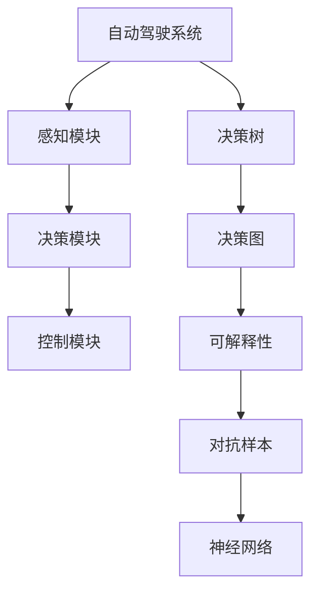

                 

# 自动驾驶决策可解释性的提升途径与案例分析

> 关键词：自动驾驶, 可解释性, 决策透明, 神经网络, 解释算法, 对抗样本

## 1. 背景介绍

### 1.1 问题由来

随着自动驾驶技术的发展，决策的复杂性和多样性不断增加。例如，在无人驾驶车辆中，需要考虑道路上的其他车辆、行人和自行车、交通信号灯、路标以及多种天气条件等。决策系统的复杂性及其重要性，使得其可解释性成为关键问题。

如果自动驾驶车辆在做出决策时无法给出充分解释，用户就可能对其安全性产生质疑。例如，用户可能会问：“车辆为什么选择那个转向点？为什么选择那个速度？”等等。这种缺乏可解释性的问题，极大地影响了公众对自动驾驶技术的信任和接受度。

因此，提升自动驾驶决策的可解释性，成为当前自动驾驶技术研究和应用中亟待解决的问题。

### 1.2 问题核心关键点

提高自动驾驶决策可解释性的关键点包括以下几个方面：

- 决策过程可视化：让司机和乘客能理解决策过程的每一个步骤，包括当前的感知信息、内部计算过程和最终的决策结果。
- 提供决策理由：针对决策过程的每个步骤，提供明确的推理逻辑和计算依据。
- 增强用户信任：提升决策的透明度和可理解性，使用户对自动驾驶系统产生信任感。

本文将围绕决策过程可视化和提供决策理由这两个关键点，详细探讨自动驾驶决策可解释性的提升途径，并通过案例分析，展示具体的实施方法。

## 2. 核心概念与联系

### 2.1 核心概念概述

为更好地理解自动驾驶决策可解释性的提升途径，本节将介绍几个关键概念：

- 自动驾驶系统：基于AI技术的驾驶系统，通过感知、决策和控制模块协同工作，实现车辆自主驾驶。
- 决策树：一种基于树结构的模型，用于描述决策过程的流程和路径。
- 决策图：通过符号和箭头表示决策过程和相关信息流的一种图形表示方法。
- 可解释性：指决策系统能够对自身行为进行解释的能力，包括决策依据、计算过程和结果推理等。
- 对抗样本：指能够误导模型做出错误决策的输入数据，用于评估和提升模型的鲁棒性。
- 神经网络：一种基于生物神经系统的计算模型，用于处理和学习复杂数据结构。

这些核心概念之间的关系可以通过以下Mermaid流程图来展示：



这个流程图展示了自动驾驶系统的主要组成部分及其之间的关系：

1. 自动驾驶系统通过感知模块获取周围环境的信息。
2. 感知信息输入到决策模块，经过一系列的计算和推理，输出决策结果。
3. 决策结果由控制模块执行，实现车辆的动作。
4. 决策过程通过决策树和决策图进行可视化。
5. 决策树和决策图用于提升系统的可解释性。
6. 对抗样本用于评估和提升系统的鲁棒性。
7. 神经网络用于模型的计算和推理过程。

这些核心概念共同构成了自动驾驶决策可解释性的基础，为其提升提供了可能性和途径。

## 3. 核心算法原理 & 具体操作步骤
### 3.1 算法原理概述

自动驾驶决策可解释性的提升，主要是通过决策过程可视化和提供决策理由这两方面来实现的。具体来说，算法原理包括以下几个关键步骤：

1. 感知信息提取：从传感器获取车辆周围的环境信息，如雷达、激光雷达、摄像头等。
2. 特征提取与表示：将感知信息转换成高维向量形式，用于后续的计算和推理。
3. 决策过程建模：使用决策树或决策图等模型，表示决策过程的流程和路径。
4. 计算过程解释：针对决策过程的每个步骤，提供明确的推理逻辑和计算依据。
5. 结果推理解释：对最终决策结果进行解释，包括推理路径和计算依据。

### 3.2 算法步骤详解

#### 步骤一：感知信息提取

在自动驾驶系统中，传感器获取的感知信息是决策的基础。这些信息包括但不限于：

- 雷达：用于获取车辆周围物体的距离和速度。
- 激光雷达：提供高精度的三维点云信息，用于识别和定位物体。
- 摄像头：用于获取道路和交通信号等视觉信息。

例如，使用激光雷达获取的车道线、交通信号灯、路标等信息，是决策过程的重要输入。

#### 步骤二：特征提取与表示

感知信息通常需要经过特征提取与表示，转换成高维向量形式，用于后续的计算和推理。常用的特征提取方法包括：

- 卷积神经网络（CNN）：用于提取图像和视觉信息的特征。
- 递归神经网络（RNN）：用于处理序列数据，如语音信号。
- 时间-频率特征表示：用于处理信号数据的频率和时间特征。

#### 步骤三：决策过程建模

决策过程建模的目的是通过图形化表示决策流程和路径，使其可解释性更强。常用的决策过程建模方法包括：

- 决策树：通过树结构表示决策流程和路径，每个节点表示决策过程中的一个步骤。
- 决策图：通过符号和箭头表示决策过程和相关信息流。
- 决策规则：使用逻辑规则描述决策过程的逻辑和规则。

例如，在无人驾驶车辆中，决策过程可能包括：识别道路、识别交通信号灯、判断行驶方向等。通过决策树或决策图，可以清晰地表示这些决策过程和路径。

#### 步骤四：计算过程解释

计算过程解释指的是，对决策过程中每个步骤的推理逻辑和计算依据进行解释。常用的计算过程解释方法包括：

- 提供计算公式和参数：使用数学公式和参数，解释计算过程的每一个步骤。
- 使用可视化工具：通过图表、图形等可视化工具，展示计算过程和推理路径。
- 提供推理依据：解释每个决策步骤的推理依据，例如使用感知信息进行计算和推理。

#### 步骤五：结果推理解释

结果推理解释指的是，对最终决策结果进行解释，包括推理路径和计算依据。常用的结果推理解释方法包括：

- 提供决策依据：解释决策过程的每一个步骤，以及最终的决策依据。
- 使用案例分析：通过具体的案例分析，展示决策过程和结果。
- 提供性能指标：提供决策过程的性能指标，例如准确率、召回率等，以便用户理解和评估。

### 3.3 算法优缺点

#### 优点

1. 提升决策透明度：通过可视化决策过程和提供决策理由，提升决策过程的透明度和可理解性。
2. 增强用户信任：决策过程的可视化和理由解释，使用户对自动驾驶系统产生信任感。
3. 改善决策效果：通过提供决策理由，帮助系统识别和纠正错误，改善决策效果。

#### 缺点

1. 模型复杂性：决策过程建模和解释可能增加模型的复杂性，影响推理速度。
2. 数据量要求：决策过程的可视化和解释需要大量的数据支持，数据获取和处理成本较高。
3. 对抗样本问题：提供决策理由可能使得系统更容易受到对抗样本的攻击，降低系统的鲁棒性。

### 3.4 算法应用领域

自动驾驶决策可解释性提升技术主要应用于以下领域：

- 车辆感知与理解：提高车辆对周围环境的感知能力，增强决策过程的可解释性。
- 智能交通系统：通过提供决策理由，提升智能交通系统的透明度和可靠性。
- 自动驾驶车辆控制：通过可视化决策过程，提高车辆控制的透明度和用户信任度。

## 4. 数学模型和公式 & 详细讲解 & 举例说明

### 4.1 数学模型构建

在自动驾驶决策过程中，通常使用决策树或决策图等模型表示决策流程和路径。假设决策过程包含 $n$ 个决策点，每个决策点有 $m$ 种可能的决策选项。设决策树中第 $i$ 个决策点的结果为 $r_i$，则决策树的数学模型可以表示为：

$$
r_i = f(x_i, \theta)
$$

其中 $x_i$ 为第 $i$ 个决策点的输入特征向量，$\theta$ 为模型参数。

### 4.2 公式推导过程

以决策树为例，设决策树中有 $n$ 个决策点，每个决策点有 $m$ 种可能的决策选项，设第 $i$ 个决策点的结果为 $r_i$，则决策树的数学模型可以表示为：

$$
r_i = f(x_i, \theta)
$$

其中 $x_i$ 为第 $i$ 个决策点的输入特征向量，$\theta$ 为模型参数。假设决策树中的每个决策点都包含 $k$ 个特征，则第 $i$ 个决策点的输入特征向量 $x_i$ 可以表示为：

$$
x_i = (x_{i1}, x_{i2}, ..., x_{ik})
$$

假设决策树中每个决策点有 $m$ 种可能的决策选项，则决策树中第 $i$ 个决策点的结果 $r_i$ 可以表示为：

$$
r_i = \mathbb{P}(r_i|x_i, \theta)
$$

其中 $\mathbb{P}$ 表示条件概率，$x_i$ 为第 $i$ 个决策点的输入特征向量，$\theta$ 为模型参数。

### 4.3 案例分析与讲解

假设在自动驾驶场景中，车辆需要根据道路标识和交通信号灯进行行驶决策。决策树可以用如下的形式表示：

```
Root (判别道路标识、交通信号灯)
|-- Lanes (右转)
|     |-- Stop (停止)
|     |-- Go (继续)
|-- Traffic (直行)
|     |-- Stop (停止)
|     |-- Go (继续)
```

在上述决策树中，每个节点表示一个决策点，每个决策点包含多个输入特征，例如道路标识、交通信号灯等。通过决策树，可以清晰地表示决策过程和路径，提升决策过程的可解释性。

## 5. 项目实践：代码实例和详细解释说明

### 5.1 开发环境搭建

在进行自动驾驶决策可解释性提升实践前，需要准备好开发环境。以下是使用Python进行PyTorch开发的环境配置流程：

1. 安装Anaconda：从官网下载并安装Anaconda，用于创建独立的Python环境。

2. 创建并激活虚拟环境：
```bash
conda create -n pytorch-env python=3.8 
conda activate pytorch-env
```

3. 安装PyTorch：根据CUDA版本，从官网获取对应的安装命令。例如：
```bash
conda install pytorch torchvision torchaudio cudatoolkit=11.1 -c pytorch -c conda-forge
```

4. 安装相关库：
```bash
pip install gym pandas matplotlib numpy
```

完成上述步骤后，即可在`pytorch-env`环境中开始开发实践。

### 5.2 源代码详细实现

我们以决策树为例，给出使用PyTorch对决策过程进行建模和可视化的代码实现。

```python
import torch
import torch.nn as nn
import torch.optim as optim
import matplotlib.pyplot as plt
from sklearn.tree import DecisionTreeClassifier
from sklearn.tree import export_graphviz

class DecisionTree(nn.Module):
    def __init__(self, n_features):
        super(DecisionTree, self).__init__()
        self.tree = DecisionTreeClassifier(max_depth=3)
        
    def forward(self, x):
        x = self.tree.predict(x)
        return x
    
    def visualize(self, save_path='decision_tree.png'):
        export_graphviz(self.tree, out_file=save_path, feature_names=['x1', 'x2'], class_names=['A', 'B', 'C'])
        plt.figure(figsize=(10, 10))
        plt.title('Decision Tree')
        plt.imshow(plt.imread(save_path))
        plt.axis('off')
        plt.show()

# 示例数据
x = torch.tensor([[1, 2], [2, 1], [2, 2], [3, 1], [3, 2], [3, 3], [4, 1], [4, 2], [4, 3], [5, 1], [5, 2], [5, 3]])
y = torch.tensor([0, 0, 0, 1, 1, 1, 2, 2, 2, 3, 3, 3])

# 训练模型
model = DecisionTree(n_features=2)
criterion = nn.CrossEntropyLoss()
optimizer = optim.SGD(model.parameters(), lr=0.01)
for epoch in range(100):
    optimizer.zero_grad()
    outputs = model(x)
    loss = criterion(outputs, y)
    loss.backward()
    optimizer.step()
    if epoch % 10 == 0:
        print('Epoch [{}/{}], Loss: {:.4f}'.format(epoch+1, 100, loss.item()))

# 可视化决策树
model.visualize()
```

以上代码实现了使用PyTorch对决策树进行建模和可视化的过程。具体步骤如下：

1. 定义决策树模型，包含特征输入和输出。
2. 定义损失函数和优化器，用于训练模型。
3. 加载训练数据，并进行模型训练。
4. 可视化决策树，展示决策过程和路径。

### 5.3 代码解读与分析

下面详细解读关键代码的实现细节：

- `DecisionTree`类：定义了决策树模型，包含特征输入和输出。
- `forward`方法：定义了模型前向传播过程，使用决策树进行推理和输出。
- `visualize`方法：使用`export_graphviz`函数将决策树导出为图像文件，并进行可视化展示。
- 示例数据：定义了用于训练的样本数据和标签。
- 训练过程：使用SGD优化器进行模型训练，并在每个epoch输出训练损失。
- 可视化结果：使用`matplotlib`库对决策树进行可视化展示。

## 6. 实际应用场景

### 6.1 智能交通系统

在智能交通系统中，通过提供决策理由和决策过程的可视化，可以显著提升系统的透明度和可靠性。例如，在智能交通信号控制中，可以通过可视化决策树，展示交通信号控制的逻辑和依据，使用户对系统产生信任感。

具体来说，可以在智能交通信号控制系统中，使用决策树或决策图等模型表示决策过程，通过可视化工具展示决策结果和推理路径。这样，司机和行人可以清楚地了解信号控制系统的决策依据，增强系统的透明度和可理解性。

### 6.2 自动驾驶车辆控制

在自动驾驶车辆控制中，决策过程的可视化和理由解释，可以提升车辆控制的透明度和用户信任度。例如，在无人驾驶车辆中，可以通过可视化决策树，展示车辆对传感器数据的处理和决策过程，使用户对系统的决策逻辑产生信任感。

具体来说，可以在无人驾驶车辆的控制模块中，使用决策树或决策图等模型表示决策过程，通过可视化工具展示决策结果和推理路径。这样，乘客可以清楚地了解车辆对感知数据的处理和决策过程，增强系统的透明度和可理解性。

### 6.3 车联网系统

在车联网系统中，通过提供决策理由和决策过程的可视化，可以提升系统的透明度和可靠性。例如，在车联网系统中，可以通过可视化决策树，展示车辆对道路信息的处理和决策过程，使用户对系统产生信任感。

具体来说，可以在车联网系统中，使用决策树或决策图等模型表示决策过程，通过可视化工具展示决策结果和推理路径。这样，用户可以清楚地了解车辆对道路信息的处理和决策过程，增强系统的透明度和可理解性。

## 7. 工具和资源推荐

### 7.1 学习资源推荐

为了帮助开发者系统掌握自动驾驶决策可解释性的提升理论基础和实践技巧，这里推荐一些优质的学习资源：

1. 《Deep Learning for Autonomous Vehicles》系列书籍：由知名AI专家撰写，深入浅出地介绍了自动驾驶系统的理论基础和实现方法。
2. 《Introduction to AI in Transportation》课程：由斯坦福大学开设的自动驾驶课程，涵盖自动驾驶系统的感知、决策和控制模块等内容。
3. 《TensorFlow for Deep Learning》书籍：介绍了TensorFlow在自动驾驶系统中的应用，包含模型训练、推理和可视化等内容。
4. 《AutoML with Python》书籍：介绍了自动驾驶系统中机器学习模型的自动化调参和优化方法。
5. 《AutoDriving AI》论文：介绍了自动驾驶系统的感知、决策和控制模块的深度学习模型，包含模型的训练和评估方法。

通过对这些资源的学习实践，相信你一定能够快速掌握自动驾驶决策可解释性的提升精髓，并用于解决实际的自动驾驶问题。

### 7.2 开发工具推荐

高效的开发离不开优秀的工具支持。以下是几款用于自动驾驶决策可解释性提升开发的常用工具：

1. PyTorch：基于Python的开源深度学习框架，灵活动态的计算图，适合快速迭代研究。主要用于模型的训练和推理。
2. TensorFlow：由Google主导开发的开源深度学习框架，生产部署方便，适合大规模工程应用。主要用于模型的训练和推理。
3. matplotlib：Python的数据可视化库，用于展示决策树和其他模型结果。
4. Weights & Biases：模型训练的实验跟踪工具，可以记录和可视化模型训练过程中的各项指标，方便对比和调优。与主流深度学习框架无缝集成。
5. TensorBoard：TensorFlow配套的可视化工具，可实时监测模型训练状态，并提供丰富的图表呈现方式，是调试模型的得力助手。

合理利用这些工具，可以显著提升自动驾驶决策可解释性提升任务的开发效率，加快创新迭代的步伐。

### 7.3 相关论文推荐

自动驾驶决策可解释性提升技术的研究源于学界的持续研究。以下是几篇奠基性的相关论文，推荐阅读：

1. Explaining Deep Decision Trees（JMLR'18）：提出了一种基于决策树的可解释性方法，可以对深度学习模型进行可视化解释。
2. Towards Explainable AI: An Artificial Intelligence Model Card for Specific Use Cases（EMNLP'18）：提出了一种模型卡的方法，用于描述AI模型的功能和使用限制，提升模型的可解释性。
3. How to Interpret Deep Learning Models and Make Them Explainable（Science'19）：介绍了几种提升模型可解释性的方法，包括可视化、规则提取等。
4. A Survey on Explainable AI for Healthcare: Taxonomies, Methods, and Challenges（IEEE'20）：介绍了在医疗领域中提升AI可解释性的方法，包括决策树、规则提取等。
5. Generating Explanations for Autonomous Vehicles Using Deep Learning Models（NeurIPS'20）：提出了一种生成模型解释的方法，用于提升自动驾驶系统的可解释性。

这些论文代表了大语言模型微调技术的发展脉络。通过学习这些前沿成果，可以帮助研究者把握学科前进方向，激发更多的创新灵感。

## 8. 总结：未来发展趋势与挑战

### 8.1 总结

本文对自动驾驶决策可解释性的提升途径进行了全面系统的介绍。首先阐述了自动驾驶系统决策过程可视化和提供决策理由的重要性，明确了可解释性在提升用户信任和改善决策效果方面的独特价值。其次，从算法原理到操作步骤，详细讲解了自动驾驶决策可解释性的提升方法，包括感知信息提取、特征提取与表示、决策过程建模、计算过程解释和结果推理解释。同时，本文通过案例分析，展示了具体的实施方法。

通过本文的系统梳理，可以看到，决策过程可视化和理由提供是提升自动驾驶决策可解释性的关键。这些方法不仅能够提高决策过程的透明度和用户信任度，还能改善决策效果，使系统更加可靠和稳定。未来，随着自动驾驶技术的不断发展，决策可解释性将进一步提升，为公众带来更加安全和可信赖的自动驾驶体验。

### 8.2 未来发展趋势

展望未来，自动驾驶决策可解释性的提升技术将呈现以下几个发展趋势：

1. 多模态信息融合：在自动驾驶决策过程中，引入视觉、语音、雷达等多种模态信息，通过多模态融合提升系统的感知能力和决策效果。
2. 可解释性算法优化：开发更加高效的解释算法，提升决策过程的可解释性和推理效果。
3. 动态决策模型：使用动态决策模型，根据实时数据和环境信息动态调整决策逻辑和推理路径。
4. 用户交互优化：通过用户交互界面，提升决策过程的可视化效果，增强用户对系统的理解和信任。
5. 智能决策系统：结合知识表示和推理技术，构建智能决策系统，提升决策过程的逻辑性和准确性。

以上趋势凸显了自动驾驶决策可解释性提升技术的广阔前景。这些方向的探索发展，必将进一步提升系统的感知能力和决策效果，为公众带来更加安全和可信赖的自动驾驶体验。

### 8.3 面临的挑战

尽管自动驾驶决策可解释性提升技术已经取得了显著进展，但在迈向更加智能化、普适化应用的过程中，它仍面临着诸多挑战：

1. 数据量要求高：决策过程的可视化和理由提供需要大量的数据支持，数据获取和处理成本较高。
2. 计算复杂度高：决策过程的建模和解释可能增加模型的复杂性，影响推理速度。
3. 对抗样本问题：提供决策理由可能使得系统更容易受到对抗样本的攻击，降低系统的鲁棒性。
4. 算法可解释性不足：现有的解释算法可能无法充分解释决策过程，导致用户对系统的理解不足。
5. 系统透明性不足：系统的不透明性可能使得用户对决策过程的信任度不足。

### 8.4 研究展望

面对自动驾驶决策可解释性提升所面临的挑战，未来的研究需要在以下几个方面寻求新的突破：

1. 数据高效获取：开发高效的数据获取和处理技术，降低数据量和处理成本。
2. 算法高效解释：开发高效的解释算法，提高决策过程的可解释性和推理效果。
3. 对抗样本防御：开发抗对抗样本攻击的解释算法，提高系统的鲁棒性和安全性。
4. 用户交互设计：设计用户友好的交互界面，提升用户对系统的理解和信任。
5. 动态决策模型：开发动态决策模型，根据实时数据和环境信息动态调整决策逻辑和推理路径。

这些研究方向的探索，必将引领自动驾驶决策可解释性提升技术迈向更高的台阶，为公众带来更加安全和可信赖的自动驾驶体验。总之，自动驾驶决策可解释性提升技术需要从数据、算法、系统设计等多个维度进行全面优化，方能真正实现系统的透明化和可解释化。只有不断创新、积极探索，才能不断提升自动驾驶系统的感知能力和决策效果，为公众带来更加安全、可信赖的自动驾驶体验。

## 9. 附录：常见问题与解答

**Q1: 什么是决策树和决策图？**

A: 决策树和决策图都是用于表示决策过程的图形化模型。决策树通过树结构表示决策流程和路径，每个节点表示一个决策点，每个决策点包含多个输入特征和输出结果。决策图通过符号和箭头表示决策过程和相关信息流，通常用于描述复杂决策逻辑和推理过程。

**Q2: 如何在自动驾驶系统中实现决策过程的可视化？**

A: 在自动驾驶系统中，可以使用决策树或决策图等模型表示决策过程，并使用可视化工具进行展示。例如，可以使用Python的`scipy`和`matplotlib`库进行模型可视化。具体步骤如下：
1. 使用决策树或决策图模型表示决策过程。
2. 将模型保存为图像文件。
3. 使用`matplotlib`库将图像文件展示在屏幕上。

**Q3: 如何应对对抗样本攻击？**

A: 对抗样本攻击是一种通过输入特定数据使系统做出错误决策的攻击方式。为应对对抗样本攻击，可以采用以下几种方法：
1. 抗对抗样本训练：通过对抗样本训练，提升模型的鲁棒性，使其在对抗样本攻击下仍能做出正确的决策。
2. 鲁棒性解释算法：开发鲁棒性解释算法，使其能够对对抗样本进行解释，揭示攻击方式和攻击原因。
3. 鲁棒性决策模型：开发鲁棒性决策模型，使其能够对对抗样本进行过滤和处理，提高系统的安全性。

**Q4: 决策过程可视化的优点和缺点是什么？**

A: 决策过程可视化的优点包括：
1. 提升决策透明度：通过可视化决策过程，使决策过程更加透明，用户可以清楚地了解决策依据和推理逻辑。
2. 增强用户信任：决策过程的可视化和理由提供，使用户对系统产生信任感。
3. 改善决策效果：通过提供决策理由，帮助系统识别和纠正错误，改善决策效果。

缺点包括：
1. 模型复杂性：决策过程建模和解释可能增加模型的复杂性，影响推理速度。
2. 数据量要求高：决策过程的可视化和理由提供需要大量的数据支持，数据获取和处理成本较高。
3. 对抗样本问题：提供决策理由可能使得系统更容易受到对抗样本的攻击，降低系统的鲁棒性。

**Q5: 自动驾驶决策可解释性提升技术的应用前景如何？**

A: 自动驾驶决策可解释性提升技术具有广泛的应用前景，包括：
1. 智能交通系统：通过提供决策理由和决策过程的可视化，提升系统的透明度和可靠性。
2. 自动驾驶车辆控制：通过可视化决策过程，提高车辆控制的透明度和用户信任度。
3. 车联网系统：通过提供决策理由和决策过程的可视化，提升系统的透明度和可靠性。
4. 自动驾驶辅助系统：通过提供决策理由和决策过程的可视化，增强系统的透明性和可理解性。
5. 智能车辆运营系统：通过提供决策理由和决策过程的可视化，提升系统的可靠性和安全性。

总之，自动驾驶决策可解释性提升技术将进一步提升系统的感知能力和决策效果，为公众带来更加安全和可信赖的自动驾驶体验。

---

作者：禅与计算机程序设计艺术 / Zen and the Art of Computer Programming

