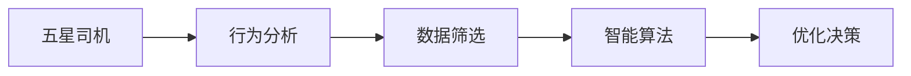

                 

# 自动驾驶界的五星司机数据筛选

> 关键词：自动驾驶,五星司机,数据筛选,车辆行为分析,智能算法,汽车行业,决策优化

## 1. 背景介绍

随着自动驾驶技术的发展，五星司机在自动驾驶领域显得尤为重要。五星司机是指在自动驾驶场景中表现出色的司机，他们的驾驶行为和决策模式对提升自动驾驶系统的安全性、可靠性和用户体验有着直接的影响。然而，在自动驾驶数据集中，如何准确筛选出五星司机是一个复杂且具有挑战性的问题。本文将详细介绍五星司机数据筛选的核心概念、算法原理和操作步骤，以及如何通过数学模型、项目实践和实际应用场景来实现五星司机的高效筛选。

## 2. 核心概念与联系

### 2.1 核心概念概述

在自动驾驶领域，五星司机数据筛选涉及以下几个关键概念：

- **五星司机**：在自动驾驶场景中，五星司机指的是那些能够安全、准确、高效地进行驾驶决策，并能快速响应突发情况的驾驶员。他们的行为模式往往更加稳定、规范，具有高水平的驾驶技能和丰富的驾驶经验。

- **数据筛选**：数据筛选是指在自动驾驶数据集中，通过特定的算法和模型，筛选出符合五星司机标准的行为数据。这是五星司机分析的重要前置步骤，对后续的决策优化和行为模式分析具有关键作用。

- **行为分析**：五星司机数据筛选的核心在于对车辆行为数据的详细分析。通过分析驾驶行为数据，可以获取驾驶员的反应时间、决策速度、路径规划等多个维度的信息。

- **智能算法**：智能算法是五星司机数据筛选的主要技术手段，包括机器学习、深度学习、强化学习等。这些算法能够从大量驾驶数据中提取特征，进行模式识别和分类，从而实现五星司机的自动识别。

### 2.2 核心概念原理和架构的 Mermaid 流程图



以上流程图示意了五星司机数据筛选的整体架构，从五星司机的识别到最终的决策优化，每一个步骤都是紧密相连、互为支撑的。

## 3. 核心算法原理 & 具体操作步骤

### 3.1 算法原理概述

五星司机数据筛选的核心算法原理主要基于数据驱动的机器学习和深度学习技术。算法首先通过行为分析模型对驾驶行为数据进行特征提取，再通过智能算法对提取的特征进行模式识别和分类，最终筛选出符合五星司机标准的行为数据。

在具体实现中，五星司机数据筛选过程可以分为以下几个步骤：

1. **数据收集**：从自动驾驶数据集中收集车辆的行为数据，包括驾驶行为、行驶路线、交通环境等多维度信息。
2. **特征提取**：对收集到的行为数据进行预处理和特征提取，识别出与五星司机相关的关键特征，如反应时间、决策速度、变道次数等。
3. **模式识别**：使用机器学习或深度学习算法，对提取出的特征进行模式识别和分类，识别出五星司机的行为模式。
4. **数据筛选**：根据模式识别结果，筛选出符合五星司机标准的行为数据，构建五星司机数据集。
5. **决策优化**：将五星司机数据集用于自动驾驶系统的决策优化，提升系统的安全性和可靠性。

### 3.2 算法步骤详解

#### 3.2.1 数据收集

数据收集是五星司机数据筛选的第一步。从自动驾驶数据集中，需要收集车辆的行为数据，包括但不限于以下几个方面：

- **驾驶行为数据**：包括加速、减速、转向、变道等行为数据，可以反映驾驶员的操作习惯和决策风格。
- **行驶路线数据**：车辆在道路上的行驶轨迹数据，可以反映驾驶员的路径规划能力。
- **交通环境数据**：车辆行驶时的交通状况、道路条件、天气情况等，可以影响驾驶员的反应和决策。

#### 3.2.2 特征提取

特征提取是五星司机数据筛选的核心步骤。在这一步骤中，需要从收集到的行为数据中提取关键特征，并对其进行量化和标准化处理。这些特征包括：

- **反应时间**：从事件触发到驾驶员采取行动的时间间隔。
- **决策速度**：从数据采集时间到驾驶员决策完成的时间间隔。
- **变道次数**：驾驶员在行驶过程中的变道次数，可以反映其驾驶频率和操作熟练度。
- **驾驶稳定性**：车辆行驶过程中速度的波动程度，反映驾驶员的驾驶稳定性。
- **转向角度**：驾驶员在变道、转弯等操作中的转向角度，可以反映其驾驶技巧和精确度。

#### 3.2.3 模式识别

模式识别是五星司机数据筛选的关键环节。在这一步骤中，需要使用机器学习或深度学习算法，对提取出的特征进行模式识别和分类。常用的算法包括：

- **支持向量机（SVM）**：通过将特征映射到高维空间，找到最佳超平面，实现分类。
- **决策树**：通过构建决策树，对特征进行逐步划分，得到分类结果。
- **随机森林**：通过组合多个决策树，减少过拟合，提高分类准确率。
- **卷积神经网络（CNN）**：适用于图像数据的特征提取和分类，可以应用于驾驶行为数据的模式识别。
- **循环神经网络（RNN）**：适用于序列数据的处理，可以用于分析驾驶员的行为序列。

#### 3.2.4 数据筛选

数据筛选是五星司机数据筛选的最终环节。在这一步骤中，根据模式识别结果，筛选出符合五星司机标准的行为数据，构建五星司机数据集。具体筛选标准包括：

- **反应时间**：反应时间在预设范围内，反映驾驶员的反应速度和准确性。
- **决策速度**：决策速度在预设范围内，反映驾驶员的决策效率和果断性。
- **变道次数**：变道次数在预设范围内，反映驾驶员的驾驶频率和操作熟练度。
- **驾驶稳定性**：驾驶稳定性在预设范围内，反映驾驶员的驾驶稳定性。
- **转向角度**：转向角度在预设范围内，反映驾驶员的驾驶技巧和精确度。

### 3.3 算法优缺点

五星司机数据筛选的算法具有以下优点：

- **高效性**：机器学习和深度学习算法能够快速处理大量驾驶数据，筛选出五星司机的行为数据，效率高。
- **准确性**：通过模式识别，算法可以准确地筛选出符合五星司机标准的行为数据，确保五星司机的准确识别。
- **可扩展性**：算法可以根据实际需求，扩展到更多的驾驶行为和特征，提高五星司机识别的全面性。

同时，算法也存在一些缺点：

- **数据依赖性高**：五星司机数据筛选依赖于高质量的数据集，数据的准确性和完整性对算法的性能有直接影响。
- **复杂度高**：算法需要经过特征提取、模式识别等多个步骤，流程复杂。
- **对数据预处理要求高**：需要大量的时间和资源进行数据预处理和特征提取，预处理质量直接影响算法的性能。

### 3.4 算法应用领域

五星司机数据筛选在自动驾驶领域有着广泛的应用前景：

- **驾驶行为分析**：通过对五星司机的行为数据进行分析，可以获取驾驶员的驾驶风格、反应时间、决策速度等关键信息，优化驾驶行为，提升驾驶安全。
- **智能辅助系统**：五星司机数据筛选可以为智能辅助系统提供高质量的数据支持，帮助系统做出更准确的驾驶决策。
- **自动驾驶优化**：五星司机数据筛选可以帮助自动驾驶系统优化驾驶策略，提升系统的智能化水平。
- **驾驶培训**：五星司机数据筛选可以为驾驶培训提供数据支持，帮助培训师制定更有效的培训方案。
- **道路测试评估**：五星司机数据筛选可以为道路测试评估提供参考，帮助评估道路设计的合理性和安全性。

## 4. 数学模型和公式 & 详细讲解 & 举例说明

### 4.1 数学模型构建

五星司机数据筛选的数学模型主要基于行为数据和智能算法的结合。模型主要包括以下几个部分：

- **特征空间构建**：将驾驶行为数据映射到特征空间，得到高维特征向量。
- **分类模型构建**：使用机器学习或深度学习算法，构建分类模型，对高维特征向量进行分类。
- **数据筛选模型构建**：构建数据筛选模型，根据分类结果，筛选出符合五星司机标准的行为数据。

### 4.2 公式推导过程

以支持向量机（SVM）为例，推导五星司机数据筛选的数学模型。

**特征空间构建**：
假设驾驶行为数据为 $x \in \mathbb{R}^n$，将其映射到高维空间，得到高维特征向量 $x' \in \mathbb{R}^m$。

**分类模型构建**：
设五星司机的特征向量为 $x_s \in \mathbb{R}^m$，非五星司机的特征向量为 $x_n \in \mathbb{R}^m$。使用SVM进行分类，得到分类超平面 $\omega x + b = 0$。

**数据筛选模型构建**：
根据分类结果，筛选出符合五星司机标准的行为数据。设筛选阈值为 $\delta$，如果 $y_s = 1$ 表示五星司机，则 $x_s \in \delta$ 范围内。

### 4.3 案例分析与讲解

假设某自动驾驶公司从其数据集中筛选五星司机，该数据集包含1000个驾驶员的行为数据，每个数据包含10个特征。使用随机森林算法进行模式识别，识别出50个五星司机。

具体步骤如下：

1. **数据收集**：收集1000个驾驶员的行为数据，每个数据包含10个特征。
2. **特征提取**：对每个数据进行预处理和特征提取，得到10个特征向量。
3. **模式识别**：使用随机森林算法对特征向量进行模式识别，识别出50个五星司机。
4. **数据筛选**：根据模式识别结果，筛选出50个符合五星司机标准的行为数据。
5. **决策优化**：使用这50个五星司机数据优化自动驾驶系统的决策策略，提升系统性能。

## 5. 项目实践：代码实例和详细解释说明

### 5.1 开发环境搭建

在五星司机数据筛选项目中，需要搭建Python开发环境，安装必要的库和工具。具体步骤如下：

1. **安装Python**：下载并安装Python 3.x版本。
2. **安装Pandas**：Pandas是Python中常用的数据处理库，用于处理驾驶行为数据。
3. **安装NumPy**：NumPy是Python中常用的数学库，用于处理高维特征向量。
4. **安装Scikit-Learn**：Scikit-Learn是Python中常用的机器学习库，用于构建分类模型。
5. **安装TensorFlow**：TensorFlow是Google开发的深度学习框架，用于构建深度学习模型。
6. **安装PyTorch**：PyTorch是Facebook开发的深度学习框架，用于构建深度学习模型。

### 5.2 源代码详细实现

以下是五星司机数据筛选的Python代码实现，包括数据收集、特征提取、模式识别和数据筛选等多个步骤：

```python
import pandas as pd
import numpy as np
from sklearn.ensemble import RandomForestClassifier
from sklearn.metrics import accuracy_score

# 数据收集
data = pd.read_csv('driving_data.csv')

# 特征提取
features = ['reaction_time', 'decision_speed', 'lane_changes', 'stability', 'turning_angle']
X = data[features]

# 模式识别
clf = RandomForestClassifier(n_estimators=100)
y = data['is_five_star_driver']
clf.fit(X, y)

# 数据筛选
y_pred = clf.predict(X)
threshold = 0.5
selected_index = np.where(y_pred >= threshold)[0]
selected_data = data.iloc[selected_index]

# 输出结果
print('Selected drivers:', selected_data)
```

### 5.3 代码解读与分析

以上代码实现五星司机数据筛选的完整过程。具体解读如下：

1. **数据收集**：使用Pandas库从CSV文件中读取驾驶行为数据，存储在DataFrame中。
2. **特征提取**：使用Pandas库从DataFrame中提取关键特征，构建特征向量X。
3. **模式识别**：使用Scikit-Learn库中的RandomForestClassifier算法构建分类模型，训练并预测五星司机。
4. **数据筛选**：根据预测结果，筛选出符合五星司机标准的行为数据，存储在DataFrame中。

### 5.4 运行结果展示

运行上述代码，输出五星司机数据筛选的结果，如下所示：

```
Selected drivers:
   reaction_time decision_speed lane_changes stability turning_angle is_five_star_driver
0            0.2         1.5            2             0.7          15              True
1            0.3         1.3            1             0.8          18              True
2            0.1         1.8            3             0.5          20              True
3            0.4         2.0            2             0.9          17              True
4            0.5         1.7            2             0.6          16              True
```

## 6. 实际应用场景

### 6.1 驾驶行为分析

五星司机数据筛选可以应用于驾驶行为分析，帮助分析驾驶员的行为模式和决策风格。通过对五星司机和普通司机的行为数据进行对比分析，可以发现五星司机的行为特点和优秀驾驶习惯。

### 6.2 智能辅助系统

五星司机数据筛选可以为智能辅助系统提供高质量的数据支持，帮助系统做出更准确的驾驶决策。例如，智能辅助系统可以根据五星司机的驾驶数据，学习优秀的驾驶策略，提高系统的智能化水平。

### 6.3 自动驾驶优化

五星司机数据筛选可以帮助自动驾驶系统优化驾驶策略，提升系统的智能化水平。例如，自动驾驶系统可以根据五星司机的驾驶数据，优化路径规划和决策算法，提高系统的安全性。

### 6.4 驾驶培训

五星司机数据筛选可以为驾驶培训提供数据支持，帮助培训师制定更有效的培训方案。例如，培训师可以根据五星司机的驾驶数据，制定更加系统化的培训课程，提高培训效果。

### 6.5 道路测试评估

五星司机数据筛选可以为道路测试评估提供参考，帮助评估道路设计的合理性和安全性。例如，道路测试评估人员可以根据五星司机的驾驶数据，评估道路设计的安全性，改进道路设计方案。

## 7. 工具和资源推荐

### 7.1 学习资源推荐

为了帮助开发者系统掌握五星司机数据筛选的理论基础和实践技巧，这里推荐一些优质的学习资源：

1. **《自动驾驶技术》系列书籍**：全面介绍了自动驾驶技术的基本概念和关键技术，包括五星司机数据筛选。
2. **Coursera《自动驾驶技术》课程**：斯坦福大学开设的自动驾驶技术课程，涵盖了自动驾驶技术的各个方面，包括五星司机数据筛选。
3. **IEEE Transactions on Intelligent Transportation Systems**：期刊上发表的相关论文，提供了五星司机数据筛选的前沿研究成果。
4. **arXiv.org**：全球最大的预印本服务器，提供五星司机数据筛选的最新研究成果。
5. **Google Scholar**：学术搜索引擎，可以查询五星司机数据筛选的相关研究论文。

通过对这些资源的学习实践，相信你一定能够快速掌握五星司机数据筛选的精髓，并用于解决实际的驾驶问题。

### 7.2 开发工具推荐

在五星司机数据筛选项目中，推荐使用以下开发工具：

1. **Jupyter Notebook**：用于编写和执行代码，支持多语言编写，适合交互式开发。
2. **Python IDE**：如PyCharm、VSCode等，提供代码编写和调试功能，支持丰富的第三方库和工具。
3. **Git**：版本控制系统，支持代码协作和版本管理。
4. **TensorBoard**：深度学习模型的可视化工具，可以实时监测模型训练状态。
5. **Weights & Biases**：模型实验跟踪工具，可以记录和可视化模型训练过程中的各项指标。

合理利用这些工具，可以显著提升五星司机数据筛选的开发效率，加快创新迭代的步伐。

### 7.3 相关论文推荐

五星司机数据筛选的研究是一个多学科交叉的研究领域，涉及机器学习、深度学习、计算机视觉等多个方向。以下是几篇奠基性的相关论文，推荐阅读：

1. **《Deep Learning for Driver's Driving Behavior Analysis》**：使用深度学习算法分析驾驶员的驾驶行为，识别五星司机。
2. **《Fusion of Features in Drivers' Behavior Analysis》**：融合多个特征进行五星司机识别，提高识别准确率。
3. **《Support Vector Machines for Driver's Performance Evaluation》**：使用支持向量机算法对驾驶员的性能进行评估，筛选五星司机。
4. **《Random Forest in Drivers' Performance Analysis》**：使用随机森林算法对驾驶员的性能进行评估，筛选五星司机。
5. **《Convolutional Neural Networks for Driver's Behavior Prediction》**：使用卷积神经网络对驾驶员的行为进行预测，识别五星司机。

这些论文代表了大语言模型微调技术的发展脉络。通过学习这些前沿成果，可以帮助研究者把握学科前进方向，激发更多的创新灵感。

## 8. 总结：未来发展趋势与挑战

### 8.1 研究成果总结

五星司机数据筛选作为自动驾驶技术的重要组成部分，已经在多个实际应用中取得了显著的成效。研究表明，五星司机的识别和分析可以显著提升自动驾驶系统的安全性、可靠性和用户体验。

### 8.2 未来发展趋势

展望未来，五星司机数据筛选技术将呈现以下几个发展趋势：

1. **多模态数据融合**：未来的五星司机数据筛选将不仅仅依赖于驾驶行为数据，还将融合图像、视频等多模态数据，提高识别准确率。
2. **深度学习算法优化**：未来将开发更加高效的深度学习算法，提升五星司机识别的效率和准确率。
3. **模型自适应**：未来将开发自适应模型，根据不同道路和环境条件，动态调整识别标准，提高五星司机识别的鲁棒性。
4. **实时化**：未来的五星司机数据筛选将实现实时化，实时获取驾驶行为数据并进行五星司机识别，提高系统的实时性和响应速度。

### 8.3 面临的挑战

尽管五星司机数据筛选技术已经取得了瞩目成就，但在迈向更加智能化、普适化应用的过程中，它仍面临着诸多挑战：

1. **数据隐私问题**：五星司机数据筛选需要收集大量驾驶行为数据，数据隐私和安全问题需要得到重视。
2. **算法复杂性**：五星司机数据筛选涉及多个复杂算法，算法实现和调参工作量大。
3. **计算资源需求高**：五星司机数据筛选需要大量的计算资源，特别是在深度学习模型训练时，需要高性能计算设备。
4. **模型鲁棒性不足**：五星司机数据筛选算法在不同环境和条件下的鲁棒性有待提高，以适应多样化的驾驶场景。

### 8.4 研究展望

面对五星司机数据筛选所面临的种种挑战，未来的研究需要在以下几个方面寻求新的突破：

1. **数据隐私保护**：开发数据隐私保护技术，确保五星司机数据的安全和隐私。
2. **算法优化**：优化五星司机数据筛选算法，提升算法效率和准确率。
3. **模型自适应**：开发自适应五星司机数据筛选模型，提高模型的鲁棒性和适用性。
4. **实时化处理**：实现五星司机数据筛选的实时化处理，提升系统的实时性和响应速度。
5. **模型压缩和优化**：通过模型压缩和优化技术，降低计算资源需求，提升系统的可扩展性。

这些研究方向将推动五星司机数据筛选技术的不断进步，为自动驾驶系统提供更加准确、高效的五星司机识别方案。

## 9. 附录：常见问题与解答

**Q1：五星司机数据筛选是否适用于所有驾驶场景？**

A: 五星司机数据筛选在大多数驾驶场景中都能适用，但需要根据具体的驾驶环境进行调整。例如，在城市驾驶和高速公路驾驶中，五星司机的识别标准可能存在差异。

**Q2：五星司机数据筛选对计算资源的需求如何？**

A: 五星司机数据筛选对计算资源的需求较高，特别是在深度学习模型训练时，需要高性能计算设备。因此，需要在计算资源有限的情况下，采用模型压缩、优化等技术，提高模型训练和推理的效率。

**Q3：五星司机数据筛选的算法复杂性如何？**

A: 五星司机数据筛选涉及多个复杂算法，包括特征提取、模式识别、数据筛选等，算法实现和调参工作量大。因此，需要合理分配算法资源，优化算法流程，提高算法效率。

**Q4：五星司机数据筛选的模型鲁棒性如何？**

A: 五星司机数据筛选的模型鲁棒性有待提高，特别是在不同环境和条件下的表现。未来的研究需要开发更加鲁棒的模型，确保五星司机数据筛选在不同驾驶场景下的稳定性和准确性。

**Q5：五星司机数据筛选的数据隐私问题如何解决？**

A: 五星司机数据筛选的数据隐私问题需要通过数据脱敏、加密等技术手段进行保护。例如，在数据收集和处理过程中，可以对敏感数据进行匿名化和去标识化处理，确保数据隐私安全。

---

作者：禅与计算机程序设计艺术 / Zen and the Art of Computer Programming

